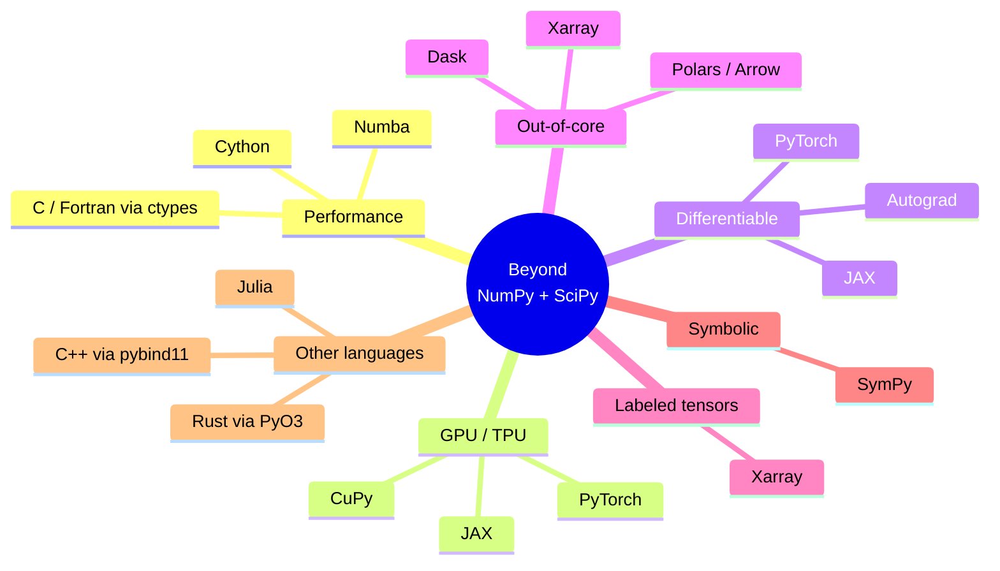

You now have the core scientific Python toolkit: NumPy, SciPy,
matplotlib, and the numerical thinking to use them well. This
final chapter is a map of where to go when those tools start to
strain — when you need to be faster, work on bigger data, target
GPUs, or differentiate through your simulation.

<svg
  viewBox="0 0 640 220"
  role="img"
  aria-label="From a single starting dot, three dotted routes pass small milestone pills and branch toward larger destination circles — a map of where to go after this course"
  style={{ display: "block", width: "100%", maxWidth: "640px", height: "auto", margin: "2.5rem auto" }}
>
  <g style={{ color: "var(--ds-blue-500)" }} fill="currentColor">
    <circle cx="90" cy="110" r="14" />
  </g>
  <g style={{ color: "var(--ds-white)" }} fill="currentColor">
    <circle cx="90" cy="110" r="5" />
  </g>
  <g fill="currentColor" opacity="0.3">
    <circle cx="150" cy="100" r="3.5" />
    <circle cx="210" cy="90" r="3.5" />
    <circle cx="330" cy="70" r="3.5" />
    <circle cx="390" cy="62" r="3.5" />
    <circle cx="450" cy="56" r="3.5" />
    <circle cx="150" cy="110" r="3.5" />
    <circle cx="210" cy="110" r="3.5" />
    <circle cx="330" cy="110" r="3.5" />
    <circle cx="390" cy="110" r="3.5" />
    <circle cx="450" cy="110" r="3.5" />
    <circle cx="150" cy="120" r="3.5" />
    <circle cx="210" cy="130" r="3.5" />
    <circle cx="330" cy="150" r="3.5" />
    <circle cx="390" cy="158" r="3.5" />
    <circle cx="450" cy="164" r="3.5" />
  </g>
  <g style={{ color: "var(--ds-green-500)" }} fill="currentColor">
    <rect x="256" y="73" width="30" height="14" rx="7" fillOpacity="0.4" />
    <polygon points="470,48 470,64 488,56" fillOpacity="0.8" />
    <circle cx="520" cy="52" r="16" />
  </g>
  <g style={{ color: "var(--ds-yellow-500)" }} fill="currentColor">
    <rect x="256" y="103" width="30" height="14" rx="7" fillOpacity="0.4" />
    <polygon points="470,102 470,118 488,110" fillOpacity="0.8" />
    <circle cx="520" cy="110" r="14" />
  </g>
  <g style={{ color: "var(--ds-blue-500)" }} fill="currentColor">
    <rect x="256" y="133" width="30" height="14" rx="7" fillOpacity="0.4" />
    <polygon points="470,160 470,176 488,168" fillOpacity="0.8" />
    <circle cx="520" cy="168" r="16" fillOpacity="0.75" />
  </g>
</svg>

## The landscape



You almost certainly do not need all of these. Pick the one that
matches the bottleneck you actually have.

## When NumPy code is too slow: Numba

Numba JIT-compiles a subset of Python to native code with a single
decorator. The killer use case: a tight Python loop that resists
vectorization (e.g. a stencil with data-dependent control flow).

<CodeBlock
  adapter="python"
  files={[
    {
      filename: "main.py",
      starterCode: `# Numba is not bundled with the in-browser Python.
# This snippet shows the pattern you would use in a local environment.

CODE = """
import numpy as np
from numba import njit

@njit(cache=True, fastmath=True)
def heat_step(u, alpha):
    new = u.copy()
    for i in range(1, u.shape[0]-1):
        for j in range(1, u.shape[1]-1):
            new[i, j] = u[i, j] + alpha * (
                u[i+1, j] + u[i-1, j] + u[i, j+1] + u[i, j-1] - 4*u[i, j]
            )
    return new

u = np.zeros((200, 200)); u[100, 100] = 1000.0
for _ in range(500):
    u = heat_step(u, 0.2)
"""
print(CODE)
print("Typical speedup over pure-Python loops: 100–500×.")
`,
    },
  ]}
/>

Numba shines when you have:

- An inner loop that NumPy can't easily vectorize
- A function called millions of times
- A willingness to stay in the *typed numeric* subset of Python

For everything else, profile first — `cProfile` plus a flame graph
will tell you whether you actually need a JIT.

## When you need a GPU: CuPy and JAX

**CuPy** is "NumPy with a `.cu` underneath" — almost the same API
running on NVIDIA GPUs. Drop-in replacement for many workflows:

```python
# import cupy as cp
# x = cp.random.normal(size=(10_000, 10_000))
# y = cp.linalg.svd(x)              # runs on the GPU
```

**JAX** goes further: NumPy-like API *plus* automatic
differentiation *plus* JIT compilation *plus* `vmap` for automatic
batching. Beloved in scientific ML and probabilistic programming.

<CodeBlock
  adapter="python"
  files={[
    {
      filename: "main.py",
      starterCode: `# JAX example (display only; JAX is not in the in-browser environment).
EXAMPLE = """
import jax.numpy as jnp
from jax import grad, jit, vmap

def loss(params, x, y):
    a, b, c = params
    return jnp.mean((a*x*x + b*x + c - y) ** 2)

grad_loss = jit(grad(loss))     # auto-differentiate AND compile

# vmap turns a scalar function into a vectorized one
predict = lambda p, x: p[0]*x*x + p[1]*x + p[2]
batch_predict = vmap(predict, in_axes=(None, 0))
"""
print(EXAMPLE)
`,
    },
  ]}
/>

If you ever found yourself hand-deriving gradients of a simulation
or fitting a model to data, JAX is worth a serious afternoon.

## When you need to differentiate through *anything*: autodiff

Automatic differentiation is the single biggest shift in scientific
computing of the past decade. Instead of writing finite differences
or symbolic gradients, you write the *forward* computation in JAX
or PyTorch and the framework gives you exact gradients,
Jacobians, and Hessians for free.

Applications go far beyond machine learning:

- **Inverse problems** — fit physics models to data by gradient
  descent on the simulator
- **Optimal control** — differentiate through an ODE rollout to
  find the best control inputs
- **Sensitivity analysis** — quantify how outputs change with
  inputs in high dimensions
- **Variational inference** — gradient-based probabilistic
  programming (`numpyro`, `pyro`, `blackjax`)

## When data is bigger than RAM: Dask and friends

**Dask** parallelizes NumPy- and pandas-like computations across
chunks that live on disk or across a cluster. The API mirrors what
you already know, so adopting it incrementally is realistic.

```python
# import dask.array as da
# x = da.from_zarr("huge_dataset.zarr", chunks=(1000, 1000))
# mean_per_row = x.mean(axis=1).compute()
```

**Xarray** adds *labeled* dimensions (time, latitude, etc.) to
N-D arrays — the natural way to handle climate, geospatial, or
medical-imaging data without losing the axis semantics. It plays
beautifully with Dask for out-of-core workflows.

## When you want symbolic math: SymPy

Numerical methods are not the only kind of computing. Sometimes
you really do want a closed-form derivative, an exact integral,
or a simplified equation. **SymPy** is Python's computer algebra
system.

<CodeBlock
  adapter="python"
  files={[
    {
      filename: "main.py",
      starterCode: `import sympy as sp

x = sp.symbols("x")
expr = sp.sin(x) * sp.exp(-(x**2))
print("expression :", expr)
print("derivative :", sp.diff(expr, x))
print("series at 0:", sp.series(expr, x, 0, 6))

# Solve an equation symbolically
y = sp.symbols("y")
print("solutions to x² + y² = 1, y > 0:", sp.solve([x**2 + y**2 - 1, y > 0], y))

# Convert a symbolic expression to a fast NumPy function
f_num = sp.lambdify(x, sp.diff(expr, x), modules="numpy")
import numpy as np

print("derivative at x=1:", f_num(1.0))
`,
    },
  ]}
/>

The killer combo: derive a complicated formula symbolically with
SymPy, then `lambdify` it into a NumPy-callable function for the
hot numerical loop.

## When Python isn't the right language

Sometimes the right answer is "use a different language for the
hot kernel". Three high-quality options:

- **Julia** — designed from the ground up for scientific
  computing; JIT compiled, multiple dispatch, very strong ODE and
  optimization ecosystems (`DifferentialEquations.jl`,
  `JuMP.jl`).
- **C++ via `pybind11`** — when you need ultimate control,
  zero-cost abstractions, and access to mature libraries (Eigen,
  Boost).
- **Rust via PyO3** — increasingly popular for fast,
  memory-safe extensions and for projects where parallelism and
  safety both matter.

Resist the urge to rewrite *everything*. The pragmatic move is to
profile your Python code, find the one or two functions that
dominate the runtime, and rewrite *those*.

## A learning roadmap

Now that you've finished this course, a sensible next study order
depending on your interests:

| If you want to... | Go to... |
| --- | --- |
| Differentiate simulations & ML/scientific computing | JAX |
| Train neural networks | PyTorch |
| Speed up loops without leaving Python | Numba |
| Process datasets larger than RAM | Dask + Xarray |
| Solve symbolic problems | SymPy |
| Be production-grade fast end-to-end | Julia |
| Build the world's fastest dataframes | Polars + Arrow |
| Do statistics properly | StatsModels / PyMC / NumPyro |
| Work on geospatial / climate data | Xarray + GeoPandas + Rasterio |

## A final principle

Scientific computing rewards three habits more than any others:

1. **Understand the math first.** No library, no JIT, no GPU
   will save you from a poorly posed problem.
2. **Vectorize and profile before optimizing.** Most "slow" code
   is slow for one obvious reason that a 30-second profile
   reveals.
3. **Make it reproducible from day one.** The cost of seeds,
   manifests, and pinned environments is hours; the cost of *not*
   having them is months.

The rest is craft, and craft compounds. Build something. Break
it. Profile it. Visualize it. Share it. Repeat. The community of
people who do scientific computing well is generous and curious,
and now you are one of them.

## Check your understanding

<MultipleChoice
  markdown={`Your simulation loops over $10^6$ time steps with a Python \`for\` loop containing data-dependent branching that resists vectorization. Profiling shows 95% of time is in that loop. What is the most appropriate first tool to reach for?

- Rewrite the entire project in Julia
  > Rewriting an entire project in a different language is a high-cost, high-risk option; the page recommends profiling first and applying the cheapest fix, not wholesale rewrites.
- [o] Add a \`@numba.njit\` decorator to the inner-loop function
  > Numba is purpose-built for the case "tight numeric Python loop that NumPy can't easily vectorize". A decorator and zero structural change typically buy you 100–500× speedup. Reaching for a different language or a GPU is overkill when the bottleneck is a single function.
- Buy a more expensive CPU
  > Hardware upgrades give at most a small constant-factor improvement and do not address the root cause: the interpreter overhead of a pure-Python loop.
- Increase the size of arrays
  > Larger arrays would make the simulation take even longer, not faster; the bottleneck is the interpreter overhead per iteration, not array size.

Profile first, then apply the cheapest tool that fixes the actual bottleneck.`}
/>

<MultipleChoice
  markdown={`You want to fit a physics simulator's parameters to experimental data by gradient descent. The simulator is written as a smooth NumPy function. Which ecosystem makes this most natural?

- Pure NumPy with finite-difference gradients
  > Finite-difference gradients require $O(n)$ extra simulator evaluations per gradient step and introduce truncation error; automatic differentiation gives exact gradients at a fraction of the cost.
- [o] JAX, which provides automatic differentiation, JIT compilation, and a NumPy-compatible API — so gradients of arbitrary simulations come "for free"
  > The whole point of JAX (and frameworks like PyTorch) is to remove the need to derive gradients manually or approximate them with finite differences. You write the forward simulator in \`jax.numpy\`, wrap with \`grad\`, and you have exact, fast derivatives suitable for high-dimensional optimization or inference.
- SymPy, which symbolically integrates the ODE
  > SymPy can solve simple ODEs symbolically, but a physics simulator with complex dynamics generally has no closed-form solution; SymPy cannot differentiate through a numerical simulator.
- Dask, which parallelizes the loop
  > Dask parallelizes data operations across chunks or workers but does not provide automatic differentiation; parallelism helps throughput but not gradient computation.

Autodiff frameworks (JAX, PyTorch, Autograd) have become the standard tool whenever you need gradients of a numerical program.`}
/>
