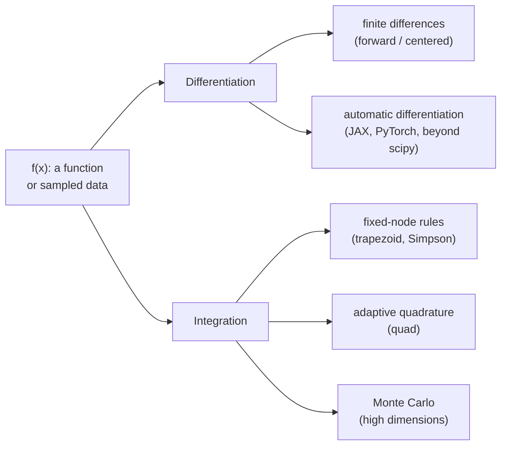

Real scientific problems rarely have closed-form integrals or
analytic derivatives. The temperature profile in a reactor, the
drag on an airfoil, the cumulative dose of a drug, all are defined
by *data* or by integrals nobody has solved on paper. **Numerical
calculus** turns those problems into arithmetic.

This chapter covers the two pillars: numerical **differentiation**
and numerical **integration** (quadrature), together with how to
think about their accuracy.

<Figure
  slug="scipy-numerical-calculus-cutout"
  alt="A curve on a platform with a small secant ramp resting on two nearby points, and thin vertical slabs filling the area beneath"
/>

## The big picture

Differentiation in finite precision is *ill-conditioned*, you are
subtracting nearby numbers. Integration is *well-conditioned*,
errors average out. This asymmetry shapes every algorithm below.

## Finite differences

The definition $f'(x) = \lim_{h\to 0} (f(x+h)-f(x))/h$ suggests we
just pick a small $h$. In floating point, two things fight:

- **Truncation error** decreases as $h$ shrinks (the formula gets
  more accurate)
- **Round-off error** *increases* as $h$ shrinks (subtraction of
  nearby numbers loses digits)

<Figure
  slug="scipy-numerical-calculus-finite-differences-inline-cutout"
  alt="Two points on a curve joined by a straight rod, the rod's slope measured"
  caption="A derivative is estimated from the slope between two nearby points."
/>

The optimal $h$ is a *balance*. For the forward difference
$f'(x)\approx (f(x+h)-f(x))/h$, the sweet spot is around
$h \approx \sqrt{\epsilon_\text{mach}} \approx 10^{-8}$.

<CodeBlock
  adapter="python"
  files={[
    {
      filename: "main.py",
      starterCode: `import numpy as np
import matplotlib.pyplot as plt

def f(x):
    return np.sin(x)

true = np.cos(1.0)  # exact derivative of sin at x = 1

hs = np.logspace(-16, 0, 200)
err_fwd = [abs((f(1 + h) - f(1)) / h - true) for h in hs]
err_cent = [abs((f(1 + h) - f(1 - h)) / (2 * h) - true) for h in hs]

plt.loglog(hs, err_fwd, label="forward  O(h)")
plt.loglog(hs, err_cent, label="centered O(h²)")
plt.axvline(
    np.sqrt(np.finfo(float).eps), color="r", ls="--", label="√ε  (best h for forward)"
)
plt.xlabel("step size h")
plt.ylabel("|error|")
plt.title("V-shape: truncation vs round-off")
plt.legend()
plt.grid(True, which="both", alpha=0.3)
plt.show()
`,
    },
  ]}
/>

Two lessons:

- The **centered difference** is one order more accurate ($O(h^2)$
  vs $O(h)$) for the same cost.
- The optimal $h$ is *not* "as small as possible". Going below
  $10^{-8}$ makes things *worse*.

For most production work, use `scipy.differentiate.derivative`
(modern SciPy) or `numpy.gradient` for sampled data.

<CodeBlock
  adapter="python"
  files={[
    {
      filename: "main.py",
      starterCode: `import numpy as np

# Numerical gradient on sampled data
x = np.linspace(0, 2 * np.pi, 200)
y = np.sin(x)
dy = np.gradient(y, x)  # centered differences, 2nd-order accurate
print("Max error vs true cos(x):", np.max(np.abs(dy - np.cos(x))))
`,
    },
  ]}
/>

`np.gradient` uses second-order centered differences in the
interior and second-order one-sided at the boundaries. This is the
right tool when all you have is a *table* of values.

## Quadrature: integration as a weighted sum

Every integration rule has the form
$\int_a^b f(x)\,dx \approx \sum_i w_i\, f(x_i)$, pick nodes $x_i$
and weights $w_i$, multiply, add. The art is in choosing them.

| Rule | Nodes | Error on smooth $f$ |
| --- | --- | --- |
| Trapezoid | equispaced | $O(h^2)$ |
| Simpson | equispaced | $O(h^4)$ |
| Gauss–Legendre ($n$ points) | optimal | exact for polynomials up to degree $2n-1$ |
| Adaptive (`quad()`) | refined where $f$ wiggles | error-controlled |

<CodeBlock
  adapter="python"
  files={[
    {
      filename: "main.py",
      starterCode: `import numpy as np
from scipy import integrate

def f(x):
    return np.exp(-(x**2)) * np.cos(3 * x)

# Sampled-data rules
x = np.linspace(0, 4, 1001)
y = f(x)
print(f"Trapezoid : {np.trapezoid(y, x):.10f}")
print(f"Simpson   : {integrate.simpson(y, x=x):.10f}")

# Adaptive quadrature with error estimate
val, err = integrate.quad(f, 0, 4)
print(f"quad      : {val:.10f}   (error ≤ {err:.2e})")

# 32-point Gauss-Legendre
val_g, _ = integrate.fixed_quad(f, 0, 4, n=32)
print(f"Gauss(32) : {val_g:.10f}")
`,
    },
  ]}
/>

Notice `quad()` returns both the value *and* an error estimate.
This is the right tool for general one-dimensional integrals: it
adaptively refines around peaks and singularities until the
estimated error is below the requested tolerance.

## Handling singular and oscillatory integrands

<CodeBlock
  adapter="python"
  files={[
    {
      filename: "main.py",
      starterCode: `import numpy as np
from scipy import integrate

# Integrable singularity at x = 0
def g(x):
    return np.log(x) / np.sqrt(x)

val, err = integrate.quad(g, 0, 1)
print(f"∫₀¹ ln(x)/√x dx ≈ {val:.8f}   (analytic = -4)   err≤{err:.1e}")

# Highly oscillatory integrand: tell quad about the frequency
def h(x):
    return np.sin(50 * x) / (1 + x**2)

val2, err2 = integrate.quad(h, 0, 100, limit=200)
print(f"oscillatory : {val2:.6f}   err≤{err2:.1e}")
`,
    },
  ]}
/>

`quad()` is robust enough to handle integrable singularities and
moderately oscillatory integrands. For truly oscillatory cases,
SciPy offers specialized routines like `quad()` with the `weight`
argument set to `"sin"` or `"cos"`.

## Multidimensional integration

For 2-D and 3-D, deterministic rules still work:

<CodeBlock
  adapter="python"
  files={[
    {
      filename: "main.py",
      starterCode: `import numpy as np
from scipy import integrate

# Volume under f(x,y) = exp(-(x²+y²)) over the unit square
val, err = integrate.dblquad(
    lambda y, x: np.exp(-(x**2 + y**2)),
    0,
    1,  # x bounds
    lambda x: 0,
    lambda x: 1,  # y bounds depend on x
)
print(f"dblquad: {val:.8f}   err≤{err:.1e}")
`,
    },
  ]}
/>

But cost explodes: a rule that uses $n$ nodes per axis costs $n^d$
total. Beyond 4-5 dimensions, switch to **Monte Carlo**, whose
error scales as $1/\sqrt{N}$ regardless of dimension (we devote a
whole chapter to it later).

<Figure
  slug="scipy-numerical-calculus-big-picture-inline-cutout"
  alt="A curve with thin rectangles fitted under it and a straight rod resting tangent at one point"
  caption="An integral is estimated by fitting simple shapes under the curve."
/>

## A multi-file calculus toolkit

<CodeBlock
  adapter="python"
  entryFilename="main.py"
  files={[
    {
      filename: "main.py",
      starterCode: `import numpy as np
from calc import centered_diff, adaptive_simpson

def f(x):
    return np.sin(x) * np.exp(-0.1 * x)

# Compare derivatives at a single point
x0 = 1.5
print(f"f'({x0}) numeric  : {centered_diff(f, x0):.10f}")
true = np.cos(x0) * np.exp(-0.1 * x0) - 0.1 * np.sin(x0) * np.exp(-0.1 * x0)
print(f"f'({x0}) analytic : {true:.10f}")

# Integrate from 0 to 10 to a relative tolerance
val = adaptive_simpson(f, 0, 10, tol=1e-10)
print(f"\\n∫₀¹⁰ f dx ≈ {val:.10f}")
`,
    },
    {
      filename: "calc.py",
      starterCode: `import numpy as np

def centered_diff(f, x, h=None):
    """Centered finite difference at near-optimal step size."""
    if h is None:
        h = np.cbrt(np.finfo(float).eps) * max(abs(x), 1.0)
    return (f(x + h) - f(x - h)) / (2 * h)

def _simpson(f, a, b, fa, fb, fm):
    m = (a + b) / 2
    return (b - a) / 6 * (fa + 4 * fm + fb)

def adaptive_simpson(f, a, b, tol=1e-8):
    """Recursive adaptive Simpson's rule."""
    fa, fb = f(a), f(b)
    fm = f((a + b) / 2)
    S = _simpson(f, a, b, fa, fb, fm)

    def helper(a, b, fa, fb, fm, S, tol):
        m = (a + b) / 2
        flm = f((a + m) / 2)
        frm = f((m + b) / 2)
        SL = _simpson(f, a, m, fa, fm, flm)
        SR = _simpson(f, m, b, fm, fb, frm)
        if abs(SL + SR - S) <= 15 * tol:
            return SL + SR + (SL + SR - S) / 15
        return helper(a, m, fa, fm, flm, SL, tol / 2) + helper(
            m, b, fm, fb, frm, SR, tol / 2
        )

    return helper(a, b, fa, fb, fm, S, tol)
`,
    },
  ]}
/>

Adaptive Simpson is a beautiful 20-line algorithm: it estimates
its own error by comparing one Simpson's rule against the sum of
two half-interval Simpson rules, and recurses only where the
disagreement exceeds the tolerance. SciPy's `quad()` is a much more
sophisticated relative, but the idea is the same.

<Figure
  slug="scipy-numerical-calculus-inline-cutout"
  alt="A curve with a row of thin rectangles fitted under it, and a straight rod resting tangent against one point of the curve"
  caption="Differentiate by slopes, integrate by areas: both are approximations."
/>

## Challenge: estimate $\pi$ by integration

<ChallengeCard
  adapter="python"
  title="Compute π by quadrature"
  instructions={`Recall that $\\int_\{-1\}^\{1\} \\sqrt\{1 - x^2\}\\,dx = \\pi/2$ (area of a half-disk of radius 1).

Implement \`estimate_pi()\` using \`scipy.integrate.quad\` on the appropriate integrand. Return the estimate of $\\pi$ (not $\\pi/2$).

Your answer should agree with \`math.pi\` to at least 10 decimal places.`}
  files={[
    {
      filename: "main.py",
      starterCode: `import numpy as np
from scipy import integrate

def estimate_pi():
    # TODO: integrate sqrt(1 - x**2) from -1 to 1 and return 2 * value
    return 0.0
`,
      solutionCode: `import numpy as np
from scipy import integrate

def estimate_pi():
    val, _ = integrate.quad(lambda x: np.sqrt(1 - x**2), -1.0, 1.0)
    return 2.0 * val
`,
    },
  ]}
  tests={[
    {
      id: "value",
      name: "Within 1e-10 of math.pi",
      code: "import math\nassert abs(estimate_pi() - math.pi) < 1e-10",
    },
    {
      id: "type",
      name: "Returns a float",
      code: "assert isinstance(estimate_pi(), float)",
    },
  ]}
/>

## Check your understanding

<MultipleChoice
  markdown={`You compute $f'(x_0)$ by forward differences and try ever-smaller step sizes $h$. The error first *decreases* but eventually starts *increasing* as $h \\to 0$. Why?

- The compiler reorders operations
  > Python does not compile the arithmetic in a way that would reorder the subtraction; the increasing error at small $h$ is the predictable result of subtracting nearly equal floats.
- Python's float type uses arbitrary precision so the rounding only happens at the end
  > Python's \`float\` is a standard 64-bit IEEE 754 double; it is not arbitrary precision. Libraries like \`mpmath\` provide arbitrary precision, but the built-in \`float\` rounds at every operation.
- The CPU clock skew accumulates
  > CPU clock variation affects timing measurements, not floating-point arithmetic; the degradation in finite-difference accuracy is caused by cancellation in the subtraction, not by hardware timing.
- [o] Subtracting $f(x_0+h)$ and $f(x_0)$ loses significant digits when the values are nearly equal, so round-off error dominates for tiny $h$
  > Truncation error scales as $O(h)$, but round-off in the numerator scales as $\\epsilon/h$. Their sum is minimized near $h\\approx\\sqrt\{\\epsilon\}\\approx 10^\{-8\}$.

This V-shaped error curve is the single most important plot to remember about numerical differentiation.`}
/>

<MultipleChoice
  markdown={`Why does \`scipy.integrate.quad\` return *both* a value and an estimated error bound?

- [o] It uses an adaptive algorithm that already computes two different approximations on every sub-interval and uses their difference as a built-in error estimator
  > Adaptive quadrature compares two rules of different orders on the same interval; their difference both drives subdivision and serves as a free, reliable error estimate. Returning it lets you decide whether the answer is trustworthy.
- The error is the variance of the integrand
  > The variance of the integrand is related to Monte Carlo error, not quadrature error; the error bound returned by \`quad()\` is an estimate of the absolute integration error, not a statistical variance.
- It needs the error to log it
  > The function returns the error estimate as a value for the caller to inspect, not for internal logging; the page explains that the adaptive algorithm produces it as a byproduct.
- Returning the error is required by the IEEE standard
  > The IEEE 754 standard covers floating-point arithmetic operations; it says nothing about the return type of integration routines.

Always check the reported error, it costs nothing extra and tells you whether to tighten tolerances.`}
/>
