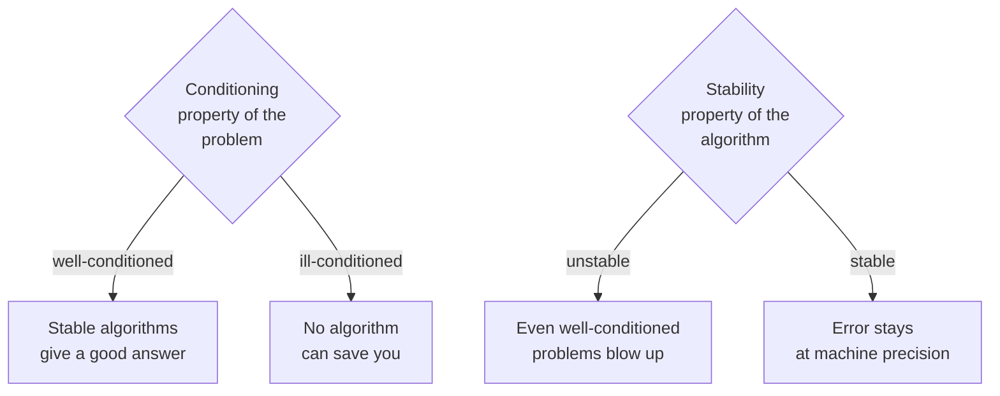

The previous chapter showed that every floating-point operation
carries a tiny error. This chapter asks the deeper question: *what
happens when you chain millions of them together?*

<Figure
  slug="scipy-stability-cutout"
  alt="A tiny nudge at the input end of a lever amplifying into a huge swing at its far end on a platform"
/>

The answer depends on two independent properties:

- **Conditioning** is a property of the *problem*. A problem is
  *well-conditioned* if small input changes cause small output
  changes. *Ill-conditioned* problems amplify error no matter how
  cleverly you compute.
- **Stability** is a property of the *algorithm*. A *stable*
  algorithm produces an answer that is the correct answer to a
  slightly perturbed problem. An *unstable* algorithm produces
  garbage even on well-conditioned problems.

<Figure
  slug="scipy-numerical-stability-inline-cutout"
  alt="Two chains of the same small operations, the near one ending with a block still on its mark and the far one ending far off it"
/>

You always need to ask both questions.

## Conditioning, intuitively

If $f$ is a function and you evaluate $f(x + \delta x)$ for small
$\delta x$, how big is $f(x + \delta x) - f(x)$? The ratio of
*relative* output change to *relative* input change is the
**condition number** of $f$ at $x$.

For evaluating $f$:

$$ \kappa_f(x) \approx \left| \frac{x f'(x)}{f(x)} \right| $$

For a linear system $A x = b$:

$$ \kappa(A) = \|A\| \, \|A^{-1}\| $$

A condition number near $1$ is excellent. A condition number near
$1/\epsilon \approx 10^{16}$ means **no algorithm can give you more
than a couple of correct bits**.

<CodeBlock
  adapter="python"
  files={[
    {
      filename: "main.py",
      starterCode: `import numpy as np

# Conditioning of evaluating sin(x) near a root, e.g. near pi
def cond_sin(x):
    return abs(x * np.cos(x) / np.sin(x))

for x in [0.5, 1.0, 1.5, 3.1, 3.14, 3.1415]:
    print(f"x = {x:8.5f}   κ_sin = {cond_sin(x):8.3e}")
`,
    },
  ]}
/>

Near $x = \pi$, $\sin(x)$ is nearly zero, so the relative output
change for a tiny input change is enormous. Evaluating $\sin$ near
a root is *intrinsically* ill-conditioned, there is no clever
algorithm that fixes this.

## Stability, intuitively

An algorithm is **backward stable** if the result it returns is the
*exact* answer to a *slightly different* problem. The standard
example is Gaussian elimination with partial pivoting: the answer
you get to $Ax = b$ is the exact answer to $(A + E)x = b$, with
$\|E\| / \|A\| = O(\epsilon)$. That is the best you could possibly
hope for at finite precision.

An algorithm is **unstable** if it can produce arbitrarily wrong
answers on well-conditioned problems. The classic example: solving
a $2\times2$ linear system with Cramer's rule on a matrix whose
determinant is near zero but well-conditioned.

Let us watch both happen.

<CodeBlock
  adapter="python"
  files={[
    {
      filename: "main.py",
      starterCode: `import numpy as np

# A 2x2 system  Ax = b  that is well-conditioned
A = np.array([[1.0, 1.0], [1.0, 1.0 + 1e-13]])
b = np.array([2.0, 2.0 + 2e-13])
true_x = np.array([1.0, 1.0])

# Stable algorithm: NumPy uses LAPACK with partial pivoting
x_solve = np.linalg.solve(A, b)
print("solve  :", x_solve, "  error =", np.linalg.norm(x_solve - true_x))

# Unstable algorithm: invert and multiply
x_inv = np.linalg.inv(A) @ b
print("inv@b  :", x_inv, "  error =", np.linalg.norm(x_inv - true_x))

# Cramer's rule
def cramer(A, b):
    d = A[0, 0] * A[1, 1] - A[0, 1] * A[1, 0]
    x0 = (b[0] * A[1, 1] - b[1] * A[0, 1]) / d
    x1 = (A[0, 0] * b[1] - A[1, 0] * b[0]) / d
    return np.array([x0, x1])

x_c = cramer(A, b)
print("cramer :", x_c, "  error =", np.linalg.norm(x_c - true_x))

print("\\ncondition number κ(A) =", np.linalg.cond(A))
`,
    },
  ]}
/>

The condition number $\kappa(A) \approx 4 \times 10^{13}$ tells us
we have lost roughly 13 digits of precision *no matter what*.
`solve` recovers the remaining 3 digits cleanly; `inv` is acceptable
but worse; `cramer` is the worst of the three because it does
extra cancellation. None of them can do better than $\kappa$ allows.

## A canonical instability: forward vs backward recursion

Consider the integrals

$$ I_n = \int_0^1 \frac{x^n}{x + 10} \, dx $$

These satisfy a tidy recurrence $I_n = \frac{1}{n} - 10 \, I_{n-1}$
with $I_0 = \ln(1.1)$. The forward recurrence is *numerically
unstable*, every step multiplies the error by $-10$, even though
the integrals themselves are perfectly well-defined small positive
numbers.

<CodeBlock
  adapter="python"
  files={[
    {
      filename: "main.py",
      starterCode: `import math

# Forward recurrence (UNSTABLE)
I = math.log(1.1)
print("Forward (I_n = 1/n - 10*I_{n-1}):")
for n in range(1, 20):
    I = 1 / n - 10 * I
    print(f"  I_{n:2d} = {I:+.5e}")
`,
    },
  ]}
/>

The recursion produces *negative* values, then enormous oscillations,
all wrong. The integrand is positive and the integral has to be
less than $1/(10n)$. The error introduced at step 1 is multiplied
by 10 at every later step.

The cure: run the recurrence *backwards*, where the multiplier is
$1/10$ instead of $10$. Start from a guess at large $n$, even a
wildly wrong guess, and iterate downward. The error *shrinks* by
$10$ per step.

<CodeBlock
  adapter="python"
  files={[
    {
      filename: "main.py",
      starterCode: `# Backward recurrence (STABLE), starting from an arbitrary guess at n = 40
N = 40
I = 0.0  # any starting guess
for n in range(N, 0, -1):
    I = (1 / n - I) / 10
print(f"Backward result: I_0 = {I:.10f}  (true {0.0953101798:.10f})")

import math

print(f"Reference ln(1.1) = {math.log(1.1):.10f}")
`,
    },
  ]}
/>

Same equation. *Same data.* Two algorithms; one is useless, the
other is correct to all 16 digits. **This is the entire content of
"numerical stability."**

## Norms, error bounds, and "how wrong can it be?"

In numerical linear algebra, we measure error with **norms**. The
most useful identities are:

| Quantity | Symbol | Use |
| --- | --- | --- |
| Vector 2-norm | $\lVert v \rVert_2$ | Euclidean length |
| Matrix induced 2-norm | $\lVert A \rVert_2$ | Largest stretch factor |
| Frobenius norm | $\lVert A \rVert_F$ | Square root of sum of squares |
| Condition number | $\kappa(A) = \lVert A \rVert \lVert A^{-1} \rVert$ | Error amplification |

For $A x = b$, the relative error in $x$ is bounded by:

$$
\frac{\lVert \hat x - x \rVert}{\lVert x \rVert}
   \;\le\; \kappa(A) \left(
      \frac{\lVert \delta A \rVert}{\lVert A \rVert}
    + \frac{\lVert \delta b \rVert}{\lVert b \rVert}
   \right)
$$

A condition number of $10^{14}$ and a perturbation of $10^{-16}$
gives a relative output error of $10^{-2}$, two correct digits.
That number is your **truth ceiling**, set by the *problem*, not
the *algorithm*.

<CodeBlock
  adapter="python"
  files={[
    {
      filename: "main.py",
      starterCode: `import numpy as np

# A Hilbert matrix is a famous ill-conditioned problem
def hilbert(n):
    i, j = np.indices((n, n))
    return 1.0 / (i + j + 1)

for n in [5, 8, 10, 12, 15]:
    H = hilbert(n)
    x_true = np.ones(n)
    b = H @ x_true
    x_hat = np.linalg.solve(H, b)
    err = np.linalg.norm(x_hat - x_true) / np.linalg.norm(x_true)
    kappa = np.linalg.cond(H)
    print(f"n={n:3d}  κ={kappa:.2e}  relative error = {err:.2e}")
`,
    },
  ]}
/>

Watch how the relative error scales with $\kappa$. Once
$\kappa(H) > 10^{16}$, you have lost all your precision.

## Designing stable algorithms

A handful of rules turn most numerical code from fragile to robust.

1. **Avoid subtracting nearly equal numbers.** Rewrite the formula
   if you can (the `1 - cos x` example), or compute in higher
   precision.
2. **Sum in increasing order of magnitude**, or use a compensated
   sum like Kahan summation, when adding many tiny contributions.
3. **Prefer factorizations over inverses.** `np.linalg.solve(A, b)`
   beats `np.linalg.inv(A) @ b` *every* time.
4. **Scale your inputs.** If one column of your matrix has values
   in $[10^{-9}]$ and another in $[10^{9}]$, condition number
   explodes for no real reason; rescale them.
5. **Pick algorithms with proven backward error bounds.** LAPACK,
   SciPy, Eigen, and PETSc routines all come with these. Custom
   code usually does not.

Here is a beautiful illustration of point 2, Kahan summation
recovers most of the digits a naive sum throws away.

<CodeBlock
  adapter="python"
  files={[
    {
      filename: "main.py",
      starterCode: `import numpy as np
import math

# Sum a million numbers, each ~1e-10
n = 1_000_000
xs = np.full(n, 1.0 / n, dtype=np.float64)

naive = 0.0
for x in xs:
    naive += x

def kahan(xs):
    s, c = 0.0, 0.0
    for x in xs:
        y = x - c
        t = s + y
        c = (t - s) - y
        s = t
    return s

print(f"true             = 1.0")
print(f"naive sum        = {naive!r}")
print(f"Kahan sum        = {kahan(xs)!r}")
print(f"numpy sum        = {xs.sum()!r}")  # numpy uses pairwise summation
`,
    },
  ]}
/>

NumPy's `.sum()` uses *pairwise summation*, which is much better
than a naive left-to-right loop and almost as good as Kahan, for a
fraction of the cost. **Trust the library**; reach for Kahan only
when you really need it.

## Check your understanding

<MultipleChoice
  markdown={`A problem has condition number $\\kappa \\approx 10^\{12\}$. You compute the answer with a backward-stable algorithm at 64-bit precision. Roughly how many correct decimal digits should you expect?

- All 16
  > Retaining all 16 digits would require the condition number to be near 1; with $\\kappa \\approx 10^{12}$ the condition number itself erases roughly 12 digits.
- [o] About 4
  > The truth ceiling is roughly $\\kappa \\cdot \\epsilon \\approx 10^\{12\} \\cdot 10^\{-16\} = 10^\{-4\}$, i.e. $\\sim 4$ correct digits. A *stable* algorithm achieves this; an *unstable* one would get fewer.
- Zero, the problem is unsolvable
  > With $\\kappa \\approx 10^{12}$ the problem still has roughly 4 correct digits available; only when $\\kappa \\gtrsim 10^{16}$ does the problem become hopeless at double precision.
- About 12
  > Twelve correct digits would remain if only 4 digits were lost, but the condition number $\\kappa \\approx 10^{12}$ consumes 12 of the 16 available digits, leaving about 4.

The condition number tells you the **best** an algorithm can hope to achieve.`}
/>

<MultipleChoice
  markdown={`Which statement most cleanly distinguishes *conditioning* from *stability*?

- Conditioning is about speed and stability is about accuracy
  > Neither concept is about speed; both are about accuracy, but conditioning characterizes how much accuracy the problem itself allows, while stability describes how well the algorithm preserves that accuracy.
- [o] Conditioning is a property of the **problem**; stability is a property of the **algorithm**. An ill-conditioned problem cannot be saved by a clever algorithm; an unstable algorithm can ruin a perfectly well-conditioned problem
  > This is the central distinction in numerical analysis. Always ask both questions: "Is this problem well-conditioned?" and "Is this algorithm stable?"
- They mean the same thing
  > The page opens by explicitly defining these as two independent properties: conditioning belongs to the problem, stability belongs to the algorithm.
- Both are properties of the algorithm
  > Stability is a property of the algorithm, but conditioning is a property of the *problem*; the distinction is central to numerical analysis.

Mixing the two concepts is one of the most common mistakes beginners make.`}
/>
