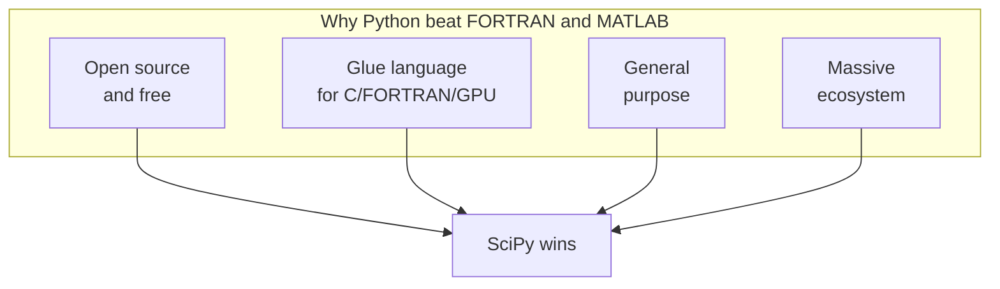

The first decade of computational science was written in *machine
code*, each instruction wired by hand or punched on cards. By the
mid-1950s the volume of scientific code had outgrown what anyone
could hand-tune, and a radical idea took hold: a scientist should
write the *formula they meant*, and a translator program should
produce the machine code. That idea gave us FORTRAN, then MATLAB,
and finally the scientific Python stack you are running right now.
This chapter is that lineage — three languages, one continuous idea.

<svg
  viewBox="0 0 640 220"
  role="img"
  aria-label="A solid blue hub links by thin lines to a formula card, a data grid card, and a rising chart card — Python sitting at the center of scientific work, gluing math, data, and plots together"
  style={{ display: "block", width: "100%", maxWidth: "640px", height: "auto", margin: "2.5rem auto" }}
>
  <g stroke="var(--ds-gray-300)" strokeWidth="2.5" strokeLinecap="round">
    <line x1="293" y1="95" x2="222" y2="72" />
    <line x1="293" y1="125" x2="222" y2="152" />
    <line x1="352" y1="110" x2="428" y2="110" />
  </g>
  <g style={{ color: "var(--ds-blue-500)" }} fill="currentColor">
    <circle cx="320" cy="110" r="30" />
  </g>
  <g style={{ color: "var(--ds-green-500)" }} fill="currentColor">
    <rect x="90" y="30" width="130" height="64" rx="12" fillOpacity="0.12" />
    <rect x="108" y="48" width="50" height="8" rx="4" />
    <rect x="108" y="66" width="80" height="8" rx="4" />
  </g>
  <g style={{ color: "var(--ds-yellow-500)" }} fill="currentColor">
    <rect x="90" y="130" width="130" height="64" rx="12" fillOpacity="0.16" />
    <rect x="110" y="144" width="14" height="14" rx="3" />
    <rect x="132" y="144" width="14" height="14" rx="3" />
    <rect x="154" y="144" width="14" height="14" rx="3" />
    <rect x="110" y="166" width="14" height="14" rx="3" />
    <rect x="132" y="166" width="14" height="14" rx="3" />
    <rect x="154" y="166" width="14" height="14" rx="3" />
  </g>
  <g style={{ color: "var(--ds-green-500)" }} fill="currentColor">
    <rect x="430" y="70" width="130" height="80" rx="12" fillOpacity="0.12" />
    <rect x="450" y="118" width="14" height="20" rx="4" />
    <rect x="472" y="104" width="14" height="34" rx="4" />
    <rect x="494" y="90" width="14" height="48" rx="4" />
  </g>
</svg>

## FORTRAN: scientists' first compiler

<IllustrationPrompt subject="John Backus" photo />

A team led by **John Backus** at IBM started work on FORTRAN — the
**FOR**mula **TRAN**slator — in 1954 and released the first compiler
in 1957 for the IBM 704. The goal was radical for its time: a
scientist should write `Y(I) = A * X(I) + B` in a loop and have the
compiler generate machine code as efficient as hand-written
assembly. Backus argued that without that efficiency, no one would
have used the language — and he was right. It became the first widely
used high-level language, and programs that once took weeks to
hand-code could now be written in an afternoon.

That choice still reaches into your browser. NumPy's `@` operator
dispatches to a routine called **DGEMM** in the BLAS library —
FORTRAN-lineage code, hand-tuned for every generation of CPU since
the 1970s. LAPACK and BLAS, both rooted in FORTRAN, sit under
virtually every NumPy and SciPy install.

<CodeBlock
  adapter="python"
  files={[
    {
      filename: "main.py",
      initCode: `import numpy as np
import time`,
      starterCode: `n = 1500
A = np.random.default_rng(0).standard_normal((n, n))
B = np.random.default_rng(1).standard_normal((n, n))

t0 = time.perf_counter()
C = A @ B  # dispatches to BLAS DGEMM
t1 = time.perf_counter()

flops = 2 * n**3  # multiply-add count for an n x n matmul
gflops = flops / (t1 - t0) / 1e9
print(f"{n}x{n} matmul: {t1 - t0:.3f}s -> {gflops:.1f} GFLOPS")
`,
    },
  ]}
/>

The GFLOPS your browser reports are delivered by a stack that is
roughly: NumPy (Python) → BLAS (C wrapper) → LAPACK (FORTRAN) → CPU
vector instructions. Sixty years of optimization, hidden behind a
single `@`. Three FORTRAN ideas survive almost unchanged: **arrays
as the primary data type**, **fast numerical inner loops**, and
**shared standard libraries** (BLAS, LAPACK, ODEPACK, MINPACK — still
the workhorses inside SciPy).

## MATLAB: a calculator that thought in matrices

<IllustrationPrompt subject="Cleve Moler" photo />

In the late 1970s, **Cleve Moler** was teaching numerical analysis at
the University of New Mexico. He wanted students to use the new
FORTRAN libraries LINPACK and EISPACK *without* having to learn
FORTRAN, so he wrote a tiny interactive program that let them type
expressions like `A * x` and `eig(A)` at a prompt. He called it
**MATLAB** — "matrix laboratory." By 1984 it had been rewritten in
C, commercialized by MathWorks, and was on its way to becoming the
lingua franca of engineering education.

MATLAB introduced conventions that scientific Python copied directly:

| MATLAB idea | Python descendant |
| --- | --- |
| Everything is a matrix | NumPy `ndarray` |
| Element-wise vs matrix multiply | `*` vs `@` |
| `linspace`, `zeros`, `ones`, `eye` | identical NumPy names |
| Built-in plotting | Matplotlib (consciously MATLAB-like) |

If you have ever wondered why `matplotlib.pyplot` has functions named
`plot`, `subplot`, `title`, `xlabel`, and `ylabel`, it is because
**John Hunter**, Matplotlib's creator, deliberately mimicked MATLAB
so engineers could switch with as little friction as possible.

<CodeBlock
  adapter="python"
  files={[
    {
      filename: "main.py",
      initCode: `import numpy as np
import matplotlib.pyplot as plt`,
      starterCode: `# A direct translation of a typical MATLAB session.
# Almost every line has a 1:1 MATLAB counterpart.
t = np.linspace(0, 2 * np.pi, 200)       # MATLAB: t = linspace(0, 2*pi, 200);
y = np.sin(t) + 0.3 * np.sin(5 * t)      # MATLAB: y = sin(t) + 0.3*sin(5*t);

plt.figure(figsize=(8, 3))                # MATLAB: figure;
plt.plot(t, y)                            # MATLAB: plot(t, y);
plt.title("MATLAB-style plotting")
plt.xlabel("t")
plt.grid(True)
plt.show()
`,
    },
  ]}
/>

But MATLAB had limits that left an opening. It was *interactive and
friendly* yet *proprietary and expensive*, with a weak module system,
no real support for general-purpose programming, and a license cost
that locked students out the moment they graduated. FORTRAN, mean‑
while, was *fast* but a *compiled, batch* language with almost no
support for strings, file formats, plotting, or the gluework that
surrounds real science.

## Why Python won

<IllustrationPrompt subject="Travis Oliphant" photo />

In 1995, scientific Python did not exist. By 2015 it was the most
widely used language in computational research. The transformation
came from libraries, not from the language itself: **Travis
Oliphant** unified the earlier Numeric and Numarray packages into
**NumPy** in 2005–2006, and **SciPy** (started 2001 by Eric Jones,
Travis Oliphant, and Pearu Peterson) wrapped the venerable FORTRAN
libraries — BLAS, LAPACK, ODEPACK, MINPACK, QUADPACK — behind
familiar calls like `solve`, `eig`, `fft`, and `quad`.

Four forces converged:

- **Open source removed the license wall.** A graduate student in
  Nairobi or São Paulo could run the exact software an MIT professor
  used, with no purchase order. MATLAB and Mathematica could not
  match this.
- **Python could glue.** A fast FORTRAN solver, a C data reader, and
  a GPU kernel could all be called from one script. FORTRAN was a
  poor glue language; MATLAB was a closed world.
- **Python was already general-purpose.** The same language that ran
  your simulation could parse log files, scrape an API, serve a web
  page, and email you when the job finished.
- **The ecosystem compounded.** Once NumPy existed, every new tool
  used NumPy arrays — pandas, scikit-learn, scikit-image, AstroPy.
  Each new library made the platform more valuable, a textbook
  network effect.

The slowness of the interpreter turned out not to matter: when 99% of
compute time is spent inside a BLAS call, the Python layer is free.

## A guided tour of the stack

Here are the libraries that recur throughout this course. Each runs
in your browser, right now.

<CodeBlock
  adapter="python"
  files={[
    {
      filename: "main.py",
      starterCode: `import numpy as np
import scipy
import matplotlib
import pandas as pd

print("NumPy      :", np.__version__)
print("SciPy      :", scipy.__version__)
print("Matplotlib :", matplotlib.__version__)
print("pandas     :", pd.__version__)
`,
    },
  ]}
/>

Each package takes a slice of the work:

| Package | What it does | Where it shines |
| --- | --- | --- |
| **NumPy** | N-dimensional arrays, broadcasting, basic linear algebra | The bedrock; almost everything else is built on it |
| **SciPy** | Algorithms: optimization, integration, signal processing, statistics | NumPy gives arithmetic; SciPy gives methods |
| **Matplotlib** | 2-D / 3-D static plotting | Publication-quality figures |
| **pandas** | Labeled tabular data and time series | When rows and columns have *meaning* |
| **SymPy** | Symbolic mathematics | Exact derivations and algebra |

A complete experiment often touches several at once: generate a noisy
signal, filter it, and quantify the improvement.

<CodeBlock
  adapter="python"
  files={[
    {
      filename: "main.py",
      initCode: `import numpy as np
import pandas as pd
from scipy import signal
import matplotlib.pyplot as plt`,
      starterCode: `# A 2 Hz sine buried under 20 Hz interference and noise
rng = np.random.default_rng(7)
t = np.linspace(0, 5, 2000)
clean = np.sin(2 * np.pi * 2 * t)
noisy = clean + 0.5 * np.sin(2 * np.pi * 20 * t) + 0.4 * rng.standard_normal(t.size)

# Low-pass Butterworth filter, applied with zero phase delay
sos = signal.butter(N=4, Wn=5, btype="low", fs=400, output="sos")
filtered = signal.sosfiltfilt(sos, noisy)

def snr(x, ref):
    return 10 * np.log10(np.var(ref) / np.var(x - ref))

print(pd.Series({"noisy_SNR_dB": snr(noisy, clean),
                 "filtered_SNR_dB": snr(filtered, clean)}).round(2))

fig, ax = plt.subplots(figsize=(9, 3))
ax.plot(t, noisy, alpha=0.4, label="noisy")
ax.plot(t, filtered, label="filtered")
ax.plot(t, clean, "--", label="clean")
ax.set_xlabel("time (s)")
ax.legend()
plt.show()
`,
    },
  ]}
/>

Six imports, twenty lines, one complete signal-processing experiment
with a quantitative quality metric and a publishable plot. That
composability — arrays first, vectorized math second, a deep
willingness to call out to C or FORTRAN when speed matters — is the
*style* that unites every field now built on scientific Python. One
short bridge chapter remains, on the single idea that underlies all
the numerical work to come: every number on a computer is slightly
wrong, and good science means controlling the wrongness.

## Check your understanding

<MultipleChoice
  markdown={`Why is it accurate to say "every fast NumPy operation is really a FORTRAN operation in disguise"?

- Because NumPy was written by the FORTRAN community
  > NumPy was written primarily in C and Python; the FORTRAN connection is about the numerical libraries it calls, not who authored it.
- Because Python compiles to FORTRAN at runtime
  > Python is interpreted and never compiled to FORTRAN; the connection is that NumPy's inner loops call pre-compiled FORTRAN library routines at the C level.
- [o] Because NumPy's heaviest routines dispatch to BLAS, LAPACK, and related libraries, most of which are FORTRAN code that has been hand-tuned for decades
  > NumPy is Python at the interface and FORTRAN/C at the core. \`A @ B\` invokes a BLAS routine like DGEMM written in FORTRAN. This layering — interpreted glue on compiled kernels — is the secret to scientific Python's performance.
- Because FORTRAN syntax is hidden inside Python source files
  > Python source files contain only Python; there is no FORTRAN syntax inside them.

Interpreted glue on top of compiled numerical kernels is what makes scientific Python both pleasant and fast.`}
/>

<MultipleChoice
  markdown={`Which of the following is the *best* explanation of why Python — a slow, interpreted, dynamically typed language — became the platform of choice for fast scientific computation?

- Python's interpreter is secretly very fast
  > CPython is a slow interpreter compared with compiled languages; Python's success comes from calling fast C and FORTRAN code, not from a fast interpreter.
- The Python community rewrote FORTRAN in pure Python
  > FORTRAN was not rewritten in Python; the scientific stack *wraps* existing FORTRAN libraries (BLAS, LAPACK, ODEPACK) via C extensions.
- [o] Python is an excellent *glue language*: heavy numerical work runs in compiled BLAS/LAPACK/C/FORTRAN code, while Python provides a friendly interactive interface, a general-purpose environment, and a massive ecosystem on top
  > When 99% of compute time is inside a BLAS call, the slowness of the interpreter is irrelevant. Python adds the interactive workflow, the general-purpose language, and the ecosystem.
- The Python language was redesigned in 2005 to add fast arrays
  > The language itself was not redesigned; Travis Oliphant wrote NumPy as a third-party library, unifying Numeric and Numarray without changing Python's core.

The value of Python to science is composition, not raw interpreter speed.`}
/>
