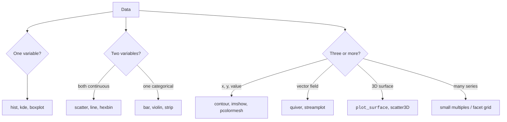

A scientific plot is not decoration. It is *evidence*. Done well,
a single figure can establish a result more convincingly than ten
pages of equations. Done badly, it can mislead an entire field.

This chapter is about producing publication-quality figures with
matplotlib, choosing the right encoding for the data at hand, and
avoiding the common pitfalls (chiefly: bad colormaps).

<Figure
  slug="scipy-visualization-cutout"
  alt="A raised plotting panel showing a contour field and a small colour ramp bar standing on the platform beside it"
/>

## A taxonomy of plot types

The single most important sentence in this chapter is: **pick the
plot type that matches the structure of your data**. A heatmap for
a 2-D field, a contour for a smooth surface, a small-multiples
grid for many similar series. Don't decorate; *encode*.

<Figure
  slug="scipy-scientific-visualization-inline-cutout"
  alt="A plain framed plot with a measured scale bar beside it and error rods standing on each mark"
/>

## The matplotlib object model

Stop using `plt.plot()` calls in isolation. Adopt the **Figure /
Axes** style, it scales from one panel to a 4 × 4 grid without
breaking a sweat.

<CodeBlock
  adapter="python"
  files={[
    {
      filename: "main.py",
      starterCode: `import numpy as np
import matplotlib.pyplot as plt

x = np.linspace(0, 2 * np.pi, 200)

fig, axes = plt.subplots(2, 2, figsize=(9, 6), constrained_layout=True)

axes[0, 0].plot(x, np.sin(x))
axes[0, 0].set_title("sin")
axes[0, 1].plot(x, np.cos(x))
axes[0, 1].set_title("cos")
axes[1, 0].plot(x, np.tan(x))
axes[1, 0].set_ylim(-5, 5)
axes[1, 0].set_title("tan")
axes[1, 1].plot(x, np.sin(x) * np.cos(x))
axes[1, 1].set_title("sin·cos")

for ax in axes.flat:
    ax.axhline(0, color="k", lw=0.5)
    ax.set_xlabel("x")
plt.show()
`,
    },
  ]}
/>

Three habits that pay off forever:

- `fig, ax = plt.subplots(...)`, explicit container variables
- `constrained_layout=True`, eliminates 90% of "labels are cut
  off" pain
- A small loop at the end to apply consistent styling to every
  panel

## 2-D fields: heatmaps and contours

Whenever the data is a function of two variables, temperature on
a grid, a 2-D probability density, a confusion matrix, you have
two great options.

<CodeBlock
  adapter="python"
  files={[
    {
      filename: "main.py",
      starterCode: `import numpy as np
import matplotlib.pyplot as plt

x = np.linspace(-3, 3, 200)
y = np.linspace(-3, 3, 200)
X, Y = np.meshgrid(x, y)
Z = np.exp(-(X**2 + Y**2)) * np.cos(2 * X) * np.sin(3 * Y)

fig, axes = plt.subplots(1, 2, figsize=(10, 4), constrained_layout=True)

im = axes[0].pcolormesh(X, Y, Z, cmap="viridis", shading="auto")
axes[0].set_title("pcolormesh")
axes[0].set_aspect("equal")
fig.colorbar(im, ax=axes[0])

cf = axes[1].contourf(X, Y, Z, levels=20, cmap="viridis")
axes[1].contour(X, Y, Z, levels=10, colors="k", linewidths=0.4)
axes[1].set_title("contourf + contour")
axes[1].set_aspect("equal")
fig.colorbar(cf, ax=axes[1])
plt.show()
`,
    },
  ]}
/>

Contours are great when the *level set* (the "ridges and valleys")
is what you want to convey. A pcolormesh / imshow is better when
the absolute value at every point matters.

## Colormaps: choose perceptually uniform

The same field on a rainbow ramp and a perceptually uniform one. Rainbow
invents bands where the data is smooth:

<Chart slug="rainbow-vs-sequential" />

And the second half of the same question, whether the palette survives a
red-green deficiency:

<Chart slug="colorblind-safe" />

Avoid the legacy `jet` colormap. It is **perceptually nonuniform**,
it has bright cyan and yellow bands that look like ridges even
where the data is flat. Use the modern perceptually uniform
colormaps:

- **sequential** (low → high): `viridis`, `plasma`, `magma`,
  `cividis`
- **diverging** (centered around zero): `coolwarm`, `RdBu_r`,
  `seismic`
- **cyclic** (wraps around): `twilight`, `hsv`

<CodeBlock
  adapter="python"
  files={[
    {
      filename: "main.py",
      starterCode: `import numpy as np
import matplotlib.pyplot as plt

# A ramp shown in three colormaps, convert to grayscale to test perceptual uniformity
ramp = np.linspace(0, 1, 256).reshape(1, -1)
ramp = np.tile(ramp, (40, 1))

cmaps = ["jet", "viridis", "cividis"]
fig, axes = plt.subplots(len(cmaps), 1, figsize=(8, 3), constrained_layout=True)
for ax, cm in zip(axes, cmaps):
    ax.imshow(ramp, cmap=cm, aspect="auto")
    ax.set_yticks([])
    ax.set_title(cm)
plt.show()
`,
    },
  ]}
/>

Look at the `jet` ramp, you'll see false "bands" of bright cyan
and yellow. `viridis` and `cividis` look like smooth gradients,
because they actually are.

## Vector fields and 3-D

Two more specialized plots that are widely useful in physics and
engineering.

<CodeBlock
  adapter="python"
  files={[
    {
      filename: "main.py",
      starterCode: `import numpy as np
import matplotlib.pyplot as plt

x = np.linspace(-2, 2, 25)
y = np.linspace(-2, 2, 25)
X, Y = np.meshgrid(x, y)
U = Y  # rotational vector field
V = -X
M = np.hypot(U, V)

fig, axes = plt.subplots(1, 2, figsize=(10, 4), constrained_layout=True)

axes[0].quiver(X, Y, U, V, M, cmap="viridis", scale=40)
axes[0].set_aspect("equal")
axes[0].set_title("quiver: vortex flow")

axes[1].streamplot(X, Y, U, V, color=M, cmap="viridis")
axes[1].set_aspect("equal")
axes[1].set_title("streamplot")
plt.show()
`,
    },
  ]}
/>

<CodeBlock
  adapter="python"
  files={[
    {
      filename: "main.py",
      starterCode: `import numpy as np
import matplotlib.pyplot as plt

x = np.linspace(-3, 3, 80)
y = np.linspace(-3, 3, 80)
X, Y = np.meshgrid(x, y)
Z = np.sin(np.sqrt(X**2 + Y**2))

fig = plt.figure(figsize=(7, 5))
ax = fig.add_subplot(111, projection="3d")
ax.plot_surface(X, Y, Z, cmap="viridis", rstride=2, cstride=2, alpha=0.85)
ax.set_xlabel("x")
ax.set_ylabel("y")
ax.set_zlabel("f(x,y)")
ax.set_title("3-D surface")
plt.show()
`,
    },
  ]}
/>

3-D is genuinely useful for *surfaces* and for tracing
3-dimensional trajectories (like the Lorenz attractor). It is
almost always *worse* than 2-D contours or small multiples for
quantitative comparison, humans cannot read depth accurately.

## Small multiples

Why they beat one crowded axes: the same series, tangled and then split.

<Chart slug="spaghetti-vs-facets" />

When you want to compare many similar things, the single most
effective layout is the **small-multiples grid** (Edward Tufte's
"trellis"). Same axes, same scales, faceted by group.

<CodeBlock
  adapter="python"
  files={[
    {
      filename: "main.py",
      starterCode: `import numpy as np
import matplotlib.pyplot as plt

rng = np.random.default_rng(0)
t = np.linspace(0, 4, 200)

# 9 noisy realizations of decaying oscillation with varying frequency
fig, axes = plt.subplots(
    3, 3, figsize=(9, 7), sharex=True, sharey=True, constrained_layout=True
)
for i, ax in enumerate(axes.flat):
    omega = 1 + 0.4 * i
    y = np.exp(-0.5 * t) * np.cos(omega * t) + 0.05 * rng.standard_normal(t.size)
    ax.plot(t, y)
    ax.set_title(f"ω = {omega:.1f}", fontsize=10)
plt.show()
`,
    },
  ]}
/>

`sharex=True, sharey=True` is what makes the comparison *fair*:
your eye reads differences in the *data*, not differences in
scaling.

## A multi-file figure pipeline

<CodeBlock
  adapter="python"
  entryFilename="main.py"
  files={[
    {
      filename: "main.py",
      starterCode: `import numpy as np
import matplotlib.pyplot as plt
from plotting import phase_portrait
from scipy.integrate import solve_ivp

def vdp(t, z, mu=1.5):
    x, y = z
    return [y, mu * (1 - x * x) * y - x]

# Integrate several initial conditions
trajectories = []
for x0 in np.linspace(-3, 3, 7):
    sol = solve_ivp(vdp, [0, 20], [x0, 0], dense_output=True, rtol=1e-7)
    tt = np.linspace(0, 20, 1000)
    trajectories.append(sol.sol(tt).T)

fig, ax = plt.subplots(figsize=(6, 5), constrained_layout=True)
phase_portrait(
    ax,
    trajectories,
    vector_field=lambda x, y: (y, 1.5 * (1 - x * x) * y - x),
    xlim=(-3.5, 3.5),
    ylim=(-5, 5),
    title="Van der Pol oscillator",
)
plt.show()
`,
    },
    {
      filename: "plotting.py",
      starterCode: `import numpy as np

def phase_portrait(
    ax, trajectories, vector_field, xlim=(-3, 3), ylim=(-3, 3), grid=25, title=""
):
    """Plot trajectories on top of a streamplot of the vector field."""
    x = np.linspace(*xlim, grid)
    y = np.linspace(*ylim, grid)
    X, Y = np.meshgrid(x, y)
    U, V = vector_field(X, Y)
    ax.streamplot(X, Y, U, V, color="lightgray", density=1.1, linewidth=0.6)
    for traj in trajectories:
        ax.plot(traj[:, 0], traj[:, 1], lw=1.2)
    ax.set_xlim(xlim)
    ax.set_ylim(ylim)
    ax.set_xlabel("x")
    ax.set_ylabel("ẋ")
    ax.set_aspect("equal")
    if title:
        ax.set_title(title)
`,
    },
  ]}
/>

Separating the plotting logic from the computation lets you reuse
the same visualization for many systems, and makes it trivial to
restyle every figure in a paper from a single place.

## A short checklist before you publish a figure

- Every axis has a label *with units*
- Every plot has a legend or a clear title explaining the series
- The colormap is perceptually uniform (no `jet`!)
- Diverging data is shown with a diverging colormap centered at
  zero
- Font sizes are readable at the final print size
- `dpi=150` or higher when saving for screens; vector formats
  (PDF, SVG) for print
- Aspect ratio matches the data (square for $x \approx y$ ranges,
  wide for time series)

## Check your understanding

<MultipleChoice
  markdown={`You are visualizing temperature anomalies (deviation from a baseline) which can be positive or negative. Which colormap should you choose?

- [o] A diverging map like \`coolwarm\` or \`RdBu_r\`, centered at zero
  > Diverging data has a meaningful midpoint (here, "no anomaly"). A diverging colormap encodes sign with color (e.g. blue for cool, red for warm) and magnitude with intensity, so the viewer can read positive vs negative at a glance. Always set \`vmin = -vmax\` so zero maps to the middle color.
- The default \`jet\`
  > The page explicitly warns against \`jet\` because it is perceptually nonuniform and creates false visual boundaries; for diverging data it is doubly inappropriate because it has no meaningful midpoint.
- A sequential map like \`viridis\`
  > Sequential maps run from low to high with no natural midpoint; they cannot visually distinguish positive from negative anomalies, which is precisely the key information in this dataset.
- A grayscale ramp
  > A grayscale ramp is sequential with no midpoint, making it unable to distinguish positive from negative anomalies.

Match the colormap to the *structure* of the data, sequential for one-sided, diverging for two-sided, cyclic for angular.`}
/>

<MultipleChoice
  markdown={`You need to compare model fits across 12 different patient datasets. What's the most effective layout?

- [o] A 3 × 4 grid of small multiples with shared axes
  > Small multiples ("trellis" plots) let the viewer compare like with like at a glance. Shared axes make differences between panels reflect differences in the data, not the scale. Twelve lines on a single plot become spaghetti that nobody can read.
- A pie chart per patient
  > Pie charts encode proportion of a whole, not model-fit curves; they cannot represent the type of data described here and are generally poor for scientific comparison tasks.
- One big plot with 12 overlapping lines and a legend
  > Twelve overlapping lines create visual spaghetti; the page describes this as the main failure mode that small multiples solve.
- A 3-D plot with patient ID on the z-axis
  > Encoding patient ID on a 3-D depth axis is one of the worst ways to make quantitative comparisons; humans cannot accurately read depth, and the page explicitly calls 3-D "almost always worse" for quantitative comparison.

Tufte's principle: when you have many similar things to compare, repeat the same small plot many times.`}
/>
