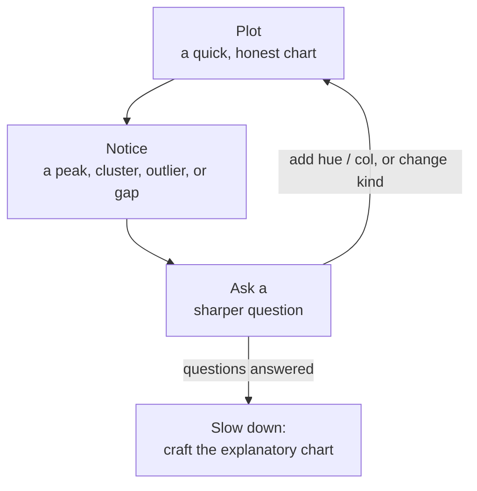

A fresh dataset is a stranger. Before you can trust it, model it, or present
it, you have to get to know it, and the fastest way to do that is to *look*.
**Exploratory data analysis (EDA)** is the disciplined habit of poking at data
with summaries and plots to learn its structure, spot its quirks, and let it
suggest the questions worth asking.

The statistician **John Tukey** championed this idea in the 1970s, arguing
that data analysis should start with open-ended exploration rather than
jumping straight to formal tests. His line is the spirit of this whole page:
the greatest value of a picture is when it forces you to notice **what you
never expected to see**.

EDA is not a single command or a checklist you run once. It is a **loop**. You
plot, you notice something, you sharpen your question, and you plot again.
This page gives you a practical version of that loop and maps each step to the
Seaborn tools you will learn in this course.

<Figure
  slug="sns-eda-workflow-cutout"
  alt="A closed circular track of five stations on a platform, a small cart looping around it past each stop"
/>

## A practical 5-step loop

Here is a sequence that works for almost any new dataset. Treat it as a
starting groove, not a rigid script, real exploration jumps around, and that
is fine.

1. **Understand the structure.** How big is it? What are the columns and their
   types? Where is data missing? *Tools: `df.shape`, `df.head()`, `df.info()`,
   `df.isna().sum()`.*
2. **Look at one variable at a time (univariate).** What does each column's
   distribution look like, its center, spread, skew, and any second peak?
   *Tools: `displot` / `histplot`, and the distribution chapters.*
3. **Compare variables in pairs (bivariate).** How do two variables relate, and
   does the relationship change when you split by a group? *Tools: `relplot`
   (scatter/line), `catplot` (categorical), with `hue`.*
4. **Look at many variables at once (multivariate).** Which variables move
   together across the whole table? *Tools: `pairplot`, faceting with
   `col`/`row`, and the correlation `heatmap`.*
5. **Hypothesize, check, and communicate, then loop back.** Form a hunch,
   test it with a targeted plot, and either refine it or move on. When a
   finding is solid, polish one chart to share it.

| Step | Question it answers | Seaborn tools |
| ---- | ------------------- | ------------- |
| 1. Structure | What *is* this table? | `shape`, `head`, `info`, `isna().sum()` |
| 2. Univariate | What does each variable look like? | `displot`, `histplot` |
| 3. Bivariate | How do two variables relate? | `relplot`, `catplot`, `hue` |
| 4. Multivariate | What moves together overall? | `pairplot`, facets, `heatmap` |
| 5. Hypothesize | Is my hunch real? | a targeted, polished plot |

<Callout type="info" title="Structure before beauty">
Resist the urge to make a gorgeous chart in the first minute. Steps 1 and 2,
sizes, types, and missing values, are unglamorous but they protect you from
analyzing the wrong thing. A polished plot of a misread column is worse than
no plot at all.
</Callout>

## A running example: getting to know penguins

Let's walk the loop on the `penguins` dataset, 344 penguins measured across
three Antarctic islands. We will go just far enough to feel the rhythm of
*plot, notice, ask again*.

### Step 1, Understand the structure

First, the boring-but-essential questions. How many rows and columns? What do
the first few rows look like? Which columns have missing values?

<CodeBlock
  adapter="python"
  datasets={[{ path: "palmer-penguins.csv", stageAs: "penguins.csv" }]}
  files={[
    {
      filename: "main.py",
      starterCode: `import pandas as pd

penguins = pd.read_csv("penguins.csv")

# How big is the table? (rows, columns)
print("shape:", penguins.shape)

# Where is data missing, column by column?
print("\\nmissing values per column:")
print(penguins.isna().sum())

# What do the first rows actually look like?
display(penguins.head())
`,
    },
  ]}
/>

Already we have learned things no chart would have told us first: there are
**344 rows** and **7 columns**; the four body-measurement columns and `sex`
have a handful of **missing values** (a couple of penguins were not fully
measured). That is a fact to carry forward, Seaborn will quietly drop those
rows when it plots, which is usually fine but worth *knowing* rather than
being surprised by.

<Callout type="tip" title="df.info() in one go">
`df.info()` packs much of step 1 into a single call: it prints each column's
name, its non-null count (so you can spot missing data), and its dtype
(numeric vs. object/categorical). It is often the very first thing to run on a
new DataFrame. Try adding `penguins.info()` to the block above.
</Callout>

### Step 2, Look at one variable (univariate)

Now zoom into a single column. How is **body mass** distributed? A histogram
bins the values so you can read the shape, where the bulk sits, how wide the
spread is, and whether there is more than one peak.

<CodeBlock
  adapter="python"
  datasets={[{ path: "palmer-penguins.csv", stageAs: "penguins.csv" }]}
  files={[
    {
      filename: "main.py",
      starterCode: `import pandas as pd
import seaborn as sns

sns.set_theme(style="whitegrid")
penguins = pd.read_csv("penguins.csv")

# Distribution of a single numeric variable.
sns.displot(
    data=penguins,
    x="body_mass_g",
    bins=25,
    kde=True,  # overlay a smooth density estimate
    height=4,
    aspect=1.3,
)
`,
    },
  ]}
/>

Look at the shape and a question writes itself. The distribution is **wide and
lopsided**, and there is a hint of a second bump toward the heavier end, as
if the data is really *two or three* groups stacked on top of each other.
Which raises the natural follow-up: *grouped by what?* That is precisely how
EDA is supposed to feel, a plot answers one question and immediately hands you
a sharper one.

### Step 3, Compare two variables, split by group (bivariate)

The histogram hinted at hidden groups. Let's test that by relating two
measurements, **flipper length** and **body mass**, and coloring by
**species** to see whether the groups explain the structure.

<CodeBlock
  adapter="python"
  datasets={[{ path: "palmer-penguins.csv", stageAs: "penguins.csv" }]}
  files={[
    {
      filename: "main.py",
      starterCode: `import pandas as pd
import seaborn as sns

sns.set_theme(style="whitegrid")
penguins = pd.read_csv("penguins.csv")

# Two numeric variables, colored by a categorical group.
sns.relplot(
    data=penguins,
    x="flipper_length_mm",
    y="body_mass_g",
    hue="species",
    height=4,
    aspect=1.3,
)
`,
    },
  ]}
/>

There it is. Heavier penguins have longer flippers, a clear positive
relationship, and the cloud separates into **species**: Gentoo penguins are
the large, long-flippered group sitting up and to the right, which explains
the second bump we saw in the mass histogram. One added variable (`hue`) took
us from "there's *some* structure" to "the structure *is* species." Notice the
arc across these three blocks: a summary raised a question, a univariate plot
sharpened it, and a bivariate plot answered it. That arc is the loop.

<MultipleChoice
  markdown={`In the walkthrough, the body-mass histogram looked lopsided with a hint of a
second peak, which led us to color a scatter plot by \`species\`. What does this
sequence illustrate about EDA?

- [o] That EDA is iterative: one plot reveals something, which sharpens the next question and motivates the next plot.
  > The lopsided shape prompted a grouped scatter, which explained the bump as species. Each plot feeds the next, that loop is the heart of EDA.
- That a single histogram is always enough to fully understand a variable.
  > The histogram *raised* a question (why the second bump?) rather than settling it. EDA rarely finishes in one plot.
- That you should always start with a scatter plot before anything else.
  > The example deliberately started with structure and a univariate view *before* the scatter. Order matters, and the scatter came later.
- That coloring by a group is only ever decorative.
  > Coloring by \`species\` was the analytical move that explained the second peak, far from decorative, it answered the question.

A plot that hands you a sharper question has done its job; following that
question to the next plot is the loop in action.`}
/>

### Steps 4 and 5, widen out, then hypothesize

From here the loop keeps turning. **Step 4 (multivariate)** would widen the
view: a `pairplot` to scatter every pair of measurements at once, or a
correlation `heatmap` to see which variables move together across the whole
table, quick ways to find relationships you did not think to look for. We
build those in their own chapters.

**Step 5** is where exploration turns into a claim. You now have a hypothesis
worth stating, *"flipper length separates the species more cleanly than bill
depth does"*, and you would draw one targeted plot to check it, refine the
wording, and, once it holds, polish that single chart to communicate the
finding. Then you loop back: the answer suggests the next question, and the
cycle continues.

## The EDA loop

Step back and notice the *shape* of what we just did. We did not march in a
straight line from raw data to a finished answer. We went around a **loop**,
and each lap left us knowing more than the last.

The cycle has four moves that feed into each other, over and over:

1. **Plot.** Make a quick, honest chart of what you currently wonder about,
   a distribution, a relationship, a comparison. Favor speed over polish here;
   this picture is for *you*.
2. **Notice.** Read the chart actively. A second peak. A cluster. An outlier
   flung off on its own. A gap where you expected points. A trend that bends.
   The thing you did *not* expect is usually the most valuable.
3. **Ask a sharper question.** Turn what you noticed into a more specific
   question. "There's structure" becomes "is this structure explained by
   species?" Each lap narrows the question.
4. **Plot again.** Answer the sharper question with a new chart, often the
   previous one plus a `hue`, a `col`, or a switch of `kind`. That answer
   reveals the next thing to notice, and you are back at the top.

You exit the loop not when you run out of plots but when the data stops
surprising you and your questions are answered well enough to act on. Only
*then* do you slow down and craft the polished, explanatory chart that carries
your finding to other people.

<Callout type="tip" title="Make the loop cheap">
The faster each lap is, the more laps you take, and the more you see. This is
exactly why Seaborn's declarative style matters for EDA: one short line per
chart means you can ask the next question while the thought is still warm,
add a `hue`, swap a `kind`, facet by a column, and look again in seconds.
</Callout>

<Callout type="warn" title="Exploring is not yet confirming">
EDA is for *generating* hypotheses, not *proving* them. A pattern you spot by
eye, especially one you went looking for after seeing the data, can be a
real effect or a coincidence of this particular sample. Treat an exploratory
finding as a promising lead to confirm with a proper test or fresh data, not
as a settled conclusion.
</Callout>

## Your turn

<ChallengeCard
  adapter="python"
  datasets={[{ path: "palmer-penguins.csv", stageAs: "penguins.csv" }]}
  title="Run step 1 on penguins"
  instructions={`Practice the very first move of the loop: understanding a dataset's
structure. Using the \`penguins\` dataset, compute two facts and store each in
a variable:

1. \`n_rows\`, the number of **rows** in the dataset (an integer).
2. \`missing_sex\`, the number of **missing values** in the \`sex\` column (an
   integer).

Hint: \`df.shape\` is a \`(rows, columns)\` tuple, and
\`df["col"].isna().sum()\` counts the missing values in a column.`}
  files={[
    {
      filename: "main.py",
      starterCode: `import pandas as pd

penguins = pd.read_csv("penguins.csv")

# How many rows are there?
n_rows = None

# How many penguins are missing a recorded sex?
missing_sex = None

print("rows:", n_rows, "| missing sex:", missing_sex)
`,
      solutionCode: `import pandas as pd

penguins = pd.read_csv("penguins.csv")

n_rows = penguins.shape[0]
missing_sex = int(penguins["sex"].isna().sum())

print("rows:", n_rows, "| missing sex:", missing_sex)
`,
    },
  ]}
  tests={[
    {
      id: "n_rows",
      name: "n_rows is 344",
      description: "The penguins dataset has 344 rows",
      code: "assert n_rows == 344, f'Expected 344 rows, got {n_rows}'",
    },
    {
      id: "missing_sex",
      name: "missing_sex counts the NaNs in sex",
      description: "There are 11 penguins with no recorded sex",
      code: "assert int(missing_sex) == 11, f'Expected 11 missing sex values, got {missing_sex}'",
    },
  ]}
/>

Two quick facts, 344 rows, 11 missing sex values, and you already know more
about this table than most people who plot it. That is step 1 doing its
quiet, essential job before any chart is drawn.

## Check your understanding

<MultipleChoice
  markdown={`Which phrase best describes the overall character of exploratory data
analysis?

- The process of formally proving a hypothesis with a statistical test.
  > Proving hypotheses is confirmatory analysis. EDA *generates* hypotheses to test later; it does not confirm them.
- [o] An iterative loop of plotting, noticing something, asking a sharper question, and plotting again.
  > EDA cycles: each chart surfaces something that refines the next question, and you keep looping until the data stops surprising you.
- A fixed checklist of plots you must produce in a strict order every time.
  > The 5-step loop is a starting groove, not a rigid script; real exploration jumps around as the data leads you.
- A one-time report you generate at the very end of a project.
  > That describes *explanatory* output for an audience. EDA happens early and repeatedly, before you have conclusions to report.

EDA is a loop, not a checklist or a final report: explore, notice, refine,
repeat.`}
/>

<MultipleChoice
  markdown={`You have just loaded a brand-new dataset you have never seen. According to the
workflow on this page, which is the most sensible **first** move?

- Immediately run a formal statistical test on two columns.
  > Formal testing is confirmatory work that comes much later. You do not yet know the data well enough to choose a meaningful test.
- Drop every row that contains any missing value, then start plotting.
  > Blindly dropping rows can discard a lot of data before you understand it; first *measure* the missingness, then decide deliberately how to handle it.
- [o] Inspect its structure, shape, a few rows, column types, and missing values, with tools like \`shape\`, \`head\`, \`info\`, and \`isna().sum()\`.
  > Understanding size, types, and missingness first prevents you from analyzing the wrong thing and frames every plot that follows.
- Build a polished, publication-ready multi-panel figure.
  > Polish belongs to the final, communicate step. Starting there risks lavishing effort on a column you have misread.

Step 1 is unglamorous structure-checking, and it protects every step that
comes after it.`}
/>

<MultipleChoice
  markdown={`In the penguins walkthrough, what made the **grouped scatter plot** (colored by
\`species\`) such a productive next step after the body-mass histogram?

- It proved beyond doubt that species causes body mass.
  > EDA surfaces relationships; it does not establish causation. The scatter revealed structure, it did not prove a cause.
- [o] It tested the histogram's hint of hidden groups by relating two variables and splitting by \`species\`, which explained the second peak.
  > The univariate plot suggested multiple groups; adding a second variable and a \`hue\` confirmed the groups were species, exactly the loop turning one observation into the next plot.
- It replaced the need to ever look at single variables again.
  > Univariate and bivariate views complement each other; the histogram was what *motivated* the scatter in the first place.
- It used a prettier color palette than the histogram.
  > Aesthetics were not the point. The scatter advanced the analysis by *explaining* a pattern, not by looking nicer.

A good follow-up plot turns "something is going on" into "here is what is going
on", that is the loop paying off.`}
/>

You now have a repeatable way to meet any dataset: check its structure, look at
one variable, then two, then many, and let each plot sharpen the next question.
With this workflow in hand and the tidy-data and grammar mental models behind
you, you are ready to start drawing the chart families themselves.
