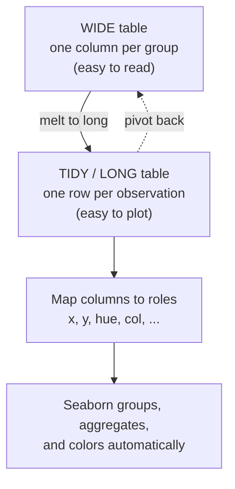

Before you draw a single chart, you have to get the **shape** of your data
right. Almost every frustrating moment with Seaborn, "why won't it color
by group?", "why is my x-axis a mess?", traces back to a table that is
shaped the wrong way.

Seaborn is built for **tidy data**. Once your table is tidy, plotting feels
effortless: you just name columns and the roles they should play. When it
is *not* tidy, you fight the library on every line.

This page is foundational. Take your time with it, the payoff is every
later chapter.

<Figure
  slug="sns-tidy-data-cutout"
  alt="A wide irregular grid on one platform folding into a tall tidy long-form grid on the next"
/>

## What "tidy" means

A table is **tidy** when three rules hold:

1. **Each variable is its own column.**
2. **Each observation is its own row.**
3. **Each value sits in its own cell.**

That's it. A *variable* is something you measured (temperature, city,
species). An *observation* is one thing you measured it on (one penguin,
one day at a restaurant, one month in one city).

<Callout type="info" title="Tidy = 'long', not 'wide'">
Tidy data is often called **long** format, because adding more groups makes
the table *longer* (more rows), not *wider* (more columns). The opposite,
**wide** format, spreads one variable across many columns. Humans often
prefer wide tables for reading; Seaborn almost always prefers long.
</Callout>

## The transformation, in one picture

Here is the move you will make over and over: reshape a **wide** table into
a **long/tidy** one so Seaborn can map its columns to visual roles.

Let's make that concrete. Imagine three cities' average temperatures across
three months.

A **wide** table, convenient for a human to scan, one column per city:

| month | London | Tokyo | Cairo |
| ----- | ------ | ----- | ----- |
| Jan   | 5      | 8     | 14    |
| Feb   | 6      | 9     | 16    |
| Mar   | 9      | 12    | 20    |

The same data, **tidy/long**, one row per `(month, city)` observation:

| month | city   | temp |
| ----- | ------ | ---- |
| Jan   | London | 5    |
| Feb   | London | 6    |
| Mar   | London | 9    |
| Jan   | Tokyo  | 8    |
| ...   | ...    | ...  |

Notice what happened: the *city*, which was hidden in the **column
headers** of the wide table, became an honest **variable** in its own
column. That is the whole trick, because Seaborn can only map things that
are columns.

## Reshaping wide → long with `melt`

pandas does the reshaping. `DataFrame.melt` takes the columns you want to
*keep* (`id_vars`) and stacks the rest into two new columns: one holding
the old column *names*, one holding the *values*.

<CodeBlock
  adapter="python"
  files={[
    {
      filename: "main.py",
      starterCode: `import pandas as pd

# A WIDE table: one column per city.
wide = pd.DataFrame(
    {
        "month": ["Jan", "Feb", "Mar"],
        "London": [5, 6, 9],
        "Tokyo": [8, 9, 12],
        "Cairo": [14, 16, 20],
    }
)

display(wide)
`,
    },
  ]}
/>

Now melt it. Keep `month` as an identifier; stack `London`, `Tokyo`, and
`Cairo` into a `city` column and a `temp` column.

<CodeBlock
  adapter="python"
  files={[
    {
      filename: "main.py",
      starterCode: `import pandas as pd

wide = pd.DataFrame(
    {
        "month": ["Jan", "Feb", "Mar"],
        "London": [5, 6, 9],
        "Tokyo": [8, 9, 12],
        "Cairo": [14, 16, 20],
    }
)

long = wide.melt(id_vars="month", var_name="city", value_name="temp")
display(long)
`,
    },
  ]}
/>

Three rows became nine, the table got *longer*, and `city` is now
something we can point Seaborn at.

<MultipleChoice
  markdown={`In the melted \`long\` table above, what kind of thing is **city**?

- A column header, exactly as it was before.
  > In the wide table the cities *were* column headers. The whole point of melting was to stop that being true.
- [o] A variable stored in its own column, with one value per row.
  > Melting moved the city names out of the headers and into a real \`city\` column, now each row records which city its \`temp\` belongs to.
- An index that pandas hides from Seaborn.
  > \`melt\` does not move data into the index; it creates ordinary columns that Seaborn can map directly.

Tidying turns information that lived in *structure* (column names) into
information that lives in *data* (cell values), which is the only kind
Seaborn can map to x, y, or hue.`}
/>

## Why Seaborn loves long data

Here is the reason all of this matters. Seaborn's whole interface is
"assign a **column** to a **visual role**":

- `x="month"`, column on the x-axis
- `y="temp"`, column on the y-axis
- `hue="city"`, column that decides color

That last one is only possible because `city` is a column. With the wide
table there was no single column to hand to `hue`, the cities were three
*separate* columns, which is exactly the wrong shape.

<CodeBlock
  adapter="python"
  files={[
    {
      filename: "main.py",
      starterCode: `import pandas as pd
import seaborn as sns

sns.set_theme(style="whitegrid")

wide = pd.DataFrame(
    {
        "month": ["Jan", "Feb", "Mar"],
        "London": [5, 6, 9],
        "Tokyo": [8, 9, 12],
        "Cairo": [14, 16, 20],
    }
)
long = wide.melt(id_vars="month", var_name="city", value_name="temp")

# One line, because the data is tidy: x, y, and a color group.
sns.relplot(
    data=long,
    x="month",
    y="temp",
    hue="city",
    kind="line",
    marker="o",
    height=4,
    aspect=1.4,
)
`,
    },
  ]}
/>

One short call drew three colored lines with a legend. Try imagining the
matplotlib version: a loop over cities, three `plot` calls, manual colors,
a hand-built legend. Tidy data is what buys you the brevity.

<Callout type="tip" title="Most built-in datasets are already tidy">
The datasets we use throughout this course, `tips`, `penguins`, `mpg`,
arrive tidy. Real-world data (spreadsheets, exports, pivot tables) often
does not, so `melt` is one of the most useful tools in your kit.
</Callout>

## When wide is actually the right shape

Tidy is the default, but not a law. A few charts genuinely want a **matrix**
(wide) layout, most importantly the **heatmap**, where rows and columns
are both meaningful axes and each cell is a value. We'll meet that in the
correlation-heatmaps chapter. The reverse of `melt` is `pivot`, which
spreads a long table back into a wide matrix:

<CodeBlock
  adapter="python"
  files={[
    {
      filename: "main.py",
      starterCode: `import seaborn as sns

# 'flights' is tidy/long: year, month, passengers (one row per year-month).
flights = sns.load_dataset("flights")
display(flights.head())

# Pivot to a WIDE matrix (year x month), the shape a heatmap wants.
matrix = flights.pivot(index="month", columns="year", values="passengers")
display(matrix.iloc[:5, :5])
`,
    },
  ]}
/>

So the rule of thumb is: **tidy/long for almost everything; wide/matrix only
for heatmaps and similar grid views.** When in doubt, go long.

## Your turn

<ChallengeCard
  adapter="python"
  title="Tidy up a gradebook"
  instructions={`The DataFrame \`scores\` is **wide**, one column per subject:

| student | math | reading |
| ------- | ---- | ------- |
| Ana     | 88   | 90      |
| ...     | ...  | ...     |

Reshape it into a **tidy/long** DataFrame named \`tidy\` with exactly these
three columns, in this order: \`student\`, \`subject\`, \`score\`. Keep
\`student\` as the identifier and stack the subject columns.`}
  files={[
    {
      filename: "main.py",
      starterCode: `import pandas as pd

scores = pd.DataFrame(
    {
        "student": ["Ana", "Ben", "Cara"],
        "math": [88, 72, 95],
        "reading": [90, 85, 80],
    }
)

# Create the tidy/long DataFrame:
tidy = None
`,
      solutionCode: `import pandas as pd

scores = pd.DataFrame(
    {
        "student": ["Ana", "Ben", "Cara"],
        "math": [88, 72, 95],
        "reading": [90, 85, 80],
    }
)

tidy = scores.melt(id_vars="student", var_name="subject", value_name="score")
`,
    },
  ]}
  tests={[
    {
      id: "columns",
      name: "Columns are student, subject, score",
      description: "In that exact order",
      code: "assert list(tidy.columns) == ['student', 'subject', 'score'], f'Got columns {list(tidy.columns)}'",
    },
    {
      id: "shape",
      name: "Has 6 rows and 3 columns",
      description: "3 students x 2 subjects",
      code: "assert tidy.shape == (6, 3), f'Expected (6, 3), got {tidy.shape}'",
    },
    {
      id: "value",
      name: "Values are preserved",
      description: "Ana's math score is still 88",
      code: "row = tidy[(tidy['student'] == 'Ana') & (tidy['subject'] == 'math')]\nassert int(row['score'].iloc[0]) == 88, 'Ana/math should be 88'",
    },
  ]}
/>

## Common tidy-data mistakes

- **Values trapped in column headers.** `2019`, `2020`, `2021` as separate
  columns means "year" is a variable hiding in the headers, melt it.
- **One column holding two variables.** A `"London_temp"` column mixes city
  and measurement. Split it (e.g. with `str.split`) before plotting.
- **Aggregates pasted into the data.** A "Total" row or column is a summary,
  not an observation. Seaborn can compute totals for you, drop it from the
  raw table.

<Callout type="warn" title="Tidy first, plot second">
If a Seaborn call is fighting you, you can't get `hue` to work, or the
x-axis has the wrong thing on it, stop and look at the table's *shape*
before touching plot parameters. Nine times out of ten the fix is a `melt`,
not a new keyword argument.
</Callout>

## Check your understanding

<MultipleChoice
  markdown={`Which statement best describes a **tidy** (long) dataset?

- Every dataset that has no missing values.
  > Tidiness is about *shape*, not completeness. A tidy table can still have NaNs.
- A dataset stored as a wide matrix so it is easy for people to read.
  > That describes *wide* format. Tidy data favors a long layout that is easy to *plot*, even if it's less compact to read.
- [o] A dataset where each variable is a column, each observation is a row, and each value is a single cell.
  > These three rules are the definition of tidy data, and they are exactly the structure Seaborn's column-mapping interface expects.
- A dataset that has been sorted alphabetically.
  > Sorting changes row order, not the variable/observation/value structure that defines tidiness.

Tidy data is defined by structure: one variable per column, one observation
per row, one value per cell.`}
/>

<MultipleChoice
  markdown={`You have monthly sales with a separate column for each region:
\`month\`, \`North\`, \`South\`, \`East\`, \`West\`. You want a single line chart
with one colored line per region. What should you do first?

- Pass \`hue=["North", "South", "East", "West"]\` to \`relplot\`.
  > \`hue\` takes a single column name, not a list of columns. The regions need to live in *one* column first.
- [o] \`melt\` the four region columns into a \`region\` column and a \`sales\` column, then map \`hue="region"\`.
  > Melting moves the region names out of the headers into a real \`region\` column, which is exactly what \`hue\` needs.
- Plot each region with four separate \`relplot\` calls.
  > That technically works but throws away everything Seaborn offers, one tidy call gives you all four lines, a shared scale, and a legend automatically.
- Sort the DataFrame by \`month\` and call \`relplot\` on the wide table.
  > Sorting doesn't change the shape; \`relplot\` still has no single column to color by.

Whenever group identity is spread across column *headers*, melting it into a
column is the unlock for \`hue\`, \`col\`, and friends.`}
/>

<MultipleChoice
  markdown={`Which of these is a legitimate reason to use a **wide** (matrix) layout
instead of tidy/long?

- You want to color a scatter plot by a categorical group.
  > Coloring by a group needs that group in a single column, a tidy/long job.
- You want one panel per category with \`col=\`.
  > Faceting with \`col\` also reads a single column, so it wants tidy/long data.
- [o] You are drawing a **heatmap**, where rows and columns are both axes and each cell is a value.
  > A heatmap is inherently a matrix view, so a wide row-by-column table (often made with \`pivot\`) is the natural input.
- You want Seaborn to compute group means automatically.
  > Automatic grouping and aggregation operate over tidy columns, not wide matrices.

Heatmaps and similar grid views are the main place wide/matrix data is the
right choice; almost everything else wants tidy/long.`}
/>

<MultipleChoice
  markdown={`In \`df.melt(id_vars="date", var_name="metric", value_name="amount")\`,
what does \`id_vars\` control?

- The columns that get stacked into the new long columns.
  > That's the opposite, the columns *not* listed in \`id_vars\` are the ones that get stacked.
- [o] The identifier column(s) to keep as-is, repeated alongside each stacked value.
  > \`id_vars\` names the columns to preserve; every other column is melted into the \`metric\`/\`amount\` pair, with the id values repeated per row.
- The new name for the column of values.
  > That is what \`value_name\` does (\`"amount"\` here).
- The number of rows in the output.
  > Row count is a consequence of how many columns get stacked, not something \`id_vars\` sets directly.

\`id_vars\` are the "keep these" columns; everything else is unpivoted into a
name column (\`var_name\`) and a value column (\`value_name\`).`}
/>

You now have the single most important prerequisite for everything that
follows: **data in the right shape**. Next, let's look at the two kinds of
variables Seaborn cares about, continuous and categorical, and how that
distinction drives every chart choice.
