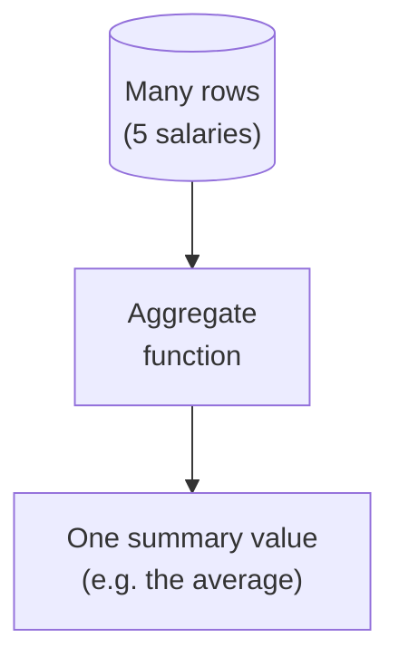
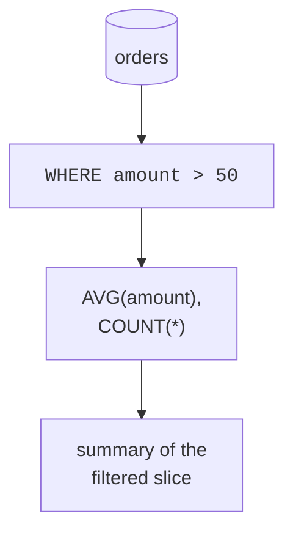

If there is one idea at the center of analytical SQL, it is
**aggregation**: taking *many* rows and reducing them to a *single*
summarizing value. Every "total", "average", "count", and "maximum" you
have ever seen in a report is an aggregate. This page explains not just
the five functions but *why* aggregation is the analyst's most important
move.

<Figure
  slug="duck-aggregates-cutout"
  alt="A tall column of many tiles funnelling down through a narrow neck into a single summary block"
/>

## Why aggregation exists

Worth keeping in view throughout: an aggregate is a number standing in for a
column, and identical aggregates can come from very different columns.

<Chart slug="bar-hides-distribution" />

A human cannot comprehend a million rows. But "the average order was
\$48" or "we had 1.2 million orders" fits in a sentence. Aggregation is
the bridge between **data too big to read** and **knowledge small enough
to act on**.

That collapse, many in, one out, is the defining behavior. Everything
else in this section is a variation on it.

## The five core aggregates

| Function | Answers | Example |
| --- | --- | --- |
| `COUNT(*)` | How many rows? | number of orders |
| `SUM(col)` | What is the total? | total revenue |
| `AVG(col)` | What is the average? | average order value |
| `MIN(col)` | What is the smallest? | cheapest sale |
| `MAX(col)` | What is the largest? | biggest sale |

A single query can compute several at once, each reads the same rows and
produces its own number. Run all five over the real 53,940-row diamonds
file:

<SqlCodeBlock
  dialect="duckdb"
  title="A one-line price report over 53,940 diamonds"
  starterCode={`SELECT
  COUNT(*) AS n_diamonds,
  ROUND(AVG(price), 0) AS avg_price,
  MIN(price) AS cheapest,
  MAX(price) AS priciest,
  ROUND(AVG(carat), 2) AS avg_carat
FROM
  read_parquet(
    'https://cdn.jsdelivr.net/gh/dataslope/datasets@f7f08485960fe4a774359a43d1eb50a84514daf2/diamonds.parquet'
  );`}
/>

Tens of thousands of rows became one line of five numbers, a complete
summary that would be hopeless to compute by hand.

## `COUNT(*)` vs `COUNT(column)` vs `COUNT(DISTINCT ...)`

Counting is subtler than it looks, and the distinction matters in real
analysis:

- `COUNT(*)` counts **rows**, period.
- `COUNT(column)` counts rows where that column is **not NULL**, i.e.
  present values.
- `COUNT(DISTINCT column)` counts the number of **different** values.

The third one is the expensive one, because an exact distinct count has to
remember every value it has seen. When approximate is good enough,
`approx_count_distinct` answers from a few kilobytes instead:

<Chart slug="approx-count-distinct-error" />

<SqlCodeBlock
  dialect="duckdb"
  title="Three kinds of counting"
  initSql={`CREATE TABLE visits (id INTEGER, user_id INTEGER, referrer TEXT);

INSERT INTO
  visits
VALUES
  (1, 10, 'google'),
  (2, 10, NULL),
  (3, 11, 'google'),
  (4, 12, 'twitter'),
  (5, 11, NULL),
  (6, 10, 'twitter');`}
  starterCode={`SELECT
  COUNT(*) AS total_visits,
  COUNT(referrer) AS visits_with_referrer,
  COUNT(DISTINCT user_id) AS unique_visitors
FROM
  visits;`}
/>

"How many visits?" "How many had a known referrer?" "How many *different*
people?", three genuinely different business questions, three different
`COUNT`s. Confusing them is a common analytical error.

## Aggregates ignore `NULL` (except `COUNT(*)`)

`SUM`, `AVG`, `MIN`, `MAX`, and `COUNT(column)` all **skip NULLs**. This
is almost always what you want, an unknown value should not be treated as
zero and drag an average down.

<Figure
  slug="duck-aggregate-functions-inline-cutout"
  alt="One wide tray of chips feeding four gauges at once, each reading a different single number"
/>

<SqlCodeBlock
  dialect="duckdb"
  title="AVG skips the unknowns"
  initSql={`CREATE TABLE ratings (product TEXT, score INTEGER);

INSERT INTO
  ratings
VALUES
  ('A', 5),
  ('A', 3),
  ('A', NULL),
  ('B', 4),
  ('B', NULL);`}
  starterCode={`SELECT
  product,
  COUNT(*) AS rows,
  COUNT(score) AS scored,
  ROUND(AVG(score), 2) AS avg_score -- averages only the non-NULL scores
FROM
  ratings
GROUP BY
  product
ORDER BY
  product;`}
/>

Product A averages over its two real scores (5 and 3 → 4.0), ignoring the
missing one. If `NULL` counted as 0, the average would be a misleading
2.67. SQL's choice to skip NULLs is what makes aggregates trustworthy,
but you must *know* it is happening.

## Aggregating a filtered slice

Aggregates respect `WHERE`: the filter runs first, then the aggregate
summarizes only the survivors. "Average order *over \$50*" is just an
average with a filter.

<SqlCodeBlock
  dialect="duckdb"
  title="Summarize only the big orders"
  initSql={`CREATE TABLE orders (id INTEGER, amount DECIMAL(8, 2));

INSERT INTO
  orders
VALUES
  (1, 120),
  (2, 30),
  (3, 200),
  (4, 45),
  (5, 95),
  (6, 15);`}
  starterCode={`SELECT
  COUNT(*) AS big_orders,
  ROUND(AVG(amount), 2) AS avg_big_order
FROM
  orders
WHERE
  amount > 50;`}
/>

## Check your understanding

<MultipleChoice
  markdown={`What is the defining behavior of an **aggregate function**?

- [o] It reduces many rows to a single summary value, such as a total or an average.
  > "Many rows in, one number out" is exactly what \`SUM\`, \`AVG\`, \`COUNT\`, \`MIN\`, and \`MAX\` do.
- It sorts rows into ascending order.
  > Sorting is \`ORDER BY\`; aggregation summarizes rather than orders.
- It removes duplicate rows.
  > Removing duplicates is \`DISTINCT\`; aggregation computes a summary.
- It returns one output row for each input row.
  > That describes ordinary column selection; aggregates *collapse* many rows into one summary value.

Aggregation collapses a set of rows into one summarizing number, the core
analytical operation.`}
/>

<MultipleChoice
  markdown={`A column \`score\` has values 5, 3, and NULL. What does \`AVG(score)\` return?

- 2.67, treating the NULL as 0.
  > Aggregates do not treat NULL as 0; that would distort the result.
- [o] 4.0, because \`AVG\` ignores the NULL and averages only 5 and 3.
  > \`AVG\` (like \`SUM\`, \`MIN\`, \`MAX\`) skips NULLs, so it averages the two known scores: (5 + 3) / 2 = 4.0.
- NULL, because one value is missing.
  > A single NULL does not nullify the whole average; only the NULL row is skipped.
- An error.
  > NULLs do not cause an error in \`AVG\`; they are simply excluded.

Aggregates skip NULLs, so \`AVG\` reflects only the present values.`}
/>

<MultipleChoice
  markdown={`You want the number of **distinct customers** who placed orders. Which is correct?

- \`COUNT(*)\`
  > That counts orders (rows), not distinct customers, a customer with three orders would count three times.
- [o] \`COUNT(DISTINCT customer_id)\`
  > \`DISTINCT\` collapses repeats, counting each customer once regardless of how many orders they placed.
- \`SUM(customer_id)\`
  > Summing id numbers is meaningless and does not count customers.
- \`COUNT(customer_id)\`
  > That counts non-NULL customer ids, still once per order, so repeat customers are over-counted.

"How many *different* X" almost always means \`COUNT(DISTINCT X)\`.`}
/>

A single grand total is useful, but the real power comes from computing
one summary **per group**, revenue *per region*, average *per category*.
That is `GROUP BY`, and it is next.

<Figure
  slug="duck-aggregate-functions-aggregation-exists-inline-cutout"
  alt="A bench heaped with chips that no one can count by eye, and one gauge with a single pointer resting at one mark beside it"
/>
