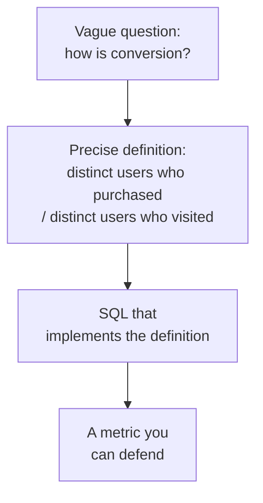
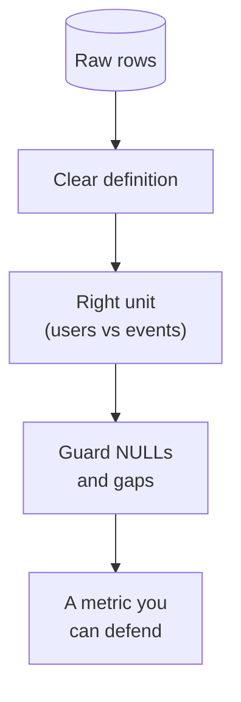

Everything so far has been technique. This page is about *purpose*: using
those techniques to compute the **metrics** a business runs on,
conversion rate, average revenue per user, retention, growth. The SQL is
familiar by now; the new skill is **reasoning about what a number really
means** and constructing it so it tells the truth.

<svg
  viewBox="0 0 640 240"
  role="img"
  aria-label="A small stack of gray raw rows flows along a solid arrow into a two-by-two dashboard of metric tiles, a blue headline bar, a green sparkline, a yellow donut with one green slice set apart, and a red ratio bar, records becoming the numbers a business steers by"
  style={{ display: "block", width: "100%", maxWidth: "600px", height: "auto", margin: "2.5rem auto" }}
>
  <g fill="var(--ds-gray-300)">
    <rect x="52" y="88" width="120" height="12" rx="6" />
    <rect x="52" y="106" width="120" height="12" rx="6" />
    <rect x="52" y="124" width="120" height="12" rx="6" />
    <rect x="52" y="142" width="120" height="12" rx="6" />
  </g>
  <g fill="var(--ds-gray-400)">
    <rect x="192" y="116.5" width="44" height="3" rx="1.5" />
    <polygon points="234,112.5 245,118 234,123.5" />
  </g>
  <g style={{ color: "var(--ds-blue-500)" }} fill="currentColor">
    <rect x="270" y="28" width="160" height="86" rx="12" fillOpacity="0.12" />
    <rect x="290" y="52" width="90" height="18" rx="6" />
    <rect x="290" y="78" width="52" height="7" rx="3.5" fillOpacity="0.4" />
  </g>
  <g style={{ color: "var(--ds-green-500)" }} fill="currentColor">
    <rect x="442" y="28" width="160" height="86" rx="12" fillOpacity="0.15" />
  </g>
  <path
    d="M 462 96 L 488 76 L 512 84 L 538 58 L 580 48"
    fill="none"
    stroke="var(--ds-green-500)"
    strokeWidth="3"
    strokeLinecap="round"
    strokeLinejoin="round"
  />
  <g style={{ color: "var(--ds-yellow-500)" }} fill="currentColor">
    <rect x="270" y="126" width="160" height="86" rx="12" fillOpacity="0.2" />
    <path d="M 326 170 m -22 0 a 22 22 0 1 0 44 0 a 22 22 0 1 0 -44 0 M 326 170 m -12 0 a 12 12 0 1 1 24 0 a 12 12 0 1 1 -24 0" fillRule="evenodd" />
  </g>
  <g style={{ color: "var(--ds-green-500)" }} fill="currentColor">
    <path d="M 354 146 A 26 26 0 0 1 380 170 L 365 170 A 15 15 0 0 0 350 158 Z" />
  </g>
  <g style={{ color: "var(--ds-red-500)" }} fill="currentColor">
    <rect x="442" y="126" width="160" height="86" rx="12" fillOpacity="0.12" />
    <rect x="462" y="152" width="120" height="14" rx="7" fillOpacity="0.3" />
    <rect x="462" y="152" width="66" height="14" rx="7" />
    <rect x="462" y="178" width="44" height="7" rx="3.5" fillOpacity="0.45" />
  </g>
</svg>

## A metric is a definition first, SQL second

Before writing any query, an analyst pins down the **definition**. "Active
users", active doing what, over what window? "Conversion rate", converted
from which step to which, counted by users or by sessions? Most metric
disputes are definition disputes, not SQL bugs.

The discipline: **write the definition in words, then translate it
literally into SQL.** A metric you cannot state in a sentence is one you
cannot trust.

## Conversion rate: a ratio of two counts

A conversion rate is "of the people who *could* convert, what fraction
*did*?" That is two counts and a division, and the division must guard
against zero. `COUNT(DISTINCT ...)` ensures you count *people*, not events.

<SqlCodeBlock
  dialect="duckdb"
  title="Visit-to-purchase conversion per channel"
  initSql={`CREATE TABLE events (user_id INTEGER, channel TEXT, action TEXT);

INSERT INTO
  events
VALUES
  (1, 'ads', 'visit'),
  (1, 'ads', 'purchase'),
  (2, 'ads', 'visit'),
  (3, 'organic', 'visit'),
  (3, 'organic', 'purchase'),
  (4, 'organic', 'visit'),
  (5, 'organic', 'visit'),
  (5, 'organic', 'purchase'),
  (6, 'ads', 'visit'),
  (6, 'ads', 'purchase');`}
  starterCode={`SELECT
  channel,
  COUNT(DISTINCT user_id) FILTER(
    WHERE
      action = 'visit'
  ) AS visitors,
  COUNT(DISTINCT user_id) FILTER(
    WHERE
      action = 'purchase'
  ) AS buyers,
  ROUND(
    100.0 * COUNT(DISTINCT user_id) FILTER(
      WHERE
        action = 'purchase'
    ) / NULLIF(
      COUNT(DISTINCT user_id) FILTER(
        WHERE
          action = 'visit'
      ),
      0
    ),
    1
  ) AS conversion_pct
FROM
  events
GROUP BY
  channel
ORDER BY
  conversion_pct DESC;`}
/>

Every analytical tool from this course is here: conditional aggregation
(`FILTER`), distinct counting (people not events), and safe division
(`NULLIF`). The query is the *literal* translation of "distinct buyers
divided by distinct visitors, per channel."

## Revenue per user: averages that do not lie

"Average revenue per user" sounds simple but hides a trap: do you divide
revenue by *paying* users or by *all* users? They are different metrics
(ARPPU vs. ARPU) and answer different questions. Being explicit is the
whole job.

<SqlCodeBlock
  dialect="duckdb"
  title="ARPU vs. ARPPU, two honest, different numbers"
  initSql={`CREATE TABLE users (id INTEGER);

INSERT INTO
  users
SELECT
  i
FROM
  range(1, 11) t (i);

-- 10 users
CREATE TABLE payments (user_id INTEGER, amount DECIMAL(8, 2));

INSERT INTO
  payments
VALUES
  (1, 50),
  (1, 20),
  (3, 100),
  (7, 30);

-- only 3 users paid`}
  starterCode={`SELECT
  (
    SELECT
      COUNT(*)
    FROM
      users
  ) AS all_users,
  COUNT(DISTINCT user_id) AS paying_users,
  SUM(amount) AS revenue,
  ROUND(
    SUM(amount) / (
      SELECT
        COUNT(*)
      FROM
        users
    ),
    2
  ) AS arpu, -- per all users
  ROUND(SUM(amount) / COUNT(DISTINCT user_id), 2) AS arppu -- per paying user
FROM
  payments;`}
/>

`arpu` (\$20.00 over 10 users) and `arppu` (\$66.67 over 3 payers) are
both correct, for different questions. Quoting the wrong one, or not
saying which, is how metrics mislead. The analytical skill is choosing the
denominator that matches the decision.

<svg
  viewBox="0 0 640 195"
  role="img"
  aria-label="One green revenue disc is shared out two ways: spread across ten faint heads it becomes slim slivers, but across only the three who actually paid it becomes thick slabs, the same total, two denominators, two honest metrics"
  style={{ display: "block", width: "100%", maxWidth: "560px", height: "auto", margin: "2.5rem auto" }}
>
  <g style={{ color: "var(--ds-green-500)" }} fill="currentColor">
    <circle cx="320" cy="44" r="26" />
    <circle cx="320" cy="44" r="36" fillOpacity="0.15" />
  </g>
  <g style={{ color: "var(--ds-green-500)" }} fill="currentColor">
    <rect x="56" y="132" width="14" height="8" rx="4" fillOpacity="0.55" />
    <rect x="80" y="132" width="14" height="8" rx="4" fillOpacity="0.55" />
    <rect x="104" y="132" width="14" height="8" rx="4" fillOpacity="0.55" />
    <rect x="128" y="132" width="14" height="8" rx="4" fillOpacity="0.55" />
    <rect x="152" y="132" width="14" height="8" rx="4" fillOpacity="0.55" />
    <rect x="176" y="132" width="14" height="8" rx="4" fillOpacity="0.55" />
    <rect x="200" y="132" width="14" height="8" rx="4" fillOpacity="0.55" />
    <rect x="224" y="132" width="14" height="8" rx="4" fillOpacity="0.55" />
    <rect x="248" y="132" width="14" height="8" rx="4" fillOpacity="0.55" />
    <rect x="272" y="132" width="14" height="8" rx="4" fillOpacity="0.55" />
  </g>
  <g fill="currentColor" opacity="0.3">
    <circle cx="63" cy="160" r="6" />
    <circle cx="87" cy="160" r="6" />
    <circle cx="111" cy="160" r="6" />
    <circle cx="135" cy="160" r="6" />
    <circle cx="159" cy="160" r="6" />
    <circle cx="183" cy="160" r="6" />
    <circle cx="207" cy="160" r="6" />
    <circle cx="231" cy="160" r="6" />
    <circle cx="255" cy="160" r="6" />
    <circle cx="279" cy="160" r="6" />
  </g>
  <g style={{ color: "var(--ds-green-500)" }} fill="currentColor">
    <rect x="384" y="126" width="56" height="14" rx="7" />
    <rect x="452" y="126" width="56" height="14" rx="7" />
    <rect x="520" y="126" width="56" height="14" rx="7" />
  </g>
  <g style={{ color: "var(--ds-blue-500)" }} fill="currentColor">
    <circle cx="412" cy="162" r="8" />
    <circle cx="480" cy="162" r="8" />
    <circle cx="548" cy="162" r="8" />
  </g>
</svg>

## Period-over-period growth

Leaders rarely want a raw number; they want *change*. Growth is this
period versus the last, which is `LAG` over an ordered, truncated time
series, a direct application of the window-function lessons.

<SqlCodeBlock
  dialect="duckdb"
  title="Month-over-month revenue growth"
  initSql={`CREATE TABLE orders AS
SELECT
  DATE '2024-01-01' + (i * 9) AS order_date,
  (i * 23) % 150 + 50 AS amount
FROM
  range(0, 30) t (i);`}
  starterCode={`WITH
  monthly AS (
    SELECT
      date_trunc('month', order_date) AS month,
      SUM(amount) AS revenue
    FROM
      orders
    GROUP BY
      month
  )
SELECT
  month,
  revenue,
  LAG (revenue) OVER (
    ORDER BY
      month
  ) AS prev_revenue,
  ROUND(
    100.0 * (
      revenue - LAG (revenue) OVER (
        ORDER BY
          month
      )
    ) / NULLIF(
      LAG (revenue) OVER (
        ORDER BY
          month
      ),
      0
    ),
    1
  ) AS growth_pct
FROM
  monthly
ORDER BY
  month;`}
/>

A CTE to build the monthly series, `LAG` to reach the previous month,
`NULLIF` to survive the first month's missing prior value. This single
query is a microcosm of the whole course.

## Keeping metrics honest

A few habits that separate trustworthy metrics from misleading ones:

- **Count the right unit.** Users vs. events vs. sessions are different
  denominators, `COUNT(DISTINCT ...)` when you mean people.
- **State the denominator.** "Per user" must say *which* users.
- **Mind the NULLs.** Missing values silently drop from averages; decide
  whether that is right.
- **Beware survivorship and gaps.** A trend over only the periods that had
  data can hide the zeros (recall the date-spine fix).

## Check your understanding

<MultipleChoice
  markdown={`Why does a conversion-rate query use \`COUNT(DISTINCT user_id)\` rather than \`COUNT(*)\`?

- Because \`COUNT(*)\` is not allowed with \`FILTER\`.
  > \`COUNT(*)\` works with \`FILTER\`; the issue is what you intend to count.
- [o] Conversion is about *people*, so you must count distinct users, not raw events (a user with three visits should count once).
  > Counting events would inflate both numerator and denominator; distinct users measures the actual people converting.
- \`DISTINCT\` makes the query run faster.
  > The reason is correctness of the unit, not speed.
- \`COUNT(*)\` returns NULL for missing rows.
  > \`COUNT(*)\` does not return NULL; the distinct count is about measuring people, not nulls.

Conversion measures people, so count distinct users to avoid
double-counting repeat events.`}
/>

<MultipleChoice
  markdown={`Revenue is \$1,000. Ten users exist; only four paid. What are ARPU and ARPPU?

- Both are \$100 (1000 / 10).
  > ARPU divides by all users (\$100), but ARPPU divides by paying users, giving a different figure.
- [o] ARPU = \$100 (1000 / 10 users); ARPPU = \$250 (1000 / 4 paying users).
  > ARPU uses all users as the denominator; ARPPU uses only payers, so the two correctly differ.
- Both are \$250 (1000 / 4).
  > Only ARPPU divides by 4; ARPU divides by all 10 users.
- ARPU = \$250; ARPPU = \$100.
  > The denominators are swapped: ARPU is per *all* users (larger denominator, smaller value).

ARPU and ARPPU differ only in the denominator, all users vs. paying
users, and answer different questions.`}
/>

<MultipleChoice
  markdown={`Why wrap the previous-period value in \`NULLIF(..., 0)\` when computing growth percent?

- To round the growth to one decimal.
  > Rounding is done by \`ROUND\`; \`NULLIF\` guards the division.
- [o] To avoid dividing by zero when the previous period's value is 0, returning NULL instead of an error.
  > If a prior period had zero revenue, dividing by it would fail; \`NULLIF\` turns the 0 into NULL so the query survives.
- To convert the result to a percentage.
  > Multiplying by 100 makes it a percentage; \`NULLIF\` only guards the divisor.
- To fill missing months with zero.
  > Filling gaps is a date-spine concern; \`NULLIF\` only handles the zero-divisor case.

\`NULLIF\` on the divisor prevents divide-by-zero in period-over-period
calculations.`}
/>

You can now build the metrics a business decides on, and with that, you
have the full analytical toolkit, from mindset to insight. Two optional
*Interesting discussions* round things out: the
[exploratory mindset](/courses/sql-analytics-duckdb/thinking-in-datasets)
behind it all, and the
[reproducibility habits](/courses/sql-analytics-duckdb/reproducible-analytical-workflows)
that make analysis others can trust. Read them now or skip ahead to wrap
up.
