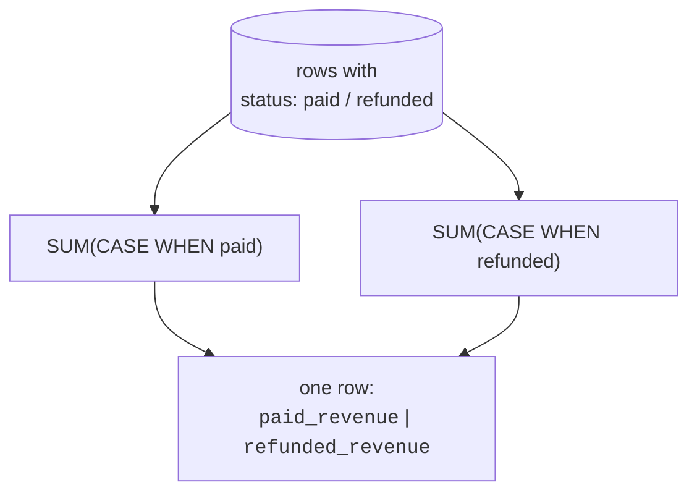

Raw data rarely arrives in the categories your analysis needs. You have
exact ages but want brackets; exact amounts but want "small / medium /
large"; a `status` column but want separate counts of paid and refunded
in one row. **Conditional logic**, the `CASE` expression and friends, is
how analysts reshape values on the fly. This page also introduces
**conditional aggregation**, one of the most useful patterns in all of
analytical SQL.

<svg
  viewBox="0 0 640 215"
  role="img"
  aria-label="Gray values ride one line into a yellow CASE diamond that routes each along a solid branch line into a blue, green, or red bucket, the first test a value passes decides its category"
  style={{ display: "block", width: "100%", maxWidth: "640px", height: "auto", margin: "2.5rem auto" }}
>
  <g stroke="var(--ds-gray-400)" strokeWidth="2.5" strokeLinecap="round">
    <line x1="40" y1="108" x2="240" y2="108" />
    <line x1="300" y1="108" x2="420" y2="48" />
    <line x1="300" y1="108" x2="420" y2="108" />
    <line x1="300" y1="108" x2="420" y2="168" />
  </g>
  <g fill="var(--ds-gray-500)">
    <circle cx="80" cy="108" r="6" />
    <circle cx="130" cy="108" r="6" />
    <circle cx="180" cy="108" r="6" />
  </g>
  <g style={{ color: "var(--ds-yellow-500)" }} fill="currentColor">
    <path d="M 270 78 L 300 108 L 270 138 L 240 108 Z" />
  </g>
  <g style={{ color: "var(--ds-blue-500)" }} fill="currentColor">
    <rect x="420" y="28" width="150" height="40" rx="20" fillOpacity="0.15" />
    <circle cx="450" cy="48" r="6" />
    <circle cx="482" cy="48" r="6" />
  </g>
  <g style={{ color: "var(--ds-green-500)" }} fill="currentColor">
    <rect x="420" y="88" width="150" height="40" rx="20" fillOpacity="0.15" />
    <circle cx="450" cy="108" r="6" />
    <circle cx="482" cy="108" r="6" />
    <circle cx="514" cy="108" r="6" />
  </g>
  <g style={{ color: "var(--ds-red-500)" }} fill="currentColor">
    <rect x="420" y="148" width="150" height="40" rx="20" fillOpacity="0.15" />
    <circle cx="450" cy="168" r="6" />
  </g>
</svg>

## `CASE`: if/else for a column

A `CASE` expression evaluates conditions in order and returns the value
for the first one that matches. It is SQL's if/else, and it turns a
continuous or messy column into clean, analysis-ready categories.

<SqlCodeBlock
  dialect="duckdb"
  title="Bucket amounts into size labels"
  initSql={`CREATE TABLE orders (id INTEGER, amount DECIMAL(8, 2));

INSERT INTO
  orders
VALUES
  (1, 15),
  (2, 120),
  (3, 45),
  (4, 250),
  (5, 8),
  (6, 95),
  (7, 500);`}
  starterCode={`SELECT
  id,
  amount,
  CASE
    WHEN amount < 50 THEN 'small'
    WHEN amount < 200 THEN 'medium'
    ELSE 'large'
  END AS size_bucket
FROM
  orders
ORDER BY
  amount;`}
/>

The conditions are tested **top to bottom**, and the first match wins,
so order them from most specific to most general. If nothing matches and
there is no `ELSE`, the result is `NULL`.

## Group by a `CASE` bucket

Because a `CASE` produces a value like any other, you can `GROUP BY` it,
inventing a dimension that does not exist in the data and summarizing by
it. This is the "derived bucket" idea from the grouping lesson, now in
your toolkit for good.

<SqlCodeBlock
  dialect="duckdb"
  title="How many orders in each size bucket?"
  initSql={`CREATE TABLE orders (id INTEGER, amount DECIMAL(8, 2));

INSERT INTO
  orders
VALUES
  (1, 15),
  (2, 120),
  (3, 45),
  (4, 250),
  (5, 8),
  (6, 95),
  (7, 500),
  (8, 60);`}
  starterCode={`SELECT
  CASE
    WHEN amount < 50 THEN 'small'
    WHEN amount < 200 THEN 'medium'
    ELSE 'large'
  END AS size_bucket,
  COUNT(*) AS orders,
  SUM(amount) AS revenue
FROM
  orders
GROUP BY
  size_bucket
ORDER BY
  revenue DESC;`}
/>

## Conditional aggregation: `SUM(CASE ...)`

Here is the pattern that feels like magic the first time you see it. By
putting a `CASE` *inside* an aggregate, you can compute **several
filtered totals in a single row**, paid vs. refunded, this year vs. last,
mobile vs. desktop, all side by side.

<SqlCodeBlock
  dialect="duckdb"
  title="Paid and refunded totals, side by side"
  initSql={`CREATE TABLE orders (
  id INTEGER,
  region TEXT,
  status TEXT,
  amount DECIMAL(8, 2)
);

INSERT INTO
  orders
VALUES
  (1, 'West', 'paid', 120),
  (2, 'West', 'refunded', 45),
  (3, 'East', 'paid', 200),
  (4, 'East', 'paid', 50),
  (5, 'North', 'refunded', 60),
  (6, 'West', 'paid', 95),
  (7, 'East', 'refunded', 30),
  (8, 'North', 'paid', 100);`}
  starterCode={`SELECT
  region,
  SUM(
    CASE
      WHEN status = 'paid' THEN amount
      ELSE 0
    END
  ) AS paid_revenue,
  SUM(
    CASE
      WHEN status = 'refunded' THEN amount
      ELSE 0
    END
  ) AS refunded_revenue,
  COUNT(*) FILTER(
    WHERE
      status = 'paid'
  ) AS paid_orders
FROM
  orders
GROUP BY
  region
ORDER BY
  region;`}
/>

How it works: for each row, the inner `CASE` contributes the `amount` only
when the condition holds (and `0` otherwise), so `SUM` adds up just the
matching rows. You get one column per condition, effectively pivoting a
category into columns. The last column uses DuckDB's cleaner **`FILTER`**
clause, which does the same thing more readably.

## `FILTER`, the modern, readable alternative

DuckDB supports the SQL-standard `FILTER (WHERE ...)` clause on aggregates,
which expresses conditional aggregation more clearly than `CASE` inside
`SUM`. Prefer it when available.

<SqlCodeBlock
  dialect="duckdb"
  title="The same idea, written with FILTER"
  initSql={`CREATE TABLE orders (
  id INTEGER,
  region TEXT,
  status TEXT,
  amount DECIMAL(8, 2)
);

INSERT INTO
  orders
VALUES
  (1, 'West', 'paid', 120),
  (2, 'West', 'refunded', 45),
  (3, 'East', 'paid', 200),
  (4, 'East', 'paid', 50),
  (5, 'North', 'refunded', 60),
  (6, 'West', 'paid', 95);`}
  starterCode={`SELECT
  region,
  SUM(amount) FILTER(
    WHERE
      status = 'paid'
  ) AS paid_revenue,
  SUM(amount) FILTER(
    WHERE
      status = 'refunded'
  ) AS refunded_revenue,
  COUNT(*) FILTER(
    WHERE
      status = 'paid'
  ) AS paid_orders
FROM
  orders
GROUP BY
  region
ORDER BY
  region;`}
/>

`SUM(amount) FILTER (WHERE status = 'paid')` reads almost like English:
"sum the amount, but only for paid rows." It is the analyst's preferred
way to build these side-by-side filtered metrics.

## Handling NULLs: `COALESCE` and `NULLIF`

Two small but constant companions of conditional logic:

- **`COALESCE(a, b, ...)`** returns the first non-NULL argument, perfect
  for filling in a default: `COALESCE(discount, 0)`.
- **`NULLIF(a, b)`** returns `NULL` when `a = b`, most often used to
  avoid divide-by-zero: `amount / NULLIF(quantity, 0)`.

<svg
  viewBox="0 0 640 160"
  role="img"
  aria-label="Two divisions on stacked cards: dividing a blue value by a raw red zero ends in a jagged red burst, while NULLIF turns the zero into a hollow ring first so the same division lands as a calm green NULL"
  style={{ display: "block", width: "100%", maxWidth: "520px", height: "auto", margin: "2.5rem auto" }}
>
  <g style={{ color: "var(--ds-red-500)" }} fill="currentColor">
    <rect x="48" y="24" width="544" height="52" rx="12" fillOpacity="0.1" />
  </g>
  <g style={{ color: "var(--ds-green-500)" }} fill="currentColor">
    <rect x="48" y="92" width="544" height="52" rx="12" fillOpacity="0.12" />
  </g>
  <g style={{ color: "var(--ds-blue-500)" }} fill="currentColor">
    <rect x="76" y="42" width="64" height="16" rx="8" />
    <rect x="76" y="110" width="64" height="16" rx="8" />
  </g>
  <g fill="var(--ds-gray-500)">
    <rect x="166" y="36" width="4" height="28" rx="2" transform="rotate(20 168 50)" />
    <rect x="166" y="104" width="4" height="28" rx="2" transform="rotate(20 168 118)" />
    <rect x="248" y="44" width="24" height="4" rx="2" />
    <rect x="248" y="54" width="24" height="4" rx="2" />
    <rect x="248" y="112" width="24" height="4" rx="2" />
    <rect x="248" y="122" width="24" height="4" rx="2" />
  </g>
  <circle cx="210" cy="50" r="10" fill="none" stroke="var(--ds-red-500)" strokeWidth="4" />
  <circle cx="210" cy="118" r="10" fill="none" stroke="var(--ds-gray-400)" strokeWidth="3.5" />
  <g style={{ color: "var(--ds-red-500)" }} fill="currentColor">
    <path d="M 310 41 L 319 25 L 324 39 L 340 31 L 334 45 L 350 49 L 334 55 L 342 69 L 326 61 L 320 75 L 314 59 L 298 65 L 306 51 L 290 45 L 306 43 Z" />
  </g>
  <circle cx="320" cy="118" r="13" fill="none" stroke="var(--ds-green-500)" strokeWidth="5" />
</svg>

<SqlCodeBlock
  dialect="duckdb"
  title="Safe defaults and safe division"
  initSql={`CREATE TABLE line_items (
  id INTEGER,
  amount DECIMAL(8, 2),
  quantity INTEGER,
  discount DECIMAL(8, 2)
);

INSERT INTO
  line_items
VALUES
  (1, 100, 4, NULL),
  (2, 60, 0, 5),
  (3, 80, 2, NULL);`}
  starterCode={`SELECT
  id,
  COALESCE(discount, 0) AS discount_filled,
  ROUND(amount / NULLIF(quantity, 0), 2) AS price_each -- NULL, not error, when qty=0
FROM
  line_items
ORDER BY
  id;`}
/>

## Check your understanding

<MultipleChoice
  markdown={`In a \`CASE\` expression with several \`WHEN\` branches, which branch's value is returned?

- The branch with the largest value.
  > \`CASE\` does not compare result values; it returns the first matching condition's value.
- [o] The first \`WHEN\` whose condition is true, evaluated top to bottom.
  > \`CASE\` tests conditions in order and stops at the first match, so branch order matters.
- All matching branches, concatenated.
  > Only one value is returned, that of the first matching branch.
- A random matching branch.
  > Evaluation is deterministic: the first true condition wins.

\`CASE\` returns the first matching branch, so order conditions from
specific to general.`}
/>

<MultipleChoice
  markdown={`What does \`SUM(CASE WHEN status = 'paid' THEN amount ELSE 0 END)\` compute per group?

- The total amount of all rows regardless of status.
  > The \`CASE\` contributes 0 for non-paid rows, so only paid amounts are summed.
- [o] The total \`amount\` of only the \`paid\` rows, because non-paid rows contribute 0.
  > The inner \`CASE\` zeroes out non-matching rows, so \`SUM\` effectively totals just the paid amounts.
- The count of paid rows.
  > It sums \`amount\`, not a count; a count would use \`COUNT(...)\`.
- NULL, because of the \`ELSE\`.
  > The \`ELSE 0\` ensures a numeric contribution; the result is a real sum, not NULL.

Conditional aggregation sums only the rows matching the inner condition,
producing a filtered total in its own column.`}
/>

<MultipleChoice
  markdown={`Why is \`amount / NULLIF(quantity, 0)\` safer than \`amount / quantity\`?

- It rounds the result automatically.
  > \`NULLIF\` does not round; it guards against a specific divisor value.
- [o] When \`quantity\` is 0, \`NULLIF\` turns it into \`NULL\`, so the division yields \`NULL\` instead of a divide-by-zero error.
  > Dividing by NULL produces NULL rather than failing, which keeps the query running on bad rows.
- It makes the division faster.
  > The benefit is safety, not speed.
- It converts the result to text.
  > The result stays numeric (or NULL); no type change occurs.

\`NULLIF(quantity, 0)\` converts a zero divisor to NULL, avoiding
divide-by-zero.`}
/>

You can now reshape values with conditions and build pivot-style filtered
metrics. Next, a data type that has its own rules and rewards, **dates
and time**.
