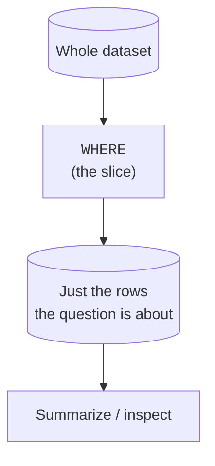
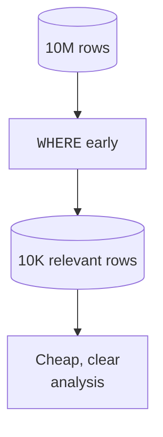

Profiling tells you what the whole dataset looks like. Most questions,
though, are about a **part** of it: this region, this month, these
categories. Carving out that part is **slicing**, and the tool is the
`WHERE` clause you already know, used with an analyst's intent. This page
sharpens your filtering vocabulary and explains *why* analysts filter as
early as possible.

<Figure
  slug="duck-filtering-cutout"
  alt="A wide grid platform with a narrow cutting frame lifting out one contiguous slab of rows"
/>

## A slice is a question in disguise

Every business question hides a filter. "How are sales in the West?" means
`WHERE region = 'West'`. "What happened in Q1?" means a date range.
Learning to *hear* the filter inside a question is half of analytical SQL.

## Ranges with `BETWEEN`

Numeric ranges come up constantly, a price band, a carat bracket, an age
window. `BETWEEN` reads naturally and is **inclusive** on both ends. Here
we slice the real diamonds file down to a specific shopping bracket:
one-carat stones priced between \$4,000 and \$5,000.

<SyntaxBreakdown
  parts={[
    { text: "WHERE" },
    { text: "price", label: "the column to bracket" },
    { text: "BETWEEN" },
    { text: "4000", label: "low end, included" },
    { text: "AND" },
    { text: "5000", label: "high end, also included" },
  ]}
/>

<SqlCodeBlock
  dialect="duckdb"
  title="Slice a price band and a carat band out of 53,940 diamonds"
  starterCode={`SELECT
  carat,
  cut,
  color,
  price
FROM
  read_parquet(
    'https://cdn.jsdelivr.net/gh/dataslope/datasets@f7f08485960fe4a774359a43d1eb50a84514daf2/diamonds.parquet'
  )
WHERE
  price BETWEEN 4000 AND 5000
  AND carat BETWEEN 1.0 AND 1.1
ORDER BY
  price DESC
LIMIT
  10;`}
/>

<Callout type="info" title="BETWEEN includes both endpoints">
`amount BETWEEN 100 AND 200` keeps rows where `amount` is 100, 200, and
everything in between. If you need to exclude an endpoint, use explicit
`>=` / `<` comparisons instead.
</Callout>

## Membership with `IN`

When a column must match one of several values, `IN` is cleaner than a
chain of `OR`s.

<SqlCodeBlock
  dialect="duckdb"
  title="Just the categories we care about"
  initSql={`CREATE TABLE products (
  id INTEGER,
  name TEXT,
  category TEXT,
  price DECIMAL(7, 2)
);

INSERT INTO
  products
VALUES
  (1, 'Pen', 'Office', 1.50),
  (2, 'Laptop', 'Electronics', 999.00),
  (3, 'Notebook', 'Office', 3.25),
  (4, 'Phone', 'Electronics', 699.00),
  (5, 'Mug', 'Kitchen', 8.00),
  (6, 'Desk', 'Furniture', 150.00),
  (7, 'Stapler', 'Office', 11.40),
  (8, 'Monitor', 'Electronics', 249.00),
  (9, 'Kettle', 'Kitchen', 29.99),
  (10, 'Chair', 'Furniture', 189.00),
  (11, 'Highlighter', 'Office', 2.10),
  (12, 'Keyboard', 'Electronics', 79.99),
  (13, 'Chopping board', 'Kitchen', 17.75),
  (14, 'Bookshelf', 'Furniture', 139.00),
  (15, 'Paper ream', 'Office', 4.60),
  (16, 'Headphones', 'Electronics', 129.99),
  (17, 'Tea pot', 'Kitchen', 19.40),
  (18, 'Footstool', 'Furniture', 34.50),
  (19, 'Binder', 'Office', 5.50),
  (20, 'Webcam', 'Electronics', 64.95),
  (21, 'Mixing bowl', 'Kitchen', 14.50),
  (22, 'Side table', 'Furniture', 92.00),
  (23, 'Desk mat', 'Office', 15.80),
  (24, 'Router', 'Electronics', 119.00);`}
  starterCode={`SELECT
  name,
  category,
  price
FROM
  products
WHERE
  category IN ('Office', 'Electronics')
ORDER BY
  price DESC;`}
/>

`category IN ('Office', 'Electronics')` is exactly `category = 'Office' OR
category = 'Electronics'`, but it scales gracefully to a long list.

## Text patterns with `LIKE` and `ILIKE`

Analysts often filter text by *shape* rather than exact value: names
starting with "A", emails at a domain, codes containing a substring.
`LIKE` uses `%` (any run of characters) and `_` (one character). DuckDB's
`ILIKE` is the case-insensitive version.

<SqlCodeBlock
  dialect="duckdb"
  title="Pattern matching on text"
  initSql={`CREATE TABLE people (id INTEGER, name TEXT, email TEXT);

INSERT INTO
  people
VALUES
  (1, 'Ada Lovelace', 'ada@math.org'),
  (2, 'Alan Turing', 'alan@compute.io'),
  (3, 'Grace Hopper', 'grace@navy.mil'),
  (4, 'Annie Easley', 'annie@nasa.gov'),
  (5, 'Edsger Dijkstra', 'edsger@cwi.nl'),
  (6, 'Barbara Liskov', 'barbara@mit.edu'),
  (7, 'Donald Knuth', 'don@stanford.edu'),
  (8, 'Frances Allen', 'fran@ibm.com'),
  (9, 'John McCarthy', 'john@stanford.edu'),
  (10, 'Katherine Johnson', 'katherine@nasa.gov'),
  (11, 'Dennis Ritchie', 'dmr@bell-labs.com'),
  (12, 'Radia Perlman', 'radia@compute.io'),
  (13, 'Ken Thompson', 'ken@bell-labs.com'),
  (14, 'Adele Goldberg', 'adele@parc.xerox.com'),
  (15, 'Tony Hoare', 'tony@ox.ac.uk'),
  (16, 'Jean Bartik', 'jean@eniac.org'),
  (17, 'Vint Cerf', 'vint@internet.org'),
  (18, 'Shafi Goldwasser', 'shafi@mit.edu'),
  (19, 'Leslie Lamport', 'leslie@compute.io'),
  (20, 'Peter Naur', 'peter@diku.dk'),
  (21, 'Mary Wilkes', 'mary@linc.org'),
  (22, 'Niklaus Wirth', 'niklaus@ethz.ch'),
  (23, 'Sophie Wilson', 'sophie@acorn.co.uk'),
  (24, 'Alan Kay', 'alan.kay@parc.xerox.com');`}
  starterCode={`SELECT
  name,
  email
FROM
  people
WHERE
  name ILIKE 'a%' -- name starts with A or a
  AND email LIKE '%.gov';

-- email ends in .gov`}
/>

## Combining conditions, and the danger of `AND`/`OR`

Real slices combine conditions. Be careful mixing `AND` and `OR`: `AND`
binds tighter than `OR`, so without parentheses the query may not mean
what you intended. Make your grouping explicit.

<SqlCodeBlock
  dialect="duckdb"
  title="Parentheses make the intent unambiguous"
  initSql={`CREATE TABLE orders (id INTEGER, region TEXT, amount DECIMAL(7, 2));

INSERT INTO
  orders
VALUES
  (1, 'West', 120),
  (2, 'East', 80),
  (3, 'North', 45),
  (4, 'South', 200),
  (5, 'West', 60),
  (6, 'East', 95),
  (7, 'North', 30),
  (8, 'South', 250),
  (9, 'West', 175),
  (10, 'East', 55),
  (11, 'North', 310),
  (12, 'South', 70),
  (13, 'West', 140),
  (14, 'East', 220),
  (15, 'North', 35),
  (16, 'South', 165),
  (17, 'West', 90),
  (18, 'East', 285),
  (19, 'North', 110),
  (20, 'South', 40),
  (21, 'West', 195),
  (22, 'East', 65),
  (23, 'North', 240),
  (24, 'South', 150);`}
  starterCode={`-- "Big orders, but only from West or East."
SELECT
  id,
  region,
  amount
FROM
  orders
WHERE
  amount > 100
  AND (
    region = 'West'
    OR region = 'East'
  )
ORDER BY
  amount DESC;`}
/>

Without the parentheses, `amount > 100 AND region = 'West' OR region =
'East'` would also return *every* East order regardless of amount, a
classic, silent analytical bug.

## Why analysts filter *early*

Filtering early is both a performance habit and a clarity habit:

- **Less data to process.** A slice of 10,000 rows summarizes faster than
  a table of 10 million. On a column store, a tight `WHERE` lets the engine
  skip whole chunks.
- **Clearer reasoning.** Once the data is reduced to "the rows this
  question is about," every later step, grouping, joining, averaging, is
  easier to think about.

<Figure
  slug="duck-filtering-and-slicing-inline-cutout"
  alt="A long board with a section cut out by two straight blades, that section lifted away on its own"
  caption="Filtering early means everything after it has less work and less noise."
/>

The rule of thumb: **slice down to what the question is about as soon as
you can.**

## Check your understanding

<MultipleChoice
  markdown={`Which rows does \`amount BETWEEN 100 AND 200\` keep?

- Rows where \`amount\` is strictly between 100 and 200, excluding both.
  > \`BETWEEN\` is inclusive, so 100 and 200 are kept, not excluded.
- Only rows where \`amount\` equals exactly 100 or exactly 200.
  > \`BETWEEN\` keeps the whole range, not just the endpoints.
- [o] Rows where \`amount\` is 100, 200, or anything in between (both endpoints included).
  > \`BETWEEN\` includes both bounds; use explicit \`>\`/\`<\` if you need to exclude an endpoint.
- No rows, because \`BETWEEN\` needs three values.
  > \`BETWEEN low AND high\` is the correct two-bound form and returns the matching range.

\`BETWEEN\` is inclusive of both endpoints.`}
/>

<MultipleChoice
  markdown={`Why is \`region IN ('West', 'East')\` preferred over \`region = 'West' OR region = 'East'\` for longer lists?

- \`OR\` cannot be used with text columns.
  > \`OR\` works fine with text; the preference for \`IN\` is about readability at scale.
- Because \`IN\` checks ranges while \`OR\` checks equality.
  > \`IN\` checks membership (equality against a set), not ranges; the advantage is readability, not different semantics.
- [o] They are equivalent, but \`IN\` is more readable and scales cleanly as the list of values grows.
  > \`IN\` expresses "matches any of these" compactly, avoiding a long, error-prone chain of \`OR\`s.
- \`IN\` is faster because it ignores NULLs differently and returns more rows.
  > The benefit is clarity; \`IN\` does not return more rows, and that NULL claim is not why analysts prefer it.

\`IN\` is a concise, readable membership test equivalent to a chain of \`OR\`s.`}
/>

<MultipleChoice
  markdown={`A query has \`WHERE amount > 100 AND region = 'West' OR region = 'East'\` with no parentheses. Why is this risky?

- [o] \`AND\` binds tighter than \`OR\`, so it returns big West orders **plus every East order**, which is probably not intended.
  > Without parentheses the engine reads it as \`(amount > 100 AND region = 'West') OR region = 'East'\`, pulling in all East rows regardless of amount.
- \`OR\` is not allowed in a \`WHERE\` clause.
  > \`OR\` is perfectly valid; the issue is operator precedence without parentheses.
- It always returns zero rows.
  > It returns rows; the problem is that it returns too many, not none.
- It is a syntax error and will not run.
  > It runs fine; the danger is that it runs and returns the *wrong* rows.

Because \`AND\` binds tighter than \`OR\`, mixing them without parentheses
silently changes the meaning, always group explicitly.`}
/>

You can now carve any slice you need. Often the next move is to **sort** a
slice and look at its top or bottom, the subject of the next page.
