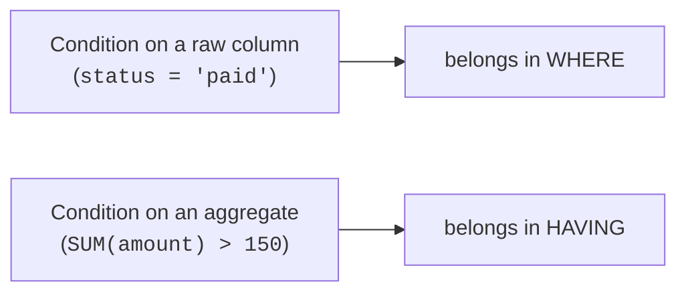

You can summarize per group. Now you want to keep only the *interesting*
groups — "regions with revenue over \$1000", "customers with more than 10
orders", "products averaging below 3 stars." That is **`HAVING`**: a
filter that runs *after* aggregation, on the group summaries themselves.
The hardest part is keeping it distinct from `WHERE`, so that is what this
page nails down.

<svg
  viewBox="0 0 640 235"
  role="img"
  aria-label="Three groups of blue dots each feed a total bar below; a dashed yellow threshold line crosses the bars, and only the two green totals tall enough to reach it survive while the short red one falls out — HAVING filters whole groups after aggregation"
  style={{ display: "block", width: "100%", maxWidth: "640px", height: "auto", margin: "2.5rem auto" }}
>
  <g style={{ color: "var(--ds-blue-500)" }} fill="currentColor">
    <rect x="110" y="24" width="80" height="52" rx="10" fillOpacity="0.12" />
    <circle cx="134" cy="48" r="5" />
    <circle cx="152" cy="40" r="5" />
    <circle cx="168" cy="50" r="5" />
    <circle cx="142" cy="62" r="5" />
    <circle cx="160" cy="60" r="5" />
    <rect x="290" y="24" width="80" height="52" rx="10" fillOpacity="0.12" />
    <circle cx="318" cy="50" r="5" />
    <circle cx="342" cy="54" r="5" />
    <rect x="470" y="24" width="80" height="52" rx="10" fillOpacity="0.12" />
    <circle cx="494" cy="48" r="5" />
    <circle cx="512" cy="42" r="5" />
    <circle cx="528" cy="52" r="5" />
    <circle cx="504" cy="62" r="5" />
  </g>
  <g stroke="var(--ds-gray-300)" strokeWidth="2">
    <line x1="150" y1="76" x2="150" y2="110" />
    <line x1="330" y1="76" x2="330" y2="170" />
    <line x1="510" y1="76" x2="510" y2="124" />
  </g>
  <g style={{ color: "var(--ds-green-500)" }} fill="currentColor">
    <rect x="120" y="110" width="60" height="100" rx="5" />
    <rect x="480" y="124" width="60" height="86" rx="5" />
  </g>
  <g style={{ color: "var(--ds-red-500)" }} fill="currentColor">
    <rect x="300" y="170" width="60" height="40" rx="5" />
  </g>
  <line x1="80" y1="150" x2="560" y2="150" stroke="var(--ds-yellow-500)" strokeWidth="3.5" strokeDasharray="12 9" strokeLinecap="round" />
  <rect x="90" y="210" width="460" height="3" rx="1.5" fill="var(--ds-gray-400)" />
</svg>

## Two filters, two moments

`WHERE` and `HAVING` both filter — but at different stages of the query.

- **`WHERE`** runs **before** grouping. It filters individual *rows*, so
  it can only see raw columns, never group totals.
- **`HAVING`** runs **after** grouping. It filters whole *groups*, so it
  can see aggregates like `SUM(amount)`.

The clauses run in a fixed order:

**Rows → `WHERE` (filter rows) → `GROUP BY` (form groups) → aggregate
(per-group totals) → `HAVING` (filter groups) → `ORDER BY`**

That order is the whole mental model. `WHERE` is upstream of the groups;
`HAVING` is downstream. A condition that mentions an aggregate *must* go in
`HAVING`, because the aggregate does not exist yet when `WHERE` runs.

## `HAVING` in action

"Which regions brought in more than \$150 of revenue?" The condition is
about `SUM(amount)` — a group total — so it belongs in `HAVING`.

<SqlCodeBlock
  dialect="duckdb"
  title="Only the high-revenue regions"
  initSql={`CREATE TABLE orders (id INTEGER, region TEXT, amount DECIMAL(8, 2));

INSERT INTO
  orders
VALUES
  (1, 'West', 120),
  (2, 'East', 80),
  (3, 'West', 45),
  (4, 'East', 200),
  (5, 'North', 60),
  (6, 'West', 95),
  (7, 'East', 30);`}
  starterCode={`SELECT
  region,
  SUM(amount) AS revenue
FROM
  orders
GROUP BY
  region
HAVING
  SUM(amount) > 150 -- filter on the group total
ORDER BY
  revenue DESC;`}
/>

North (60) and any other small region are dropped *after* their totals
are computed. You cannot express this with `WHERE`, because at `WHERE`
time there is no per-region total to compare against.

## Using `WHERE` and `HAVING` together

They are not rivals — analysts routinely use both in one query, each doing
its proper job: `WHERE` narrows the rows that *enter* the groups; `HAVING`
selects which resulting groups *survive*.

<SqlCodeBlock
  dialect="duckdb"
  title="Filter rows first, then filter groups"
  initSql={`CREATE TABLE orders (
  id INTEGER,
  region TEXT,
  status TEXT,
  amount DECIMAL(8, 2)
);

INSERT INTO
  orders
VALUES
  (1, 'West', 'paid', 120),
  (2, 'East', 'paid', 80),
  (3, 'West', 'refunded', 45),
  (4, 'East', 'paid', 200),
  (5, 'North', 'paid', 60),
  (6, 'West', 'paid', 95),
  (7, 'East', 'refunded', 300),
  (8, 'North', 'paid', 100);`}
  starterCode={`SELECT
  region,
  COUNT(*) AS paid_orders,
  SUM(amount) AS paid_revenue
FROM
  orders
WHERE
  status = 'paid' -- 1) keep only paid rows
GROUP BY
  region
HAVING
  SUM(amount) > 150 -- 2) keep only big-revenue regions
ORDER BY
  paid_revenue DESC;`}
/>

Read it as a pipeline: *"Of the **paid** orders, group by region, and show
only regions whose paid revenue exceeds \$150."* The refunded rows never
enter the groups at all — and that changes the totals `HAVING` then
judges.

<svg
  viewBox="0 0 640 165"
  role="img"
  aria-label="A flow with two checkpoints: gray rows pass a yellow WHERE gate that drops one red row, the survivors gather into group cards, and a taller yellow HAVING gate lets only the full green group through while the thin red group stays behind"
  style={{ display: "block", width: "100%", maxWidth: "600px", height: "auto", margin: "2.5rem auto" }}
>
  <g fill="var(--ds-gray-500)">
    <circle cx="46" cy="80" r="5" />
    <circle cx="72" cy="64" r="5" />
    <circle cx="72" cy="96" r="5" />
    <circle cx="98" cy="80" r="5" />
  </g>
  <g style={{ color: "var(--ds-yellow-500)" }} fill="currentColor">
    <rect x="126" y="44" width="9" height="30" rx="4.5" />
    <rect x="126" y="88" width="9" height="30" rx="4.5" />
  </g>
  <g style={{ color: "var(--ds-red-500)" }} fill="currentColor">
    <circle cx="118" cy="142" r="5" />
  </g>
  <g style={{ color: "var(--ds-blue-500)" }} fill="currentColor">
    <circle cx="162" cy="80" r="5" />
    <circle cx="186" cy="80" r="5" />
    <rect x="216" y="40" width="74" height="54" rx="10" fillOpacity="0.12" />
    <circle cx="238" cy="74" r="5.5" />
    <circle cx="256" cy="68" r="5.5" />
    <circle cx="272" cy="76" r="5.5" />
    <circle cx="246" cy="56" r="5.5" />
  </g>
  <g style={{ color: "var(--ds-red-500)" }} fill="currentColor">
    <rect x="216" y="104" width="74" height="40" rx="10" fillOpacity="0.12" />
    <circle cx="244" cy="124" r="5.5" />
  </g>
  <g style={{ color: "var(--ds-yellow-500)" }} fill="currentColor">
    <rect x="322" y="24" width="11" height="44" rx="5" />
    <rect x="322" y="92" width="11" height="44" rx="5" />
  </g>
  <g style={{ color: "var(--ds-green-500)" }} fill="currentColor">
    <rect x="368" y="46" width="84" height="56" rx="11" fillOpacity="0.16" />
    <circle cx="392" cy="84" r="6" />
    <circle cx="412" cy="78" r="6" />
    <circle cx="428" cy="86" r="6" />
    <circle cx="402" cy="64" r="6" />
  </g>
</svg>

## The classic mistake

Putting an aggregate in `WHERE` is the error everyone makes once:

```sql
-- ❌ Wrong: SUM() does not exist yet when WHERE runs
SELECT region, SUM(amount)
FROM orders
WHERE SUM(amount) > 150
GROUP BY region;
```

DuckDB rejects this because `WHERE` filters rows *before* any grouping or
summing happens. Move the aggregate condition to `HAVING` and it works.
The reverse mistake — putting a plain row condition in `HAVING` — usually
runs but is wasteful: filter rows in `WHERE` so fewer rows ever reach the
grouping step.



## A quick decision rule

Ask: *does my condition mention an aggregate?*

- **No** (it is about a single row's column) → `WHERE`.
- **Yes** (it is about a group total/average/count) → `HAVING`.

## Check your understanding

<MultipleChoice
  markdown={`What is the key difference between \`WHERE\` and \`HAVING\`?

- \`WHERE\` is for numbers and \`HAVING\` is for text.
  > Both work with any data type; the difference is *when* they run, not what type they filter.
- [o] \`WHERE\` filters individual rows before grouping; \`HAVING\` filters groups after aggregates are computed.
  > \`WHERE\` runs upstream of \`GROUP BY\` (raw rows), while \`HAVING\` runs downstream (group summaries).
- \`HAVING\` runs before \`WHERE\`.
  > The order is \`WHERE\` then \`GROUP BY\` then \`HAVING\`; \`HAVING\` runs later, not earlier.
- They are interchangeable synonyms.
  > They filter at different stages and can see different things, so they are not interchangeable.

\`WHERE\` filters rows pre-grouping; \`HAVING\` filters groups post-aggregation.`}
/>

<MultipleChoice
  markdown={`Why does \`WHERE SUM(amount) > 150\` fail?

- \`SUM\` is not a valid function.
  > \`SUM\` is valid; the problem is *where* it is used.
- [o] \`WHERE\` runs before grouping, so per-group sums do not exist yet — aggregate conditions belong in \`HAVING\`.
  > At \`WHERE\` time there are only individual rows, no group totals, so \`SUM(amount)\` cannot be evaluated there.
- \`WHERE\` cannot compare numbers with \`>\`.
  > \`WHERE\` compares numbers fine; the issue is the aggregate, not the operator.
- You must always use \`SUM\` in \`WHERE\`.
  > You must *never* use an aggregate in \`WHERE\`; it goes in \`HAVING\`.

Aggregate conditions must go in \`HAVING\` because aggregates are computed
after \`WHERE\`.`}
/>

<MultipleChoice
  markdown={`A query keeps only **paid** orders, groups by region, and keeps regions with revenue over \$1000. Where does each condition go?

- Both conditions go in \`HAVING\`.
  > \`status = 'paid'\` is a per-row condition and should filter rows in \`WHERE\`, before grouping.
- Both conditions go in \`WHERE\`.
  > \`revenue > 1000\` uses \`SUM\`, an aggregate, which \`WHERE\` cannot evaluate; it must go in \`HAVING\`.
- [o] \`status = 'paid'\` goes in \`WHERE\`; \`SUM(amount) > 1000\` goes in \`HAVING\`.
  > The row-level condition filters rows before grouping; the aggregate condition filters groups after summing.
- The query is impossible in SQL.
  > Combining \`WHERE\` and \`HAVING\` in one query is common and fully valid.

Row conditions → \`WHERE\`; aggregate conditions → \`HAVING\`.`}
/>

## Your turn

A quick win on real data. A table `loans` holds Lending Club results;
report each loan grade's count and average interest rate.

<SqlChallengeCard
  dialect="duckdb"
  title="Average interest rate per loan grade"
  instructions={`The table \`loans\` is pre-loaded. Return one row per \`grade\` with columns \`grade\`, \`loans\` (the row count), and \`avg_rate\` (the average \`int_rate\` rounded to 2 decimals). Sort by \`avg_rate\` descending.`}
  initSql={`CREATE TABLE loans AS
SELECT
  *
FROM
  read_parquet(
    'https://cdn.jsdelivr.net/gh/dataslope/datasets@f7f08485960fe4a774359a43d1eb50a84514daf2/lending-club-loan-results.parquet'
  );`}
  starterCode={`SELECT
  grade,
  COUNT(*) AS loans,
  -- replace the 0 with the rounded average interest rate
  0 AS avg_rate
FROM
  loans
GROUP BY
  grade
ORDER BY
  avg_rate DESC;`}
  solutionSql={`SELECT
  grade,
  COUNT(*) AS loans,
  ROUND(AVG(int_rate), 2) AS avg_rate
FROM
  loans
GROUP BY
  grade
ORDER BY
  avg_rate DESC;`}
  tests={[
    {
      id: "columns",
      name: "Has the required columns",
      description: "grade, loans, avg_rate",
      expectedColumnsInclude: ["grade", "loans", "avg_rate"],
    },
    {
      id: "matches",
      name: "Matches the reference solution",
      description: "Same rows, same order",
      matchesSolution: true,
      ordered: true,
    },
  ]}
/>

You have now mastered summarization: aggregates, grouping, multi-level
subtotals, and group filtering. Next comes a different superpower —
**window functions**, which summarize *without collapsing* the rows.
