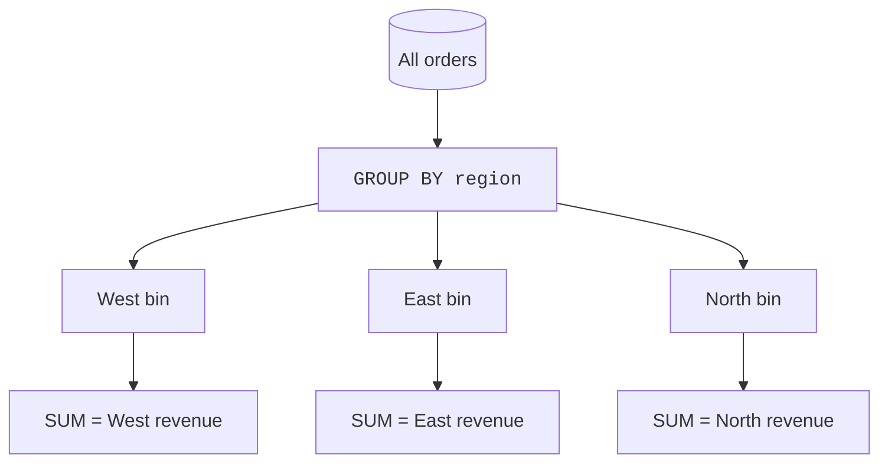
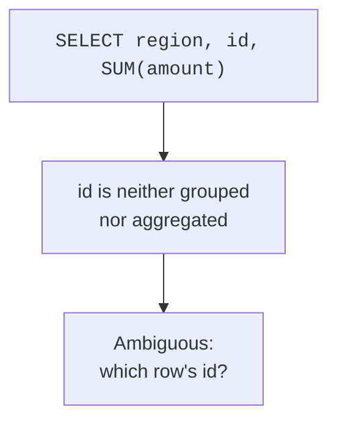
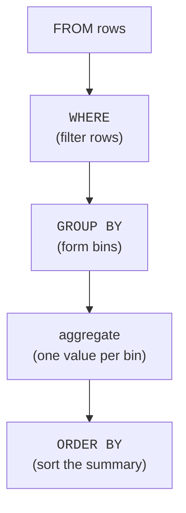

A grand total answers "how much, overall?" But analysts almost always
want more: "how much *per region*?", "average rating *per product*?",
"orders *per day*?". That per-something breakdown is **`GROUP BY`**, and
it is arguably the most-used construct in all of analytical SQL. This page
builds a solid mental model of what grouping really does.

<Figure
  slug="duck-grouping-cutout"
  alt="A mixed pile of colored tiles sorting down three chutes into three separate bins, each bin producing one summary block"
/>

## From one summary to many

Without `GROUP BY`, an aggregate collapses the *whole* table to one row.
`GROUP BY` first **sorts the rows into bins** by some key, then computes
the aggregate **once per bin**. One total becomes one total *per group*.

The result has **one row per group**, with the grouping column(s) plus
whatever you aggregated. Here it is over the real diamonds file: one line
per cut, summarizing 53,940 stones.

<SqlCodeBlock
  dialect="duckdb"
  title="Count, average carat, and average price per cut"
  starterCode={`SELECT
  cut,
  COUNT(*) AS n,
  ROUND(AVG(carat), 2) AS avg_carat,
  ROUND(AVG(price), 0) AS avg_price
FROM
  read_parquet(
    'https://cdn.jsdelivr.net/gh/dataslope/datasets@f7f08485960fe4a774359a43d1eb50a84514daf2/diamonds.parquet'
  )
GROUP BY
  cut
ORDER BY
  avg_price DESC;`}
/>

Read the result as a small report: each line is one cut, summarized. Look
closely and the order may surprise you, average price does *not* simply
track cut quality, because the cuts differ in their typical `carat`, and
size drives price hard. Noticing that mismatch, then asking *why*, is
exactly the kind of thread an analyst pulls on next.

## The golden rule of `GROUP BY`

Every column in the `SELECT` list must be either **in the `GROUP BY`** or
**inside an aggregate function**. This rule trips up everyone once, so it
is worth understanding *why*, not just memorizing it.

<Figure
  slug="duck-grouping-data-golden-rule-group-inline-cutout"
  alt="Chips raked into trays with a rule laid across saying every chip must belong to exactly one tray"
  caption="Every selected column must be grouped by or aggregated; there is no third option."
/>

When you group by `region`, each result row stands for a *whole group* of
orders. Asking for a bare `id` makes no sense, *which* order's id, when
the row represents twenty orders? There is no single answer, so SQL
refuses. The column must either *define* the group (`region`) or be
*summarized* across it (`SUM(amount)`).

<SqlCodeBlock
  dialect="duckdb"
  title="The rule in action, every column is grouped or aggregated"
  initSql={`CREATE TABLE sales (region TEXT, product TEXT, amount DECIMAL(8, 2));

INSERT INTO
  sales
VALUES
  ('West', 'Widget', 120),
  ('East', 'Gadget', 80),
  ('North', 'Sprocket', 45),
  ('South', 'Widget', 200),
  ('West', 'Gadget', 60),
  ('East', 'Sprocket', 95),
  ('North', 'Widget', 30),
  ('South', 'Gadget', 250),
  ('West', 'Sprocket', 175),
  ('East', 'Widget', 55),
  ('North', 'Gadget', 310),
  ('South', 'Sprocket', 70),
  ('West', 'Widget', 140),
  ('East', 'Gadget', 220),
  ('North', 'Sprocket', 35),
  ('South', 'Widget', 165),
  ('West', 'Gadget', 90),
  ('East', 'Sprocket', 285),
  ('North', 'Widget', 110),
  ('South', 'Gadget', 40),
  ('West', 'Sprocket', 195),
  ('East', 'Widget', 65),
  ('North', 'Gadget', 240),
  ('South', 'Sprocket', 150);`}
  starterCode={`SELECT
  region, -- grouped
  product, -- grouped
  COUNT(*) AS n, -- aggregated
  SUM(amount) AS revenue -- aggregated
FROM
  sales
GROUP BY
  region,
  product -- group by BOTH dimensions
ORDER BY
  region,
  revenue DESC;`}
/>

## Grouping by multiple columns

Grouping by two columns creates one row per **combination** that actually
appears. Above, you get one row per `(region, product)` pair, a small
matrix of the business. Adding a grouping column is exactly the
**drill-down** move from earlier: more dimensions, finer detail.

## Grouping by an expression

You can group by something computed, not just a stored column, by month
extracted from a date, by a price bucket, by the first letter of a name.
This is where grouping becomes genuinely creative.

<Figure
  slug="duck-grouping-data-inline-cutout"
  alt="A wide tray of chips raked into four trays by a comb, each tray carrying its own small counter"
  caption="You can group by something computed, not only by a stored column."
/>

<SqlCodeBlock
  dialect="duckdb"
  title="Group by a derived bucket"
  initSql={`CREATE TABLE orders (id INTEGER, amount DECIMAL(8, 2));

INSERT INTO
  orders
VALUES
  (1, 15),
  (2, 120),
  (3, 45),
  (4, 250),
  (5, 8),
  (6, 95),
  (7, 500),
  (8, 60),
  (9, 180),
  (10, 32),
  (11, 275),
  (12, 70),
  (13, 140),
  (14, 22),
  (15, 330),
  (16, 88),
  (17, 55),
  (18, 410),
  (19, 105),
  (20, 18),
  (21, 205),
  (22, 66),
  (23, 295),
  (24, 130);`}
  starterCode={`SELECT
  CASE
    WHEN amount < 50 THEN 'small'
    WHEN amount < 200 THEN 'medium'
    ELSE 'large'
  END AS size_bucket,
  COUNT(*) AS orders,
  SUM(amount) AS revenue
FROM
  orders
GROUP BY
  size_bucket -- group by the computed bucket
ORDER BY
  revenue DESC;`}
/>

You invented a *dimension* (`size_bucket`) that does not exist in the
table, then summarized by it. That is a remarkably powerful idea: grouping
keys can be anything you can compute.

## How a grouped query is processed

It helps to picture the order of operations: filter, then group, then
aggregate, then sort.

`WHERE` filters *individual rows* before grouping, it cannot see group
totals. Filtering on a group total needs `HAVING`, which is two pages
away.

## Check your understanding

<MultipleChoice
  markdown={`What does \`GROUP BY region\` do to a table of orders?

- [o] It forms one bin per region and computes the aggregates once per bin, yielding one result row per region.
  > \`GROUP BY\` partitions rows by the key and produces a single summarized row for each distinct group.
- It deletes all but one row per region.
  > Grouping does not delete data; it organizes rows into bins to summarize, leaving the table unchanged.
- It returns every order with the region repeated.
  > That is ungrouped selection; grouping collapses each region's orders into one summary row.
- It sorts the orders by region without summarizing.
  > Sorting alone is \`ORDER BY\`; \`GROUP BY\` exists to aggregate per group.

\`GROUP BY\` produces one summarized row per distinct group key.`}
/>

<MultipleChoice
  markdown={`In \`SELECT region, id, SUM(amount) FROM orders GROUP BY region\`, why is \`id\` a problem?

- You can never select more than two columns with \`GROUP BY\`.
  > You can select many columns, as long as each is grouped or aggregated.
- [o] Each result row represents a whole group of orders, so a single \`id\` is ambiguous, it is neither grouped nor aggregated.
  > Every selected column must be in the \`GROUP BY\` or inside an aggregate; a bare \`id\` has no single value per group.
- \`id\` is a reserved word.
  > \`id\` is a normal column name; the issue is grouping semantics, not reserved words.
- \`SUM(amount)\` is invalid when other columns are present.
  > \`SUM(amount)\` is fine; the problem is specifically the unaggregated, ungrouped \`id\`.

The golden rule: every selected column must be grouped or aggregated.`}
/>

<MultipleChoice
  markdown={`What does grouping by \`region, product\` (two columns) produce?

- One row per product only, ignoring region.
  > Both columns participate; neither is ignored.
- [o] One row per distinct \`(region, product)\` combination that appears in the data.
  > Multi-column grouping bins rows by the combination of values, giving a finer breakdown.
- A syntax error, because \`GROUP BY\` allows only one column.
  > \`GROUP BY\` accepts multiple columns; combining them is a normal drill-down.
- One row per region only, ignoring product.
  > Adding \`product\` makes the groups finer; the result is per combination, not per region alone.

Grouping by multiple columns yields one summary row per combination of
their values.`}
/>

## Your turn

A quick win on real data. The diamonds file is loaded into a table called
`diamonds`; group it by `color` and report the count and average price.

<SqlChallengeCard
  dialect="duckdb"
  title="Average price per diamond color"
  instructions={`The table \`diamonds\` is pre-loaded. Return one row per \`color\` with columns \`color\`, \`n\` (the row count), and \`avg_price\` (the average \`price\` rounded to the nearest whole number). Sort by \`avg_price\` descending.`}
  initSql={`CREATE TABLE diamonds AS
SELECT
  *
FROM
  read_parquet(
    'https://cdn.jsdelivr.net/gh/dataslope/datasets@f7f08485960fe4a774359a43d1eb50a84514daf2/diamonds.parquet'
  );`}
  starterCode={`SELECT
  color,
  COUNT(*) AS n,
  -- replace the 0 with the rounded average price
  0 AS avg_price
FROM
  diamonds
GROUP BY
  color
ORDER BY
  avg_price DESC;`}
  solutionSql={`SELECT
  color,
  COUNT(*) AS n,
  ROUND(AVG(price), 0) AS avg_price
FROM
  diamonds
GROUP BY
  color
ORDER BY
  avg_price DESC;`}
  tests={[
    {
      id: "columns",
      name: "Has the required columns",
      description: "color, n, avg_price",
      expectedColumnsInclude: ["color", "n", "avg_price"],
    },
    {
      id: "matches",
      name: "Matches the reference solution",
      description: "Same rows, same order",
      matchesSolution: true,
      ordered: true,
    },
  ]}
/>

`GROUP BY` is so central that DuckDB adds conveniences to make it terser
and more powerful, `GROUP BY ALL` and grouping sets. That is the next
page.
