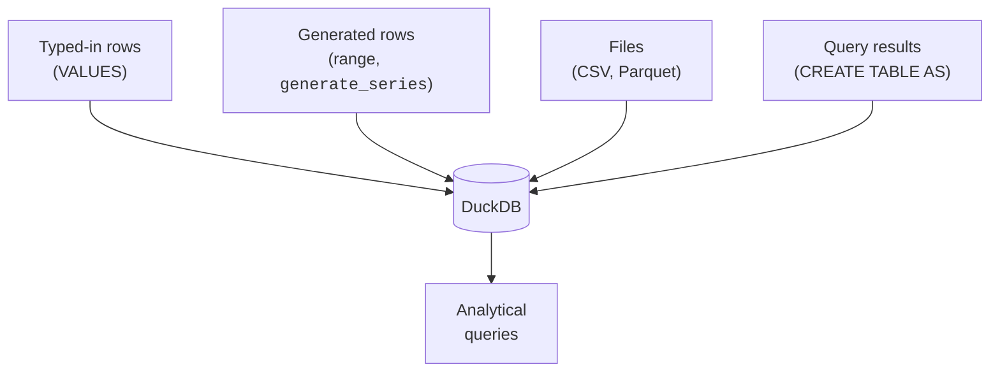
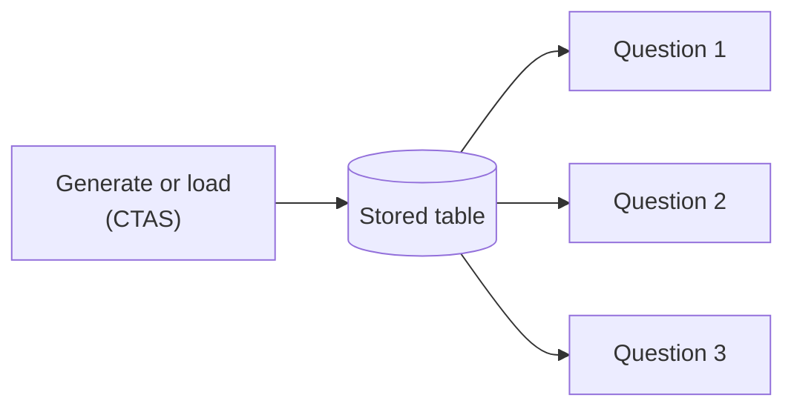

Before you can analyze data, it has to exist somewhere DuckDB can read it.
This page surveys the handful of ways analysts get data *in*, and
introduces two DuckDB conveniences you will use constantly: the `range()`
generator and `CREATE TABLE AS`. These let you build realistic practice
datasets in seconds — no files required.

<svg
  viewBox="0 0 640 215"
  role="img"
  aria-label="From a single green seed, a fountain of dots arcs across the canvas and lands as a neat grid of table cells that grow more solid as they materialize — whole practice datasets conjured from one generator expression"
  style={{ display: "block", width: "100%", maxWidth: "640px", height: "auto", margin: "2.5rem auto" }}
>
  <g style={{ color: "var(--ds-green-500)" }} fill="currentColor">
    <circle cx="72" cy="168" r="8" />
    <path d="M 72 158 Q 64 142 74 132 Q 80 146 72 158 Z" fillOpacity="0.7" />
    <circle cx="106" cy="130" r="3" fillOpacity="0.5" />
    <circle cx="142" cy="96" r="3.5" fillOpacity="0.6" />
    <circle cx="184" cy="68" r="4" fillOpacity="0.7" />
    <circle cx="232" cy="50" r="4.5" fillOpacity="0.8" />
    <circle cx="284" cy="42" r="5" fillOpacity="0.9" />
    <circle cx="336" cy="46" r="5" />
    <circle cx="382" cy="58" r="4.5" />
  </g>
  <g fill="currentColor" opacity="0.16">
    <circle cx="124" cy="60" r="3" />
    <circle cx="206" cy="110" r="3" />
    <circle cx="300" cy="86" r="3" />
  </g>
  <g style={{ color: "var(--ds-blue-500)" }} fill="currentColor">
    <rect x="424" y="80" width="38" height="20" rx="5" fillOpacity="0.25" />
    <rect x="468" y="80" width="38" height="20" rx="5" fillOpacity="0.45" />
    <rect x="512" y="80" width="38" height="20" rx="5" fillOpacity="0.65" />
    <rect x="556" y="80" width="38" height="20" rx="5" fillOpacity="0.85" />
    <rect x="424" y="106" width="38" height="20" rx="5" fillOpacity="0.2" />
    <rect x="468" y="106" width="38" height="20" rx="5" fillOpacity="0.4" />
    <rect x="556" y="106" width="38" height="20" rx="5" fillOpacity="0.8" />
    <rect x="424" y="132" width="38" height="20" rx="5" fillOpacity="0.15" />
    <rect x="468" y="132" width="38" height="20" rx="5" fillOpacity="0.35" />
    <rect x="512" y="132" width="38" height="20" rx="5" fillOpacity="0.55" />
    <rect x="556" y="132" width="38" height="20" rx="5" fillOpacity="0.75" />
    <rect x="424" y="158" width="38" height="20" rx="5" fillOpacity="0.1" />
    <rect x="468" y="158" width="38" height="20" rx="5" fillOpacity="0.3" />
    <rect x="512" y="158" width="38" height="20" rx="5" fillOpacity="0.5" />
    <rect x="556" y="158" width="38" height="20" rx="5" fillOpacity="0.7" />
  </g>
  <g style={{ color: "var(--ds-yellow-500)" }} fill="currentColor">
    <rect x="512" y="106" width="38" height="20" rx="5" fillOpacity="0.9" />
  </g>
</svg>

## Four ways data arrives



For real work, **files** dominate — analysts point DuckDB at a CSV or
Parquet export and query it directly. In this browser course we lean on
**generated** rows, because they let every example be self-contained and
reproducible. Both teach the same SQL.

## Literal rows with `VALUES`

The simplest source is data you type yourself. You have seen this in
`INSERT`, but `VALUES` can also stand alone as a tiny table — handy for
quick experiments.

<SqlCodeBlock
  dialect="duckdb"
  title="A throwaway table from literal VALUES"
  starterCode={`SELECT
  *
FROM
  (
    VALUES
      ('Mon', 120),
      ('Tue', 150),
      ('Wed', 90),
      ('Thu', 200),
      ('Fri', 175)
  ) AS t (day, visitors)
ORDER BY
  visitors DESC;`}
/>

No `CREATE TABLE` needed — `VALUES` becomes a table inline. Analysts use
this to sketch a quick example or test an idea.

## Generating rows with `range()`

DuckDB's `range(start, stop)` produces the integers from `start` up to
**but not including** `stop`. Combined with arithmetic, it can fabricate
realistic-looking datasets of any size — perfect for practice and for
testing a query's behavior at scale.

<SqlCodeBlock
  dialect="duckdb"
  title="Fabricate 12 months of fake revenue"
  starterCode={`SELECT
  i AS month,
  (i * 7) % 50 + 100 AS revenue
FROM
  range(1, 13) AS t (i)
ORDER BY
  month;`}
/>

<Callout type="info" title="range() is exclusive of the end">
`range(1, 13)` yields `1, 2, ..., 12` — twelve values, not thirteen. If
you want 1 through 100, write `range(1, 101)`. This off-by-one is the most
common `range()` mistake.
</Callout>

<svg
  viewBox="0 0 640 140"
  role="img"
  aria-label="A translucent blue band covers a row of twelve solid dots from one to twelve, while a thirteenth dot waits ghosted in red just outside the band's right edge — range includes its start but excludes its end"
  style={{ display: "block", width: "100%", maxWidth: "560px", height: "auto", margin: "2.5rem auto" }}
>
  <g style={{ color: "var(--ds-blue-500)" }} fill="currentColor">
    <rect x="48" y="46" width="468" height="44" rx="22" fillOpacity="0.14" />
    <circle cx="80" cy="68" r="9" />
    <circle cx="116" cy="68" r="9" />
    <circle cx="152" cy="68" r="9" />
    <circle cx="188" cy="68" r="9" />
    <circle cx="224" cy="68" r="9" />
    <circle cx="260" cy="68" r="9" />
    <circle cx="296" cy="68" r="9" />
    <circle cx="332" cy="68" r="9" />
    <circle cx="368" cy="68" r="9" />
    <circle cx="404" cy="68" r="9" />
    <circle cx="440" cy="68" r="9" />
    <circle cx="484" cy="68" r="9" />
  </g>
  <g style={{ color: "var(--ds-red-500)" }} fill="currentColor">
    <circle cx="556" cy="68" r="9" fillOpacity="0.3" />
  </g>
  <g fill="currentColor" opacity="0.5">
    <text x="80" y="118" fontFamily="var(--font-mono), ui-monospace, monospace" fontSize="14" textAnchor="middle">1</text>
    <text x="484" y="118" fontFamily="var(--font-mono), ui-monospace, monospace" fontSize="14" textAnchor="middle">12</text>
    <text x="556" y="118" fontFamily="var(--font-mono), ui-monospace, monospace" fontSize="14" textAnchor="middle">13</text>
  </g>
</svg>

You can turn the integer into dates, categories, and amounts using
arithmetic and DuckDB's list-indexing trick `['a','b','c'][n]`:

<SqlCodeBlock
  dialect="duckdb"
  title="A richer generated dataset"
  starterCode={`SELECT
  i AS id,
  DATE '2024-01-01' + (i % 365) AS day,
  ['Books', 'Electronics', 'Home'] [(i % 3) + 1] AS category,
  (i * 13) % 300 + 20 AS amount
FROM
  range(1, 11) AS t (i)
ORDER BY
  id;`}
/>

That same pattern, with `range(1, 1000001)`, would give you a million
rows for a stress test — generated instantly, no file in sight.

## Capturing a result with `CREATE TABLE AS`

The most important habit in this lesson: **`CREATE TABLE AS SELECT`**
(often shortened to *CTAS*). It runs a query and stores its result as a
new table. Analysts use it to "freeze" a cleaned-up or generated dataset
so later queries can build on it.

<SqlCodeBlock
  dialect="duckdb"
  title="Generate once, then query the saved table"
  initSql={`CREATE TABLE daily_sales AS
SELECT
  DATE '2024-01-01' + (i % 90) AS day,
  ['West', 'East', 'North', 'South'] [(i % 4) + 1] AS region,
  (i * 17) % 400 + 10 AS amount
FROM
  range(1, 901) t (i);`}
  starterCode={`-- daily_sales was built by the init step above.
SELECT
  region,
  COUNT(*) AS rows,
  SUM(amount) AS revenue
FROM
  daily_sales
GROUP BY
  region
ORDER BY
  revenue DESC;`}
/>

Here the `initSql` step used CTAS to build `daily_sales` once; the main
query just reads it. This separation — **build the dataset, then ask
questions of it** — mirrors how real analysis is organized.



## A note on files (for real-world work)

Outside this browser sandbox, the line you would reach for most is reading
a file directly. DuckDB lets you treat a CSV or Parquet file as a table:

```sql
-- Real-world DuckDB (needs file access, shown for reference):
SELECT region, SUM(amount) AS revenue
FROM 'sales_2024.parquet'
GROUP BY region;
```

No import step, no schema declaration — DuckDB infers the columns and
scans the file. This "query the file in place" ability is a big reason
analysts love it. The browser sandbox here has no file system, so we
generate data instead, but the **SQL you practice is identical**.

<svg
  viewBox="0 0 640 200"
  role="img"
  aria-label="A file card with a folded blue corner whose stripes spill straight out of its bottom edge and widen into faint table rows, while a green query dot touches the card directly — the file is queried in place, with no import step in between"
  style={{ display: "block", width: "100%", maxWidth: "480px", height: "auto", margin: "2.5rem auto" }}
>
  <g fill="currentColor" opacity="0.09">
    <path d="M 240 28 L 366 28 L 400 62 L 400 134 L 240 134 Z" />
  </g>
  <g style={{ color: "var(--ds-blue-500)" }} fill="currentColor">
    <path d="M 366 28 L 400 62 L 366 62 Z" fillOpacity="0.8" />
    <rect x="258" y="52" width="92" height="9" rx="4.5" fillOpacity="0.45" />
    <rect x="258" y="72" width="116" height="9" rx="4.5" fillOpacity="0.45" />
    <rect x="258" y="92" width="78" height="9" rx="4.5" fillOpacity="0.45" />
    <rect x="258" y="112" width="104" height="9" rx="4.5" fillOpacity="0.45" />
    <rect x="238" y="146" width="164" height="9" rx="4.5" fillOpacity="0.3" />
    <rect x="218" y="164" width="204" height="9" rx="4.5" fillOpacity="0.2" />
    <rect x="198" y="182" width="244" height="9" rx="4.5" fillOpacity="0.12" />
  </g>
  <g style={{ color: "var(--ds-green-500)" }} fill="currentColor">
    <circle cx="200" cy="80" r="22" fillOpacity="0.18" />
    <circle cx="200" cy="80" r="11" />
  </g>
  <g fill="currentColor" opacity="0.2">
    <circle cx="468" cy="60" r="3" />
    <circle cx="488" cy="110" r="3" />
    <circle cx="462" cy="160" r="3" />
  </g>
</svg>

## Check your understanding

<MultipleChoice
  markdown={`How many rows does \`range(1, 13)\` produce, and what are they?

- 13 rows: 1 through 13.
  > \`range\` excludes its end value, so 13 is not included.
- [o] 12 rows: 1 through 12, because \`range\` excludes the end value.
  > \`range(start, stop)\` yields \`start\` up to but not including \`stop\`, so \`range(1, 13)\` gives 1..12.
- 11 rows: 2 through 12.
  > It starts *at* 1 (inclusive), so 1 is included; only the end is excluded.
- 0 rows, because the arguments are invalid.
  > The arguments are valid; \`range(1, 13)\` is a normal call producing 12 rows.

\`range\` is inclusive of the start and exclusive of the end: \`range(1, N+1)\`
gives 1 through N.`}
/>

<MultipleChoice
  markdown={`What does \`CREATE TABLE daily_sales AS SELECT ...\` do?

- It defines an empty table with columns but no rows.
  > CTAS both defines the table *and* fills it with the query's result rows.
- [o] It runs the \`SELECT\` and stores its entire result as a new table named \`daily_sales\`.
  > CREATE TABLE AS SELECT (CTAS) captures a query result as a reusable table — an analyst staple.
- It deletes \`daily_sales\` if it already exists.
  > CTAS creates and populates a table; it is not a delete operation.
- It exports the result to a CSV file.
  > CTAS stores the result as a database table, not a file.

CTAS is "run this query and freeze its result as a table" — ideal for
capturing a cleaned or generated dataset.`}
/>

<MultipleChoice
  markdown={`Why does this course **generate** data with \`range()\` instead of loading files?

- Because DuckDB cannot read files.
  > DuckDB reads CSV and Parquet directly; the sandbox simply has no file system, so we generate instead.
- [o] So every example is self-contained and reproducible in the browser, while the SQL practiced stays identical to file-based work.
  > Generated data needs no external files, runs anywhere, and the queries you learn transfer directly to real datasets.
- Because generated data is more accurate than real data.
  > Generated data is for practice; it is not inherently more accurate, and that is not the reason.
- Because \`range()\` is the only data source DuckDB supports.
  > DuckDB supports many sources (VALUES, files, other tables); \`range()\` is just convenient here.

Generation keeps lessons reproducible in the browser; the SQL you learn
applies unchanged to files and warehouse tables.`}
/>

You can now bring data into DuckDB and conjure practice datasets at will.
With data in hand, the real fun begins — let us learn how an analyst
*profiles* an unfamiliar dataset.
