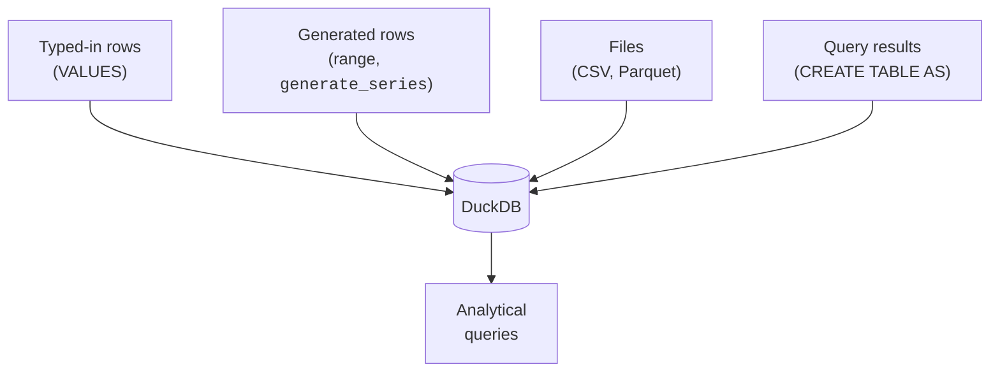
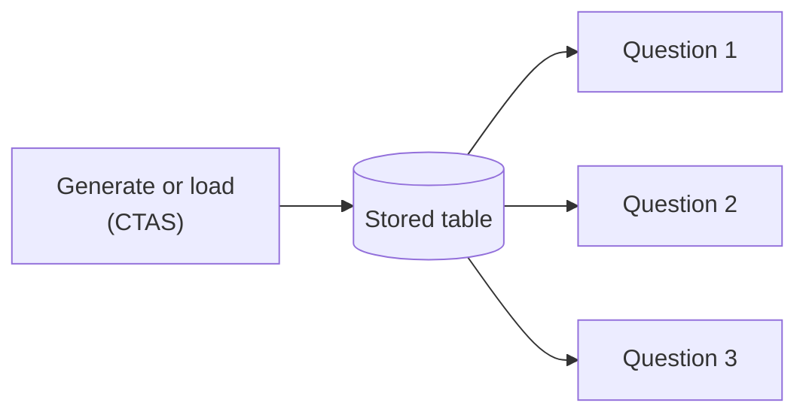

Before you can analyze data, it has to exist somewhere DuckDB can read it.
This page surveys the handful of ways analysts get data *in*, and
introduces two DuckDB conveniences you will use constantly: the `range()`
generator and `CREATE TABLE AS`. These let you build realistic practice
datasets in seconds, no files required.

<Figure
  slug="duck-loading-data-cutout"
  alt="Four chutes feeding one grid platform, one carrying loose literal blocks and one spooling out a generated ribbon of rows"
/>

## Four ways data arrives



For real work, **files** dominate, analysts point DuckDB at a CSV or
Parquet export and query it directly. In this browser course we lean on
**generated** rows, because they let every example be self-contained and
reproducible. Both teach the same SQL.

## Literal rows with `VALUES`

The simplest source is data you type yourself. You have seen this in
`INSERT`, but `VALUES` can also stand alone as a tiny table, handy for
quick experiments.

<SqlCodeBlock
  dialect="duckdb"
  title="A throwaway table from literal VALUES"
  starterCode={`SELECT
  *
FROM
  (
    VALUES
      ('Mon', 120),
      ('Tue', 150),
      ('Wed', 90),
      ('Thu', 200),
      ('Fri', 175)
  ) AS t (day, visitors)
ORDER BY
  visitors DESC;`}
/>

No `CREATE TABLE` needed, `VALUES` becomes a table inline. Analysts use
this to sketch a quick example or test an idea.

## Generating rows with `range()`

DuckDB's `range(start, stop)` produces the integers from `start` up to
**but not including** `stop`. Combined with arithmetic, it can fabricate
realistic-looking datasets of any size, perfect for practice and for
testing a query's behavior at scale.

<SqlCodeBlock
  dialect="duckdb"
  title="Fabricate 12 months of fake revenue"
  starterCode={`SELECT
  i AS month,
  (i * 7) % 50 + 100 AS revenue
FROM
  range(1, 13) AS t (i)
ORDER BY
  month;`}
/>

<Callout type="info" title="range() is exclusive of the end">
`range(1, 13)` yields `1, 2, ..., 12`, twelve values, not thirteen. If
you want 1 through 100, write `range(1, 101)`. This off-by-one is the most
common `range()` mistake.
</Callout>

You can turn the integer into dates, categories, and amounts using
arithmetic and DuckDB's list-indexing trick `['a','b','c'][n]`:

<SqlCodeBlock
  dialect="duckdb"
  title="A richer generated dataset"
  starterCode={`SELECT
  i AS id,
  DATE '2024-01-01' + (i % 365)::INTEGER AS day,
  ['Books', 'Electronics', 'Home'] [(i % 3) + 1] AS category,
  (i * 13) % 300 + 20 AS amount
FROM
  range(1, 11) AS t (i)
ORDER BY
  id;`}
/>

That same pattern, with `range(1, 1000001)`, would give you a million
rows for a stress test, generated instantly, no file in sight.

## Capturing a result with `CREATE TABLE AS`

The most important habit in this lesson: **`CREATE TABLE AS SELECT`**
(often shortened to *CTAS*). It runs a query and stores its result as a
new table. Analysts use it to "freeze" a cleaned-up or generated dataset
so later queries can build on it.

<SqlCodeBlock
  dialect="duckdb"
  title="Generate once, then query the saved table"
  initSql={`CREATE TABLE daily_sales AS
SELECT
  DATE '2024-01-01' + (i % 90)::INTEGER AS day,
  ['West', 'East', 'North', 'South'] [(i % 4) + 1] AS region,
  (i * 17) % 400 + 10 AS amount
FROM
  range(1, 901) t (i);`}
  starterCode={`-- daily_sales was built by the init step above.
SELECT
  region,
  COUNT(*) AS rows,
  SUM(amount) AS revenue
FROM
  daily_sales
GROUP BY
  region
ORDER BY
  revenue DESC;`}
/>

Here the `initSql` step used CTAS to build `daily_sales` once; the main
query just reads it. This separation, **build the dataset, then ask
questions of it**, mirrors how real analysis is organized.



## A note on files (for real-world work)

Outside this browser sandbox, the line you would reach for most is reading
a file directly. DuckDB lets you treat a CSV or Parquet file as a table:

```sql
-- Real-world DuckDB (needs file access, shown for reference):
SELECT region, SUM(amount) AS revenue
FROM 'sales_2024.parquet'
GROUP BY region;
```

No import step, no schema declaration, DuckDB infers the columns and
scans the file. This "query the file in place" ability is a big reason
analysts love it. The browser sandbox here has no file system, so we
generate data instead, but the **SQL you practice is identical**.

## Check your understanding

<MultipleChoice
  markdown={`How many rows does \`range(1, 13)\` produce, and what are they?

- [o] 12 rows: 1 through 12, because \`range\` excludes the end value.
  > \`range(start, stop)\` yields \`start\` up to but not including \`stop\`, so \`range(1, 13)\` gives 1..12.
- 0 rows, because the arguments are invalid.
  > The arguments are valid; \`range(1, 13)\` is a normal call producing 12 rows.
- 11 rows: 2 through 12.
  > It starts *at* 1 (inclusive), so 1 is included; only the end is excluded.
- 13 rows: 1 through 13.
  > \`range\` excludes its end value, so 13 is not included.

\`range\` is inclusive of the start and exclusive of the end: \`range(1, N+1)\`
gives 1 through N.`}
/>

<MultipleChoice
  markdown={`What does \`CREATE TABLE daily_sales AS SELECT ...\` do?

- It exports the result to a CSV file.
  > CTAS stores the result as a database table, not a file.
- It deletes \`daily_sales\` if it already exists.
  > CTAS creates and populates a table; it is not a delete operation.
- It defines an empty table with columns but no rows.
  > CTAS both defines the table *and* fills it with the query's result rows.
- [o] It runs the \`SELECT\` and stores its entire result as a new table named \`daily_sales\`.
  > CREATE TABLE AS SELECT (CTAS) captures a query result as a reusable table, an analyst staple.

CTAS is "run this query and freeze its result as a table", ideal for
capturing a cleaned or generated dataset.`}
/>

<MultipleChoice
  markdown={`Why does this course **generate** data with \`range()\` instead of loading files?

- Because \`range()\` is the only data source DuckDB supports.
  > DuckDB supports many sources (VALUES, files, other tables); \`range()\` is just convenient here.
- Because DuckDB cannot read files.
  > DuckDB reads CSV and Parquet directly; the sandbox simply has no file system, so we generate instead.
- Because generated data is more accurate than real data.
  > Generated data is for practice; it is not inherently more accurate, and that is not the reason.
- [o] So every example is self-contained and reproducible in the browser, while the SQL practiced stays identical to file-based work.
  > Generated data needs no external files, runs anywhere, and the queries you learn transfer directly to real datasets.

Generation keeps lessons reproducible in the browser; the SQL you learn
applies unchanged to files and warehouse tables.`}
/>

You can now bring data into DuckDB and conjure practice datasets at will.
With data in hand, the real fun begins, let us learn how an analyst
*profiles* an unfamiliar dataset.

<Figure
  slug="duck-loading-and-generating-data-inline-cutout"
  alt="Three differently shaped cartons feeding one hopper and arriving inside as identical rows"
/>
