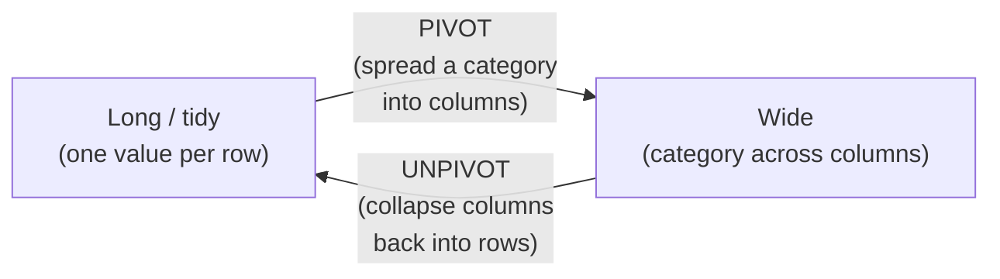

The same data can wear two shapes. **Long** (or "tidy") data has one
measurement per row; **wide** data spreads a category across columns.
Analysts constantly reshape between them, long is great for computing,
wide is great for reading. This page explains the two shapes, why they
matter, and how to pivot in DuckDB both by hand and with the dedicated
`PIVOT` syntax.

<svg
  viewBox="0 0 640 220"
  role="img"
  aria-label="A tall one-value-per-row strip beside the same data landed as a short wide grid, every colored cell finding its own column, the same data turned ninety degrees from long to wide"
  style={{ display: "block", width: "100%", maxWidth: "640px", height: "auto", margin: "2.5rem auto" }}
>
  <g style={{ color: "var(--ds-blue-500)" }} fill="currentColor">
    <rect x="100" y="28" width="44" height="26" rx="6" fillOpacity="0.85" />
    <rect x="100" y="118" width="44" height="26" rx="6" fillOpacity="0.4" />
  </g>
  <g style={{ color: "var(--ds-green-500)" }} fill="currentColor">
    <rect x="100" y="58" width="44" height="26" rx="6" fillOpacity="0.85" />
    <rect x="100" y="148" width="44" height="26" rx="6" fillOpacity="0.4" />
  </g>
  <g style={{ color: "var(--ds-yellow-500)" }} fill="currentColor">
    <rect x="100" y="88" width="44" height="26" rx="6" fillOpacity="0.85" />
    <rect x="100" y="178" width="44" height="26" rx="6" fillOpacity="0.4" />
  </g>
  <g fill="currentColor" opacity="0.12">
    <rect x="368" y="88" width="32" height="26" rx="6" />
    <rect x="368" y="118" width="32" height="26" rx="6" />
  </g>
  <g style={{ color: "var(--ds-blue-500)" }} fill="currentColor">
    <rect x="404" y="88" width="56" height="26" rx="6" fillOpacity="0.85" />
    <rect x="404" y="118" width="56" height="26" rx="6" fillOpacity="0.4" />
  </g>
  <g style={{ color: "var(--ds-green-500)" }} fill="currentColor">
    <rect x="464" y="88" width="56" height="26" rx="6" fillOpacity="0.85" />
    <rect x="464" y="118" width="56" height="26" rx="6" fillOpacity="0.4" />
  </g>
  <g style={{ color: "var(--ds-yellow-500)" }} fill="currentColor">
    <rect x="524" y="88" width="56" height="26" rx="6" fillOpacity="0.85" />
    <rect x="524" y="118" width="56" height="26" rx="6" fillOpacity="0.4" />
  </g>
</svg>

## Long vs. wide: the same data, two layouts

Imagine quarterly sales per region. In **long** form, each region-quarter
is its own row:

| region | quarter | sales |
| --- | --- | --- |
| West | Q1 | 100 |
| West | Q2 | 140 |
| East | Q1 | 200 |
| East | Q2 | 90 |

In **wide** form, the quarters become columns, a little report:

| region | Q1 | Q2 |
| --- | --- | --- |
| West | 100 | 140 |
| East | 200 | 90 |

Neither is "correct", they serve different goals:

- **Long** is ideal for *computation*: it groups, aggregates, and feeds
  charts cleanly, and adding a new category needs no schema change.
- **Wide** is ideal for *human reading*: a cross-tab where you scan across
  a row to compare quarters.

The analyst's job is knowing which shape a task wants and reshaping to it.

## Pivoting by hand with conditional aggregation

You already have the tool to pivot from the conditional-logic page:
`SUM(...) FILTER (WHERE ...)` (or `SUM(CASE ...)`). Each target column is
one filtered aggregate. This "manual pivot" works in any SQL database and
makes the mechanics visible.

<SqlCodeBlock
  dialect="duckdb"
  title="Manual pivot: quarters into columns"
  initSql={`CREATE TABLE sales (region TEXT, quarter TEXT, amount INTEGER);

INSERT INTO
  sales
VALUES
  ('West', 'Q1', 100),
  ('West', 'Q2', 140),
  ('West', 'Q1', 20),
  ('East', 'Q1', 200),
  ('East', 'Q2', 90),
  ('North', 'Q2', 75);`}
  starterCode={`SELECT
  region,
  SUM(amount) FILTER(
    WHERE
      quarter = 'Q1'
  ) AS q1,
  SUM(amount) FILTER(
    WHERE
      quarter = 'Q2'
  ) AS q2
FROM
  sales
GROUP BY
  region
ORDER BY
  region;`}
/>

One row per region, one column per quarter, a wide cross-tab built from
long data. The shape is exactly the side-by-side metrics pattern, now seen
as *pivoting*.

## DuckDB's `PIVOT` statement

Writing a `FILTER` per column is tedious when there are many categories.
DuckDB's `PIVOT` does it declaratively, you name the column to spread and
the aggregate, and DuckDB discovers the distinct values for you.

<SqlCodeBlock
  dialect="duckdb"
  title="The same pivot with PIVOT syntax"
  initSql={`CREATE TABLE sales (region TEXT, quarter TEXT, amount INTEGER);

INSERT INTO
  sales
VALUES
  ('West', 'Q1', 100),
  ('West', 'Q2', 140),
  ('West', 'Q1', 20),
  ('East', 'Q1', 200),
  ('East', 'Q2', 90),
  ('North', 'Q2', 75);`}
  starterCode={`PIVOT sales ON quarter -- values of this column become columns
USING SUM(amount) -- aggregate that fills each cell
GROUP BY
  region -- one row per region
ORDER BY
  region;`}
/>

`ON quarter` spreads each distinct quarter into its own column; `USING
SUM(amount)` fills the cells; `GROUP BY region` sets the rows. The result
matches the manual pivot, with far less typing and no need to know the
quarters in advance.

## Going the other way: `UNPIVOT`

Sometimes data arrives wide, a spreadsheet with a column per month, but
you need it long to compute on it. `UNPIVOT` collapses those columns back
into rows.

<SqlCodeBlock
  dialect="duckdb"
  title="UNPIVOT: month columns back into rows"
  initSql={`CREATE TABLE wide_sales (
  region TEXT,
  jan INTEGER,
  feb INTEGER,
  mar INTEGER
);

INSERT INTO
  wide_sales
VALUES
  ('West', 100, 140, 90),
  ('East', 200, 60, 120);`}
  starterCode={`UNPIVOT wide_sales ON jan,
feb,
mar -- these columns become rows
INTO NAME month -- new column holding 'jan'/'feb'/'mar'
VALUE sales -- new column holding the number
ORDER BY
  region,
  month;`}
/>

Now each region-month is a row again, ready to `GROUP BY`, aggregate, or
chart. Reshaping wide-to-long is often the *first* step when you import a
spreadsheet someone built for reading rather than computing.

## When to use which shape

- Receiving a human-built spreadsheet (wide)? **`UNPIVOT` to long** first,
  then compute.
- Computing aggregates, trends, or feeding a chart? **Stay long.**
- Producing a final cross-tab report for people to read? **`PIVOT` to
  wide** at the end.

A good rule: **compute in long, present in wide.**

<svg
  viewBox="0 0 640 165"
  role="img"
  aria-label="A green compute card where a tall long-format strip condenses into one green value, then a solid gray arrow into a yellow present card where a wide row of cells sits above an open eye, compute in long form, present in wide form"
  style={{ display: "block", width: "100%", maxWidth: "560px", height: "auto", margin: "2.5rem auto" }}
>
  <g style={{ color: "var(--ds-green-500)" }} fill="currentColor">
    <rect x="60" y="24" width="220" height="120" rx="12" fillOpacity="0.12" />
  </g>
  <g style={{ color: "var(--ds-blue-500)" }} fill="currentColor">
    <rect x="96" y="40" width="40" height="22" rx="6" />
    <rect x="96" y="68" width="40" height="22" rx="6" />
    <rect x="96" y="96" width="40" height="22" rx="6" />
  </g>
  <line x1="140" y1="79" x2="168" y2="79" stroke="var(--ds-gray-300)" strokeWidth="2" />
  <g style={{ color: "var(--ds-green-500)" }} fill="currentColor">
    <rect x="170" y="68" width="70" height="22" rx="8" />
  </g>
  <g fill="var(--ds-gray-400)">
    <rect x="294" y="82.5" width="28" height="3" rx="1.5" />
    <polygon points="320,78.5 331,84 320,89.5" />
  </g>
  <g style={{ color: "var(--ds-yellow-500)" }} fill="currentColor">
    <rect x="352" y="24" width="228" height="120" rx="12" fillOpacity="0.18" />
    <rect x="372" y="48" width="46" height="24" rx="6" />
    <rect x="424" y="48" width="46" height="24" rx="6" />
    <rect x="476" y="48" width="46" height="24" rx="6" />
  </g>
  <path d="M 420 108 Q 466 82 512 108 Q 466 134 420 108 Z" fill="none" stroke="var(--ds-gray-400)" strokeWidth="2.5" />
  <g style={{ color: "var(--ds-blue-500)" }} fill="currentColor">
    <circle cx="466" cy="108" r="8" />
  </g>
</svg>

## Check your understanding

<MultipleChoice
  markdown={`What distinguishes **wide** data from **long** data?

- Wide data has more rows; long data has more columns.
  > It is the opposite emphasis: wide spreads categories across *columns*; long stacks them as *rows*.
- [o] In wide data a category is spread across columns (e.g. one column per quarter); in long data each category value is its own row.
  > Wide is a cross-tab for reading; long has one measurement per row, ideal for computation.
- Long data cannot be aggregated.
  > Long data is in fact the easiest shape to aggregate; that is a main reason analysts compute in long form.
- They store fundamentally different information.
  > They are two layouts of the *same* information, interchangeable via PIVOT/UNPIVOT.

Wide spreads a category into columns; long keeps one value per row, same
data, different layout.`}
/>

<MultipleChoice
  markdown={`What does \`SUM(amount) FILTER (WHERE quarter = 'Q1') AS q1\` accomplish in a manual pivot?

- It deletes rows that are not in Q1.
  > It filters only the aggregate's input; no rows are deleted from the table.
- [o] It creates a \`q1\` column holding the summed amount for just the Q1 rows of each group.
  > Each filtered aggregate becomes one pivoted column, totaling only the matching category.
- It sorts the result by quarter.
  > It produces a column value, not an ordering.
- It converts the table to long form.
  > It moves a category *into a column*, which is pivoting toward wide form, not long.

A filtered aggregate per category is the manual way to pivot long data
into wide columns.`}
/>

<MultipleChoice
  markdown={`You receive a spreadsheet with one column per month and need to compute a monthly trend. What is the natural first step?

- \`PIVOT\` it into even more columns.
  > It is already wide; pivoting further does not help you compute a trend.
- [o] \`UNPIVOT\` the month columns into rows, producing long data you can group and aggregate.
  > Collapsing the month columns to rows yields tidy long data, the ideal shape for trend computation.
- Delete all but one month column.
  > Discarding data destroys the trend you are trying to compute.
- Nothing, wide data is already ideal for computing trends.
  > Wide data is good for reading, but computing trends is far easier in long form.

"Compute in long, present in wide": unpivot the wide spreadsheet first.`}
/>

You can now reshape data into whatever form a task needs. The next section
zooms out to *structure*: how to compose large analytical queries from
small, readable pieces.
