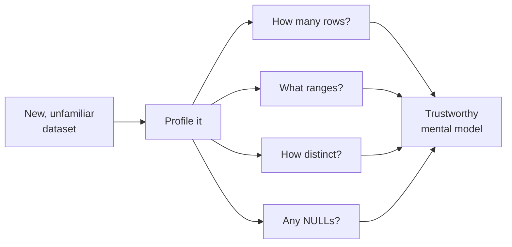
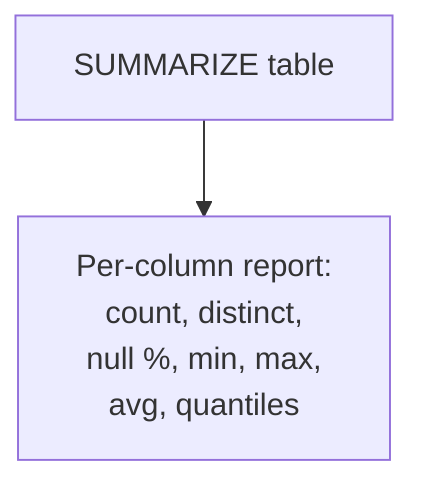

When an analyst opens an unfamiliar dataset, they do not start with the
interesting business question. They start by **profiling** it: a few quick
queries that reveal the data's size, range, distinctness, and gaps.
Skipping this step is how analysts get fooled, by duplicates, missing
values, or a date column that secretly stops in March. This page is the
profiling checklist, expressed in SQL.

<Figure
  slug="duck-profiling-cutout"
  alt="A magnifying lens over a grid platform beside a small checklist plinth with five ticked marks"
/>

## Why profile first

The reason a summary is never enough on its own. These four columns agree on
mean, variance and correlation to two decimal places:

<Chart slug="anscombes-quartet" />

A dataset can lie to you in quiet ways:

- It is **smaller or larger** than you assumed.
- A column has **far fewer distinct values** than expected (or far more).
- Some values are **missing** (`NULL`), silently dropping rows from
  averages.
- The **range** is wrong, dates that stop early, amounts that go
  negative.

<Figure
  slug="duck-profiling-a-dataset-profile-first-inline-cutout"
  alt="A crate with a gauge clipped to each of its sides before its lid is opened"
  caption="Measure the dataset before you query it, not after the answer looks odd."
/>

Profiling surfaces these before they corrupt a conclusion. Think of it as
checking the ingredients before you cook.

## Size and range

The first two questions are always *how many rows* and *what does the key
column span*. `COUNT(*)`, `MIN()`, and `MAX()` answer both at once.

<SqlCodeBlock
  dialect="duckdb"
  title="Size and span in one query"
  initSql={`CREATE TABLE signups AS
SELECT
  i AS id,
  DATE '2024-01-01' + (i % 200)::INTEGER AS signup_date,
  (i * 11) % 5 AS plan_id
FROM
  range(1, 1201) t (i);`}
  starterCode={`SELECT
  COUNT(*) AS rows,
  MIN(signup_date) AS earliest,
  MAX(signup_date) AS latest
FROM
  signups;`}
/>

In seconds you learn the table's size and the window of time it covers,
without scrolling a single row.

## Distinctness: `COUNT(DISTINCT ...)`

How many *different* values does a column hold? This reveals whether a
column is a category (a few values), an identifier (all unique), or
something in between. The gap between `COUNT(*)` and `COUNT(DISTINCT id)`
also reveals **duplicates**.

<SqlCodeBlock
  dialect="duckdb"
  title="Distinct counts expose categories and duplicates"
  initSql={`CREATE TABLE signups AS
SELECT
  i AS id,
  DATE '2024-01-01' + (i % 200)::INTEGER AS signup_date,
  (i * 11) % 5 AS plan_id
FROM
  range(1, 1201) t (i);`}
  starterCode={`SELECT
  COUNT(*) AS rows,
  COUNT(DISTINCT id) AS distinct_ids,
  COUNT(DISTINCT plan_id) AS distinct_plans,
  COUNT(DISTINCT signup_date) AS distinct_days
FROM
  signups;`}
/>

If `distinct_ids` were less than `rows`, you would have duplicate ids, a
red flag worth investigating before trusting any per-id summary.

## Missing values: counting `NULL`s

`COUNT(column)` ignores `NULL`s, while `COUNT(*)` counts every row. The
difference is exactly the number of missing values, a one-line null
check.

<SqlCodeBlock
  dialect="duckdb"
  title="Find the missing emails"
  initSql={`CREATE TABLE users (id INTEGER, email TEXT, country TEXT);

INSERT INTO
  users
VALUES
  (1, 'a@x.com', 'US'),
  (2, NULL, 'US'),
  (3, 'c@x.com', NULL),
  (4, NULL, 'CA'),
  (5, 'e@x.com', 'US'),
  (6, 'f@x.com', NULL);`}
  starterCode={`SELECT
  COUNT(*) AS rows,
  COUNT(email) AS has_email,
  COUNT(*) - COUNT(email) AS missing_email,
  COUNT(*) - COUNT(country) AS missing_country
FROM
  users;`}
/>

Knowing *how many* values are missing tells you whether a column is
trustworthy or needs cleaning before analysis.

## The shortcut: `SUMMARIZE()`

DuckDB bundles the whole profiling checklist into one keyword:
**`SUMMARIZE()`**. Prefix any table or query with it and DuckDB returns, per
column, the count, number of distinct values, null percentage, min, max,
average, and approximate quantiles. Point it at a real 53,940-row file you
have never seen, straight from the web, and read off the whole shape in
one shot:

<SqlCodeBlock
  dialect="duckdb"
  title="Profile every column of a remote file with SUMMARIZE"
  starterCode={`SUMMARIZE
SELECT
  *
FROM
  read_parquet(
    'https://cdn.jsdelivr.net/gh/dataslope/datasets@f7f08485960fe4a774359a43d1eb50a84514daf2/diamonds.parquet'
  );`}
/>

One line of intent, a complete profile of ten columns. Scan the `min` and
`max` of `price` and `carat`, the distinct counts of `cut` / `color` /
`clarity`, and the null percentages, in seconds you know more about this
file than scrolling it for an hour would tell you. `SUMMARIZE()` is the
first thing many DuckDB analysts type when they meet a new dataset.

<Figure
  slug="duck-profiling-a-dataset-shortcut-summarize-inline-cutout"
  alt="One lever that prints a full row of readings for every column of a cabinet at once"
  caption="`SUMMARIZE()` runs the whole profiling checklist over every column in one statement."
/>

## The profiling checklist

Before analyzing any new dataset, answer:

1. **How many rows?** (`COUNT(*)`)
2. **What range does the key/date span?** (`MIN()`, `MAX()`)
3. **How distinct is each important column?** (`COUNT(DISTINCT ...)`)
4. **Are there duplicates?** (`COUNT(*)` vs `COUNT(DISTINCT id)`)
5. **What is missing?** (`COUNT(*) - COUNT(column)`)

Or just run `SUMMARIZE()` and read the lot at a glance.

<Figure
  slug="duck-profiling-a-dataset-inline-cutout"
  alt="A board of columns with a small gauge clipped to the head of each, every gauge reading a different property of its column"
  caption="Types, ranges, distinct counts and nulls: one reading per column."
/>

## Check your understanding

<MultipleChoice
  markdown={`A table has \`COUNT(*) = 1000\` but \`COUNT(DISTINCT id) = 980\`. What does this most likely indicate?

- The \`id\` column has 20 NULL values.
  > \`COUNT(DISTINCT id)\` already ignores NULLs; the gap here points to repeated id *values*, i.e. duplicates.
- The table is sorted incorrectly.
  > Sort order has no effect on these counts; the gap is about duplicate values.
- [o] There are duplicate \`id\` values, 1000 rows but only 980 unique ids.
  > When distinct ids are fewer than total rows, some ids repeat, which usually signals duplicate rows worth investigating.
- The query is invalid.
  > Both counts are valid; their difference is meaningful information.

Total rows exceeding distinct ids is the classic signature of duplicates.`}
/>

<MultipleChoice
  markdown={`How do you count the **missing** values in a column \`email\`?

- \`COUNT(email)\` gives the number of missing values directly.
  > \`COUNT(email)\` counts the *present* (non-NULL) values, not the missing ones.
- It is impossible to count NULLs in SQL.
  > NULLs are easy to count via the \`COUNT(*) - COUNT(col)\` difference (or other null checks).
- \`SUM(email)\`, which adds up the NULLs.
  > You cannot \`SUM()\` a text column, and NULLs are not summed; this does not count missing values.
- [o] \`COUNT(*) - COUNT(email)\`, because \`COUNT(*)\` counts all rows and \`COUNT(email)\` skips NULLs.
  > The difference between total rows and non-NULL emails is exactly the count of missing emails.

\`COUNT(*)\` counts every row; \`COUNT(col)\` counts non-NULLs; their
difference is the number of missing values.`}
/>

<MultipleChoice
  markdown={`What does DuckDB's \`SUMMARIZE()\` keyword do?

- It deletes summary rows from a table.
  > \`SUMMARIZE()\` produces a report; it changes nothing in the table.
- It is an alias for \`GROUP BY\`.
  > \`SUMMARIZE()\` describes columns; \`GROUP BY\` groups rows for aggregation. They are unrelated.
- It permanently sorts the table by every column.
  > It neither sorts nor modifies the table; it only reports statistics.
- [o] It returns a per-column profile, count, distinct values, null percentage, min, max, average, and quantiles, for a table or query.
  > \`SUMMARIZE()\` runs the whole profiling checklist at once, which is why analysts reach for it first on new data.

\`SUMMARIZE()\` is a one-keyword profile of every column in a dataset.`}
/>

With a trustworthy mental model in hand, you can start carving the data
into the slices you care about, which is exactly the next page.
