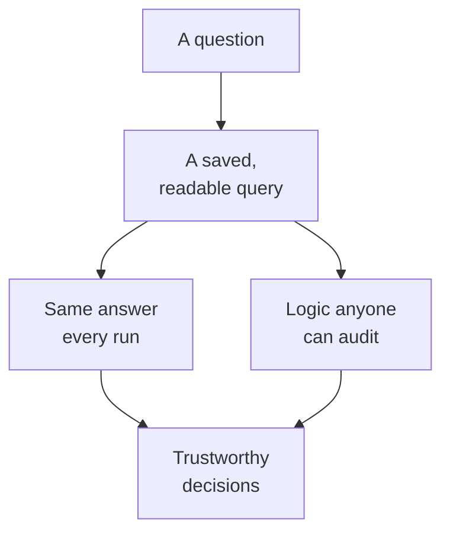
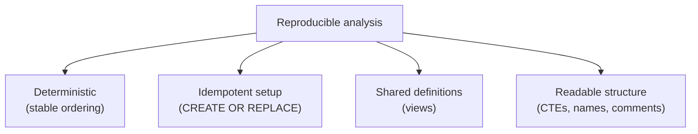

A number that cannot be reproduced cannot be trusted. If you run the same
analysis tomorrow, or a colleague runs it on their machine, it should
produce the same result, and you should be able to explain exactly how it
was computed. This page is about **reproducibility**: the habits that turn
a one-off query into analysis others can rely on.

<Callout type="info" title="An optional deep dive">
This is one of the course's *Interesting discussions*. The techniques here,
stable ordering, idempotent setup, views, are about turning correct
queries into *trustworthy, repeatable* work. Nothing in the core path
depends on it, so read it whenever the topic matters to you.
</Callout>

<Figure
  slug="duck-reproducible-cutout"
  alt="One query block on a platform stamping three identical result sheets, a stable sort pin holding their order"
/>

## Why reproducibility is non-negotiable

Analysis drives decisions, and decisions get questioned. "Where did this
\$2M figure come from?" is a question you must be able to answer months
later. Reproducible work means:

- The same inputs always give the same outputs.
- Anyone can re-run the analysis and get your number.
- The logic is **readable**, so the *why* is recoverable, not just the
  *what*.

SQL is unusually good at this: a query is simultaneously the computation
*and* its own documentation. The trick is writing it so that property
actually holds.

## Determinism: make ordering and ties stable

The quietest reproducibility bug is **non-deterministic ordering**. If two
rows tie on the sort key, SQL may return them in either order, so a
"top 10" can change between runs even on identical data. Always add a
**tiebreaker** to make the order total and stable.

<Figure
  slug="duck-reproducible-analytical-workflows-reproducibility-non-negotiable-inline-cutout"
  alt="One sealed strip of steps run on two benches, both ending with identical blocks"
  caption="The same query on the same data has to give the same rows, in the same order."
/>

<SqlCodeBlock
  dialect="duckdb"
  title="A stable top-N with a tiebreaker"
  initSql={`CREATE TABLE products (id INTEGER, name TEXT, sales INTEGER);

INSERT INTO
  products
VALUES
  (1, 'A', 100),
  (2, 'B', 100),
  (3, 'C', 100),
  (4, 'D', 90),
  (5, 'E', 80);`}
  starterCode={`SELECT
  id,
  name,
  sales
FROM
  products
ORDER BY
  sales DESC,
  id ASC -- id breaks ties → reproducible order
LIMIT
  3;`}
/>

Without `, id ASC`, the three products tied at 100 could appear in any
order, and `LIMIT 3` might return a *different* set each run. The
tiebreaker makes "top 3" a single, defensible answer.

## Idempotent setup: safe to re-run

Reproducible analyses often (re)build their inputs. Setup steps should be
**idempotent**, running them twice does no harm. DuckDB's `CREATE OR
REPLACE` and `CREATE ... IF NOT EXISTS` make scripts safe to re-run
without "already exists" errors.

<SqlCodeBlock
  dialect="duckdb"
  title="CREATE OR REPLACE makes rebuilds safe"
  starterCode={`-- Run this block twice, it never errors, and the result is identical.
CREATE OR REPLACE TABLE clean_orders AS
SELECT
  *
FROM
  (
    VALUES
      (1, 'paid', 120),
      (2, 'refunded', 45),
      (3, 'paid', 200)
  ) AS t (id, status, amount);

SELECT
  status,
  SUM(amount) AS total
FROM
  clean_orders
GROUP BY
  status
ORDER BY
  status;`}
/>

Because the table is *replaced*, re-running the analysis from scratch
always yields the same `clean_orders`, no leftover state, no surprises.

## Views: name a query so it stays consistent

A **view** is a saved query that behaves like a table. Define a metric
once as a view, and everyone who reads from it gets the *same definition*,
no copy-pasted SQL drifting out of sync. Views are how teams keep a
metric's meaning consistent.

<SqlCodeBlock
  dialect="duckdb"
  title="A view encodes one canonical definition"
  initSql={`CREATE TABLE orders (
  id INTEGER,
  region TEXT,
  status TEXT,
  amount DECIMAL(8, 2)
);

INSERT INTO
  orders
VALUES
  (1, 'West', 'paid', 120),
  (2, 'West', 'refunded', 45),
  (3, 'East', 'paid', 200),
  (4, 'East', 'paid', 50),
  (5, 'North', 'paid', 60),
  (6, 'West', 'paid', 95);`}
  starterCode={`CREATE OR REPLACE VIEW paid_revenue_by_region AS
SELECT
  region,
  SUM(amount) AS revenue
FROM
  orders
WHERE
  status = 'paid'
GROUP BY
  region;

-- Everyone queries the view, so everyone uses the same definition.
SELECT
  *
FROM
  paid_revenue_by_region
ORDER BY
  revenue DESC;`}
/>

The definition of "paid revenue by region" now lives in *one* place. If
the business redefines it, you change the view once and every downstream
query follows.

## Structure for readability and auditability

Reproducibility is as much about *humans* re-running the logic as machines.
The composition habits from earlier pay off here:

- **Build with CTEs.** A named pipeline documents each step, so a reviewer
  can audit the logic stage by stage.
- **Comment the intent, not the syntax.** Say *why* a filter exists, not
  what `WHERE` does.
- **Name things honestly.** `paying_users`, not `cnt2`. The query should
  read like a description of the analysis.

Put together, these habits mean your analysis is not a lucky result you
got once, it is a repeatable, explainable process.

## Check your understanding

<MultipleChoice
  markdown={`Why add a tiebreaker like \`ORDER BY sales DESC, id ASC\` to a top-N query?

- [o] Without it, rows tied on \`sales\` can appear in any order, so the top-N (and thus the result) may change between runs.
  > A tiebreaker gives a total, stable ordering, making the result reproducible even when the main sort key ties.
- It removes duplicate rows.
  > A tiebreaker orders rows; it does not deduplicate them.
- It makes the query run faster.
  > The benefit is determinism, not speed.
- It converts \`sales\` to a percentage.
  > Ordering has nothing to do with computing percentages.

A tiebreaker makes ordering total and stable, so the same top-N comes back
every run.`}
/>

<MultipleChoice
  markdown={`What does it mean for a setup step to be **idempotent**, and how does \`CREATE OR REPLACE TABLE\` help?

- It means the table can never be changed again.
  > Idempotency is about repeatable setup, not immutability.
- It means the step runs only once and then locks the table.
  > Idempotent means *safe to run repeatedly*, not run-once; the table is not locked.
- It deletes the database after running.
  > It does no such thing; it simply makes re-creation safe.
- [o] Running it multiple times has the same effect as running it once; \`CREATE OR REPLACE\` rebuilds the table cleanly without "already exists" errors.
  > Idempotent setup can be re-run safely, which \`CREATE OR REPLACE\` enables by replacing rather than failing.

Idempotent setup is safe to re-run, and \`CREATE OR REPLACE\` provides that
for tables.`}
/>

<MultipleChoice
  markdown={`How does defining a metric as a **view** support reproducibility across a team?

- It caches the result so it never recomputes.
  > A standard view recomputes on query; its value is shared definition, not caching.
- It hides the SQL from analysts.
  > A view's defining SQL is inspectable; it shares logic rather than hiding it.
- It makes the metric impossible to change.
  > A view can be updated; the point is a single source of truth, not immutability.
- [o] Everyone queries the same named definition, so the metric's logic lives in one place instead of being copy-pasted and drifting out of sync.
  > A view centralizes the definition; updating it updates every consumer consistently.

A view centralizes a metric's definition so everyone computes it the same
way.`}
/>

That completes the analytical toolkit, from mindset to metrics to
reproducible workflows. Let us wrap up and look at where to go next.

<Figure
  slug="duck-reproducible-analytical-workflows-inline-cutout"
  alt="A sealed strip of instructions run twice on two benches, both benches ending with identical results"
  caption="The same query, the same data, the same rows, on anyone's machine."
/>
