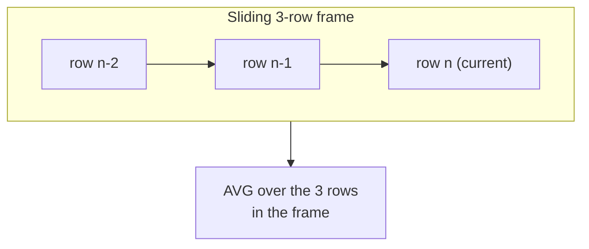

Time-series questions dominate business analytics: "cumulative revenue to
date", "7-day moving average", "growth versus last month." All of them use
**ordered windows**, windows where `ORDER BY` inside `OVER` makes the
calculation accumulate or slide as it moves through the rows. This page
covers running totals, moving averages, and the row-comparison functions
`LAG()`/`LEAD()`, and finally explains the **window frame**.

<Figure
  slug="duck-running-totals-cutout"
  alt="A rising cumulative staircase across a plane with a small sliding frame three cells wide travelling along it"
/>

## A running total

A running (cumulative) total adds each row's value to the sum of all rows
before it. The magic is just `SUM(...) OVER (ORDER BY ...)`: once the
window is *ordered*, the sum grows row by row instead of being one
constant total.

<Figure
  slug="duck-running-totals-and-moving-averages-running-total-inline-cutout"
  alt="A row of blocks with a growing stack beside it, each stack taller than the last by that block"
  caption="Each row's running total is the previous one plus this row's value."
/>

<SqlCodeBlock
  dialect="duckdb"
  title="Cumulative revenue by day"
  initSql={`CREATE TABLE daily (day DATE, revenue INTEGER);

INSERT INTO
  daily
VALUES
  (DATE '2024-01-01', 100),
  (DATE '2024-01-02', 140),
  (DATE '2024-01-03', 90),
  (DATE '2024-01-04', 200),
  (DATE '2024-01-05', 120);`}
  starterCode={`SELECT
  day,
  revenue,
  SUM(revenue) OVER (
    ORDER BY
      day
  ) AS running_total
FROM
  daily
ORDER BY
  day;`}
/>

Day 1 shows 100, day 2 shows 240, day 3 shows 330, ... each row carries
the total *so far*. Remove the `ORDER BY` and `SUM(revenue) OVER ()` would
instead put the grand total `650` on every row. **Ordering an aggregate
window turns it from a total into a running total**, that is the single
most important idea on this page.

| Day | Revenue | Running total |
| --- | --- | --- |
| 1 | 100 | 100 |
| 2 | 140 | 240 |
| 3 | 90 | 330 |
| 4 | 200 | 530 |
| 5 | 120 | 650 |

## Running totals per group

Combine `PARTITION BY` with the ordered window to get a running total that
**resets for each group**, cumulative revenue per region, say.

<Figure
  slug="duck-running-totals-and-moving-averages-inline-cutout"
  alt="A row of daily blocks with a growing stack behind them, and a smooth bar sliding along averaging the last three at a time"
  caption="A running total accumulates; a moving average slides over a fixed span."
/>

<SqlCodeBlock
  dialect="duckdb"
  title="Cumulative revenue within each region"
  initSql={`CREATE TABLE sales (region TEXT, day DATE, revenue INTEGER);

INSERT INTO
  sales
VALUES
  ('West', DATE '2024-01-01', 100),
  ('West', DATE '2024-01-02', 140),
  ('West', DATE '2024-01-03', 90),
  ('East', DATE '2024-01-01', 200),
  ('East', DATE '2024-01-02', 60),
  ('East', DATE '2024-01-03', 120);`}
  starterCode={`SELECT
  region,
  day,
  revenue,
  SUM(revenue) OVER (
    PARTITION BY
      region
    ORDER BY
      day
  ) AS running_total
FROM
  sales
ORDER BY
  region,
  day;`}
/>

The total climbs within West, then **restarts** for East. `PARTITION BY`
scopes the accumulation; `ORDER BY` drives it.

## Comparing to neighboring rows: `LAG()` and `LEAD()`

To compute change-over-time you need each row to *see* its neighbor.
`LAG(col)` returns the value from the **previous** row in the window;
`LEAD(col)` returns the **next** one. With them, "growth vs. yesterday" is
trivial.

<SqlCodeBlock
  dialect="duckdb"
  title="Day-over-day change with LAG"
  initSql={`CREATE TABLE daily (day DATE, revenue INTEGER);

INSERT INTO
  daily
VALUES
  (DATE '2024-01-01', 100),
  (DATE '2024-01-02', 140),
  (DATE '2024-01-03', 90),
  (DATE '2024-01-04', 200);`}
  starterCode={`SELECT
  day,
  revenue,
  LAG (revenue) OVER (
    ORDER BY
      day
  ) AS prev_day,
  revenue - LAG (revenue) OVER (
    ORDER BY
      day
  ) AS change
FROM
  daily
ORDER BY
  day;`}
/>

The first row's `prev_day` is `NULL`, there is no earlier row to look
back to. That is expected, and it is why the first `change` is also
`NULL`.

## The window frame, moving averages

What the frame width buys and what it costs. A wider window is smoother and
lags further behind a turn:

<Chart slug="rolling-window-lag" />

So far an ordered `SUM()` summed *everything up to the current row*. That
default is called the frame `RANGE BETWEEN UNBOUNDED PRECEDING AND CURRENT
ROW`. You can change the frame to a **sliding window**, say, the current
row plus the two before it, to compute a **moving average** that smooths
out noise.

<SqlCodeBlock
  dialect="duckdb"
  title="3-day moving average"
  initSql={`CREATE TABLE daily (day DATE, revenue INTEGER);

INSERT INTO
  daily
VALUES
  (DATE '2024-01-01', 100),
  (DATE '2024-01-02', 140),
  (DATE '2024-01-03', 90),
  (DATE '2024-01-04', 200),
  (DATE '2024-01-05', 120),
  (DATE '2024-01-06', 160);`}
  starterCode={`SELECT
  day,
  revenue,
  ROUND(
    AVG(revenue) OVER (
      ORDER BY
        day ROWS BETWEEN 2 PRECEDING
        AND CURRENT ROW
    ),
    1
  ) AS moving_avg_3d
FROM
  daily
ORDER BY
  day;`}
/>

The frame `ROWS BETWEEN 2 PRECEDING AND CURRENT ROW` means "average this
row and the two before it." As the window slides down the table, the
average follows, a classic noise-smoothing technique.

## Putting the frame together

The full mental model of an ordered window has three dials:

- **`PARTITION BY`**, which rows share a window (optional).
- **`ORDER BY`**, the order the window walks through.
- **Frame** (`ROWS BETWEEN ...`), *how much* of the ordered window each
  row sees: everything-so-far (running total) or a sliding band (moving
  average).

Master those three and every time-series window function is just a
combination of them.

## Check your understanding

<MultipleChoice
  markdown={`What turns \`SUM(revenue) OVER ()\` (a constant grand total on every row) into a **running total**?

- [o] Adding \`ORDER BY\` inside the \`OVER\` clause, so the sum accumulates row by row.
  > An ordered window sums from the start up to the current row by default, producing a cumulative total.
- Adding \`DISTINCT\`.
  > \`DISTINCT\` removes duplicates; it does not create accumulation.
- Adding \`GROUP BY\`.
  > \`GROUP BY\` collapses rows; the running total needs an ordered window that preserves rows.
- Adding \`PARTITION BY\`.
  > Partitioning scopes the window to groups, but a running total specifically needs the rows *ordered*.

Ordering an aggregate window makes it accumulate, that is a running
total.`}
/>

<MultipleChoice
  markdown={`What does \`LAG(revenue) OVER (ORDER BY day)\` return for the **first** row?

- [o] \`NULL\`, because there is no previous row to look back to.
  > The earliest row has no predecessor in the window, so \`LAG()\` yields NULL there.
- 0, as a default.
  > By default \`LAG()\` returns NULL (not 0) when there is no previous row.
- The same row's own revenue.
  > \`LAG()\` returns the *previous* row's value, not the current row's.
- The grand total of revenue.
  > \`LAG()\` looks at a single previous row, not a total.

\`LAG()\` returns NULL at the first row because there is nothing before it.`}
/>

<MultipleChoice
  markdown={`What does the frame \`ROWS BETWEEN 2 PRECEDING AND CURRENT ROW\` compute when paired with \`AVG()\`?

- [o] A moving average of the current row and the two rows immediately before it.
  > The frame defines a sliding 3-row window, so the average smooths over those rows as it moves.
- The single current row's value.
  > The frame spans three rows (2 preceding + current), not one.
- The average of the entire column, ignoring order.
  > That is an unframed/empty-window average; this frame restricts to a sliding band.
- The average of the two rows after the current one.
  > "PRECEDING" means before the current row, not after; "FOLLOWING" would look ahead.

This frame is the classic 3-row moving average: current row plus the two
before it.`}
/>

<MultipleChoice
  markdown={`Combining \`PARTITION BY region ORDER BY day\` on \`SUM(revenue)\` gives what?

- One running total across all regions combined.
  > \`PARTITION BY region\` keeps each region's running total separate, not combined.
- The grand total of revenue on every row.
  > An ordered window produces a running total, not a constant grand total.
- An error, because you cannot combine \`PARTITION BY\` and \`ORDER BY\`.
  > Combining them is standard and produces a per-group running total.
- [o] A running total that accumulates within each region and **restarts** when the region changes.
  > Partitioning scopes the accumulation per region; ordering drives it within each.

\`PARTITION BY\` resets the running total per group; \`ORDER BY\` accumulates
it within each.`}
/>

You now command the window-function toolkit, ranking, running totals,
moving averages, and row comparisons. Next we shift from *summarizing*
data to *transforming* it: conditional logic, dates, and reshaping.
