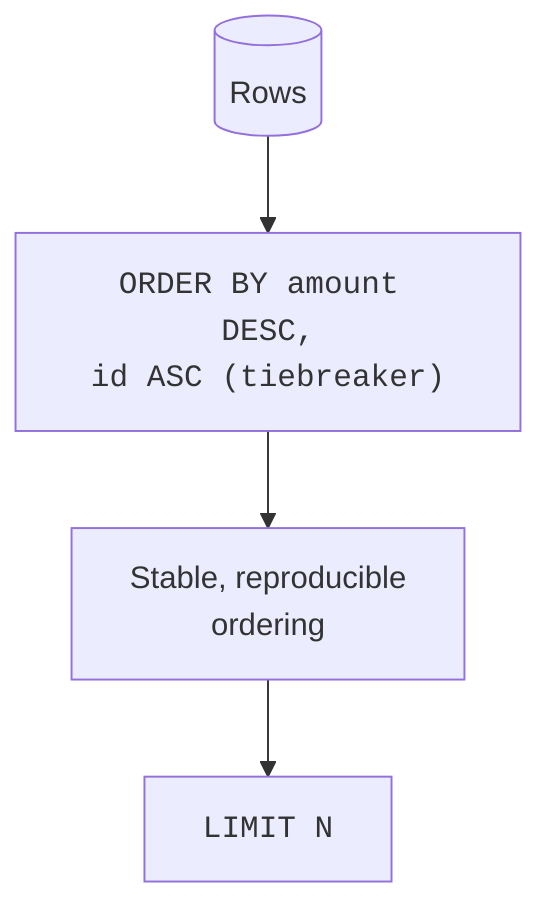

"Which are the biggest? The worst? The most recent?" An enormous share of
analytical questions are really **top-N** questions, and they all reduce
to *sort, then look at the head*. This page treats `ORDER BY` not as
presentation but as a way to **find the rows that matter**, and introduces
the per-group top-N pattern analysts use constantly.

<Figure
  slug="duck-sorting-top-n-cutout"
  alt="A descending staircase of blocks on a platform with only the top three steps lifted onto a small podium"
/>

## Sorting surfaces the extremes

The fastest way to learn something about a dataset is to look at its
biggest and smallest values. `ORDER BY ... DESC` brings the largest to the
top; `LIMIT` lets you read just those. Here it is over the real 53,940-row
diamonds file, the five most expensive stones, with no download step:

<SqlCodeBlock
  dialect="duckdb"
  title="The five most expensive diamonds"
  starterCode={`SELECT
  carat,
  cut,
  color,
  price
FROM
  read_parquet(
    'https://cdn.jsdelivr.net/gh/dataslope/datasets@f7f08485960fe4a774359a43d1eb50a84514daf2/diamonds.parquet'
  )
ORDER BY
  price DESC
LIMIT
  5;`}
/>

Flip `DESC` to `ASC` (or drop it, ascending is the default) to find the
*cheapest*. The "top 5 / bottom 5" glance is often the very first thing an
analyst does after slicing, and DuckDB scanned all 53,940 rows to find
them in the time it took to read this sentence.

## Sorting by more than one key

When the first sort key ties, a second key breaks the tie. Analysts use
this to organize a result meaningfully, e.g. newest-first within each
region.

<SqlCodeBlock
  dialect="duckdb"
  title="Within each region, biggest orders first"
  initSql={`CREATE TABLE orders AS
SELECT
  i AS id,
  ['West', 'East', 'North'] [(i % 3) + 1] AS region,
  (i * 37) % 500 + 10 AS amount
FROM
  range(1, 31) t (i);`}
  starterCode={`SELECT
  region,
  id,
  amount
FROM
  orders
ORDER BY
  region ASC,
  amount DESC;`}
/>

Read it as "group the eye by region, and within each, descend by amount."
The result reads like a small report.

## Sorting by a computed measure

You can sort by an expression that is not even in the table, a derived
measure. "Most efficient", "best value", "highest rate" are all
`ORDER BY <expression>`.

<SqlCodeBlock
  dialect="duckdb"
  title="Best value: lowest price per gram"
  initSql={`CREATE TABLE snacks (name TEXT, price DECIMAL(6, 2), grams INTEGER);

INSERT INTO
  snacks
VALUES
  ('Almonds', 6.00, 200),
  ('Chips', 3.50, 150),
  ('Trail Mix', 8.00, 400),
  ('Pretzels', 2.00, 100),
  ('Jerky', 9.00, 90);`}
  starterCode={`SELECT
  name,
  ROUND(price / grams, 4) AS price_per_gram
FROM
  snacks
ORDER BY
  price_per_gram ASC;

-- cheapest per gram first`}
/>

## Be careful: `NULL`s and ties

Two subtleties that quietly trip up analysts:

- **`NULL`s have to go somewhere.** In DuckDB, `NULL`s sort *last* by
  default in `ASC` and you can control this with `NULLS FIRST` / `NULLS
  LAST`. If your "smallest" query is returning blanks at the top, this is
  why.
- **Ties are arbitrary unless you break them.** If ten rows share the top
  `amount`, `LIMIT 5` returns *some* five of them, unpredictably. Add a
  tiebreaker column to `ORDER BY` to make results stable and reproducible,
  which matters for analysis you intend to repeat.

## Per-group top-N with `QUALIFY`

"Top 5 orders overall" is easy. "Top 2 orders *per region*" is the
question analysts actually ask, and a plain `LIMIT` cannot do it, because
`LIMIT` caps the whole result, not each group. The clean DuckDB answer
pairs a window function (which you will meet properly soon) with
**`QUALIFY`**, a filter on the window result.

<SqlCodeBlock
  dialect="duckdb"
  title="The two most expensive diamonds in each cut"
  starterCode={`SELECT
  cut,
  carat,
  color,
  price
FROM
  read_parquet(
    'https://cdn.jsdelivr.net/gh/dataslope/datasets@f7f08485960fe4a774359a43d1eb50a84514daf2/diamonds.parquet'
  )
QUALIFY
  ROW_NUMBER() OVER (
    PARTITION BY
      cut
    ORDER BY
      price DESC
  ) <= 2
ORDER BY
  cut,
  price DESC;`}
/>

Do not worry about the `OVER (...)` mechanics yet, the Window Functions
section explains them in full. For now, note the *shape* of the question:
**rank within each group, then keep the top of each**. It is one of the
most common analytical patterns there is, and `QUALIFY` expresses it
without an extra subquery.

## Check your understanding

<MultipleChoice
  markdown={`What is the most analytical reason to use \`ORDER BY ... DESC LIMIT 10\`?

- To permanently store the table in sorted order.
  > \`ORDER BY\` sorts the query result, not the stored table.
- [o] To surface the ten largest values, answering a "top 10" question.
  > Sorting descending and limiting is exactly how analysts find the biggest or worst rows.
- To delete all but ten rows.
  > \`LIMIT\` restricts what the query returns; it deletes nothing.
- To shuffle rows randomly before display.
  > \`ORDER BY\` is deterministic sorting, not shuffling.

"Sort descending, take the top N" is the canonical top-N pattern.`}
/>

<MultipleChoice
  markdown={`Why can a tie in the sort column make \`ORDER BY amount DESC LIMIT 5\` give **unstable** results?

- Because \`LIMIT\` randomly deletes rows from the table.
  > \`LIMIT\` does not delete table rows; the instability comes from undecided ordering among tied rows.
- [o] When several rows share the same \`amount\`, their relative order is undefined, so which five appear can vary unless you add a tiebreaker.
  > Without a secondary sort key, tied rows have no guaranteed order, making the top-5 non-reproducible.
- Because DuckDB cannot sort decimal columns.
  > DuckDB sorts decimals fine; the issue is ties, not the data type.
- Because \`DESC\` is not a valid keyword.
  > \`DESC\` is valid; the instability is purely about unbroken ties.

Add a tiebreaker column to \`ORDER BY\` to make top-N results stable and
reproducible.`}
/>

<MultipleChoice
  markdown={`You need the **top 2 orders within each region**. Why does a plain \`ORDER BY amount DESC LIMIT 2\` fail?

- It works perfectly for per-region top-N.
  > It does not: \`LIMIT 2\` caps the *entire* result at two rows, not two per region.
- [o] \`LIMIT\` restricts the whole result to 2 rows total, not 2 per group; you need per-group ranking (e.g. \`ROW_NUMBER\` + \`QUALIFY\`).
  > Per-group top-N requires ranking within each partition and filtering on that rank, which \`LIMIT\` alone cannot express.
- Because \`ORDER BY\` cannot be combined with \`LIMIT\`.
  > They combine fine; the limitation is that \`LIMIT\` is global, not per-group.
- Because regions cannot be sorted.
  > Regions sort fine; the problem is the global nature of \`LIMIT\`.

Per-group top-N needs a window-function rank filtered with \`QUALIFY\`, not a
global \`LIMIT\`.`}
/>

You have now finished the exploration toolkit: profile, slice, sort. The
real analytical power, though, comes from **summarizing**, turning many
rows into a few meaningful numbers. That is the next section.
