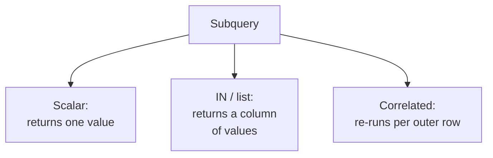

A **subquery** is a query nested inside another. You met them implicitly
in the last page (and saw why deep nesting hurts readability). Used in
moderation, though, subqueries are a precise, expressive tool. This page
sorts the common kinds, shows where each shines in analysis, and gives you
a rule for choosing between a subquery, a CTE, and a join.

<Figure
  slug="duck-subqueries-cutout"
  alt="A small query box nested inside a larger query box on a platform, a single result token passing outward from the inner one"
/>

## Three kinds of subquery

They differ by *what they return* and *how they connect* to the outer
query. Let us take them in turn.

## Scalar subquery: a single value

A scalar subquery returns exactly one row, one column, a single number
you can drop into a `SELECT` or `WHERE`. It is perfect for comparing each
row to a global summary, like "how does this order compare to the overall
average?"

<SqlCodeBlock
  dialect="duckdb"
  title="Each order vs. the overall average"
  initSql={`CREATE TABLE orders (id INTEGER, amount DECIMAL(8, 2));

INSERT INTO
  orders
VALUES
  (1, 120),
  (2, 80),
  (3, 45),
  (4, 200),
  (5, 60),
  (6, 95),
  (7, 30),
  (8, 250),
  (9, 175),
  (10, 55),
  (11, 310),
  (12, 70),
  (13, 140),
  (14, 220),
  (15, 35),
  (16, 165),
  (17, 90),
  (18, 285),
  (19, 110),
  (20, 40),
  (21, 195),
  (22, 65),
  (23, 240),
  (24, 150);`}
  starterCode={`SELECT
  id,
  amount,
  (
    SELECT
      ROUND(AVG(amount), 1)
    FROM
      orders
  ) AS overall_avg,
  amount - (
    SELECT
      AVG(amount)
    FROM
      orders
  ) AS diff_from_avg
FROM
  orders
ORDER BY
  diff_from_avg DESC;`}
/>

The inner `(SELECT AVG(amount) FROM orders)` computes one number, reused
on every row. (A window `AVG(amount) OVER ()` would also work, often the
choice is taste plus clarity.)

## `IN` subquery: a filter list

An `IN` subquery returns a *column* of values to filter against. It
answers "keep rows whose key appears in this other set", e.g. "orders
from customers in the loyalty program."

<Figure
  slug="duck-subqueries-in-analytics-three-kinds-subquery-inline-cutout"
  alt="Three small machines feeding a larger one from three different openings"
  caption="A subquery can supply a value, a list, or a whole table to work from."
/>

<SqlCodeBlock
  dialect="duckdb"
  title="Orders from high-value customers only"
  initSql={`CREATE TABLE orders (
  id INTEGER,
  customer_id INTEGER,
  amount DECIMAL(8, 2)
);

INSERT INTO
  orders
VALUES
  (1, 10, 120),
  (2, 11, 80),
  (3, 12, 45),
  (4, 13, 200),
  (5, 14, 60),
  (6, 15, 95),
  (7, 16, 30),
  (8, 17, 250),
  (9, 18, 175),
  (10, 19, 55),
  (11, 20, 310),
  (12, 21, 70),
  (13, 10, 140),
  (14, 11, 220),
  (15, 12, 35),
  (16, 13, 165),
  (17, 14, 90),
  (18, 15, 285),
  (19, 16, 110),
  (20, 17, 40),
  (21, 18, 195),
  (22, 19, 65),
  (23, 20, 240),
  (24, 21, 150);

CREATE TABLE customers (id INTEGER, tier TEXT);

INSERT INTO
  customers
VALUES
  (10, 'gold'),
  (11, 'silver'),
  (12, 'bronze'),
  (13, 'gold'),
  (14, 'silver'),
  (15, 'bronze'),
  (16, 'gold'),
  (17, 'silver'),
  (18, 'bronze'),
  (19, 'gold'),
  (20, 'silver'),
  (21, 'bronze');`}
  starterCode={`SELECT
  id,
  customer_id,
  amount
FROM
  orders
WHERE
  customer_id IN (
    SELECT
      id
    FROM
      customers
    WHERE
      tier = 'gold'
  )
ORDER BY
  amount DESC;`}
/>

The subquery produces the gold customers' ids; the outer query keeps only
matching orders. Read it as "orders whose customer is in the gold set."

## Correlated subquery: one per outer row

A **correlated** subquery references a column from the outer query, so it
is conceptually re-evaluated for *each* outer row. It is expressive, "the
average amount for *this row's* region", but can be slower, and a window
function or join is often clearer.

<Figure
  slug="duck-subqueries-in-analytics-correlated-subquery-one-per-inline-cutout"
  alt="An inner gauge re-run once for every row of the outer tray, computing the same reading again and again"
  caption="A correlated subquery runs once per outer row, which is what a window function avoids."
/>

<SqlCodeBlock
  dialect="duckdb"
  title="Each order vs. its own region's average"
  initSql={`CREATE TABLE orders (id INTEGER, region TEXT, amount DECIMAL(8, 2));

INSERT INTO
  orders
VALUES
  (1, 'West', 120),
  (2, 'East', 80),
  (3, 'North', 45),
  (4, 'South', 200),
  (5, 'West', 60),
  (6, 'East', 95),
  (7, 'North', 30),
  (8, 'South', 250),
  (9, 'West', 175),
  (10, 'East', 55),
  (11, 'North', 310),
  (12, 'South', 70),
  (13, 'West', 140),
  (14, 'East', 220),
  (15, 'North', 35),
  (16, 'South', 165),
  (17, 'West', 90),
  (18, 'East', 285),
  (19, 'North', 110),
  (20, 'South', 40),
  (21, 'West', 195),
  (22, 'East', 65),
  (23, 'North', 240),
  (24, 'South', 150);`}
  starterCode={`SELECT
  o.id,
  o.region,
  o.amount,
  (
    SELECT
      ROUND(AVG(x.amount), 1)
    FROM
      orders x
    WHERE
      x.region = o.region
  ) AS region_avg -- correlated on o.region
FROM
  orders o
ORDER BY
  o.region,
  o.amount DESC;`}
/>

Notice `WHERE x.region = o.region`, the inner query depends on the outer
row's `region`. This works, but `AVG(amount) OVER (PARTITION BY region)`
expresses the same idea more directly and usually runs better. Knowing
*when not to* reach for a correlated subquery is part of the skill.

## `EXISTS`: does any matching row exist?

`EXISTS` is a correlated subquery that returns true/false, "is there at
least one matching row?" It is the natural way to ask "customers who have
placed *any* order" without caring how many.

<Figure
  slug="duck-subqueries-in-analytics-inline-cutout"
  alt="A small machine feeding its finished tray straight into the hopper of the larger machine that contains it"
  caption="The inner query runs first and hands its result to the query around it."
/>

<SqlCodeBlock
  dialect="duckdb"
  title="Customers who have ordered at least once"
  initSql={`CREATE TABLE customers (id INTEGER, name TEXT);

INSERT INTO
  customers
VALUES
  (1, 'Ada'),
  (2, 'Bo'),
  (3, 'Cy'),
  (4, 'Di'),
  (5, 'Eli'),
  (6, 'Fay'),
  (7, 'Gus'),
  (8, 'Hana'),
  (9, 'Iris'),
  (10, 'Jonas'),
  (11, 'Kira'),
  (12, 'Leo'),
  (13, 'Mona'),
  (14, 'Nils'),
  (15, 'Otto'),
  (16, 'Pia'),
  (17, 'Quinn'),
  (18, 'Rui'),
  (19, 'Sara'),
  (20, 'Theo'),
  (21, 'Ulla'),
  (22, 'Vik'),
  (23, 'Wanda'),
  (24, 'Yara');

CREATE TABLE orders (id INTEGER, customer_id INTEGER);

-- Customers 2, 6, 10, 14, 18 and 22 have never ordered.
INSERT INTO
  orders
VALUES
  (101, 1),
  (102, 1),
  (103, 3),
  (104, 4),
  (105, 5),
  (106, 5),
  (107, 7),
  (108, 8),
  (109, 9),
  (110, 11),
  (111, 12),
  (112, 13),
  (113, 15),
  (114, 16),
  (115, 17),
  (116, 19),
  (117, 20),
  (118, 21),
  (119, 23),
  (120, 24),
  (121, 3),
  (122, 9),
  (123, 17),
  (124, 24);`}
  starterCode={`SELECT
  name
FROM
  customers c
WHERE
  EXISTS (
    SELECT
      1
    FROM
      orders o
    WHERE
      o.customer_id = c.id
  )
ORDER BY
  name;`}
/>

Bo has no orders, so Bo is excluded. `EXISTS` stops at the first match,
making it an efficient "has any" test.

## Choosing: subquery vs. CTE vs. join

These tools overlap. A rough guide for analytical work:

| You want... | Reach for |
| --- | --- |
| A single value to compare against | **Scalar subquery** or `OVER ()` |
| To keep rows matching a set of keys | **`IN`** subquery or a join |
| A per-row value from related rows | **Window function** (clearest), else correlated subquery |
| A multi-step pipeline you will read later | **CTEs** |
| To combine columns from two tables | **Join** |

The meta-rule: **prefer the clearest tool, not the cleverest.** Reach for
a CTE when steps pile up; a window function when you need per-row context;
a join when you are combining tables; a small subquery when it genuinely
reads better.

## Check your understanding

<MultipleChoice
  markdown={`What does a **scalar** subquery return?

- A list of values for an \`IN\` filter.
  > A single-column list is what an \`IN\` subquery returns; a scalar returns one value.
- A whole table of rows and columns.
  > That is a table subquery; a scalar subquery returns just one value.
- [o] Exactly one row and one column, a single value usable in \`SELECT\` or \`WHERE\`.
  > A scalar subquery yields one value, ideal for comparing each row to a global summary.
- Nothing; it only filters.
  > A scalar subquery produces a value that the outer query uses.

A scalar subquery produces one value, often a global summary to compare
against.`}
/>

<MultipleChoice
  markdown={`What makes a subquery **correlated**?

- It is written using a \`WITH\` clause.
  > A \`WITH\` clause defines a CTE, which is a different construct from a correlated subquery.
- It returns more than one column.
  > Column count does not define correlation; referencing the outer query does.
- [o] It references a column from the outer query, so it conceptually re-runs for each outer row.
  > The dependency on an outer-row value (e.g. \`o.region\`) is exactly what correlation means.
- It always uses \`EXISTS\`.
  > \`EXISTS\` is one correlated form, but correlation is about referencing the outer row, not a specific keyword.

A correlated subquery depends on the outer row, so it is evaluated per
outer row.`}
/>

<MultipleChoice
  markdown={`You want each order shown alongside its own region's average amount. Which is usually the **clearest** tool?

- A correlated subquery re-computing the average per row.
  > It works but is verbose and often slower; a window function expresses the same idea more directly.
- [o] A window function: \`AVG(amount) OVER (PARTITION BY region)\`.
  > It attaches the per-region average to each row in one readable expression, the idiomatic analytical choice.
- A \`GROUP BY region\` query.
  > Grouping collapses the orders, so you would lose the individual rows you want to display.
- An \`IN\` subquery.
  > \`IN\` filters rows by membership; it does not attach a per-region average to each row.

When you need a per-row value from related rows, a window function is
usually the clearest tool.`}
/>

You can now compose analytical queries from clear building blocks. Time to
put everything together toward the real goal, turning data into business
insight.
