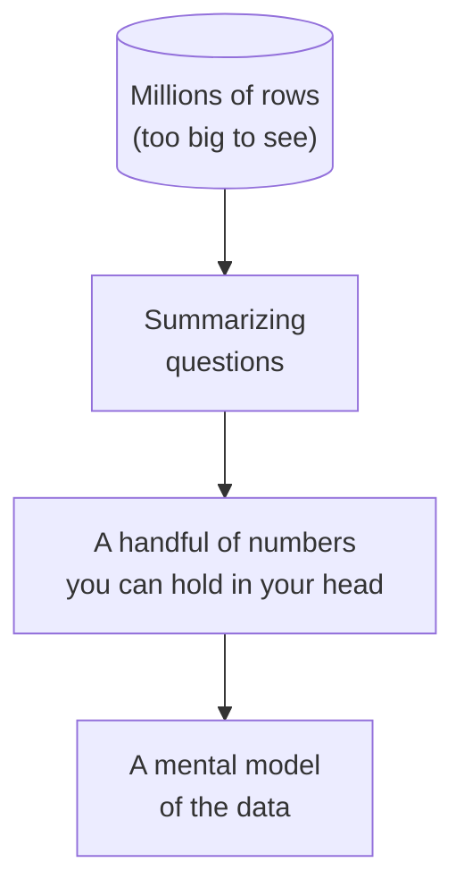
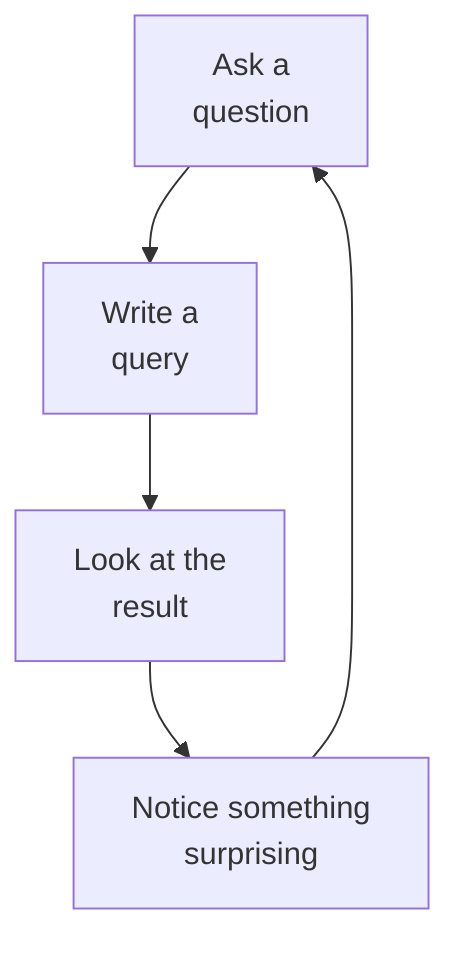
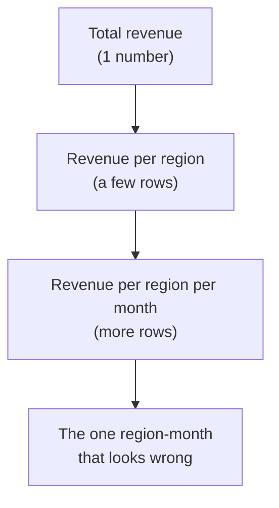

An application developer usually knows exactly which row they want before
they write a query. An analyst almost never does. Faced with a table of a
million rows, you cannot eyeball it, you have to **reason about its
shape** through summaries. This page is about that mindset: how to think
when the data is too big to see, and how SQL becomes your instrument for
"looking."

<Callout type="info" title="An optional deep dive">
This is one of the course's *Interesting discussions*, the mental
toolkit behind exploratory analysis. Nothing later strictly depends on it,
so read it whenever you like. Many readers enjoy it most after they have
run a few queries and felt the exploratory loop firsthand.
</Callout>

<Figure
  slug="duck-thinking-in-datasets-cutout"
  alt="An enormous grid platform too wide to see across, a small summarising lens compressing one region into three number blocks"
/>

## You cannot see a million rows, so you summarize

Imagine someone hands you a spreadsheet with 2 million sales. Scrolling
is hopeless. Instead, an analyst asks *summarizing* questions that shrink
the data to something a human can hold in mind:

- *How many rows are there?* (the size)
- *What date range does it cover?* (the span)
- *How many distinct products / regions / customers?* (the cardinality)
- *What does a typical value look like, and the extremes?* (the
  distribution)

Each answer is a single number or a short list. Stacked together, they
form a **mental picture** of a dataset you will never see row-by-row.

This is the core analytical skill, and it has a name: **exploratory data
analysis (EDA)**. You explore before you conclude.

## The loop: question → query → look → next question

Analysis is rarely a straight line from question to answer. It is a
**loop**. You ask a rough question, write a query, look at the result,
and the result almost always suggests a sharper question.

Say you compute revenue per region and notice one region is oddly low.
That *surprise* drives the next query: is it fewer orders, or smaller
ones? Then the next: which products? Each step narrows the mystery. SQL
is fast enough that this loop can spin many times per minute, which is
why analysts prefer it to hand-editing spreadsheets.

## Drilling down: from coarse to fine

A common pattern within the loop is **drill-down**: start with the
coarsest possible summary, then add detail only where it is interesting.

<Figure
  slug="duck-thinking-in-datasets-inline-cutout"
  alt="A hand moving one block at a time on the left, and a full tray lifted in one motion on the right"
  caption="Start with the coarsest summary and add detail only where it is interesting."
/>

You do **not** dump all the detail at once, that just recreates the
unreadable million-row spreadsheet. You add a dimension at a time, follow
the surprises, and stop when the picture is clear.

Run this against a real 53,940-row file of diamond sales and notice how
two small queries build a mental model of a dataset you never scrolled
through. First, *how big is it, and what does price span?*

<SqlCodeBlock
  dialect="duckdb"
  title="Building a mental picture, size and span"
  starterCode={`-- Question 1: how big, and what does it span?
SELECT
  COUNT(*) AS rows,
  COUNT(DISTINCT cut) AS cuts,
  MIN(price) AS cheapest,
  MAX(price) AS priciest
FROM
  read_parquet(
    'https://cdn.jsdelivr.net/gh/dataslope/datasets@f7f08485960fe4a774359a43d1eb50a84514daf2/diamonds.parquet'
  );`}
/>

Now sharpen the question, *what cuts exist, and how common is each?*

<SqlCodeBlock
  dialect="duckdb"
  title="Drill down: the mix of cuts"
  starterCode={`SELECT
  cut,
  COUNT(*) AS n,
  ROUND(100.0 * COUNT(*) / SUM(COUNT(*)) OVER (), 1) AS pct
FROM
  read_parquet(
    'https://cdn.jsdelivr.net/gh/dataslope/datasets@f7f08485960fe4a774359a43d1eb50a84514daf2/diamonds.parquet'
  )
GROUP BY
  cut
ORDER BY
  n DESC;`}
/>

You just turned 53,940 invisible rows into a few lines of story, without
ever reading a single individual diamond. That is thinking in datasets.

## Three habits worth keeping

- **Summarize before you conclude.** Never trust a hunch about big data
  until a query confirms its shape.
- **Follow the surprises.** The most valuable next query is usually
  prompted by something unexpected in the last result.
- **Add detail gradually.** Coarse first, then drill down. Detail is
  cheap to add and expensive to read all at once.

## Check your understanding

<MultipleChoice
  markdown={`Why do analysts rely on **summaries** when working with large datasets?

- [o] Because a dataset of millions of rows is too large to read directly, so summaries reveal its shape.
  > Counts, ranges, and averages compress an unreadable table into a few numbers a human can reason about.
- Because individual rows are always inaccurate.
  > Individual rows are not inherently inaccurate; they are simply too many to inspect one by one.
- Because SQL is unable to return individual rows.
  > SQL can return individual rows; analysts choose summaries because raw rows are too numerous to comprehend.
- Because summaries are the only queries databases can run quickly.
  > Databases run many kinds of queries; summarizing is a choice driven by human comprehension, not the only fast option.

You summarize because you cannot see a million rows at once, the summary
*is* how you "see" the data.`}
/>

<MultipleChoice
  markdown={`Which best describes the **exploratory analysis loop**?

- Export everything to a spreadsheet and scroll through it.
  > Scrolling through millions of rows is exactly what the loop avoids by summarizing instead.
- Insert data, then immediately delete it.
  > That is not analysis at all; it describes data manipulation with no insight produced.
- [o] Ask a question, run a query, inspect the result, and let what you find shape the next question.
  > This question to query to look to next-question cycle is the heart of exploratory data analysis.
- Write one perfect query at the start and never change it.
  > Analysis is iterative; you rarely know the final query up front. A single fixed query is more typical of application code.

Exploration is a loop: each result suggests the next, sharper question.`}
/>

<MultipleChoice
  markdown={`What is **drill-down** in analysis?

- Joining every table in the database at once.
  > Joining everything indiscriminately is not drill-down; drill-down is a measured, one-dimension-at-a-time refinement.
- Running the same query repeatedly until it gets faster.
  > Repetition does not add analytical detail; drill-down is about adding dimensions, not speed.
- Deleting rows until the table is small enough to read.
  > Drill-down adds detail to summaries; it does not delete data.
- [o] Starting from a coarse summary and progressively adding detail where something looks interesting.
  > You begin with the big picture (e.g. total revenue), then add dimensions like region, then month, following the surprises.

Drill-down means going from coarse to fine, one dimension at a time,
guided by what looks worth investigating.`}
/>

That is the analyst's mindset in miniature: summarize before you conclude,
follow the surprises, add detail gradually. Everything else in the course
is this loop, sharpened with better tools. If you arrived here from the
opening pages, head back to
[Your First Analytical Query](/courses/sql-analytics-duckdb/your-first-analytical-query)
to start practising it hands-on.

<Figure
  slug="duck-thinking-in-datasets-cannot-see-million-inline-cutout"
  alt="An overflowing yard of chips beside one small tray holding a handful of summary blocks"
  caption="You cannot read a million rows, so every question becomes a summary."
/>
