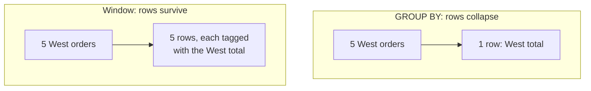
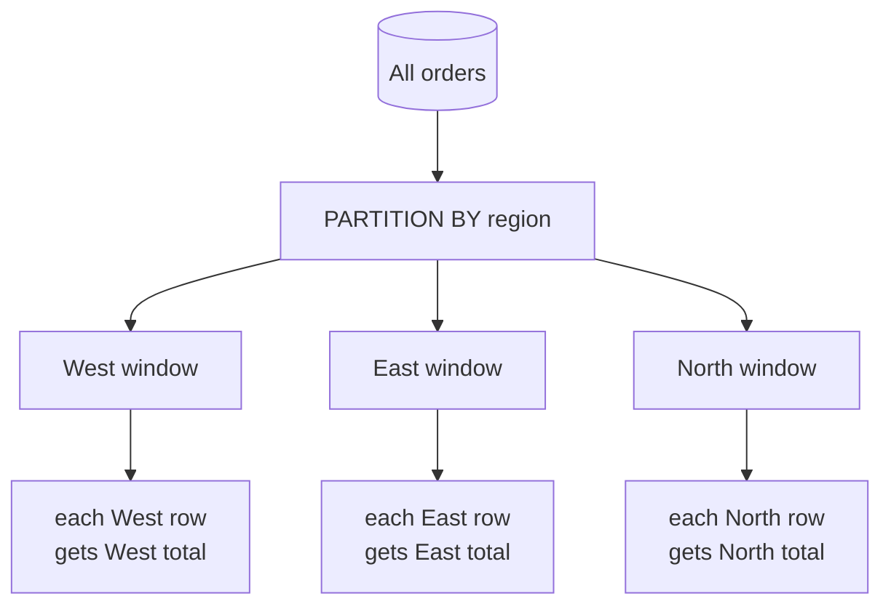

Window functions are the technique that separates casual SQL users from
fluent analysts — and the one most people find genuinely hard at first.
This page goes slowly and builds the *why* before any syntax, because the
mechanics only make sense once you see the problem they solve. Because
this is a foundational, often-confusing concept, this page has extra
practice questions.

<svg
  viewBox="0 0 640 235"
  role="img"
  aria-label="The same five rows take two paths: down the left they collapse into a single green summary dot, down the right all five survive and each carries an identical small green badge — GROUP BY summarizes instead of the rows, a window function summarizes alongside them"
  style={{ display: "block", width: "100%", maxWidth: "640px", height: "auto", margin: "2.5rem auto" }}
>
  <g style={{ color: "var(--ds-blue-500)" }} fill="currentColor">
    <circle cx="230" cy="42" r="8" />
    <circle cx="275" cy="42" r="8" />
    <circle cx="320" cy="42" r="8" />
    <circle cx="365" cy="42" r="8" />
    <circle cx="410" cy="42" r="8" />
  </g>
  <g fill="currentColor" opacity="0.2">
    <circle cx="206" cy="76" r="2.5" />
    <circle cx="184" cy="104" r="2.5" />
    <circle cx="168" cy="132" r="2.5" />
    <circle cx="244" cy="80" r="2.5" />
    <circle cx="208" cy="112" r="2.5" />
    <circle cx="182" cy="140" r="2.5" />
    <circle cx="296" cy="84" r="2.5" />
    <circle cx="234" cy="120" r="2.5" />
    <circle cx="190" cy="148" r="2.5" />
    <circle cx="404" cy="78" r="2.5" />
    <circle cx="416" cy="108" r="2.5" />
    <circle cx="430" cy="138" r="2.5" />
    <circle cx="462" cy="84" r="2.5" />
    <circle cx="486" cy="116" r="2.5" />
    <circle cx="506" cy="142" r="2.5" />
  </g>
  <g style={{ color: "var(--ds-green-500)" }} fill="currentColor">
    <circle cx="160" cy="186" r="26" fillOpacity="0.2" />
    <circle cx="160" cy="186" r="16" />
  </g>
  <g style={{ color: "var(--ds-blue-500)" }} fill="currentColor">
    <circle cx="356" cy="186" r="9" />
    <circle cx="408" cy="186" r="9" />
    <circle cx="460" cy="186" r="9" />
    <circle cx="512" cy="186" r="9" />
    <circle cx="564" cy="186" r="9" />
  </g>
  <g style={{ color: "var(--ds-green-500)" }} fill="currentColor">
    <circle cx="366" cy="172" r="5" />
    <circle cx="418" cy="172" r="5" />
    <circle cx="470" cy="172" r="5" />
    <circle cx="522" cy="172" r="5" />
    <circle cx="574" cy="172" r="5" />
  </g>
  <g fill="currentColor" opacity="0.18">
    <circle cx="64" cy="60" r="3" />
    <circle cx="592" cy="46" r="3" />
    <circle cx="78" cy="200" r="3" />
  </g>
</svg>

## The problem `GROUP BY` cannot solve

`GROUP BY` is powerful but it **destroys the individual rows**. When you
group orders by region, you get one row per region — the orders
themselves are gone. That is fine for a summary, but it fails the moment
you want to *keep every row* and *also* show a summary beside it.

Consider a deceptively simple request:

> "Show every order, and next to each one, what percentage of its
> region's total it represents."

You need **both** at once: the individual order (a row-level fact) *and*
the region total (a group-level fact). `GROUP BY` can give you one or the
other, never both in the same row.



A **window function** is the answer: it computes a summary *across a set
of related rows* but **attaches the result to every row** instead of
collapsing them. You keep all your detail *and* gain the summary.

## The `OVER` clause is what makes it a window

Any aggregate becomes a window function when you add an `OVER (...)`
clause. `SUM(amount)` collapses; `SUM(amount) OVER (...)` does **not** —
it computes a sum over a "window" of rows and writes it onto each row.

Start with the simplest possible window: `OVER ()` with empty parentheses
means "the whole result set is one window." Every row gets the grand
total beside it.

<SqlCodeBlock
  dialect="duckdb"
  title="The grand total, on every row"
  initSql={`CREATE TABLE orders (id INTEGER, region TEXT, amount DECIMAL(8, 2));

INSERT INTO
  orders
VALUES
  (1, 'West', 120),
  (2, 'East', 80),
  (3, 'West', 45),
  (4, 'East', 200),
  (5, 'North', 60);`}
  starterCode={`SELECT
  id,
  region,
  amount,
  SUM(amount) OVER () AS grand_total -- same total on every row
FROM
  orders
ORDER BY
  id;`}
/>

Notice all five rows survived, each carrying the grand total `505`. A
plain `SUM(amount)` would have returned a single row. The `OVER ()` is the
entire difference.

<svg
  viewBox="0 0 640 165"
  role="img"
  aria-label="Five faint rows of different lengths each end in an identical yellow chip stacked in one neat column — an empty OVER clause writes the same grand total onto every surviving row"
  style={{ display: "block", width: "100%", maxWidth: "460px", height: "auto", margin: "2.5rem auto" }}
>
  <g fill="currentColor" opacity="0.13">
    <rect x="80" y="36" width="244" height="13" rx="6.5" />
    <rect x="80" y="60" width="190" height="13" rx="6.5" />
    <rect x="80" y="84" width="266" height="13" rx="6.5" />
    <rect x="80" y="108" width="150" height="13" rx="6.5" />
    <rect x="80" y="132" width="216" height="13" rx="6.5" />
  </g>
  <g style={{ color: "var(--ds-yellow-500)" }} fill="currentColor">
    <rect x="396" y="22" width="60" height="141" rx="14" fillOpacity="0.12" />
    <rect x="406" y="34" width="40" height="17" rx="8.5" />
    <rect x="406" y="58" width="40" height="17" rx="8.5" />
    <rect x="406" y="82" width="40" height="17" rx="8.5" />
    <rect x="406" y="106" width="40" height="17" rx="8.5" />
    <rect x="406" y="130" width="40" height="17" rx="8.5" />
  </g>
  <g fill="currentColor" opacity="0.25">
    <circle cx="358" cy="42" r="2.5" />
    <circle cx="358" cy="66" r="2.5" />
    <circle cx="358" cy="90" r="2.5" />
    <circle cx="358" cy="114" r="2.5" />
    <circle cx="358" cy="138" r="2.5" />
  </g>
</svg>

## `PARTITION BY` — windows per group

`OVER ()` uses the whole table as one window. `PARTITION BY region` splits
the rows into one window **per region**, so each row gets *its own
region's* total. This is the window-function echo of `GROUP BY` — but the
rows stay.

<SqlCodeBlock
  dialect="duckdb"
  title="Each order tagged with its region total"
  initSql={`CREATE TABLE orders (id INTEGER, region TEXT, amount DECIMAL(8, 2));

INSERT INTO
  orders
VALUES
  (1, 'West', 120),
  (2, 'East', 80),
  (3, 'West', 45),
  (4, 'East', 200),
  (5, 'North', 60);`}
  starterCode={`SELECT
  id,
  region,
  amount,
  SUM(amount) OVER (
    PARTITION BY
      region
  ) AS region_total
FROM
  orders
ORDER BY
  region,
  id;`}
/>



Now the original request is one step away — divide each `amount` by its
`region_total`:

<SqlCodeBlock
  dialect="duckdb"
  title="Each order's share of its region"
  initSql={`CREATE TABLE orders (id INTEGER, region TEXT, amount DECIMAL(8, 2));

INSERT INTO
  orders
VALUES
  (1, 'West', 120),
  (2, 'East', 80),
  (3, 'West', 45),
  (4, 'East', 200),
  (5, 'North', 60);`}
  starterCode={`SELECT
  id,
  region,
  amount,
  ROUND(
    100.0 * amount / SUM(amount) OVER (
      PARTITION BY
        region
    ),
    1
  ) AS pct_of_region
FROM
  orders
ORDER BY
  region,
  pct_of_region DESC;`}
/>

That `pct_of_region` is impossible with `GROUP BY` alone in a single
query, because it needs the row *and* the group total side by side.
Window functions make it one line.

## `GROUP BY` vs window — the key contrast

| | `GROUP BY` | Window function (`OVER`) |
| --- | --- | --- |
| Rows in result | One per group | One per **original row** |
| Detail rows | Collapsed away | **Preserved** |
| Sees the group summary? | Yes | Yes |
| Sees each individual row? | No | **Yes** |
| Typical use | "Total per region" | "Each order vs its region total" |

The one-sentence summary: **`GROUP BY` summarizes *instead of* the rows; a
window function summarizes *alongside* the rows.**

## Anatomy of a window function

```
SUM(amount)  OVER ( PARTITION BY region  ORDER BY order_date )
└────┬────┘        └──────┬──────────┘  └────────┬─────────┘
  what to            which rows share        order within
  compute            a window                the window
```

- The **function** (`SUM`, `AVG`, `COUNT`, `ROW_NUMBER`, ...) is what to
  compute.
- **`PARTITION BY`** decides which rows belong to the same window
  (optional — omit it for one big window).
- **`ORDER BY`** orders rows *inside* each window, which matters for
  running totals and rankings (next pages).

## Check your understanding

<MultipleChoice
  markdown={`What is the fundamental difference between a window function and \`GROUP BY\`?

- Window functions can only count, while \`GROUP BY\` can sum.
  > Both can use the same aggregates; the difference is whether rows are preserved.
- [o] A window function keeps every original row and attaches a summary to each; \`GROUP BY\` collapses rows into one per group.
  > Windows summarize *alongside* the rows; \`GROUP BY\` summarizes *instead of* them.
- \`GROUP BY\` keeps every row while window functions collapse them.
  > It is the reverse: \`GROUP BY\` collapses; window functions preserve rows.
- They always return identical results.
  > They return different shapes — one row per group vs one row per input row.

A window function preserves detail rows and adds a per-window summary;
\`GROUP BY\` collapses detail into group summaries.`}
/>

<MultipleChoice
  markdown={`What does the empty \`OVER ()\` clause mean in \`SUM(amount) OVER ()\`?

- Compute the sum of just the current row.
  > With no frame restriction, the window is the whole result set, not a single row.
- [o] Treat the entire result set as one window, so every row receives the grand total.
  > Empty parentheses mean "one window over all rows," attaching the overall sum to each row.
- It is invalid syntax.
  > \`OVER ()\` is valid and means the full result set is the window.
- Sort the rows ascending.
  > \`OVER ()\` does not sort; it defines the window as all rows.

\`OVER ()\` makes the whole result a single window — the grand total lands
on every row.`}
/>

<MultipleChoice
  markdown={`What does \`PARTITION BY region\` do inside an \`OVER\` clause?

- It permanently splits the table into separate region tables.
  > It only defines per-region windows for the calculation; the table is unchanged.
- [o] It divides the rows into one window per region, so each row's window calculation uses only its own region's rows.
  > \`PARTITION BY\` scopes the window to matching rows, like a per-group calculation that still returns every row.
- It removes the region column from the output.
  > The region column remains; partitioning only scopes the window.
- It is required in every window function.
  > \`PARTITION BY\` is optional; without it the window spans all rows.

\`PARTITION BY\` creates a separate window per group while preserving all
rows.`}
/>

<MultipleChoice
  markdown={`Why is "each order's percentage of its region's total" hard with \`GROUP BY\` alone?

- Because \`GROUP BY\` cannot compute a \`SUM\`.
  > \`GROUP BY\` computes sums fine; the difficulty is combining the sum with each detail row.
- [o] It needs the individual order **and** the region total in the same row, but \`GROUP BY\` collapses the orders away.
  > The per-row share requires row-level detail beside the group total — exactly what windows provide and \`GROUP BY\` does not.
- Because percentages are not allowed in SQL.
  > Percentages are ordinary arithmetic; SQL handles them.
- Because regions cannot be grouped.
  > Regions group fine; the issue is keeping detail rows alongside the total.

The calculation needs row and group-total together, which is the signature
case for a window function.`}
/>

<MultipleChoice
  markdown={`Which clause turns an ordinary aggregate like \`AVG(score)\` into a window function?

- \`GROUP BY\`
  > \`GROUP BY\` makes it collapse rows; it does not create a window.
- \`HAVING\`
  > \`HAVING\` filters groups; it has nothing to do with windows.
- [o] \`OVER (...)\`
  > Adding an \`OVER\` clause turns any aggregate into a window function that preserves rows.
- \`DISTINCT\`
  > \`DISTINCT\` removes duplicates; it does not create a window.

The \`OVER\` clause is what makes an aggregate a window function.`}
/>

Now that the `OVER` clause makes sense, the next pages put it to work:
ranking rows, then computing running totals and moving averages.
