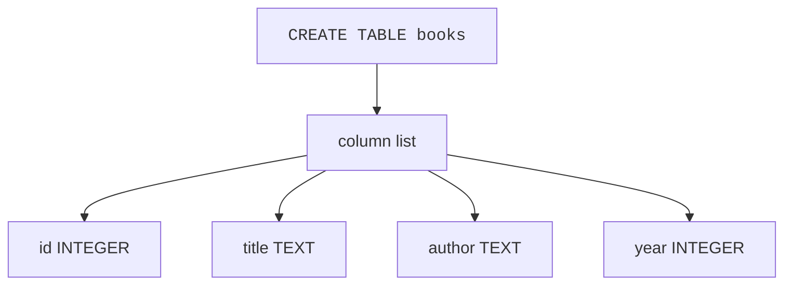
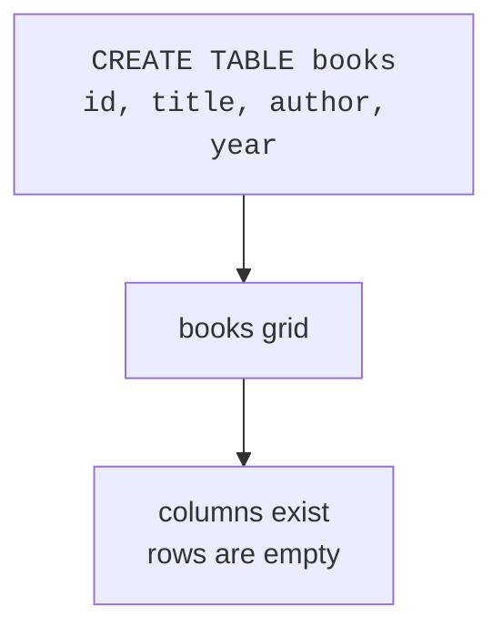
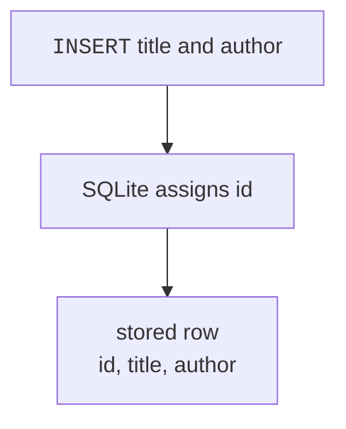
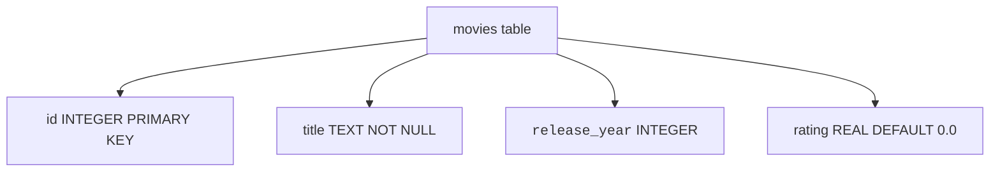

A database table is a place to store one kind of thing: books, customers, recipes, tasks, or anything else you want to remember.

Before a table can hold rows, you define its shape. In SQL, that job belongs to `CREATE TABLE`.

<svg
  viewBox="0 0 640 220"
  role="img"
  aria-label="A cookie-cutter ring hovers over rolled dough where one row shape has already been cut, and finished row-cookies with their value dots cool on the right — CREATE TABLE defines the shape that every future row will be stamped from"
  style={{ display: "block", width: "100%", maxWidth: "640px", height: "auto", margin: "2.5rem auto" }}
>
  <g style={{ color: "var(--ds-blue-500)" }} fill="currentColor">
    <path fillRule="evenodd" d="M 96 28 Q 84 28 84 40 L 84 64 Q 84 76 96 76 L 280 76 Q 292 76 292 64 L 292 40 Q 292 28 280 28 Z M 100 38 Q 94 38 94 44 L 94 60 Q 94 66 100 66 L 276 66 Q 282 66 282 60 L 282 44 Q 282 38 276 38 Z" fillOpacity="0.85" />
    <rect x="174" y="12" width="28" height="12" rx="6" fillOpacity="0.5" />
  </g>
  <g fill="currentColor" opacity="0.25">
    <circle cx="318" cy="44" r="2.5" />
    <circle cx="332" cy="52" r="2.5" />
    <circle cx="322" cy="62" r="2.5" />
  </g>
  <g fill="currentColor" opacity="0.1">
    <path d="M 48 124 Q 40 188 110 196 L 320 200 Q 380 198 372 150 Q 368 116 300 112 L 110 110 Q 54 110 48 124 Z" />
  </g>
  <g fill="currentColor" opacity="0.2">
    <path fillRule="evenodd" d="M 102 134 Q 94 134 94 142 L 94 162 Q 94 170 102 170 L 256 170 Q 264 170 264 162 L 264 142 Q 264 134 256 134 Z M 106 141 Q 101 141 101 146 L 101 158 Q 101 163 106 163 L 252 163 Q 257 163 257 158 L 257 146 Q 257 141 252 141 Z" />
  </g>
  <g style={{ color: "var(--ds-green-500)" }} fill="currentColor">
    <rect x="416" y="108" width="186" height="40" rx="12" fillOpacity="0.3" />
    <circle cx="440" cy="128" r="8" fillOpacity="0.95" />
    <rect x="458" y="122" width="58" height="11" rx="5.5" fillOpacity="0.7" />
    <rect x="526" y="122" width="38" height="11" rx="5.5" fillOpacity="0.5" />
  </g>
  <g style={{ color: "var(--ds-yellow-500)" }} fill="currentColor">
    <rect x="432" y="160" width="186" height="40" rx="12" fillOpacity="0.3" />
    <circle cx="456" cy="180" r="8" fillOpacity="0.95" />
    <rect x="474" y="174" width="58" height="11" rx="5.5" fillOpacity="0.7" />
    <rect x="542" y="174" width="38" height="11" rx="5.5" fillOpacity="0.5" />
  </g>
</svg>

## The basic CREATE TABLE shape

To create a table, give SQLite a table name and a list of columns. Each column has a name and a type.

<SqlCodeBlock
  dialect="sqlite"
  title="Create an empty books table"
  starterCode={`CREATE TABLE books (id INTEGER, title TEXT, author TEXT, year INTEGER);

SELECT
  *
FROM
  books;`}
/>

The `SELECT` returns no rows because the table is empty. That is still useful: it proves the table exists and shows the column names.

Read the statement as: *create a table called `books` with an integer `id`, text `title`, text `author`, and integer `year`.*



## From statement to grid

The table definition becomes an empty grid. The columns are ready; rows come later with `INSERT`.



| id | title | author | year |
| --- | --- | --- | --- |
|  |  |  |  |

## Choosing SQLite column types

SQLite is beginner-friendly, but it has an important difference from many other databases: it uses **dynamic typing**. That means SQLite mostly cares about the value you store, not only the type written on the column.

Still, you should choose clear types because they document your intent and help SQLite apply type affinity.

| Type | Use it for |
| --- | --- |
| `INTEGER` | Whole numbers like counts, ids, and years |
| `TEXT` | Words, names, emails, and dates written like `'2025-01-15'` |
| `REAL` | Decimal numbers like prices, weights, and measurements |
| `NUMERIC` | Values that should behave like numbers, often money-like or yes/no `0` and `1` values |

<Callout type="info" title="SQLite type affinity">
SQLite will try to store values in a sensible way based on the column's declared type, but it is more flexible than many server databases. Use the right type anyway: it makes your table easier for humans to understand.
</Callout>

<SqlCodeBlock
  dialect="sqlite"
  title="Create a table with common SQLite types"
  starterCode={`CREATE TABLE products (
  id INTEGER,
  name TEXT,
  price REAL,
  in_stock INTEGER,
  tax_rate NUMERIC
);

SELECT
  *
FROM
  products;`}
/>

<MultipleChoice
  markdown={`Which SQLite type is the clearest choice for a person's name?

- \`INTEGER\`
  > \`INTEGER\` is best for whole numbers, not names.
- [o] \`TEXT\`
  > \`TEXT\` is the natural choice for words such as names and titles.
- \`REAL\`
  > \`REAL\` is best for decimal numbers.
- \`NUMERIC\`
  > \`NUMERIC\` is for number-like values, not ordinary words.

Column types are a promise to readers about what kind of values belong in each column.`}
/>

## INTEGER PRIMARY KEY

Most tables need a column that uniquely identifies each row. In SQLite, the everyday beginner pattern is:

```sql
id INTEGER PRIMARY KEY
```

That column becomes a unique row id. If you omit it during an insert, SQLite can assign the next id for you.

<SqlCodeBlock
  dialect="sqlite"
  title="Let SQLite assign ids"
  starterCode={`CREATE TABLE books (id INTEGER PRIMARY KEY, title TEXT, author TEXT);

INSERT INTO
  books (title, author)
VALUES
  ('A Wrinkle in Time', 'Madeleine L''Engle'),
  ('The Hobbit', 'J. R. R. Tolkien');

SELECT
  *
FROM
  books
ORDER BY
  id;`}
/>

Notice that the `INSERT` statement did not provide `id` values. SQLite filled them in because `id` is an `INTEGER PRIMARY KEY`.



## NOT NULL and DEFAULT

A table can include rules called **constraints**. Two beginner-friendly constraints are:

- `NOT NULL`: this column must have a value.
- `DEFAULT`: if the insert omits this column, use a fallback value.

<svg
  viewBox="0 0 640 170"
  role="img"
  aria-label="A new row arrives with one cell left empty, and a little dispenser above drops a yellow zero token into the gap along a dotted trail — a DEFAULT quietly fills in what the insert left out"
  style={{ display: "block", width: "100%", maxWidth: "480px", height: "auto", margin: "2.5rem auto" }}
>
  <g fill="currentColor" opacity="0.12">
    <rect x="96" y="104" width="118" height="44" rx="8" />
    <rect x="222" y="104" width="118" height="44" rx="8" />
    <rect x="348" y="104" width="118" height="44" rx="8" />
  </g>
  <g style={{ color: "var(--ds-blue-500)" }} fill="currentColor">
    <circle cx="128" cy="126" r="9" />
  </g>
  <g style={{ color: "var(--ds-green-500)" }} fill="currentColor">
    <rect x="244" y="120" width="74" height="12" rx="6" fillOpacity="0.8" />
  </g>
  <g style={{ color: "var(--ds-yellow-500)" }} fill="currentColor">
    <rect x="376" y="16" width="62" height="26" rx="7" fillOpacity="0.85" />
    <rect x="396" y="42" width="22" height="8" rx="3" fillOpacity="0.5" />
  </g>
  <g fill="currentColor" opacity="0.3">
    <circle cx="407" cy="62" r="2.5" />
    <circle cx="407" cy="78" r="2.5" />
    <circle cx="407" cy="94" r="2.5" />
  </g>
  <g style={{ color: "var(--ds-yellow-500)" }} fill="currentColor">
    <path fillRule="evenodd" d="M 407 110 A 16 16 0 1 0 407 142 A 16 16 0 1 0 407 110 Z M 407 119 A 7 7 0 1 1 407 133 A 7 7 0 1 1 407 119 Z" fillOpacity="0.95" />
  </g>
</svg>

<SqlCodeBlock
  dialect="sqlite"
  title="Add simple rules to a table"
  starterCode={`CREATE TABLE habits (
  id INTEGER PRIMARY KEY,
  name TEXT NOT NULL,
  times_done INTEGER DEFAULT 0
);

INSERT INTO
  habits (name)
VALUES
  ('Drink water'),
  ('Stretch');

SELECT
  *
FROM
  habits
ORDER BY
  id;`}
/>

The rows have `times_done` set to `0` even though the insert did not mention that column. The `DEFAULT 0` rule filled it in.

<SqlCodeBlock
  dialect="sqlite"
  title="A small table with several rules"
  starterCode={`CREATE TABLE movies (
  id INTEGER PRIMARY KEY,
  title TEXT NOT NULL,
  release_year INTEGER,
  rating REAL DEFAULT 0.0
);

INSERT INTO
  movies (title, release_year, rating)
VALUES
  ('Spirited Away', 2001, 8.6);

INSERT INTO
  movies (title, release_year)
VALUES
  ('The Iron Giant', 1999);

SELECT
  *
FROM
  movies
ORDER BY
  id;`}
/>



<MultipleChoice
  markdown={`A column is declared \`times_done INTEGER DEFAULT 0\`. What happens when an insert omits \`times_done\`?

- The table is deleted.
  > Omitting one column during insert does not delete a table.
- The row is always rejected.
  > A default exists so SQLite has a value to use.
- [o] SQLite stores \`0\` for that column.
  > \`DEFAULT 0\` supplies the value when the insert leaves the column out.
- SQLite stores the table name there.
  > Defaults use the value you wrote, not the table name.

A default is a fallback value for missing input.`}
/>

## Practice challenge

<SqlChallengeCard
  dialect="sqlite"
  title="Create a notes table"
  instructions={`Create a table named \`notes\` with these columns:

- \`id INTEGER PRIMARY KEY\`
- \`body TEXT NOT NULL\`
- \`pinned INTEGER DEFAULT 0\`

Then select all columns from \`notes\`.`}
  initSql={``}
  starterCode={`-- Create the table here:
-- Then read it:`}
  solutionSql={`CREATE TABLE notes (
  id INTEGER PRIMARY KEY,
  body TEXT NOT NULL,
  pinned INTEGER DEFAULT 0
);

SELECT
  *
FROM
  notes;`}
  tests={[
    { id: "columns", name: "Has the right columns", description: "The result should show id, body, and pinned columns.", expectedColumns: ["id", "body", "pinned"] },
    { id: "row_count", name: "Returns no rows", description: "A newly created table should be empty.", expectedRowCount: 0 },
  ]}
/>

## Check your understanding

<MultipleChoice
  markdown={`What does \`CREATE TABLE\` define?

- The order in which every query must run.
  > Query order is not controlled by \`CREATE TABLE\`.
- [o] A table's name, columns, types, and simple rules.
  > \`CREATE TABLE\` describes the structure that rows will follow.
- The exact rows that must always be returned.
  > Rows are added with \`INSERT\` and read with \`SELECT\`.
- A backup copy of the database.
  > Backups are separate from table creation.

A table definition is the shape of future data.`}
/>

<MultipleChoice
  markdown={`Why is \`id INTEGER PRIMARY KEY\` useful in SQLite?

- It stores long paragraphs better than \`TEXT\`.
  > Paragraphs belong in \`TEXT\` columns.
- It prevents the table from having any rows.
  > A primary key helps identify rows; it does not block all rows.
- [o] It gives each row a unique identifier and can be auto-assigned when omitted.
  > In SQLite, an \`INTEGER PRIMARY KEY\` column is the standard simple id column.
- It makes every column use decimal numbers.
  > The primary key rule applies to that id column, not every column.

A stable id lets you point to one exact row.`}
/>

<MultipleChoice
  markdown={`What does SQLite's dynamic typing mean for beginners?

- Column types are useless and should never be written.
  > Types still communicate intent and guide SQLite's affinity behavior.
- SQLite has the same strict type behavior as every other database.
  > SQLite is more flexible than many server databases.
- [o] SQLite is flexible about stored values, but you should still choose clear column types.
  > Clear types make your table understandable and help SQLite handle values sensibly.
- \`TEXT\` columns automatically become primary keys.
  > Primary keys are declared separately.

SQLite's flexibility is helpful, but clear table design still matters.`}
/>
