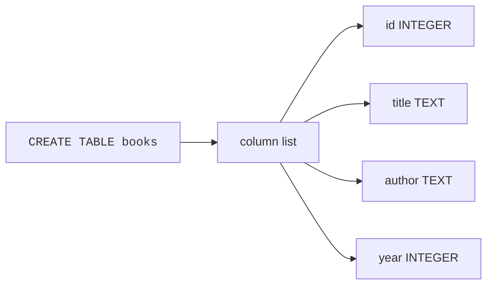
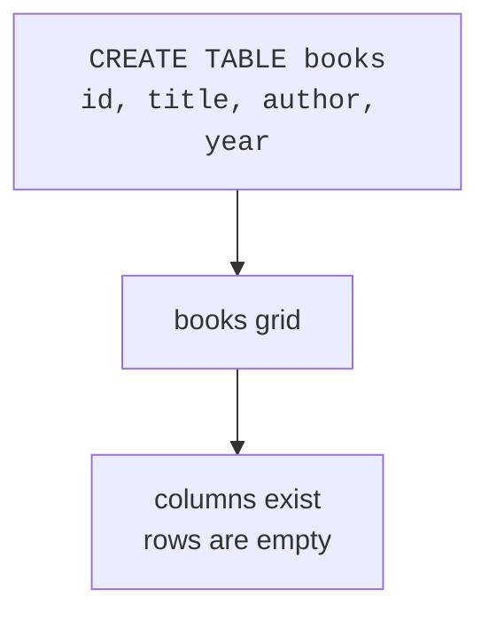
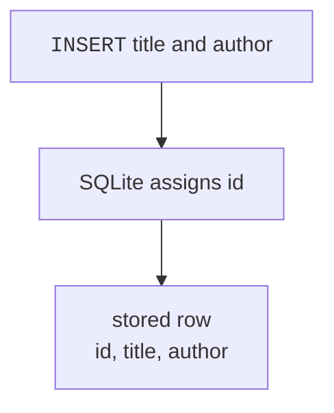
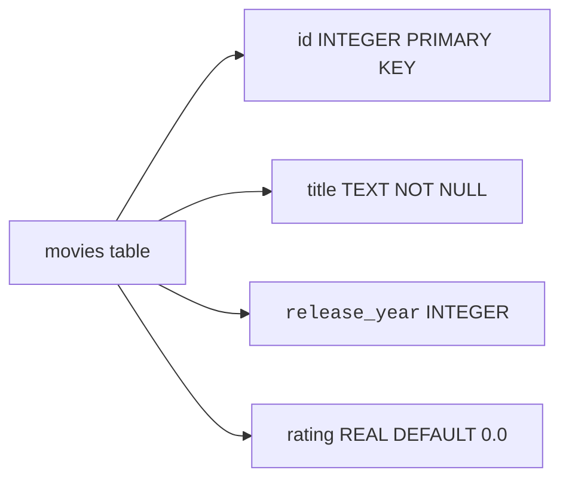

A database table is a place to store one kind of thing: books, customers, recipes, tasks, or anything else you want to remember.

Before a table can hold rows, you define its shape. In SQL, that job belongs to `CREATE TABLE`.

<Figure
  slug="lite-creating-tables-cutout"
  alt="An empty grid frame being assembled on a platform, column header plates slotting into its top edge"
/>

## The basic CREATE TABLE shape

To create a table, give SQLite a table name and a list of columns. Each column has a name and a type.

<Figure
  slug="lite-creating-tables-basic-create-table-inline-cutout"
  alt="A solid slab divided into columns of set widths by inserted dividers"
  caption="A table starts as an empty grid whose column widths you decide in advance."
/>

<SqlCodeBlock
  dialect="sqlite"
  title="Create an empty books table"
  starterCode={`CREATE TABLE books (id INTEGER, title TEXT, author TEXT, year INTEGER);

SELECT
  *
FROM
  books;`}
/>

The `SELECT` returns no rows because the table is empty. That is still useful: it proves the table exists and shows the column names.

Read the statement as: *create a table called `books` with an integer `id`, text `title`, text `author`, and integer `year`.*



## From statement to grid

The table definition becomes an empty grid. The columns are ready; rows come later with `INSERT`.

<Figure
  slug="lite-creating-tables-from-statement-grid-inline-cutout"
  alt="A written card on the left and the ruled frame it describes standing built on the right"
  caption="The statement on the left is exactly the structure that gets built."
/>



| id | title | author | year |
| --- | --- | --- | --- |
|  |  |  |  |

## Choosing SQLite column types

SQLite is beginner-friendly, but it has an important difference from many other databases: it uses **dynamic typing**. That means SQLite mostly cares about the value you store, not only the type written on the column.

<Figure
  slug="lite-creating-tables-inline-cutout"
  alt="An empty frame being ruled into columns of set widths before any row is laid into it"
  caption="Naming the columns and their types is the whole of creating a table."
/>

Still, you should choose clear types because they document your intent and help SQLite apply type affinity.

| Type | Use it for |
| --- | --- |
| `INTEGER` | Whole numbers like counts, ids, and years |
| `TEXT` | Words, names, emails, and dates written like `'2025-01-15'` |
| `REAL` | Decimal numbers like prices, weights, and measurements |
| `NUMERIC` | Values that should behave like numbers, often money-like or yes/no `0` and `1` values |

<Callout type="info" title="SQLite type affinity">
SQLite will try to store values in a sensible way based on the column's declared type, but it is more flexible than many server databases. Use the right type anyway: it makes your table easier for humans to understand.
</Callout>

<SqlCodeBlock
  dialect="sqlite"
  title="Create a table with common SQLite types"
  starterCode={`CREATE TABLE products (
  id INTEGER,
  name TEXT,
  price REAL,
  in_stock INTEGER,
  tax_rate NUMERIC
);

SELECT
  *
FROM
  products;`}
/>

<MultipleChoice
  markdown={`Which SQLite type is the clearest choice for a person's name?

- \`INTEGER\`
  > \`INTEGER\` is best for whole numbers, not names.
- [o] \`TEXT\`
  > \`TEXT\` is the natural choice for words such as names and titles.
- \`NUMERIC\`
  > \`NUMERIC\` is for number-like values, not ordinary words.
- \`REAL\`
  > \`REAL\` is best for decimal numbers.

Column types are a promise to readers about what kind of values belong in each column.`}
/>

## INTEGER PRIMARY KEY

Most tables need a column that uniquely identifies each row. In SQLite, the everyday beginner pattern is:

```sql
id INTEGER PRIMARY KEY
```

That column becomes a unique row id. If you omit it during an insert, SQLite can assign the next id for you.

<SqlCodeBlock
  dialect="sqlite"
  title="Let SQLite assign ids"
  starterCode={`CREATE TABLE books (id INTEGER PRIMARY KEY, title TEXT, author TEXT);

INSERT INTO
  books (title, author)
VALUES
  ('A Wrinkle in Time', 'Madeleine L''Engle'),
  ('The Hobbit', 'J. R. R. Tolkien');

SELECT
  *
FROM
  books
ORDER BY
  id;`}
/>

Notice that the `INSERT` statement did not provide `id` values. SQLite filled them in because `id` is an `INTEGER PRIMARY KEY`.



## NOT NULL and DEFAULT

A table can include rules called **constraints**. Two beginner-friendly constraints are:

- `NOT NULL`: this column must have a value.
- `DEFAULT`: if the insert omits this column, use a fallback value.

<SqlCodeBlock
  dialect="sqlite"
  title="Add simple rules to a table"
  starterCode={`CREATE TABLE habits (
  id INTEGER PRIMARY KEY,
  name TEXT NOT NULL,
  times_done INTEGER DEFAULT 0
);

INSERT INTO
  habits (name)
VALUES
  ('Drink water'),
  ('Stretch');

SELECT
  *
FROM
  habits
ORDER BY
  id;`}
/>

The rows have `times_done` set to `0` even though the insert did not mention that column. The `DEFAULT 0` rule filled it in.

<SqlCodeBlock
  dialect="sqlite"
  title="A small table with several rules"
  starterCode={`CREATE TABLE movies (
  id INTEGER PRIMARY KEY,
  title TEXT NOT NULL,
  release_year INTEGER,
  rating REAL DEFAULT 0.0
);

INSERT INTO
  movies (title, release_year, rating)
VALUES
  ('Spirited Away', 2001, 8.6);

INSERT INTO
  movies (title, release_year)
VALUES
  ('The Iron Giant', 1999);

SELECT
  *
FROM
  movies
ORDER BY
  id;`}
/>



<MultipleChoice
  markdown={`A column is declared \`times_done INTEGER DEFAULT 0\`. What happens when an insert omits \`times_done\`?

- SQLite stores the table name there.
  > Defaults use the value you wrote, not the table name.
- The table is deleted.
  > Omitting one column during insert does not delete a table.
- [o] SQLite stores \`0\` for that column.
  > \`DEFAULT 0\` supplies the value when the insert leaves the column out.
- The row is always rejected.
  > A default exists so SQLite has a value to use.

A default is a fallback value for missing input.`}
/>

## Practice challenge

<SqlChallengeCard
  dialect="sqlite"
  title="Create a notes table"
  instructions={`Create a table named \`notes\` with these columns:

- \`id INTEGER PRIMARY KEY\`
- \`body TEXT NOT NULL\`
- \`pinned INTEGER DEFAULT 0\`

Then select all columns from \`notes\`.`}
  initSql={``}
  starterCode={`-- Create the table here:
-- Then read it:`}
  solutionSql={`CREATE TABLE notes (
  id INTEGER PRIMARY KEY,
  body TEXT NOT NULL,
  pinned INTEGER DEFAULT 0
);

SELECT
  *
FROM
  notes;`}
  tests={[
    { id: "columns", name: "Has the right columns", description: "The result should show id, body, and pinned columns.", expectedColumns: ["id", "body", "pinned"] },
    { id: "row_count", name: "Returns no rows", description: "A newly created table should be empty.", expectedRowCount: 0 },
  ]}
/>

## Check your understanding

<MultipleChoice
  markdown={`What does \`CREATE TABLE\` define?

- A backup copy of the database.
  > Backups are separate from table creation.
- [o] A table's name, columns, types, and simple rules.
  > \`CREATE TABLE\` describes the structure that rows will follow.
- The exact rows that must always be returned.
  > Rows are added with \`INSERT\` and read with \`SELECT\`.
- The order in which every query must run.
  > Query order is not controlled by \`CREATE TABLE\`.

A table definition is the shape of future data.`}
/>

<MultipleChoice
  markdown={`Why is \`id INTEGER PRIMARY KEY\` useful in SQLite?

- It prevents the table from having any rows.
  > A primary key helps identify rows; it does not block all rows.
- It makes every column use decimal numbers.
  > The primary key rule applies to that id column, not every column.
- [o] It gives each row a unique identifier and can be auto-assigned when omitted.
  > In SQLite, an \`INTEGER PRIMARY KEY\` column is the standard simple id column.
- It stores long paragraphs better than \`TEXT\`.
  > Paragraphs belong in \`TEXT\` columns.

A stable id lets you point to one exact row.`}
/>

<MultipleChoice
  markdown={`What does SQLite's dynamic typing mean for beginners?

- SQLite has the same strict type behavior as every other database.
  > SQLite is more flexible than many server databases.
- [o] SQLite is flexible about stored values, but you should still choose clear column types.
  > Clear types make your table understandable and help SQLite handle values sensibly.
- Column types are useless and should never be written.
  > Types still communicate intent and guide SQLite's affinity behavior.
- \`TEXT\` columns automatically become primary keys.
  > Primary keys are declared separately.

SQLite's flexibility is helpful, but clear table design still matters.`}
/>
