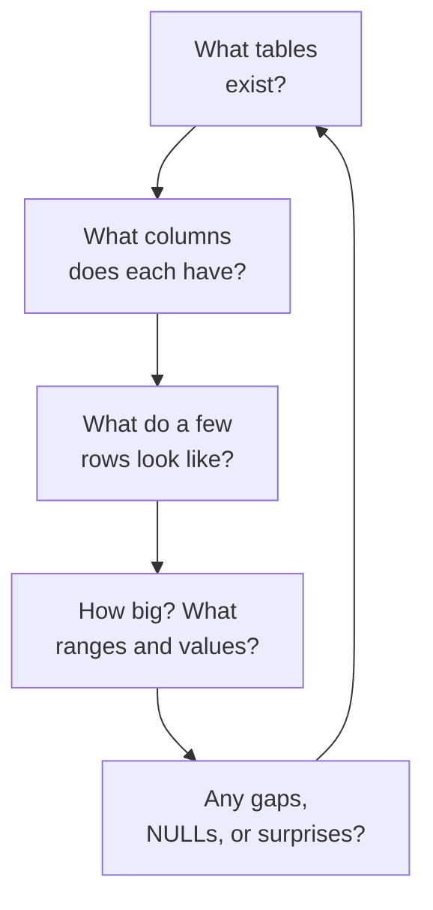

Most of this course has built tables from scratch. But often you are
handed a database someone *else* made and asked, *"what's in here?"*
**Data exploration** is the skill of answering that question quickly
and methodically, before you write a single "real" query.

This page gives you a repeatable routine. Think of it as the
questions a careful analyst always asks first.

<Figure
  slug="lite-data-exploration-cutout"
  alt="A magnifying lens sweeping over an unfamiliar cabinet of grid trays, a small checklist plinth beside it"
/>

## The exploration loop

You rarely understand a dataset in one look. You **loop**: get the
shape, peek at rows, then ask sharper questions as the data tells you
what to ask next.

The loop above is the shape of exploration; here is one pass through it, with
the question each step answers:

<Steps>
<Step>

**What tables exist?**

List the tables in the database so you know what you are working with.

</Step>
<Step>

**What columns does each have?**

Inspect a table's schema, the column names and types tell you what questions
are even askable.

</Step>
<Step>

**What do a few rows look like?**

Peek at a small sample to see real values, formats, and obvious oddities.

</Step>
<Step>

**How big, and what's in the columns?**

Count rows and check ranges, distinct values, and min/max to gauge scale and
spread.

</Step>
<Step>

**Any gaps, NULLs, or surprises?**

Hunt for missing values and anomalies, then loop back with sharper questions.

</Step>
</Steps>

## Step 1, What tables exist?

In SQLite, the database keeps a built-in catalog of itself in a
special table called `sqlite_master` (also available as
`sqlite_schema`). Querying it lists every table you can work with.

<Figure
  slug="lite-data-exploration-step-1-tables-inline-cutout"
  alt="A cabinet opened to show which drawers exist before any drawer is pulled"
  caption="Ask which tables exist before you open any one of them."
/>

<SqlCodeBlock
  dialect="sqlite"
  title="List the tables in the database"
  initSql={`CREATE TABLE customers (id INTEGER PRIMARY KEY, name TEXT, city TEXT);
CREATE TABLE orders (id INTEGER PRIMARY KEY, customer_id INTEGER, amount NUMERIC, placed_on TEXT);
INSERT INTO customers (name, city) VALUES
  ('Ada','Lagos'),('Grace','Oslo'),('Linus','Lagos'),('Mary',NULL);
INSERT INTO orders (customer_id, amount, placed_on) VALUES
  (1,42.00,'2024-01-03'),(1,18.50,'2024-02-10'),
  (2,99.00,'2024-01-29'),(3,30.00,'2024-03-05'),(3,NULL,'2024-03-06');`}
  starterCode={`SELECT
  name
FROM
  sqlite_master
WHERE
  type = 'table'
ORDER BY
  name;`}
/>

<Callout type="info" title="The Tables viewer">
The runnable blocks on this site also show a **Tables** panel above
the editor, so you can often see the table list without querying
`sqlite_master`. But knowing the query means you can explore *any*
SQLite database, anywhere.
</Callout>

## Step 2, What columns does a table have?

To see a table's columns and their declared types, SQLite gives you a
special command called `PRAGMA table_info`. It returns one row per
column.

<SqlCodeBlock
  dialect="sqlite"
  title="Inspect a table's columns"
  initSql={`CREATE TABLE orders (id INTEGER PRIMARY KEY, customer_id INTEGER, amount NUMERIC, placed_on TEXT);
INSERT INTO orders (customer_id, amount, placed_on) VALUES (1,42.0,'2024-01-03');`}
  starterCode={`PRAGMA table_info (orders);`}
/>

Each row tells you the column's name, its declared type, whether it
is `NOT NULL`, its default, and whether it is part of the primary key.
That is the table's **schema**, its shape, at a glance.

## Step 3, Peek at a few rows

Numbers and types only tell you so much. Always look at real rows.
`LIMIT` keeps the peek small even if the table is huge.

<SqlCodeBlock
  dialect="sqlite"
  title="Look at a sample of rows"
  initSql={`CREATE TABLE customers (id INTEGER PRIMARY KEY, name TEXT, city TEXT);
INSERT INTO customers (name, city) VALUES
  ('Ada','Lagos'),('Grace','Oslo'),('Linus','Lagos'),('Mary',NULL);`}
  starterCode={`SELECT
  *
FROM
  customers
LIMIT
  5;`}
/>

A five-row peek instantly answers questions a schema cannot: Are
names capitalized consistently? Is `city` sometimes blank? Do the
values match what the column *names* promised?

## Step 4, How big, and what's in the columns?

Now ask quantitative questions. Three are almost always useful:

- **How many rows?** `COUNT(*)`
- **What distinct values does a column take?** `DISTINCT` or
  `GROUP BY`
- **What is the range of a number or date?** `MIN()` and `MAX()`

<Figure
  slug="lite-data-exploration-inline-cutout"
  alt="A crate opened and its first rows fanned across a bench for a first look"
  caption="A first look means reading a few real rows, not just the schema."
/>

<SqlCodeBlock
  dialect="sqlite"
  title="Counts, distinct values, and ranges"
  initSql={`CREATE TABLE orders (id INTEGER PRIMARY KEY, customer_id INTEGER, amount NUMERIC, placed_on TEXT);
INSERT INTO orders (customer_id, amount, placed_on) VALUES
  (1,42.00,'2024-01-03'),(1,18.50,'2024-02-10'),
  (2,99.00,'2024-01-29'),(3,30.00,'2024-03-05'),(3,55.00,'2024-03-06');`}
  starterCode={`SELECT
  COUNT(*) AS row_count,
  MIN(amount) AS smallest,
  MAX(amount) AS largest,
  MIN(placed_on) AS first_date,
  MAX(placed_on) AS last_date
FROM
  orders;`}
/>

To see how a column's values are distributed, group by it and count,
a quick **frequency table** that often reveals typos, unexpected
categories, or skew:

<SqlCodeBlock
  dialect="sqlite"
  title="A frequency table for one column"
  initSql={`CREATE TABLE customers (id INTEGER PRIMARY KEY, name TEXT, city TEXT);
INSERT INTO customers (name, city) VALUES
  ('Ada','Lagos'),('Grace','Oslo'),('Linus','Lagos'),
  ('Mary','Oslo'),('Femi','Lagos'),('Nils',NULL);`}
  starterCode={`SELECT
  city,
  COUNT(*) AS how_many
FROM
  customers
GROUP BY
  city
ORDER BY
  how_many DESC;`}
/>

## Step 5, Hunt for gaps and surprises

Real data is messy. Before trusting a column, check whether it has
missing values. A single query can count the holes:

<SqlCodeBlock
  dialect="sqlite"
  title="How many values are missing?"
  initSql={`CREATE TABLE customers (id INTEGER PRIMARY KEY, name TEXT, city TEXT);
INSERT INTO customers (name, city) VALUES
  ('Ada','Lagos'),('Grace','Oslo'),('Linus','Lagos'),('Mary',NULL),('Nils',NULL);`}
  starterCode={`SELECT
  COUNT(*) AS total_rows,
  COUNT(city) AS city_present,
  COUNT(*) - COUNT(city) AS city_missing
FROM
  customers;`}
/>

Remember from **Working with NULL** that `COUNT(city)` skips `NULL`s,
while `COUNT(*)` counts every row. The difference is exactly how many
values are missing, a fast, reliable data-quality check.

<Callout type="success" title="A routine you can reuse forever">
List the tables → inspect each table's columns → peek at rows → count
and range the important columns → check for missing values. Run that
loop on any database and within minutes you will understand it far
better than someone who jumped straight to writing queries.
</Callout>

## Your turn: a database you have never seen

Everything above used tables this course built for you. Now do it
for real. The block below loads **Northwind**, a classic sample
database modeling a food-trading company, with customers, orders,
products, suppliers, and more. Nobody is going to tell you what is
inside. Run the starter query to list its tables, then work the
loop yourself.

<Figure
  slug="lite-data-exploration-exploration-loop-inline-cutout"
  alt="A ring of benches with a tray travelling round, each pass revealing one more card"
  caption="Each query answers one question and suggests the next one to ask."
/>

<SqlCodeBlock
  dialect="sqlite"
  title="Explore Northwind with the five-step loop"
  remoteInitSql="sqlite/northwind_sqlite.sql"
  starterCode={`SELECT
  name
FROM
  sqlite_master
WHERE
  type = 'table'
ORDER BY
  name;`}
/>

Some prompts to keep you honest, one loop step at a time:

- `PRAGMA table_info (Products);`, what columns does the products
  table have?
- `SELECT * FROM Products LIMIT 5;`, what do real rows look like?
- `SELECT COUNT(*), MIN(Price), MAX(Price) FROM Products;`, how
  big, and what is the price range?
- `SELECT CategoryID, COUNT(*) FROM Products GROUP BY CategoryID
  ORDER BY COUNT(*) DESC;`, how are products distributed across
  categories?

If you can answer those four questions about a database you opened
two minutes ago, you have the skill this page set out to teach.

## Check your understanding

<MultipleChoice
  markdown={`You open an unfamiliar SQLite database and want a list of its tables. Which is the most reliable first step?

- Delete a table to see what happens.
  > Never explore by destroying data; you want to *read* the catalog, not change it.
- [o] Query \`sqlite_master\` (or \`sqlite_schema\`) where \`type = 'table'\`.
  > SQLite stores a catalog of itself there, so this lists every table reliably.
- Guess common table names like \`users\` and \`data\` and \`SELECT\` from them.
  > Guessing wastes time and fails on databases with unusual names.
- Run \`SELECT * \` with no \`FROM\` clause.
  > That does not enumerate tables; it would just error or return a single computed row.

\`sqlite_master\` is SQLite's built-in catalog of its own tables, indexes, and views.`}
/>

<MultipleChoice
  markdown={`Why add \`LIMIT 5\` when peeking at rows from a table you don't know?

- Because without it the query would be invalid.
  > The query is valid without \`LIMIT\`; the limit is purely for a manageable sample.
- Because \`SELECT\` requires a \`LIMIT\`.
  > \`LIMIT\` is optional; \`SELECT\` works without it.
- [o] To see a small sample quickly without pulling back a potentially huge table.
  > A small peek is fast and enough to learn the column shapes and value formats.
- Because \`LIMIT\` sorts the rows for you.
  > \`LIMIT\` does not sort; only \`ORDER BY\` does. \`LIMIT\` just caps the row count.

A small \`LIMIT\` gives a quick, cheap look at representative rows.`}
/>

<MultipleChoice
  markdown={`A column \`amount\` has \`COUNT(*) = 200\` but \`COUNT(amount) = 188\`. What does that tell you?

*Hint: \`COUNT(*)\` counts all rows, while \`COUNT(amount)\` counts only rows where \`amount\` is present.*

- Nothing, the two counts should always match.
  > They differ precisely because \`COUNT(amount)\` ignores \`NULL\`s while \`COUNT(*)\` does not.
- [o] 12 rows have a \`NULL\` (missing) \`amount\`.
  > \`COUNT(*)\` counts all rows; \`COUNT(amount)\` skips \`NULL\`s, so the gap of 12 is the missing values.
- The table has 388 rows.
  > These are two counts of the same 200 rows, not two separate tables to add together.
- The \`amount\` column is the primary key.
  > Primary keys cannot be \`NULL\`, so this pattern would be impossible for one.

\`COUNT(*) - COUNT(column)\` is a quick count of missing values in that column.`}
/>

<MultipleChoice
  markdown={`Which query best reveals how a category column \`status\` is distributed?

- [o] \`SELECT status, COUNT(*) FROM tickets GROUP BY status ORDER BY COUNT(*) DESC;\`
  > Grouping and counting builds a frequency table that shows each value and how often it occurs.
- \`SELECT * FROM tickets;\`
  > Dumping every row makes you eyeball distribution by hand, slow and error-prone.
- \`SELECT MAX(status) FROM tickets;\`
  > A single max value says nothing about how the categories are distributed.
- \`SELECT DISTINCT status FROM tickets LIMIT 1;\`
  > One distinct value is not the distribution; you want counts across all values.

A \`GROUP BY\` + \`COUNT(*)\` frequency table is the standard way to profile a category column.`}
/>
