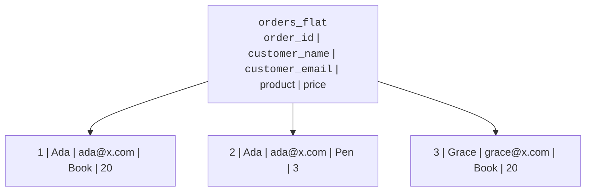
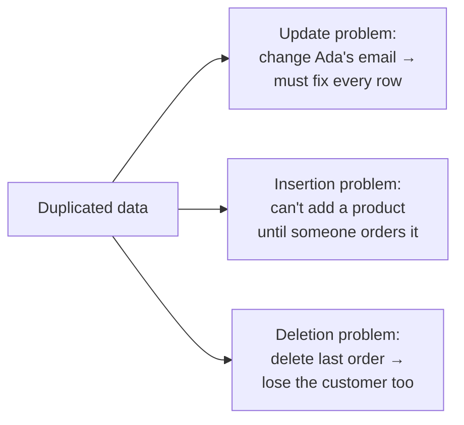
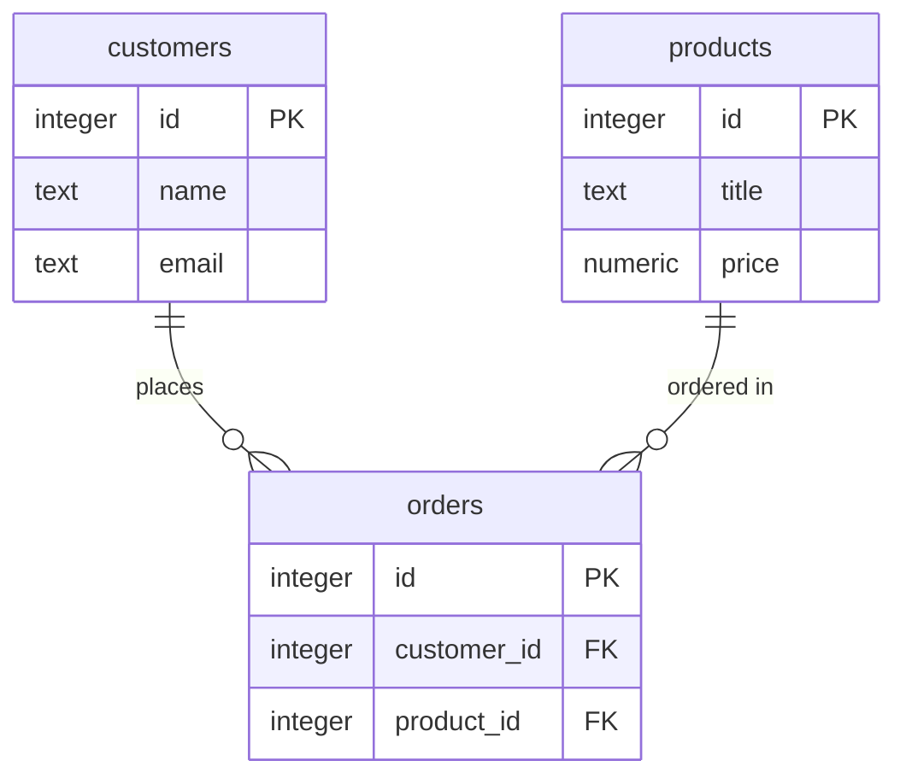
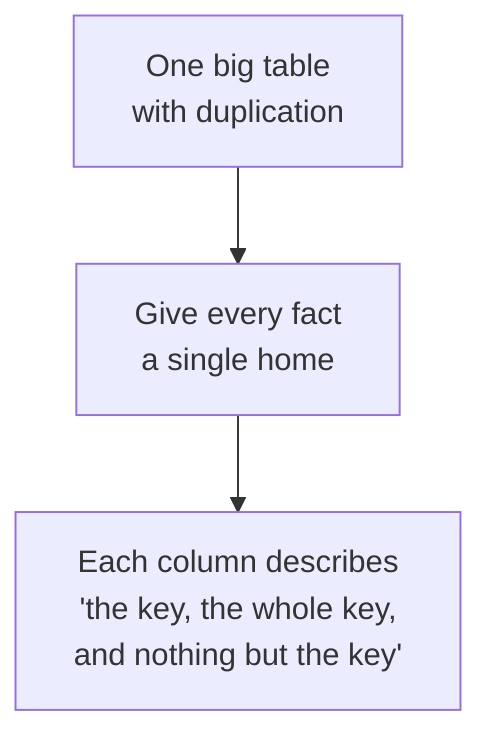

When beginners first meet databases, the instinct is to put
*everything in one big table*. **Organizing data well** means doing
the opposite: splitting that big table into smaller, related ones so
each fact is stored **once**. This page builds the intuition behind
why that matters, the idea professionals call *normalization*.

<Figure
  slug="lite-data-organization-cutout"
  alt="One bloated grid platform with repeated identical cells beside three small tidy grids linked by short connector arrows"
/>

## The problem: one big table

Imagine tracking orders in a single flat table. Every row repeats
the customer's name and email, and even the product's price:

Look at the repetition. "Ada / ada@x.com" appears twice; "Book / 20"
appears twice. This duplication causes three classic problems.

<Figure
  slug="lite-data-organization-inline-cutout"
  alt="Loose records on a bench being filed into three labelled drawers, one kind per drawer"
/>

## The three problems duplication causes

- **Update problem:** Ada changes her email. You must update *every*
  row that mentions her, miss one and the data now disagrees with
  itself.
- **Insertion problem:** You want to record a new product's price,
  but the table is about orders, you cannot add the product until
  someone buys it.
- **Deletion problem:** Delete Ada's only order and you also erase
  the only record of who Ada is.

Good organization removes these by giving every fact a single home.

## The fix: split, then link with keys

Pull each independent thing into its own table and **link** them
with keys. Customers become a `customers` table, products a
`products` table, and `orders` keeps only what is true of *that
order* plus foreign keys.

Now Ada's email lives in **one** row of `customers`; the book's
price lives in **one** row of `products`. An order just *points* to
them. Change the email once and every order instantly reflects it,
the problems vanish.

<SqlCodeBlock
  dialect="sqlite"
  title="The organized design in action"
  initSql={`CREATE TABLE customers (
  id    INTEGER PRIMARY KEY,
  name  TEXT,
  email TEXT
);
CREATE TABLE products (
  id    INTEGER PRIMARY KEY,
  title TEXT,
  price NUMERIC
);
CREATE TABLE orders (
  id          INTEGER PRIMARY KEY,
  customer_id INTEGER REFERENCES customers(id),
  product_id  INTEGER REFERENCES products(id)
);
INSERT INTO customers (id, name, email) VALUES
  (1,'Ada','ada@x.com'), (2,'Grace','grace@x.com');
INSERT INTO products (id, title, price) VALUES
  (10,'Book',20), (11,'Pen',3);
INSERT INTO orders (id, customer_id, product_id) VALUES
  (1,1,10), (2,1,11), (3,2,10);`}
  starterCode={`-- The duplicated, readable view is rebuilt on demand with a join:
SELECT
  o.id AS order_id,
  c.name,
  c.email,
  p.title,
  p.price
FROM
  orders o
  JOIN customers c ON c.id = o.customer_id
  JOIN products p ON p.id = o.product_id
ORDER BY
  o.id;`}
/>

The "flat" view people liked is not lost, a join reproduces it any
time. The difference is that it is now *computed* from
single-source-of-truth tables instead of *stored* with duplication.

## A rule of thumb you can actually use

The formal theory has stages called **normal forms**, but you do not
need the definitions yet. One memorable rule captures most of it:

Ask of every column: *"Is this a fact about this row's key, and
nothing else?"* A customer's email is a fact about the **customer**,
so it belongs in `customers`, not repeated on every order. If a
column really describes some *other* thing, that other thing probably
deserves its own table.

<Callout type="warn" title="Organizing is a balance">
More tables mean more joins. Most application databases aim for a
clean split that avoids duplication while staying practical to query.
Deliberately keeping *some* duplication for speed is a real technique
too, but learn the clean form first. You can only break the rules
well once you understand them.
</Callout>

## Check your understanding

<MultipleChoice
  markdown={`What is the main goal of organizing data into multiple related tables?

- [o] To store each fact once, removing the duplication that causes update, insertion, and deletion problems.
  > Giving every fact a single home removes the inconsistencies duplicated data creates.
- To make every query run as fast as possible.
  > Splitting targets correctness and reduced duplication; it can even add joins. Speed is a separate concern.
- To remove all relationships between tables.
  > Good organization relies on relationships (foreign keys) to link the split-out tables.
- To combine many tables into one big table.
  > That is the opposite; combining tables reintroduces duplication.

Splitting data removes duplication so each fact lives in exactly one place.`}
/>

<MultipleChoice
  markdown={`A flat orders table repeats each customer's email on every order row. What problem does this most directly cause?

- The table can store only one customer.
  > A flat table can store many customers; the problem is the repetition, not capacity.
- [o] An update problem: changing the email means updating every row that repeats it, risking inconsistency.
  > With the email duplicated, one missed row leaves the data disagreeing with itself.
- Queries become impossible to write.
  > Queries still work; the issue is keeping the duplicated values consistent.
- Foreign keys stop working.
  > A flat table has no such foreign keys yet; the problem is duplication.

Duplicated values force multi-row updates, the classic update problem.`}
/>

<MultipleChoice
  markdown={`After splitting into \`customers\`, \`products\`, and \`orders\`, how do you reproduce the original flat, all-in-one-row view?

- [o] Join the tables back together on their keys whenever you need the combined view.
  > A join recomputes the flat view from the single-source-of-truth tables.
- Copy the columns back into the orders table.
  > Copying columns back would reintroduce the very duplication you removed.
- Delete the foreign keys.
  > Foreign keys are what make the join possible; removing them would break the link.
- It is permanently lost once you split the tables.
  > The information is preserved; it is simply recombined on demand.

A join rebuilds the combined view from the organized tables without storing duplication.`}
/>

<MultipleChoice
  markdown={`The phrase "the key, the whole key, and nothing but the key" is a reminder that…

- [o] every non-key column should be a fact about that row's key, and nothing else.
  > Each column should describe the key itself; unrelated facts belong in their own table.
- a table may have only one column.
  > Tables can have many columns; the phrase is about what those columns depend on.
- foreign keys are unnecessary.
  > Foreign keys remain essential for linking the split-out tables.
- primary keys must be numbers.
  > Keys need not be numbers; the phrase concerns dependency, not data type.

The phrase captures the goal: non-key columns describe the key, the whole key, and nothing else.`}
/>
