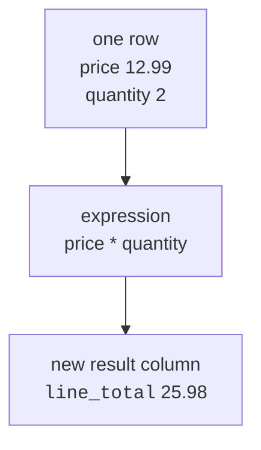
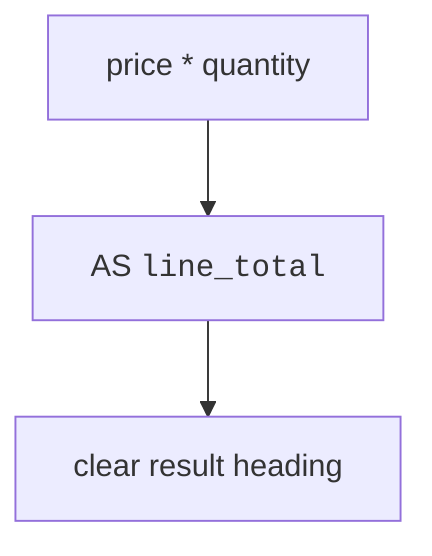

A query can do more than repeat stored values. It can compute new values
as it reads each row.

Those calculations are called **expressions**. An expression might
multiply price by quantity, join two pieces of text, round a number, or
make text uppercase. An **alias** gives the computed result a clear name.

<Figure
  slug="lite-expressions-aliases-cutout"
  alt="Two value tiles feeding a small calculating block that emits a new computed tile with a blank name plate"
/>

## Expressions create computed columns

Anywhere you can select a column, you can also write a calculation.
SQLite evaluates that calculation for each row in the result.

<Figure
  slug="lite-expressions-and-aliases-expressions-create-computed-inline-cutout"
  alt="Two upright stacks of blocks feeding a small machine that sets a third stack down beside them"
/>

<SqlCodeBlock
  dialect="sqlite"
  title="Calculate a line total"
  initSql={`CREATE TABLE sales (
  id INTEGER PRIMARY KEY,
  item TEXT,
  category TEXT,
  price NUMERIC,
  quantity INTEGER
);
INSERT INTO sales (item, category, price, quantity) VALUES
  ('Notebook', 'School', 3.50, 4),
  ('Pencil pack', 'School', 2.25, 6),
  ('Coffee mug', 'Kitchen', 8.00, 2),
  ('Tea towel', 'Kitchen', 5.75, 3);`}
  starterCode={`SELECT
  item,
  price,
  quantity,
  price * quantity AS line_total
FROM
  sales;`}
/>

`line_total` is not stored in the table. SQLite calculates it for the
query result.

## Arithmetic operators

SQLite can use familiar arithmetic operators in expressions.

<Figure
  slug="lite-expressions-and-aliases-arithmetic-operators-inline-cutout"
  alt="A small machine with four differently shaped input slots on its face"
/>

| Operator | Meaning | Example |
| --- | --- | --- |
| `+` | add | `price + 1` |
| `-` | subtract | `price - 1` |
| `*` | multiply | `price * quantity` |
| `/` | divide | `price / 2` |

<SqlCodeBlock
  dialect="sqlite"
  title="Add sales tax"
  initSql={`CREATE TABLE sales (
  id INTEGER PRIMARY KEY,
  item TEXT,
  category TEXT,
  price NUMERIC,
  quantity INTEGER
);
INSERT INTO sales (item, category, price, quantity) VALUES
  ('Notebook', 'School', 3.50, 4),
  ('Pencil pack', 'School', 2.25, 6),
  ('Coffee mug', 'Kitchen', 8.00, 2),
  ('Tea towel', 'Kitchen', 5.75, 3);`}
  starterCode={`SELECT
  item,
  price,
  ROUND(price * 1.08, 2) AS price_with_tax
FROM
  sales;`}
/>

`ROUND(value, 2)` rounds to two decimal places. It is handy for money
examples, though real financial systems need more careful rules.

<MultipleChoice
  markdown={`In the expression price * quantity AS line_total, what does the alias do?

- It saves line_total as a permanent table column.
  > The expression appears only in the query result.
- It changes multiplication into addition.
  > The alias does not change the calculation.
- It filters rows where line_total is missing.
  > Filtering rows is done with WHERE.
- [o] It names the computed result column line_total.
  > An alias gives the output column a readable name.`}
/>

## AS aliases make results readable

Without an alias, a computed column may get a clumsy name based on the
expression. `AS` lets you choose a friendly output name.

<Figure
  slug="lite-expressions-and-aliases-inline-cutout"
  alt="A plain striped strip of blocks leaving a small machine on a bench and having a blank name plate clipped to its leading end"
/>

<SqlCodeBlock
  dialect="sqlite"
  title="Compare output names"
  initSql={`CREATE TABLE sales (
  id INTEGER PRIMARY KEY,
  item TEXT,
  category TEXT,
  price NUMERIC,
  quantity INTEGER
);
INSERT INTO sales (item, category, price, quantity) VALUES
  ('Notebook', 'School', 3.50, 4),
  ('Pencil pack', 'School', 2.25, 6),
  ('Coffee mug', 'Kitchen', 8.00, 2);`}
  starterCode={`SELECT
  item,
  price * quantity,
  price * quantity AS line_total
FROM
  sales;`}
/>

The two computed values are the same. The aliased one is easier to read.
This course uses `AS` because it makes your intent obvious.

## Join text with ||

In SQLite, `||` concatenates text. "Concatenate" means join pieces of
text together.

<SqlCodeBlock
  dialect="sqlite"
  title="Build labels from text"
  initSql={`CREATE TABLE sales (
  id INTEGER PRIMARY KEY,
  item TEXT,
  category TEXT,
  price NUMERIC,
  quantity INTEGER
);
INSERT INTO sales (item, category, price, quantity) VALUES
  ('Notebook', 'School', 3.50, 4),
  ('Pencil pack', 'School', 2.25, 6),
  ('Coffee mug', 'Kitchen', 8.00, 2),
  ('Tea towel', 'Kitchen', 5.75, 3);`}
  starterCode={`SELECT
  item,
  category || ': ' || item AS shelf_label
FROM
  sales;`}
/>

The expression joins the category, a colon and space, and the item name.

## Common SQLite functions

A function takes input and returns a value. SQLite includes many useful
built-in functions. Here are beginner-friendly ones:

| Function | Example | What it does |
| --- | --- | --- |
| `ROUND(number, places)` | `ROUND(3.14159, 2)` | rounds a number |
| `LENGTH(text)` | `LENGTH('cat')` | counts characters |
| `UPPER(text)` | `UPPER('cat')` | makes text uppercase |
| `LOWER(text)` | `LOWER('CAT')` | makes text lowercase |
| `substr(text, start, count)` | `substr('SQLite', 1, 3)` | returns part of text |

<SqlCodeBlock
  dialect="sqlite"
  title="Text functions"
  initSql={`CREATE TABLE sales (
  id INTEGER PRIMARY KEY,
  item TEXT,
  category TEXT,
  price NUMERIC,
  quantity INTEGER
);
INSERT INTO sales (item, category, price, quantity) VALUES
  ('Notebook', 'School', 3.50, 4),
  ('Pencil pack', 'School', 2.25, 6),
  ('Coffee mug', 'Kitchen', 8.00, 2),
  ('Tea towel', 'Kitchen', 5.75, 3);`}
  starterCode={`SELECT
  item,
  UPPER(item) AS item_upper,
  LOWER(category) AS category_lower,
  LENGTH(item) AS character_count
FROM
  sales;`}
/>

<SqlCodeBlock
  dialect="sqlite"
  title="Take part of a text value"
  initSql={`CREATE TABLE sales (
  id INTEGER PRIMARY KEY,
  item TEXT,
  category TEXT,
  price NUMERIC,
  quantity INTEGER
);
INSERT INTO sales (item, category, price, quantity) VALUES
  ('Notebook', 'School', 3.50, 4),
  ('Pencil pack', 'School', 2.25, 6),
  ('Coffee mug', 'Kitchen', 8.00, 2),
  ('Tea towel', 'Kitchen', 5.75, 3);`}
  starterCode={`SELECT
  item,
  substr(item, 1, 4) AS first_four_characters
FROM
  sales;`}
/>

SQLite's `substr` starts counting at 1. So `substr(item, 1, 4)` returns
the first four characters.

## Expressions work in ORDER BY and WHERE

You can compute a value to filter rows, sort rows, or both.

<SqlCodeBlock
  dialect="sqlite"
  title="Filter and sort by a computed value"
  initSql={`CREATE TABLE sales (
  id INTEGER PRIMARY KEY,
  item TEXT,
  category TEXT,
  price NUMERIC,
  quantity INTEGER
);
INSERT INTO sales (item, category, price, quantity) VALUES
  ('Notebook', 'School', 3.50, 4),
  ('Pencil pack', 'School', 2.25, 6),
  ('Coffee mug', 'Kitchen', 8.00, 2),
  ('Tea towel', 'Kitchen', 5.75, 3);`}
  starterCode={`SELECT
  item,
  price * quantity AS line_total
FROM
  sales
WHERE
  price * quantity > 15
ORDER BY
  price * quantity DESC;`}
/>

The expression `price * quantity` is calculated for each row. SQLite can
use that calculation to decide which rows pass and where they appear in
the sorted result.

## Check your understanding

<MultipleChoice
  markdown={`What is a computed column in a SELECT result?

- A value that must already be stored in the table.
  > Stored columns can be selected, but computed columns are calculated by the query.
- A filter that removes rows.
  > Filtering rows is the role of WHERE.
- [o] A value calculated by an expression for each row.
  > Expressions such as price times quantity create new result values.
- A column that always changes the table structure.
  > A SELECT expression does not alter the table.`}
/>

<MultipleChoice
  markdown={`What does the SQLite operator || do with text?

- Divides one text value by another.
  > Division uses the slash operator with numbers.
- [o] Joins text values into one longer text value.
  > The || operator concatenates strings in SQLite.
- Compares two values for equality.
  > Equality uses the equals sign.
- Selects every column.
  > The asterisk selects every column.`}
/>

<MultipleChoice
  markdown={`Which function would you use to count the characters in a text value?

- substr
  > substr returns part of a text value.
- ROUND
  > ROUND changes a number, not text length.
- UPPER
  > UPPER changes letters to uppercase.
- [o] LENGTH
  > LENGTH returns the number of characters in a text value.`}
/>

<MultipleChoice
  markdown={`Why use AS total_price after an expression?

- [o] To give the result column a clear name.
  > AS creates a readable heading for the output column.
- To permanently rename a table column.
  > Aliases apply only to the query result.
- To force the result to sort by that column.
  > Sorting requires ORDER BY.
- To make SQLite store the expression for later automatically.
  > A normal SELECT expression is calculated only for the result.`}
/>
