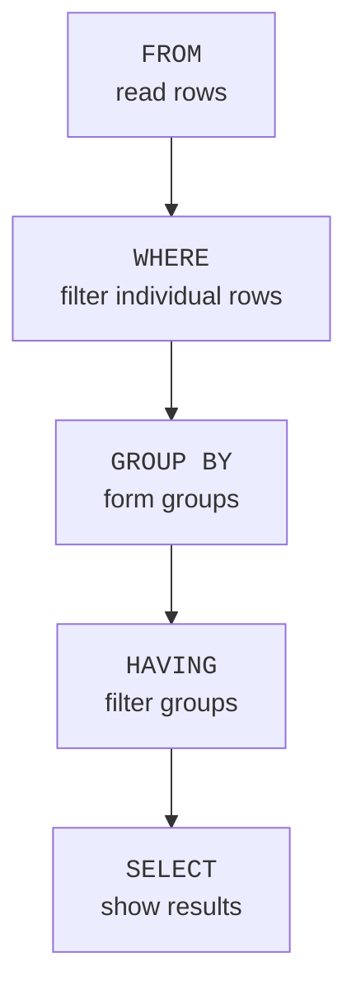
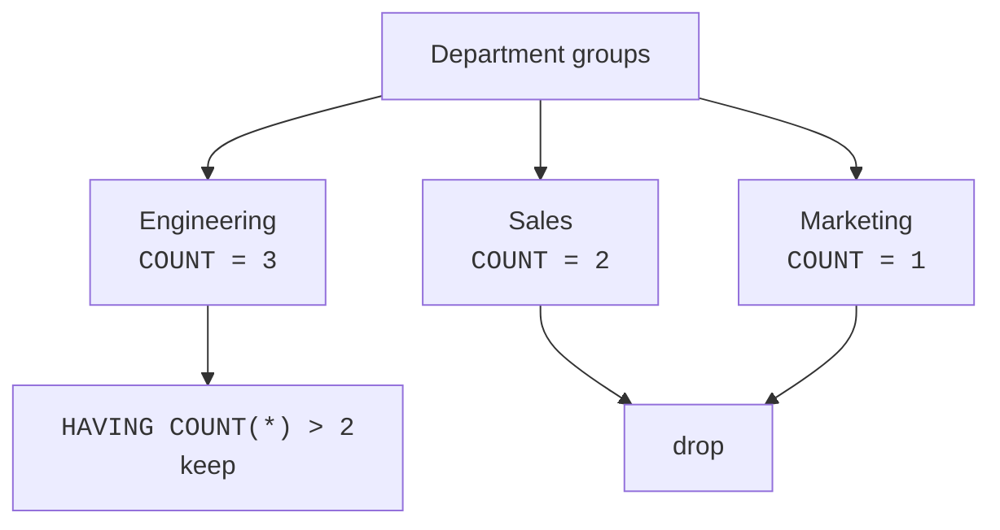

`GROUP BY` lets you create one summary row per group. The next question is: how do you keep only the groups whose summary meets a condition?

For example:

- Departments with more than 2 employees
- Products with total sales over 100
- Customers whose average order is at least 25

These are not row-by-row conditions. They are conditions about **groups after aggregation**. That is what `HAVING` is for.

<Figure
  slug="lite-having-cutout"
  alt="Two sequential gates on a platform, the first screening single tiles and the second screening assembled summary blocks"
/>

## WHERE filters rows before groups exist

`WHERE` runs before grouping. At that moment, there are only individual rows. There are no group totals yet, so `WHERE COUNT(*) > 2` does not make sense.

<Figure
  slug="lite-filtering-groups-inline-cutout"
  alt="Three summary blocks on their trays, one tray lifted away because its block falls short of a marked line"
/>



Think of it like making piles of receipts:

1. `WHERE` decides which receipts are allowed into the piles.
2. `GROUP BY` makes the piles.
3. Aggregates like `COUNT` and `SUM` summarize each pile.
4. `HAVING` decides which completed piles stay in the result.

## HAVING filters groups

`HAVING` runs after `GROUP BY`, so it can use aggregate functions such as `COUNT(*)`, `SUM(amount)`, and `AVG(salary)`.

<SqlCodeBlock
  dialect="sqlite"
  title="Departments with more than two employees"
  initSql={`CREATE TABLE employees (
  id INTEGER PRIMARY KEY,
  name TEXT,
  dept TEXT
);
INSERT INTO employees (name, dept) VALUES
  ('Alice', 'Engineering'),
  ('Bob', 'Engineering'),
  ('Cara', 'Engineering'),
  ('Dave', 'Sales'),
  ('Eve', 'Sales'),
  ('Finn', 'Marketing');`}
  starterCode={`SELECT
  dept,
  COUNT(*) AS headcount
FROM
  employees
GROUP BY
  dept
HAVING
  COUNT(*) > 2
ORDER BY
  headcount DESC;`}
/>

Only Engineering survives because it has 3 employees. Sales has 2 and Marketing has 1, so those groups are filtered out.



<MultipleChoice
  markdown={`What does \`HAVING COUNT(*) > 2\` filter?

- The order of rows in the final result.
  > \`ORDER BY\` controls result order.
- Individual employee rows before grouping.
  > Individual row filters belong in \`WHERE\`.
- Table columns before the query starts.
  > \`HAVING\` does not change the table structure.
- [o] Completed groups whose row count is greater than 2.
  > \`HAVING\` runs after grouping, so it can keep or drop whole groups.

\`HAVING\` is a filter for grouped summaries.`}
/>

## WHERE and HAVING together

`WHERE` and `HAVING` are not competitors. They do different jobs at different moments.

| Clause | Filters | When it happens | Example |
| --- | --- | --- | --- |
| `WHERE` | individual rows | before grouping | only full-time employees |
| `HAVING` | groups | after aggregation | departments with average salary over 80000 |

Use both when you need both jobs.

<SqlCodeBlock
  dialect="sqlite"
  title="Full-time departments with high average salary"
  initSql={`CREATE TABLE employees (
  id INTEGER PRIMARY KEY,
  name TEXT,
  dept TEXT,
  salary REAL,
  is_intern INTEGER
);
INSERT INTO employees (name, dept, salary, is_intern) VALUES
  ('Alice', 'Engineering', 120000, 0),
  ('Bob', 'Engineering', 100000, 0),
  ('Cara', 'Engineering', 30000, 1),
  ('Dave', 'Sales', 75000, 0),
  ('Eve', 'Sales', 72000, 0),
  ('Finn', 'Marketing', 68000, 0);`}
  starterCode={`SELECT
  dept,
  ROUND(AVG(salary), 0) AS average_salary
FROM
  employees
WHERE
  is_intern = 0
GROUP BY
  dept
HAVING
  AVG(salary) > 80000
ORDER BY
  average_salary DESC;`}
/>

Read it in stages:

1. `WHERE is_intern = 0` keeps only non-intern rows.
2. `GROUP BY dept` makes department groups.
3. `AVG(salary)` calculates each group's average.
4. `HAVING AVG(salary) > 80000` keeps only groups with a high average.

## Filtering by totals

`HAVING` is also common with `SUM`. This query keeps only products whose total sales are at least `30`.

<SqlCodeBlock
  dialect="sqlite"
  title="Products with total sales of at least 30"
  initSql={`CREATE TABLE sales (
  id INTEGER PRIMARY KEY,
  product TEXT,
  amount REAL
);
INSERT INTO sales (product, amount) VALUES
  ('Notebook', 12.00),
  ('Pencil', 3.00),
  ('Notebook', 18.00),
  ('Backpack', 45.00),
  ('Pencil', 2.50),
  ('Notebook', 9.00);`}
  starterCode={`SELECT
  product,
  SUM(amount) AS total_sales
FROM
  sales
GROUP BY
  product
HAVING
  SUM(amount) >= 30
ORDER BY
  total_sales DESC;`}
/>

The `SUM(amount)` value is created per product group, so the condition belongs in `HAVING`.

## Filtering rows first can change group results

Because `WHERE` happens before grouping, it can change the totals that `HAVING` sees.

<SqlCodeBlock
  dialect="sqlite"
  title="Total sales after a row-level filter"
  initSql={`CREATE TABLE sales (
  id INTEGER PRIMARY KEY,
  product TEXT,
  amount REAL,
  channel TEXT
);
INSERT INTO sales (product, amount, channel) VALUES
  ('Notebook', 12.00, 'Online'),
  ('Notebook', 18.00, 'Store'),
  ('Notebook', 9.00, 'Online'),
  ('Backpack', 45.00, 'Store'),
  ('Backpack', 20.00, 'Online'),
  ('Pencil', 3.00, 'Online');`}
  starterCode={`SELECT
  product,
  SUM(amount) AS online_sales
FROM
  sales
WHERE
  channel = 'Online'
GROUP BY
  product
HAVING
  SUM(amount) >= 20
ORDER BY
  online_sales DESC;`}
/>

This query first keeps only online sales rows. Then it groups and totals those online rows. Finally, `HAVING` keeps products with at least `20` in online sales.

<Callout type="info" title="Rule of thumb">
If the condition mentions an aggregate function like `COUNT`, `SUM`, `AVG`, `MIN`, or `MAX`, it usually belongs in `HAVING`. If it checks ordinary row values, it usually belongs in `WHERE`.
</Callout>

## The clause order so far

The written order of a grouped query is fixed:

```sql
SELECT columns_and_aggregates
FROM table_name
WHERE row_condition
GROUP BY group_columns
HAVING group_condition
ORDER BY sort_columns;
```

The logical flow is:

**`FROM` (choose table) → `WHERE` (filter rows) → `GROUP BY` (build groups) → aggregates like `COUNT`, `SUM`, `AVG` → `HAVING` (filter groups) → `SELECT` (choose output) → `ORDER BY` (sort result)**

The most important part for this page is:

> `WHERE` happens before `GROUP BY`; `HAVING` happens after `GROUP BY`.

## HAVING without showing the aggregate condition

The aggregate in `HAVING` does not have to appear in the final output, though showing it is often clearer for beginners.

<SqlCodeBlock
  dialect="sqlite"
  title="Keep active customers but show only their names"
  initSql={`CREATE TABLE orders (
  id INTEGER PRIMARY KEY,
  customer TEXT,
  amount REAL
);
INSERT INTO orders (customer, amount) VALUES
  ('Ada', 24.00),
  ('Ada', 18.00),
  ('Grace', 10.00),
  ('Linus', 12.00),
  ('Linus', 9.00),
  ('Linus', 6.00);`}
  starterCode={`SELECT
  customer
FROM
  orders
GROUP BY
  customer
HAVING
  COUNT(*) >= 2
ORDER BY
  customer;`}
/>

This returns customers who have at least two orders, even though the count is not displayed.

## Check your understanding

<MultipleChoice
  markdown={`Why can't \`WHERE COUNT(*) > 2\` filter groups with more than two rows?

- [o] Because \`WHERE\` runs before groups and counts exist.
  > The row filter stage happens before \`GROUP BY\`, so aggregate results are not available yet.
- Because numbers cannot be compared with \`>\`.
  > Numeric comparisons like \`>\` are common in SQL.
- Because \`WHERE\` can only be used with text columns.
  > \`WHERE\` works with many kinds of row-level conditions.
- Because \`COUNT(*)\` is not allowed in SQLite.
  > \`COUNT(*)\` is a normal SQLite aggregate function.

Aggregate conditions belong in \`HAVING\` because \`HAVING\` runs after aggregation.`}
/>

<MultipleChoice
  markdown={`You want only orders from 2025, then only customers whose total spending is over 100. Where should the conditions go?

- [o] Put the 2025 row filter in \`WHERE\` and the total-spending filter in \`HAVING\`.
  > \`WHERE\` filters individual rows; \`HAVING\` filters grouped totals.
- Put both conditions in \`WHERE\`.
  > Total spending uses \`SUM\`, which is not available during \`WHERE\`.
- Put neither condition in SQL.
  > SQL can express both conditions clearly.
- Put both conditions in \`HAVING\`.
  > The year condition is a row-level filter that should happen before grouping.

Use \`WHERE\` before grouping and \`HAVING\` after grouping.`}
/>

<MultipleChoice
  markdown={`Which condition most clearly belongs in \`HAVING\`?

- \`customer = 'Ada'\`
  > This checks a value on individual rows, so it usually belongs in \`WHERE\`.
- \`order_date = '2025-01-01'\`
  > This is a row-level date condition, so it usually belongs in \`WHERE\`.
- \`channel = 'Online'\`
  > This checks individual sales rows before grouping.
- [o] \`SUM(amount) > 500\`
  > This condition depends on a grouped total, so it belongs after aggregation in \`HAVING\`.

Conditions involving aggregate results usually belong in \`HAVING\`.`}
/>

<MultipleChoice
  markdown={`In the logical query flow, which order is right for these three steps?

- \`GROUP BY\` → \`WHERE\` → \`HAVING\`
  > \`WHERE\` must filter rows before they are grouped.
- [o] \`WHERE\` → \`GROUP BY\` → \`HAVING\`
  > Rows are filtered first, then grouped, then groups are filtered.
- \`WHERE\` → \`HAVING\` → \`GROUP BY\`
  > \`HAVING\` needs groups to exist first.
- \`HAVING\` → \`WHERE\` → \`GROUP BY\`
  > A group filter cannot happen before row filtering and grouping.

Remember the core order: row filter, grouping, group filter.`}
/>
