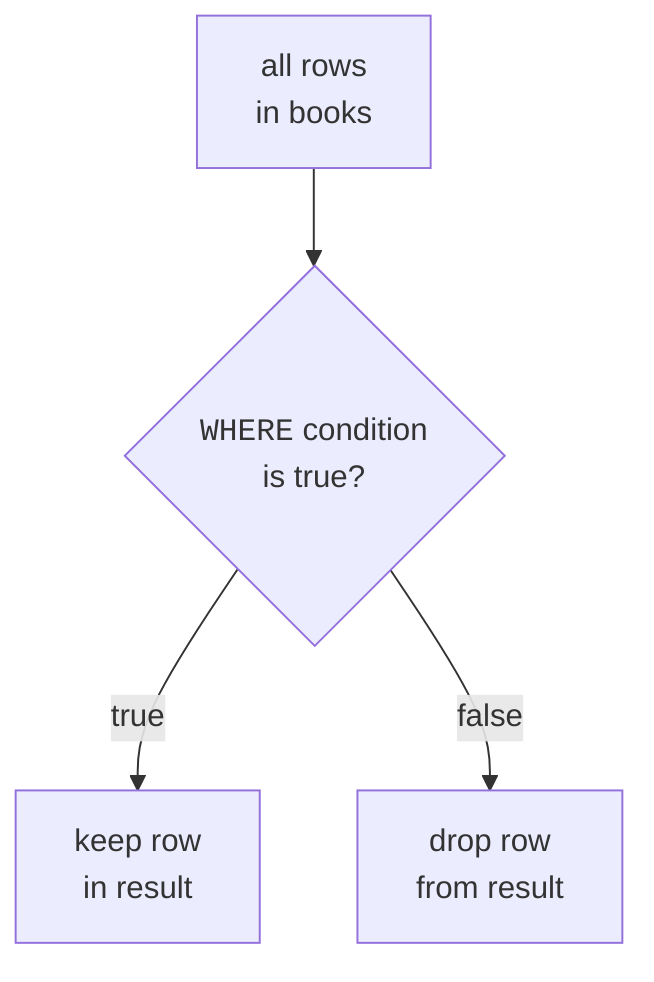
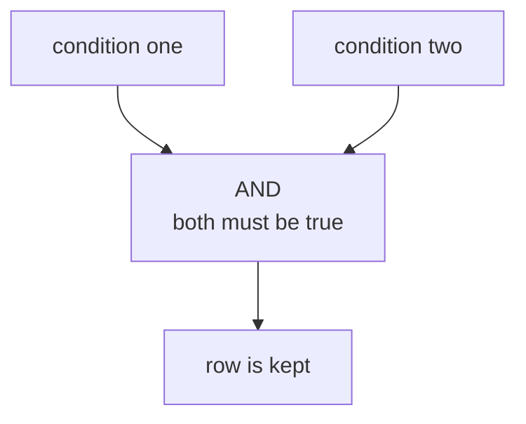

`SELECT` chooses columns. `WHERE` chooses rows.

That difference matters. A table may hold hundreds or millions of rows,
but most questions only need some of them: books under a certain price,
employees in one department, or customers in one city.

<Figure
  slug="lite-filtering-rows-cutout"
  alt="A row of tiles passing a gate on a platform, matching tiles continuing on the track and the rest dropping into a bin"
/>

## WHERE keeps matching rows

A `WHERE` clause is a test that SQLite applies to each row. If the test
is true, the row stays in the result. If the test is false, the row is
left out.

<SyntaxBreakdown
  parts={[
    { text: "SELECT title FROM books" },
    { text: "WHERE" },
    { text: "price", label: "the column to test" },
    { text: "<", label: "the comparison" },
    { text: "10;", label: "what to compare it against" },
  ]}
/>

<Figure
  slug="lite-filtering-rows-inline-cutout"
  alt="A board of rows passing a gate that swings open only for rows carrying a matching notch"
  caption="`WHERE` tests each row on its own and keeps only those that match."
/>

<SqlCodeBlock
  dialect="sqlite"
  title="Keep one genre"
  initSql={`CREATE TABLE books (
  id INTEGER PRIMARY KEY,
  title TEXT,
  author TEXT,
  genre TEXT,
  price NUMERIC,
  pages INTEGER
);
INSERT INTO books (title, author, genre, price, pages) VALUES
  ('The Solar Bakery', 'Mina Park', 'Fiction', 12.99, 240),
  ('Data Garden', 'Owen Lee', 'Technology', 29.50, 410),
  ('Pocket Rivers', 'Lena Ortiz', 'Travel', 16.00, 180),
  ('SQL Street', 'Mina Park', 'Technology', 24.00, 320),
  ('Cloud Recipes', 'Ava Stone', 'Fiction', 18.25, 275),
  ('The Paper Compass', 'Lena Ortiz', 'Travel', 14.50, 210),
  ('Quiet Harbors', 'Ava Stone', 'Fiction', 11.75, 195),
  ('SQL for Gardeners', 'Owen Lee', 'Technology', 34.00, 480),
  ('Marble and Ash', 'Tomas Vega', 'History', 22.40, 365),
  ('The Salt Road', 'Lena Ortiz', 'Travel', 19.99, 288),
  ('Night Market Notes', 'Ava Stone', 'Cooking', 15.60, 200),
  ('Index of Small Birds', 'Mina Park', 'Fiction', 13.40, 168),
  ('Hard Drive Blues', 'Owen Lee', 'Technology', 27.75, 352),
  ('The Copper Atlas', 'Tomas Vega', 'History', 31.20, 445),
  ('Slow Dough', 'Priya Raman', 'Cooking', 9.99, 150),
  ('Ferry to Alder Bay', 'Lena Ortiz', 'Fiction', 17.10, 262),
  ('Query of the Day', 'Owen Lee', 'Technology', 21.35, 298),
  ('Cartography for Cats', 'Tomas Vega', 'Travel', 26.80, 330),
  ('The Winter Larder', 'Priya Raman', 'Cooking', 23.15, 312),
  ('Letters from Harbin', 'Mina Park', 'History', 28.90, 398),
  ('Sugar and Smoke', 'Priya Raman', 'Cooking', 12.25, 176),
  ('The Glass Meridian', 'Ava Stone', 'Fiction', 35.50, 512),
  ('SQL at Midnight', 'Owen Lee', 'Technology', 16.90, 232),
  ('Rain on the Steppe', 'Tomas Vega', 'Travel', 10.40, 158);`}
  starterCode={`SELECT
  title,
  genre,
  price
FROM
  books
WHERE
  genre = 'Technology';`}
/>

The equals sign, `=`, means "is equal to." Text values go in single
quotes.

## Comparison operators

SQLite supports the comparisons beginners use constantly:

| Operator | Means | Example |
| --- | --- | --- |
| `=` | equal to | `genre = 'Fiction'` |
| `<>` or `!=` | not equal to | `genre <> 'Travel'` |
| `<` and `>` | less than, greater than | `price < 20` |
| `<=` and `>=` | at most, at least | `pages >= 300` |
| `BETWEEN a AND b` | from `a` through `b`, inclusive | `price BETWEEN 10 AND 20` |
| `IN (...)` | matches any value in a list | `genre IN ('Fiction', 'Travel')` |
| `LIKE` | matches a text pattern | `title LIKE 'Data%'` |

<SqlCodeBlock
  dialect="sqlite"
  title="Books under 20 dollars"
  initSql={`CREATE TABLE books (
  id INTEGER PRIMARY KEY,
  title TEXT,
  author TEXT,
  genre TEXT,
  price NUMERIC,
  pages INTEGER
);
INSERT INTO books (title, author, genre, price, pages) VALUES
  ('The Solar Bakery', 'Mina Park', 'Fiction', 12.99, 240),
  ('Data Garden', 'Owen Lee', 'Technology', 29.50, 410),
  ('Pocket Rivers', 'Lena Ortiz', 'Travel', 16.00, 180),
  ('SQL Street', 'Mina Park', 'Technology', 24.00, 320),
  ('Cloud Recipes', 'Ava Stone', 'Fiction', 18.25, 275),
  ('The Paper Compass', 'Lena Ortiz', 'Travel', 14.50, 210),
  ('Quiet Harbors', 'Ava Stone', 'Fiction', 11.75, 195),
  ('SQL for Gardeners', 'Owen Lee', 'Technology', 34.00, 480),
  ('Marble and Ash', 'Tomas Vega', 'History', 22.40, 365),
  ('The Salt Road', 'Lena Ortiz', 'Travel', 19.99, 288),
  ('Night Market Notes', 'Ava Stone', 'Cooking', 15.60, 200),
  ('Index of Small Birds', 'Mina Park', 'Fiction', 13.40, 168),
  ('Hard Drive Blues', 'Owen Lee', 'Technology', 27.75, 352),
  ('The Copper Atlas', 'Tomas Vega', 'History', 31.20, 445),
  ('Slow Dough', 'Priya Raman', 'Cooking', 9.99, 150),
  ('Ferry to Alder Bay', 'Lena Ortiz', 'Fiction', 17.10, 262),
  ('Query of the Day', 'Owen Lee', 'Technology', 21.35, 298),
  ('Cartography for Cats', 'Tomas Vega', 'Travel', 26.80, 330),
  ('The Winter Larder', 'Priya Raman', 'Cooking', 23.15, 312),
  ('Letters from Harbin', 'Mina Park', 'History', 28.90, 398),
  ('Sugar and Smoke', 'Priya Raman', 'Cooking', 12.25, 176),
  ('The Glass Meridian', 'Ava Stone', 'Fiction', 35.50, 512),
  ('SQL at Midnight', 'Owen Lee', 'Technology', 16.90, 232),
  ('Rain on the Steppe', 'Tomas Vega', 'Travel', 10.40, 158);`}
  starterCode={`SELECT
  title,
  price
FROM
  books
WHERE
  price < 20;`}
/>

Thirteen of the 24 books come back. `BETWEEN` handles the other common
shape, a range with two ends, in one clause instead of two:

<SqlCodeBlock
  dialect="sqlite"
  title="A page range with BETWEEN"
  initSql={`CREATE TABLE books (
  id INTEGER PRIMARY KEY,
  title TEXT,
  author TEXT,
  genre TEXT,
  price NUMERIC,
  pages INTEGER
);
INSERT INTO books (title, author, genre, price, pages) VALUES
  ('The Solar Bakery', 'Mina Park', 'Fiction', 12.99, 240),
  ('Data Garden', 'Owen Lee', 'Technology', 29.50, 410),
  ('Pocket Rivers', 'Lena Ortiz', 'Travel', 16.00, 180),
  ('SQL Street', 'Mina Park', 'Technology', 24.00, 320),
  ('Cloud Recipes', 'Ava Stone', 'Fiction', 18.25, 275),
  ('The Paper Compass', 'Lena Ortiz', 'Travel', 14.50, 210),
  ('Quiet Harbors', 'Ava Stone', 'Fiction', 11.75, 195),
  ('SQL for Gardeners', 'Owen Lee', 'Technology', 34.00, 480),
  ('Marble and Ash', 'Tomas Vega', 'History', 22.40, 365),
  ('The Salt Road', 'Lena Ortiz', 'Travel', 19.99, 288),
  ('Night Market Notes', 'Ava Stone', 'Cooking', 15.60, 200),
  ('Index of Small Birds', 'Mina Park', 'Fiction', 13.40, 168),
  ('Hard Drive Blues', 'Owen Lee', 'Technology', 27.75, 352),
  ('The Copper Atlas', 'Tomas Vega', 'History', 31.20, 445),
  ('Slow Dough', 'Priya Raman', 'Cooking', 9.99, 150),
  ('Ferry to Alder Bay', 'Lena Ortiz', 'Fiction', 17.10, 262),
  ('Query of the Day', 'Owen Lee', 'Technology', 21.35, 298),
  ('Cartography for Cats', 'Tomas Vega', 'Travel', 26.80, 330),
  ('The Winter Larder', 'Priya Raman', 'Cooking', 23.15, 312),
  ('Letters from Harbin', 'Mina Park', 'History', 28.90, 398),
  ('Sugar and Smoke', 'Priya Raman', 'Cooking', 12.25, 176),
  ('The Glass Meridian', 'Ava Stone', 'Fiction', 35.50, 512),
  ('SQL at Midnight', 'Owen Lee', 'Technology', 16.90, 232),
  ('Rain on the Steppe', 'Tomas Vega', 'Travel', 10.40, 158);`}
  starterCode={`SELECT
  title,
  pages
FROM
  books
WHERE
  pages BETWEEN 200 AND 320;`}
/>

`BETWEEN` includes both ends of the range. In the example, 200 and 320
would both count as matches.

<Figure
  slug="lite-filtering-rows-where-keeps-matching-inline-cutout"
  alt="Rows passing a checkpoint with a template held to each, non-matching rows turned aside"
  caption="Every row is checked against the same condition, and the rest are set aside."
/>

<MultipleChoice
  markdown={`Which clause keeps only rows that pass a test?

- ORDER BY
  > ORDER BY changes row order after rows have been chosen.
- SELECT
  > SELECT chooses which columns appear.
- LIMIT
  > LIMIT trims how many rows are returned.
- [o] WHERE
  > WHERE applies a condition to each row and keeps only true matches.`}
/>

## Combine conditions with AND, OR, and NOT

Real questions often have more than one part.

- `AND` means both conditions must be true.
- `OR` means at least one condition must be true.
- `NOT` flips a condition.

<SqlCodeBlock
  dialect="sqlite"
  title="Technology books under 30 dollars"
  initSql={`CREATE TABLE books (
  id INTEGER PRIMARY KEY,
  title TEXT,
  author TEXT,
  genre TEXT,
  price NUMERIC,
  pages INTEGER
);
INSERT INTO books (title, author, genre, price, pages) VALUES
  ('The Solar Bakery', 'Mina Park', 'Fiction', 12.99, 240),
  ('Data Garden', 'Owen Lee', 'Technology', 29.50, 410),
  ('Pocket Rivers', 'Lena Ortiz', 'Travel', 16.00, 180),
  ('SQL Street', 'Mina Park', 'Technology', 24.00, 320),
  ('Cloud Recipes', 'Ava Stone', 'Fiction', 18.25, 275),
  ('The Paper Compass', 'Lena Ortiz', 'Travel', 14.50, 210),
  ('Quiet Harbors', 'Ava Stone', 'Fiction', 11.75, 195),
  ('SQL for Gardeners', 'Owen Lee', 'Technology', 34.00, 480),
  ('Marble and Ash', 'Tomas Vega', 'History', 22.40, 365),
  ('The Salt Road', 'Lena Ortiz', 'Travel', 19.99, 288),
  ('Night Market Notes', 'Ava Stone', 'Cooking', 15.60, 200),
  ('Index of Small Birds', 'Mina Park', 'Fiction', 13.40, 168),
  ('Hard Drive Blues', 'Owen Lee', 'Technology', 27.75, 352),
  ('The Copper Atlas', 'Tomas Vega', 'History', 31.20, 445),
  ('Slow Dough', 'Priya Raman', 'Cooking', 9.99, 150),
  ('Ferry to Alder Bay', 'Lena Ortiz', 'Fiction', 17.10, 262),
  ('Query of the Day', 'Owen Lee', 'Technology', 21.35, 298),
  ('Cartography for Cats', 'Tomas Vega', 'Travel', 26.80, 330),
  ('The Winter Larder', 'Priya Raman', 'Cooking', 23.15, 312),
  ('Letters from Harbin', 'Mina Park', 'History', 28.90, 398),
  ('Sugar and Smoke', 'Priya Raman', 'Cooking', 12.25, 176),
  ('The Glass Meridian', 'Ava Stone', 'Fiction', 35.50, 512),
  ('SQL at Midnight', 'Owen Lee', 'Technology', 16.90, 232),
  ('Rain on the Steppe', 'Tomas Vega', 'Travel', 10.40, 158);`}
  starterCode={`SELECT
  title,
  genre,
  price
FROM
  books
WHERE
  genre = 'Technology'
  AND price < 30;`}
/>

`AND` narrows: each condition you add can only remove rows. `OR`
widens, and a row needs to satisfy just one side to be kept:

<SqlCodeBlock
  dialect="sqlite"
  title="Fiction or travel books"
  initSql={`CREATE TABLE books (
  id INTEGER PRIMARY KEY,
  title TEXT,
  author TEXT,
  genre TEXT,
  price NUMERIC,
  pages INTEGER
);
INSERT INTO books (title, author, genre, price, pages) VALUES
  ('The Solar Bakery', 'Mina Park', 'Fiction', 12.99, 240),
  ('Data Garden', 'Owen Lee', 'Technology', 29.50, 410),
  ('Pocket Rivers', 'Lena Ortiz', 'Travel', 16.00, 180),
  ('SQL Street', 'Mina Park', 'Technology', 24.00, 320),
  ('Cloud Recipes', 'Ava Stone', 'Fiction', 18.25, 275),
  ('The Paper Compass', 'Lena Ortiz', 'Travel', 14.50, 210),
  ('Quiet Harbors', 'Ava Stone', 'Fiction', 11.75, 195),
  ('SQL for Gardeners', 'Owen Lee', 'Technology', 34.00, 480),
  ('Marble and Ash', 'Tomas Vega', 'History', 22.40, 365),
  ('The Salt Road', 'Lena Ortiz', 'Travel', 19.99, 288),
  ('Night Market Notes', 'Ava Stone', 'Cooking', 15.60, 200),
  ('Index of Small Birds', 'Mina Park', 'Fiction', 13.40, 168),
  ('Hard Drive Blues', 'Owen Lee', 'Technology', 27.75, 352),
  ('The Copper Atlas', 'Tomas Vega', 'History', 31.20, 445),
  ('Slow Dough', 'Priya Raman', 'Cooking', 9.99, 150),
  ('Ferry to Alder Bay', 'Lena Ortiz', 'Fiction', 17.10, 262),
  ('Query of the Day', 'Owen Lee', 'Technology', 21.35, 298),
  ('Cartography for Cats', 'Tomas Vega', 'Travel', 26.80, 330),
  ('The Winter Larder', 'Priya Raman', 'Cooking', 23.15, 312),
  ('Letters from Harbin', 'Mina Park', 'History', 28.90, 398),
  ('Sugar and Smoke', 'Priya Raman', 'Cooking', 12.25, 176),
  ('The Glass Meridian', 'Ava Stone', 'Fiction', 35.50, 512),
  ('SQL at Midnight', 'Owen Lee', 'Technology', 16.90, 232),
  ('Rain on the Steppe', 'Tomas Vega', 'Travel', 10.40, 158);`}
  starterCode={`SELECT
  title,
  genre
FROM
  books
WHERE
  genre = 'Fiction'
  OR genre = 'Travel';`}
/>

When you mix `AND` and `OR`, use parentheses so your meaning is clear.

<SqlCodeBlock
  dialect="sqlite"
  title="Use parentheses for mixed logic"
  initSql={`CREATE TABLE books (
  id INTEGER PRIMARY KEY,
  title TEXT,
  author TEXT,
  genre TEXT,
  price NUMERIC,
  pages INTEGER
);
INSERT INTO books (title, author, genre, price, pages) VALUES
  ('The Solar Bakery', 'Mina Park', 'Fiction', 12.99, 240),
  ('Data Garden', 'Owen Lee', 'Technology', 29.50, 410),
  ('Pocket Rivers', 'Lena Ortiz', 'Travel', 16.00, 180),
  ('SQL Street', 'Mina Park', 'Technology', 24.00, 320),
  ('Cloud Recipes', 'Ava Stone', 'Fiction', 18.25, 275),
  ('The Paper Compass', 'Lena Ortiz', 'Travel', 14.50, 210),
  ('Quiet Harbors', 'Ava Stone', 'Fiction', 11.75, 195),
  ('SQL for Gardeners', 'Owen Lee', 'Technology', 34.00, 480),
  ('Marble and Ash', 'Tomas Vega', 'History', 22.40, 365),
  ('The Salt Road', 'Lena Ortiz', 'Travel', 19.99, 288),
  ('Night Market Notes', 'Ava Stone', 'Cooking', 15.60, 200),
  ('Index of Small Birds', 'Mina Park', 'Fiction', 13.40, 168),
  ('Hard Drive Blues', 'Owen Lee', 'Technology', 27.75, 352),
  ('The Copper Atlas', 'Tomas Vega', 'History', 31.20, 445),
  ('Slow Dough', 'Priya Raman', 'Cooking', 9.99, 150),
  ('Ferry to Alder Bay', 'Lena Ortiz', 'Fiction', 17.10, 262),
  ('Query of the Day', 'Owen Lee', 'Technology', 21.35, 298),
  ('Cartography for Cats', 'Tomas Vega', 'Travel', 26.80, 330),
  ('The Winter Larder', 'Priya Raman', 'Cooking', 23.15, 312),
  ('Letters from Harbin', 'Mina Park', 'History', 28.90, 398),
  ('Sugar and Smoke', 'Priya Raman', 'Cooking', 12.25, 176),
  ('The Glass Meridian', 'Ava Stone', 'Fiction', 35.50, 512),
  ('SQL at Midnight', 'Owen Lee', 'Technology', 16.90, 232),
  ('Rain on the Steppe', 'Tomas Vega', 'Travel', 10.40, 158);`}
  starterCode={`SELECT
  title,
  genre,
  price
FROM
  books
WHERE
  price < 20
  AND (
    genre = 'Fiction'
    OR genre = 'Travel'
  );`}
/>

## IN is a shorter OR list

`IN` checks whether a value is one of several choices. It is often much
cleaner than writing many `OR` conditions.

<SqlCodeBlock
  dialect="sqlite"
  title="Match several genres with IN"
  initSql={`CREATE TABLE books (
  id INTEGER PRIMARY KEY,
  title TEXT,
  author TEXT,
  genre TEXT,
  price NUMERIC,
  pages INTEGER
);
INSERT INTO books (title, author, genre, price, pages) VALUES
  ('The Solar Bakery', 'Mina Park', 'Fiction', 12.99, 240),
  ('Data Garden', 'Owen Lee', 'Technology', 29.50, 410),
  ('Pocket Rivers', 'Lena Ortiz', 'Travel', 16.00, 180),
  ('SQL Street', 'Mina Park', 'Technology', 24.00, 320),
  ('Cloud Recipes', 'Ava Stone', 'Fiction', 18.25, 275),
  ('The Paper Compass', 'Lena Ortiz', 'Travel', 14.50, 210),
  ('Quiet Harbors', 'Ava Stone', 'Fiction', 11.75, 195),
  ('SQL for Gardeners', 'Owen Lee', 'Technology', 34.00, 480),
  ('Marble and Ash', 'Tomas Vega', 'History', 22.40, 365),
  ('The Salt Road', 'Lena Ortiz', 'Travel', 19.99, 288),
  ('Night Market Notes', 'Ava Stone', 'Cooking', 15.60, 200),
  ('Index of Small Birds', 'Mina Park', 'Fiction', 13.40, 168),
  ('Hard Drive Blues', 'Owen Lee', 'Technology', 27.75, 352),
  ('The Copper Atlas', 'Tomas Vega', 'History', 31.20, 445),
  ('Slow Dough', 'Priya Raman', 'Cooking', 9.99, 150),
  ('Ferry to Alder Bay', 'Lena Ortiz', 'Fiction', 17.10, 262),
  ('Query of the Day', 'Owen Lee', 'Technology', 21.35, 298),
  ('Cartography for Cats', 'Tomas Vega', 'Travel', 26.80, 330),
  ('The Winter Larder', 'Priya Raman', 'Cooking', 23.15, 312),
  ('Letters from Harbin', 'Mina Park', 'History', 28.90, 398),
  ('Sugar and Smoke', 'Priya Raman', 'Cooking', 12.25, 176),
  ('The Glass Meridian', 'Ava Stone', 'Fiction', 35.50, 512),
  ('SQL at Midnight', 'Owen Lee', 'Technology', 16.90, 232),
  ('Rain on the Steppe', 'Tomas Vega', 'Travel', 10.40, 158);`}
  starterCode={`SELECT
  title,
  genre
FROM
  books
WHERE
  genre IN ('Fiction', 'Travel');`}
/>

## LIKE finds text patterns

`LIKE` compares text to a pattern.

- `%` means any number of characters, including none.
- `_` means exactly one character.

In SQLite, `LIKE` is case-insensitive for ordinary ASCII letters by
default. That means `'sql%'` can match `SQL Street`.

<SyntaxBreakdown
  parts={[
    { text: "WHERE" },
    { text: "title", label: "the text column to test" },
    { text: "LIKE" },
    { text: "'sql%'", label: "the pattern, where % is any run of characters" },
  ]}
/>

<SqlCodeBlock
  dialect="sqlite"
  title="Titles that start with SQL"
  initSql={`CREATE TABLE books (
  id INTEGER PRIMARY KEY,
  title TEXT,
  author TEXT,
  genre TEXT,
  price NUMERIC,
  pages INTEGER
);
INSERT INTO books (title, author, genre, price, pages) VALUES
  ('The Solar Bakery', 'Mina Park', 'Fiction', 12.99, 240),
  ('Data Garden', 'Owen Lee', 'Technology', 29.50, 410),
  ('Pocket Rivers', 'Lena Ortiz', 'Travel', 16.00, 180),
  ('SQL Street', 'Mina Park', 'Technology', 24.00, 320),
  ('Cloud Recipes', 'Ava Stone', 'Fiction', 18.25, 275),
  ('The Paper Compass', 'Lena Ortiz', 'Travel', 14.50, 210),
  ('Quiet Harbors', 'Ava Stone', 'Fiction', 11.75, 195),
  ('SQL for Gardeners', 'Owen Lee', 'Technology', 34.00, 480),
  ('Marble and Ash', 'Tomas Vega', 'History', 22.40, 365),
  ('The Salt Road', 'Lena Ortiz', 'Travel', 19.99, 288),
  ('Night Market Notes', 'Ava Stone', 'Cooking', 15.60, 200),
  ('Index of Small Birds', 'Mina Park', 'Fiction', 13.40, 168),
  ('Hard Drive Blues', 'Owen Lee', 'Technology', 27.75, 352),
  ('The Copper Atlas', 'Tomas Vega', 'History', 31.20, 445),
  ('Slow Dough', 'Priya Raman', 'Cooking', 9.99, 150),
  ('Ferry to Alder Bay', 'Lena Ortiz', 'Fiction', 17.10, 262),
  ('Query of the Day', 'Owen Lee', 'Technology', 21.35, 298),
  ('Cartography for Cats', 'Tomas Vega', 'Travel', 26.80, 330),
  ('The Winter Larder', 'Priya Raman', 'Cooking', 23.15, 312),
  ('Letters from Harbin', 'Mina Park', 'History', 28.90, 398),
  ('Sugar and Smoke', 'Priya Raman', 'Cooking', 12.25, 176),
  ('The Glass Meridian', 'Ava Stone', 'Fiction', 35.50, 512),
  ('SQL at Midnight', 'Owen Lee', 'Technology', 16.90, 232),
  ('Rain on the Steppe', 'Tomas Vega', 'Travel', 10.40, 158);`}
  starterCode={`SELECT
  title
FROM
  books
WHERE
  title LIKE 'sql%';`}
/>

Three titles match. Put the `%` at both ends instead and the pattern
finds the fragment anywhere in the text, which is the closest thing SQL
has to a plain search box:

<SqlCodeBlock
  dialect="sqlite"
  title="Titles containing the letter sequence ar"
  initSql={`CREATE TABLE books (
  id INTEGER PRIMARY KEY,
  title TEXT,
  author TEXT,
  genre TEXT,
  price NUMERIC,
  pages INTEGER
);
INSERT INTO books (title, author, genre, price, pages) VALUES
  ('The Solar Bakery', 'Mina Park', 'Fiction', 12.99, 240),
  ('Data Garden', 'Owen Lee', 'Technology', 29.50, 410),
  ('Pocket Rivers', 'Lena Ortiz', 'Travel', 16.00, 180),
  ('SQL Street', 'Mina Park', 'Technology', 24.00, 320),
  ('Cloud Recipes', 'Ava Stone', 'Fiction', 18.25, 275),
  ('The Paper Compass', 'Lena Ortiz', 'Travel', 14.50, 210),
  ('Quiet Harbors', 'Ava Stone', 'Fiction', 11.75, 195),
  ('SQL for Gardeners', 'Owen Lee', 'Technology', 34.00, 480),
  ('Marble and Ash', 'Tomas Vega', 'History', 22.40, 365),
  ('The Salt Road', 'Lena Ortiz', 'Travel', 19.99, 288),
  ('Night Market Notes', 'Ava Stone', 'Cooking', 15.60, 200),
  ('Index of Small Birds', 'Mina Park', 'Fiction', 13.40, 168),
  ('Hard Drive Blues', 'Owen Lee', 'Technology', 27.75, 352),
  ('The Copper Atlas', 'Tomas Vega', 'History', 31.20, 445),
  ('Slow Dough', 'Priya Raman', 'Cooking', 9.99, 150),
  ('Ferry to Alder Bay', 'Lena Ortiz', 'Fiction', 17.10, 262),
  ('Query of the Day', 'Owen Lee', 'Technology', 21.35, 298),
  ('Cartography for Cats', 'Tomas Vega', 'Travel', 26.80, 330),
  ('The Winter Larder', 'Priya Raman', 'Cooking', 23.15, 312),
  ('Letters from Harbin', 'Mina Park', 'History', 28.90, 398),
  ('Sugar and Smoke', 'Priya Raman', 'Cooking', 12.25, 176),
  ('The Glass Meridian', 'Ava Stone', 'Fiction', 35.50, 512),
  ('SQL at Midnight', 'Owen Lee', 'Technology', 16.90, 232),
  ('Rain on the Steppe', 'Tomas Vega', 'Travel', 10.40, 158);`}
  starterCode={`SELECT
  title
FROM
  books
WHERE
  title LIKE '%ar%';`}
/>

## Practice challenge

You have seen every tool this challenge needs: `WHERE`, `AND`, and
a comparison. The table is already loaded, you only write the
query.

<SqlChallengeCard
  dialect="sqlite"
  title="Affordable fiction"
  instructions={`The \`books\` table is preloaded with 24 books. Return the \`title\` and \`price\` columns (in that order) for books whose \`genre\` is \`'Fiction'\` **and** whose \`price\` is under \`20\`. Sort the result by \`price\` ascending. Five books should match.`}
  initSql={`CREATE TABLE books (
  id INTEGER PRIMARY KEY,
  title TEXT,
  author TEXT,
  genre TEXT,
  price NUMERIC,
  pages INTEGER
);
INSERT INTO books (title, author, genre, price, pages) VALUES
  ('The Solar Bakery', 'Mina Park', 'Fiction', 12.99, 240),
  ('Data Garden', 'Owen Lee', 'Technology', 29.50, 410),
  ('Pocket Rivers', 'Lena Ortiz', 'Travel', 16.00, 180),
  ('SQL Street', 'Mina Park', 'Technology', 24.00, 320),
  ('Cloud Recipes', 'Ava Stone', 'Fiction', 18.25, 275),
  ('The Paper Compass', 'Lena Ortiz', 'Travel', 14.50, 210),
  ('Quiet Harbors', 'Ava Stone', 'Fiction', 11.75, 195),
  ('SQL for Gardeners', 'Owen Lee', 'Technology', 34.00, 480),
  ('Marble and Ash', 'Tomas Vega', 'History', 22.40, 365),
  ('The Salt Road', 'Lena Ortiz', 'Travel', 19.99, 288),
  ('Night Market Notes', 'Ava Stone', 'Cooking', 15.60, 200),
  ('Index of Small Birds', 'Mina Park', 'Fiction', 13.40, 168),
  ('Hard Drive Blues', 'Owen Lee', 'Technology', 27.75, 352),
  ('The Copper Atlas', 'Tomas Vega', 'History', 31.20, 445),
  ('Slow Dough', 'Priya Raman', 'Cooking', 9.99, 150),
  ('Ferry to Alder Bay', 'Lena Ortiz', 'Fiction', 17.10, 262),
  ('Query of the Day', 'Owen Lee', 'Technology', 21.35, 298),
  ('Cartography for Cats', 'Tomas Vega', 'Travel', 26.80, 330),
  ('The Winter Larder', 'Priya Raman', 'Cooking', 23.15, 312),
  ('Letters from Harbin', 'Mina Park', 'History', 28.90, 398),
  ('Sugar and Smoke', 'Priya Raman', 'Cooking', 12.25, 176),
  ('The Glass Meridian', 'Ava Stone', 'Fiction', 35.50, 512),
  ('SQL at Midnight', 'Owen Lee', 'Technology', 16.90, 232),
  ('Rain on the Steppe', 'Tomas Vega', 'Travel', 10.40, 158);`}
  starterCode={`SELECT
  title,
  price
FROM
  books;`}
  solutionSql={`SELECT
  title,
  price
FROM
  books
WHERE
  genre = 'Fiction'
  AND price < 20
ORDER BY
  price ASC;`}
  tests={[
    {
      id: "columns",
      name: "Has title and price columns",
      description: "In that exact order",
      expectedColumns: ["title", "price"],
    },
    {
      id: "row_count",
      name: "Returns 5 rows",
      description: "Only the fiction books priced under 20",
      expectedRowCount: 5,
    },
    {
      id: "rows",
      name: "Cheapest fiction first",
      description: "Quiet Harbors (11.75) through Cloud Recipes (18.25)",
      expectedRows: {
        columns: ["title", "price"],
        ordered: true,
        values: [
          ["Quiet Harbors", 11.75],
          ["The Solar Bakery", 12.99],
          ["Index of Small Birds", 13.4],
          ["Ferry to Alder Bay", 17.1],
          ["Cloud Recipes", 18.25],
        ],
      },
    },
  ]}
/>

## Check your understanding

<MultipleChoice
  markdown={`What does BETWEEN 10 AND 20 mean for a price?

- More than 10 and less than 20, excluding both ends.
  > BETWEEN includes its boundary values.
- Exactly 10 or exactly 20 only.
  > Values between the two ends also match.
- Any price except 10 through 20.
  > That would need NOT BETWEEN.
- [o] From 10 through 20, including 10 and 20.
  > SQLite treats BETWEEN as an inclusive range test.`}
/>

<MultipleChoice
  markdown={`Which condition keeps books that are either Fiction or Travel?

- [o] genre IN ('Fiction', 'Travel')
  > IN checks whether the value is any item in the list.
- genre = 'Fiction' AND genre = 'Travel'
  > One row cannot have both different genre values at the same time.
- genre NOT IN ('Fiction', 'Travel')
  > NOT IN keeps everything outside the list.
- genre LIKE 'Fiction Travel'
  > LIKE is for text patterns, not a list of separate choices.`}
/>

<MultipleChoice
  markdown={`In SQLite, what does the LIKE pattern 'Data%' match?

- Text that ends with Data.
  > A pattern for ending with Data would be '%Data'.
- Only text with exactly one character after Data.
  > The underscore wildcard matches one character; percent matches any number.
- [o] Text that starts with Data, followed by any characters.
  > Percent means any number of characters after Data.
- Only the exact text Data%.
  > The percent sign is a wildcard in a LIKE pattern.`}
/>
