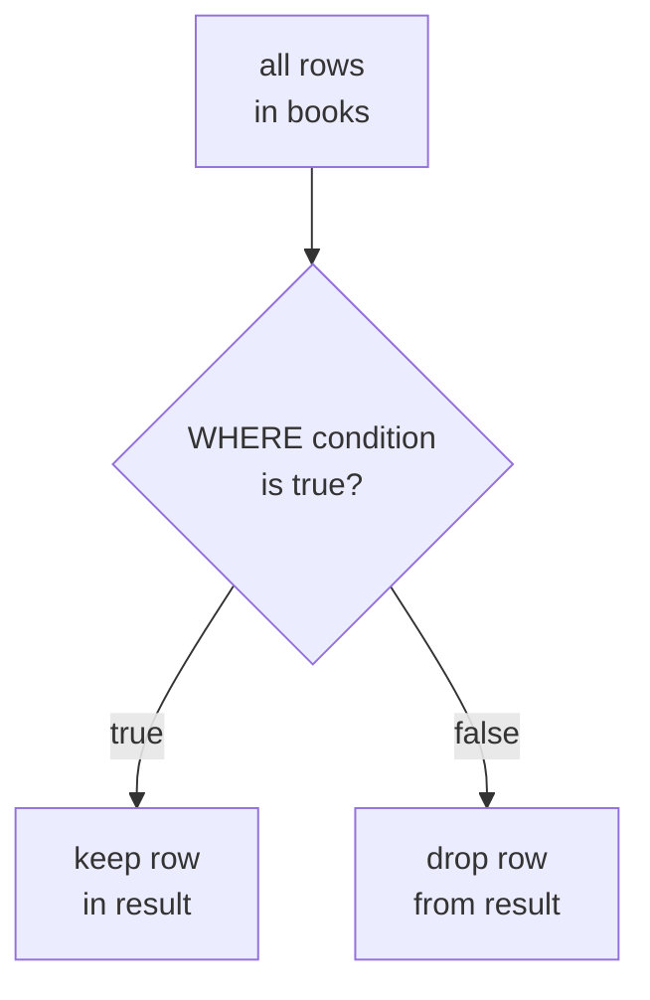
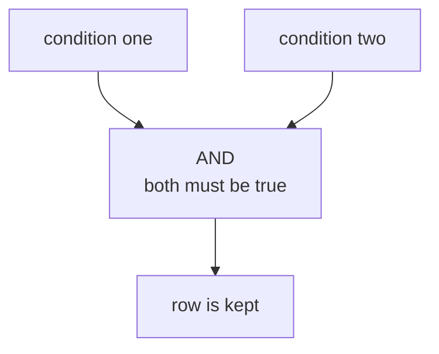

`SELECT` chooses columns. `WHERE` chooses rows.

That difference matters. A table may hold hundreds or millions of rows,
but most questions only need some of them: books under a certain price,
employees in one department, or customers in one city.

<svg
  viewBox="0 0 640 250"
  role="img"
  aria-label="Mixed dots rain into a yellow colander; only the small green ones fit through its holes and collect in the bowl below, while the big red ones stay caught — WHERE is a sieve that lets matching rows through"
  style={{ display: "block", width: "100%", maxWidth: "560px", height: "auto", margin: "2.5rem auto" }}
>
  <g style={{ color: "var(--ds-green-500)" }} fill="currentColor">
    <circle cx="248" cy="22" r="5.5" fillOpacity="0.8" />
    <circle cx="330" cy="14" r="5.5" fillOpacity="0.9" />
    <circle cx="296" cy="44" r="5.5" fillOpacity="0.7" />
  </g>
  <g style={{ color: "var(--ds-red-500)" }} fill="currentColor">
    <circle cx="368" cy="36" r="11" fillOpacity="0.8" />
    <circle cx="222" cy="52" r="10" fillOpacity="0.7" />
  </g>
  <g fill="currentColor" opacity="0.3">
    <circle cx="394" cy="64" r="8" />
  </g>
  <g style={{ color: "var(--ds-yellow-500)" }} fill="currentColor">
    <path fillRule="evenodd" d="M 196 96 A 98 98 0 0 0 392 96 Z M 243 124 A 7 7 0 1 0 257 124 A 7 7 0 1 0 243 124 Z M 287 146 A 7 7 0 1 0 301 146 A 7 7 0 1 0 287 146 Z M 331 124 A 7 7 0 1 0 345 124 A 7 7 0 1 0 331 124 Z M 287 108 A 7 7 0 1 0 301 108 A 7 7 0 1 0 287 108 Z" fillOpacity="0.85" />
    <rect x="162" y="90" width="36" height="11" rx="5.5" fillOpacity="0.85" />
    <rect x="390" y="90" width="36" height="11" rx="5.5" fillOpacity="0.85" />
  </g>
  <g style={{ color: "var(--ds-red-500)" }} fill="currentColor">
    <circle cx="262" cy="106" r="11" fillOpacity="0.85" />
    <circle cx="322" cy="110" r="10" fillOpacity="0.7" />
  </g>
  <g fill="currentColor" opacity="0.35">
    <circle cx="294" cy="128" r="8" />
  </g>
  <g style={{ color: "var(--ds-green-500)" }} fill="currentColor">
    <circle cx="294" cy="158" r="5.5" fillOpacity="0.9" />
    <circle cx="250" cy="178" r="5.5" fillOpacity="0.7" />
    <circle cx="338" cy="172" r="5.5" fillOpacity="0.8" />
    <circle cx="280" cy="196" r="5.5" fillOpacity="0.6" />
    <circle cx="312" cy="206" r="5.5" fillOpacity="0.9" />
  </g>
  <g fill="currentColor" opacity="0.16">
    <path d="M 216 218 A 78 78 0 0 0 372 218 Z" />
  </g>
</svg>

## WHERE keeps matching rows

A `WHERE` clause is a test that SQLite applies to each row. If the test
is true, the row stays in the result. If the test is false, the row is
left out.

<SqlCodeBlock
  dialect="sqlite"
  title="Keep one genre"
  initSql={`CREATE TABLE books (
  id INTEGER PRIMARY KEY,
  title TEXT,
  author TEXT,
  genre TEXT,
  price NUMERIC,
  pages INTEGER
);
INSERT INTO books (title, author, genre, price, pages) VALUES
  ('The Solar Bakery', 'Mina Park', 'Fiction', 12.99, 240),
  ('Data Garden', 'Owen Lee', 'Technology', 29.50, 410),
  ('Pocket Rivers', 'Lena Ortiz', 'Travel', 16.00, 180),
  ('SQL Street', 'Mina Park', 'Technology', 24.00, 320),
  ('Cloud Recipes', 'Ava Stone', 'Fiction', 18.25, 275);`}
  starterCode={`SELECT
  title,
  genre,
  price
FROM
  books
WHERE
  genre = 'Technology';`}
/>

The equals sign, `=`, means "is equal to." Text values go in single
quotes.

## Comparison operators

SQLite supports the comparisons beginners use constantly:

| Operator | Means | Example |
| --- | --- | --- |
| `=` | equal to | `genre = 'Fiction'` |
| `<>` or `!=` | not equal to | `genre <> 'Travel'` |
| `<` and `>` | less than, greater than | `price < 20` |
| `<=` and `>=` | at most, at least | `pages >= 300` |
| `BETWEEN a AND b` | from `a` through `b`, inclusive | `price BETWEEN 10 AND 20` |
| `IN (...)` | matches any value in a list | `genre IN ('Fiction', 'Travel')` |
| `LIKE` | matches a text pattern | `title LIKE 'Data%'` |

<SqlCodeBlock
  dialect="sqlite"
  title="Books under 20 dollars"
  initSql={`CREATE TABLE books (
  id INTEGER PRIMARY KEY,
  title TEXT,
  author TEXT,
  genre TEXT,
  price NUMERIC,
  pages INTEGER
);
INSERT INTO books (title, author, genre, price, pages) VALUES
  ('The Solar Bakery', 'Mina Park', 'Fiction', 12.99, 240),
  ('Data Garden', 'Owen Lee', 'Technology', 29.50, 410),
  ('Pocket Rivers', 'Lena Ortiz', 'Travel', 16.00, 180),
  ('SQL Street', 'Mina Park', 'Technology', 24.00, 320),
  ('Cloud Recipes', 'Ava Stone', 'Fiction', 18.25, 275);`}
  starterCode={`SELECT
  title,
  price
FROM
  books
WHERE
  price < 20;`}
/>

<SqlCodeBlock
  dialect="sqlite"
  title="A page range with BETWEEN"
  initSql={`CREATE TABLE books (
  id INTEGER PRIMARY KEY,
  title TEXT,
  author TEXT,
  genre TEXT,
  price NUMERIC,
  pages INTEGER
);
INSERT INTO books (title, author, genre, price, pages) VALUES
  ('The Solar Bakery', 'Mina Park', 'Fiction', 12.99, 240),
  ('Data Garden', 'Owen Lee', 'Technology', 29.50, 410),
  ('Pocket Rivers', 'Lena Ortiz', 'Travel', 16.00, 180),
  ('SQL Street', 'Mina Park', 'Technology', 24.00, 320),
  ('Cloud Recipes', 'Ava Stone', 'Fiction', 18.25, 275);`}
  starterCode={`SELECT
  title,
  pages
FROM
  books
WHERE
  pages BETWEEN 200 AND 320;`}
/>

`BETWEEN` includes both ends of the range. In the example, 200 and 320
would both count as matches.

<MultipleChoice
  markdown={`Which clause keeps only rows that pass a test?

- SELECT
  > SELECT chooses which columns appear.
- [o] WHERE
  > WHERE applies a condition to each row and keeps only true matches.
- ORDER BY
  > ORDER BY changes row order after rows have been chosen.
- LIMIT
  > LIMIT trims how many rows are returned.`}
/>

## Combine conditions with AND, OR, and NOT

Real questions often have more than one part.

- `AND` means both conditions must be true.
- `OR` means at least one condition must be true.
- `NOT` flips a condition.

<SqlCodeBlock
  dialect="sqlite"
  title="Technology books under 30 dollars"
  initSql={`CREATE TABLE books (
  id INTEGER PRIMARY KEY,
  title TEXT,
  author TEXT,
  genre TEXT,
  price NUMERIC,
  pages INTEGER
);
INSERT INTO books (title, author, genre, price, pages) VALUES
  ('The Solar Bakery', 'Mina Park', 'Fiction', 12.99, 240),
  ('Data Garden', 'Owen Lee', 'Technology', 29.50, 410),
  ('Pocket Rivers', 'Lena Ortiz', 'Travel', 16.00, 180),
  ('SQL Street', 'Mina Park', 'Technology', 24.00, 320),
  ('Cloud Recipes', 'Ava Stone', 'Fiction', 18.25, 275);`}
  starterCode={`SELECT
  title,
  genre,
  price
FROM
  books
WHERE
  genre = 'Technology'
  AND price < 30;`}
/>

<SqlCodeBlock
  dialect="sqlite"
  title="Fiction or travel books"
  initSql={`CREATE TABLE books (
  id INTEGER PRIMARY KEY,
  title TEXT,
  author TEXT,
  genre TEXT,
  price NUMERIC,
  pages INTEGER
);
INSERT INTO books (title, author, genre, price, pages) VALUES
  ('The Solar Bakery', 'Mina Park', 'Fiction', 12.99, 240),
  ('Data Garden', 'Owen Lee', 'Technology', 29.50, 410),
  ('Pocket Rivers', 'Lena Ortiz', 'Travel', 16.00, 180),
  ('SQL Street', 'Mina Park', 'Technology', 24.00, 320),
  ('Cloud Recipes', 'Ava Stone', 'Fiction', 18.25, 275);`}
  starterCode={`SELECT
  title,
  genre
FROM
  books
WHERE
  genre = 'Fiction'
  OR genre = 'Travel';`}
/>

When you mix `AND` and `OR`, use parentheses so your meaning is clear.

<SqlCodeBlock
  dialect="sqlite"
  title="Use parentheses for mixed logic"
  initSql={`CREATE TABLE books (
  id INTEGER PRIMARY KEY,
  title TEXT,
  author TEXT,
  genre TEXT,
  price NUMERIC,
  pages INTEGER
);
INSERT INTO books (title, author, genre, price, pages) VALUES
  ('The Solar Bakery', 'Mina Park', 'Fiction', 12.99, 240),
  ('Data Garden', 'Owen Lee', 'Technology', 29.50, 410),
  ('Pocket Rivers', 'Lena Ortiz', 'Travel', 16.00, 180),
  ('SQL Street', 'Mina Park', 'Technology', 24.00, 320),
  ('Cloud Recipes', 'Ava Stone', 'Fiction', 18.25, 275);`}
  starterCode={`SELECT
  title,
  genre,
  price
FROM
  books
WHERE
  price < 20
  AND (
    genre = 'Fiction'
    OR genre = 'Travel'
  );`}
/>

## IN is a shorter OR list

`IN` checks whether a value is one of several choices. It is often much
cleaner than writing many `OR` conditions.

<SqlCodeBlock
  dialect="sqlite"
  title="Match several genres with IN"
  initSql={`CREATE TABLE books (
  id INTEGER PRIMARY KEY,
  title TEXT,
  author TEXT,
  genre TEXT,
  price NUMERIC,
  pages INTEGER
);
INSERT INTO books (title, author, genre, price, pages) VALUES
  ('The Solar Bakery', 'Mina Park', 'Fiction', 12.99, 240),
  ('Data Garden', 'Owen Lee', 'Technology', 29.50, 410),
  ('Pocket Rivers', 'Lena Ortiz', 'Travel', 16.00, 180),
  ('SQL Street', 'Mina Park', 'Technology', 24.00, 320),
  ('Cloud Recipes', 'Ava Stone', 'Fiction', 18.25, 275);`}
  starterCode={`SELECT
  title,
  genre
FROM
  books
WHERE
  genre IN ('Fiction', 'Travel');`}
/>

## LIKE finds text patterns

`LIKE` compares text to a pattern.

- `%` means any number of characters, including none.
- `_` means exactly one character.

In SQLite, `LIKE` is case-insensitive for ordinary ASCII letters by
default. That means `'sql%'` can match `SQL Street`.

<svg
  viewBox="0 0 640 190"
  role="img"
  aria-label="A pattern card shows a solid blue start followed by trailing wildcard dots; below it, two text bars whose beginnings match glow green while the bar with a different start fades out — LIKE matches the shape of text, not the whole exact value"
  style={{ display: "block", width: "100%", maxWidth: "480px", height: "auto", margin: "2.5rem auto" }}
>
  <g fill="currentColor" opacity="0.12">
    <rect x="180" y="18" width="280" height="44" rx="10" />
  </g>
  <g style={{ color: "var(--ds-blue-500)" }} fill="currentColor">
    <rect x="198" y="32" width="84" height="16" rx="8" />
  </g>
  <g fill="currentColor" opacity="0.4">
    <circle cx="300" cy="40" r="4" />
    <circle cx="320" cy="40" r="4" />
    <circle cx="340" cy="40" r="4" />
    <circle cx="360" cy="40" r="4" />
  </g>
  <g style={{ color: "var(--ds-blue-500)" }} fill="currentColor">
    <rect x="146" y="92" width="84" height="14" rx="7" />
    <rect x="146" y="156" width="84" height="14" rx="7" />
  </g>
  <g fill="currentColor" opacity="0.35">
    <rect x="238" y="92" width="120" height="14" rx="7" />
    <rect x="238" y="156" width="56" height="14" rx="7" />
  </g>
  <g style={{ color: "var(--ds-yellow-500)" }} fill="currentColor">
    <rect x="146" y="124" width="84" height="14" rx="7" fillOpacity="0.45" />
  </g>
  <g fill="currentColor" opacity="0.18">
    <rect x="238" y="124" width="96" height="14" rx="7" />
  </g>
  <g style={{ color: "var(--ds-green-500)" }} fill="currentColor">
    <circle cx="406" cy="99" r="8" />
    <circle cx="406" cy="163" r="8" />
  </g>
  <g style={{ color: "var(--ds-red-500)" }} fill="currentColor">
    <circle cx="406" cy="131" r="8" fillOpacity="0.5" />
  </g>
</svg>

<SqlCodeBlock
  dialect="sqlite"
  title="Titles that start with SQL"
  initSql={`CREATE TABLE books (
  id INTEGER PRIMARY KEY,
  title TEXT,
  author TEXT,
  genre TEXT,
  price NUMERIC,
  pages INTEGER
);
INSERT INTO books (title, author, genre, price, pages) VALUES
  ('The Solar Bakery', 'Mina Park', 'Fiction', 12.99, 240),
  ('Data Garden', 'Owen Lee', 'Technology', 29.50, 410),
  ('Pocket Rivers', 'Lena Ortiz', 'Travel', 16.00, 180),
  ('SQL Street', 'Mina Park', 'Technology', 24.00, 320),
  ('Cloud Recipes', 'Ava Stone', 'Fiction', 18.25, 275);`}
  starterCode={`SELECT
  title
FROM
  books
WHERE
  title LIKE 'sql%';`}
/>

<SqlCodeBlock
  dialect="sqlite"
  title="Titles containing the letter sequence ar"
  initSql={`CREATE TABLE books (
  id INTEGER PRIMARY KEY,
  title TEXT,
  author TEXT,
  genre TEXT,
  price NUMERIC,
  pages INTEGER
);
INSERT INTO books (title, author, genre, price, pages) VALUES
  ('The Solar Bakery', 'Mina Park', 'Fiction', 12.99, 240),
  ('Data Garden', 'Owen Lee', 'Technology', 29.50, 410),
  ('Pocket Rivers', 'Lena Ortiz', 'Travel', 16.00, 180),
  ('SQL Street', 'Mina Park', 'Technology', 24.00, 320),
  ('Cloud Recipes', 'Ava Stone', 'Fiction', 18.25, 275);`}
  starterCode={`SELECT
  title
FROM
  books
WHERE
  title LIKE '%ar%';`}
/>

## Practice challenge

You have seen every tool this challenge needs: `WHERE`, `AND`, and
a comparison. The table is already loaded — you only write the
query.

<SqlChallengeCard
  dialect="sqlite"
  title="Affordable fiction"
  instructions={`The \`books\` table is preloaded. Return the \`title\` and \`price\` columns (in that order) for books whose \`genre\` is \`'Fiction'\` **and** whose \`price\` is under \`20\`. Sort the result by \`price\` ascending. Two books should match.`}
  initSql={`CREATE TABLE books (
  id INTEGER PRIMARY KEY,
  title TEXT,
  author TEXT,
  genre TEXT,
  price NUMERIC,
  pages INTEGER
);
INSERT INTO books (title, author, genre, price, pages) VALUES
  ('The Solar Bakery', 'Mina Park', 'Fiction', 12.99, 240),
  ('Data Garden', 'Owen Lee', 'Technology', 29.50, 410),
  ('Pocket Rivers', 'Lena Ortiz', 'Travel', 16.00, 180),
  ('SQL Street', 'Mina Park', 'Technology', 24.00, 320),
  ('Cloud Recipes', 'Ava Stone', 'Fiction', 18.25, 275);`}
  starterCode={`SELECT
  title,
  price
FROM
  books;`}
  solutionSql={`SELECT
  title,
  price
FROM
  books
WHERE
  genre = 'Fiction'
  AND price < 20
ORDER BY
  price ASC;`}
  tests={[
    {
      id: "columns",
      name: "Has title and price columns",
      description: "In that exact order",
      expectedColumns: ["title", "price"],
    },
    {
      id: "row_count",
      name: "Returns 2 rows",
      description: "Only the two fiction books under 20",
      expectedRowCount: 2,
    },
    {
      id: "rows",
      name: "Cheapest fiction first",
      description: "The Solar Bakery (12.99), then Cloud Recipes (18.25)",
      expectedRows: {
        columns: ["title", "price"],
        ordered: true,
        values: [
          ["The Solar Bakery", 12.99],
          ["Cloud Recipes", 18.25],
        ],
      },
    },
  ]}
/>

## Check your understanding

<MultipleChoice
  markdown={`What does BETWEEN 10 AND 20 mean for a price?

- More than 10 and less than 20, excluding both ends.
  > BETWEEN includes its boundary values.
- [o] From 10 through 20, including 10 and 20.
  > SQLite treats BETWEEN as an inclusive range test.
- Exactly 10 or exactly 20 only.
  > Values between the two ends also match.
- Any price except 10 through 20.
  > That would need NOT BETWEEN.`}
/>

<MultipleChoice
  markdown={`Which condition keeps books that are either Fiction or Travel?

- genre = 'Fiction' AND genre = 'Travel'
  > One row cannot have both different genre values at the same time.
- [o] genre IN ('Fiction', 'Travel')
  > IN checks whether the value is any item in the list.
- genre NOT IN ('Fiction', 'Travel')
  > NOT IN keeps everything outside the list.
- genre LIKE 'Fiction Travel'
  > LIKE is for text patterns, not a list of separate choices.`}
/>

<MultipleChoice
  markdown={`In SQLite, what does the LIKE pattern 'Data%' match?

- Only the exact text Data%.
  > The percent sign is a wildcard in a LIKE pattern.
- [o] Text that starts with Data, followed by any characters.
  > Percent means any number of characters after Data.
- Text that ends with Data.
  > A pattern for ending with Data would be '%Data'.
- Only text with exactly one character after Data.
  > The underscore wildcard matches one character; percent matches any number.`}
/>
