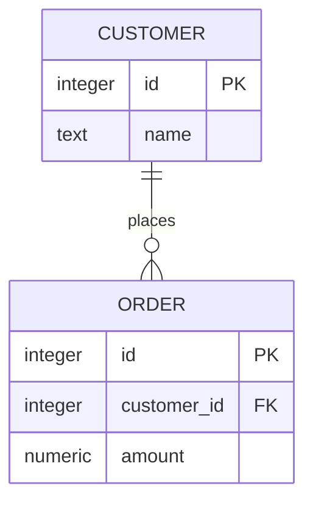
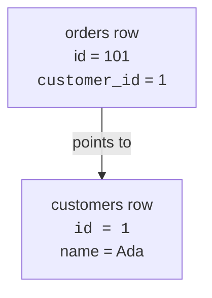
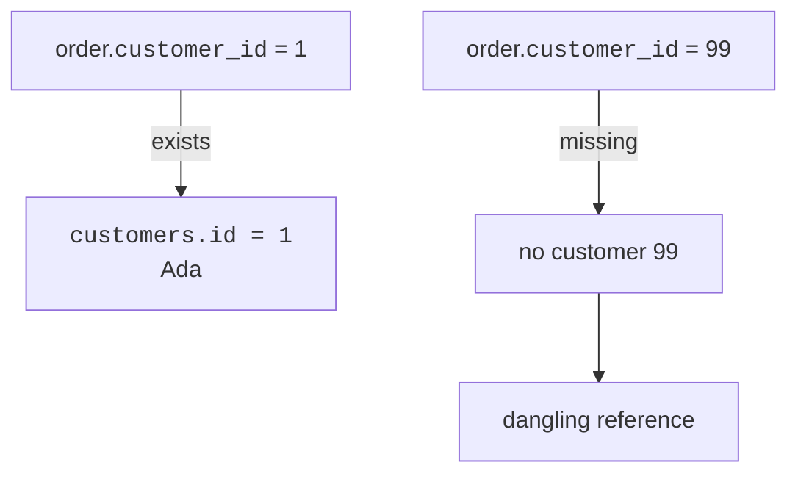
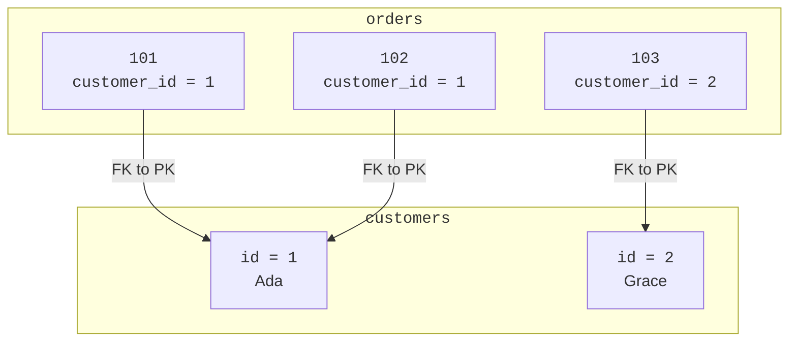

A **foreign key** is a column that points from one table to a row in another table. It is how a row says, "I belong with that row over there."

If `customers.id` is the primary key, then `orders.customer_id` can store one of those ids as a foreign key.



## The pointer idea

In this picture, order `101` does not copy Ada's whole customer record. It stores `customer_id = 1`, which points to `customers.id = 1`.



This keeps data tidy:

- Ada's name lives in one place.
- Many orders can point to the same customer.
- If Ada's name changes, the orders still point to customer `1`.

<Figure
  slug="lite-foreign-keys-cutout"
  alt="A key tag on one grid platform with an arrow pointing across to the exact matching row on a second platform"
/>

<SqlCodeBlock
  dialect="sqlite"
  title="A foreign key stores another table's id"
  initSql={`CREATE TABLE customers (
  id INTEGER PRIMARY KEY,
  name TEXT
);

CREATE TABLE orders (
  id INTEGER PRIMARY KEY,
  customer_id INTEGER REFERENCES customers(id),
  amount NUMERIC
);

INSERT INTO customers (id, name) VALUES
  (1, 'Ada'),
  (2, 'Grace');

INSERT INTO orders (id, customer_id, amount) VALUES
  (101, 1, 42),
  (102, 1, 18),
  (103, 2, 99);`}
  starterCode={`SELECT
  *
FROM
  orders
ORDER BY
  id;`}
/>

The phrase `REFERENCES customers(id)` declares the relationship: each `orders.customer_id` is meant to refer to a value in `customers.id`.

<MultipleChoice
  markdown={`In the orders table, what does \`customer_id = 1\` mean?

- The order's own id is 1.
  > The order has its own primary key in the \`id\` column.
- [o] The order points to the customer whose \`id\` is 1.
  > The foreign key stores the related customer's primary key value.
- The order amount is 1.
  > The amount is stored in a separate column.
- The customer table has exactly one row.
  > A foreign key value points to one customer row, but the table can contain many rows.

A foreign key value is a reference to a row in another table.`}
/>

## Referential integrity

**Referential integrity** means references should not dangle. If an order says `customer_id = 99`, customer `99` should actually exist.



## Important SQLite note: enforcement must be turned on

SQLite can enforce foreign keys, but enforcement is controlled by `PRAGMA foreign_keys`. In many SQLite environments it is **off by default for each database connection**. To rely on foreign-key protection, turn it on before changing data:

```sql
PRAGMA foreign_keys = ON;
```

<Callout type="warning" title="Turn it on for real protection">
Declaring \`REFERENCES\` describes the relationship. In SQLite, \`PRAGMA foreign_keys = ON;\` makes SQLite reject rows that break the relationship.
</Callout>

<SqlCodeBlock
  expectError
  dialect="sqlite"
  title="SQLite rejects a bad reference when enforcement is on"
  initSql={`PRAGMA foreign_keys = ON;

CREATE TABLE customers (
  id INTEGER PRIMARY KEY,
  name TEXT
);

CREATE TABLE orders (
  id INTEGER PRIMARY KEY,
  customer_id INTEGER REFERENCES customers(id),
  amount NUMERIC
);

INSERT INTO customers (id, name) VALUES
  (1, 'Ada'),
  (2, 'Grace');`}
  starterCode={`-- This works because customer 1 exists.
INSERT INTO
  orders (id, customer_id, amount)
VALUES
  (101, 1, 42);

-- This fails because customer 99 does not exist.
INSERT INTO
  orders (id, customer_id, amount)
VALUES
  (102, 99, 17);

SELECT
  *
FROM
  orders;`}
/>

The second insert is blocked. SQLite is protecting you from an **orphan row**: an order that claims to belong to a missing customer.

<Figure
  slug="lite-foreign-keys-inline-cutout"
  alt="A cord joining a row in one board to a row in another, with a small clasp on the cord that can be left open or closed"
/>

## Seeing the links

<SqlCodeBlock
  dialect="sqlite"
  title="Join through the foreign key"
  initSql={`CREATE TABLE customers (
  id INTEGER PRIMARY KEY,
  name TEXT
);
CREATE TABLE orders (
  id INTEGER PRIMARY KEY,
  customer_id INTEGER REFERENCES customers(id),
  amount NUMERIC
);
INSERT INTO customers (id, name) VALUES
  (1, 'Ada'), (2, 'Grace');
INSERT INTO orders (id, customer_id, amount) VALUES
  (101, 1, 42), (102, 1, 18), (103, 2, 99);`}
  starterCode={`SELECT
  orders.id AS order_id,
  customers.name AS customer,
  orders.amount
FROM
  orders
  JOIN customers ON orders.customer_id = customers.id
ORDER BY
  orders.id;`}
/>

The join follows the foreign-key arrows and shows readable customer names next to order facts.



## Check your understanding

<MultipleChoice
  markdown={`What is a foreign key?

- A special password for opening a table.
  > In databases, "key" means an identifying value or reference.
- A column that stores all rows from another table.
  > A foreign key stores one value per row, not a whole table.
- A column that must contain a different value in every row of its own table.
  > That describes uniqueness, often used by primary keys.
- [o] A column that stores the primary key value of a related row in another table.
  > A foreign key creates a reference from one table to another.

A foreign key links rows by storing another table's identifying value.`}
/>

<MultipleChoice
  markdown={`In SQLite, what must you do if you want foreign-key constraints to be enforced?

- [o] Run \`PRAGMA foreign_keys = ON;\` for the connection.
  > SQLite enforces foreign keys only when this setting is enabled.
- Avoid primary keys completely.
  > Foreign keys normally point to primary keys or unique keys.
- Rename every foreign-key column to \`id\`.
  > Column names do not turn enforcement on.
- Use only text primary keys.
  > Foreign keys can reference integer or text keys; the pragma controls enforcement.

SQLite needs foreign-key enforcement enabled before it will reject broken references.`}
/>

<MultipleChoice
  markdown={`Why is \`customer_id\` better than copying \`customer_name\` into every order?

- [o] The id is stable and unique, while the customer's details can stay in one row.
  > Storing the id avoids duplicated customer data and keeps references reliable.
- Customer names cannot be stored in SQLite.
  > SQLite can store names as text.
- Foreign keys make every query shorter.
  > Foreign keys help structure data, but queries still need clear joins.
- It prevents a customer from having more than one order.
  > Many orders can share the same customer id.

A stable id is a safer reference than repeated descriptive text.`}
/>

<MultipleChoice
  markdown={`What is an orphan order?

- [o] An order whose \`customer_id\` points to a customer row that does not exist.
  > The order's reference is dangling, so referential integrity is broken.
- An order with a high amount.
  > The amount does not determine whether a reference is valid.
- An order with two valid customers.
  > A basic order usually points to one customer.
- A customer with no orders.
  > That customer may be valid; the missing reference is the problem for an orphan order.

Foreign-key enforcement prevents orphan rows by requiring referenced rows to exist.`}
/>
