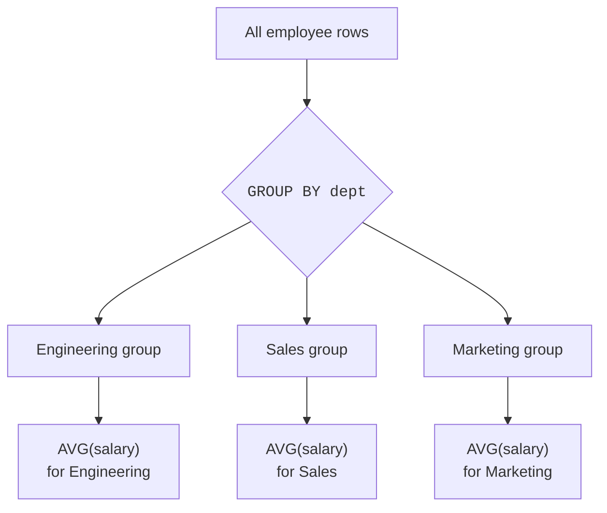
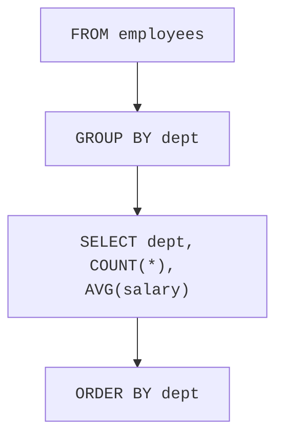
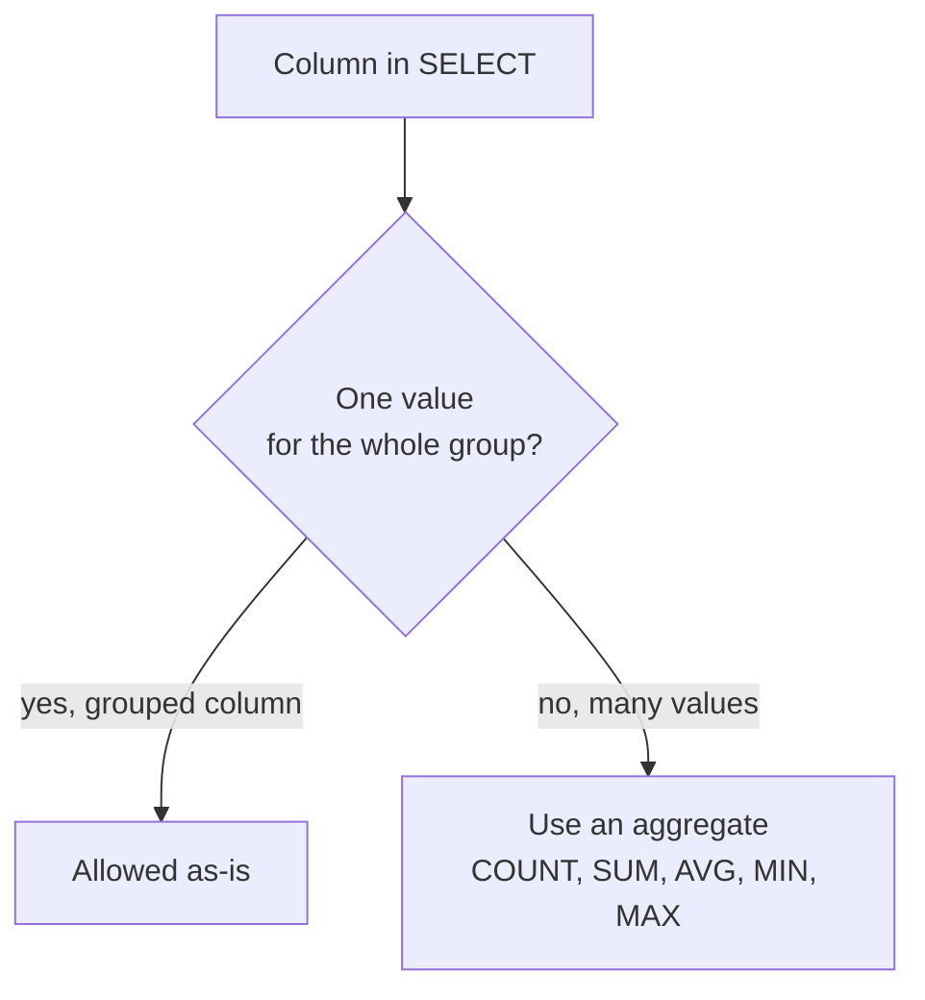
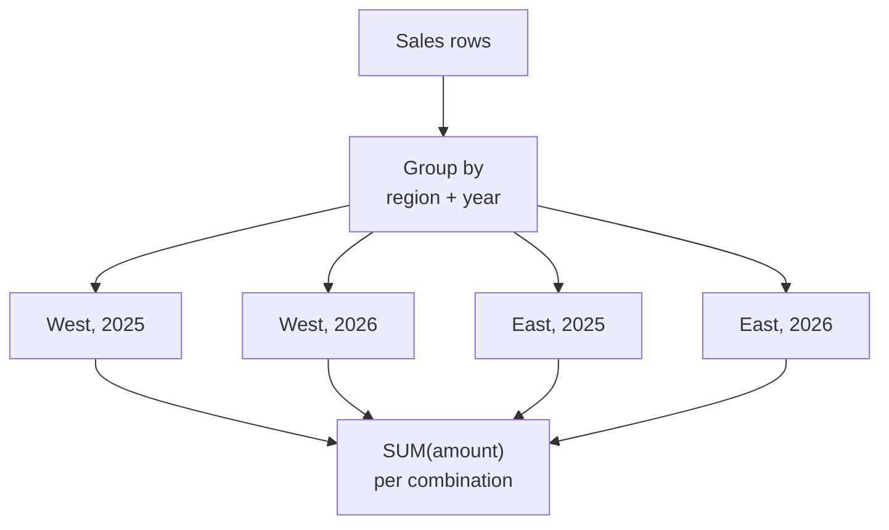
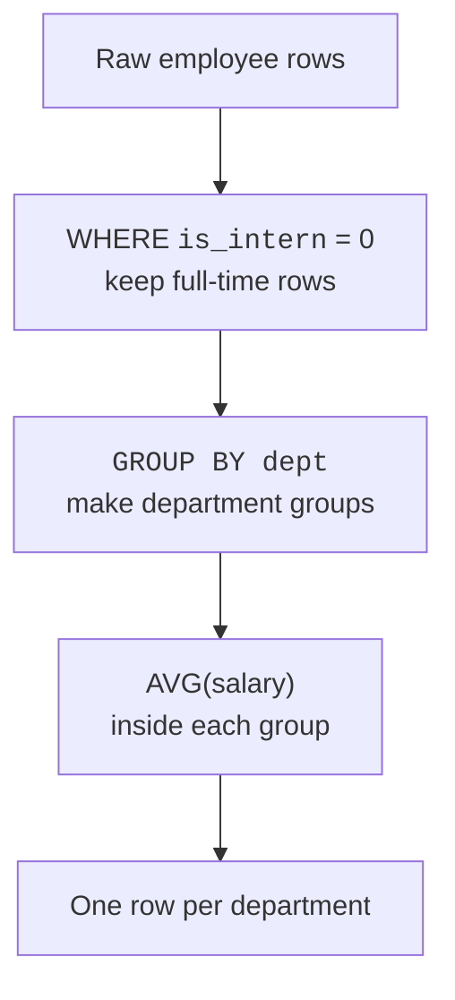

Aggregate functions can summarize a whole table into one answer. That is useful, but many real questions need one answer **per category**:

- How many orders did each customer place?
- What is the total sales amount for each product?
- What is the average salary in each department?
- How many visits happened in each month?

`GROUP BY` is how you ask SQLite to split rows into groups first, then summarize each group.

<Figure
  slug="lite-grouping-cutout"
  alt="A mixed pile of colored tiles splitting into three bins on a platform, each bin producing its own summary block"
/>

## The big idea: split, then summarize

Without `GROUP BY`, an aggregate gives one summary for all rows. With `GROUP BY`, SQLite makes one group for each distinct value, then runs the aggregate once per group.

<Figure
  slug="lite-grouping-data-big-idea-split-inline-cutout"
  alt="A scatter of chips raked into three trays and each tray pressed into one block"
  caption="Grouping collapses the rows in each bucket down to one row each."
/>



The result is not one average salary. It is one average salary **per department**.

## Your first GROUP BY query

Start with a small employee table. The query below counts employees and computes average salary for each department.

<Figure
  slug="lite-grouping-data-one-result-row-per-inline-cutout"
  alt="Three bins filled from a single pile, each bin handing one summary card up to the rail above it"
  caption="`GROUP BY` collapses each group to a single row, one summary per bin."
/>

<SqlCodeBlock
  dialect="sqlite"
  title="Headcount and average salary per department"
  initSql={`CREATE TABLE employees (
  id INTEGER PRIMARY KEY,
  name TEXT,
  dept TEXT,
  salary REAL
);
INSERT INTO employees (name, dept, salary) VALUES
  ('Alice', 'Engineering', 120000), ('Bob', 'Engineering', 100000),
  ('Cara', 'Engineering', 30000), ('Gina', 'Engineering', 115000),
  ('Hugo', 'Engineering', 98000), ('Mona', 'Engineering', 132000),
  ('Theo', 'Engineering', 28000), ('Yara', 'Engineering', 105000),
  ('Dave', 'Sales', 75000), ('Eve', 'Sales', 72000),
  ('Iris', 'Sales', 81000), ('Nils', 'Sales', 26000),
  ('Rui', 'Sales', 69000), ('Vik', 'Sales', 77000),
  ('Jonas', 'Support', 58000), ('Kira', 'Support', 61000),
  ('Otto', 'Support', 24000), ('Sara', 'Support', 55000),
  ('Wanda', 'Support', 63000), ('Finn', 'Marketing', 68000),
  ('Leo', 'Marketing', 71000), ('Pia', 'Finance', 88000),
  ('Ulla', 'Finance', 92000), ('Quinn', 'Legal', 110000);`}
  starterCode={`SELECT
  dept,
  COUNT(*) AS headcount,
  ROUND(AVG(salary), 0) AS average_salary
FROM
  employees
GROUP BY
  dept
ORDER BY
  dept;`}
/>

Read the query out loud like this:

> For each `dept`, count the rows and average the salaries.

The `dept` column appears in the result because it labels each group. Without it, you would see numbers but not know which department they describe.



## One result row per group

A group is a bucket of rows that share the same grouped value. If the table has six departments, the grouped query returns six rows, however many employees are spread across them.

<SqlCodeBlock
  dialect="sqlite"
  title="One row for each category"
  initSql={`CREATE TABLE tickets (
  id INTEGER PRIMARY KEY,
  priority TEXT
);
INSERT INTO tickets (priority) VALUES
  ('High'), ('Low'), ('High'), ('Medium'), ('Low'), ('Low'),
  ('Medium'), ('High'), ('Low'), ('Medium'), ('Low'), ('High'),
  ('Low'), ('Medium'), ('Low'), ('High'), ('Medium'), ('Low'),
  ('Low'), ('High'), ('Medium'), ('Low'), ('Medium'), ('Low');`}
  starterCode={`SELECT
  priority,
  COUNT(*) AS ticket_count
FROM
  tickets
GROUP BY
  priority
ORDER BY
  ticket_count DESC;`}
/>

There are 24 ticket rows, but only three priority groups: `High`,
`Medium`, and `Low`.

It is worth tracing this once by hand, because it is the mental
model you will use for every grouped query you ever write. SQLite
conceptually sorts all 24 rows into labeled buckets, then runs
`COUNT(*)` once *inside each bucket*:

```text
bucket "High":    High, High, High, …    -> COUNT(*) = 6
bucket "Medium":  Medium, Medium, …      -> COUNT(*) = 7
bucket "Low":     Low, Low, Low, …       -> COUNT(*) = 11
```

Each bucket then contributes exactly one row to the result: its
label and its summary. 24 rows in, three rows out. Notice that the
number of result rows has nothing to do with the size of the table
and everything to do with how many distinct values the grouped
column holds. When a grouped query ever surprises you, redraw the
buckets on paper, the confusion almost always dissolves.

<MultipleChoice
  markdown={`What does \`GROUP BY priority\` do before \`COUNT(*)\` runs?

- [o] It puts rows with the same \`priority\` value into the same group.
  > The aggregate then runs once for each priority group.
- It deletes duplicate priorities from the table.
  > The table is not changed; grouping only affects the query result.
- It changes all priorities to the same value.
  > Grouping does not edit values.
- It sorts the table permanently by priority.
  > \`ORDER BY\` controls result order; \`GROUP BY\` forms groups.

\`GROUP BY\` creates buckets of rows that can be summarized separately.`}
/>

## The golden rule of GROUP BY

When a query uses `GROUP BY`, each result row represents a whole group. That creates an important rule:

> Every expression in `SELECT` must either be part of the `GROUP BY` or be inside an aggregate function.

This is easier to understand with a question: if one output row represents all Engineering employees, which single `name` should SQLite show for that row? Alice? Bob? Someone else?

A grouped result row needs values that make sense for the whole group.



<Callout type="warning" title="SQLite note">
Some databases reject ungrouped columns immediately. SQLite may allow them in some grouped queries, but the value can be arbitrary and misleading. For clear beginner-friendly SQL, follow the golden rule: select grouped columns or aggregate results.
</Callout>

## Grouping and summing

`GROUP BY` is often paired with `SUM()` for category totals.

<SqlCodeBlock
  dialect="sqlite"
  title="Total sales per product"
  initSql={`CREATE TABLE sales (
  id INTEGER PRIMARY KEY,
  product TEXT,
  amount REAL
);
INSERT INTO sales (product, amount) VALUES
  ('Notebook', 12.00), ('Pencil', 3.00), ('Notebook', 18.00), ('Backpack', 45.00),
  ('Pencil', 2.50), ('Notebook', 9.00), ('Backpack', 38.50), ('Mug', 7.25),
  ('Pencil', 4.10), ('Notebook', 15.75), ('Mug', 6.80), ('Backpack', 52.00),
  ('Eraser', 1.20), ('Notebook', 11.40), ('Mug', 8.90), ('Pencil', 3.75),
  ('Backpack', 41.25), ('Eraser', 0.95), ('Notebook', 13.60), ('Mug', 5.50),
  ('Pencil', 2.80), ('Backpack', 47.80), ('Eraser', 1.45), ('Notebook', 16.20);`}
  starterCode={`SELECT
  product,
  SUM(amount) AS total_sales
FROM
  sales
GROUP BY
  product
ORDER BY
  total_sales DESC;`}
/>

This is the pattern behind many reports: category on the left, summary number on the right.

## Grouping by more than one column

You can group by multiple columns. The group becomes each unique combination of those column values.

<Figure
  slug="lite-grouping-data-inline-cutout"
  alt="Chips raked into three trays by color, with one small counter standing on each tray"
  caption="Group by two columns and the buckets become every combination of the pair."
/>

For example, `GROUP BY region, year` means:

> Make one group for each region-and-year pair.

<SqlCodeBlock
  dialect="sqlite"
  title="Total sales per region per year"
  initSql={`CREATE TABLE sales (
  id INTEGER PRIMARY KEY,
  region TEXT,
  year INTEGER,
  amount REAL
);
INSERT INTO sales (region, year, amount) VALUES
  ('West', 2025, 100.00), ('West', 2025, 50.00), ('West', 2025, 75.00),
  ('West', 2025, 120.00), ('West', 2026, 200.00), ('West', 2026, 90.00),
  ('West', 2026, 145.00), ('West', 2026, 60.00),
  ('East', 2025, 80.00), ('East', 2025, 110.00), ('East', 2025, 45.00),
  ('East', 2025, 95.00), ('East', 2026, 120.00), ('East', 2026, 60.00),
  ('East', 2026, 175.00), ('East', 2026, 85.00),
  ('North', 2025, 65.00), ('North', 2025, 130.00), ('North', 2025, 40.00),
  ('North', 2026, 155.00), ('North', 2026, 70.00), ('North', 2026, 110.00),
  ('North', 2026, 95.00), ('North', 2025, 88.00);`}
  starterCode={`SELECT
  region,
  year,
  SUM(amount) AS total_sales
FROM
  sales
GROUP BY
  region,
  year
ORDER BY
  region,
  year;`}
/>

Each result row is one distinct `(region, year)` combination.



<MultipleChoice
  markdown={`When you write \`GROUP BY region, year\`, what does each output row represent?

- One row per region only.
  > The year also participates in the grouping.
- One row per year only.
  > The region also participates in the grouping.
- [o] One row per unique combination of region and year.
  > Multiple grouped columns form groups from distinct value combinations.
- One row per original sale.
  > Aggregation collapses original sale rows into summary rows.

Grouping by multiple columns is grouping by combinations.`}
/>

## WHERE happens before GROUP BY

You can filter rows before they are grouped. This is useful when only some rows should enter the summary.

In SQLite, use `INTEGER` values like `1` and `0` for true/false flags.

<SqlCodeBlock
  dialect="sqlite"
  title="Average salary per department for full-time employees"
  initSql={`CREATE TABLE employees (
  id INTEGER PRIMARY KEY,
  name TEXT,
  dept TEXT,
  salary REAL,
  is_intern INTEGER
);
INSERT INTO employees (name, dept, salary, is_intern) VALUES
  ('Alice', 'Engineering', 120000, 0), ('Bob', 'Engineering', 100000, 0),
  ('Cara', 'Engineering', 30000, 1), ('Gina', 'Engineering', 115000, 0),
  ('Hugo', 'Engineering', 98000, 0), ('Mona', 'Engineering', 132000, 0),
  ('Theo', 'Engineering', 28000, 1), ('Yara', 'Engineering', 105000, 0),
  ('Dave', 'Sales', 75000, 0), ('Eve', 'Sales', 72000, 0),
  ('Iris', 'Sales', 81000, 0), ('Nils', 'Sales', 26000, 1),
  ('Rui', 'Sales', 69000, 0), ('Vik', 'Sales', 77000, 0),
  ('Jonas', 'Support', 58000, 0), ('Kira', 'Support', 61000, 0),
  ('Otto', 'Support', 24000, 1), ('Sara', 'Support', 55000, 0),
  ('Wanda', 'Support', 63000, 0), ('Finn', 'Marketing', 68000, 0),
  ('Leo', 'Marketing', 71000, 0), ('Pia', 'Finance', 88000, 0),
  ('Ulla', 'Finance', 92000, 0), ('Quinn', 'Legal', 110000, 0);`}
  starterCode={`SELECT
  dept,
  ROUND(AVG(salary), 0) AS average_salary
FROM
  employees
WHERE
  is_intern = 0
GROUP BY
  dept
ORDER BY
  dept;`}
/>

The intern row is removed first. Then SQLite groups the remaining rows by department.



## GROUP BY changes the meaning of SELECT

Before grouping, `SELECT name, salary` means "show me each row's name and salary."

After grouping, `SELECT dept, COUNT(*)` means "show me each group's label and summary."

That mental shift is the tricky part: the output rows are no longer individual original rows. They are **summary rows**.

<SqlCodeBlock
  dialect="sqlite"
  title="Detail rows versus summary rows"
  initSql={`CREATE TABLE pets (
  id INTEGER PRIMARY KEY,
  name TEXT,
  species TEXT
);
INSERT INTO pets (name, species) VALUES
  ('Luna', 'Cat'), ('Milo', 'Dog'), ('Nori', 'Cat'), ('Pip', 'Bird'),
  ('Rex', 'Dog'), ('Suki', 'Cat'), ('Toby', 'Dog'), ('Uni', 'Rabbit'),
  ('Vera', 'Cat'), ('Wally', 'Dog'), ('Yuki', 'Cat'), ('Zeno', 'Bird'),
  ('Ace', 'Dog'), ('Bean', 'Rabbit'), ('Cleo', 'Cat'), ('Dot', 'Bird'),
  ('Echo', 'Dog'), ('Fig', 'Cat'), ('Gus', 'Dog'), ('Hazel', 'Rabbit'),
  ('Ivy', 'Cat'), ('Jax', 'Dog'), ('Kip', 'Bird'), ('Lolly', 'Cat');`}
  starterCode={`SELECT
  species,
  COUNT(*) AS pet_count
FROM
  pets
GROUP BY
  species
ORDER BY
  species;`}
/>

The result does not show Luna, Milo, or Nori as separate rows. Twenty-four
pets collapse into four rows, one per species. Individual names are not
lost, they are simply not what this question asked for; run the query
without the `GROUP BY` and the detail is right there again.

## Practice challenge

One concept, one query: group rows into buckets and count each
bucket.

<SqlChallengeCard
  dialect="sqlite"
  title="Pets per species"
  instructions={`The \`pets\` table is preloaded. Return one row per \`species\` with the columns \`species\` and \`pet_count\` (the number of pets of that species, using \`COUNT(*)\`). Sort by \`pet_count\` descending, then by \`species\` ascending to break ties.`}
  initSql={`CREATE TABLE pets (
  id INTEGER PRIMARY KEY,
  name TEXT,
  species TEXT
);
INSERT INTO pets (name, species) VALUES
  ('Luna', 'Cat'), ('Milo', 'Dog'), ('Nori', 'Cat'), ('Pip', 'Bird'),
  ('Rex', 'Dog'), ('Suki', 'Cat'), ('Toby', 'Dog'), ('Uni', 'Rabbit'),
  ('Vera', 'Cat'), ('Wally', 'Dog'), ('Yuki', 'Cat'), ('Zeno', 'Bird'),
  ('Ace', 'Dog'), ('Bean', 'Rabbit'), ('Cleo', 'Cat'), ('Dot', 'Bird'),
  ('Echo', 'Dog'), ('Fig', 'Cat'), ('Gus', 'Dog'), ('Hazel', 'Rabbit'),
  ('Ivy', 'Cat'), ('Jax', 'Dog'), ('Kip', 'Bird'), ('Lolly', 'Cat');`}
  starterCode={`SELECT
  species
FROM
  pets;`}
  solutionSql={`SELECT
  species,
  COUNT(*) AS pet_count
FROM
  pets
GROUP BY
  species
ORDER BY
  pet_count DESC,
  species ASC;`}
  tests={[
    {
      id: "columns",
      name: "Has species and pet_count columns",
      description: "In that exact order",
      expectedColumns: ["species", "pet_count"],
    },
    {
      id: "row_count",
      name: "Returns 4 rows",
      description: "One per species: Cat, Dog, Bird, Rabbit",
      expectedRowCount: 4,
    },
    {
      id: "rows",
      name: "Largest group first",
      description: "Cat (9), Dog (8), Bird (4), Rabbit (3)",
      expectedRows: {
        columns: ["species", "pet_count"],
        ordered: true,
        values: [
          ["Cat", 9],
          ["Dog", 8],
          ["Bird", 4],
          ["Rabbit", 3],
        ],
      },
    },
  ]}
/>

## Check your understanding

<MultipleChoice
  markdown={`What is the main purpose of \`GROUP BY\`?

- [o] To split rows into groups so aggregates can be calculated separately for each group.
  > \`GROUP BY\` turns one grand summary into one summary per category.
- To remove all \`NULL\` values from a table.
  > \`GROUP BY\` does not clean or delete table data.
- To create a new table automatically.
  > A normal grouped \`SELECT\` returns a result; it does not create a stored table.
- To permanently rearrange rows in a table.
  > Query results can be ordered with \`ORDER BY\`, but \`GROUP BY\` does not rearrange the stored table.

Use \`GROUP BY\` when the words "per" or "for each" appear in your question.`}
/>

<MultipleChoice
  markdown={`In \`SELECT dept, COUNT(*) FROM employees GROUP BY dept;\`, why is \`dept\` allowed in \`SELECT\`?

- [o] Because \`dept\` is the grouped column, so each output row has one department value.
  > The department value labels the group represented by that result row.
- Because \`COUNT(*)\` changes \`dept\` into a number.
  > \`COUNT(*)\` counts rows; it does not convert the department column.
- Because \`dept\` is the first column in the table.
  > Column position in the table is not what matters.
- Because text columns are always allowed in grouped queries.
  > The data type is not the reason.

Grouped columns can appear as labels for the grouped result rows.`}
/>

<MultipleChoice
  markdown={`Which query best answers "How many orders did each customer place?"?

- \`SELECT customer FROM orders;\`
  > This lists customer values but does not count orders.
- [o] \`SELECT customer, COUNT(*) FROM orders GROUP BY customer;\`
  > This groups orders by customer and counts each customer's rows.
- \`SELECT COUNT(*) FROM orders;\`
  > This gives one count for all orders, not one count per customer.
- \`SELECT customer, amount FROM orders ORDER BY amount;\`
  > This shows detail rows sorted by amount, not grouped counts.

The phrase "each customer" is a clue to group by customer.`}
/>

<MultipleChoice
  markdown={`What happens first in a query that has both \`WHERE\` and \`GROUP BY\`?

- \`GROUP BY\` forms groups first, then \`WHERE\` filters those groups.
  > Group filters use \`HAVING\`; \`WHERE\` acts earlier on individual rows.
- They happen in random order.
  > SQL has a logical processing order; row filtering comes before grouping.
- [o] \`WHERE\` filters individual rows first, then \`GROUP BY\` groups the remaining rows.
  > Only rows that pass \`WHERE\` are included in the groups.
- \`SELECT\` creates aliases first, then \`WHERE\` and \`GROUP BY\` run.
  > Aliases are not the first step in this query flow.

\`WHERE\` controls which raw rows enter the grouped summary.`}
/>
