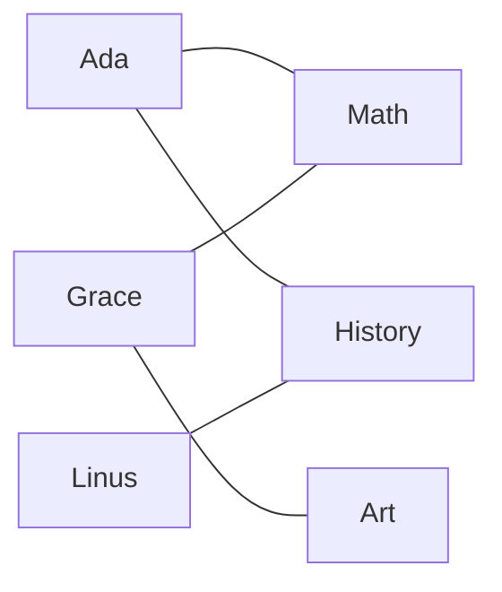
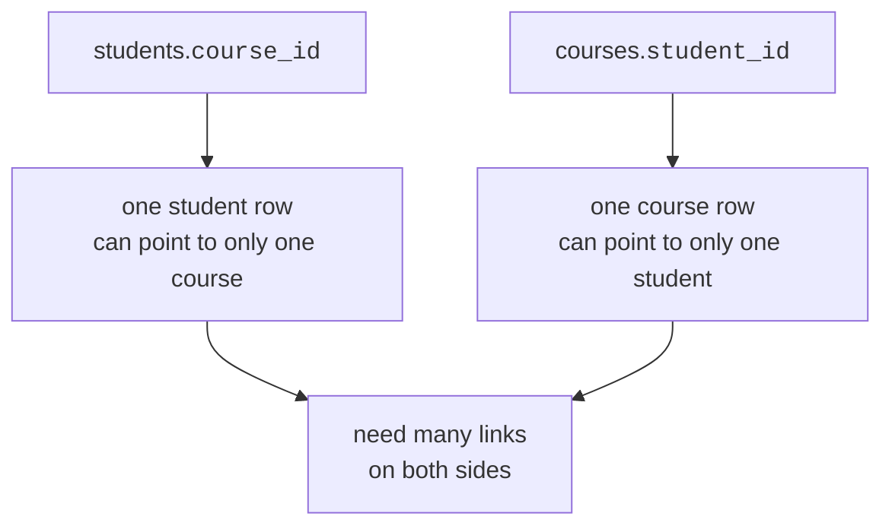
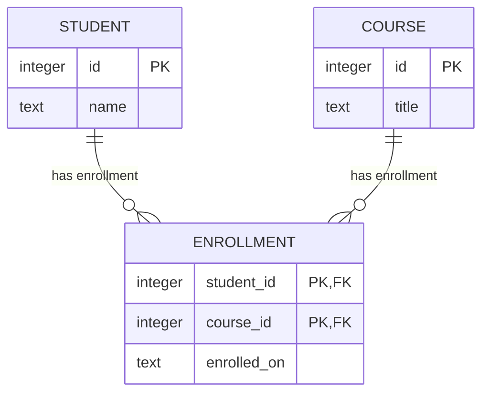
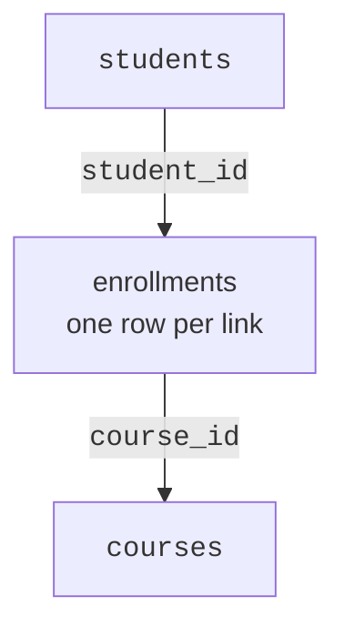
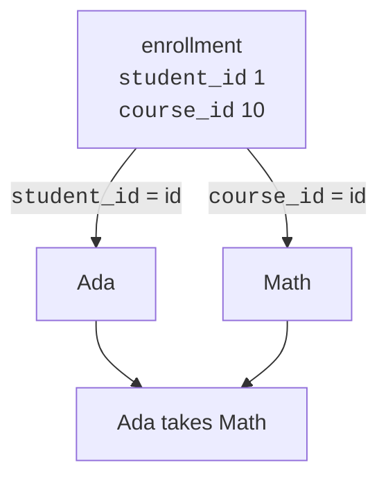

Some relationships are not one-to-many. A student can take many courses, and a course can have many students. That is a **many-to-many** relationship.



Ada connects to more than one course. Math connects to more than one student. A single foreign-key column on either table cannot describe all those crossings.

<Figure
  slug="lite-many-to-many-cutout"
  alt="Two grid platforms bridged by a small third junction platform, arrows crossing through it in both directions"
/>

## Why one foreign key is not enough

If you put `course_id` on `students`, each student could store only one course. If you put `student_id` on `courses`, each course could store only one student. Both designs lose information.

<Figure
  slug="lite-many-to-many-one-foreign-key-inline-cutout"
  alt="A crate with a single socket and four cords all needing to reach it at once"
  caption="One column can hold one link, which is why many-to-many needs another table."
/>



<MultipleChoice
  markdown={`Why can't a single \`course_id\` column on \`students\` represent students and courses correctly?

- SQLite does not allow integer columns.
  > SQLite commonly uses integer id columns.
- Primary keys cannot be joined.
  > Primary keys are often joined to foreign keys.
- Course names are too long.
  > The problem is relationship shape, not text length.
- [o] One column value can point to only one course for each student row.
  > A student who takes Math and History needs two separate links.

Many-to-many means both sides need multiple links, so one pointer column is not enough.`}
/>

## The junction table

The solution is a third table between them. It is often called a **junction table**, **bridge table**, or **join table**.

Each row in the junction table stores one connection:

```text
student 1 is enrolled in course 10
student 1 is enrolled in course 11
student 2 is enrolled in course 10
```



Read the diagram as two one-to-many relationships:

- one student can have many enrollment rows
- one course can have many enrollment rows

The many-to-many relationship becomes two ordinary one-to-many relationships meeting in the middle.

## Build the three tables

<SqlCodeBlock
  dialect="sqlite"
  title="Students, courses, and enrollments"
  initSql={`CREATE TABLE students (
  id INTEGER PRIMARY KEY,
  name TEXT
);
CREATE TABLE courses (
  id INTEGER PRIMARY KEY,
  title TEXT
);
CREATE TABLE enrollments (
  student_id INTEGER REFERENCES students(id),
  course_id INTEGER REFERENCES courses(id),
  enrolled_on TEXT,
  PRIMARY KEY (student_id, course_id)
);
INSERT INTO students (id, name) VALUES
  (1, 'Ada'), (2, 'Grace'), (3, 'Linus'), (4, 'Mae'),
  (5, 'Rosa'), (6, 'Ivan'), (7, 'Nadia'), (8, 'Omar'),
  (9, 'Priya'), (10, 'Quinn'), (11, 'Ruth'), (12, 'Sam'),
  (13, 'Tariq'), (14, 'Uma'), (15, 'Viktor'), (16, 'Wen'),
  (17, 'Xenia'), (18, 'Yusuf'), (19, 'Zara'), (20, 'Bruno'),
  (21, 'Chidi'), (22, 'Dara'), (23, 'Elif'), (24, 'Farid');
INSERT INTO courses (id, title) VALUES
  (10, 'Math'), (11, 'History'), (12, 'Art'),
  (13, 'Biology'), (14, 'Physics'), (15, 'Music');
INSERT INTO enrollments (student_id, course_id, enrolled_on) VALUES
  (1, 10, '2024-09-14'), (1, 11, '2024-09-15'), (2, 10, '2024-09-17'), (2, 12, '2024-09-19'), (3, 11, '2024-09-21'), (3, 13, '2024-09-23'),
  (4, 10, '2024-09-23'), (4, 14, '2024-09-27'), (5, 11, '2024-09-27'), (5, 12, '2024-09-28'), (6, 13, '2024-09-04'), (6, 15, '2024-09-06'),
  (7, 10, '2024-09-04'), (7, 13, '2024-09-07'), (8, 11, '2024-09-08'), (8, 14, '2024-09-11'), (9, 12, '2024-09-12'), (9, 15, '2024-09-15'),
  (10, 10, '2024-09-13'), (10, 11, '2024-09-14'), (11, 13, '2024-09-19'), (11, 14, '2024-09-20'), (12, 12, '2024-09-21'), (12, 15, '2024-09-24'),
  (13, 10, '2024-09-22'), (13, 12, '2024-09-24'), (14, 11, '2024-09-26'), (14, 15, '2024-09-02'), (15, 13, '2024-09-03'), (15, 14, '2024-09-04'),
  (16, 10, '2024-09-03'), (16, 15, '2024-09-08'), (17, 11, '2024-09-07'), (17, 12, '2024-09-08'), (18, 13, '2024-09-12'), (18, 10, '2024-09-09'),
  (19, 14, '2024-09-16'), (19, 11, '2024-09-13'), (20, 15, '2024-09-20'), (20, 12, '2024-09-17'), (21, 10, '2024-09-18'), (21, 13, '2024-09-21'),
  (22, 11, '2024-09-22'), (22, 14, '2024-09-25'), (23, 12, '2024-09-26'), (23, 15, '2024-09-01'), (24, 10, '2024-09-27'), (24, 11, '2024-09-28');`}
  starterCode={`SELECT
  *
FROM
  enrollments
ORDER BY
  student_id,
  course_id;`}
/>

The primary key is the pair `(student_id, course_id)`. That means the same student cannot be enrolled in the same course twice.



## Join across the bridge

To show names and course titles, start at `enrollments` and join outward to both parent tables.

<SqlCodeBlock
  dialect="sqlite"
  title="List students and their courses"
  initSql={`CREATE TABLE students (id INTEGER PRIMARY KEY, name TEXT);
CREATE TABLE courses (id INTEGER PRIMARY KEY, title TEXT);
CREATE TABLE enrollments (
  student_id INTEGER,
  course_id INTEGER,
  enrolled_on TEXT,
  PRIMARY KEY (student_id, course_id)
);
INSERT INTO students (id, name) VALUES
  (1, 'Ada'), (2, 'Grace'), (3, 'Linus'), (4, 'Mae'),
  (5, 'Rosa'), (6, 'Ivan'), (7, 'Nadia'), (8, 'Omar'),
  (9, 'Priya'), (10, 'Quinn'), (11, 'Ruth'), (12, 'Sam'),
  (13, 'Tariq'), (14, 'Uma'), (15, 'Viktor'), (16, 'Wen'),
  (17, 'Xenia'), (18, 'Yusuf'), (19, 'Zara'), (20, 'Bruno'),
  (21, 'Chidi'), (22, 'Dara'), (23, 'Elif'), (24, 'Farid');
INSERT INTO courses (id, title) VALUES
  (10, 'Math'), (11, 'History'), (12, 'Art'),
  (13, 'Biology'), (14, 'Physics'), (15, 'Music');
INSERT INTO enrollments (student_id, course_id, enrolled_on) VALUES
  (1, 10, '2024-09-14'), (1, 11, '2024-09-15'), (2, 10, '2024-09-17'), (2, 12, '2024-09-19'), (3, 11, '2024-09-21'), (3, 13, '2024-09-23'),
  (4, 10, '2024-09-23'), (4, 14, '2024-09-27'), (5, 11, '2024-09-27'), (5, 12, '2024-09-28'), (6, 13, '2024-09-04'), (6, 15, '2024-09-06'),
  (7, 10, '2024-09-04'), (7, 13, '2024-09-07'), (8, 11, '2024-09-08'), (8, 14, '2024-09-11'), (9, 12, '2024-09-12'), (9, 15, '2024-09-15'),
  (10, 10, '2024-09-13'), (10, 11, '2024-09-14'), (11, 13, '2024-09-19'), (11, 14, '2024-09-20'), (12, 12, '2024-09-21'), (12, 15, '2024-09-24'),
  (13, 10, '2024-09-22'), (13, 12, '2024-09-24'), (14, 11, '2024-09-26'), (14, 15, '2024-09-02'), (15, 13, '2024-09-03'), (15, 14, '2024-09-04'),
  (16, 10, '2024-09-03'), (16, 15, '2024-09-08'), (17, 11, '2024-09-07'), (17, 12, '2024-09-08'), (18, 13, '2024-09-12'), (18, 10, '2024-09-09'),
  (19, 14, '2024-09-16'), (19, 11, '2024-09-13'), (20, 15, '2024-09-20'), (20, 12, '2024-09-17'), (21, 10, '2024-09-18'), (21, 13, '2024-09-21'),
  (22, 11, '2024-09-22'), (22, 14, '2024-09-25'), (23, 12, '2024-09-26'), (23, 15, '2024-09-01'), (24, 10, '2024-09-27'), (24, 11, '2024-09-28');`}
  starterCode={`SELECT
  s.name,
  c.title,
  e.enrolled_on
FROM
  enrollments e
  JOIN students s ON s.id = e.student_id
  JOIN courses c ON c.id = e.course_id
ORDER BY
  s.name,
  c.title;`}
/>



## Ask questions from either direction

Because the junction table stores links, you can ask student-focused or course-focused questions without changing the design.

<Figure
  slug="lite-many-to-many-inline-cutout"
  alt="Two rows of crates with all cords between them routed through a small pegboard standing in the middle"
  caption="Every link goes through the junction table, so either side can ask questions."
/>

<SqlCodeBlock
  dialect="sqlite"
  title="How many students are in each course"
  initSql={`CREATE TABLE students (id INTEGER PRIMARY KEY, name TEXT);
CREATE TABLE courses (id INTEGER PRIMARY KEY, title TEXT);
CREATE TABLE enrollments (student_id INTEGER, course_id INTEGER, PRIMARY KEY (student_id, course_id));
INSERT INTO students (id, name) VALUES
  (1, 'Ada'), (2, 'Grace'), (3, 'Linus'), (4, 'Mae'),
  (5, 'Rosa'), (6, 'Ivan'), (7, 'Nadia'), (8, 'Omar'),
  (9, 'Priya'), (10, 'Quinn'), (11, 'Ruth'), (12, 'Sam'),
  (13, 'Tariq'), (14, 'Uma'), (15, 'Viktor'), (16, 'Wen'),
  (17, 'Xenia'), (18, 'Yusuf'), (19, 'Zara'), (20, 'Bruno'),
  (21, 'Chidi'), (22, 'Dara'), (23, 'Elif'), (24, 'Farid');
INSERT INTO courses (id, title) VALUES
  (10, 'Math'), (11, 'History'), (12, 'Art'),
  (13, 'Biology'), (14, 'Physics'), (15, 'Music');
INSERT INTO enrollments (student_id, course_id) VALUES
  (1, 10), (1, 11), (2, 10), (2, 12), (3, 11), (3, 13),
  (4, 10), (4, 14), (5, 11), (5, 12), (6, 13), (6, 15),
  (7, 10), (7, 13), (8, 11), (8, 14), (9, 12), (9, 15),
  (10, 10), (10, 11), (11, 13), (11, 14), (12, 12), (12, 15),
  (13, 10), (13, 12), (14, 11), (14, 15), (15, 13), (15, 14),
  (16, 10), (16, 15), (17, 11), (17, 12), (18, 13), (18, 10),
  (19, 14), (19, 11), (20, 15), (20, 12), (21, 10), (21, 13),
  (22, 11), (22, 14), (23, 12), (23, 15), (24, 10), (24, 11);`}
  starterCode={`SELECT
  c.title,
  COUNT(e.student_id) AS student_count
FROM
  courses c
  JOIN enrollments e ON e.course_id = c.id
GROUP BY
  c.id,
  c.title
ORDER BY
  student_count DESC,
  c.title;`}
/>

<SqlCodeBlock
  dialect="sqlite"
  title="How many courses each student takes"
  initSql={`CREATE TABLE students (id INTEGER PRIMARY KEY, name TEXT);
CREATE TABLE courses (id INTEGER PRIMARY KEY, title TEXT);
CREATE TABLE enrollments (student_id INTEGER, course_id INTEGER, PRIMARY KEY (student_id, course_id));
INSERT INTO students (id, name) VALUES
  (1, 'Ada'), (2, 'Grace'), (3, 'Linus'), (4, 'Mae'),
  (5, 'Rosa'), (6, 'Ivan'), (7, 'Nadia'), (8, 'Omar'),
  (9, 'Priya'), (10, 'Quinn'), (11, 'Ruth'), (12, 'Sam'),
  (13, 'Tariq'), (14, 'Uma'), (15, 'Viktor'), (16, 'Wen'),
  (17, 'Xenia'), (18, 'Yusuf'), (19, 'Zara'), (20, 'Bruno'),
  (21, 'Chidi'), (22, 'Dara'), (23, 'Elif'), (24, 'Farid');
INSERT INTO courses (id, title) VALUES
  (10, 'Math'), (11, 'History'), (12, 'Art'),
  (13, 'Biology'), (14, 'Physics'), (15, 'Music');
INSERT INTO enrollments (student_id, course_id) VALUES
  (1, 10), (1, 11), (2, 10), (2, 12), (3, 11), (3, 13),
  (4, 10), (4, 14), (5, 11), (5, 12), (6, 13), (6, 15),
  (7, 10), (7, 13), (8, 11), (8, 14), (9, 12), (9, 15),
  (10, 10), (10, 11), (11, 13), (11, 14), (12, 12), (12, 15),
  (13, 10), (13, 12), (14, 11), (14, 15), (15, 13), (15, 14),
  (16, 10), (16, 15), (17, 11), (17, 12), (18, 13), (18, 10),
  (19, 14), (19, 11), (20, 15), (20, 12), (21, 10), (21, 13),
  (22, 11), (22, 14), (23, 12), (23, 15), (24, 10), (24, 11);`}
  starterCode={`SELECT
  s.name,
  COUNT(e.course_id) AS course_count
FROM
  students s
  JOIN enrollments e ON e.student_id = s.id
GROUP BY
  s.id,
  s.name
ORDER BY
  course_count DESC,
  s.name;`}
/>

## Junction tables can hold facts about the relationship

One warning before you put a number in a junction table. Aggregating
across a join that matches each row several times inflates every `SUM()` by
the fan-out, and the result set looks perfectly ordinary:

<Chart slug="join-fanout-rows" />

A value like `grade` or `enrolled_on` belongs on `enrollments`, because it describes a particular student-course pairing. Ada's grade in Math is not just a fact about Ada, and it is not just a fact about Math. It is a fact about Ada taking Math.

<Figure
  slug="lite-many-to-many-junction-tables-can-hold-inline-cutout"
  alt="A cord running between two crates with a small tag of its own hanging from it, holding a fact that belongs to neither end"
  caption="A grade belongs to the pairing of student and course, so it lives on the junction table."
/>

<SqlCodeBlock
  dialect="sqlite"
  title="Store relationship details on the junction row"
  initSql={`CREATE TABLE students (id INTEGER PRIMARY KEY, name TEXT);
CREATE TABLE courses (id INTEGER PRIMARY KEY, title TEXT);
CREATE TABLE enrollments (
  student_id INTEGER,
  course_id INTEGER,
  grade TEXT,
  PRIMARY KEY (student_id, course_id)
);
INSERT INTO students (id, name) VALUES
  (1, 'Ada'), (2, 'Grace'), (3, 'Linus'), (4, 'Mae'),
  (5, 'Rosa'), (6, 'Ivan'), (7, 'Nadia'), (8, 'Omar'),
  (9, 'Priya'), (10, 'Quinn'), (11, 'Ruth'), (12, 'Sam'),
  (13, 'Tariq'), (14, 'Uma'), (15, 'Viktor'), (16, 'Wen'),
  (17, 'Xenia'), (18, 'Yusuf'), (19, 'Zara'), (20, 'Bruno'),
  (21, 'Chidi'), (22, 'Dara'), (23, 'Elif'), (24, 'Farid');
INSERT INTO courses (id, title) VALUES
  (10, 'Math'), (11, 'History'), (12, 'Art'),
  (13, 'Biology'), (14, 'Physics'), (15, 'Music');
INSERT INTO enrollments (student_id, course_id, grade) VALUES
  (1, 10, 'B'), (1, 11, 'C'), (2, 10, 'C'), (2, 12, 'B'), (3, 11, 'B'), (3, 13, 'B'),
  (4, 10, 'B'), (4, 14, 'A'), (5, 11, 'B'), (5, 12, 'C'), (6, 13, 'B'), (6, 15, 'B'),
  (7, 10, 'C'), (7, 13, 'A'), (8, 11, 'B'), (8, 14, 'C'), (9, 12, 'B'), (9, 15, 'B'),
  (10, 10, 'A'), (10, 11, 'B'), (11, 13, 'B'), (11, 14, 'A'), (12, 12, 'B'), (12, 15, 'C'),
  (13, 10, 'A'), (13, 12, 'A'), (14, 11, 'A'), (14, 15, 'B'), (15, 13, 'A'), (15, 14, 'B'),
  (16, 10, 'B'), (16, 15, 'B'), (17, 11, 'A'), (17, 12, 'B'), (18, 13, 'B'), (18, 10, 'A'),
  (19, 14, 'A'), (19, 11, 'A'), (20, 15, 'A'), (20, 12, 'C'), (21, 10, 'B'), (21, 13, 'B'),
  (22, 11, 'A'), (22, 14, 'B'), (23, 12, 'A'), (23, 15, 'A'), (24, 10, 'B'), (24, 11, 'A');`}
  starterCode={`SELECT
  s.name,
  c.title,
  e.grade
FROM
  enrollments e
  JOIN students s ON s.id = e.student_id
  JOIN courses c ON c.id = e.course_id
ORDER BY
  s.name,
  c.title;`}
/>

<Callout type="info" title="Naming junction tables">
Use a name that describes the relationship: \`enrollments\`, \`memberships\`, \`order_items\`, \`book_authors\`. The table is not just plumbing; it represents real connections.
</Callout>

## Check your understanding

<MultipleChoice
  markdown={`What is a junction table?

- A copy of two complete tables pasted together.
  > A junction table stores links, not duplicate copies of all data.
- [o] A table that stores one row per connection between two related tables.
  > Each row usually contains a foreign key to each side.
- A table with no primary key or foreign keys.
  > Junction tables usually rely heavily on keys.
- A table used only for sorting results.
  > Its purpose is to model relationships.

A junction table turns a many-to-many relationship into stored link rows.`}
/>

<MultipleChoice
  markdown={`In \`enrollments(student_id, course_id)\`, what does one row represent?

- [o] One student-course connection.
  > The two ids together say that a specific student is enrolled in a specific course.
- One student by themselves.
  > Student details live in the students table.
- Every student in every course.
  > One row represents one connection, not all connections.
- One course by itself.
  > Course details live in the courses table.

The junction row is the relationship instance.`}
/>

<MultipleChoice
  markdown={`Why use \`PRIMARY KEY (student_id, course_id)\` on enrollments?

- It prevents a course from having many students.
  > A course id can still appear in many enrollment rows.
- It hides the table from joins.
  > Primary keys do not hide tables.
- It makes every student take exactly one course.
  > Students can still appear in many rows with different courses.
- [o] It prevents the exact same student-course pair from being inserted twice.
  > The pair must be unique, while each individual id can repeat.

The composite primary key protects the uniqueness of each link.`}
/>

<MultipleChoice
  markdown={`Where should a \`grade\` for Ada in Math be stored?

- [o] On the enrollment row connecting Ada to Math.
  > The grade describes that specific relationship.
- On the Math course row only.
  > Each student may have a different grade in Math.
- On Ada's student row only.
  > Ada may have different grades in different courses.
- In both students and courses as copied text.
  > Copying the same fact into multiple places creates inconsistency.

Facts about the pairing belong in the junction table.`}
/>
