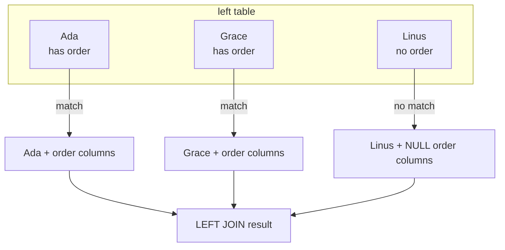
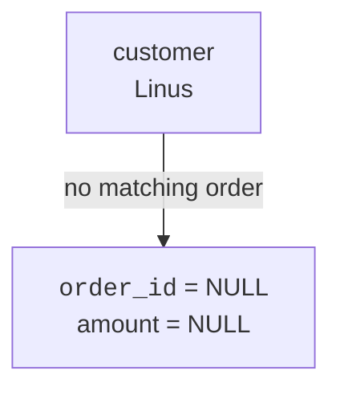
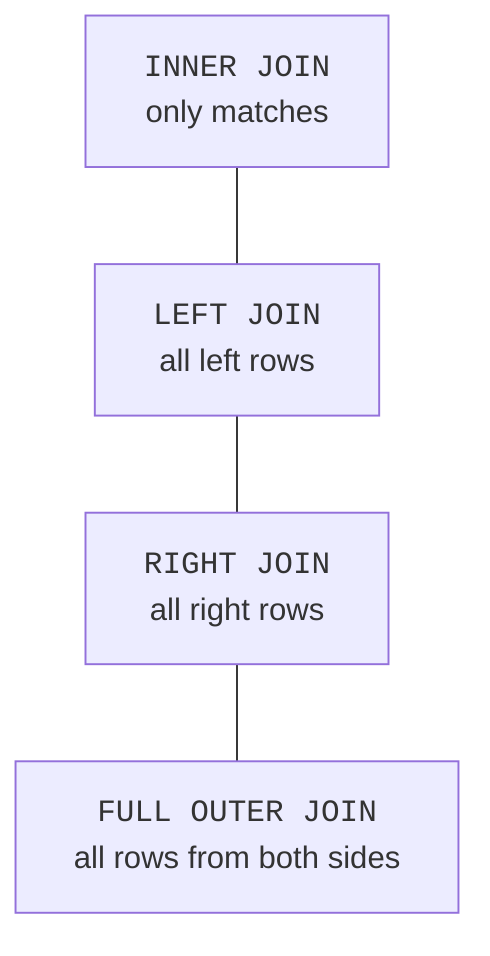

An inner join hides rows with no match. Sometimes those missing matches are exactly what you need to find:

- customers who have never ordered
- products that have never sold
- courses with no students yet

For those questions, beginners should reach first for **LEFT JOIN**.

<svg
  viewBox="0 0 640 200"
  role="img"
  aria-label="Three couples promenade along a path: two are complete pairs, and in the third a blue dot strolls beside a dotted ghost circle where its partner would be — LEFT JOIN keeps every left row and fills the missing side with NULL"
  style={{ display: "block", width: "100%", maxWidth: "640px", height: "auto", margin: "2.5rem auto" }}
>
  <g fill="currentColor" opacity="0.08">
    <path d="M 40 150 Q 320 110 600 150 L 600 184 Q 320 144 40 184 Z" />
  </g>
  <g style={{ color: "var(--ds-blue-500)" }} fill="currentColor">
    <circle cx="136" cy="124" r="14" />
    <circle cx="306" cy="112" r="14" />
    <circle cx="476" cy="118" r="14" />
  </g>
  <g style={{ color: "var(--ds-green-500)" }} fill="currentColor">
    <circle cx="172" cy="120" r="14" />
    <circle cx="342" cy="108" r="14" />
  </g>
  <g style={{ color: "var(--ds-yellow-500)" }} fill="currentColor">
    <circle cx="154" cy="104" r="5" />
    <circle cx="324" cy="92" r="5" />
  </g>
  <g fill="currentColor" opacity="0.35">
    <circle cx="512" cy="103" r="2.5" />
    <circle cx="521" cy="110" r="2.5" />
    <circle cx="524" cy="121" r="2.5" />
    <circle cx="520" cy="132" r="2.5" />
    <circle cx="511" cy="138" r="2.5" />
    <circle cx="501" cy="136" r="2.5" />
    <circle cx="495" cy="127" r="2.5" />
    <circle cx="497" cy="115" r="2.5" />
    <circle cx="504" cy="106" r="2.5" />
  </g>
  <g fill="currentColor" opacity="0.18">
    <circle cx="222" cy="48" r="4" />
    <circle cx="414" cy="40" r="4" />
    <circle cx="568" cy="62" r="4" />
    <circle cx="76" cy="58" r="4" />
  </g>
</svg>

## LEFT JOIN keeps every row from the left table

A `LEFT JOIN` keeps all rows from the first table you name. If a matching row exists on the right, SQLite includes it. If not, the right-side columns become `NULL`.

The left table is preserved. The right table is optional.

<SqlCodeBlock
  dialect="sqlite"
  title="Every customer, even those with no orders"
  initSql={`CREATE TABLE customers (
  id INTEGER PRIMARY KEY,
  name TEXT
);
CREATE TABLE orders (
  id INTEGER PRIMARY KEY,
  customer_id INTEGER,
  amount NUMERIC
);
INSERT INTO customers (id, name) VALUES
  (1, 'Ada'),
  (2, 'Grace'),
  (3, 'Linus');
INSERT INTO orders (id, customer_id, amount) VALUES
  (101, 1, 42),
  (102, 2, 99);`}
  starterCode={`SELECT
  c.name,
  o.id AS order_id,
  o.amount
FROM
  customers c
  LEFT JOIN orders o ON o.customer_id = c.id
ORDER BY
  c.name;`}
/>

Linus appears even though he has no order. His order columns are `NULL`, which means "no matching value exists here."

<MultipleChoice
  markdown={`In the LEFT JOIN above, why does Linus appear?

- Because every customer automatically gets a fake order.
  > SQLite does not create fake order rows.
- [o] Because \`customers\` is the left table, and \`LEFT JOIN\` keeps all left-table rows.
  > Unmatched left rows stay in the result with NULLs for right-side columns.
- Because NULL means zero dollars.
  > NULL means missing or absent, not zero.
- Because \`ORDER BY\` adds missing rows.
  > \`ORDER BY\` only sorts rows already in the result.

A left join preserves the left side even when the right side has no match.`}
/>

## NULLs are the honest placeholder

When SQLite cannot find a matching right-side row, it cannot show a real `orders.id` or `orders.amount`. So it shows `NULL`.

<SqlCodeBlock
  dialect="sqlite"
  title="Use COALESCE to display a friendly label"
  initSql={`CREATE TABLE customers (id INTEGER PRIMARY KEY, name TEXT);
CREATE TABLE orders (id INTEGER PRIMARY KEY, customer_id INTEGER, amount NUMERIC);
INSERT INTO customers (id, name) VALUES (1, 'Ada'), (2, 'Grace'), (3, 'Linus');
INSERT INTO orders (id, customer_id, amount) VALUES (101, 1, 42), (102, 2, 99);`}
  starterCode={`SELECT
  c.name,
  COALESCE(CAST(o.id AS TEXT), 'no order') AS order_status,
  o.amount
FROM
  customers c
  LEFT JOIN orders o ON o.customer_id = c.id
ORDER BY
  c.name;`}
/>

`COALESCE` is only for display here. The underlying missing value is still `NULL`.

## Finding unmatched rows

A `LEFT JOIN` plus `WHERE right_table.id IS NULL` is the classic pattern for "show me the rows with no match."

<SqlCodeBlock
  dialect="sqlite"
  title="Customers who have never ordered"
  initSql={`CREATE TABLE customers (id INTEGER PRIMARY KEY, name TEXT);
CREATE TABLE orders (id INTEGER PRIMARY KEY, customer_id INTEGER, amount NUMERIC);
INSERT INTO customers (id, name) VALUES
  (1, 'Ada'),
  (2, 'Grace'),
  (3, 'Linus'),
  (4, 'Mae');
INSERT INTO orders (id, customer_id, amount) VALUES
  (101, 1, 42),
  (102, 2, 99);`}
  starterCode={`SELECT
  c.name
FROM
  customers c
  LEFT JOIN orders o ON o.customer_id = c.id
WHERE
  o.id IS NULL
ORDER BY
  c.name;`}
/>

Linus and Mae are returned because their joined order id is `NULL`.

<SqlCodeBlock
  dialect="sqlite"
  title="Products that have never sold"
  initSql={`CREATE TABLE products (id INTEGER PRIMARY KEY, name TEXT);
CREATE TABLE order_items (id INTEGER PRIMARY KEY, product_id INTEGER, quantity INTEGER);
INSERT INTO products (id, name) VALUES
  (1, 'Notebook'),
  (2, 'Pencil'),
  (3, 'Mug'),
  (4, 'Sticker');
INSERT INTO order_items (id, product_id, quantity) VALUES
  (101, 1, 2),
  (102, 2, 5),
  (103, 1, 1);`}
  starterCode={`SELECT
  p.name
FROM
  products p
  LEFT JOIN order_items oi ON oi.product_id = p.id
WHERE
  oi.id IS NULL
ORDER BY
  p.name;`}
/>

This same pattern works whenever the question says "never," "missing," or "no related row."

## Counting with a left join

`COUNT(column)` ignores `NULL`, which is useful with left joins. It lets you count matching right-side rows while still keeping left-side rows with zero matches.

<SqlCodeBlock
  dialect="sqlite"
  title="Count orders for every customer"
  initSql={`CREATE TABLE customers (id INTEGER PRIMARY KEY, name TEXT);
CREATE TABLE orders (id INTEGER PRIMARY KEY, customer_id INTEGER, amount NUMERIC);
INSERT INTO customers (id, name) VALUES (1, 'Ada'), (2, 'Grace'), (3, 'Linus');
INSERT INTO orders (id, customer_id, amount) VALUES (101, 1, 42), (102, 1, 18), (103, 2, 99);`}
  starterCode={`SELECT
  c.name,
  COUNT(o.id) AS order_count
FROM
  customers c
  LEFT JOIN orders o ON o.customer_id = c.id
GROUP BY
  c.id,
  c.name
ORDER BY
  c.name;`}
/>

Linus gets `0` because there are no non-NULL order ids to count.

## A note about RIGHT and FULL OUTER JOIN in SQLite

For beginners, `LEFT JOIN` is the most important outer join. Recent SQLite versions also support `RIGHT JOIN` and `FULL OUTER JOIN`, but you can usually make your query clearer by arranging the table you want to preserve on the left and using `LEFT JOIN`.

<Callout type="info" title="How to choose">
Ask: "Which table's rows must not disappear?" Put that table first, then use \`LEFT JOIN\`.
</Callout>

## Practice challenge

The classic LEFT JOIN question, end to end: who is missing?

<SqlChallengeCard
  dialect="sqlite"
  title="Customers who have never ordered"
  instructions={`The \`customers\` and \`orders\` tables are preloaded. Return a single \`name\` column listing the customers who have **no** orders, sorted by \`name\` ascending. Use a \`LEFT JOIN\` from \`customers\` to \`orders\` on \`orders.customer_id = customers.id\`, then keep the rows where the order id \`IS NULL\`. Exactly 2 customers should appear.`}
  initSql={`CREATE TABLE customers (
  id INTEGER PRIMARY KEY,
  name TEXT
);
CREATE TABLE orders (
  id INTEGER PRIMARY KEY,
  customer_id INTEGER,
  amount NUMERIC
);
INSERT INTO customers (id, name) VALUES
  (1, 'Ada'),
  (2, 'Grace'),
  (3, 'Linus'),
  (4, 'Mae');
INSERT INTO orders (id, customer_id, amount) VALUES
  (101, 1, 42),
  (102, 1, 18),
  (103, 2, 99);`}
  starterCode={`SELECT
  c.name
FROM
  customers c
  LEFT JOIN orders o ON o.customer_id = c.id
ORDER BY
  c.name;`}
  solutionSql={`SELECT
  c.name
FROM
  customers c
  LEFT JOIN orders o ON o.customer_id = c.id
WHERE
  o.id IS NULL
ORDER BY
  c.name ASC;`}
  tests={[
    {
      id: "columns",
      name: "Has a single name column",
      description: "Only the customer name is returned",
      expectedColumns: ["name"],
    },
    {
      id: "row_count",
      name: "Returns 2 rows",
      description: "Only the customers with no orders",
      expectedRowCount: 2,
    },
    {
      id: "rows",
      name: "Linus and Mae, alphabetically",
      description: "The two customers with no matching order",
      expectedRows: {
        columns: ["name"],
        ordered: true,
        values: [["Linus"], ["Mae"]],
      },
    },
  ]}
/>

## Check your understanding

<MultipleChoice
  markdown={`What does a LEFT JOIN keep?

- Only rows that match in both tables.
  > That is the rule for an inner join.
- [o] Every row from the left table, with NULLs for right-side columns when no match exists.
  > A left join preserves the first table named in the join.
- Every row from the right table only.
  > That describes a right join idea, not a left join.
- No rows with NULLs.
  > Left joins often produce NULLs for missing right-side data.

A left join keeps the left table's rows safe from disappearing.`}
/>

<MultipleChoice
  markdown={`What do right-side NULLs mean in a LEFT JOIN result?

- The matching row exists but all values are zero.
  > NULL means missing, not zero.
- [o] No matching right-side row was found for that left-side row.
  > SQLite fills the missing side with NULLs.
- The query sorted the row incorrectly.
  > Sorting does not create NULL matches.
- The table was deleted.
  > A SELECT join does not delete source tables.

NULLs are how an outer join represents absent related data.`}
/>

<MultipleChoice
  markdown={`Which pattern finds customers who have never ordered?

- \`INNER JOIN\` customers to orders.
  > Inner joins drop customers without orders.
- [o] \`LEFT JOIN\` orders, then \`WHERE o.id IS NULL\`.
  > Keep all customers first, then filter to the ones with no matching order.
- \`LEFT JOIN\` orders, then \`WHERE o.id IS NOT NULL\`.
  > That keeps customers who do have orders.
- Select only from the orders table.
  > Customers with no orders do not appear in the orders table.

The unmatched pattern is left join plus an IS NULL test on the right side.`}
/>

<MultipleChoice
  markdown={`Why is LEFT JOIN usually the first outer join to learn?

- It is the only join SQLite can ever run.
  > Recent SQLite supports other outer joins too, but left join remains the everyday tool.
- [o] It clearly expresses "keep this table's rows even when related rows are missing."
  > Put the must-keep table on the left and preserve it with \`LEFT JOIN\`.
- It never returns NULL.
  > Left joins commonly return NULLs for the missing side.
- It changes the database structure.
  > Joins read data; they do not alter table definitions.

LEFT JOIN gives you a simple way to keep one side and reveal missing matches.`}
/>
