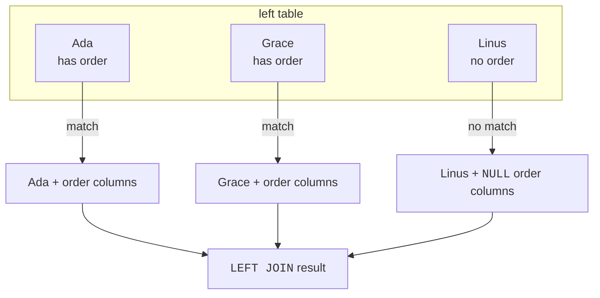
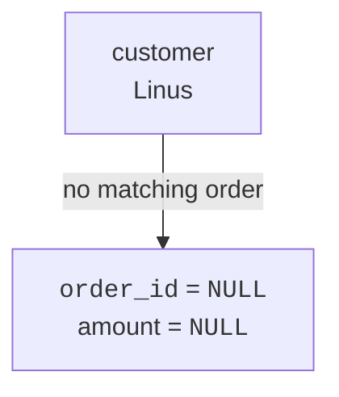
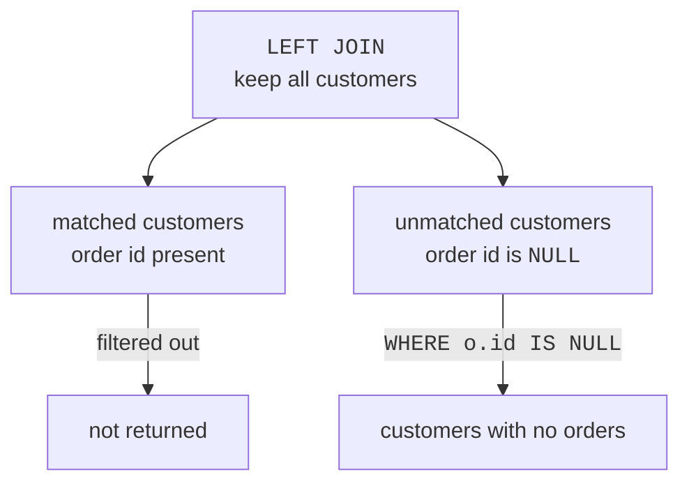

An inner join hides rows with no match. Sometimes those missing matches are exactly what you need to find:

- customers who have never ordered
- products that have never sold
- courses with no students yet

For those questions, beginners should reach first for **LEFT JOIN**.

<Figure
  slug="lite-outer-joins-cutout"
  alt="Two grid platforms joined at the middle, every row of the left platform lifting out, the unmatched ones carrying an empty hole"
/>

## LEFT JOIN keeps every row from the left table

A `LEFT JOIN` keeps all rows from the first table you name. If a matching row exists on the right, SQLite includes it. If not, the right-side columns become `NULL`.

<SyntaxBreakdown
  parts={[
    { text: "FROM customers", label: "the left table, every row survives" },
    { text: "LEFT JOIN" },
    { text: "orders", label: "the right table, optional" },
    { text: "ON customers.id = orders.customer_id", label: "no match here means NULLs" },
  ]}
/>

The left table is preserved. The right table is optional.

<SqlCodeBlock
  dialect="sqlite"
  title="Every customer, even those with no orders"
  initSql={`CREATE TABLE customers (
  id INTEGER PRIMARY KEY,
  name TEXT
);
CREATE TABLE orders (
  id INTEGER PRIMARY KEY,
  customer_id INTEGER,
  amount NUMERIC
);
INSERT INTO customers (id, name) VALUES
  (1, 'Ada'), (2, 'Grace'), (3, 'Linus'), (4, 'Mae'),
  (5, 'Rosa'), (6, 'Ivan'), (7, 'Nadia'), (8, 'Omar'),
  (9, 'Priya'), (10, 'Quinn'), (11, 'Ruth'), (12, 'Sam'),
  (13, 'Tariq'), (14, 'Uma'), (15, 'Viktor'), (16, 'Wen'),
  (17, 'Xenia'), (18, 'Yusuf'), (19, 'Zara'), (20, 'Bruno'),
  (21, 'Chidi'), (22, 'Dara'), (23, 'Elif'), (24, 'Farid');
INSERT INTO orders (id, customer_id, amount) VALUES
  (101, 1, 42), (102, 1, 18), (103, 2, 99), (104, 2, 15),
  (105, 5, 30), (106, 5, 76), (107, 6, 22), (108, 7, 64),
  (109, 8, 12), (110, 8, 48), (111, 9, 91), (112, 11, 27),
  (113, 11, 55), (114, 12, 38), (115, 13, 19), (116, 13, 83),
  (117, 14, 45), (118, 15, 61), (119, 16, 24), (120, 16, 70),
  (121, 17, 33), (122, 18, 88), (123, 20, 16), (124, 20, 52),
  (125, 21, 29), (126, 22, 74), (127, 22, 21), (128, 23, 95),
  (129, 24, 36), (130, 1, 57), (131, 9, 40), (132, 17, 68);`}
  starterCode={`SELECT
  c.name,
  o.id AS order_id,
  o.amount
FROM
  customers c
  LEFT JOIN orders o ON o.customer_id = c.id
ORDER BY
  c.name;`}
/>

Linus appears even though he has no order. His order columns are `NULL`, which means "no matching value exists here."

<MultipleChoice
  markdown={`In the LEFT JOIN above, why does Linus appear?

- Because \`ORDER BY\` adds missing rows.
  > \`ORDER BY\` only sorts rows already in the result.
- Because NULL means zero dollars.
  > NULL means missing or absent, not zero.
- Because every customer automatically gets a fake order.
  > SQLite does not create fake order rows.
- [o] Because \`customers\` is the left table, and \`LEFT JOIN\` keeps all left-table rows.
  > Unmatched left rows stay in the result with NULLs for right-side columns.

A left join preserves the left side even when the right side has no match.`}
/>

## NULLs are the honest placeholder

When SQLite cannot find a matching right-side row, it cannot show a real `orders.id` or `orders.amount`. So it shows `NULL`.

<SqlCodeBlock
  dialect="sqlite"
  title="Use COALESCE to display a friendly label"
  initSql={`CREATE TABLE customers (id INTEGER PRIMARY KEY, name TEXT);
CREATE TABLE orders (id INTEGER PRIMARY KEY, customer_id INTEGER, amount NUMERIC);
INSERT INTO customers (id, name) VALUES
  (1, 'Ada'), (2, 'Grace'), (3, 'Linus'), (4, 'Mae'),
  (5, 'Rosa'), (6, 'Ivan'), (7, 'Nadia'), (8, 'Omar'),
  (9, 'Priya'), (10, 'Quinn'), (11, 'Ruth'), (12, 'Sam'),
  (13, 'Tariq'), (14, 'Uma'), (15, 'Viktor'), (16, 'Wen'),
  (17, 'Xenia'), (18, 'Yusuf'), (19, 'Zara'), (20, 'Bruno'),
  (21, 'Chidi'), (22, 'Dara'), (23, 'Elif'), (24, 'Farid');
INSERT INTO orders (id, customer_id, amount) VALUES
  (101, 1, 42), (102, 1, 18), (103, 2, 99), (104, 2, 15),
  (105, 5, 30), (106, 5, 76), (107, 6, 22), (108, 7, 64),
  (109, 8, 12), (110, 8, 48), (111, 9, 91), (112, 11, 27),
  (113, 11, 55), (114, 12, 38), (115, 13, 19), (116, 13, 83),
  (117, 14, 45), (118, 15, 61), (119, 16, 24), (120, 16, 70),
  (121, 17, 33), (122, 18, 88), (123, 20, 16), (124, 20, 52),
  (125, 21, 29), (126, 22, 74), (127, 22, 21), (128, 23, 95),
  (129, 24, 36), (130, 1, 57), (131, 9, 40), (132, 17, 68);`}
  starterCode={`SELECT
  c.name,
  COALESCE(CAST(o.id AS TEXT), 'no order') AS order_status,
  o.amount
FROM
  customers c
  LEFT JOIN orders o ON o.customer_id = c.id
ORDER BY
  c.name;`}
/>

`COALESCE()` is only for display here. The underlying missing value is still `NULL`.

## Finding unmatched rows

A `LEFT JOIN` plus `WHERE right_table.id IS NULL` is the classic pattern for "show me the rows with no match."

<SqlCodeBlock
  dialect="sqlite"
  title="Customers who have never ordered"
  initSql={`CREATE TABLE customers (id INTEGER PRIMARY KEY, name TEXT);
CREATE TABLE orders (id INTEGER PRIMARY KEY, customer_id INTEGER, amount NUMERIC);
INSERT INTO customers (id, name) VALUES
  (1, 'Ada'), (2, 'Grace'), (3, 'Linus'), (4, 'Mae'),
  (5, 'Rosa'), (6, 'Ivan'), (7, 'Nadia'), (8, 'Omar'),
  (9, 'Priya'), (10, 'Quinn'), (11, 'Ruth'), (12, 'Sam'),
  (13, 'Tariq'), (14, 'Uma'), (15, 'Viktor'), (16, 'Wen'),
  (17, 'Xenia'), (18, 'Yusuf'), (19, 'Zara'), (20, 'Bruno'),
  (21, 'Chidi'), (22, 'Dara'), (23, 'Elif'), (24, 'Farid');
INSERT INTO orders (id, customer_id, amount) VALUES
  (101, 1, 42), (102, 1, 18), (103, 2, 99), (104, 2, 15),
  (105, 5, 30), (106, 5, 76), (107, 6, 22), (108, 7, 64),
  (109, 8, 12), (110, 8, 48), (111, 9, 91), (112, 11, 27),
  (113, 11, 55), (114, 12, 38), (115, 13, 19), (116, 13, 83),
  (117, 14, 45), (118, 15, 61), (119, 16, 24), (120, 16, 70),
  (121, 17, 33), (122, 18, 88), (123, 20, 16), (124, 20, 52),
  (125, 21, 29), (126, 22, 74), (127, 22, 21), (128, 23, 95),
  (129, 24, 36), (130, 1, 57), (131, 9, 40), (132, 17, 68);`}
  starterCode={`SELECT
  c.name
FROM
  customers c
  LEFT JOIN orders o ON o.customer_id = c.id
WHERE
  o.id IS NULL
ORDER BY
  c.name;`}
/>

Four names come back (Linus, Mae, Quinn, and Zara) because those are
the rows whose joined order id is `NULL`. Notice how little the query
had to say: no `NOT IN`, no subquery, just "join everything, then keep
the rows where the match failed."

<SqlCodeBlock
  dialect="sqlite"
  title="Products that have never sold"
  initSql={`CREATE TABLE products (id INTEGER PRIMARY KEY, name TEXT);
CREATE TABLE order_items (id INTEGER PRIMARY KEY, product_id INTEGER, quantity INTEGER);
INSERT INTO products (id, name) VALUES
  (1, 'Notebook'), (2, 'Pencil'), (3, 'Mug'), (4, 'Sticker'),
  (5, 'Tote bag'), (6, 'Desk lamp'), (7, 'Eraser'), (8, 'Ruler'),
  (9, 'Wall clock'), (10, 'Coaster'), (11, 'Bookmark'), (12, 'Poster'),
  (13, 'Keyring'), (14, 'Notepad'), (15, 'Pen refill'), (16, 'Envelope'),
  (17, 'Gift box'), (18, 'Ink bottle'), (19, 'Stamp set'), (20, 'Paperweight'),
  (21, 'Chalk'), (22, 'Binder'), (23, 'Label roll'), (24, 'Tape dispenser');
INSERT INTO order_items (id, product_id, quantity) VALUES
  (101, 1, 2), (102, 2, 5), (103, 1, 1), (104, 5, 3),
  (105, 6, 1), (106, 8, 4), (107, 9, 2), (108, 11, 6),
  (109, 12, 1), (110, 14, 2), (111, 14, 5), (112, 16, 3),
  (113, 17, 1), (114, 18, 2), (115, 20, 4), (116, 21, 1),
  (117, 22, 3), (118, 22, 2), (119, 24, 5), (120, 5, 1),
  (121, 8, 2), (122, 12, 7), (123, 17, 1), (124, 1, 4);`}
  starterCode={`SELECT
  p.name
FROM
  products p
  LEFT JOIN order_items oi ON oi.product_id = p.id
WHERE
  oi.id IS NULL
ORDER BY
  p.name;`}
/>

Eight of the 24 products have never appeared in an order. Try deleting
the `WHERE` line and running the query again: now every product comes
back, most of them paired with an order item and the unsold ones
carrying `NULL`. Toggling that one line is the clearest way to see what
a left join actually produces before the filter narrows it down.

This same pattern works whenever the question says "never," "missing," or "no related row."

## Counting with a left join

`COUNT(column)` ignores `NULL`, which is useful with left joins. It lets you count matching right-side rows while still keeping left-side rows with zero matches.

<SqlCodeBlock
  dialect="sqlite"
  title="Count orders for every customer"
  initSql={`CREATE TABLE customers (id INTEGER PRIMARY KEY, name TEXT);
CREATE TABLE orders (id INTEGER PRIMARY KEY, customer_id INTEGER, amount NUMERIC);
INSERT INTO customers (id, name) VALUES
  (1, 'Ada'), (2, 'Grace'), (3, 'Linus'), (4, 'Mae'),
  (5, 'Rosa'), (6, 'Ivan'), (7, 'Nadia'), (8, 'Omar'),
  (9, 'Priya'), (10, 'Quinn'), (11, 'Ruth'), (12, 'Sam'),
  (13, 'Tariq'), (14, 'Uma'), (15, 'Viktor'), (16, 'Wen'),
  (17, 'Xenia'), (18, 'Yusuf'), (19, 'Zara'), (20, 'Bruno'),
  (21, 'Chidi'), (22, 'Dara'), (23, 'Elif'), (24, 'Farid');
INSERT INTO orders (id, customer_id, amount) VALUES
  (101, 1, 42), (102, 1, 18), (103, 2, 99), (104, 2, 15),
  (105, 5, 30), (106, 5, 76), (107, 6, 22), (108, 7, 64),
  (109, 8, 12), (110, 8, 48), (111, 9, 91), (112, 11, 27),
  (113, 11, 55), (114, 12, 38), (115, 13, 19), (116, 13, 83),
  (117, 14, 45), (118, 15, 61), (119, 16, 24), (120, 16, 70),
  (121, 17, 33), (122, 18, 88), (123, 20, 16), (124, 20, 52),
  (125, 21, 29), (126, 22, 74), (127, 22, 21), (128, 23, 95),
  (129, 24, 36), (130, 1, 57), (131, 9, 40), (132, 17, 68);`}
  starterCode={`SELECT
  c.name,
  COUNT(o.id) AS order_count
FROM
  customers c
  LEFT JOIN orders o ON o.customer_id = c.id
GROUP BY
  c.id,
  c.name
ORDER BY
  c.name;`}
/>

Linus, Mae, Quinn, and Zara each get `0`, because there are no non-NULL
order ids to count for them. This is the difference that catches people
out: `COUNT(*)` would have given them `1`, since the left join still
produced one row per customer. `COUNT(o.id)` counts actual matches, and
that is almost always the number you want.

## A note about RIGHT and FULL OUTER JOIN in SQLite

For beginners, `LEFT JOIN` is the most important outer join. Recent SQLite versions also support `RIGHT JOIN` and `FULL OUTER JOIN`, but you can usually make your query clearer by arranging the table you want to preserve on the left and using `LEFT JOIN`.

<Figure
  slug="lite-outer-joins-inline-cutout"
  alt="Two racks pushed together where every card from the left rack is kept, unmatched ones paired with a blank"
  caption="Put the table you want to keep on the left and a left join covers most needs."
/>

<Chart slug="sql-join-types" />

<Callout type="info" title="How to choose">
Ask: "Which table's rows must not disappear?" Put that table first, then use `LEFT JOIN`.
</Callout>

## Practice challenge

The classic LEFT JOIN question, end to end: who is missing?

<SqlChallengeCard
  dialect="sqlite"
  title="Customers who have never ordered"
  instructions={`The \`customers\` and \`orders\` tables are preloaded. Return a single \`name\` column listing the customers who have **no** orders, sorted by \`name\` ascending. Use a \`LEFT JOIN\` from \`customers\` to \`orders\` on \`orders.customer_id = customers.id\`, then keep the rows where the order id \`IS NULL\`. Exactly 4 of the 24 customers should appear.`}
  initSql={`CREATE TABLE customers (
  id INTEGER PRIMARY KEY,
  name TEXT
);
CREATE TABLE orders (
  id INTEGER PRIMARY KEY,
  customer_id INTEGER,
  amount NUMERIC
);
INSERT INTO customers (id, name) VALUES
  (1, 'Ada'), (2, 'Grace'), (3, 'Linus'), (4, 'Mae'),
  (5, 'Rosa'), (6, 'Ivan'), (7, 'Nadia'), (8, 'Omar'),
  (9, 'Priya'), (10, 'Quinn'), (11, 'Ruth'), (12, 'Sam'),
  (13, 'Tariq'), (14, 'Uma'), (15, 'Viktor'), (16, 'Wen'),
  (17, 'Xenia'), (18, 'Yusuf'), (19, 'Zara'), (20, 'Bruno'),
  (21, 'Chidi'), (22, 'Dara'), (23, 'Elif'), (24, 'Farid');
INSERT INTO orders (id, customer_id, amount) VALUES
  (101, 1, 42), (102, 1, 18), (103, 2, 99), (104, 2, 15),
  (105, 5, 30), (106, 5, 76), (107, 6, 22), (108, 7, 64),
  (109, 8, 12), (110, 8, 48), (111, 9, 91), (112, 11, 27),
  (113, 11, 55), (114, 12, 38), (115, 13, 19), (116, 13, 83),
  (117, 14, 45), (118, 15, 61), (119, 16, 24), (120, 16, 70),
  (121, 17, 33), (122, 18, 88), (123, 20, 16), (124, 20, 52),
  (125, 21, 29), (126, 22, 74), (127, 22, 21), (128, 23, 95),
  (129, 24, 36), (130, 1, 57), (131, 9, 40), (132, 17, 68);`}
  starterCode={`SELECT
  c.name
FROM
  customers c
  LEFT JOIN orders o ON o.customer_id = c.id
ORDER BY
  c.name;`}
  solutionSql={`SELECT
  c.name
FROM
  customers c
  LEFT JOIN orders o ON o.customer_id = c.id
WHERE
  o.id IS NULL
ORDER BY
  c.name ASC;`}
  tests={[
    {
      id: "columns",
      name: "Has a single name column",
      description: "Only the customer name is returned",
      expectedColumns: ["name"],
    },
    {
      id: "row_count",
      name: "Returns 4 rows",
      description: "Only the customers with no orders",
      expectedRowCount: 4,
    },
    {
      id: "rows",
      name: "Linus, Mae, Quinn, and Zara, alphabetically",
      description: "The four customers with no matching order",
      expectedRows: {
        columns: ["name"],
        ordered: true,
        values: [["Linus"], ["Mae"], ["Quinn"], ["Zara"]],
      },
    },
  ]}
/>

## Check your understanding

<MultipleChoice
  markdown={`What does a LEFT JOIN keep?

- Every row from the right table only.
  > That describes a right join idea, not a left join.
- [o] Every row from the left table, with NULLs for right-side columns when no match exists.
  > A left join preserves the first table named in the join.
- Only rows that match in both tables.
  > That is the rule for an inner join.
- No rows with NULLs.
  > Left joins often produce NULLs for missing right-side data.

A left join keeps the left table's rows safe from disappearing.`}
/>

<MultipleChoice
  markdown={`What do right-side NULLs mean in a LEFT JOIN result?

- The query sorted the row incorrectly.
  > Sorting does not create NULL matches.
- [o] No matching right-side row was found for that left-side row.
  > SQLite fills the missing side with NULLs.
- The matching row exists but all values are zero.
  > NULL means missing, not zero.
- The table was deleted.
  > A SELECT join does not delete source tables.

NULLs are how an outer join represents absent related data.`}
/>

<MultipleChoice
  markdown={`Which pattern finds customers who have never ordered?

- Select only from the orders table.
  > Customers with no orders do not appear in the orders table.
- \`LEFT JOIN\` orders, then \`WHERE o.id IS NOT NULL\`.
  > That keeps customers who do have orders.
- \`INNER JOIN\` customers to orders.
  > Inner joins drop customers without orders.
- [o] \`LEFT JOIN\` orders, then \`WHERE o.id IS NULL\`.
  > Keep all customers first, then filter to the ones with no matching order.

The unmatched pattern is left join plus an IS NULL test on the right side.`}
/>

<MultipleChoice
  markdown={`Why is LEFT JOIN usually the first outer join to learn?

- It is the only join SQLite can ever run.
  > Recent SQLite supports other outer joins too, but left join remains the everyday tool.
- It never returns NULL.
  > Left joins commonly return NULLs for the missing side.
- It changes the database structure.
  > Joins read data; they do not alter table definitions.
- [o] It clearly expresses "keep this table's rows even when related rows are missing."
  > Put the must-keep table on the left and preserve it with \`LEFT JOIN\`.

LEFT JOIN gives you a simple way to keep one side and reveal missing matches.`}
/>
