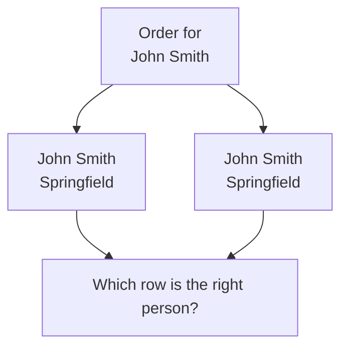
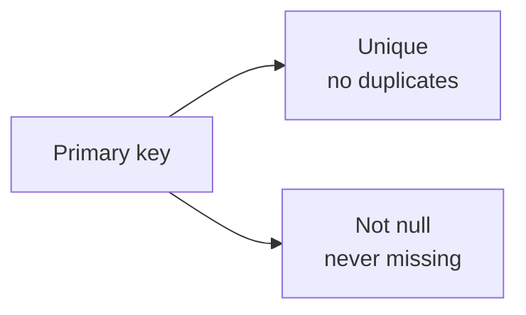
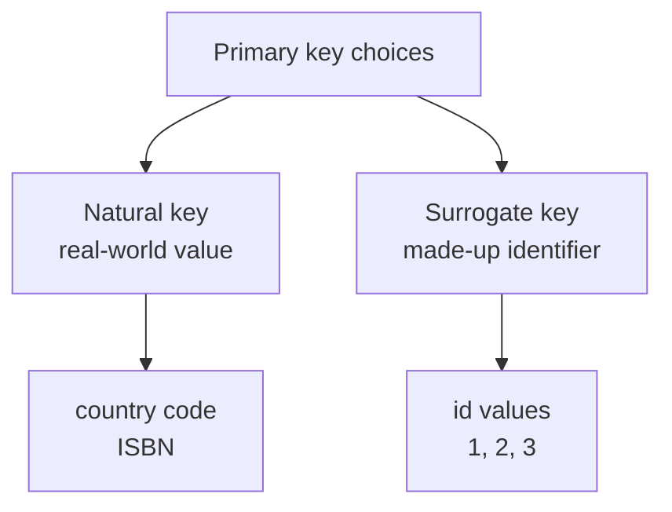
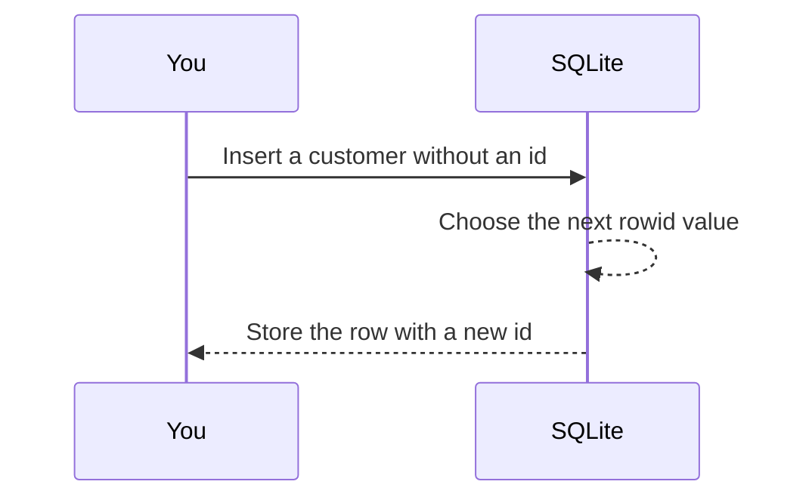
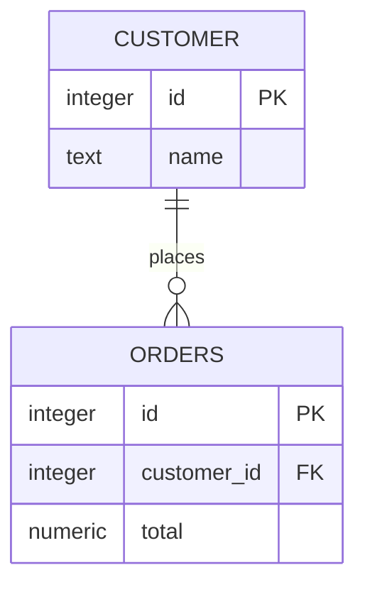

Imagine two people have the same name. If your table only stores names, how can SQLite tell them apart?

That is the job of a **primary key**: it gives each row a reliable identity.

<svg
  viewBox="0 0 640 200"
  role="img"
  aria-label="A table card where three rows carry identical gray content bars, told apart only by the distinct colored key square each row holds in the highlighted key column — the primary key is what makes look-alike rows unique"
  style={{ display: "block", width: "100%", maxWidth: "560px", height: "auto", margin: "2.5rem auto" }}
>
  <g style={{ color: "var(--ds-blue-500)" }} fill="currentColor">
    <rect x="120" y="32" width="400" height="140" rx="12" fillOpacity="0.08" />
    <rect x="140" y="44" width="56" height="116" rx="8" fillOpacity="0.15" />
    <rect x="156" y="56" width="24" height="24" rx="6" />
  </g>
  <g style={{ color: "var(--ds-green-500)" }} fill="currentColor">
    <rect x="156" y="96" width="24" height="24" rx="6" />
  </g>
  <g style={{ color: "var(--ds-yellow-500)" }} fill="currentColor">
    <rect x="156" y="136" width="24" height="24" rx="6" />
  </g>
  <g fill="var(--ds-gray-300)">
    <rect x="220" y="60" width="180" height="16" rx="8" />
    <rect x="416" y="60" width="80" height="16" rx="8" />
    <rect x="220" y="100" width="180" height="16" rx="8" />
    <rect x="416" y="100" width="80" height="16" rx="8" />
    <rect x="220" y="140" width="180" height="16" rx="8" />
    <rect x="416" y="140" width="80" height="16" rx="8" />
  </g>
</svg>

## The identity problem

Two rows can look almost the same:



Names can repeat. Addresses can repeat. Phone numbers can change. A table needs one value that means: **this exact row, not any other row**.

## What a primary key is

A **primary key** is a column, or sometimes a combination of columns, that uniquely identifies each row in a table.

For beginners, the most common pattern in SQLite is a column named `id`, as in this `customers` table:

| id (primary key) | name | city |
| --- | --- | --- |
| 1 | John Smith | Springfield |
| 2 | John Smith | Springfield |
| 3 | Maya Chen | Denver |

Now the two John Smith rows are not confused:

- Customer `1` is one person.
- Customer `2` is another person.

The `id` value is the row's identity inside this table.

## The two promises of a primary key

A primary key gives two important guarantees:



1. **Unique**: no two rows may have the same primary key value.
2. **Not null**: every row must have an identity value.

Those promises make the key safe to use when you need to point to a specific row.

<MultipleChoice
  markdown={`Why is a person's name usually a poor primary key?

- Names cannot be stored as text in SQLite.
  > SQLite can store names as text; storage is not the issue.
- [o] Names can repeat, change, or be missing.
  > A primary key should be unique, stable, and present for every row.
- Names are always longer than numbers.
  > Length is less important than reliability as an identifier.
- SQLite only allows primary keys on price columns.
  > A primary key can be declared on many kinds of columns; the design choice matters.`}
/>

## Natural keys and surrogate keys

There are two common ways to choose a primary key.



A **natural key** is a real-world value that is already unique, such as a country code.

A **surrogate key** is a made-up value used only to identify the row, such as `id = 1`.

Surrogate keys are very common because they are simple and stable. The number does not have to mean anything. Its job is only to identify the row.

## SQLite's special `INTEGER PRIMARY KEY`

In SQLite, this declaration is special:

```sql
id INTEGER PRIMARY KEY
```

It makes `id` an alias for SQLite's internal **rowid**. In plain language: SQLite can automatically assign a new whole-number id when you insert a row and leave `id` out.



<Callout type="info" title="No SERIAL in SQLite">
SQLite does not use PostgreSQL's `SERIAL` type. For the usual beginner auto-id pattern, write `id INTEGER PRIMARY KEY`.
</Callout>

## See it in SQLite

Run this example. Notice that the `INSERT` statements do not provide ids. SQLite fills them in.

<SqlCodeBlock
  dialect="sqlite"
  title="Auto-assigned integer primary keys"
  initSql={`CREATE TABLE customers (
  id INTEGER PRIMARY KEY,
  name TEXT,
  city TEXT
);

INSERT INTO customers (name, city) VALUES
  ('Ada', 'London'),
  ('Grace', 'Arlington'),
  ('Lin', 'Taipei');`}
  starterCode={`SELECT
  id,
  name,
  city
FROM
  customers
ORDER BY
  id;`}
/>

You should see ids like `1`, `2`, and `3`. Those ids are stable row identities you can use in other tables later.

## Primary keys help tables connect

Primary keys are especially important when one table refers to another.



The `orders.customer_id` value points to a customer's `id`. Without primary keys, that link would be unreliable.

## Check your understanding

<MultipleChoice
  markdown={`What is the main purpose of a primary key?

- To make a table display in rainbow colors.
  > Display style is unrelated to primary keys.
- [o] To uniquely identify each row in a table.
  > A primary key gives each row a dependable identity.
- To force every value in the table to be text.
  > Primary keys identify rows; they do not make every column text.
- To delete duplicate rows automatically.
  > A primary key prevents duplicate key values, but it does not automatically decide which existing rows to delete.`}
/>

<MultipleChoice
  markdown={`Which SQLite column definition is the usual beginner pattern for an automatically assigned id?

- \`id SERIAL PRIMARY KEY\`
  > \`SERIAL\` is a PostgreSQL pattern, not SQLite's usual syntax.
- [o] \`id INTEGER PRIMARY KEY\`
  > In SQLite, \`INTEGER PRIMARY KEY\` aliases the rowid and can auto-assign ids.
- \`id TEXT ALWAYS NUMBER\`
  > This is not valid SQLite syntax.
- \`id BOOLEAN PRIMARY KEY\`
  > SQLite does not have a separate boolean storage class, and true/false would not give many unique ids.`}
/>

<MultipleChoice
  markdown={`What two rules does a primary key provide?

- It must be alphabetic and lowercase.
  > Primary keys are often numbers, and letter case is not the key rule.
- It must be sorted and visible.
  > Sorting is separate from identity.
- [o] It must be unique and not null.
  > These guarantees make each row's identity reliable.
- It must contain the row's full description.
  > A primary key should identify the row, not store every fact about it.`}
/>

<MultipleChoice
  markdown={`A surrogate key is best described as what?

- A real-world value like a person's current phone number.
  > That is closer to a natural value, and it may change.
- [o] A made-up identifier, often an id number, created only to identify a row.
  > Surrogate keys are artificial values used for stable row identity.
- A column that stores several names in one cell.
  > That is not a key; it is a messy storage pattern.
- A query that sorts a table.
  > Sorting uses clauses such as \`ORDER BY\`, not surrogate keys.`}
/>
