A relational database is powerful because tables can **relate** to each other.

Instead of storing every fact in one giant table, you store each kind of thing in its own table, then connect the tables with key values.

<Figure
  slug="lite-relationships-intro-cutout"
  alt="Three grid platforms at different heights joined by connector arrows, one arrow fanning out to many rows"
/>

## Why not one giant table?

Imagine an orders table that repeats the customer's details on every order.

| order_id | order_date | customer_name | customer_phone | total |
| --- | --- | --- | --- | --- |
| 101 | 2026-01-05 | Ada | 555-0101 | 42.00 |
| 102 | 2026-01-12 | Ada | 555-0101 | 18.00 |

Ada's phone number is copied in multiple rows. If it changes, you must find and update every copy. Miss one copy, and the database disagrees with itself.

The relational solution is to store each fact once.

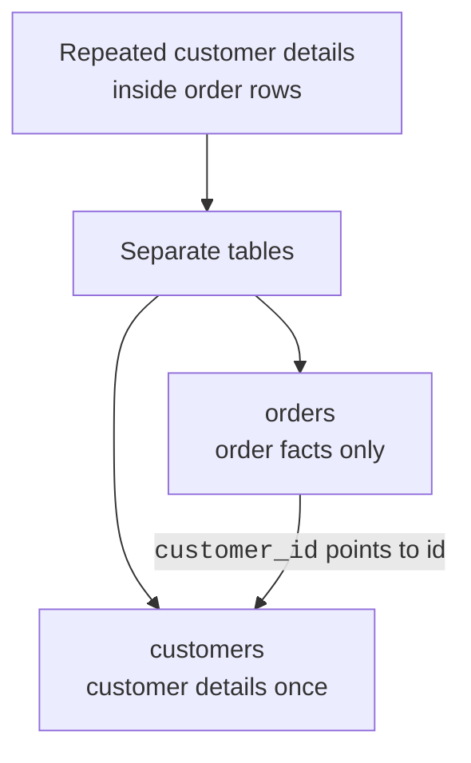

## Tables connect through keys

The customer table has a primary key: `customers.id`. The orders table stores a matching value: `orders.customer_id`.

<Figure
  slug="lite-relationships-intro-inline-cutout"
  alt="Two small boards joined by one cord running between a tagged row in each"
/>

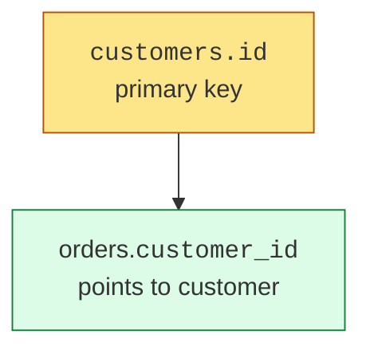

That pointing column is called a **foreign key**. You will learn foreign keys in more detail later. For now, remember the picture: one table stores the identity, and another table stores that identity to create a link.

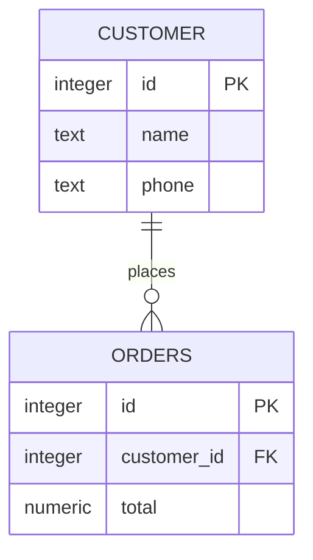

Read it as: one customer can place many orders, and each order belongs to one customer.

## Relationship shape 1: one-to-many

**One-to-many** is the most common relationship shape.

Examples:

- One customer has many orders.
- One author writes many books.
- One city has many residents.

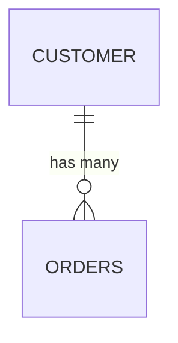

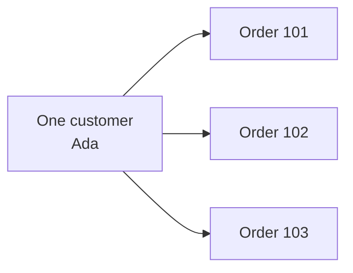

The key question is: can one row on the left match many rows on the right? If yes, you may have a one-to-many relationship.

<MultipleChoice
  markdown={`Which example is a one-to-many relationship?

- [o] One customer can place many orders, and each order belongs to one customer.
  > One row on the customer side can connect to many rows on the order side.
- Many students can take many courses.
  > That is many-to-many because both sides can have many.
- One table has one column.
  > Table shape is not the same as a relationship between rows in two tables.
- One passport belongs to one person, and one person has one passport.
  > That is one-to-one.`}
/>

## Relationship shape 2: one-to-one

A **one-to-one** relationship means one row here matches at most one row there.

Examples:

- One person has one passport.
- One employee has one employee profile.
- One product has one detailed specification row.

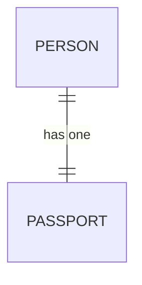

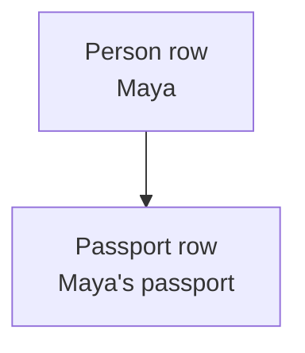

One-to-one relationships are less common than one-to-many. They are often used when you want to keep optional or rarely used details in a separate table.

## Relationship shape 3: many-to-many

A **many-to-many** relationship means many rows on each side can connect to many rows on the other side.

Examples:

- Many students take many courses.
- Many actors appear in many movies.
- Many recipes use many ingredients.

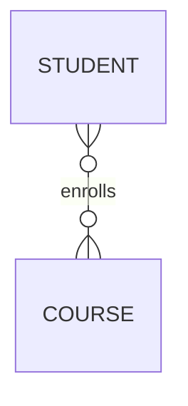

In real tables, many-to-many relationships usually need a helper table.

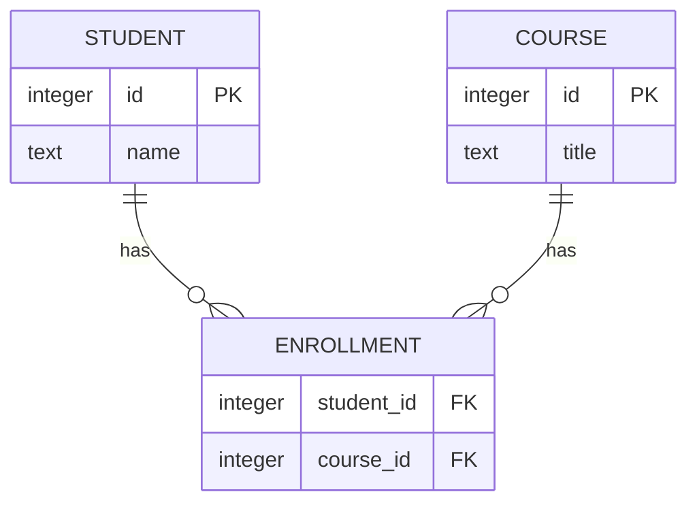

The helper table stores the pairs: which student is in which course.

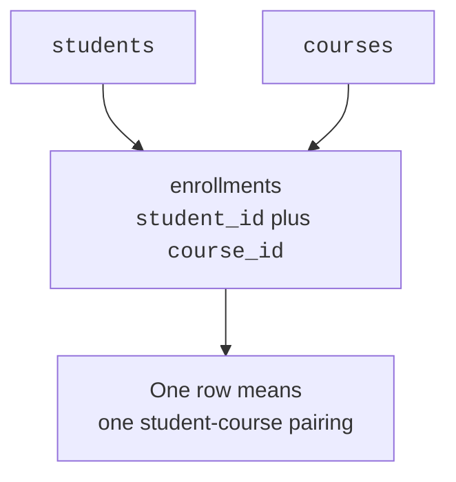

## See a relationship in SQLite

This example stores customers once and orders separately. The query joins them so you can read order totals beside customer names.

<SqlCodeBlock
  dialect="sqlite"
  title="Follow a customer-to-orders relationship"
  initSql={`CREATE TABLE customers (
  id INTEGER PRIMARY KEY,
  name TEXT,
  phone TEXT
);

CREATE TABLE orders (
  id INTEGER PRIMARY KEY,
  customer_id INTEGER,
  total NUMERIC
);

INSERT INTO customers (name, phone) VALUES
  ('Ada', '555-0101'),
  ('Grace', '555-0102');

INSERT INTO orders (customer_id, total) VALUES
  (1, 42.00),
  (1, 18.00),
  (2, 99.00);`}
  starterCode={`SELECT
  customers.name,
  orders.id AS order_id,
  orders.total
FROM
  orders
  JOIN customers ON orders.customer_id = customers.id
ORDER BY
  customers.name,
  orders.id;`}
/>

Ada appears twice in the result because she has two orders. But Ada's customer row is stored only once.

## Read every relationship two ways

A relationship is easier when you say it from both directions.

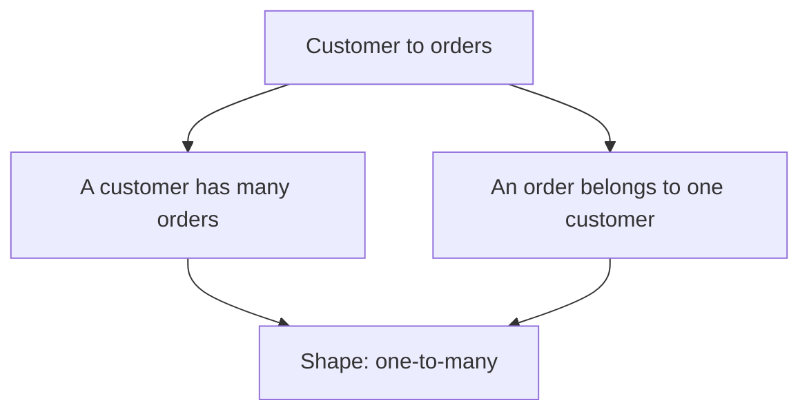

This two-sentence habit helps you choose the correct relationship shape.

## Check your understanding

<MultipleChoice
  markdown={`Why do relational databases often split data across multiple tables?

- [o] To store each kind of thing once and connect related facts with keys.
  > Separate tables reduce duplication while relationships keep the data connected.
- Because queries are not allowed to combine tables.
  > Queries can combine related tables with joins.
- To make the same fact appear in as many places as possible.
  > Repeating facts is exactly what good relational design tries to avoid.
- Because SQLite cannot store more than one table.
  > A SQLite database can contain many tables.`}
/>

<MultipleChoice
  markdown={`In an \`orders\` table, what does \`customer_id\` usually do?

- It sorts orders by total automatically.
  > Sorting requires \`ORDER BY\`.
- It stores the customer's entire phone history.
  > A key column stores an identifier, not every customer detail.
- [o] It points to the matching customer's primary key value.
  > This is how an order can be connected to the customer who placed it.
- It forces all customers to have the same name.
  > A key relationship does not change customer names.`}
/>

<MultipleChoice
  markdown={`A student can take many courses, and a course can have many students. What shape is this?

- [o] Many-to-many.
  > Both sides can connect to many rows on the other side.
- No relationship.
  > Students and courses are related through enrollment.
- One-to-one.
  > One-to-one would allow only one match on each side.
- One-to-many.
  > One-to-many has many on only one side.`}
/>

<MultipleChoice
  markdown={`Why does a many-to-many relationship usually need a helper table?

- [o] To store each pairing between one row on the first side and one row on the second side.
  > For students and courses, the helper table can store one student-course enrollment per row.
- To make all rows identical.
  > The helper table records meaningful pairs, not identical rows.
- To store the database password.
  > Helper tables model relationships; they do not store passwords.
- To prevent primary keys from existing.
  > Helper tables often use keys to connect rows.`}
/>
