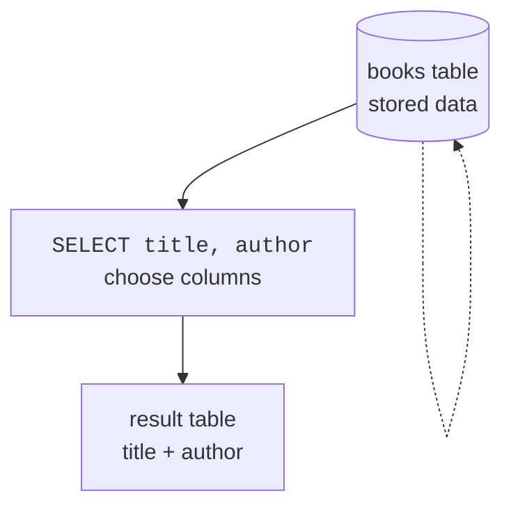
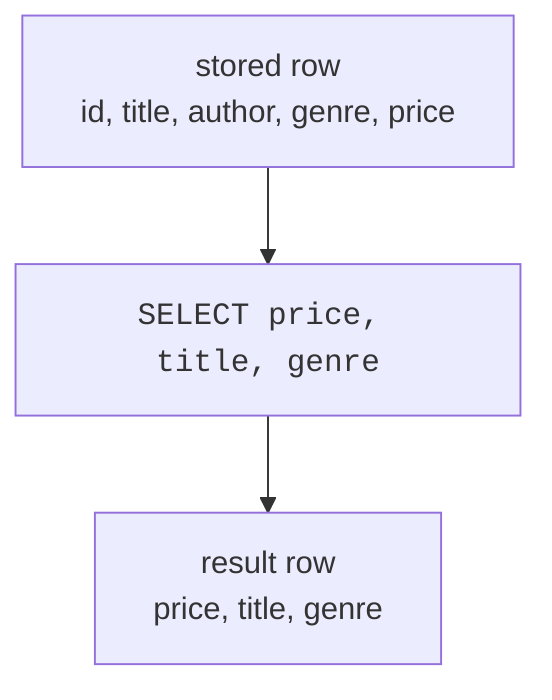

`SELECT` is the SQL word you will use most often. It asks a database to
read data and return an answer. On this page, you will use `SELECT` to
choose which **columns** you want from a table.

A helpful first idea: a `SELECT` query does **not** change the stored
table. It creates a temporary result table for you to look at.

<Figure
  slug="lite-select-basics-cutout"
  alt="A grid platform with two of its columns lifted out onto a small temporary result tray beside it"
/>

## SELECT chooses columns

Imagine a table like a spreadsheet. It has rows going down and columns
going across. `SELECT` names the columns you want to see, and `FROM`
names the table that holds them.

<SqlCodeBlock
  dialect="sqlite"
  title="Pick two columns"
  initSql={`CREATE TABLE books (
  id INTEGER PRIMARY KEY,
  title TEXT,
  author TEXT,
  genre TEXT,
  price NUMERIC,
  pages INTEGER
);
INSERT INTO books (title, author, genre, price, pages) VALUES
  ('The Solar Bakery', 'Mina Park', 'Fiction', 12.99, 240),
  ('Data Garden', 'Owen Lee', 'Technology', 29.50, 410),
  ('Pocket Rivers', 'Lena Ortiz', 'Travel', 16.00, 180),
  ('SQL Street', 'Mina Park', 'Technology', 24.00, 320),
  ('Cloud Recipes', 'Ava Stone', 'Fiction', 18.25, 275),
  ('The Paper Compass', 'Lena Ortiz', 'Travel', 14.50, 210),
  ('Quiet Harbors', 'Ava Stone', 'Fiction', 11.75, 195),
  ('SQL for Gardeners', 'Owen Lee', 'Technology', 34.00, 480),
  ('Marble and Ash', 'Tomas Vega', 'History', 22.40, 365),
  ('The Salt Road', 'Lena Ortiz', 'Travel', 19.99, 288),
  ('Night Market Notes', 'Ava Stone', 'Cooking', 15.60, 200),
  ('Index of Small Birds', 'Mina Park', 'Fiction', 13.40, 168),
  ('Hard Drive Blues', 'Owen Lee', 'Technology', 27.75, 352),
  ('The Copper Atlas', 'Tomas Vega', 'History', 31.20, 445),
  ('Slow Dough', 'Priya Raman', 'Cooking', 9.99, 150),
  ('Ferry to Alder Bay', 'Lena Ortiz', 'Fiction', 17.10, 262),
  ('Query of the Day', 'Owen Lee', 'Technology', 21.35, 298),
  ('Cartography for Cats', 'Tomas Vega', 'Travel', 26.80, 330),
  ('The Winter Larder', 'Priya Raman', 'Cooking', 23.15, 312),
  ('Letters from Harbin', 'Mina Park', 'History', 28.90, 398),
  ('Sugar and Smoke', 'Priya Raman', 'Cooking', 12.25, 176),
  ('The Glass Meridian', 'Ava Stone', 'Fiction', 35.50, 512),
  ('SQL at Midnight', 'Owen Lee', 'Technology', 16.90, 232),
  ('Rain on the Steppe', 'Tomas Vega', 'Travel', 10.40, 158);`}
  starterCode={`SELECT
  title,
  author
FROM
  books;`}
/>

You asked for `title` and `author`, so the result has exactly those two
columns. By default, SQLite returns those columns for **every row** in
the table.

## SELECT star means every column

The asterisk, `*`, is shorthand for "all columns." It is useful when
you are exploring a table for the first time.

<Figure
  slug="lite-select-basics-select-chooses-columns-inline-cutout"
  alt="A wide board with three of its columns copied onto a smaller board"
  caption="`SELECT` chooses which columns come back, and `*` means all of them."
/>

<SqlCodeBlock
  dialect="sqlite"
  title="Show every column"
  initSql={`CREATE TABLE books (
  id INTEGER PRIMARY KEY,
  title TEXT,
  author TEXT,
  genre TEXT,
  price NUMERIC,
  pages INTEGER
);
INSERT INTO books (title, author, genre, price, pages) VALUES
  ('The Solar Bakery', 'Mina Park', 'Fiction', 12.99, 240),
  ('Data Garden', 'Owen Lee', 'Technology', 29.50, 410),
  ('Pocket Rivers', 'Lena Ortiz', 'Travel', 16.00, 180),
  ('SQL Street', 'Mina Park', 'Technology', 24.00, 320),
  ('Cloud Recipes', 'Ava Stone', 'Fiction', 18.25, 275),
  ('The Paper Compass', 'Lena Ortiz', 'Travel', 14.50, 210),
  ('Quiet Harbors', 'Ava Stone', 'Fiction', 11.75, 195),
  ('SQL for Gardeners', 'Owen Lee', 'Technology', 34.00, 480),
  ('Marble and Ash', 'Tomas Vega', 'History', 22.40, 365),
  ('The Salt Road', 'Lena Ortiz', 'Travel', 19.99, 288),
  ('Night Market Notes', 'Ava Stone', 'Cooking', 15.60, 200),
  ('Index of Small Birds', 'Mina Park', 'Fiction', 13.40, 168),
  ('Hard Drive Blues', 'Owen Lee', 'Technology', 27.75, 352),
  ('The Copper Atlas', 'Tomas Vega', 'History', 31.20, 445),
  ('Slow Dough', 'Priya Raman', 'Cooking', 9.99, 150),
  ('Ferry to Alder Bay', 'Lena Ortiz', 'Fiction', 17.10, 262),
  ('Query of the Day', 'Owen Lee', 'Technology', 21.35, 298),
  ('Cartography for Cats', 'Tomas Vega', 'Travel', 26.80, 330),
  ('The Winter Larder', 'Priya Raman', 'Cooking', 23.15, 312),
  ('Letters from Harbin', 'Mina Park', 'History', 28.90, 398),
  ('Sugar and Smoke', 'Priya Raman', 'Cooking', 12.25, 176),
  ('The Glass Meridian', 'Ava Stone', 'Fiction', 35.50, 512),
  ('SQL at Midnight', 'Owen Lee', 'Technology', 16.90, 232),
  ('Rain on the Steppe', 'Tomas Vega', 'Travel', 10.40, 158);`}
  starterCode={`SELECT
  *
FROM
  books;`}
/>

`SELECT *` is great for a quick peek. In real work, naming only the
columns you need is usually clearer.

<MultipleChoice
  markdown={`If you write \`SELECT title, price FROM books;\`, which columns appear in the result?

- [o] Only \`title\` and \`price\`.
  > The \`SELECT\` list controls the columns in the result.
- Only rows where the title has a price.
  > Choosing rows is the job of \`WHERE\`, not the basic \`SELECT\` list.
- Every column in the table.
  > Listing column names is more specific than \`*\`; it returns only the columns you named.
- A count of books.
  > Counting rows uses an aggregate function such as \`COUNT(*)\`.`}
/>

## Choose the order of output columns

The result columns appear in the order you write them. You do not have
to follow the table's original column order.

<SqlCodeBlock
  dialect="sqlite"
  title="Put price before title"
  initSql={`CREATE TABLE books (
  id INTEGER PRIMARY KEY,
  title TEXT,
  author TEXT,
  genre TEXT,
  price NUMERIC,
  pages INTEGER
);
INSERT INTO books (title, author, genre, price, pages) VALUES
  ('The Solar Bakery', 'Mina Park', 'Fiction', 12.99, 240),
  ('Data Garden', 'Owen Lee', 'Technology', 29.50, 410),
  ('Pocket Rivers', 'Lena Ortiz', 'Travel', 16.00, 180),
  ('SQL Street', 'Mina Park', 'Technology', 24.00, 320),
  ('Cloud Recipes', 'Ava Stone', 'Fiction', 18.25, 275),
  ('The Paper Compass', 'Lena Ortiz', 'Travel', 14.50, 210),
  ('Quiet Harbors', 'Ava Stone', 'Fiction', 11.75, 195),
  ('SQL for Gardeners', 'Owen Lee', 'Technology', 34.00, 480),
  ('Marble and Ash', 'Tomas Vega', 'History', 22.40, 365),
  ('The Salt Road', 'Lena Ortiz', 'Travel', 19.99, 288),
  ('Night Market Notes', 'Ava Stone', 'Cooking', 15.60, 200),
  ('Index of Small Birds', 'Mina Park', 'Fiction', 13.40, 168),
  ('Hard Drive Blues', 'Owen Lee', 'Technology', 27.75, 352),
  ('The Copper Atlas', 'Tomas Vega', 'History', 31.20, 445),
  ('Slow Dough', 'Priya Raman', 'Cooking', 9.99, 150),
  ('Ferry to Alder Bay', 'Lena Ortiz', 'Fiction', 17.10, 262),
  ('Query of the Day', 'Owen Lee', 'Technology', 21.35, 298),
  ('Cartography for Cats', 'Tomas Vega', 'Travel', 26.80, 330),
  ('The Winter Larder', 'Priya Raman', 'Cooking', 23.15, 312),
  ('Letters from Harbin', 'Mina Park', 'History', 28.90, 398),
  ('Sugar and Smoke', 'Priya Raman', 'Cooking', 12.25, 176),
  ('The Glass Meridian', 'Ava Stone', 'Fiction', 35.50, 512),
  ('SQL at Midnight', 'Owen Lee', 'Technology', 16.90, 232),
  ('Rain on the Steppe', 'Tomas Vega', 'Travel', 10.40, 158);`}
  starterCode={`SELECT
  price,
  title,
  genre
FROM
  books;`}
/>

This query does not reorder the stored table. It only changes the shape
of the result you receive.

## Pick one column

You can select just one column when that is all you need.

<Figure
  slug="lite-select-basics-inline-cutout"
  alt="A wide board with a narrow frame laid over three of its columns, only what the frame covers copied onto a smaller board"
  caption="The query copies out the part of the table you framed."
/>

<SqlCodeBlock
  dialect="sqlite"
  title="List book titles"
  initSql={`CREATE TABLE books (
  id INTEGER PRIMARY KEY,
  title TEXT,
  author TEXT,
  genre TEXT,
  price NUMERIC,
  pages INTEGER
);
INSERT INTO books (title, author, genre, price, pages) VALUES
  ('The Solar Bakery', 'Mina Park', 'Fiction', 12.99, 240),
  ('Data Garden', 'Owen Lee', 'Technology', 29.50, 410),
  ('Pocket Rivers', 'Lena Ortiz', 'Travel', 16.00, 180),
  ('SQL Street', 'Mina Park', 'Technology', 24.00, 320),
  ('Cloud Recipes', 'Ava Stone', 'Fiction', 18.25, 275),
  ('The Paper Compass', 'Lena Ortiz', 'Travel', 14.50, 210),
  ('Quiet Harbors', 'Ava Stone', 'Fiction', 11.75, 195),
  ('SQL for Gardeners', 'Owen Lee', 'Technology', 34.00, 480),
  ('Marble and Ash', 'Tomas Vega', 'History', 22.40, 365),
  ('The Salt Road', 'Lena Ortiz', 'Travel', 19.99, 288),
  ('Night Market Notes', 'Ava Stone', 'Cooking', 15.60, 200),
  ('Index of Small Birds', 'Mina Park', 'Fiction', 13.40, 168),
  ('Hard Drive Blues', 'Owen Lee', 'Technology', 27.75, 352),
  ('The Copper Atlas', 'Tomas Vega', 'History', 31.20, 445),
  ('Slow Dough', 'Priya Raman', 'Cooking', 9.99, 150),
  ('Ferry to Alder Bay', 'Lena Ortiz', 'Fiction', 17.10, 262),
  ('Query of the Day', 'Owen Lee', 'Technology', 21.35, 298),
  ('Cartography for Cats', 'Tomas Vega', 'Travel', 26.80, 330),
  ('The Winter Larder', 'Priya Raman', 'Cooking', 23.15, 312),
  ('Letters from Harbin', 'Mina Park', 'History', 28.90, 398),
  ('Sugar and Smoke', 'Priya Raman', 'Cooking', 12.25, 176),
  ('The Glass Meridian', 'Ava Stone', 'Fiction', 35.50, 512),
  ('SQL at Midnight', 'Owen Lee', 'Technology', 16.90, 232),
  ('Rain on the Steppe', 'Tomas Vega', 'Travel', 10.40, 158);`}
  starterCode={`SELECT
  title
FROM
  books;`}
/>

## Remove duplicates with DISTINCT

Sometimes you do not want every row. You want the list of different
values that appear in a column. `DISTINCT` removes duplicate result
rows.

<SyntaxBreakdown
  parts={[
    { text: "SELECT" },
    { text: "DISTINCT", label: "collapse repeats into one" },
    { text: "genre", label: "the column whose different values you want" },
    { text: "FROM books;" },
  ]}
/>

<SqlCodeBlock
  dialect="sqlite"
  title="Unique genres"
  initSql={`CREATE TABLE books (
  id INTEGER PRIMARY KEY,
  title TEXT,
  author TEXT,
  genre TEXT,
  price NUMERIC,
  pages INTEGER
);
INSERT INTO books (title, author, genre, price, pages) VALUES
  ('The Solar Bakery', 'Mina Park', 'Fiction', 12.99, 240),
  ('Data Garden', 'Owen Lee', 'Technology', 29.50, 410),
  ('Pocket Rivers', 'Lena Ortiz', 'Travel', 16.00, 180),
  ('SQL Street', 'Mina Park', 'Technology', 24.00, 320),
  ('Cloud Recipes', 'Ava Stone', 'Fiction', 18.25, 275),
  ('The Paper Compass', 'Lena Ortiz', 'Travel', 14.50, 210),
  ('Quiet Harbors', 'Ava Stone', 'Fiction', 11.75, 195),
  ('SQL for Gardeners', 'Owen Lee', 'Technology', 34.00, 480),
  ('Marble and Ash', 'Tomas Vega', 'History', 22.40, 365),
  ('The Salt Road', 'Lena Ortiz', 'Travel', 19.99, 288),
  ('Night Market Notes', 'Ava Stone', 'Cooking', 15.60, 200),
  ('Index of Small Birds', 'Mina Park', 'Fiction', 13.40, 168),
  ('Hard Drive Blues', 'Owen Lee', 'Technology', 27.75, 352),
  ('The Copper Atlas', 'Tomas Vega', 'History', 31.20, 445),
  ('Slow Dough', 'Priya Raman', 'Cooking', 9.99, 150),
  ('Ferry to Alder Bay', 'Lena Ortiz', 'Fiction', 17.10, 262),
  ('Query of the Day', 'Owen Lee', 'Technology', 21.35, 298),
  ('Cartography for Cats', 'Tomas Vega', 'Travel', 26.80, 330),
  ('The Winter Larder', 'Priya Raman', 'Cooking', 23.15, 312),
  ('Letters from Harbin', 'Mina Park', 'History', 28.90, 398),
  ('Sugar and Smoke', 'Priya Raman', 'Cooking', 12.25, 176),
  ('The Glass Meridian', 'Ava Stone', 'Fiction', 35.50, 512),
  ('SQL at Midnight', 'Owen Lee', 'Technology', 16.90, 232),
  ('Rain on the Steppe', 'Tomas Vega', 'Travel', 10.40, 158);`}
  starterCode={`SELECT DISTINCT
  genre
FROM
  books;`}
/>

There are 24 books, but only five genres. That gap is the point:
`DISTINCT` answers "what categories exist?" without making you read
every row and keep a tally in your head. The bigger the table, the more
work it saves you.

`DISTINCT` works on the whole selected row. If you select two columns,
SQLite keeps each unique combination of those two columns.

<SqlCodeBlock
  dialect="sqlite"
  title="Unique author and genre pairs"
  initSql={`CREATE TABLE books (
  id INTEGER PRIMARY KEY,
  title TEXT,
  author TEXT,
  genre TEXT,
  price NUMERIC,
  pages INTEGER
);
INSERT INTO books (title, author, genre, price, pages) VALUES
  ('The Solar Bakery', 'Mina Park', 'Fiction', 12.99, 240),
  ('Data Garden', 'Owen Lee', 'Technology', 29.50, 410),
  ('Pocket Rivers', 'Lena Ortiz', 'Travel', 16.00, 180),
  ('SQL Street', 'Mina Park', 'Technology', 24.00, 320),
  ('Cloud Recipes', 'Ava Stone', 'Fiction', 18.25, 275),
  ('The Paper Compass', 'Lena Ortiz', 'Travel', 14.50, 210),
  ('Quiet Harbors', 'Ava Stone', 'Fiction', 11.75, 195),
  ('SQL for Gardeners', 'Owen Lee', 'Technology', 34.00, 480),
  ('Marble and Ash', 'Tomas Vega', 'History', 22.40, 365),
  ('The Salt Road', 'Lena Ortiz', 'Travel', 19.99, 288),
  ('Night Market Notes', 'Ava Stone', 'Cooking', 15.60, 200),
  ('Index of Small Birds', 'Mina Park', 'Fiction', 13.40, 168),
  ('Hard Drive Blues', 'Owen Lee', 'Technology', 27.75, 352),
  ('The Copper Atlas', 'Tomas Vega', 'History', 31.20, 445),
  ('Slow Dough', 'Priya Raman', 'Cooking', 9.99, 150),
  ('Ferry to Alder Bay', 'Lena Ortiz', 'Fiction', 17.10, 262),
  ('Query of the Day', 'Owen Lee', 'Technology', 21.35, 298),
  ('Cartography for Cats', 'Tomas Vega', 'Travel', 26.80, 330),
  ('The Winter Larder', 'Priya Raman', 'Cooking', 23.15, 312),
  ('Letters from Harbin', 'Mina Park', 'History', 28.90, 398),
  ('Sugar and Smoke', 'Priya Raman', 'Cooking', 12.25, 176),
  ('The Glass Meridian', 'Ava Stone', 'Fiction', 35.50, 512),
  ('SQL at Midnight', 'Owen Lee', 'Technology', 16.90, 232),
  ('Rain on the Steppe', 'Tomas Vega', 'Travel', 10.40, 158);`}
  starterCode={`SELECT DISTINCT
  author,
  genre
FROM
  books;`}
/>

## Check your understanding

<MultipleChoice
  markdown={`What does \`SELECT * FROM books;\` return?

- No rows, only column names.
  > \`SELECT *\` returns data rows as well as column names.
- [o] Every column from \`books\`.
  > \`*\` is shorthand for all columns in the table.
- Only the first column.
  > The asterisk means all columns, not one column.
- Only unique rows.
  > Removing duplicates requires \`DISTINCT\`.`}
/>

<MultipleChoice
  markdown={`Does a \`SELECT\` query change the stored table?

- [o] No, it reads data and returns a temporary result.
  > A basic \`SELECT\` is safe because it does not modify stored data.
- Only when you use \`DISTINCT\`.
  > \`DISTINCT\` changes the result, not the stored table.
- Yes, it deletes columns you did not select.
  > Unselected columns simply do not appear in the result; they remain stored.
- Yes, it permanently rearranges the columns.
  > Column order in the result does not change the table definition.`}
/>

<MultipleChoice
  markdown={`A table has genres \`Fiction\`, \`Technology\`, \`Fiction\`, and \`Travel\`. What does \`SELECT DISTINCT genre\` return?

- Four rows, including both \`Fiction\` values.
  > \`DISTINCT\` removes repeated result rows.
- Nothing, because one value repeats.
  > Repeated values are allowed; duplicates are simply collapsed.
- Only \`Fiction\`, because it appears most often.
  > \`DISTINCT\` does not choose the most common value; it keeps every unique value.
- [o] Three rows, one for each different genre.
  > Each unique genre appears once.`}
/>
