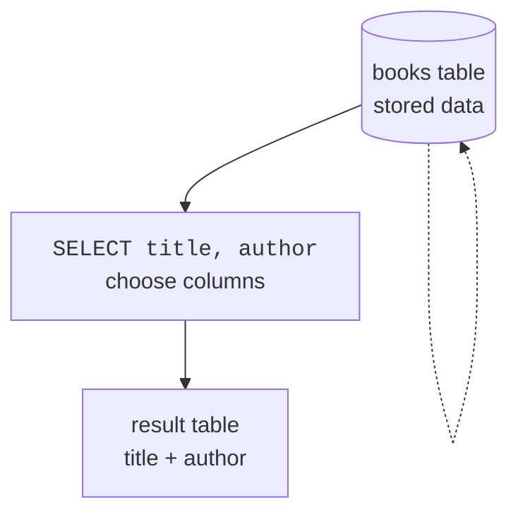
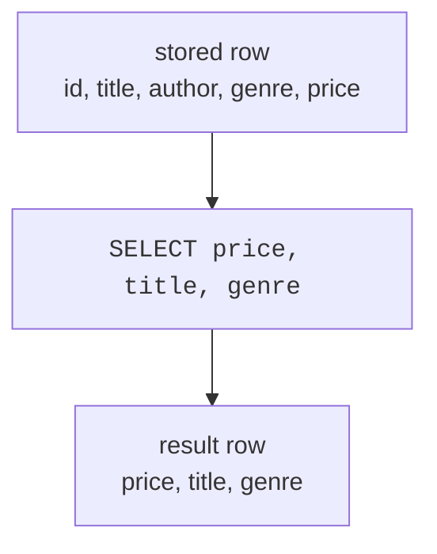

`SELECT` is the SQL word you will use most often. It asks a database to
read data and return an answer. On this page, you will use `SELECT` to
choose which **columns** you want from a table.

A helpful first idea: a `SELECT` query does **not** change the stored
table. It creates a temporary result table for you to look at.

<svg
  viewBox="0 0 640 240"
  role="img"
  aria-label="A garden bed grows four columns of flowers, one color per column, and a vase on the right holds a bouquet picked from just the blue and yellow columns while the garden keeps every flower — SELECT chooses columns to look at without changing the stored table"
  style={{ display: "block", width: "100%", maxWidth: "640px", height: "auto", margin: "2.5rem auto" }}
>
  <g fill="currentColor" opacity="0.12">
    <rect x="56" y="196" width="300" height="14" rx="7" />
  </g>
  <g style={{ color: "var(--ds-green-500)" }} fill="currentColor">
    <rect x="88" y="92" width="3.5" height="104" rx="1.75" fillOpacity="0.4" />
    <rect x="158" y="104" width="3.5" height="92" rx="1.75" fillOpacity="0.4" />
    <rect x="228" y="92" width="3.5" height="104" rx="1.75" fillOpacity="0.4" />
    <rect x="298" y="104" width="3.5" height="92" rx="1.75" fillOpacity="0.4" />
    <rect x="118" y="128" width="3.5" height="68" rx="1.75" fillOpacity="0.4" />
    <rect x="188" y="136" width="3.5" height="60" rx="1.75" fillOpacity="0.4" />
    <rect x="258" y="128" width="3.5" height="68" rx="1.75" fillOpacity="0.4" />
    <rect x="328" y="136" width="3.5" height="60" rx="1.75" fillOpacity="0.4" />
  </g>
  <g style={{ color: "var(--ds-blue-500)" }} fill="currentColor">
    <circle cx="90" cy="86" r="9" />
    <circle cx="120" cy="122" r="7" fillOpacity="0.75" />
  </g>
  <g style={{ color: "var(--ds-green-500)" }} fill="currentColor">
    <circle cx="160" cy="98" r="9" />
    <circle cx="190" cy="130" r="7" fillOpacity="0.75" />
  </g>
  <g style={{ color: "var(--ds-yellow-500)" }} fill="currentColor">
    <circle cx="230" cy="86" r="9" />
    <circle cx="260" cy="122" r="7" fillOpacity="0.75" />
  </g>
  <g style={{ color: "var(--ds-red-500)" }} fill="currentColor">
    <circle cx="300" cy="98" r="9" />
    <circle cx="330" cy="130" r="7" fillOpacity="0.75" />
  </g>
  <g fill="currentColor" opacity="0.25">
    <circle cx="380" cy="92" r="2.5" />
    <circle cx="404" cy="80" r="2.5" />
    <circle cx="430" cy="72" r="2.5" />
    <circle cx="456" cy="68" r="2.5" />
  </g>
  <g fill="currentColor" opacity="0.16">
    <path d="M 478 142 L 562 142 L 548 218 Q 547 226 539 226 L 501 226 Q 493 226 492 218 Z" />
  </g>
  <g style={{ color: "var(--ds-green-500)" }} fill="currentColor">
    <rect x="506" y="84" width="3.5" height="62" rx="1.75" transform="rotate(-14 508 115)" fillOpacity="0.45" />
    <rect x="530" y="78" width="3.5" height="68" rx="1.75" transform="rotate(8 532 112)" fillOpacity="0.45" />
    <rect x="518" y="92" width="3.5" height="54" rx="1.75" fillOpacity="0.45" />
  </g>
  <g style={{ color: "var(--ds-blue-500)" }} fill="currentColor">
    <circle cx="498" cy="78" r="9" />
    <circle cx="520" cy="86" r="7" fillOpacity="0.8" />
  </g>
  <g style={{ color: "var(--ds-yellow-500)" }} fill="currentColor">
    <circle cx="540" cy="72" r="9" />
  </g>
</svg>

## SELECT chooses columns

Imagine a table like a spreadsheet. It has rows going down and columns
going across. `SELECT` names the columns you want to see, and `FROM`
names the table that holds them.

<SqlCodeBlock
  dialect="sqlite"
  title="Pick two columns"
  initSql={`CREATE TABLE books (
  id INTEGER PRIMARY KEY,
  title TEXT,
  author TEXT,
  genre TEXT,
  price NUMERIC
);
INSERT INTO books (title, author, genre, price) VALUES
  ('The Solar Bakery', 'Mina Park', 'Fiction', 12.99),
  ('Data Garden', 'Owen Lee', 'Technology', 29.50),
  ('Pocket Rivers', 'Lena Ortiz', 'Travel', 16.00),
  ('SQL Street', 'Mina Park', 'Technology', 24.00);`}
  starterCode={`SELECT
  title,
  author
FROM
  books;`}
/>

You asked for `title` and `author`, so the result has exactly those two
columns. By default, SQLite returns those columns for **every row** in
the table.

## SELECT star means every column

The asterisk, `*`, is shorthand for "all columns." It is useful when
you are exploring a table for the first time.

<SqlCodeBlock
  dialect="sqlite"
  title="Show every column"
  initSql={`CREATE TABLE books (
  id INTEGER PRIMARY KEY,
  title TEXT,
  author TEXT,
  genre TEXT,
  price NUMERIC
);
INSERT INTO books (title, author, genre, price) VALUES
  ('The Solar Bakery', 'Mina Park', 'Fiction', 12.99),
  ('Data Garden', 'Owen Lee', 'Technology', 29.50),
  ('Pocket Rivers', 'Lena Ortiz', 'Travel', 16.00);`}
  starterCode={`SELECT
  *
FROM
  books;`}
/>

`SELECT *` is great for a quick peek. In real work, naming only the
columns you need is usually clearer.

<MultipleChoice
  markdown={`If you write \`SELECT title, price FROM books;\`, which columns appear in the result?

- Every column in the table.
  > Listing column names is more specific than \`*\`; it returns only the columns you named.
- [o] Only \`title\` and \`price\`.
  > The \`SELECT\` list controls the columns in the result.
- Only rows where the title has a price.
  > Choosing rows is the job of \`WHERE\`, not the basic \`SELECT\` list.
- A count of books.
  > Counting rows uses an aggregate function such as \`COUNT(*)\`.`}
/>

## Choose the order of output columns

The result columns appear in the order you write them. You do not have
to follow the table's original column order.

<SqlCodeBlock
  dialect="sqlite"
  title="Put price before title"
  initSql={`CREATE TABLE books (
  id INTEGER PRIMARY KEY,
  title TEXT,
  author TEXT,
  genre TEXT,
  price NUMERIC
);
INSERT INTO books (title, author, genre, price) VALUES
  ('The Solar Bakery', 'Mina Park', 'Fiction', 12.99),
  ('Data Garden', 'Owen Lee', 'Technology', 29.50),
  ('Pocket Rivers', 'Lena Ortiz', 'Travel', 16.00);`}
  starterCode={`SELECT
  price,
  title,
  genre
FROM
  books;`}
/>

This query does not reorder the stored table. It only changes the shape
of the result you receive.

## Pick one column

You can select just one column when that is all you need.

<SqlCodeBlock
  dialect="sqlite"
  title="List book titles"
  initSql={`CREATE TABLE books (
  id INTEGER PRIMARY KEY,
  title TEXT,
  author TEXT,
  genre TEXT,
  price NUMERIC
);
INSERT INTO books (title, author, genre, price) VALUES
  ('The Solar Bakery', 'Mina Park', 'Fiction', 12.99),
  ('Data Garden', 'Owen Lee', 'Technology', 29.50),
  ('Pocket Rivers', 'Lena Ortiz', 'Travel', 16.00),
  ('SQL Street', 'Mina Park', 'Technology', 24.00);`}
  starterCode={`SELECT
  title
FROM
  books;`}
/>

## Remove duplicates with DISTINCT

Sometimes you do not want every row. You want the list of different
values that appear in a column. `DISTINCT` removes duplicate result
rows.

<SqlCodeBlock
  dialect="sqlite"
  title="Unique genres"
  initSql={`CREATE TABLE books (
  id INTEGER PRIMARY KEY,
  title TEXT,
  author TEXT,
  genre TEXT,
  price NUMERIC
);
INSERT INTO books (title, author, genre, price) VALUES
  ('The Solar Bakery', 'Mina Park', 'Fiction', 12.99),
  ('Data Garden', 'Owen Lee', 'Technology', 29.50),
  ('Pocket Rivers', 'Lena Ortiz', 'Travel', 16.00),
  ('SQL Street', 'Mina Park', 'Technology', 24.00),
  ('Cloud Recipes', 'Ava Stone', 'Fiction', 18.25);`}
  starterCode={`SELECT DISTINCT
  genre
FROM
  books;`}
/>

There are five books, but only three genres. `DISTINCT` is perfect for
questions like "what categories exist?"

<svg
  viewBox="0 0 640 170"
  role="img"
  aria-label="Five stamps in a row include the same blue design three times; below the dotted drop, each design appears exactly once — DISTINCT keeps one copy of every different value"
  style={{ display: "block", width: "100%", maxWidth: "480px", height: "auto", margin: "2.5rem auto" }}
>
  <g style={{ color: "var(--ds-blue-500)" }} fill="currentColor">
    <circle cx="130" cy="40" r="15" />
    <circle cx="290" cy="40" r="15" fillOpacity="0.85" />
    <circle cx="450" cy="40" r="15" fillOpacity="0.7" />
  </g>
  <g style={{ color: "var(--ds-green-500)" }} fill="currentColor">
    <rect x="195" y="26" width="30" height="28" rx="6" />
  </g>
  <g style={{ color: "var(--ds-yellow-500)" }} fill="currentColor">
    <path d="M 370 26 L 384 54 L 356 54 Z" />
  </g>
  <g fill="currentColor" opacity="0.3">
    <circle cx="240" cy="84" r="2.5" />
    <circle cx="290" cy="88" r="2.5" />
    <circle cx="340" cy="84" r="2.5" />
  </g>
  <g style={{ color: "var(--ds-blue-500)" }} fill="currentColor">
    <circle cx="210" cy="130" r="15" />
  </g>
  <g style={{ color: "var(--ds-green-500)" }} fill="currentColor">
    <rect x="275" y="116" width="30" height="28" rx="6" />
  </g>
  <g style={{ color: "var(--ds-yellow-500)" }} fill="currentColor">
    <path d="M 370 116 L 384 144 L 356 144 Z" />
  </g>
</svg>

`DISTINCT` works on the whole selected row. If you select two columns,
SQLite keeps each unique combination of those two columns.

<SqlCodeBlock
  dialect="sqlite"
  title="Unique author and genre pairs"
  initSql={`CREATE TABLE books (
  id INTEGER PRIMARY KEY,
  title TEXT,
  author TEXT,
  genre TEXT,
  price NUMERIC
);
INSERT INTO books (title, author, genre, price) VALUES
  ('The Solar Bakery', 'Mina Park', 'Fiction', 12.99),
  ('Data Garden', 'Owen Lee', 'Technology', 29.50),
  ('SQL Street', 'Mina Park', 'Technology', 24.00),
  ('Cloud Recipes', 'Mina Park', 'Fiction', 18.25);`}
  starterCode={`SELECT DISTINCT
  author,
  genre
FROM
  books;`}
/>

## Check your understanding

<MultipleChoice
  markdown={`What does \`SELECT * FROM books;\` return?

- Only the first column.
  > The asterisk means all columns, not one column.
- [o] Every column from \`books\`.
  > \`*\` is shorthand for all columns in the table.
- Only unique rows.
  > Removing duplicates requires \`DISTINCT\`.
- No rows, only column names.
  > \`SELECT *\` returns data rows as well as column names.`}
/>

<MultipleChoice
  markdown={`Does a \`SELECT\` query change the stored table?

- Yes, it deletes columns you did not select.
  > Unselected columns simply do not appear in the result; they remain stored.
- Yes, it permanently rearranges the columns.
  > Column order in the result does not change the table definition.
- [o] No, it reads data and returns a temporary result.
  > A basic \`SELECT\` is safe because it does not modify stored data.
- Only when you use \`DISTINCT\`.
  > \`DISTINCT\` changes the result, not the stored table.`}
/>

<MultipleChoice
  markdown={`A table has genres \`Fiction\`, \`Technology\`, \`Fiction\`, and \`Travel\`. What does \`SELECT DISTINCT genre\` return?

- Four rows, including both \`Fiction\` values.
  > \`DISTINCT\` removes repeated result rows.
- [o] Three rows, one for each different genre.
  > Each unique genre appears once.
- Only \`Fiction\`, because it appears most often.
  > \`DISTINCT\` does not choose the most common value; it keeps every unique value.
- Nothing, because one value repeats.
  > Repeated values are allowed; duplicates are simply collapsed.`}
/>
