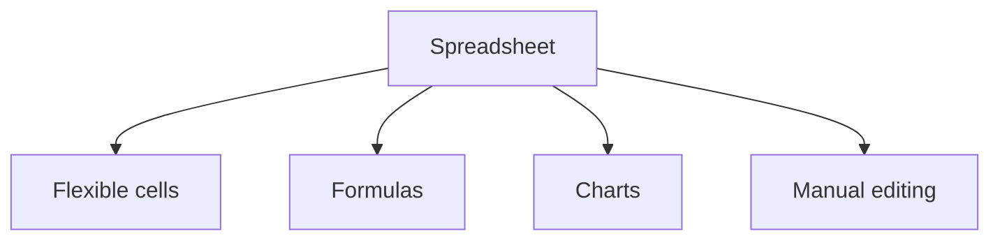
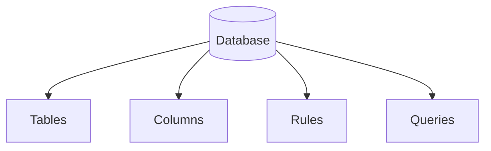
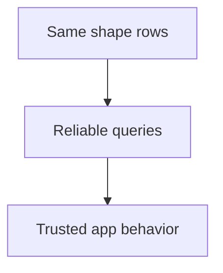
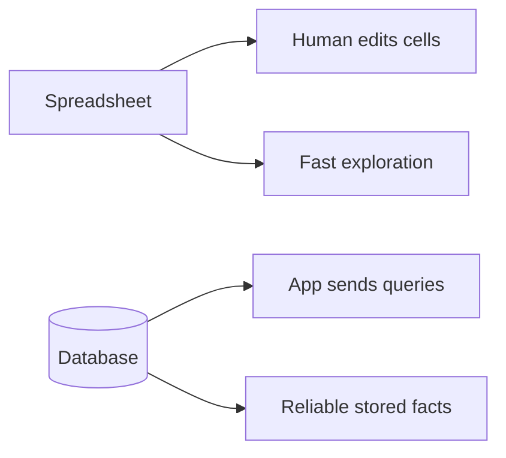
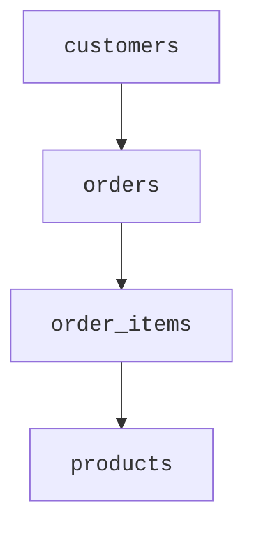
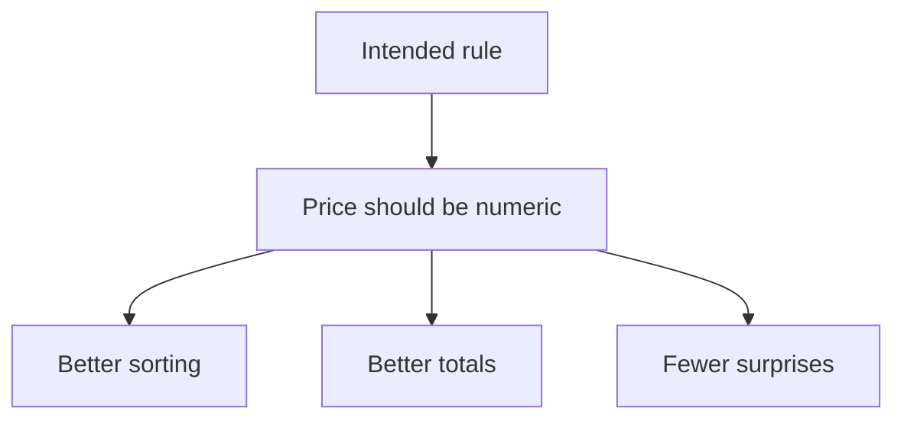
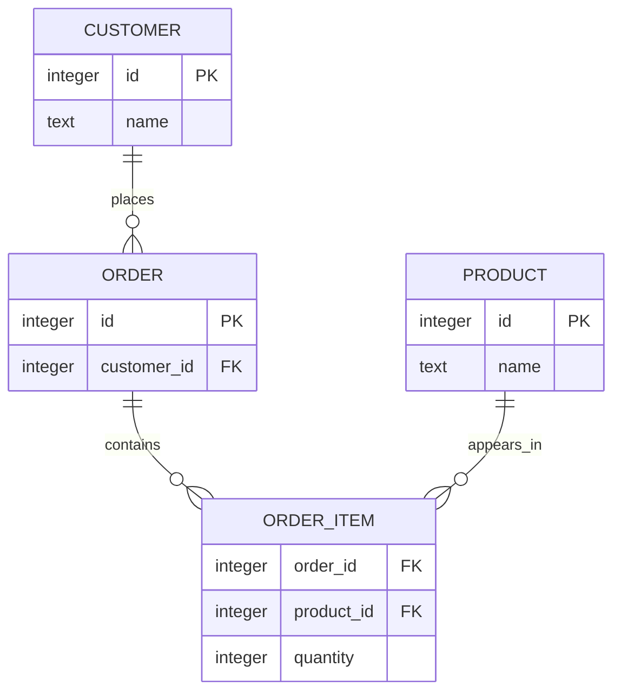

*This is one of the course's optional deep-dive pages, a question
worth a full discussion, separate from the main path.*

Spreadsheets and databases both store information in rows and columns, so beginners often wonder why databases exist at all.

It is a good question.

Spreadsheets are wonderful tools. They are visual, flexible, and easy to start using. For many personal or small team tasks, a spreadsheet is exactly right.

Databases solve a different problem: keeping structured information reliable when software, rules, relationships, history, and multiple users matter.

<svg
  viewBox="0 0 640 220"
  role="img"
  aria-label="Two cards side by side: in the spreadsheet card anything lands anywhere, a tilted yellow bar straddles cells, a blue dot sits on a boundary, a red blob ignores the lines, while in the database card every column holds one kind of thing, neatly aligned"
  style={{ display: "block", width: "100%", maxWidth: "640px", height: "auto", margin: "2.5rem auto" }}
>
  <g style={{ color: "var(--ds-red-500)" }} fill="currentColor">
    <rect x="44" y="28" width="262" height="168" rx="12" fillOpacity="0.07" />
  </g>
  <g fill="currentColor" opacity="0.08">
    <rect x="64" y="48" width="70" height="38" rx="4" />
    <rect x="142" y="48" width="70" height="38" rx="4" />
    <rect x="220" y="48" width="70" height="38" rx="4" />
    <rect x="64" y="94" width="70" height="38" rx="4" />
    <rect x="142" y="94" width="70" height="38" rx="4" />
    <rect x="220" y="94" width="70" height="38" rx="4" />
    <rect x="64" y="140" width="70" height="38" rx="4" />
    <rect x="142" y="140" width="70" height="38" rx="4" />
    <rect x="220" y="140" width="70" height="38" rx="4" />
  </g>
  <g style={{ color: "var(--ds-blue-500)" }} fill="currentColor">
    <circle cx="138" cy="68" r="9" />
  </g>
  <g style={{ color: "var(--ds-yellow-500)" }} fill="currentColor">
    <rect x="80" y="100" width="120" height="12" rx="6" transform="rotate(-8 140 106)" />
  </g>
  <g style={{ color: "var(--ds-red-500)" }} fill="currentColor">
    <circle cx="240" cy="152" r="16" fillOpacity="0.7" />
  </g>
  <g style={{ color: "var(--ds-green-500)" }} fill="currentColor">
    <rect x="334" y="28" width="262" height="168" rx="12" fillOpacity="0.1" />
    <rect x="437" y="62" width="56" height="12" rx="6" />
    <rect x="437" y="104" width="56" height="12" rx="6" />
    <rect x="437" y="146" width="56" height="12" rx="6" />
  </g>
  <g style={{ color: "var(--ds-blue-500)" }} fill="currentColor">
    <circle cx="380" cy="68" r="8" />
    <circle cx="380" cy="110" r="8" />
    <circle cx="380" cy="152" r="8" />
  </g>
  <g style={{ color: "var(--ds-yellow-500)" }} fill="currentColor">
    <rect x="534" y="60" width="16" height="16" rx="4" />
    <rect x="534" y="102" width="16" height="16" rx="4" />
    <rect x="534" y="144" width="16" height="16" rx="4" />
  </g>
</svg>

## A spreadsheet is a flexible workspace

A spreadsheet is like a digital workbench.

You can type almost anything anywhere.

You can format cells, drag formulas, make quick charts, and inspect data directly.



That flexibility is powerful.

It is also the reason spreadsheets can become risky for application data.

## A database is a reliable data system

A database is more strict on purpose.

Instead of "type anything anywhere," a database asks you to define tables and columns.



This structure helps applications trust the data.

If a column is meant to store a price, the database can treat it as a value to compare, sort, sum, and validate.



## Side-by-side

| Question | Spreadsheet | Database |
| --- | --- | --- |
| Best for | Manual exploration | Application storage |
| Shape | Flexible cells | Structured tables |
| Rules | Often informal | Built into table design |
| Relationships | Possible but easy to tangle | Central idea |
| Querying | Filters, formulas, clicks | SQL queries |
| Concurrency | Can get awkward | Designed for safer shared changes |



<MultipleChoice
  markdown={`Why can spreadsheet flexibility become risky for application data?

- Because flexible cells make every spreadsheet empty
  > Flexibility does not make spreadsheets empty; it can make values less consistent.
- [o] Because flexible cells can allow inconsistent values in places where software expects consistency
  > If one row says '$12', another says 'twelve', and another is blank, software has a harder time trusting the column.
- Because spreadsheets cannot contain numbers
  > Spreadsheets can contain numbers.
- Because charts are illegal
  > Charts are a normal spreadsheet feature.`}
/>

## Where spreadsheets break down

Spreadsheets often become painful when:

- many people edit at the same time
- many sheets repeat the same information
- formulas become hard to audit
- one column contains several kinds of values
- rows need relationships to other rows
- an application needs to ask precise questions automatically

Example problem:

```text
customer_name | order_id | products
------------- | -------- | -------------------------
Maya Chen     | 1001     | Notebook, Pen, Backpack
Maya Chen     | 1002     | Pen
```

Is "Maya Chen" the same customer in both rows? What if her name changes? How many pens were sold? The spreadsheet does not naturally separate customers, orders, and products into reliable related facts.

A relational database can separate those ideas:



## Types and integrity

In a spreadsheet, a column can accidentally become a mixture:

```text
price
-----
12.99
free
$8 maybe
```

A database table can be designed so the `price` column is meant for numeric values. SQLite has flexible typing, so it is more forgiving than some database systems, but column types still communicate the intended shape of the data and help SQLite store and compare values sensibly.

Integrity means the data follows the rules you need.



## Relationships matter

Databases can represent relationships clearly.

An order belongs to a customer. An order has items. Each item refers to a product.

That structure prevents repeated information from becoming a mess.



## Querying is different

In a spreadsheet, you often point, click, filter, and write formulas.

In a database, an application can send a query:

> Find all unpaid invoices older than 30 days.

The query can run again and again on fresh data.

<SqlCodeBlock
  dialect="sqlite"
  title="Ask repeatable questions"
  initSql={`CREATE TABLE invoices (
  id INTEGER PRIMARY KEY,
  customer TEXT,
  amount NUMERIC,
  paid INTEGER
);
INSERT INTO invoices (customer, amount, paid) VALUES
  ('Maya', 42.50, 0),
  ('Jordan', 19.99, 1),
  ('Riley', 75.00, 0);`}
  starterCode={`SELECT
  customer,
  amount
FROM
  invoices
WHERE
  paid = 0;`}
/>

## Which should you use?

<svg
  viewBox="0 0 640 190"
  role="img"
  aria-label="A path forks along two thin lines from a blue dot: one branch leads to a loose tilted yellow sheet for quick exploring, the other to a tidy blue table for dependable storage, neither tool is better, the path depends on the job"
  style={{ display: "block", width: "100%", maxWidth: "520px", height: "auto", margin: "2.5rem auto" }}
>
  <g stroke="var(--ds-gray-300)" strokeWidth="2.5" strokeLinecap="round">
    <line x1="320" y1="148" x2="205" y2="88" />
    <line x1="320" y1="148" x2="435" y2="88" />
  </g>
  <g style={{ color: "var(--ds-blue-500)" }} fill="currentColor">
    <circle cx="320" cy="156" r="10" />
  </g>
  <g style={{ color: "var(--ds-yellow-500)" }} fill="currentColor">
    <rect x="128" y="24" width="110" height="60" rx="8" transform="rotate(-5 183 54)" fillOpacity="0.2" />
    <circle cx="156" cy="44" r="6" transform="rotate(-5 183 54)" />
    <rect x="170" y="56" width="40" height="8" rx="4" transform="rotate(-5 183 54)" />
    <circle cx="212" cy="40" r="4" transform="rotate(-5 183 54)" />
  </g>
  <g style={{ color: "var(--ds-blue-500)" }} fill="currentColor">
    <rect x="400" y="24" width="120" height="64" rx="8" fillOpacity="0.12" />
    <rect x="412" y="34" width="96" height="8" rx="3" />
    <rect x="412" y="48" width="96" height="7" rx="3" fillOpacity="0.35" />
    <rect x="412" y="60" width="96" height="7" rx="3" fillOpacity="0.35" />
  </g>
</svg>

Use a spreadsheet when:

- you want quick manual analysis
- the data is small and flexible
- one person or a small group is exploring
- visual editing is the point

Use a database when:

- an application needs dependable storage
- data has rules and relationships
- many users or repeated processes touch the same facts
- you need precise queries over time

## The main idea

Spreadsheets are excellent flexible workspaces. Databases are reliable systems for structured information.

Neither tool is "better" for every job. The better question is: which tool matches the job?

## Check your understanding

<MultipleChoice
  markdown={`When is a spreadsheet often the better choice?

- Storing millions of related rows for a busy application
  > That kind of dependable application storage is usually database work.
- [o] Quick manual exploration of a small dataset
  > Spreadsheets are excellent for quick visual work.
- Enforcing many application rules for thousands of users
  > A database is usually a better fit for strict application data.
- Safely managing complex related records for software
  > Databases are designed for this kind of need.`}
/>

<MultipleChoice
  markdown={`When is a database often the better choice?

- When the only goal is coloring a few cells by hand
  > Visual formatting is usually spreadsheet work, not a reason to choose a database.
- [o] When reliable structured storage matters
  > Databases are built for dependable structured facts.
- When you only want to color a few cells
  > Visual formatting is more naturally spreadsheet work.
- When the data should disappear after closing the app
  > Databases help data persist.`}
/>

<MultipleChoice
  markdown={`Why are relationships important in databases?

- They make every table unrelated to every other table
  > Relationships do the opposite: they connect related rows across tables.
- [o] They connect related facts without repeating everything everywhere
  > Relationships let one order point to one customer, instead of copying all customer details into every order.
- They prevent all tables from having names
  > Tables still need names.
- They turn every row into an image
  > Relationships connect rows; they do not turn rows into images.`}
/>

<MultipleChoice
  markdown={`What makes SQL queries useful compared with manual spreadsheet filtering?

- A query must be rewritten by hand for every single row
  > SQL describes the question once and lets the database apply it to matching rows.
- [o] A query can be saved and run again on current data
  > Repeatable questions are helpful when applications need the same answer many times.
- Queries only work when data is unstructured
  > SQL works with structured data.
- Queries remove the need for data
  > Queries ask for data; they do not replace it.`}
/>
