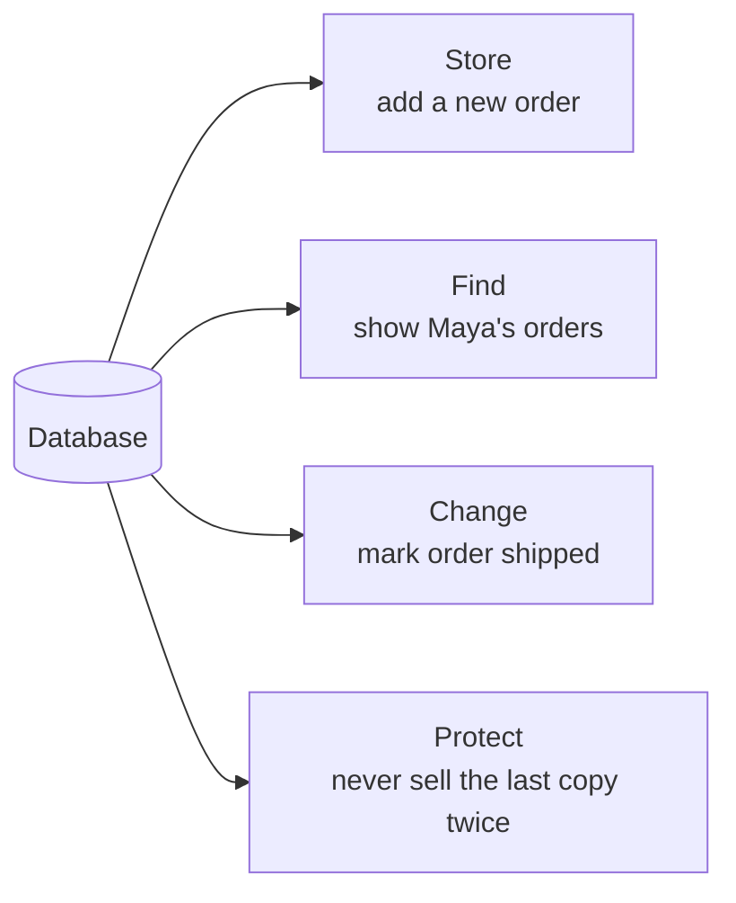
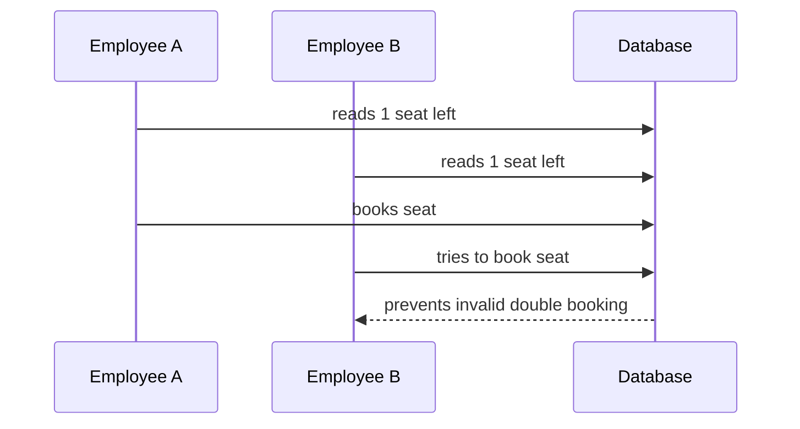
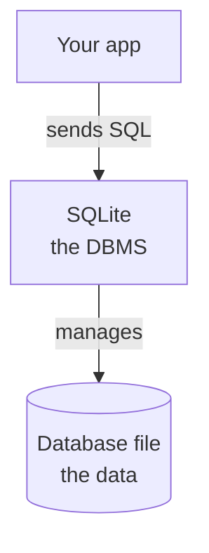

Imagine you are building a small online bookstore. It has to
remember things: which books are for sale, what each one costs,
who the customers are, which orders have been placed, and whether
each order has shipped. None of that can live in anyone's head,
and none of it can vanish when the computer restarts.

Every piece of software you use, a banking app, a chat app, a
game with saved progress, faces this same problem. The answer,
almost always, is a **database**: an organized place to store
facts so software can find them, change them, and trust them
later.

That definition sounds modest. This page is about why it is
actually one of the biggest ideas in computing, and why it has a
surprisingly good origin story.

<svg
  viewBox="0 0 640 230"
  role="img"
  aria-label="A blue catalog box holds a row of neat gray cards with colored tabs, and one green-tabbed card is lifted straight up on a thin line, a database is an organized place where facts are stored, found again, and trusted"
  style={{ display: "block", width: "100%", maxWidth: "560px", height: "auto", margin: "2.5rem auto" }}
>
  <line x1="457" y1="110" x2="457" y2="86" stroke="var(--ds-gray-400)" strokeWidth="2" strokeLinecap="round" />
  <g style={{ color: "var(--ds-green-500)" }} fill="currentColor">
    <rect x="438" y="10" width="24" height="12" rx="4" />
    <rect x="430" y="20" width="54" height="60" rx="5" fillOpacity="0.25" />
  </g>
  <g fill="var(--ds-gray-300)">
    <rect x="200" y="66" width="50" height="54" rx="4" />
    <rect x="262" y="72" width="50" height="48" rx="4" />
    <rect x="324" y="68" width="50" height="52" rx="4" />
  </g>
  <g style={{ color: "var(--ds-blue-500)" }} fill="currentColor">
    <rect x="208" y="56" width="24" height="12" rx="4" />
  </g>
  <g style={{ color: "var(--ds-yellow-500)" }} fill="currentColor">
    <rect x="270" y="62" width="24" height="12" rx="4" />
  </g>
  <g style={{ color: "var(--ds-red-500)" }} fill="currentColor">
    <rect x="332" y="58" width="24" height="12" rx="4" />
  </g>
  <g style={{ color: "var(--ds-blue-500)" }} fill="currentColor">
    <path d="M 160 126 L 480 126 L 464 208 Q 462 216 454 216 L 186 216 Q 178 216 176 208 Z" fillOpacity="0.22" />
    <rect x="152" y="114" width="336" height="14" rx="7" />
  </g>
</svg>

## The four jobs every database does

Look at what the bookstore actually needs, and you find that all
of it boils down to four jobs:



**Store** new facts: a customer signs up, an order is placed.
**Find** facts later: show the five newest orders, list books
under twenty dollars. **Change** facts when the world changes: the
package ships, the price drops. And **protect** facts: do not
accept an order with no customer, do not lose today's sales if
the power flickers.

The first three jobs sound easy. The fourth is where things get
interesting, and it is the real reason databases exist.

## Why not just save a file?

A reasonable first instinct: skip the database, write everything
into a file. Sometimes that genuinely is the right answer, a
photo, a PDF, a configuration file. But for *facts that change
and matter*, plain files hide three hard problems.

**Problem one: memory disappears and files corrupt.** A program's
memory vanishes the instant it exits, so the data must reach disk.
But writing to disk can be interrupted halfway, a crash, a power
cut, leaving the file scrambled. A database promises
**durability**: once it says a change is saved, the change
survives, even across a crash mid-write.

**Problem two: two actions can collide.** Imagine two employees
both see "1 seat left" on a tour bus and both click *book* at the
same moment. With a plain file, both writes can go through and the
seat is sold twice. This is a **concurrency** problem, and it is
brutally hard to solve correctly by hand.



**Problem three: some changes come in groups.** Placing an order
means creating the order, adding its items, reducing inventory,
and recording the payment. If a crash happens after step two, the
data lies: an order exists with no payment and wrong stock counts.
Databases solve this with **transactions**, a group of changes
that either *all* happen or *none* do.

Every application that used plain files had to reinvent solutions
to these three problems, badly, over and over. A database is those
solutions, written once by specialists, tested for decades, and
handed to you for free.

<MultipleChoice
  markdown={`Why is "sell the last seat twice" a database problem?

- It is about choosing a font
  > Fonts do not decide whether a seat can be sold twice.
- [o] Two overlapping actions can conflict unless the data is protected
  > Concurrency means more than one action may touch the same fact at the same time.
- It only happens when nobody uses computers
  > The problem is common in software systems.
- It proves files cannot store text
  > Files can store text; the hard part is safe shared change.`}
/>

<MultipleChoice
  markdown={`What is a transaction?

- A picture stored in a folder
  > A picture may be data, but it is not a transaction.
- A random spreadsheet color
  > Formatting is unrelated to transactions.
- [o] A group of database changes treated as one unit
  > A transaction helps related changes succeed or fail together.
- A username only
  > A username is one piece of data, not a group of changes.`}
/>

## Structure: facts a computer can actually use

Storing facts safely is half the job. The other half is storing
them in a shape a computer can *reason about*. Compare these two
ways of recording the same information:

> Maya got 92 on the quiz, Jordan got 85, and Riley has not taken
> it yet.

```text
students

name   | quiz_score
------ | ----------
Maya   | 92
Jordan | 85
Riley  | NULL
```

A person reads the sentence easily. But ask the computer *"who
scored above 90?"* or *"what is the average?"* and the sentence is
nearly useless, while the table answers instantly. The table works
because every fact has a **named place**: the column name tells
you what a value means (`92` in a `quiz_score` column is a score;
in a `temperature` column it would mean something else entirely),
and every row has the same shape, so one question can be tested
against all of them. Even *missing* information gets an honest
place, that `NULL` for Riley means "no known value," an idea with
its own page later in this course.

This is **structured data**, and the structure is the point: it is
what makes searching, comparing, validating, and summarizing
possible.

## One radical paper: the relational model

How should structured facts be organized? Through the 1960s, the
answer was complicated: databases arranged records into trees and
networks of pointers, and to fetch anything, a programmer had to
know the physical layout and navigate it step by step. Change the
layout, and every program that touched the data broke.

<IllustrationPrompt subject="Edgar F. Codd" photo />

In June 1970, an IBM researcher named **Edgar F. Codd** published
a paper with the unglamorous title *"A Relational Model of Data
for Large Shared Data Banks."* Its proposal was radical in its
simplicity: store everything in plain **tables** of rows and
columns, hide the physical layout entirely, and let people ask
for data by *describing* what they want rather than navigating to
it. Connections between facts would be made by **values**, a
customer number appearing in an orders table, not by fragile
pointers.

That idea won so completely that today it is hard to see how
radical it was. SQLite, PostgreSQL, MySQL, Oracle, SQL Server,
the databases running most of the world, are all **relational**
databases, direct descendants of that 1970 paper. This course
teaches the relational model throughout: tables, keys, and the
relationships between them.

## SQL: the language part

Codd's model needed a language people could write. In the early
1970s, two of his IBM colleagues, **Donald Chamberlin** and
**Raymond Boyce**, designed one and called it **SEQUEL**,
*Structured English Query Language*, because its queries read
almost like English sentences. The name was later shortened to
**SQL** after "SEQUEL" turned out to be someone else's trademark.
The original pronunciation stuck, which is why you will hear both
"S-Q-L" and "sequel" today, both correct.

What made SQL different is that it is **declarative**: you
describe the result you want, and the database works out the
steps. Try it, this is real SQL against a real table:

<SqlCodeBlock
  dialect="sqlite"
  title="Describe what you want, not how to find it"
  initSql={`CREATE TABLE products (
  id INTEGER PRIMARY KEY,
  name TEXT,
  price NUMERIC
);
INSERT INTO products (name, price) VALUES
  ('Notebook', 4.99),
  ('Backpack', 34.50),
  ('Pen', 1.25);`}
  starterCode={`SELECT
  name,
  price
FROM
  products
WHERE
  price < 20;`}
/>

You did not say *"open the file, scan each record, compare byte
offsets."* You said *"names and prices of products cheaper than
20"* and SQLite figured out the rest. Change `20` to `2` and run
it again, the question changes, the method stays invisible.

Nearly everything an application does with stored data fits four
SQL verbs:

```text
SELECT  read existing rows
INSERT  add new rows
UPDATE  change existing rows
DELETE  remove rows
```

You will spend most of this course on `SELECT`, because asking
good questions is most of the work, but you will meet all four.

<MultipleChoice
  markdown={`What does it mean that SQL is declarative?

- You must describe every byte SQLite should read from disk
  > SQL hides low-level storage steps from the query.
- [o] You describe the result you want, not every low-level step
  > SQL lets you ask for matching rows without describing the internal storage work.
- You must draw every database page by hand
  > The database manages storage details.
- SQL can only delete data
  > SQL can read, add, change, and delete data.`}
/>

## Database vs. DBMS

One piece of vocabulary worth keeping straight. People use the
word "database" for two related things:

- The **database** is the stored information itself.
- The **database management system** (DBMS) is the software that
  manages it, accepting SQL, storing rows, enforcing rules,
  surviving crashes.



SQLite is a DBMS. The databases it manages are, charmingly,
ordinary files on disk, a design choice with a story of its own,
which is exactly where the next page picks up.

<Callout type="info" title="Want to go deeper?">
Two questions we touched only briefly have their own pages near
the end of this course, in the **Interesting discussions**
section: [Spreadsheets vs. Databases](/courses/sqlite-for-beginners/spreadsheets-vs-databases)
(when each tool is the right one) and
[How Applications Store Information](/courses/sqlite-for-beginners/how-applications-store-information)
(the full loop from a button click to a saved row). Read them now
or save them for later, the main path continues without them.
</Callout>

## Check your understanding

<MultipleChoice
  markdown={`In beginner-friendly terms, what is a database?

- A programming language for drawing screens
  > A database stores information; it does not draw the user interface.
- [o] An organized place to store information so it can be found, changed, and trusted later
  > A database keeps information organized for later use.
- A password manager only
  > A database may store protected information, but it is not only a password manager.
- A replacement for every file on your computer
  > Plain files are still right for photos, documents, and configs; databases are for structured facts that change and matter.`}
/>

<MultipleChoice
  markdown={`What did Codd's 1970 relational model propose?

- Storing all data as one long sentence
  > The relational model is built on structured tables, not prose.
- [o] Storing data in tables and connecting facts by values instead of physical pointers
  > Hiding the physical layout behind simple tables is the core relational idea.
- Deleting data that is older than ten years
  > The model is about organization, not retention policies.
- Requiring every program to know the storage layout
  > It proposed the opposite: programs describe what they want and never touch the layout.`}
/>

<MultipleChoice
  markdown={`Why was SQL originally called SEQUEL?

- It was the second query language ever invented
  > The name was not about being second; it was an acronym.
- [o] It stood for Structured English Query Language, reflecting its English-like queries
  > The name was shortened to SQL after a trademark conflict over "SEQUEL."
- It could only run queries in sequence
  > SQL describes results; the name was not about execution order.
- It was named after its inventor
  > It was designed by Chamberlin and Boyce, but named for its style, not for them.`}
/>

<MultipleChoice
  markdown={`What is a DBMS?

- A row inside a table
  > A row is one stored record, not the software that manages records.
- [o] Software that manages databases
  > A database management system creates, reads, changes, and protects stored data.
- A chart type
  > A DBMS is not a chart.
- A file extension
  > Some database files have extensions, but a DBMS is software.`}
/>
