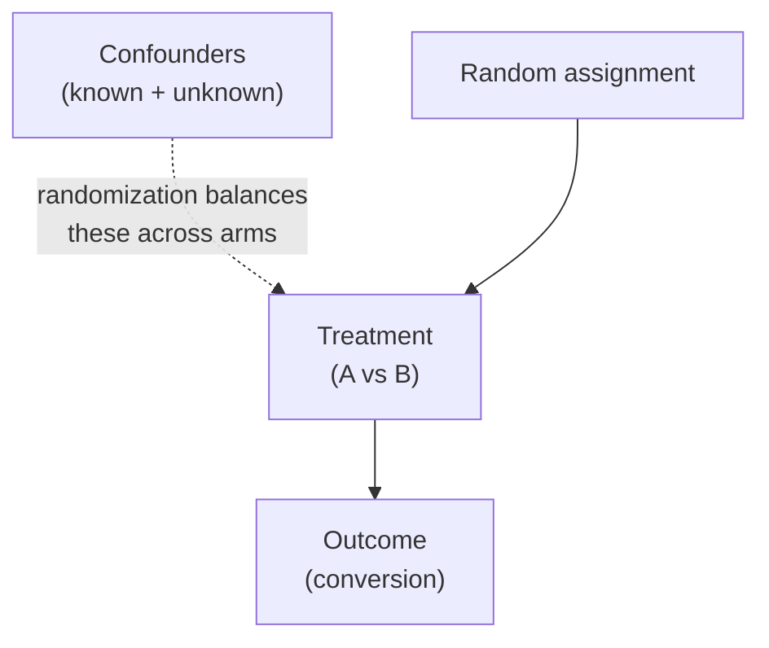
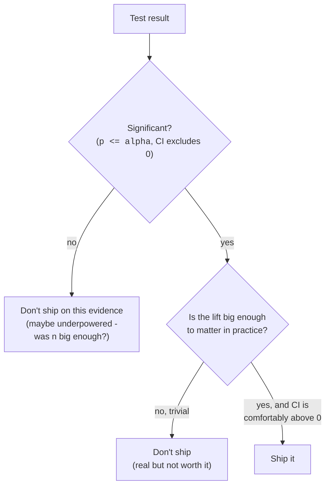
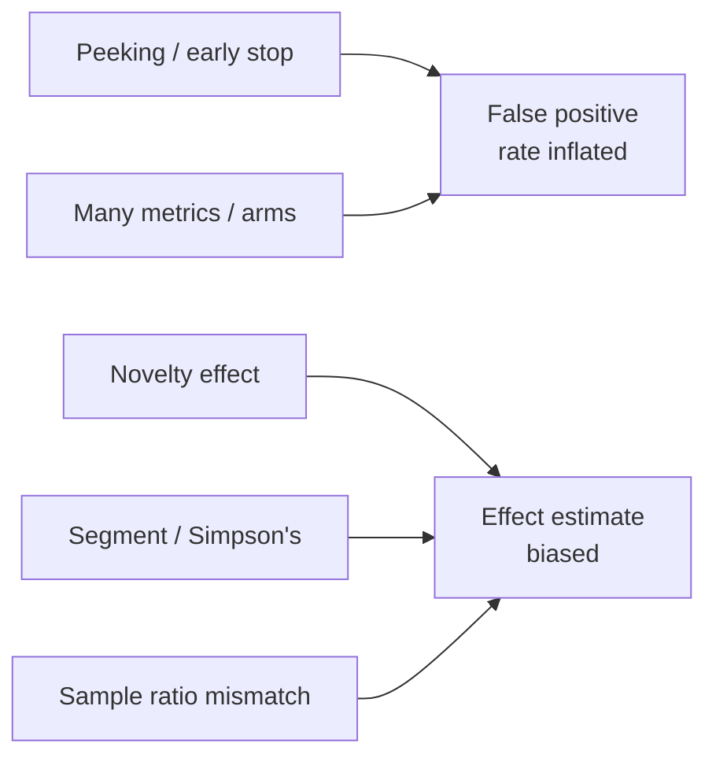

This is where the whole course comes together. An **A/B test** (a
randomized controlled experiment) is the single most powerful tool a data
scientist has for answering "*does this change actually work?*", and it
runs on every concept you've built: populations and samples,
randomization, sampling distributions, confidence intervals, hypothesis
tests, p-values, power, and effect sizes. If you can design and read an
A/B test correctly, you can be trusted with real decisions.

We'll go in the order a real experiment does: **design** it before you
collect a single row, **analyze** it once it's done, and **decide**
whether to ship, then catalog the **pitfalls** that quietly invalidate
otherwise-fine tests.

The full arc, start to finish:

**Hypothesis + primary metric → Randomize users to A/B → Pick sample size (power) in advance → Run to plan (no peeking) → Analyze (lift, confidence interval, effect size, p) → Decide: ship? (significance *and* size)**

<Figure
  slug="stat-ab-testing-cutout"
  alt="A splitter gate on a platform sending traffic tokens evenly into two variant chambers, a meter comparing their outputs"
/>

## Design comes first (and is where most tests are won or lost)

The analysis is the easy part. A test that wasn't *designed* properly
can't be rescued by clever statistics afterward. Four decisions, all
made **before** data collection:

**1. A single, falsifiable hypothesis.** "The new checkout button
increases the purchase-conversion rate." Not "the new button is better"
(better at what?), name the exact change and the exact outcome.

<Figure
  slug="stat-ab-testing-inline-cutout"
  alt="Two identical benches running side by side with one part changed on the right, and a gauge comparing their outputs"
  caption="Change one thing between two otherwise identical arms, then compare outcomes."
/>

**2. One primary metric, chosen in advance.** Pick *the* number the
decision hinges on, say, conversion rate, and commit to it. Tracking
ten metrics and celebrating whichever one moves is the multiple-comparisons
trap from *Statistical Fallacies* wearing a business suit.

**3. Randomization.** Assign each user to control (A) or treatment (B)
*at random*. This is the load-bearing wall of the whole method, so it
gets its own section below.

**4. Sample size / power, up front.** Decide how many users you need
*before* starting, so the test can actually detect an effect worth
caring about. More on this two sections down.

<Callout type="warn" title="Primary metric is singular for a reason">
The moment you have five "primary" metrics, you're running five tests,
and the chance that *at least one* looks significant by luck balloons.
Declare one primary metric for the ship decision; everything else is a
secondary/guardrail metric you look at for context, not for the verdict.
</Callout>

## Why randomization licenses causal claims

Here is the deep reason A/B tests can say "X *caused* Y" when ordinary
observational data (from *Statistical Fallacies*) cannot. Randomly
assigning who gets the treatment makes the two groups **statistically
identical on everything**, measured and unmeasured, *except* the change
you're testing. Age, device, loyalty, the weather, mood, and every
confounder you never thought of are, on average, balanced across the two
arms. So if B outperforms A by more than chance allows, the *only*
systematic difference between the groups is the treatment. That severs
the confounder's arrow and earns you a causal conclusion.

<Figure
  slug="stat-ab-testing-randomization-licenses-causal-inline-cutout"
  alt="A mixed heap of chips split by a spinner rather than by hand, the two halves visibly alike"
  caption="Randomising the split balances the causes you never thought of."
/>

<Callout type="info" title="Randomization vs. observation">
Without randomization, "users who saw the new button converted more"
could just mean the new button shipped to your most engaged users.
*With* randomization, the engaged users are split evenly between A and B,
so that explanation is off the table. Randomization is what turns a
correlation into a credible cause.
</Callout>

<Chart slug="randomisation-balances-confounders" />

The randomized bars are not zero, and expecting zero is a common misreading,
because a coin flip on a finite sample does not deliver perfect balance. What
randomization guarantees is that the imbalance is *random*, with a known
distribution, which is what lets a p-value mean anything.

Matching, regression and propensity scores can only balance variables you
have. Randomization balances the ones you have and the ones you have never
heard of, because the coin does not know what it is balancing. Two honest
limits: it says nothing about whether the sample represents anybody, and
attrition undoes it, because people who drop out for reasons related to the
treatment leave a self-selected remainder.

## Power and sample size, decided before you start

You met **statistical power** in *Errors and Power*: the probability your
test *detects* a real effect of a given size. Run a test on too few
users and even a genuine, worthwhile lift can come back non-significant,
you "found nothing" only because you lacked the data to find it. So you
size the experiment up front, around the *smallest effect worth
detecting* (the minimum detectable effect, MDE).

<Figure
  slug="stat-ab-testing-power-sample-size-inline-cutout"
  alt="A dial set and locked before two benches begin running, its setting fixing how many chips each will need"
  caption="The sample size is fixed before the test runs, from the smallest effect worth catching."
/>

The four knobs trade off against each other:

| Knob | Effect on required sample size |
| --- | --- |
| Smaller effect to detect (MDE) | needs **more** users |
| Higher power (e.g., 0.9 vs 0.8) | needs **more** users |
| Smaller α (stricter) | needs **more** users |
| Noisier metric (bigger variance) | needs **more** users |

The trade is steep enough that a table understates it. Each halving of the
lift you want to catch roughly quadruples the users you need:

<Chart slug="power-vs-n" />

<CodeBlock
  adapter="python"
  files={[
    {
      filename: "main.py",
      starterCode: `import numpy as np
from scipy import stats

# How many users per arm to detect a lift from 10% -> 12% conversion,
# with 80% power at alpha = 0.05 (two-sided)? A standard formula for
# comparing two proportions.
p1, p2 = 0.10, 0.12  # baseline and target conversion rates
alpha, power = 0.05, 0.80

z_alpha = stats.norm.ppf(1 - alpha / 2)  # two-sided
z_beta = stats.norm.ppf(power)
p_bar = (p1 + p2) / 2

n_per_arm = (
    (
        z_alpha * np.sqrt(2 * p_bar * (1 - p_bar))
        + z_beta * np.sqrt(p1 * (1 - p1) + p2 * (1 - p2))
    )
    ** 2
) / (p2 - p1) ** 2

print(f"Detecting {p1:.0%} -> {p2:.0%} at {power:.0%} power, alpha={alpha}:")
print(
    f"  Need ~{np.ceil(n_per_arm):,.0f} users PER ARM "
    f"(~{2 * np.ceil(n_per_arm):,.0f} total)."
)
print()
print("Smaller lifts need far more users. Decide this BEFORE you run,")
print("so you don't stop early or chase an effect too small to see.")
`,
    },
  ]}
/>

<Callout type="tip" title="Why size up front, not after">
If you decide the sample size *after* peeking at results, you've turned a
clean test into a fishing expedition, you'll be tempted to stop the
moment the numbers look good. Committing to `n` in advance is what keeps
the false-positive rate at the α you intended.
</Callout>

## Analyze: simulate and fully read one experiment

Let's run a complete analysis. We'll **simulate** an experiment with a
*known* true effect (so we can check our work), then analyze it the way
you would real data: compute each arm's conversion rate, the observed
**lift**, a **confidence interval on the difference**, a formal **test**,
the **p-value**, and an **effect size**.

For a conversion (yes/no) metric, the natural test compares two
proportions. We'll use a **two-proportion z-test** computed directly, and
cross-check it against a chi-square test on the 2×2 table, they answer
the same question.

<CodeBlock
  adapter="python"
  files={[
    {
      filename: "main.py",
      starterCode: `import numpy as np
from scipy import stats

rng = np.random.default_rng(42)

# --- Simulate an experiment with a KNOWN true effect ---
n_a = n_b = 6000
true_p_a, true_p_b = 0.100, 0.118  # true 1.8pp lift (B is better)

conv_a = rng.binomial(1, true_p_a, n_a)  # 0/1 outcomes per user
conv_b = rng.binomial(1, true_p_b, n_b)

x_a, x_b = conv_a.sum(), conv_b.sum()  # conversions observed
p_a, p_b = x_a / n_a, x_b / n_b  # observed rates

# --- Lift: absolute and relative ---
abs_lift = p_b - p_a
rel_lift = abs_lift / p_a

# --- Two-proportion z-test (pooled SE under H0) ---
p_pool = (x_a + x_b) / (n_a + n_b)
se_pool = np.sqrt(p_pool * (1 - p_pool) * (1 / n_a + 1 / n_b))
z = abs_lift / se_pool
p_value = 2 * (1 - stats.norm.cdf(abs(z)))  # two-sided

# --- Cross-check with chi-square on the 2x2 table ---
table = np.array([[x_a, n_a - x_a], [x_b, n_b - x_b]])
chi2, p_chi2, _, _ = stats.chi2_contingency(table, correction=False)

# --- 95% CI for the difference (unpooled SE) ---
se_diff = np.sqrt(p_a * (1 - p_a) / n_a + p_b * (1 - p_b) / n_b)
zc = stats.norm.ppf(0.975)
ci_low, ci_high = abs_lift - zc * se_diff, abs_lift + zc * se_diff

# --- Effect size for proportions: Cohen's h ---
h = 2 * np.arcsin(np.sqrt(p_b)) - 2 * np.arcsin(np.sqrt(p_a))

print(f"Control (A):  {x_a}/{n_a} = {p_a:.4f}")
print(f"Treatment (B):{x_b}/{n_b} = {p_b:.4f}")
print(f"Absolute lift: {abs_lift:+.4f}  ({abs_lift * 100:+.2f} pp)")
print(f"Relative lift: {rel_lift:+.1%}")
print(f"z-test:        z = {z:.2f},  p = {p_value:.4f}")
print(f"chi-square:    chi2 = {chi2:.2f}, p = {p_chi2:.4f}  (agrees with z)")
print(f"95% CI on diff:[{ci_low:+.4f}, {ci_high:+.4f}]")
print(f"Effect size:   Cohen's h = {h:.3f}")
`,
    },
  ]}
/>

Look at the full picture, not just the p-value. You get a **point
estimate** of the lift, a **confidence interval** that shows how precise
it is, a **p-value** for "is it distinguishable from no effect," and an
**effect size**. That's the reporting trio from *Effect Sizes*, applied.

A chart makes the comparison and its uncertainty legible. We'll show
each arm's conversion rate with an error bar (the CI half-width).

<CodeBlock
  adapter="python"
  files={[
    {
      filename: "main.py",
      starterCode: `import numpy as np
import pandas as pd
import plotly.express as px
from scipy import stats

rng = np.random.default_rng(42)
n_a = n_b = 6000
conv_a = rng.binomial(1, 0.100, n_a)
conv_b = rng.binomial(1, 0.118, n_b)
p_a, p_b = conv_a.mean(), conv_b.mean()

# 95% CI half-width per arm (normal approximation for a proportion).
def ci_halfwidth(p, n):
    return stats.norm.ppf(0.975) * np.sqrt(p * (1 - p) / n)

df = pd.DataFrame(
    {
        "group": ["A (control)", "B (treatment)"],
        "rate": [p_a, p_b],
        "err": [ci_halfwidth(p_a, n_a), ci_halfwidth(p_b, n_b)],
    }
)

fig = px.bar(
    df,
    x="group",
    y="rate",
    error_y="err",
    color="group",
    title="Conversion rate by arm (bars = 95% confidence interval)",
    labels={"rate": "conversion rate"},
    template="simple_white",
)
fig.show()

print("If the intervals barely overlap and the gap matters, you have a")
print("real, useful effect. Overlapping intervals -> stay cautious.")
`,
    },
  ]}
/>

<Callout type="info" title="Continuous metric? Use a t-test instead">
If your primary metric is *continuous*, revenue per user, session
length, time-to-checkout, swap the two-proportion test for an
independent **t-test** (`scipy.stats.ttest_ind`), report the difference
in means with its CI, and use **Cohen's d** as the effect size. The
design, randomization, power, and decision logic are identical; only the
test and effect-size formula change.
</Callout>

## Decide: ship or don't ship

A significant p-value is *permission to look at the effect size*, not an
order to ship. The decision weighs **two** axes together, exactly the
significance-vs-importance distinction from *Effect Sizes*.

Walk the branches:

- **Not significant.** No green light. But check power first, a null
  result on a tiny sample means "we couldn't tell," not "no effect."
- **Significant but tiny.** The classic trap. With enough traffic a
  0.05pp lift is "significant" and worthless. Look at the effect size and
  whether the *whole* confidence interval clears the threshold you'd care
  about.
- **Significant and meaningful.** Ship, and ideally confirm the CI's
  lower bound is still above the level that justifies the rollout cost.

<Callout type="danger" title="The most expensive A/B testing mistake">
"It's statistically significant, so we shipped it." Significance with a
huge sample can certify a lift far too small to pay for the engineering,
the risk, or the added complexity. **Always read the effect size and the
confidence interval before shipping.** A narrow CI sitting entirely above
your "worth it" line is the real green light.
</Callout>

## Pitfalls that quietly invalidate a test

Even a well-designed test can be ruined by a handful of classic mistakes.
Each one inflates false positives or biases the estimate.

- **Peeking and early stopping.** Watching the p-value daily and stopping
  the instant it dips below 0.05 dramatically inflates your false-positive
  rate. The p-value wanders; if you stop on the first lucky dip, you stop
  on noise. Decide `n` (or use a proper sequential-testing method) and run
  to it.
- **Multiple metrics / multiple variants.** Every extra metric or arm is
  another shot at a false positive. Correct for it (e.g., Bonferroni) or
  pre-commit to one primary metric.
- **Novelty effect.** Users click the new thing *because it's new*; the
  bump fades. Run long enough to see whether the lift persists past the
  novelty window.
- **Simpson's paradox across segments.** An overall win can hide a loss in
  every segment (or vice versa) if your traffic mix shifted, straight
  from *Statistical Fallacies*. Sanity-check key segments.
- **Unequal / broken groups (assignment bias).** If the arms differ in
  size or composition more than randomization predicts, a "sample ratio
  mismatch", your randomization is broken and the comparison is suspect.

<Callout type="warn" title="Peeking is sneakier than it sounds">
It feels harmless to "just check" the dashboard and stop when it hits
significance. It isn't. Because the p-value fluctuates over time, a test
of two *identical* arms will cross p < 0.05 *at some point* surprisingly
often if you keep peeking. Pre-commit to your stopping rule, or use a
method designed for continuous monitoring.
</Callout>

Peeking is the one on that list that feels harmless, so it is worth
seeing. Below, one experiment where nothing is happening is tested after
every new observation instead of once at the end.

<Chart slug="ab-test-peeking" />

## Practice

<ChallengeCard
  adapter="python"
  title="Lift and a two-proportion test"
  instructions={`You're handed the final counts from an A/B test:

- Control: \`conv_a\` conversions out of \`n_a\` visitors.
- Treatment: \`conv_b\` conversions out of \`n_b\` visitors.

Compute two values:

- \`rel_lift\`: the **relative lift** in conversion rate, \`(p_b - p_a) / p_a\`, as a float (e.g. 0.20 for a 20% relative lift).
- \`p_value\`: the two-sided p-value from a **two-proportion z-test** (pooled standard error under H0), as a float.

Steps for the z-test:
- \`p_pool = (conv_a + conv_b) / (n_a + n_b)\`
- \`se = sqrt(p_pool*(1-p_pool)*(1/n_a + 1/n_b))\`
- \`z = (p_b - p_a) / se\`, then \`p_value = 2*(1 - norm.cdf(abs(z)))\`.`}
  files={[
    {
      filename: "main.py",
      initCode: `conv_a, n_a = 480, 6000   # control
conv_b, n_b = 570, 6000   # treatment`,
      starterCode: `import numpy as np
from scipy import stats

# TODO: compute rel_lift and p_value (both floats)
rel_lift = None
p_value = None
`,
      solutionCode: `import numpy as np
from scipy import stats

p_a = conv_a / n_a
p_b = conv_b / n_b
rel_lift = float((p_b - p_a) / p_a)

p_pool = (conv_a + conv_b) / (n_a + n_b)
se = np.sqrt(p_pool * (1 - p_pool) * (1 / n_a + 1 / n_b))
z = (p_b - p_a) / se
p_value = float(2 * (1 - stats.norm.cdf(abs(z))))

print(f"relative lift = {rel_lift:.3f}, p = {p_value:.4f}")
`,
    },
  ]}
  tests={[
    {
      id: "types",
      name: "both are floats",
      description: "Returns numeric values",
      code: `assert isinstance(rel_lift, float) and isinstance(p_value, float)`,
    },
    {
      id: "lift",
      name: "relative lift is correct",
      description: "Matches (p_b - p_a)/p_a",
      code: `pa, pb = conv_a/n_a, conv_b/n_b
assert abs(rel_lift - (pb - pa)/pa) < 1e-9`,
    },
    {
      id: "pvalue",
      name: "p-value matches the z-test",
      description: "Matches a direct two-proportion z-test",
      code: `import numpy as np
from scipy import stats
pa, pb = conv_a/n_a, conv_b/n_b
pp = (conv_a + conv_b)/(n_a + n_b)
se = np.sqrt(pp*(1-pp)*(1/n_a + 1/n_b))
z = (pb - pa)/se
expected = 2*(1 - stats.norm.cdf(abs(z)))
assert abs(p_value - expected) < 1e-9`,
    },
    {
      id: "significant",
      name: "this test is significant",
      description: "p < 0.05 for these counts",
      code: `assert p_value < 0.05`,
    },
  ]}
/>

<ChallengeCard
  adapter="python"
  title="Confidence interval for the difference in rates"
  instructions={`Using the same kind of A/B counts, build a **95% confidence interval for the difference in conversion rates** (treatment minus control), using the **unpooled** standard error.

- \`p_a = conv_a/n_a\`, \`p_b = conv_b/n_b\`; the difference is \`p_b - p_a\`.
- \`se = sqrt( p_a*(1-p_a)/n_a + p_b*(1-p_b)/n_b )\`
- Critical value: \`stats.norm.ppf(0.975)\`.
- Store the endpoints in a tuple \`ci = (low, high)\` of two floats with \`low < high\`.

Then set a boolean \`excludes_zero\` to \`True\` if the whole interval is above 0 (a significant positive difference), else \`False\`.`}
  files={[
    {
      filename: "main.py",
      initCode: `conv_a, n_a = 500, 5000   # control  (10.0%)
conv_b, n_b = 610, 5000   # treatment (12.2%)`,
      starterCode: `import numpy as np
from scipy import stats

# TODO: build ci = (low, high) and the boolean excludes_zero
ci = None
excludes_zero = None
`,
      solutionCode: `import numpy as np
from scipy import stats

p_a = conv_a / n_a
p_b = conv_b / n_b
diff = p_b - p_a
se = np.sqrt(p_a * (1 - p_a) / n_a + p_b * (1 - p_b) / n_b)
zc = stats.norm.ppf(0.975)
low, high = diff - zc * se, diff + zc * se
ci = (float(low), float(high))
excludes_zero = bool(low > 0)

print("95% CI on difference:", ci, "excludes 0:", excludes_zero)
`,
    },
  ]}
  tests={[
    {
      id: "shape",
      name: "ci is a 2-tuple of floats",
      description: "Returns (low, high)",
      code: `assert isinstance(ci, tuple) and len(ci) == 2
assert all(isinstance(v, float) for v in ci)
assert ci[0] < ci[1]`,
    },
    {
      id: "value",
      name: "endpoints match the unpooled CI",
      description: "Matches a direct computation",
      code: `import numpy as np
from scipy import stats
pa, pb = conv_a/n_a, conv_b/n_b
diff = pb - pa
se = np.sqrt(pa*(1-pa)/n_a + pb*(1-pb)/n_b)
zc = stats.norm.ppf(0.975)
lo, hi = diff - zc*se, diff + zc*se
assert abs(ci[0]-lo) < 1e-9 and abs(ci[1]-hi) < 1e-9`,
    },
    {
      id: "flag",
      name: "excludes_zero is a correct bool",
      description: "True iff the interval is entirely above 0",
      code: `assert isinstance(excludes_zero, bool)
assert excludes_zero == (ci[0] > 0)`,
    },
    {
      id: "positive",
      name: "this interval clears zero",
      description: "For these counts the lift is significant",
      code: `assert excludes_zero is True`,
    },
  ]}
/>

## Check your understanding

<MultipleChoice
  markdown={`Why does randomly assigning users to A and B let an A/B test support a *causal* claim, when ordinary observational data usually can't?

- [o] Because randomization balances confounders, known and unknown, across the two groups, so the treatment is the only systematic difference
  > With confounders evenly split between arms, any difference beyond chance can be attributed to the treatment rather than a lurking variable.
- Because randomization increases the sample size
  > Randomization is about *how* users are assigned, not how many there are; it does not change the sample size.
- Because randomization guarantees the two groups have identical sample sizes
  > Equal sizes are not the point, and randomization only balances sizes on average. The benefit is balancing *characteristics*, not counts.
- Because randomized tests never produce false positives
  > Randomized tests still have a false-positive rate of alpha; randomization addresses confounding, not the existence of chance results.

Randomization is the mechanism that turns a correlation into a credible cause.`}
/>

<MultipleChoice
  markdown={`A test reaches p = 0.04 after 3 days. Your teammate wants to stop and ship immediately. What's the statistical problem with stopping the moment it crosses 0.05?

- [o] Peeking and stopping at the first significant moment inflates the false-positive rate well above the stated alpha
  > Because the p-value wanders over time, repeatedly checking and stopping on the first dip below 0.05 makes spurious "wins" far more likely than 5%.
- Nothing, once p < 0.05 the result is locked in and valid
  > The p-value fluctuates as data accrues; a single crossing is not a permanent verdict, and stopping on it inflates the false-positive rate.
- You should switch to a one-sided test to justify stopping
  > Changing the test's sidedness does not address optional stopping; the inflation comes from the repeated peeking, not the test direction.
- The p-value is too high to stop
  > A p-value of 0.04 is below 0.05; the concern is not its level but the act of stopping early based on a moving number.

Pre-commit to a sample size or use a method designed for continuous monitoring.`}
/>

<MultipleChoice
  markdown={`With 5 million users, a new layout shows a statistically significant lift in conversion of 0.02 percentage points (from 8.00% to 8.02%). The 95% CI is [0.005pp, 0.035pp]. Should you ship?

- No, because the result must be a false positive
  > With 5 million users a 0.02pp effect can be entirely real; it is just too small to matter, which is different from being a false positive.
- Yes, it's statistically significant, and significance means ship
  > Significance only certifies the effect is distinguishable from zero. The magnitude here is tiny, and significance alone is not a shipping criterion.
- [o] Probably not on this alone, the effect is real but so small it likely isn't worth the cost; weigh the tiny effect size against the rollout cost
  > A huge sample makes microscopic effects significant; the CI confirms the lift is real but trivially small, so practical importance should drive the decision.
- Yes, because the confidence interval excludes zero
  > Excluding zero confirms significance, but the entire interval sits at a trivially small magnitude, so it does not justify shipping by itself.

Significant is not the same as worth shipping, read the effect size and CI.`}
/>

<MultipleChoice
  markdown={`Your team's experiment tracks 12 metrics and declares victory because *one* of them improved with p = 0.03. What's the flaw?

- They should have used a larger sample
  > Sample size does not fix the multiple-comparisons problem; testing many metrics inflates false positives regardless of n.
- p = 0.03 is not significant enough
  > A p-value of 0.03 is below the usual 0.05 threshold; the issue is the number of metrics tested, not the value of this one p-value.
- [o] Testing 12 metrics multiplies the chance that at least one looks significant by luck; without correction or a pre-declared primary metric, the "win" may be noise
  > Each metric is another shot at a false positive, so finding one significant result among twelve is expected even when nothing truly changed.
- A t-test was the wrong choice for 12 metrics
  > The flaw is not the specific test; it is testing many metrics and celebrating whichever crosses significance.

Pre-commit to one primary metric, or correct for the number of comparisons.`}
/>

<MultipleChoice
  markdown={`An A/B test shows the treatment winning overall, but when you split by device, the treatment *loses* on both mobile and desktop. What's the most likely culprit?

- [o] Simpson's paradox, the traffic mix differs between arms, so the pooled result reverses what happens within each device
  > A difference in how device traffic is distributed across arms can flip the aggregate relative to the within-segment results, even with a correct calculation.
- The metric was continuous instead of binary
  > The metric's type is irrelevant to a sign reversal across segments; the cause is the segment-mix imbalance between the two arms.
- The test had too few users
  > Sample size does not produce a sign reversal between aggregate and every subgroup; an uneven mix across segments does.
- The treatment is genuinely better, so ignore the segments
  > When every segment disagrees with the aggregate, the aggregate is suspect; this is a textbook Simpson's-paradox warning sign, not something to ignore.

When the aggregate and every segment disagree, suspect a shift in segment mix (and check your randomization).`}
/>

<Callout type="success" title="Key takeaways">
- **Design before you collect:** one falsifiable hypothesis, one primary metric, randomization, and a power-based sample size, all up front.
- **Randomization** balances confounders across arms, which is what licenses a *causal* conclusion.
- **Analyze fully:** report the lift, a **confidence interval on the difference**, an **effect size**, *and* the p-value, never the p-value alone.
- **Decide on two axes:** ship only when the result is significant **and** the effect is practically large enough (CI comfortably past your threshold).
- **Beware the pitfalls:** peeking/early stopping, multiple metrics, novelty effects, Simpson's paradox across segments, and broken (unequal) groups.
</Callout>
