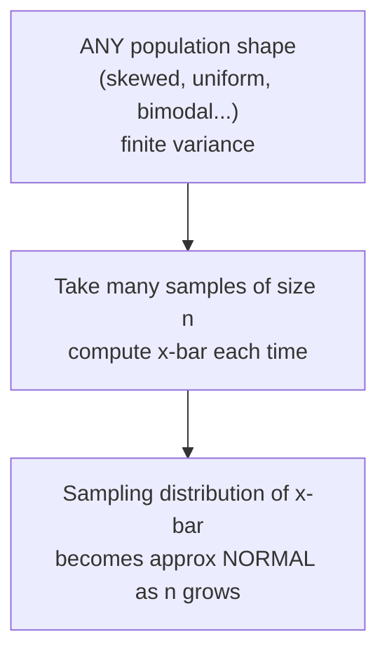
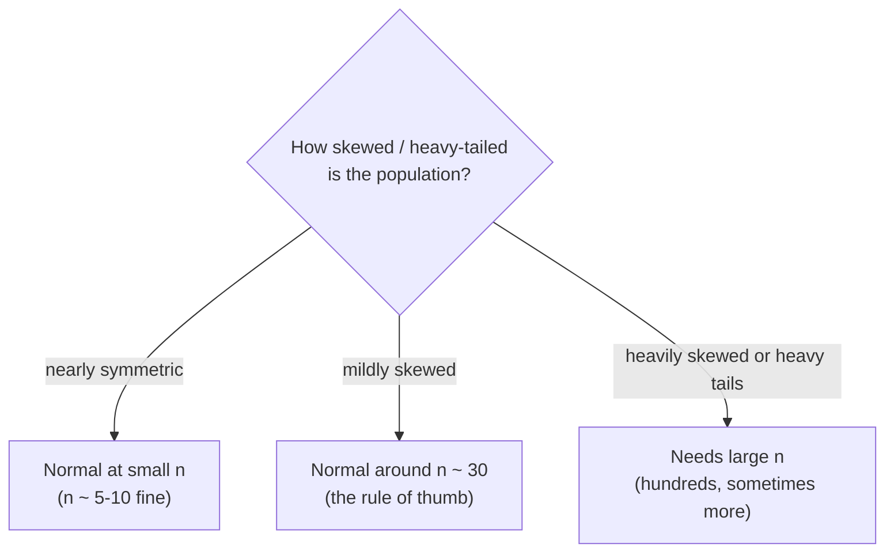

In *Sampling Distributions* you built the sampling distribution of the
mean and may have noticed something curious: even when the population was
skewed, the histogram of sample means came out roughly **bell-shaped**.
That was not luck. It is the **Central Limit Theorem (CLT)** — arguably
the most important result in all of statistics, and the reason so many
methods "just work" with a normal-based formula even on messy, non-normal
data.

The CLT is what lets you use clean, normal-distribution tools to build
confidence intervals and run hypothesis tests on real-world data that is
skewed, lumpy, or weird-shaped. Without it, every analysis would need a
custom distribution for every dataset. The CLT says: don't bother — for
the **mean**, things converge to the same familiar bell curve.

<svg
  viewBox="0 0 640 190"
  role="img"
  aria-label="Four small distributions morph from left to right — a red skewed slide, a yellow lopsided hump, a blue almost-bell, and a clean green bell — as the sample size beneath each grows from one to one hundred, the distribution of the mean forgets the parent's shape"
  style={{ display: "block", width: "100%", maxWidth: "640px", height: "auto", margin: "2.5rem auto" }}
>
  <rect x="44" y="130" width="556" height="4" rx="2" fill="currentColor" opacity="0.15" />
  <g style={{ color: "var(--ds-red-500)" }} fill="currentColor">
    <path d="M 48 130 L 48 52 C 70 60 95 105 150 124 C 158 127 164 129 168 130 Z" fillOpacity="0.4" />
  </g>
  <g style={{ color: "var(--ds-yellow-500)" }} fill="currentColor">
    <path d="M 198 130 C 210 130 212 80 232 76 C 260 70 286 112 318 126 L 322 130 Z" fillOpacity="0.5" />
  </g>
  <g style={{ color: "var(--ds-blue-500)" }} fill="currentColor">
    <path d="M 348 130 C 364 130 368 70 396 70 C 424 70 432 118 468 127 L 472 130 Z" fillOpacity="0.45" />
  </g>
  <g style={{ color: "var(--ds-green-500)" }} fill="currentColor">
    <path d="M 498 130 C 518 130 522 62 548 62 C 574 62 578 130 598 130 Z" fillOpacity="0.5" />
  </g>
  <g fill="currentColor" opacity="0.35">
    <circle cx="176" cy="94" r="2.5" />
    <circle cx="186" cy="94" r="2.5" />
    <circle cx="328" cy="94" r="2.5" />
    <circle cx="338" cy="94" r="2.5" />
    <circle cx="478" cy="94" r="2.5" />
    <circle cx="488" cy="94" r="2.5" />
  </g>
  <g fill="currentColor" opacity="0.5">
    <text x="106" y="158" textAnchor="middle" fontFamily="var(--font-mono), ui-monospace, monospace" fontSize="14">1</text>
    <text x="258" y="158" textAnchor="middle" fontFamily="var(--font-mono), ui-monospace, monospace" fontSize="14">5</text>
    <text x="408" y="158" textAnchor="middle" fontFamily="var(--font-mono), ui-monospace, monospace" fontSize="14">30</text>
    <text x="548" y="158" textAnchor="middle" fontFamily="var(--font-mono), ui-monospace, monospace" fontSize="14">100</text>
  </g>
</svg>

## The theorem in plain words

Here is the whole idea, stated as plainly as possible:

<Callout type="info" title="The Central Limit Theorem, in one sentence">
If you take samples of size `n` from *almost any* population (it just
needs a finite variance) and compute the sample mean each time, then **as
`n` gets large, the sampling distribution of that mean becomes
approximately normal** — centered on μ, with spread `σ / √n`
— **no matter what shape the original population has.**
</Callout>

Read that again, because three different claims are packed in:

1. **It's about the *mean's* distribution**, not the data. The raw data
   stays exactly as skewed as it ever was. Only the *sampling
   distribution of x̄* turns normal.
2. **The population's shape doesn't matter** (given finite variance).
   Exponential, uniform, bimodal, lumpy — all of them lead to a normal
   sampling distribution of the mean for large `n`.
3. **It's an approximation that improves with `n`.** Small `n`: the
   sampling distribution still looks like the population. Large `n`: it's
   essentially normal.

## Watch it happen from a skewed population

Talk is cheap; the CLT is best *seen*. We'll start with a heavily
right-skewed exponential population — about as un-normal as it gets — and
build the sampling distribution of the mean at n = 1, 5, 30, 100. Watch
the shape morph from skewed to bell.

<CodeBlock
  adapter="python"
  files={[
    {
      filename: "main.py",
      starterCode: `import numpy as np
import pandas as pd
import plotly.express as px
from scipy import stats

rng = np.random.default_rng(42)

# A heavily right-skewed population (e.g. wait times). VERY non-normal.
population = rng.exponential(scale=10.0, size=1_000_000)
MU = population.mean()  # ~10
SIGMA = population.std()  # ~10

rows = []
for n in [1, 5, 30, 100]:
    means = np.array(
        [rng.choice(population, size=n, replace=False).mean() for _ in range(5000)]
    )
    skew = stats.skew(means)
    for m in means:
        rows.append({"x_bar": m, "panel": f"n = {n}  (skew={skew:.2f})"})
    print(
        f"n = {n:3d}:  mean of x-bars = {means.mean():5.2f}  "
        f"sd = {means.std():5.2f}  skewness = {skew:+.2f}"
    )

df = pd.DataFrame(rows)
fig = px.histogram(
    df,
    x="x_bar",
    facet_col="panel",
    facet_col_wrap=2,
    nbins=50,
    height=620,
    title="Exponential population: sampling distribution of x-bar normalizes as n grows",
)
fig.update_xaxes(matches=None)
fig.show()

print()
print(f"Population skewness (n=1 case) is large and positive (~2).")
print("As n grows, the skewness of x-bar marches toward 0 -> bell shape.")
`,
    },
  ]}
/>

At n = 1, the "sampling distribution of the mean" is just the
population itself — wildly skewed (skewness ≈ 2). By n = 5 it's less
lopsided. By n = 30 it's nearly symmetric, and by n = 100 it's a
clean bell. The **skewness number marches toward zero** as `n` grows.
That march is the CLT in action: averaging washes out the asymmetry.

<Callout type="danger" title="The #1 CLT misconception: it does NOT normalize your data">
The CLT says nothing about your raw data. Your exponential population is
*still exponential* — averaging doesn't reach back and change the
individual values. Only the **distribution of the sample mean** becomes
normal. So you should *never* "invoke the CLT" to claim your dataset is
normal, run a normality test and expect it to pass, or justify treating
*individual* observations as normal. The CLT is a statement about
x̄, full stop.
</Callout>

## It's not about exponentials — try any shape

The magic of the CLT is its universality. Let's throw three radically
different populations at it — right-skewed, flat uniform, and bimodal
(two separated humps) — and confirm the *mean's* sampling distribution
goes normal in every case at large `n`. A normal curve is overlaid for
comparison.

<svg
  viewBox="0 0 640 210"
  role="img"
  aria-label="Three wildly different parent shapes — a skewed slide, a flat slab, and a two-humped camel — all funnel along dotted trails into the same single green bell on the right — averaging washes out every parent's shape into one universal curve"
  style={{ display: "block", width: "100%", maxWidth: "640px", height: "auto", margin: "2.5rem auto" }}
>
  <g fill="currentColor" opacity="0.15">
    <rect x="50" y="62" width="150" height="4" rx="2" />
    <rect x="50" y="124" width="150" height="4" rx="2" />
    <rect x="50" y="186" width="150" height="4" rx="2" />
    <rect x="420" y="170" width="170" height="4" rx="2" />
  </g>
  <g style={{ color: "var(--ds-blue-500)" }} fill="currentColor" fillOpacity="0.4">
    <path d="M 56 62 L 56 20 C 75 26 100 48 140 58 C 148 60 154 61 158 62 Z" />
    <rect x="58" y="96" width="130" height="28" rx="5" />
    <path d="M 58 186 C 70 186 72 152 86 152 C 100 152 98 176 108 176 C 118 176 116 152 130 152 C 144 152 146 186 158 186 Z" />
  </g>
  <g fill="currentColor" opacity="0.3">
    <circle cx="240" cy="58" r="2.5" />
    <circle cx="290" cy="80" r="2.5" />
    <circle cx="340" cy="104" r="2.5" />
    <circle cx="240" cy="124" r="2.5" />
    <circle cx="290" cy="126" r="2.5" />
    <circle cx="340" cy="128" r="2.5" />
    <circle cx="240" cy="184" r="2.5" />
    <circle cx="290" cy="168" r="2.5" />
    <circle cx="340" cy="152" r="2.5" />
    <circle cx="384" cy="130" r="2.5" />
  </g>
  <g style={{ color: "var(--ds-green-500)" }} fill="currentColor">
    <path d="M 424 170 C 460 170 466 64 504 64 C 542 64 548 170 584 170 Z" fillOpacity="0.5" />
  </g>
  <g style={{ color: "var(--ds-yellow-500)" }} fill="currentColor">
    <rect x="501.5" y="70" width="5" height="100" rx="2.5" fillOpacity="0.8" />
  </g>
</svg>

<CodeBlock
  adapter="python"
  files={[
    {
      filename: "main.py",
      starterCode: `import numpy as np
import pandas as pd
import plotly.graph_objects as go
from scipy import stats

rng = np.random.default_rng(7)
N = 1_000_000

populations = {
    "right-skewed (exponential)": rng.exponential(8.0, N),
    "uniform (flat)": rng.uniform(0.0, 20.0, N),
    "bimodal (two humps)": np.concatenate(
        [rng.normal(5, 1.5, N // 2), rng.normal(15, 1.5, N // 2)]
    ),
}

n = 50  # a single, moderately large sample size
fig = go.Figure()
for name, pop in populations.items():
    means = np.array(
        [rng.choice(pop, size=n, replace=False).mean() for _ in range(4000)]
    )
    # standardize so all three overlay on the same axis
    z = (means - means.mean()) / means.std()
    fig.add_histogram(
        x=z, nbinsx=60, opacity=0.55, name=name, histnorm="probability density"
    )
    print(f"{name:30s} -> skewness of x-bar = {stats.skew(means):+.2f}")

# overlay the standard normal curve
xs = np.linspace(-4, 4, 200)
fig.add_scatter(
    x=xs,
    y=stats.norm.pdf(xs),
    mode="lines",
    name="standard normal",
    line=dict(color="black", width=3),
)
fig.update_layout(
    barmode="overlay",
    title=f"Three very different populations -> same normal mean (n={n})",
    xaxis_title="standardized x-bar",
)
fig.show()

print("\\nAll three sampling distributions hug the same black normal curve.")
`,
    },
  ]}
/>

Three populations that look nothing alike — a decaying tail, a flat
block, two separated humps — all produce a sampling distribution of the
mean that snaps onto the *same* standard normal curve once standardized.
This universality is exactly why normal-based formulas (confidence
intervals, t-tests, z-tests) are so broadly useful: they target the
*mean*, and the mean's distribution is normal almost regardless of the
data.

<MultipleChoice
  markdown={`A population of customer wait times is strongly right-skewed. You repeatedly take samples of \`n = 80\` and compute the mean. According to the CLT, the histogram of those sample means will be:

- Right-skewed, just like the population
  > The CLT says the *mean's* sampling distribution loses the population's skew as $n$ grows. At $n=80$ it will be close to symmetric, not skewed like the raw data.
- [o] Approximately normal (bell-shaped and symmetric), centered on the true mean
  > For a population with finite variance, the sampling distribution of the mean approaches normality as $n$ grows; $n=80$ is comfortably large for a moderately skewed population.
- Bimodal, because averaging creates two peaks
  > Averaging doesn't create modes; it smooths toward a single bell. The mean's sampling distribution is unimodal and approximately normal here.
- Uniform, since every sample is equally likely
  > Samples being equally likely doesn't make the *means* uniformly distributed. The means concentrate near $\\mu$ in a bell shape, with extreme means rare.

The CLT acts on the *mean's* distribution, turning it normal even when the raw data is skewed.`}
/>

## "n ≥ 30" is a rule of thumb, not a law

You'll hear "n ≥ 30 and you're fine." Treat it as a *loose* guideline,
not a magic threshold. How fast the sampling distribution becomes normal
depends on **how skewed or heavy-tailed the population is**:

- Nearly symmetric population → the mean is approximately normal at very
  small `n` (even n = 5).
- Mildly skewed → n ≈ 30 is genuinely fine.
- Heavily skewed or with rare extreme values → you may need `n` in the
  hundreds before the bell is trustworthy.

The next simulation makes the point concretely: a wildly skewed
population (a log-normal, which has a long heavy tail) is *still*
noticeably skewed at n = 30. The rule of thumb would have lied to you.

<CodeBlock
  adapter="python"
  files={[
    {
      filename: "main.py",
      starterCode: `import numpy as np
from scipy import stats

rng = np.random.default_rng(3)

# Log-normal: extremely right-skewed with a heavy tail (think income, claim sizes).
population = rng.lognormal(mean=0.0, sigma=1.3, size=2_000_000)
print(f"Population skewness: {stats.skew(population[:200000]):.2f}  (very large!)\\n")

print(f"{'n':>5} | {'skewness of x-bar':>18}")
print("-" * 28)
for n in [2, 10, 30, 100, 300, 1000]:
    means = np.array(
        [rng.choice(population, size=n, replace=False).mean() for _ in range(4000)]
    )
    print(f"{n:>5} | {stats.skew(means):>18.2f}")

print()
print("At n=30 the mean is STILL clearly skewed for this heavy-tailed population.")
print("It takes n in the hundreds before x-bar looks reliably normal.")
print("Lesson: 'n >= 30' is a guideline, not a guarantee.")
`,
    },
  ]}
/>

At n = 30 the sample mean of this log-normal still carries obvious
skew. You need `n` in the hundreds before it settles into a bell. The
takeaway isn't "30 is wrong" — for mild skew it's fine — it's that the
right `n` **depends on the population**. The more extreme the shape, the
more averaging it takes to normalize the mean.

<Callout type="warn" title="When the CLT can fail you">
The CLT needs a **finite variance**. A few real distributions (the Cauchy
distribution, certain power-law / "fat-tailed" phenomena) have infinite
or undefined variance, and for those the sample mean does **not** settle
into a normal bell no matter how big `n` gets — sometimes the mean
doesn't stabilize at all. These are rare in everyday data but real in
finance and network science. If your data has monstrous outliers and the
mean keeps lurching as you add data, suspect a heavy tail and lean on the
**median** or robust methods instead.
</Callout>

## The spread shrinks like 1 over root n

The CLT also pins down the *width* of the bell: the sampling distribution
of the mean has standard deviation `σ / √n`. That `1/√n` is
the same diminishing-returns law we keep meeting — and it's worth
verifying directly.

<CodeBlock
  adapter="python"
  files={[
    {
      filename: "main.py",
      starterCode: `import numpy as np
import plotly.express as px

rng = np.random.default_rng(11)

# Use a skewed population to stress-test the formula.
population = rng.exponential(scale=10.0, size=1_000_000)
SIGMA = population.std()  # population sd

ns = [4, 9, 16, 36, 64, 100, 225, 400]
empirical, theory = [], []
for n in ns:
    means = np.array(
        [rng.choice(population, size=n, replace=False).mean() for _ in range(4000)]
    )
    empirical.append(means.std())  # measured spread of x-bar
    theory.append(SIGMA / np.sqrt(n))  # CLT prediction sigma/sqrt(n)

fig = px.line(
    x=ns,
    y=theory,
    markers=True,
    labels={"x": "sample size n", "y": "SD of x-bar"},
    title="SD of x-bar follows sigma / sqrt(n)",
)
fig.add_scatter(
    x=ns,
    y=empirical,
    mode="markers",
    name="simulated",
    marker=dict(size=11, symbol="x"),
)
fig.data[0].name = "sigma / sqrt(n) (theory)"
fig.show()

print(f"{'n':>5} | {'simulated sd':>13} | {'sigma/sqrt(n)':>13}")
print("-" * 38)
for n, e, t in zip(ns, empirical, theory):
    print(f"{n:>5} | {e:>13.3f} | {t:>13.3f}")
`,
    },
  ]}
/>

The simulated spread (the x markers) lands right on the `σ / √n`
curve, even though the population is exponential. Notice the perfect
squares in `ns` (4, 9, 16, 36, …): each time `n` quadruples, the spread
halves. That's why precision is expensive — covered fully in *Standard
Error*.

## Prove the CLT to yourself

<ChallengeCard
  adapter="python"
  title="Measure the skew of the mean falling as n grows"
  instructions={`A strongly right-skewed population (\`rng.exponential\`) has been created. For each sample size in \`ns = [2, 10, 50, 200]\`, build the sampling distribution of the **mean** (use \`n_samples = 3000\` samples drawn with the provided \`rng\`) and record the **skewness** of the sample means via \`scipy.stats.skew\`.

Produce a dict \`skews\` mapping each \`n\` (int key) to the skewness of \`x-bar\` (float value), e.g. \`{2: 1.3, 10: 0.6, ...}\`.

Because averaging washes out asymmetry, the skewness should **decrease** as \`n\` grows: \`skews[2] > skews[10] > skews[50] > skews[200]\`, and \`skews[200]\` should be small (near 0).`}
  files={[
    {
      filename: "main.py",
      initCode: `import numpy as np
from scipy import stats
rng = np.random.default_rng(2024)

population = rng.exponential(scale=12.0, size=1_000_000)  # heavily right-skewed
ns = [2, 10, 50, 200]
n_samples = 3000`,
      starterCode: `# TODO: for each n, build the sampling distribution of the mean and
# record stats.skew(...) of the sample means in the dict 'skews'.
skews = {}
`,
      solutionCode: `skews = {}
for n in ns:
    means = np.array(
        [rng.choice(population, size=n, replace=False).mean() for _ in range(n_samples)]
    )
    skews[n] = float(stats.skew(means))
print(skews)
`,
    },
  ]}
  tests={[
    {
      id: "keys",
      name: "skews has all four sample sizes",
      description: "Keys are 2, 10, 50, 200",
      code: `assert set(skews.keys()) == {2, 10, 50, 200}`,
    },
    {
      id: "floats",
      name: "values are floats",
      description: "Each skewness is a float",
      code: `assert all(isinstance(v, float) for v in skews.values())`,
    },
    {
      id: "decreasing",
      name: "skew decreases as n grows",
      description: "Averaging reduces asymmetry",
      code: `assert skews[2] > skews[10] > skews[50] > skews[200]`,
    },
    {
      id: "small_at_200",
      name: "nearly symmetric at n=200",
      description: "Skewness of x-bar is small for large n",
      code: `assert abs(skews[200]) < 0.35`,
    },
    {
      id: "large_at_2",
      name: "clearly skewed at n=2",
      description: "Small samples retain the population's skew",
      code: `assert skews[2] > 0.8`,
    },
  ]}
/>

<ChallengeCard
  adapter="python"
  title="Verify the sampling-distribution sd equals sigma over root n"
  instructions={`Using the provided skewed \`population\` (with known \`SIGMA = population.std()\`), build the sampling distribution of the **mean** at \`n = 64\` using \`n_samples = 5000\` samples (with the provided \`rng\`).

Produce a dict \`check\` with:

- \`"empirical_sd"\` — the standard deviation of your 5000 sample means (a float)
- \`"theory_sd"\` — the CLT prediction \`SIGMA / sqrt(64)\` (a float)
- \`"rel_diff"\` — the relative difference \`abs(empirical_sd - theory_sd) / theory_sd\` (a float)

The two should agree closely, so \`rel_diff\` should be small (under ~0.08).`}
  files={[
    {
      filename: "main.py",
      initCode: `import numpy as np
rng = np.random.default_rng(555)

population = rng.exponential(scale=15.0, size=1_000_000)
SIGMA = float(population.std())
n = 64
n_samples = 5000`,
      starterCode: `# TODO: build sample means, compute empirical sd, theory sd = SIGMA/sqrt(n),
# and their relative difference.
check = {
    "empirical_sd": None,
    "theory_sd": None,
    "rel_diff": None,
}
`,
      solutionCode: `means = np.array(
    [rng.choice(population, size=n, replace=False).mean() for _ in range(n_samples)]
)
empirical_sd = float(means.std())
theory_sd = float(SIGMA / np.sqrt(n))
check = {
    "empirical_sd": empirical_sd,
    "theory_sd": theory_sd,
    "rel_diff": float(abs(empirical_sd - theory_sd) / theory_sd),
}
print(check)
`,
    },
  ]}
  tests={[
    {
      id: "keys",
      name: "check has the right keys",
      description: "Dict has empirical_sd, theory_sd, rel_diff",
      code: `assert set(check.keys()) == {"empirical_sd", "theory_sd", "rel_diff"}`,
    },
    {
      id: "floats",
      name: "all values are floats",
      description: "Each output is a plain float",
      code: `assert all(isinstance(check[k], float) for k in check)`,
    },
    {
      id: "theory_value",
      name: "theory_sd equals SIGMA/sqrt(64)",
      description: "CLT prediction computed correctly",
      code: `import numpy as np
assert abs(check["theory_sd"] - SIGMA / np.sqrt(64)) < 1e-9`,
    },
    {
      id: "agreement",
      name: "empirical and theory agree",
      description: "Relative difference is small",
      code: `assert check["rel_diff"] < 0.08`,
    },
    {
      id: "rel_consistent",
      name: "rel_diff matches the two sds",
      description: "rel_diff equals |emp - theory| / theory",
      code: `assert abs(check["rel_diff"] - abs(check["empirical_sd"] - check["theory_sd"]) / check["theory_sd"]) < 1e-9`,
    },
  ]}
/>

<Callout type="tip" title="Why the CLT is the engine of inference">
Look at what the CLT hands you for free: the sample mean is approximately
Normal(μ, `σ / √n`) for large `n`, *regardless of the
data's shape*. That single fact is what makes z-intervals, t-tests, and
"estimate ± 2 standard errors" valid on real, messy data. Every time you
build a confidence interval for a mean or run a t-test, you are quietly
cashing in the CLT. We'll do exactly that in *Standard Error* and
*Confidence Intervals*.
</Callout>

## Check your understanding

<MultipleChoice
  markdown={`What does the Central Limit Theorem actually say becomes normal?

- The raw data values, once you collect enough of them
  > The CLT never claims your raw data becomes normal. Collecting more skewed data just gives you a clearer picture of the same skewed population.
- [o] The sampling distribution of the sample mean, as n grows, for populations with finite variance
  > The CLT is precisely a statement about the distribution of $\\bar{x}$ across repeated samples approaching normality — not about the data, and not about other statistics in general.
- The population distribution itself
  > The population's shape is fixed and unaffected by sampling. The CLT describes the behavior of an *estimate* (the mean), not the population.
- The distribution of the sample's standard deviation
  > The classic CLT is about the *mean*. While other statistics have their own limiting behavior, the CLT as usually stated concerns $\\bar{x}$, not $s$.

The CLT is about the *mean's* sampling distribution becoming normal — not the data, the population, or arbitrary statistics.`}
/>

<MultipleChoice
  markdown={`Your raw data is strongly right-skewed. A colleague runs a normality test on the **raw values**, it fails, and they conclude "the CLT doesn't apply here." What's wrong with that reasoning?

- Nothing — a failed normality test means the CLT can't be used
  > A normality test on *raw data* is irrelevant to the CLT. The CLT is about the sampling distribution of the *mean*, which can be normal even when the raw data clearly isn't.
- [o] The CLT is about the mean's sampling distribution, not the raw data; raw data failing a normality test is expected and doesn't block the CLT
  > Testing the raw values checks the wrong thing. The CLT predicts that $\\bar{x}$ normalizes as $n$ grows regardless of the raw data's shape, so a skewed-data result is beside the point.
- They should transform the data with a log first, then the CLT applies
  > A transform isn't required for the CLT to operate on the mean. The mean's sampling distribution approaches normal for the original data too, given enough $n$.
- The CLT only applies if the raw data is already approximately normal
  > That would make the CLT pointless. Its entire value is delivering a normal sampling distribution of the mean *even from* non-normal data.

The CLT governs $\\bar{x}$, so a normality test on individual data points doesn't tell you whether it applies.`}
/>

<MultipleChoice
  markdown={`For which population would the sample mean require the **largest** $n$ before its sampling distribution looks reliably normal?

- A nearly symmetric, light-tailed population
  > Symmetric, light-tailed populations normalize at very small $n$ — sometimes $n \\approx 5$. This needs the *least* data, not the most.
- A mildly right-skewed population
  > Mild skew is well-served by the classic $n \\approx 30$ guideline. It converges faster than a heavy-tailed case.
- [o] A heavily right-skewed, heavy-tailed population (e.g., log-normal incomes)
  > Heavy skew and rare extreme values make the mean's distribution converge slowly, so it can take $n$ in the hundreds before the bell shape is trustworthy.
- A uniform (flat) population
  > A uniform population is symmetric and light-tailed, so its mean normalizes quickly — much faster than a skewed, heavy-tailed one.

The heavier the skew/tails, the more averaging (larger $n$) it takes for the CLT's bell to emerge.`}
/>

<MultipleChoice
  markdown={`As you increase the sample size $n$ (population fixed with sd $\\sigma$), the **spread** of the sampling distribution of the mean:

- Stays the same, since the population's spread doesn't change
  > The population's spread is fixed, but the *mean's* spread is $\\sigma/\\sqrt{n}$, which falls as $n$ grows. They are different quantities.
- Grows like $\\sqrt{n}$
  > It shrinks, not grows. More data makes the mean *more* stable, so its sampling distribution gets narrower.
- [o] Shrinks like $\\sigma/\\sqrt{n}$ — quadrupling $n$ halves the spread
  > The CLT gives the spread of $\\bar{x}$ as $\\sigma/\\sqrt{n}$; since the spread scales with $1/\\sqrt{n}$, a 4x larger sample halves it.
- Shrinks like $\\sigma/n$ — quadrupling $n$ quarters the spread
  > The denominator is $\\sqrt{n}$, not $n$. Quadrupling $n$ divides the spread by $\\sqrt{4}=2$, halving it — not quartering it.

The width of the mean's bell is $\\sigma/\\sqrt{n}$: precision improves with the *square root* of sample size.`}
/>

<MultipleChoice
  markdown={`Which condition is **required** for the classic CLT to guarantee normality of the sample mean?

- The population must be symmetric
  > Symmetry is not required — the whole point of the CLT is that it works for skewed populations too, given enough $n$.
- The sample size must be exactly 30
  > 30 is a loose rule of thumb, not a requirement. The needed $n$ depends on the population's shape; there's no exact magic number.
- [o] The population must have a finite variance
  > Finite variance is the key condition; with it, the mean's sampling distribution converges to normal. Without it (e.g., Cauchy, certain fat tails), the CLT can fail.
- The data must be measured without error
  > Measurement error relates to bias and noise, not to the mathematical condition for the CLT. The requirement is finite variance, not perfect measurement.

The CLT's core requirement is a finite population variance; shape and an exact $n$ are not requirements.`}
/>

<MultipleChoice
  markdown={`A risk analyst models loss sizes with a fat-tailed distribution that has **infinite variance**. They average 10,000 losses and assume the mean is normally distributed via the CLT. What's the risk?

- No risk — 10,000 is plenty for the CLT
  > Sample size can't rescue a distribution that violates the CLT's assumptions. With infinite variance the usual CLT simply doesn't apply, regardless of $n$.
- [o] The classic CLT requires finite variance; with infinite variance the sample mean need not become normal (or even stabilize), so the normal approximation can be badly wrong
  > Infinite variance breaks the CLT's core condition, so the mean can keep lurching as data is added and the normal-based risk numbers can be severely misleading.
- The mean will be normal but the median won't be
  > Normality of the mean is exactly what's *not* guaranteed here. Ironically, robust summaries like the median are often the *safer* choice for such heavy tails.
- The only issue is that 10,000 is too small; 100,000 would fix it
  > More data doesn't fix a violated assumption. If the variance is infinite, even enormous $n$ won't make the sample mean normal.

The CLT's finite-variance condition is not optional — fat tails with infinite variance can defeat it at any sample size.`}
/>

<Callout type="success" title="Key takeaways">
- The **CLT**: for a population with **finite variance**, the *sampling distribution of the mean* becomes approximately **normal** as `n` grows — *whatever* the population's shape.
- It is about the **mean's distribution**, not the raw data. The CLT does **not** make your data normal.
- "n ≥ 30" is a **rough guideline**. Symmetric data normalizes at small `n`; heavily skewed/heavy-tailed data may need hundreds.
- The mean's bell has spread `σ / √n` — quadrupling `n` halves it.
- The CLT needs **finite variance**; fat-tailed distributions (Cauchy, certain power laws) can break it at any `n` — prefer robust methods there.
- This single theorem is why normal-based confidence intervals and tests work on messy real data.
</Callout>

The CLT tells us the mean's sampling distribution is normal with spread
`σ / √n`. That spread — the standard deviation of an *estimate* —
is the **standard error**, the quantity we estimate from a single sample
and the building block of every confidence interval and test statistic.
That's next.
