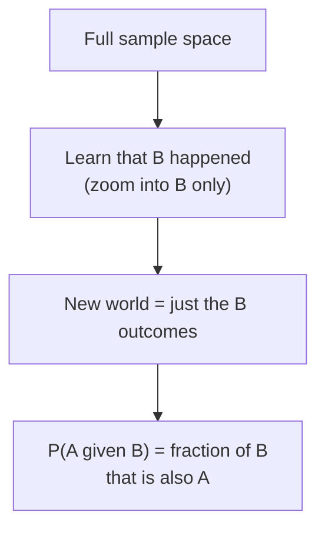
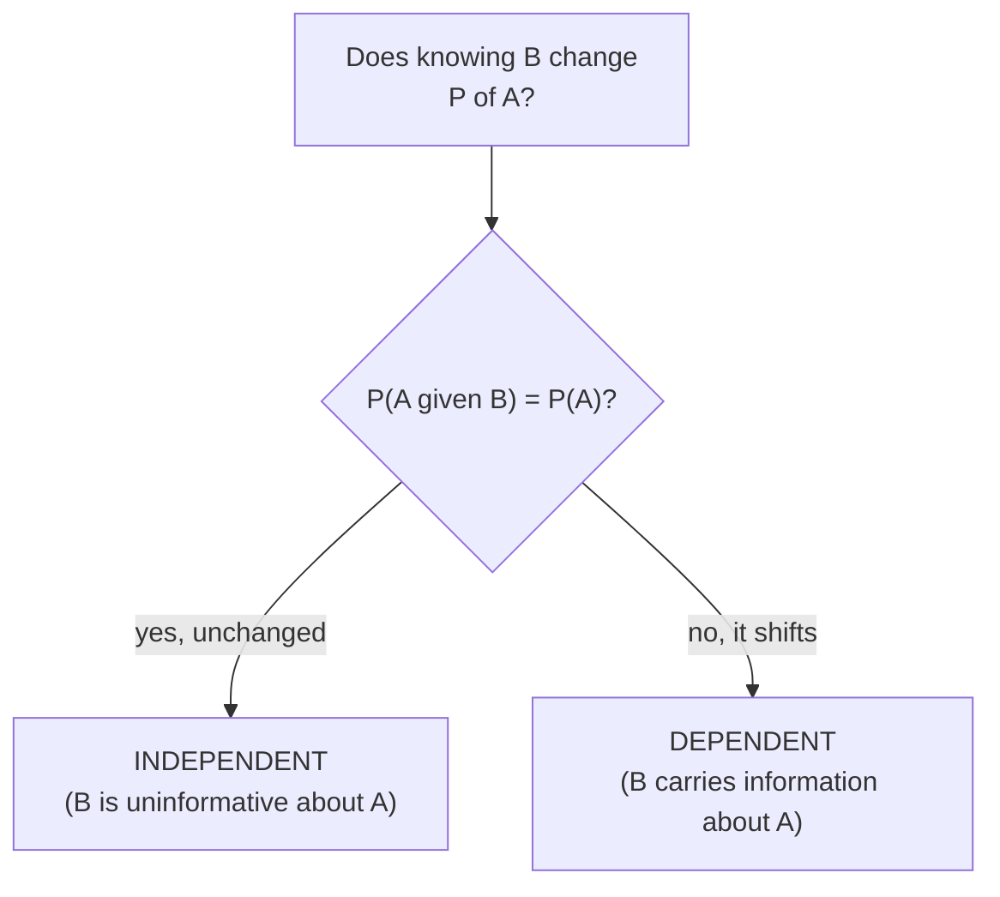
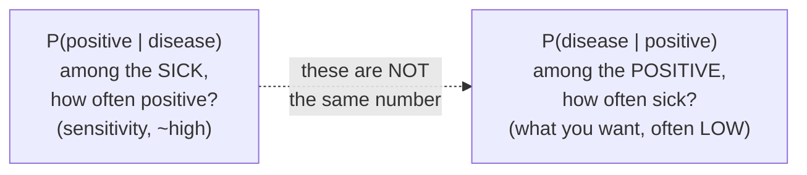
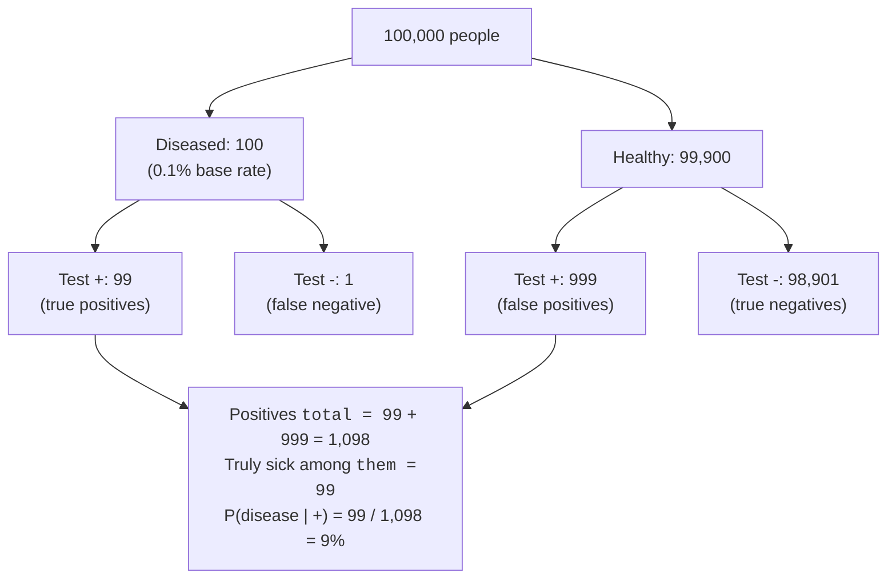

Almost no probability in real life stands alone. You rarely ask "what's
the chance a user churns?" in a vacuum, you ask "what's the chance they
churn *given that* they downgraded last month?" The phrase "given that"
is the heart of this page. **Conditional probability** is how a
probability changes once you learn something new, and it is the single
most important, and most counterintuitive, idea in this whole
chapter.

It's also where smart, careful people go spectacularly wrong. Doctors
misread cancer screenings, juries misweigh DNA evidence, and analysts
overreact to "99% accurate" detectors, all because of one slippery
mistake: confusing the probability of A given B with the probability of B
given A. By the end of this page you'll see exactly why a test that's
"99% accurate" for a rare disease can still be wrong about most of the
people it flags, and you'll be able to compute the truth in a few lines
of Python.

<Figure
  slug="stat-conditional-probability-cutout"
  alt="A large tray of tokens on a platform with a gate narrowing it to one subset, the proportions inside visibly different"
/>

## What conditioning means

The notation P(A | B) reads "the probability of A **given** B",
the probability that A happens *in the world where we already know B
happened*. Conditioning is just **zooming in** on a slice of the sample
space: you throw away every outcome where B didn't happen, and ask how
much of *what's left* is also A.

$$
P(A \mid B) = \frac{P(A \cap B)}{P(B)}
$$

The denominator changed from "everything" to "just B." That's the
entire idea: new information shrinks your sample space, and probabilities
get recomputed inside the smaller world.

<Callout type="info" title="Conditioning restricts the world">
Every conditional probability answers the same template: "*Among the
cases where B is true, how often is A also true?*" If you can phrase your
question that way, you've identified the condition (B) and the event (A).
Getting those two straight is half the battle.
</Callout>

A quick concrete version: in a deck of 52 cards, P(King) = 4/52.
But if someone tells you the card is a face card, you've zoomed into the
12 face cards, and P(King | face card) = 4/12 = 1/3.
Same card, different probability, because you knew more.

## Independence vs dependence

Sometimes learning B changes nothing. If P(A | B) = P(A), knowing
B leaves A's probability untouched, then A and B are
**independent**. That's the clean case from *Probability Basics*, where
you could just multiply. When the conditional probability *differs* from
the unconditional one, the events are **dependent**, and that difference
is information you can exploit.

<Figure
  slug="stat-conditional-probability-independence-vs-dependence-inline-cutout"
  alt="Two spinners side by side turning freely, and two more joined by a cord so one drags the other"
  caption="Independent events turn freely; dependent ones drag each other along."
/>

- Two separate coin flips: independent. The first tells you nothing
  about the second.
- A user's age and their plan tier: usually **dependent**. Knowing one
  shifts your beliefs about the other.

The **general multiplication rule** works whether or not events are
independent, you just have to use the conditional probability:

$$
P(A \text{ and } B) = P(A \mid B) \cdot P(B)
$$

When A and B happen to be independent, P(A | B) = P(A) and this
collapses back to the simple P(A) · P(B) you already know. The
conditional form is the honest, always-correct version; the
multiply-straight-across shortcut is just the special case where
independence holds.

<Callout type="warn" title="Misconception: real-world events are usually independent">
Independence is the *exception*, not the default. Customers who buy
diapers are more likely to buy wipes; users who churn often downgraded
first; sensor readings a second apart are correlated. Assuming
independence when it doesn't hold is how analyses quietly break, you
multiply probabilities that you had no business multiplying.
</Callout>

## Conditional probability from a table

In practice you rarely start from clean formulas, you start from
**counts** in a table. Conditional probability is then just "restrict to
the row (or column) you care about, then take a fraction within it."
Suppose we survey 1,000 users and cross-tabulate whether they're on a
paid plan against whether they churned this quarter.

<Figure
  slug="stat-conditional-probability-inline-cutout"
  alt="A board of chips with one region fenced off, the count taken only inside the fence and the rest ignored"
  caption="Conditioning fences off one region and counts only inside it."
/>

<CodeBlock
  adapter="python"
  files={[
    {
      filename: "main.py",
      starterCode: `import pandas as pd

# Counts of users by plan and churn status.
table = pd.DataFrame(
    {"churned": [30, 120], "stayed": [470, 380]},
    index=["paid", "free"],
)
display(table)
print(f"\\nTotal users: {table.values.sum()}")

# P(churned | paid): zoom into the 'paid' row, take fraction that churned.
paid_total = table.loc["paid"].sum()
p_churn_given_paid = table.loc["paid", "churned"] / paid_total
print(
    f"\\nP(churn | paid) = {table.loc['paid', 'churned']}/{paid_total} = {p_churn_given_paid:.3f}"
)

# P(churned | free): zoom into the 'free' row instead.
free_total = table.loc["free"].sum()
p_churn_given_free = table.loc["free", "churned"] / free_total
print(
    f"P(churn | free) = {table.loc['free', 'churned']}/{free_total} = {p_churn_given_free:.3f}"
)

# Compare to the UNCONDITIONAL churn rate (whole table).
p_churn = table["churned"].sum() / table.values.sum()
print(f"\\nP(churn) overall = {p_churn:.3f}")
`,
    },
  ]}
/>

Free users churn at more than five times the rate of paid users, the
conditional probabilities are wildly different from each other *and* from
the overall 15% rate. That gap is exactly the signal you'd act on. Notice
the mechanic: pick your condition (the row), then compute the fraction
*within that row*. We'll formalize this into a challenge shortly.

There is a way to see that gap without computing anything, and it is worth
knowing because it also shows you what independence looks like:

<Chart slug="mosaic-independence" />

Note that the columns in the left panel are very different widths, because 74%
of that traffic is desktop, and the split is identical anyway, because group
size has nothing to do with outcome. On the right the columns are exactly as
wide and only the split heights differ, a gap of 23 points.

The reason to prefer this over a stacked bar is that it shows both margins at
once. A 100 per cent stacked bar normalises every column to full height, so it
shows the conditional distribution and hides how many observations are behind
each one. A mosaic shows the joint distribution, which is what a contingency
table is, and the flat divider is a chi-squared test you can run with your eye.

The same rule is what separates two sentences that sound identical and differ
by four orders of magnitude:

<Chart slug="prosecutors-fallacy" />

Same test, same false-positive rate, opposite conclusion, entirely because of
how the suspect came to be tested. The identical error runs through medical
screening, fraud detection and every alerting system with a low base rate.

The true sentence is that the chance of this match if the defendant is
innocent is one in ten thousand. The fallacy is reading it backwards, as the
chance the defendant is innocent *given* the match, and those are different
conditionals that Bayes's rule exists to separate. In the wide pool that rate
produces about a hundred innocent matches alongside the one real one, so the
evidence is genuinely strong, having moved the field from one in a million to
one in 101, and it is nowhere near proof. What decides which it is is the
prior, and the prior is the part the courtroom version drops.

## Bayes' rule: flipping the conditional

Here's the trap that gives this whole topic its danger. **P(A | B)
and P(B | A) are different numbers**, and confusing them is so common
it has a name: the **confusion of the inverse**.

- P(positive test | disease), among *sick* people,
  how often does the test fire? (This is the test's sensitivity. Usually
  high.)
- P(disease | positive test), among people who
  *tested positive*, how many are actually sick? (This is what you
  actually want to know. Often *low*.)

**Bayes' rule** is the bridge that converts one into the other. We use it
here purely as a *tool for getting base rates right*, not as a gateway
to Bayesian inference, priors, or posteriors (that machinery is out of
scope for this course). The version worth knowing:

$$
P(A \mid B) = \frac{P(B \mid A) \cdot P(A)}{P(B)}
$$

The crucial ingredient is P(A), the **base rate**, how common A is
*before* you saw any evidence. Ignore the base rate and you'll badly
overestimate P(A | B). That single oversight is behind most
real-world probability disasters.

<Callout type="danger" title="Misconception: P(A given B) equals P(B given A)">
"99% of sick people test positive" does **not** mean "99% of positive
tests are sick people." Those are different conditionals pointing in
opposite directions. Swapping them, the **confusion of the inverse**,
is the error at the center of this entire page. Whenever you hear a
conditional claim, ask: *given what, exactly?*
</Callout>

## The centerpiece: a 99% accurate test that's usually wrong

This is the example every data scientist should be able to reproduce from
memory. A disease affects **1 in 1,000** people (base rate 0.001). A test
is **99% accurate** in both directions:

- **Sensitivity** = P(positive | disease) = 0.99
  (catches 99% of true cases).
- **Specificity** = P(negative | healthy) = 0.99, so
  the **false-positive rate** is 1%, it wrongly flags 1% of healthy
  people.

You test positive. What's the chance you actually have the disease? The
gut says "99%." The truth is about **9%**. Let's see why by walking a
concrete population of 100,000 people through a tree.

The killer is in the leaves: only **100** people are actually sick, but
**99,900** are healthy. Even though the test wrongly flags just 1% of
healthy people, 1% of a huge number (999) dwarfs the 99 true positives
from the tiny sick group. So most positives are false alarms. Let's
verify both by direct calculation and by simulating a population.

Counting is more convincing than arithmetic here. Every person who tests
positive, one dot each:

<Chart slug="base-rate-grid" />

<CodeBlock
  adapter="python"
  files={[
    {
      filename: "main.py",
      starterCode: `# Bayes' rule by hand: P(disease | positive).
base_rate = 0.001  # P(disease)
sensitivity = 0.99  # P(+ | disease)
fpr = 0.01  # P(+ | healthy)  = 1 - specificity

# P(+) = P(+ | disease)P(disease) + P(+ | healthy)P(healthy)
p_pos = sensitivity * base_rate + fpr * (1 - base_rate)

# Bayes' rule.
ppv = (sensitivity * base_rate) / p_pos  # PPV = P(disease | +)

print(f"P(positive) overall        = {p_pos:.4f}")
print(f"P(disease | positive)= PPV = {ppv:.4f}  (about {ppv * 100:.0f}%)")
print()
print("A POSITIVE on a '99% accurate' test means only a ~9% chance of")
print("disease here, because the disease is rare. The base rate dominates.")
`,
    },
  ]}
/>

<CodeBlock
  adapter="python"
  files={[
    {
      filename: "main.py",
      starterCode: `import numpy as np

rng = np.random.default_rng(7)

n = 2_000_000
base_rate, sensitivity, fpr = 0.001, 0.99, 0.01

# 1. Who actually has the disease?
has_disease = rng.random(n) < base_rate

# 2. Test result depends on disease status (this is the DEPENDENCE).
#    Sick people: positive w.p. sensitivity. Healthy: positive w.p. fpr.
p_positive = np.where(has_disease, sensitivity, fpr)
tests_positive = rng.random(n) < p_positive

# 3. Among everyone who tested positive, what fraction is truly sick?
positives = tests_positive.sum()
sick_and_positive = (has_disease & tests_positive).sum()
ppv_empirical = sick_and_positive / positives

print(f"People simulated:            {n:,}")
print(f"Tested positive:             {positives:,}")
print(f"   ...of whom truly sick:    {sick_and_positive:,}")
print(f"\\nEmpirical P(disease | +):   {ppv_empirical:.4f}")
print(f"(Matches the ~0.09 from Bayes' rule.)")
`,
    },
  ]}
/>

Both approaches agree: a positive result lifts your probability from
0.1% up to about 9%, a 90x jump, which is real and important, but
nowhere near the "99%" the accuracy figure tempts you to assume. The
base rate refuses to be ignored.

<Callout type="info" title="This is why rare-disease screening uses follow-up tests">
The fix isn't a "better" test (99% is already excellent), it's
recognizing that **screening a low-base-rate population produces mostly
false positives by design**. That's precisely why a positive screen is
followed by a second, independent confirmatory test: combining two tests
multiplies away the false positives. The same logic applies to fraud
detection, spam filters, and anomaly alerts, anywhere the thing you're
hunting is rare.
</Callout>

<MultipleChoice
  markdown={`In the screening example, the test is "99% accurate," yet only about 9% of people who test positive actually have the disease. What's the core reason?

- The test is poorly designed and should be discarded
  > 99% sensitivity and specificity is an excellent test. The low PPV comes from the rare disease, not from a flaw in the test.
- The simulation must be buggy because the answer is so low
  > The simulation matches the exact Bayes' rule calculation. The surprising-but-correct answer is the whole lesson, not a bug.
- A 99% accurate test always means 99% of positives are correct
  > That conflates accuracy with PPV. "99% of sick test positive" is a different conditional from "99% of positives are sick." The base rate decides PPV.
- [o] The disease is rare, so the small false-positive rate applied to the large healthy group produces more false positives than true positives
  > With a 0.1% base rate, the healthy group is enormous; 1% of it (false positives) outnumbers the few true positives from the tiny sick group.

Low base rate plus a nonzero false-positive rate yields mostly false alarms, accuracy alone never tells you the PPV.`}
/>

## Bayes' rule as updating a base rate

Step back from medicine: Bayes' rule is a general recipe for **updating a
prior belief in light of evidence**. You start with a base rate (how
likely something is before evidence), observe a clue, and combine them.
The structure is always the same three inputs: the base rate P(A), how
informative the evidence is when A is true P(B | A), and how often
the evidence shows up overall P(B).

A compact way to organize the calculation is to compute P(B) from its
two paths (the **law of total probability**), then divide:

<CodeBlock
  adapter="python"
  files={[
    {
      filename: "main.py",
      starterCode: `# Spam filter framing of the SAME math.
# Base rate: 20% of incoming email is spam.
p_spam = 0.20

# A particular word ("winner") appears in 60% of spam, 2% of real mail.
p_word_given_spam = 0.60
p_word_given_ham = 0.02

# Total probability of seeing the word at all (the two paths combined).
p_word = p_word_given_spam * p_spam + p_word_given_ham * (1 - p_spam)

# Bayes' rule: probability an email is spam GIVEN it contains the word.
p_spam_given_word = (p_word_given_spam * p_spam) / p_word

print(f"Base rate P(spam)            = {p_spam:.2f}")
print(f"After seeing 'winner':")
print(f"P(spam | 'winner')           = {p_spam_given_word:.3f}")
print(f"\\nThe evidence raised our belief from 0.20 to {p_spam_given_word:.2f}.")
`,
    },
  ]}
/>

That's the entire idea of updating: one informative word pushed a 20%
prior up past 88%. No priors-over-distributions, no posteriors, no MCMC,
just one application of the rule to revise a single base-rate number.
That's as far into Bayesian territory as this course goes, and it's
plenty for reasoning clearly about evidence.

<Callout type="tip" title="The reasoning habit that pays off forever">
When you see a strong-looking signal, ask **"how rare is the thing I'm
detecting?"** before you trust it. A flashy alert on a rare event is
usually a false positive. This one reflex, anchoring on the base rate,
prevents a huge fraction of real-world misjudgments in fraud, security,
medicine, and analytics.
</Callout>

Updating does not have to stop at one step. When the thing you are
estimating is a proportion, the same rule applied over and over has a
shape: the belief starts wide and tightens as evidence accumulates.

<Chart slug="beta-posterior-update" />

## The Monty Hall problem: conditioning that fooled the experts

Conditional probability is so counterintuitive that it once triggered a
public uproar. In 1990, the columnist Marilyn vos Savant answered a
reader's question in *Parade* magazine about the game show *Let's Make a
Deal*. The setup: three doors, a car behind one and goats behind the
other two. You pick a door. The host, who **knows** where the car is,
opens a *different* door to reveal a goat, then asks: do you want to
switch to the remaining door?

<Figure
  slug="stat-conditional-probability-conditioning-means-inline-cutout"
  alt="A board of chips with a fence dropped around one region and the count taken only inside it"
  caption="Knowing one thing changes the pool the probability is taken from."
/>

Vos Savant said switching wins **2/3 of the time**. Thousands of readers
wrote in to say she was wrong, including people with advanced degrees in
mathematics. She was right. The key is that the host's choice is *not*
random, it's conditioned on knowing where the car is, which leaks
information to the remaining door. Don't take anyone's word for it; run
it 100,000 times and count.

<CodeBlock
  adapter="python"
  files={[
    {
      filename: "main.py",
      initCode: `import numpy as np
rng = np.random.default_rng(0)`,
      starterCode: `trials = 100_000
car = rng.integers(0, 3, size=trials)       # door hiding the car
pick = rng.integers(0, 3, size=trials)      # your initial guess

# If you STAY, you win exactly when your first pick was the car.
stay_wins = (pick == car).mean()

# If you SWITCH, you win exactly when your first pick was WRONG,
# because the host then clears the only other goat for you.
switch_wins = (pick != car).mean()

print(f"Win rate if you STAY   : {stay_wins:.3f}  (~1/3)")
print(f"Win rate if you SWITCH : {switch_wins:.3f}  (~2/3)")
print()
print("Switching doubles your odds. The host's knowledge is the catch.")
`,
    },
  ]}
/>

The simulation needs no clever Bayes algebra, the win conditions fall
straight out of *what the host's move tells you*. That's conditional
probability doing exactly what the disease-test example did: a piece of
information (the opened goat door) reshapes a probability you thought was
settled.

The argument rarely convinces anyone, so here is the simulation: ten
thousand games of each strategy, plotted as a running win rate.

<Chart slug="monty-hall-simulation" />

## Practice

<ChallengeCard
  adapter="python"
  title="Conditional probability from a contingency table"
  instructions={`You're given a \`counts\` DataFrame cross-tabulating email by whether it was **opened** (columns) and which **segment** the recipient is in (rows).

Compute, as plain Python **floats**:

- **\`p_open_given_new\`**, \`P(opened | segment == "new")\`: among recipients in the \`"new"\` row, the fraction who opened. Use the \`"opened"\` and \`"not_opened"\` columns.
- **\`p_open_given_loyal\`**, \`P(opened | segment == "loyal")\`: the same fraction within the \`"loyal"\` row.
- **\`p_open_overall\`**, \`P(opened)\` across the entire table.

Use the provided \`counts\` DataFrame.`}
  files={[
    {
      filename: "main.py",
      initCode: `import pandas as pd
counts = pd.DataFrame(
    {"opened": [180, 420], "not_opened": [320, 80]},
    index=["new", "loyal"],
)`,
      starterCode: `# TODO: compute the three conditional / overall probabilities as floats
p_open_given_new = None
p_open_given_loyal = None
p_open_overall = None
`,
      solutionCode: `new_total = counts.loc["new"].sum()
loyal_total = counts.loc["loyal"].sum()
grand_total = counts.values.sum()

p_open_given_new = float(counts.loc["new", "opened"] / new_total)
p_open_given_loyal = float(counts.loc["loyal", "opened"] / loyal_total)
p_open_overall = float(counts["opened"].sum() / grand_total)

print(p_open_given_new, p_open_given_loyal, p_open_overall)
`,
    },
  ]}
  tests={[
    {
      id: "types",
      name: "all three are floats",
      description: "Values are Python floats",
      code: `assert all(isinstance(v, float) for v in [p_open_given_new, p_open_given_loyal, p_open_overall])`,
    },
    {
      id: "new",
      name: "P(opened | new) is correct",
      description: "180 / 500",
      code: `assert abs(p_open_given_new - 180/500) < 1e-9`,
    },
    {
      id: "loyal",
      name: "P(opened | loyal) is correct",
      description: "420 / 500",
      code: `assert abs(p_open_given_loyal - 420/500) < 1e-9`,
    },
    {
      id: "overall",
      name: "P(opened) overall is correct",
      description: "600 / 1000",
      code: `assert abs(p_open_overall - 600/1000) < 1e-9`,
    },
  ]}
/>

<ChallengeCard
  adapter="python"
  title="Update a base rate with Bayes' rule"
  instructions={`A fraud-detection model flags transactions. Use **Bayes' rule** to find the probability a flagged transaction is actually fraud.

Given:

- Base rate: **0.5%** of transactions are fraud (\`p_fraud = 0.005\`).
- The model flags **95%** of true fraud (\`p_flag_given_fraud = 0.95\`).
- The model flags **3%** of legitimate transactions (\`p_flag_given_legit = 0.03\`).

Compute, as plain Python **floats**:

- **\`p_flag\`**, the overall probability a transaction is flagged (use the law of total probability: the two paths combined).
- **\`ppv\`**, \`P(fraud | flagged)\` via Bayes' rule.

The answer should be well below 0.5, most flags are false alarms because fraud is rare.`}
  files={[
    {
      filename: "main.py",
      initCode: `p_fraud = 0.005
p_flag_given_fraud = 0.95
p_flag_given_legit = 0.03`,
      starterCode: `# TODO: compute p_flag (total probability of a flag) and ppv = P(fraud | flagged)
p_flag = None
ppv = None
`,
      solutionCode: `p_flag = float(p_flag_given_fraud * p_fraud + p_flag_given_legit * (1 - p_fraud))
ppv = float((p_flag_given_fraud * p_fraud) / p_flag)
print("P(flag):", p_flag)
print("PPV P(fraud | flag):", ppv)
`,
    },
  ]}
  tests={[
    {
      id: "types",
      name: "both are floats",
      description: "p_flag and ppv are floats",
      code: `assert isinstance(p_flag, float) and isinstance(ppv, float)`,
    },
    {
      id: "pflag",
      name: "p_flag uses total probability correctly",
      description: "Both paths combined",
      code: `expected = 0.95 * 0.005 + 0.03 * (1 - 0.005)
assert abs(p_flag - expected) < 1e-9`,
    },
    {
      id: "ppv",
      name: "ppv applies Bayes' rule correctly",
      description: "P(fraud | flagged)",
      code: `expected_ppv = (0.95 * 0.005) / (0.95 * 0.005 + 0.03 * (1 - 0.005))
assert abs(ppv - expected_ppv) < 1e-9`,
    },
    {
      id: "lowish",
      name: "most flags are false alarms",
      description: "PPV is below 0.5",
      code: `assert ppv < 0.5`,
    },
  ]}
/>

## Check your understanding

<MultipleChoice
  markdown={`"95% of patients with the flu have a fever." A patient walks in **with a fever**. Which probability does the 95% figure give you?

- P(flu | fever), the chance this feverish patient has the flu
  > That is the reverse of what's stated. Fever has many causes, so P(flu | fever) can be much lower than 95% even when P(fever | flu) is 95%.
- P(flu and fever), the chance of having both
  > A joint probability would have to be smaller than either piece and isn't what a "95% of flu patients" statement reports; that statement is a conditional.
- [o] P(fever | flu), the chance of fever among flu patients, which is *not* the same as the chance of flu given a fever
  > The statement conditions on having the flu and reports the fever rate. The patient's question (flu given fever) is the reverse conditional, which also depends on how common flu and fever are.
- P(fever), the overall chance of a fever
  > The overall fever rate ignores the flu condition entirely, whereas the statement is explicitly about flu patients.

Confusing P(fever | flu) with P(flu | fever) is the confusion of the inverse, the reverse direction needs base rates to compute.`}
/>

<MultipleChoice
  markdown={`A disease has a base rate of 1 in 10,000. A test has 99% sensitivity and a 1% false-positive rate. Roughly what is P(disease | positive)?

- Exactly 1 in 10,000, unchanged by the test
  > A positive result *does* raise the probability above the base rate, just not to 99%. Ignoring the evidence entirely is the opposite error.
- About 99%, since the test is 99% accurate
  > That equates accuracy with PPV. With an extremely rare disease, false positives swamp true positives, so PPV is far below 99%.
- About 50%, a coin flip
  > There's no reason the answer lands at 50%; the exact Bayes calculation with this tiny base rate gives a much smaller number.
- [o] About 1%, because false positives from the huge healthy group vastly outnumber the rare true positives
  > Out of 10,000 people, roughly 1 is sick (and tests positive) while about 100 healthy people falsely test positive, giving roughly 1 / 101 ≈ 1%.

The rarer the condition, the lower the PPV, a positive on a rare-disease screen is usually a false alarm.`}
/>

<MultipleChoice
  markdown={`Which quantity is the **base rate** in a Bayes' rule calculation, and why does it matter?

- The test's sensitivity, P(positive | disease)
  > Sensitivity describes the test's behavior on sick people, not how common the disease is. It's a different input to Bayes' rule.
- The false-positive rate, P(positive | healthy)
  > The false-positive rate is about the test's behavior on healthy people. It interacts with the base rate but is not itself the base rate.
- [o] The prior prevalence P(disease) before any test, it heavily shapes P(disease | positive)
  > The base rate is how common the condition is before evidence. When it's very low, even an accurate test yields a low post-test probability.
- The overall probability of a positive test, P(positive)
  > P(positive) is the normalizing denominator in Bayes' rule, computed *from* the base rate and the test rates, it isn't the base rate itself.

Neglecting the base rate is the classic error; it's the single input that most often makes PPV surprisingly low.`}
/>

<MultipleChoice
  markdown={`Two events A and B are **independent**. Which statement must be true?

- P(A and B) = P(A) + P(B)
  > Adding probabilities is for mutually exclusive "either/or" events, not for the joint probability of independent events.
- A and B cannot both occur
  > That describes mutually exclusive events. Independent events can co-occur; in fact independence is about information, not exclusion.
- [o] P(A | B) = P(A): knowing B occurred doesn't change A's probability
  > Independence is *defined* by the condition leaving the probability unchanged, which is equivalent to P(A and B) = P(A)·P(B).
- P(A | B) is always larger than P(A)
  > Under independence the conditional equals the unconditional probability, neither larger nor smaller.

Independence means the condition is uninformative: P(A | B) = P(A), which is exactly when you may multiply straight across.`}
/>

<MultipleChoice
  markdown={`A contingency table shows 200 paid users (40 churned) and 800 free users (240 churned). What is P(churned | free)?

- 240 / 280 ≈ 0.857
  > 280 is the total number of churned users across both segments, using it as the denominator answers P(free | churned), a different conditional.
- 240 / 1000 = 0.24
  > Dividing by the grand total gives the overall churn rate, not the rate *within* the free segment. Conditioning on "free" means dividing by the free total only.
- [o] 240 / 800 = 0.30
  > Conditioning on "free" restricts to the 800 free users, of whom 240 churned, giving 0.30.
- 40 / 200 = 0.20
  > That's P(churned | paid), computed in the wrong row. The question asks about the free segment.

To condition on a category, divide within that category's row, restricting the world to "free" means the free total is the denominator.`}
/>

<MultipleChoice
  markdown={`A spam filter: 30% of mail is spam; a phrase appears in 80% of spam and 5% of real mail. After seeing the phrase, how should your belief that the email is spam change, and via what rule?

- [o] It rises above 30%, Bayes' rule combines the 30% base rate with how much more often the phrase appears in spam
  > Bayes' rule updates the prior using the evidence's likelihood under each hypothesis; because the phrase is much more common in spam, the updated probability climbs above 30% (here to about 87%).
- It drops below 30%, since most mail is legitimate
  > The evidence points *toward* spam, so the probability should increase, not decrease. Most-mail-is-legit is already captured by the 30% prior.
- It jumps to 80%, the rate at which spam contains the phrase
  > 80% is P(phrase | spam), the reverse conditional. The quantity you want, P(spam | phrase), requires combining it with the base rate via Bayes' rule.
- It stays at 30%, because the base rate doesn't change
  > Observing informative evidence *should* update the probability. A phrase that's far more common in spam raises the probability above the base rate.

Bayes' rule formalizes updating: prior 30% plus phrase evidence yields a higher posterior, the everyday "update on evidence" reflex.`}
/>

<Callout type="success" title="Key takeaways">
- P(A | B) means "**among the B cases, how often is A also true**", conditioning **zooms into a slice** of the sample space.
- **Independent** means P(A | B) = P(A) (the shortcut multiply); otherwise events are **dependent** and you need the conditional form.
- P(A | B) ≠ P(B | A). Swapping them is the **confusion of the inverse**, the error behind most probability disasters.
- **Bayes' rule** flips a conditional and forces you to include the **base rate** P(A); ignore the base rate and you'll wildly overestimate.
- A "99% accurate" test for a **rare** event still yields **mostly false positives**, accuracy alone never tells you the PPV.
</Callout>

With conditional reasoning in hand, *Random Variables* puts numbers on
random outcomes so we can talk about averages and spread, the gateway
to the probability distributions that model real data.
