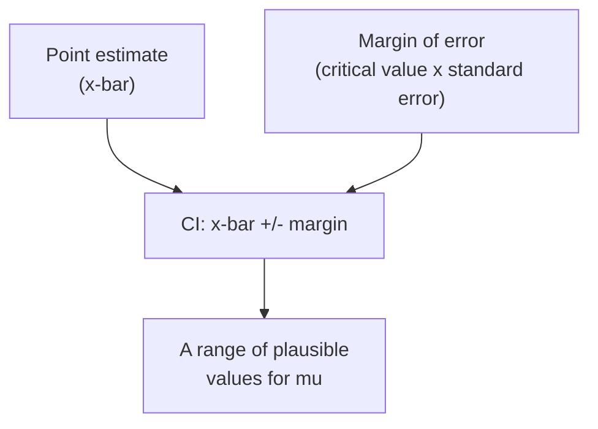
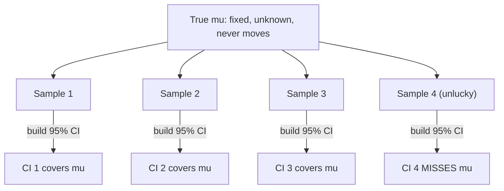
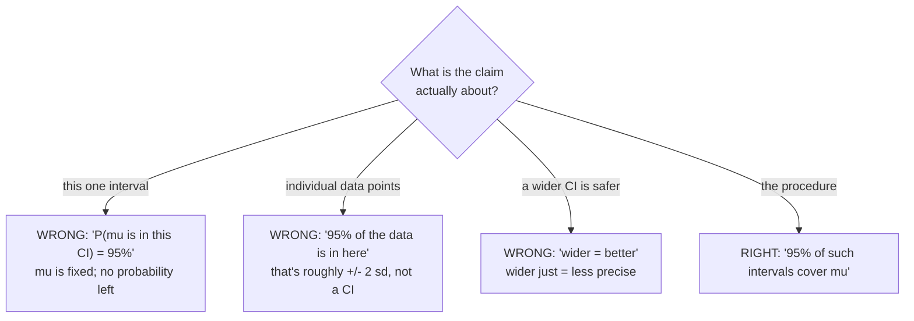
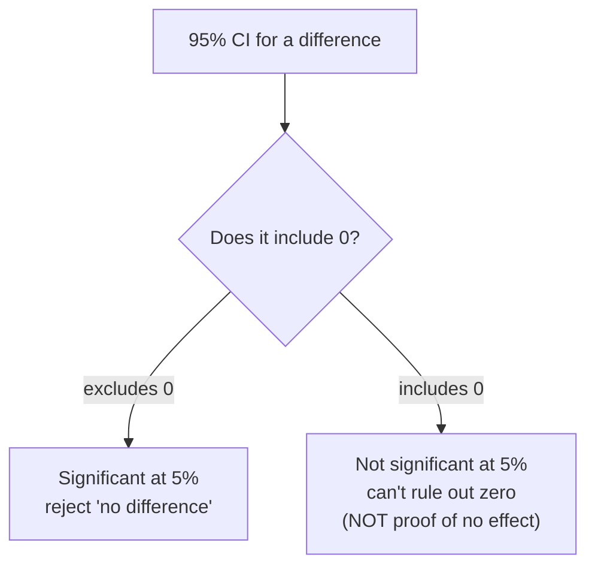

A single number is a confident-sounding lie. When you report "average
revenue per user is \$48.20," you've collapsed a noisy estimate into a
point that looks exact, but a different sample would have given \$46.10
or \$50.05. In *Populations and Samples* we named that wobble
*estimation error*, and in *Standard Error* we measured its size. A
**confidence interval** is what you report *instead* of the bare point:
a range that carries the uncertainty with it, so your reader knows how
precise the estimate actually is.

The shape is always the same, **point estimate ± margin of error**,
and it answers a specific question: *given the noise in my sample, what
range of values for the true parameter is plausible?* This page builds
that intuition, then spends most of its energy on the single most
misunderstood sentence in all of applied statistics: what "95%
confidence" actually means.

<Figure
  slug="stat-confidence-intervals-cutout"
  alt="A row of twenty horizontal interval bars on a platform crossing one vertical truth line, one bar missing it"
/>

## A point estimate alone hides its own uncertainty

You sample 50 users, the mean is \$48.20. That's your **point
estimate**, your single best guess for the population mean μ. But
you already know x̄ is a random variable: it has a *standard
error*, a typical sample-to-sample wobble. The point estimate throws
that information away. The confidence interval keeps it.

<Figure
  slug="stat-confidence-intervals-inline-cutout"
  alt="A row of twenty short horizontal bars each spanning a true value line, one bar clearly missing the line entirely"
/>

Read the diagram left to right: take your estimate, attach a margin of
error built from the standard error, and you get a band of plausible
values for the parameter. A wide band says "I'm not sure"; a narrow
band says "I've pinned this down." The interval turns a single number
into an *honest* number.

<Callout type="info" title="The anatomy of every confidence interval">
Every CI you will ever build has three ingredients:
**point estimate** (where you think the parameter is),
**standard error** (how much your estimate wobbles), and a
**critical value** (how many standard errors wide to make the band, set
by the confidence level). Combine them: $\text{estimate} \pm (\text{critical value} \times \text{standard error})$. Memorize the
*shape*, not any single formula, the shape is universal.
</Callout>

## Building a CI for a mean

For a population mean, the point estimate is $\bar{x}$ and the standard
error is $s / \sqrt{n}$ (sample standard deviation over root-n). Because
we estimate $\sigma$ from the data, the right critical value comes from
the **t-distribution** with $n - 1$ degrees of freedom, not the normal,
the t is slightly wider to pay for that extra uncertainty, and the
difference matters most when $n$ is small.

`scipy.stats` does the arithmetic for you. `stats.t.interval` takes the
confidence level, the degrees of freedom, the center, and the standard
error, and hands back the two endpoints.

<CodeBlock
  adapter="python"
  files={[
    {
      filename: "main.py",
      starterCode: `import numpy as np
from scipy import stats

rng = np.random.default_rng(42)

# A sample of 50 users' monthly spend (dollars). In real life we'd
# just have this array; the population mu is unknown.
sample = rng.normal(loc=48, scale=14, size=50)

n = sample.size
x_bar = sample.mean()
s = sample.std(ddof=1)  # sample sd (n-1)
se = s / np.sqrt(n)  # standard error of the mean

# 95% CI for the mean using the t-distribution (df = n - 1).
low, high = stats.t.interval(0.95, df=n - 1, loc=x_bar, scale=se)

print(f"n            = {n}")
print(f"x-bar        = {x_bar:.2f}   (point estimate)")
print(f"std error    = {se:.2f}")
print(f"95% CI       = ({low:.2f}, {high:.2f})")
print(f"margin       = +/- {(high - low) / 2:.2f}")
print()
print("Read it as: 'plausible values for the true mean run from")
print(f"{low:.2f} to {high:.2f}, given how noisy a sample of 50 is.'")
`,
    },
  ]}
/>

The margin of error is half the width, the $\pm$ part. Notice it is
built entirely from things you can compute from the sample ($s$, $n$)
and the confidence level (the critical value). If you want the critical
value explicitly, it's `stats.t.ppf(0.975, df=n-1)` for a 95% interval
(0.975 because 2.5% is left in each tail), and the CI is `x_bar ±
t_crit * se`. The two approaches give the identical interval.

<Callout type="tip" title="Why t and not z (normal)?">
You use the **t-distribution** whenever you estimate the standard
deviation from the same sample, which is essentially always in
practice. The t has heavier tails to account for that extra guesswork,
so its intervals are a touch wider, especially for small `n`. By the
time `n` is in the hundreds, t and normal are nearly identical, but
reaching for `stats.t.interval` is the safe default that's never wrong.
</Callout>

The same three lines work on any real sample. Here's a 95% CI for the
mean body mass of **Adelie penguins**, a real population parameter we
can only estimate from the 151 birds that were measured.

<CodeBlock
  adapter="python"
  datasets={[{ path: "palmer-penguins.csv", stageAs: "penguins.csv" }]}
  files={[
    {
      filename: "main.py",
      initCode: `import numpy as np
import pandas as pd
from scipy import stats
penguins = pd.read_csv("penguins.csv")`,
      starterCode: `mass = penguins.loc[penguins["species"] == "Adelie", "body_mass_g"].dropna()

n = mass.size
se = mass.std(ddof=1) / np.sqrt(n)
low, high = stats.t.interval(0.95, df=n - 1, loc=mass.mean(), scale=se)

print(f"n            = {n} Adelie penguins")
print(f"sample mean  = {mass.mean():.0f} g")
print(f"95% CI       = ({low:.0f} g, {high:.0f} g)")
print()
print("We measured 151 birds; this interval is our honest claim about")
print("the mean mass of ALL Adelie penguins, not just the ones we weighed.")
`,
    },
  ]}
/>

## What "95% confidence" really means

Here is the sentence almost everyone gets wrong. A 95% confidence level
is **a property of the procedure, not of any single interval you
computed.**

> If you repeated the entire process, draw a fresh sample, build a 95%
> interval from it, over and over, about 95% of those intervals would
> contain the true parameter.

The confidence is in the *recipe's long-run hit rate*, not in your one
particular interval. Your specific interval either contains μ or it
doesn't, you just don't know which, because μ is fixed and
invisible. The randomness lives in the *interval* (it jumps around with
your sample), not in the parameter (it sits still).

The diagram is the whole idea: μ never moves, but each sample
produces a *different* interval. Most cover the truth; an unlucky ~5%
miss. "95% confidence" is a promise about that picture, about the
collection of intervals the procedure would generate, not a
probability statement about the one interval in your notebook.

<Callout type="danger" title="The #1 misinterpretation (read this twice)">
"There is a 95% probability that the true mean lies in **this**
interval (48.2, 53.9)" is **wrong** under the standard (frequentist)
reading. Once the interval is computed, the true mean is either in it
or not, there's no probability left to assign, because nothing is
random anymore. The 95% describes how often the *method* succeeds
across many hypothetical samples, not the chance for your single
realized interval. The parameter is fixed; the interval was the random
thing, and you've already rolled the dice.
</Callout>

### The canonical simulation: watch the coverage happen

Talk is cheap; let's *see* it. We'll play god: define a population with
a known μ, then draw 100 separate samples, build a 95% CI from
each, and color the ones that miss μ. About 5 of the 100 should
fail, that's the 95% coverage made visible. This is the single most
important picture on the page.

<Chart slug="ci-coverage" />

<CodeBlock
  adapter="python"
  files={[
    {
      filename: "main.py",
      starterCode: `import numpy as np
import plotly.graph_objects as go
from scipy import stats

rng = np.random.default_rng(7)

MU_TRUE = 100.0  # the truth, normally hidden, here we know it
SIGMA = 15.0
n = 40  # each sample's size
n_intervals = 100  # how many samples/intervals to draw

lows, highs, centers, covers = [], [], [], []
for _ in range(n_intervals):
    s = rng.normal(MU_TRUE, SIGMA, size=n)
    se = s.std(ddof=1) / np.sqrt(n)
    lo, hi = stats.t.interval(0.95, df=n - 1, loc=s.mean(), scale=se)
    lows.append(lo)
    highs.append(hi)
    centers.append(s.mean())
    covers.append(lo <= MU_TRUE <= hi)  # did THIS interval catch mu?

covers = np.array(covers)
n_miss = int((~covers).sum())

fig = go.Figure()
for i in range(n_intervals):
    color = "#2ca02c" if covers[i] else "#d62728"  # green hit, red miss
    fig.add_trace(
        go.Scatter(
            x=[lows[i], highs[i]],
            y=[i, i],
            mode="lines",
            line=dict(color=color, width=2),
            showlegend=False,
        )
    )
fig.add_vline(
    x=MU_TRUE, line_dash="dash", line_color="black", annotation_text="true mu = 100"
)
fig.update_layout(
    title=f"100 separate 95% CIs, {n_miss} missed the true mu (red)",
    xaxis_title="value",
    yaxis_title="interval number",
    template="simple_white",
)
fig.show()

print(f"{n_intervals - n_miss} of {n_intervals} intervals covered mu.")
print(f"Coverage = {100 * covers.mean():.0f}% (target: 95%).")
print("Re-run with a different seed: the misses move, but ~5/100 stays.")
`,
    },
  ]}
/>

Every red interval was built by the *exact same correct procedure* as
every green one, it just drew an unlucky sample whose mean landed far
from μ. You can't look at one interval and know its color; that's
precisely why you can't say "this interval has a 95% chance." The 95%
is the fraction of green bars across the whole forest.

<Callout type="success" title="Say it the right way">
Correct: "We are 95% confident the true mean is between 48 and 54,"
understood as *the procedure that produced this range captures the truth
95% of the time*. Also fine in plain English: "our best estimate is 51,
give or take about 3." **Avoid**: "there's a 95% probability the mean is
in this interval", it sounds identical but means something the
frequentist framework can't deliver.
</Callout>

<MultipleChoice
  markdown={`You compute a 95% CI for average order value and get \\$(31, 37)\\$. Which statement is the technically correct interpretation?

- There is a 95% probability that the true average order value is between \\$31 and \\$37
  > This is the most common error. Once computed, the interval either contains the fixed true mean or it doesn't; the 95% refers to the long-run success rate of the *procedure*, not the probability for this one realized interval.
- [o] If we repeated this sampling-and-interval procedure many times, about 95% of the resulting intervals would contain the true mean
  > This frames the 95% as a property of the repeatable method, its long-run coverage rate, which is what a confidence level actually quantifies.
- 95% of all orders have a value between \\$31 and \\$37
  > A confidence interval bounds the *mean*, not individual orders. The spread of individual orders is described by the standard deviation, not by a CI for the mean, these are different ranges entirely.
- We are 95% sure the sample mean is between \\$31 and \\$37
  > The sample mean is known exactly and sits at the center of the interval, so there's no uncertainty about *it*. The uncertainty is about the unknown population mean.

The confidence level describes how often the method works across many samples, not the chance for your single interval.`}
/>

## What a CI is *not*, four misreadings to kill

The interpretation trap has several flavors. Name each one so you can
catch yourself.

- **"There's a 95% probability μ is in this interval."** Covered
  above, the parameter is fixed, so it's already in or out. The
  probability lived in the random interval, which is now decided.
- **"95% of the data falls inside the interval."** No. A CI for the
  *mean* is built from the *standard error* ($s / \sqrt{n}$), which
  shrinks as $n$ grows. The range that holds ~95% of individual values
  is roughly $\bar{x} \pm 2s$ (using the *standard deviation*) and does
  **not** shrink with $n$. Confusing these two is rampant, a 95% CI
  for the mean of a big sample can be razor-thin while the data
  themselves are spread all over.
- **"A wider interval is better/safer."** Wider means *less* precise,
  not more trustworthy. You can always get a wider interval by raising
  the confidence level toward 100%, but a 99.99% interval so vague it
  spans "somewhere between \$5 and \$95" tells you nothing. Precision
  (narrow) and confidence (high) trade off; the art is balancing them.
- **"The CI includes 0, so there's definitely no effect."** A CI that
  includes 0 (for a difference) or 1 (for a ratio) means you *can't
  rule out* no effect, it's consistent with zero, but also consistent
  with a meaningful effect at the interval's far end. "Can't rule out"
  is not "proven absent." We'll connect this directly to *Hypothesis
  Testing*.

<Callout type="warn" title="CI for the MEAN vs. range of the DATA">
This is worth isolating because it bites experienced analysts. The
**confidence interval for the mean** uses the **standard error**
$s / \sqrt{n}$ and gets *narrower* with more data, it's about pinning
down $\mu$. The **spread of the data** uses the **standard deviation**
$s$ and does *not* shrink with $n$, it's about how individual values
scatter. A CI of (49.8, 50.2) on 100,000 points does **not** mean the
data lives in that sliver; it means you know the *average* very
precisely. Always ask: "a range for the parameter, or for the values?"
</Callout>

## What controls the width

The margin of error is $\text{critical value} \times \text{standard error}$, so the width
responds to exactly three levers:

- **Confidence level ↑ → wider.** Demanding 99% coverage instead of 95%
  needs a bigger critical value, so the band grows. More confidence
  costs precision.
- **Sample size $n$ ↑ → narrower.** The standard error is $s / \sqrt{n}$,
  so width shrinks like $1 / \sqrt{n}$, quadruple the data to halve the
  margin. (The same diminishing return from *Standard Error*.)
- **Variability $s$ ↑ → wider.** Noisier data gives a noisier estimate.
  You don't control this directly, but cleaner measurement helps.

Let's watch the first two levers move.

<CodeBlock
  adapter="python"
  files={[
    {
      filename: "main.py",
      starterCode: `import numpy as np
from scipy import stats

rng = np.random.default_rng(0)
sample = rng.normal(50, 12, size=200)
x_bar = sample.mean()
se = sample.std(ddof=1) / np.sqrt(sample.size)
df = sample.size - 1

print("Same sample, different confidence levels (higher = WIDER):")
for conf in (0.80, 0.90, 0.95, 0.99):
    lo, hi = stats.t.interval(conf, df=df, loc=x_bar, scale=se)
    print(f"  {int(conf * 100)}% CI: ({lo:.2f}, {hi:.2f})   width = {hi - lo:.2f}")

print()
print("Fixed 95% confidence, growing n (bigger n = NARROWER):")
for n in (25, 100, 400, 1600):
    s = rng.normal(50, 12, size=n)
    se_n = s.std(ddof=1) / np.sqrt(n)
    lo, hi = stats.t.interval(0.95, df=n - 1, loc=s.mean(), scale=se_n)
    print(f"  n={n:5d}: ({lo:.2f}, {hi:.2f})   width = {hi - lo:.2f}")

print()
print("Notice: each 4x increase in n roughly HALVES the width.")
`,
    },
  ]}
/>

The two blocks make the trade-off concrete: you buy precision (a
narrower interval) either by accepting less confidence or by collecting
more data, and the $\sqrt{n}$ rule means the second option gets
expensive fast.

<MultipleChoice
  markdown={`Your 95% CI for a conversion-rate lift is too wide to be useful. Which change will *narrow* it without lowering your confidence level?

- Remove the most extreme data points to reduce the spread
  > Deleting inconvenient observations is data manipulation that biases the estimate. Any apparent narrowing is artificial and the resulting interval no longer has valid coverage.
- Switch from a 95% to a 99% confidence level
  > Raising the confidence level widens the interval, because a larger critical value is needed to catch the parameter more often. This is the opposite of what's wanted.
- Report the interval to more decimal places
  > Formatting changes the display, not the statistical width. The interval is exactly as wide as before; you've only printed more digits.
- [o] Collect a substantially larger sample
  > A larger $n$ shrinks the standard error ($s/\\sqrt{n}$), which directly narrows the interval while keeping the confidence level fixed, the standard way to gain precision.

Width scales with $1/\\sqrt{n}$, so more data is the honest lever for a tighter interval.`}
/>

The square root in that formula is the part worth internalising: halving
the margin of error costs four times the sample, and the curve flattens
long before most people expect it to.

<Chart slug="sample-size-margin-of-error" />

## A CI for a proportion

Means aren't the only thing you estimate. Conversion rates, churn
rates, click-through rates, "yes" shares in a survey, these are all
**proportions**, and they get confidence intervals too. The point
estimate is $\hat{p}$ (successes over trials), and the standard error
of a proportion is $\sqrt{\hat{p}(1 - \hat{p}) / n}$. The classic
"normal-approximation" (Wald) interval is

$$
\hat{p} \pm z \sqrt{\frac{\hat{p}(1 - \hat{p})}{n}}
$$

<CodeBlock
  adapter="python"
  files={[
    {
      filename: "main.py",
      starterCode: `import numpy as np
from scipy import stats

# A/B test variant: 540 conversions out of 3,000 visitors.
successes = 540
n = 3000
p_hat = successes / n

# Normal-approximation (Wald) 95% CI for a proportion.
z = stats.norm.ppf(0.975)  # ~1.96 for 95%
se = np.sqrt(p_hat * (1 - p_hat) / n)
low = p_hat - z * se
high = p_hat + z * se

print(f"p-hat   = {p_hat:.4f}  ({100 * p_hat:.1f}% conversion)")
print(f"std err = {se:.4f}")
print(f"95% CI  = ({low:.4f}, {high:.4f})")
print(f"        = ({100 * low:.1f}%, {100 * high:.1f}%)")
`,
    },
  ]}
/>

<Callout type="tip" title="The Wald interval is shaky near 0%, near 100%, or for small n">
The normal-approximation formula above is fine for a healthy sample
away from the extremes, but it behaves badly when p̂ is close to
0 or 1, or when `n` is small (it can even produce a lower bound below 0).
For those cases use a better interval, the **Wilson** or
**Clopper-Pearson** methods. In SciPy, `stats.binomtest(successes, n).proportion_ci()`
gives a robust interval (Clopper-Pearson by default, Wilson on request).
When in doubt, prefer those over the hand-rolled Wald formula.
</Callout>

## Practice building intervals

<ChallengeCard
  adapter="python"
  title="A 95% t-interval for a mean"
  instructions={`A \`sample\` of sensor readings has been created for you. Compute a **95% confidence interval for the population mean** using the **t-distribution**, and store the two endpoints in a tuple named \`ci\` as \`(low, high)\`.

Steps:
- Point estimate: the sample mean.
- Standard error: sample sd with **ddof=1**, divided by \`sqrt(n)\`.
- Use \`scipy.stats.t.interval(0.95, df=n-1, loc=mean, scale=se)\`.

\`ci\` must be a tuple of two floats with \`ci[0] < ci[1]\`.`}
  files={[
    {
      filename: "main.py",
      initCode: `import numpy as np
rng = np.random.default_rng(11)
sample = rng.normal(20.0, 3.0, size=64)`,
      starterCode: `from scipy import stats
import numpy as np

# TODO: build the 95% t-interval into ci = (low, high)
ci = None
`,
      solutionCode: `from scipy import stats
import numpy as np

n = sample.size
x_bar = sample.mean()
se = sample.std(ddof=1) / np.sqrt(n)
low, high = stats.t.interval(0.95, df=n - 1, loc=x_bar, scale=se)
ci = (float(low), float(high))
print(ci)
`,
    },
  ]}
  tests={[
    {
      id: "shape",
      name: "ci is a 2-tuple of floats",
      description: "Returns (low, high)",
      code: `assert isinstance(ci, tuple) and len(ci) == 2
assert all(isinstance(v, float) for v in ci)`,
    },
    {
      id: "ordered",
      name: "low is below high",
      description: "Endpoints are ordered",
      code: `assert ci[0] < ci[1]`,
    },
    {
      id: "value",
      name: "matches the t-interval",
      description: "Endpoints equal stats.t.interval",
      code: `import numpy as np
from scipy import stats
n = sample.size
se = sample.std(ddof=1) / np.sqrt(n)
lo, hi = stats.t.interval(0.95, df=n - 1, loc=sample.mean(), scale=se)
assert abs(ci[0] - lo) < 1e-6 and abs(ci[1] - hi) < 1e-6`,
    },
    {
      id: "centered",
      name: "interval is centered on the sample mean",
      description: "Midpoint equals x-bar",
      code: `import numpy as np
mid = (ci[0] + ci[1]) / 2
assert abs(mid - float(sample.mean())) < 1e-6`,
    },
  ]}
/>

<ChallengeCard
  adapter="python"
  title="A 95% CI for a proportion"
  instructions={`An email campaign got \`successes\` opens out of \`n\` sends (both given). Build a **95% normal-approximation (Wald) confidence interval** for the true open-rate proportion and store it as a tuple \`ci = (low, high)\`.

- Point estimate \`p_hat = successes / n\`.
- Standard error \`sqrt(p_hat * (1 - p_hat) / n)\`.
- Critical value \`stats.norm.ppf(0.975)\` (about 1.96).
- \`ci = (p_hat - z*se, p_hat + z*se)\`, both endpoints as floats.`}
  files={[
    {
      filename: "main.py",
      initCode: `successes = 312
n = 1500`,
      starterCode: `from scipy import stats
import numpy as np

# TODO: build the 95% proportion CI into ci = (low, high)
ci = None
`,
      solutionCode: `from scipy import stats
import numpy as np

p_hat = successes / n
se = np.sqrt(p_hat * (1 - p_hat) / n)
z = stats.norm.ppf(0.975)
ci = (float(p_hat - z * se), float(p_hat + z * se))
print(ci)
`,
    },
  ]}
  tests={[
    {
      id: "shape",
      name: "ci is a 2-tuple of floats",
      description: "Returns (low, high)",
      code: `assert isinstance(ci, tuple) and len(ci) == 2
assert all(isinstance(v, float) for v in ci)`,
    },
    {
      id: "range",
      name: "endpoints are valid probabilities",
      description: "Both within [0, 1] and ordered",
      code: `assert 0.0 <= ci[0] < ci[1] <= 1.0`,
    },
    {
      id: "value",
      name: "matches the Wald interval",
      description: "Endpoints equal the normal-approx formula",
      code: `import numpy as np
from scipy import stats
p = successes / n
se = np.sqrt(p * (1 - p) / n)
z = stats.norm.ppf(0.975)
assert abs(ci[0] - (p - z*se)) < 1e-9 and abs(ci[1] - (p + z*se)) < 1e-9`,
    },
    {
      id: "centered",
      name: "centered on p-hat",
      description: "Midpoint equals the sample proportion",
      code: `mid = (ci[0] + ci[1]) / 2
assert abs(mid - successes / n) < 1e-9`,
    },
  ]}
/>

<ChallengeCard
  adapter="python"
  title="How interval width shrinks with n"
  instructions={`Show the precision payoff of more data. For each sample size in \`sizes = [25, 100, 400]\`, a sample is drawn for you from the same population. Compute the **width** (high minus low) of the **95% t-interval** for the mean at each size, and store them **in order** in a list named \`widths\` (three floats).

Width = \`high - low\` from \`stats.t.interval(0.95, df=n-1, loc=mean, scale=se)\`, with \`se = sd(ddof=1)/sqrt(n)\`.

Because width scales like \`1/sqrt(n)\`, going 25 -> 100 (x4) should roughly halve it, and 100 -> 400 (x4) should roughly halve it again.`}
  files={[
    {
      filename: "main.py",
      initCode: `import numpy as np
rng = np.random.default_rng(2024)
sizes = [25, 100, 400]
samples = {n: rng.normal(50.0, 10.0, size=n) for n in sizes}`,
      starterCode: `from scipy import stats
import numpy as np

sizes = [25, 100, 400]
# samples[n] is the pre-drawn array for size n.
# TODO: compute the 95% t-interval width for each n, in order.
widths = []
`,
      solutionCode: `from scipy import stats
import numpy as np

sizes = [25, 100, 400]
widths = []
for n in sizes:
    s = samples[n]
    se = s.std(ddof=1) / np.sqrt(n)
    lo, hi = stats.t.interval(0.95, df=n - 1, loc=s.mean(), scale=se)
    widths.append(float(hi - lo))
print(widths)
`,
    },
  ]}
  tests={[
    {
      id: "shape",
      name: "widths is three floats",
      description: "One width per sample size",
      code: `assert isinstance(widths, list) and len(widths) == 3
assert all(isinstance(w, float) for w in widths)`,
    },
    {
      id: "decreasing",
      name: "width decreases as n grows",
      description: "Larger samples give narrower intervals",
      code: `assert widths[0] > widths[1] > widths[2]`,
    },
    {
      id: "value",
      name: "widths match the t-intervals",
      description: "Each width equals the computed interval width",
      code: `import numpy as np
from scipy import stats
for i, n in enumerate([25, 100, 400]):
    s = samples[n]
    se = s.std(ddof=1) / np.sqrt(n)
    lo, hi = stats.t.interval(0.95, df=n - 1, loc=s.mean(), scale=se)
    assert abs(widths[i] - (hi - lo)) < 1e-6`,
    },
    {
      id: "sqrtn",
      name: "roughly halves each 4x step",
      description: "Width ratio is near sqrt(4) = 2",
      code: `assert 1.5 < widths[0] / widths[1] < 2.6
assert 1.5 < widths[1] / widths[2] < 2.6`,
    },
  ]}
/>

## CIs and hypothesis tests are two views of one thing

A confidence interval and a hypothesis test are deeply linked, they're
the same information in two outfits. A 95% CI for a difference contains
exactly the values you would **not** reject at the 5% level. So a quick
test: **does the interval include the no-effect value?**

- A 95% CI for a *difference* that **excludes 0** corresponds to a
  statistically significant result (p < 0.05), you'd reject "no
  difference."
- A 95% CI that **includes 0** means you *cannot* rule out zero at the
  5% level, but, crucially, that's "not proven different," not "proven
  the same." The interval also includes nonzero values you can't rule
  out either.

This duality is why many statisticians prefer reporting a CI over a
bare p-value: the interval tells you the *direction*, the *plausible
magnitude*, and the *significance* all at once. We develop the test
side fully in *Hypothesis Testing* and *p-values*.

<Callout type="danger" title="'The CI includes 0' is not 'no effect'">
A difference CI of (-0.5, 8.0) includes 0, so you can't declare a
significant effect, but it *also* includes +8, a potentially large
effect you equally can't rule out. The honest reading is "the data are
consistent with anything from a small decrease to a sizable increase;
we need more data." Absence of evidence (a wide interval straddling 0)
is not evidence of absence (a tight interval hugging 0).
</Callout>

## Check your understanding

<MultipleChoice
  markdown={`A pollster reports "52% support, 95% CI 49% to 55%." A reader says "so there's a 95% chance the true support is between 49% and 55%." Why is this not the technically correct frequentist interpretation?

- Because confidence intervals only apply to means, never to proportions
  > Confidence intervals apply to proportions, means, differences, medians, and many other parameters. The interpretation issue has nothing to do with which parameter is being estimated.
- Because the interval should have been centered on 50%, not 52%
  > A CI is centered on the point estimate (52% here), which is correct. The centering isn't the problem; the probabilistic phrasing about a fixed parameter is.
- Because the sample was too small to make any probability claim
  > Sample size isn't the issue; the interpretation would be flawed for the same reason at any $n$. The problem is assigning a probability to a fixed parameter after the interval is set.
- [o] Because the true support is a fixed number that is either inside or outside this particular interval; the 95% describes the long-run hit rate of the procedure, not the chance for this one interval
  > Once the interval is computed, nothing is random, so no probability attaches to it; the 95% lives in the repeatable method's success rate across many samples.

The parameter is fixed and the interval is the random object, that's the heart of why "95% chance this interval" is the wrong phrasing.`}
/>

<MultipleChoice
  markdown={`You build a 95% CI for the **mean** weekly spend from 50,000 customers and get \\$(61.40, 61.80)\\$, a very narrow interval. A colleague concludes "so 95% of customers spend between \\$61.40 and \\$61.80." What's wrong?

- [o] The CI bounds the *mean*, using the standard error ($s/\\sqrt{n}$); individual spending varies far more and is described by the standard deviation, not this interval
  > A CI for the mean shrinks with $n$ and pins down the average, whereas the spread of individual values (standard deviation) does not shrink, these are different ranges.
- Nothing is wrong; that's exactly what the interval says
  > A confidence interval for the mean does not describe individual customers. Treating it as a range for raw values is a fundamental category error.
- The interval is too narrow to be trustworthy
  > The narrowness is legitimate: with 50,000 customers the mean is estimated very precisely. The error is interpreting a precise estimate of the *mean* as a range for *individuals*.
- The colleague should have used a 99% interval instead
  > Changing the confidence level only adjusts the width slightly; it would not turn a CI for the mean into a statement about individual customers. The category error remains.

A tiny CI for the mean of a huge sample says the average is known precisely, not that the data are tightly packed.`}
/>

<MultipleChoice
  markdown={`Why does a 99% confidence interval come out **wider** than a 95% one built from the same sample?

- Because 99% intervals automatically use a larger sample
  > The sample is the same in this comparison. Raising the confidence level does not change $n$; it changes only how many standard errors wide the interval is.
- [o] Because catching the parameter a larger fraction of the time requires a larger critical value, which multiplies the same standard error into a wider band
  > Higher confidence demands more standard errors of margin, so the critical value grows and the interval widens, confidence and precision trade off.
- Because a 99% interval uses a smaller standard error
  > The standard error depends on the data ($s$ and $n$), not on the confidence level, so it's identical for both intervals. Only the critical value differs.
- Because the true mean moves further away at 99% confidence
  > The true mean is fixed and unaffected by your chosen confidence level. What changes is the width of the interval you draw around your estimate.

More confidence buys coverage at the price of precision: a wider net catches the parameter more often.`}
/>

<MultipleChoice
  markdown={`In the coverage simulation, 100 separate 95% CIs were built from a known population and about 5 missed the true $\\mu$. What do the ~5 misses represent?

- [o] Unlucky samples whose intervals failed to capture the fixed $\\mu$, exactly the ~5% the 95% confidence level allows
  > A 95% level means the method misses about 5% of the time by design; those red intervals are that expected miss rate made visible.
- Proof that 95% confidence intervals are unreliable
  > A ~5% miss rate is precisely what "95% confidence" promises, so the simulation confirms the method works as advertised rather than undermining it.
- Samples where the population mean happened to change
  > The population mean was fixed at one value the entire time. It never changed; the *samples* varied, producing different intervals.
- A bug in the interval formula that should be fixed
  > Every interval, including the misses, used the same correct procedure. The misses are an expected feature of 95% confidence, not an error.

The misses are the built-in 5% failure rate of a 95% procedure, visible only because we could see the true mean.`}
/>

<MultipleChoice
  markdown={`Which scenario calls for the **t-distribution** rather than the normal (z) when building a CI for a mean?

- Only when the sample size is above 1,000
  > Large samples are where t and z nearly coincide, so the distinction barely matters there. The t is most needed for *small* samples, not large ones.
- Never; the normal distribution is always correct for means
  > Using z when $\\sigma$ is estimated understates uncertainty, especially for small samples. The t-interval corrects for that, so z is not always appropriate.
- [o] When the population standard deviation is unknown and estimated from the sample, which is essentially always in practice
  > Estimating $\\sigma$ from the same data adds uncertainty that the t-distribution's heavier tails account for, making t the safe default for real data.
- Only when the data are not normally distributed
  > The t-vs-z choice is about whether $\\sigma$ is known, not about the data's exact shape. (Severe non-normality is a separate concern addressed by larger $n$ or the bootstrap.)

Use t whenever you plug in a sample standard deviation, it pays for the extra guesswork with slightly wider intervals.`}
/>

<MultipleChoice
  markdown={`An A/B test gives a 95% CI for the lift in conversion of $(-0.4\\%, +3.1\\%)$. Your PM asks: "Did the treatment work?" What's the most accurate answer?

- No, the treatment had no effect
  > Including 0 means you can't *rule out* zero, but the interval also includes +3.1%, a meaningful gain. "Can't rule out zero" is not the same as "proven to have no effect."
- [o] We can't conclude a significant effect: the interval includes 0, so the data are consistent with anything from a slight decrease to a sizable increase, we likely need more data
  > Because the interval straddles 0, it is consistent with no effect *and* with a real effect, which is the honest "inconclusive, gather more data" reading.
- The test is invalid because the lower bound is negative
  > A negative lower bound for a difference is perfectly valid, it simply means a decrease can't be ruled out. Nothing about the test is invalid.
- Yes, the interval reaches +3.1%, so the treatment increased conversion
  > Reporting only the optimistic end ignores that the interval also includes 0 and negative values. You cannot claim a positive effect when no-effect is inside the interval.

A difference CI that includes 0 is inconclusive, not proof of no effect, it just hasn't separated signal from noise yet.`}
/>

<MultipleChoice
  markdown={`Which action genuinely **narrows** a confidence interval for a mean while keeping its confidence level and validity intact?

- [o] Increasing the sample size $n$
  > A larger $n$ reduces the standard error ($s/\\sqrt{n}$), narrowing the interval without touching the confidence level or compromising validity, the principled lever.
- Reporting the bounds with fewer significant figures
  > Rounding the display doesn't change the underlying width at all; the interval is exactly as wide, just printed more coarsely.
- Lowering the confidence level from 95% to 90%
  > This does narrow the interval, but it changes the confidence level, exactly what the question rules out. You'd be buying precision by accepting more frequent misses.
- Dropping the largest and smallest observations to shrink the spread
  > Selectively deleting data biases the estimate and destroys the interval's coverage guarantee. Any narrowing is illegitimate.

The legitimate route to a tighter interval at the same confidence is more data, width falls like $1/\\sqrt{n}$.`}
/>

<Callout type="success" title="Key takeaways">
- A confidence interval is **point estimate ± margin of error**, where margin = **critical value × standard error**. It expresses how *precise* your estimate is.
- "95% confidence" is a property of the **procedure**: repeat the sampling-and-interval process and ~95% of the intervals cover the true parameter. It is **not** "a 95% probability the parameter is in this one interval", the parameter is fixed, the interval was random.
- A CI for the **mean** (uses standard error, shrinks with $n$) is **not** a range for the **data** (uses standard deviation, doesn't shrink).
- Width grows with the **confidence level** and the **variability**, and shrinks like $\mathbf{1 / \sqrt{n}}$. Wider is *less* precise, not "safer."
- Use **`stats.t.interval`** for means (t-distribution, $df = n - 1$) and a proportion formula (or **`stats.binomtest(...).proportion_ci()`**) for rates.
- A difference CI that **includes 0** means *inconclusive*, not *no effect*, this is the bridge to *Hypothesis Testing*.
</Callout>

When a parameter has no clean standard-error formula, a median, a
trimmed mean, a ratio, a correlation, you can still get a confidence
interval by *resampling your data*. That remarkably general tool is
next, in *The Bootstrap*.
