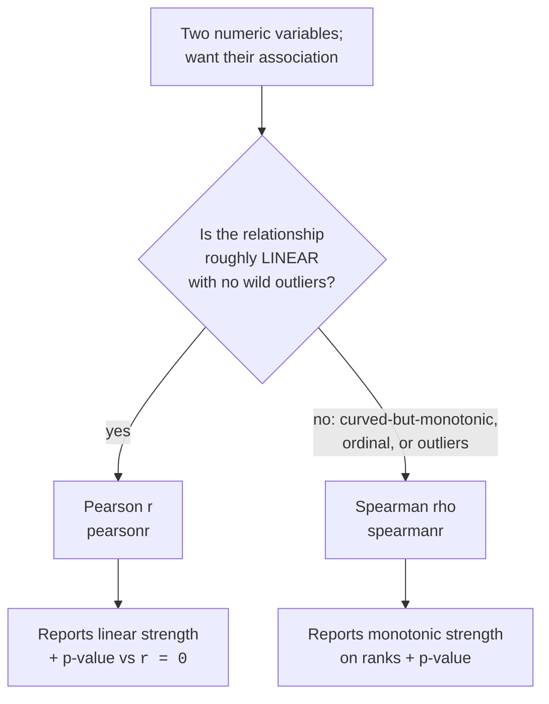
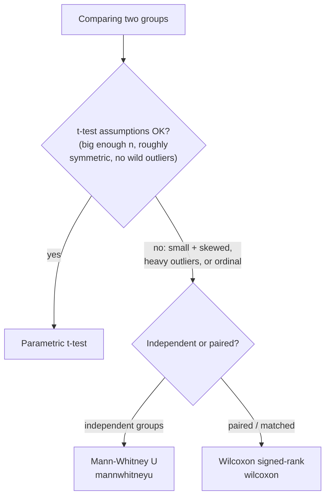

So far we've compared **means** (t-tests, ANOVA) and **categories**
(chi-square). This page covers two more everyday jobs:

- **Correlation**, how strongly do two numeric variables *move
  together*? (Do customers who spend more also visit more often?)
- **Nonparametric tests**, what do you do when the t-test's assumptions
  fail, tiny samples, brutal outliers, or ordinal (ranked) data?

Both keep the same mindset as the rest of the course: get a number (an
effect size or a statistic), get a p-value, and, above all, interpret
it honestly.

<Figure
  slug="stat-correlation-cutout"
  alt="A scatter rising across a plane beside the same points converted into a tidy ordered rank ladder"
/>

## Part A, Correlation: how two variables move together

A **correlation coefficient** condenses the relationship between two
numeric variables into a single number in **[−1, +1]**:

- **+1**, perfect positive: when one goes up, the other goes up,
  exactly in step.
- **0**, no *(linear)* relationship.
- **−1**, perfect negative: one up, the other down, exactly.

<Figure
  slug="stat-correlation-and-nonparametric-inline-cutout"
  alt="Two boards of chips side by side, one drifting tightly upward and one scattered with no drift at all"
  caption="Correlation measures how tightly two variables drift together, and only linearly."
/>

<Chart slug="correlation-scatters" />

Because it's already on a fixed, unitless scale, the correlation
coefficient **is an effect size**, it tells you not just *whether* a
relationship exists but *how strong* it is (we'll revisit this framing in
*Effect Sizes*).

### Pearson vs Spearman

There are two correlations you'll reach for constantly, and they answer
slightly different questions.

| | **Pearson r** | **Spearman ρ** |
| --- | --- | --- |
| Measures | **Linear** association | **Monotonic** association (any consistent up/down) |
| Works on | The raw values | The **ranks** of the values |
| Sensitive to outliers? | **Yes**, strongly | Much less |
| Use when | Relationship is roughly straight-line | Relationship is curved-but-monotonic, ordinal data, or outliers |

Let's compute both and test whether each differs from zero.

<CodeBlock
  adapter="python"
  files={[
    {
      filename: "main.py",
      starterCode: `import numpy as np
from scipy import stats

rng = np.random.default_rng(1)

# Marketing spend vs sales, with a roughly linear relationship + noise.
spend = rng.uniform(10, 100, size=80)
sales = 2.5 * spend + rng.normal(0, 25, size=80)

# Pearson: linear association. Spearman: monotonic (rank-based).
r_p, p_p = stats.pearsonr(spend, sales)
r_s, p_s = stats.spearmanr(spend, sales)

print(f"Pearson  r = {r_p:.3f}  (p = {p_p:.2e})")
print(f"Spearman r = {r_s:.3f}  (p = {p_s:.2e})")
print()
print("Both are strongly positive and clearly differ from 0.")
print("The p-value tests H0: the true correlation is 0 (no association).")
`,
    },
  ]}
/>

**How to read it.** The coefficient is the effect size: roughly, |r| <
0.3 is weak, 0.3–0.5 moderate, > 0.5 strong (rules of thumb, not laws).
The p-value tests H₀: *the true correlation is 0*. A small p says the
association is distinguishable from "no relationship." Report **both**:
the coefficient for *how strong*, the p-value for *how sure it's not
zero*.

The synthetic example was engineered to be linear; real data isn't always
so obliging, but sometimes it is. In the **Palmer penguins** dataset,
flipper length and body mass move together for an obvious reason, bigger
penguins have bigger everything. Run it and you'll find a strong, clean
positive correlation.

<CodeBlock
  adapter="python"
  datasets={[{ path: "palmer-penguins.csv", stageAs: "penguins.csv" }]}
  files={[
    {
      filename: "main.py",
      initCode: `import pandas as pd
from scipy import stats
penguins = pd.read_csv("penguins.csv")`,
      starterCode: `# Drop rows missing either measurement, then correlate.
clean = penguins[["flipper_length_mm", "body_mass_g"]].dropna()
r, p = stats.pearsonr(clean["flipper_length_mm"], clean["body_mass_g"])

print(f"Pearson r = {r:.3f}   (p = {p:.2e})")
print("A strong positive link: longer flippers go with heavier birds.")
print("But remember, this is association, not proof one CAUSES the other.")
`,
    },
  ]}
/>

### When Pearson and Spearman disagree

The clearest way to feel the difference: a relationship that is perfectly
**monotonic** (always increasing) but **curved**. Spearman, working on
ranks, sees the perfect order and reports ≈ 1. Pearson, demanding a
*straight* line, reports less.

<CodeBlock
  adapter="python"
  files={[
    {
      filename: "main.py",
      starterCode: `import numpy as np
from scipy import stats

rng = np.random.default_rng(2)

x = np.linspace(1, 10, 60)
# A strictly increasing but strongly CURVED relationship (exponential).
y = np.exp(x / 2) + rng.normal(0, 2, size=60)

r_p, _ = stats.pearsonr(x, y)
r_s, _ = stats.spearmanr(x, y)

print(f"Pearson  r = {r_p:.3f}  (sees the CURVE -> less than 1)")
print(f"Spearman r = {r_s:.3f}  (sees perfect ORDER -> near 1)")
print()
print("The relationship is perfectly monotonic but not linear.")
print("Spearman captures 'consistently increasing'; Pearson only")
print("rewards 'increasing in a straight line'.")
`,
    },
  ]}
/>

<Callout type="tip" title="Quick rule for choosing">
Reach for **Spearman** when the relationship is monotonic-but-curved,
when the data is **ordinal** (ranks, Likert scales), or when **outliers**
would yank Pearson around. Reach for **Pearson** when you specifically
care about *linear* strength and the data is roughly straight-line
without extreme points. When unsure, compute both, a big gap between
them is itself informative.
</Callout>

<Callout type="danger" title="Misconception: r near 0 means 'no relationship'">
Pearson r near 0 means **no LINEAR relationship**, there could be a
strong **curved** one. The textbook example is a U-shape (like y = x²
centered at 0): the variables are tightly related, yet Pearson r is
almost exactly 0 because the upward and downward halves cancel. **Always
plot your data.** A correlation of 0 is a statement about straight lines,
not about relationships in general.
</Callout>

<CodeBlock
  adapter="python"
  files={[
    {
      filename: "main.py",
      starterCode: `import numpy as np
from scipy import stats

rng = np.random.default_rng(3)

# A clean U-shape: y depends entirely on x, but symmetrically.
x = rng.uniform(-5, 5, size=400)
y = x**2 + rng.normal(0, 1, size=400)

r_p, p_p = stats.pearsonr(x, y)
print(f"Pearson r = {r_p:.3f}  (p = {p_p:.3f})")
print()
print("y is COMPLETELY determined by x, yet Pearson r is ~0.")
print("r measures LINEAR association only. 'r = 0' is NOT 'no relationship'.")
print("This is exactly why you plot the data before trusting a number.")
`,
    },
  ]}
/>

### The same r, four different stories: Anscombe's quartet

The U-shape above shows one way correlation can mislead. The most famous
demonstration shows four ways at once. In 1973 Francis Anscombe
published four tiny datasets, the **Anscombe quartet**, engineered to
share the *same* Pearson correlation (about **0.82**) along with the
same means and standard deviations. Run this on the real data and read
the `corr_xy` column: four datasets, one correlation.

<CodeBlock
  adapter="python"
  datasets={[{ path: "anscombes_quartet.csv", stageAs: "anscombe.csv" }]}
  files={[
    {
      filename: "main.py",
      initCode: `import pandas as pd
from scipy import stats
aq = pd.read_csv("anscombe.csv")`,
      starterCode: `for name, g in aq.groupby("dataset"):
    r, _ = stats.pearsonr(g["x"], g["y"])
    print(f"dataset {name}: Pearson r = {r:.3f}")

print()
print("All four have r ~ 0.82. The correlation cannot tell them apart.")
`,
    },
  ]}
/>

A correlation of 0.82 sounds like a clean linear relationship, and for
dataset `I` it is. But `II` is a perfect curve (Pearson, demanding a
straight line, undersells it), `III` is a perfect line dragged off by a
single outlier, and `IV` is a vertical stack whose entire correlation
comes from one stray point. Plot them and the differences are obvious;
the coefficient hides all of it.

<CodeBlock
  adapter="python"
  datasets={[{ path: "anscombes_quartet.csv", stageAs: "anscombe.csv" }]}
  files={[
    {
      filename: "main.py",
      initCode: `import pandas as pd
import plotly.express as px
import statsmodels.api as sm  # enables trendline="ols"
aq = pd.read_csv("anscombe.csv")`,
      starterCode: `# Same r = 0.82 in every panel. The shapes could not be more different.
fig = px.scatter(
    aq, x="x", y="y", facet_col="dataset", facet_col_wrap=2,
    trendline="ols", title="Anscombe's quartet, identical correlation, four pictures",
    template="simple_white",
)
fig.show()
`,
    },
  ]}
/>

<Callout type="tip" title="The reflex Anscombe is teaching">
A single number, correlation, mean, slope, is a *lossy compression* of
your data. Before you trust one, scatter the two variables. The cost is
one line of code, the payoff is catching curves, outliers, and leverage
points that no coefficient will ever warn you about. The *Datasaurus
Dozen* (which you'll meet in *Statistical Fallacies*) takes this same
joke to thirteen datasets that even draw a dinosaur.
</Callout>

### The single most important caveat: correlation is not causation

Two variables can move together because A causes B, because B causes A,
because a hidden **third variable** drives both, or by sheer coincidence.
Ice-cream sales and drowning deaths correlate strongly, not because ice
cream is dangerous, but because **hot weather** boosts both. A
correlation, no matter how strong or how tiny its p-value, **cannot**
establish causation on its own.

<Figure
  slug="stat-correlation-and-nonparametric-common-misconceptions-gathered-inline-cutout"
  alt="Two boards drifting together with a cord between them and a small warning flag on the cord"
  caption="Two things moving together is not yet evidence that one moves the other."
/>

<Callout type="warn" title="Correlation ≠ causation">
A significant correlation tells you two variables are *associated*, full
stop. To claim one *causes* the other you need more, a randomized
experiment (see *A/B Testing*), or careful causal reasoning that rules
out confounders. We catalogue the ways this goes wrong (confounding,
spurious correlation, reverse causation) in *Statistical Fallacies*.
</Callout>

### A light note on linear regression

Correlation says *how strongly* two variables move together; **simple
linear regression** goes one step further and fits the **best straight
line** through the cloud, giving you two interpretable numbers:

- the **slope**, the predicted change in *y* per one-unit increase in
  *x* (the "effect per unit"), in real units, and
- **R²**, the fraction of *y*'s variance the line explains (R² = r² for
  simple regression).

That's as far as we'll take regression in this course, it's a big topic
of its own. The intuition is enough: a slope is an effect-per-unit, R² is
variance-explained. `stats.linregress` hands you both, plus a p-value for
the slope.

<CodeBlock
  adapter="python"
  files={[
    {
      filename: "main.py",
      starterCode: `import numpy as np
import plotly.express as px
from scipy import stats

rng = np.random.default_rng(4)

# Hours studied vs exam score.
hours = rng.uniform(0, 10, size=60)
score = 50 + 4.5 * hours + rng.normal(0, 6, size=60)

fit = stats.linregress(hours, score)
print(f"slope     : {fit.slope:.2f} points per hour studied")
print(f"intercept : {fit.intercept:.2f}")
print(
    f"R-squared : {fit.rvalue**2:.3f}  ({fit.rvalue**2:.0%} of score variance explained)"
)
print(f"p-value   : {fit.pvalue:.2e}  (H0: slope = 0, i.e. no relationship)")

# Plot the points with the fitted line.
xline = np.linspace(hours.min(), hours.max(), 100)
yline = fit.intercept + fit.slope * xline

fig = px.scatter(
    x=hours,
    y=score,
    labels={"x": "hours studied", "y": "exam score"},
    title="Exam score vs hours studied (with least-squares fit)",
    template="simple_white",
)
fig.add_scatter(x=xline, y=yline, mode="lines", name="fit line")
fig.show()
`,
    },
  ]}
/>

<Callout type="info" title="Slope vs correlation">
The **slope** is in real units (points per hour) and depends on the
scales of *x* and *y*; the **correlation** is unitless and bounded in
[−1, 1]. They share a sign and the *same* p-value for "is there a linear
relationship?", but the slope answers "how much does *y* change per
unit?" while r answers "how tightly do they track?". For a deeper take on
effect sizes, see *Effect Sizes*.
</Callout>

<MultipleChoice
  markdown={`A scatterplot shows a clear inverted-U: \`y\` rises with \`x\`, peaks, then falls. Pearson r comes out near 0. What's the correct read?

- [o] There's no *linear* relationship, but a strong *non-linear* one; Pearson only captures straight-line association
  > Pearson measures linear association, and a symmetric rise-then-fall cancels out to roughly zero even though y clearly depends on x.
- The two variables are unrelated
  > The plot shows a strong dependence, so "unrelated" contradicts the visible pattern. Pearson r near 0 does not mean independence.
- Pearson must have been computed incorrectly
  > A near-zero Pearson r is the *expected* result for a symmetric curved relationship, not a computational error.
- Switching to Spearman would give r near 1
  > Spearman captures monotonic trends, but an inverted-U is not monotonic (it goes up then down), so Spearman would also be far from 1.

A coefficient near 0 rules out a straight-line trend, not a relationship in general, which is why you plot the data.`}
/>

<Chart slug="pearson-spearman-disagree" />

Reading the two together beats reading either alone, because the gap is
diagnostic. Rho far above r means the relationship is real and curved. R far
above rho means one or two extreme points are carrying the linear fit, and
ranks cannot be extreme, which is exactly why rho ignores them.

Pearson's r measures how close the points are to a straight line. Spearman's
rho replaces every value by its rank and computes the same thing on the ranks,
so it measures how close the relationship is to *monotone*: does y always move
the same way as x, whether or not at a constant rate. Both high and similar,
as in the third panel, is linear and monotone, which is the case everyone
assumes they are in. Neither coefficient says anything about the slope, and
neither says anything about cause.

## Part B, Nonparametric tests: when t-tests are unsafe

t-tests lean on the sampling distribution of the **mean** being roughly
normal. The CLT usually delivers that, but not always. **Nonparametric**
tests are the distribution-free backups for when it doesn't.

<Figure
  slug="stat-correlation-and-nonparametric-part-b-nonparametric-inline-cutout"
  alt="Chips ranked in order by a comb rather than measured by a rule"
  caption="Rank-based tests work from the order of the values, not their exact sizes."
/>

Reach for them when:

- the sample is **small** *and* clearly non-normal,
- there are **heavy outliers** that distort means and standard errors,
- or the data is **ordinal** (ranks, ratings) where "the mean" isn't even
  meaningful.

Their trick: throw away the raw magnitudes and work with **ranks**
instead. Ranks don't care how far out an outlier is, only its order, so
these tests are naturally robust.

The pairing logic mirrors the t-tests in *t-Tests*: **Mann–Whitney U**
is the rank-based cousin of the **independent** two-sample t-test, and
**Wilcoxon signed-rank** is the cousin of the **paired** t-test.

### Mann–Whitney U: independent groups, robustly

**The question it answers:** are values in one group systematically larger
than in the other? Roughly, "if you drew one observation from each group,
is one more likely to exceed the other?"

Here heavy outliers wreck the t-test but barely faze Mann–Whitney.

<CodeBlock
  adapter="python"
  files={[
    {
      filename: "main.py",
      starterCode: `import numpy as np
from scipy import stats

rng = np.random.default_rng(6)

# Customer support resolution times (minutes). Group B is genuinely a bit
# slower, but BOTH have a few extreme outliers (some tickets drag on for hours).
a = rng.normal(30, 8, size=40)
b = rng.normal(36, 8, size=40)
a[:3] = [300, 280, 350]  # a few monster outliers
b[:3] = [330, 410, 290]
alpha = 0.05

# Parametric t-test: means and SEs are distorted by the outliers.
t_res = stats.ttest_ind(a, b, equal_var=False)

# Mann-Whitney U: rank-based, shrugs off the outliers.
u_res = stats.mannwhitneyu(a, b, alternative="two-sided")

print(f"Welch t-test     : p = {t_res.pvalue:.4f}  (outliers inflate the noise)")
print(f"Mann-Whitney U   : p = {u_res.pvalue:.4f}  (robust to outliers)")
print()
print("With heavy outliers, the rank-based test is the more trustworthy")
print("read on whether the two groups differ.")
`,
    },
  ]}
/>

**How to read it.** `mannwhitneyu()` returns the U statistic and a p-value.
A small p-value says one group tends to produce larger values than the
other. Note it's testing a shift in the *distribution* (often summarized
via the median), not the mean, which is exactly why it survives outliers
that would distort a mean.

That example is deliberately extreme. The useful question is what the swap
costs you when the data is *well behaved*, because that's the price you pay
for the insurance. Shift the same population against itself and run both
tests thousands of times, on three different shapes:

<Chart slug="mann-whitney-vs-t" />

The asymmetry is the whole argument for reaching for ranks when you're
unsure. On normal data, where the t-test is provably the best test
available, ranks cost a couple of percentage points of power. On
heavy-tailed data, the t-test throws away most of the power it had, because
the outliers land in its denominator: a few huge values inflate the sample
standard deviation, and the test concludes it can't see through the noise it
just manufactured. Ranks never see the outlier's size, only its position at
the end of the queue.

The skewed panel is the widest gap of the three, because most of that
distribution is packed into a narrow range where a shift swaps a great many
pairs of values around while barely moving a mean that the long tail
dominates.

<Callout type="warn" title="What Mann–Whitney actually tests">
It's tempting to describe it as "the median version of the t-test", and that
shortcut is only safe when the two distributions have the **same shape**.
Strictly, it asks whether a random value from one group tends to exceed a
random value from the other. If the groups differ in spread as well as
location, a significant result tells you they differ, not that their medians
do. When the medians are the point, say so and compare them directly.
</Callout>

### Wilcoxon signed-rank: paired data, robustly

**The question it answers:** for **matched pairs** (same units, two
conditions), did the values shift? It's the robust stand-in for the paired
t-test, it ranks the *differences* and checks whether they lean
positive or negative.

<CodeBlock
  adapter="python"
  files={[
    {
      filename: "main.py",
      starterCode: `import numpy as np
from scipy import stats

rng = np.random.default_rng(8)

# Same 20 users' satisfaction (1-10 ordinal scale) before and after a redesign.
before = rng.integers(3, 8, size=20)
after = np.clip(before + rng.integers(-1, 4, size=20), 1, 10)
alpha = 0.05

# Wilcoxon signed-rank: paired, rank-based -> right tool for ordinal data.
w_res = stats.wilcoxon(before, after)

print(f"Median before: {np.median(before):.1f}   median after: {np.median(after):.1f}")
print(
    f"Wilcoxon signed-rank: statistic = {w_res.statistic:.1f}, p = {w_res.pvalue:.4f}"
)
print()
if w_res.pvalue <= alpha:
    print("REJECT H0: satisfaction shifted after the redesign.")
else:
    print("FAIL TO REJECT H0: no significant shift in satisfaction.")
print()
print("Satisfaction is ORDINAL (1-10), so a rank-based paired test is")
print("more appropriate than a paired t-test on these scores.")
`,
    },
  ]}
/>

<Callout type="info" title="What you trade for robustness">
Nonparametric tests make **fewer assumptions**, but that safety isn't
free. When the data *is* roughly normal, the matching t-test has slightly
**more power** (it uses the magnitudes, not just the order). So don't
reflexively go nonparametric, use it when the assumptions genuinely fail,
and use the t-test when they hold. It's a tradeoff, not a free upgrade.
</Callout>

<Callout type="danger" title="Misconception: nonparametric means assumption-FREE">
"Distribution-free" is not "assumption-free." Mann–Whitney and Wilcoxon
still require **independent** observations (and Wilcoxon needs genuinely
**paired** data). They drop the *normality* assumption, not the
independence one, no test rescues you from dependent or badly collected
data. They also have their own conditions (e.g. similar distribution
*shapes* for the cleanest median interpretation).
</Callout>

<MultipleChoice
  markdown={`You compare resolution times for two independent support queues. The data has several extreme outliers and the samples are small. Which test is the most appropriate?

- The Wilcoxon signed-rank test, because it handles outliers
  > Wilcoxon signed-rank is for paired data; these are independent queues, so it is the wrong design even though it is also rank-based.
- A paired t-test, since both are support times
  > The two queues are independent groups, not matched pairs, so a paired test does not apply regardless of robustness concerns.
- [o] The Mann-Whitney U test, a rank-based test robust to outliers for two independent groups
  > Working on ranks rather than raw magnitudes makes it shrug off extreme values, which is exactly what small, outlier-heavy independent samples need.
- A two-sample t-test, because it's the standard way to compare two groups
  > With small samples and heavy outliers, the t-test's reliance on the mean and its standard error becomes shaky, so it is not the safest choice here.

For independent groups with outliers or small samples, Mann-Whitney U is the robust counterpart to the independent t-test.`}
/>

## Challenge 1, Pearson vs Spearman

<ChallengeCard
  adapter="python"
  title="Compute and compare two correlations"
  instructions={`You have two numeric arrays, \`x\` and \`y\`. Compute both correlation coefficients and their p-values, then compare.

- Compute the **Pearson** correlation into a float **\`pearson_r\`** (the coefficient only).
- Compute the **Spearman** correlation into a float **\`spearman_r\`** (the coefficient only).
- Store the Pearson p-value as a float **\`pearson_p\`**.
- Set a boolean **\`spearman_stronger\`** to whether \`abs(spearman_r) > abs(pearson_r)\`.

Use the appropriate \`scipy.stats\` functions; each returns the coefficient first, then the p-value.`}
  files={[
    {
      filename: "main.py",
      initCode: `import numpy as np
from scipy import stats

rng = np.random.default_rng(505)
x = np.linspace(1, 10, 70)
# Monotonic but curved -> Spearman should exceed Pearson in magnitude.
y = x**3 + rng.normal(0, 30, size=70)`,
      starterCode: `# TODO: set pearson_r, spearman_r, pearson_p (floats) and spearman_stronger (bool)
pearson_r = None
spearman_r = None
pearson_p = None
spearman_stronger = None
`,
      solutionCode: `pr, pp = stats.pearsonr(x, y)
sr, sp = stats.spearmanr(x, y)
pearson_r = float(pr)
spearman_r = float(sr)
pearson_p = float(pp)
spearman_stronger = bool(abs(spearman_r) > abs(pearson_r))
print(pearson_r, spearman_r, pearson_p, spearman_stronger)
`,
    },
  ]}
  tests={[
    {
      id: "types",
      name: "coefficients and p-value are floats",
      description: "All numeric",
      code: `assert isinstance(pearson_r, float) and isinstance(spearman_r, float) and isinstance(pearson_p, float)`,
    },
    {
      id: "pearson",
      name: "pearson_r matches scipy",
      description: "Used pearsonr",
      code: `from scipy import stats
er, ep = stats.pearsonr(x, y)
assert abs(pearson_r - float(er)) < 1e-9
assert abs(pearson_p - float(ep)) < 1e-9`,
    },
    {
      id: "spearman",
      name: "spearman_r matches scipy",
      description: "Used spearmanr",
      code: `from scipy import stats
res = stats.spearmanr(x, y)
assert abs(spearman_r - float(res.correlation)) < 1e-9`,
    },
    {
      id: "compare",
      name: "spearman_stronger is correct",
      description: "Compares magnitudes",
      code: `assert isinstance(spearman_stronger, bool)
assert spearman_stronger == bool(abs(spearman_r) > abs(pearson_r))`,
    },
  ]}
/>

## Challenge 2, Pick and run the right nonparametric test

<ChallengeCard
  adapter="python"
  title="Two independent groups, the robust way"
  instructions={`Two **independent** groups of users were shown different page layouts; you have their \`time_on_page\` values (in seconds). The data is skewed with outliers, so a t-test is unsafe, use the right **nonparametric** test for two independent groups.

- Run the appropriate test (rank-based, for **independent** groups) with a **two-sided** alternative.
- Store the p-value as a float named **\`p_value\`**.
- Set a boolean **\`differ\`** to whether the groups differ at \`alpha = 0.05\` (reject when \`p_value <= alpha\`).

Choose between Mann-Whitney U and Wilcoxon based on whether the groups are independent or paired.`}
  files={[
    {
      filename: "main.py",
      initCode: `import numpy as np
from scipy import stats

rng = np.random.default_rng(606)
group_a = rng.exponential(40, size=50)             # skewed
group_b = rng.exponential(55, size=50)             # skewed, a bit larger
group_a[:2] = [600, 540]                           # outliers
group_b[:2] = [700, 480]
time_on_page_a = group_a
time_on_page_b = group_b
alpha = 0.05`,
      starterCode: `# TODO: run the right nonparametric test for INDEPENDENT groups
# set p_value (float) and differ (bool)
p_value = None
differ = None
`,
      solutionCode: `res = stats.mannwhitneyu(time_on_page_a, time_on_page_b, alternative="two-sided")
p_value = float(res.pvalue)
differ = bool(p_value <= alpha)
print(p_value, differ)
`,
    },
  ]}
  tests={[
    {
      id: "type",
      name: "p_value is a float",
      description: "Numeric p-value",
      code: `assert isinstance(p_value, float)`,
    },
    {
      id: "mwu",
      name: "p_value matches Mann-Whitney U (two-sided)",
      description: "Used mannwhitneyu for independent groups",
      code: `from scipy import stats
expected = float(stats.mannwhitneyu(time_on_page_a, time_on_page_b, alternative="two-sided").pvalue)
assert abs(p_value - expected) < 1e-9`,
    },
    {
      id: "not_wilcoxon",
      name: "did not use a paired test",
      description: "Mann-Whitney, not Wilcoxon",
      code: `from scipy import stats
wil = float(stats.wilcoxon(time_on_page_a, time_on_page_b).pvalue)
mwu = float(stats.mannwhitneyu(time_on_page_a, time_on_page_b, alternative="two-sided").pvalue)
assert abs(p_value - mwu) < 1e-9
assert abs(p_value - wil) > 1e-12`,
    },
    {
      id: "differ",
      name: "differ is the correct boolean",
      description: "p_value <= alpha",
      code: `assert isinstance(differ, bool)
assert differ == bool(p_value <= alpha)`,
    },
  ]}
/>

## Common misconceptions, gathered

<Callout type="danger" title="Four correlation and nonparametric traps">
1. **Correlation implies causation.** It implies *association* only; a
   confounder, reverse causation, or coincidence can produce it
   (*Statistical Fallacies*).
2. **r near 0 means "no relationship."** It means no *linear* one, a
   curved relationship can be strong with r ≈ 0. Plot the data.
3. **Pearson on ranked/ordinal or outlier-heavy data.** Use **Spearman**
   for monotonic/ordinal, and rank-based **nonparametric tests** when
   outliers or small samples make the mean untrustworthy.
4. **"Nonparametric = assumption-free."** It drops *normality*, not
   **independence** (and Wilcoxon still needs genuinely paired data).
</Callout>

## Check your understanding

<MultipleChoice
  markdown={`Pearson r between two variables is **0.02**, but a scatterplot shows a tight parabola (U-shape). Which statement is correct?

- [o] There is essentially no *linear* association, but there is a strong non-linear one; Pearson only captures straight-line relationships
  > Pearson measures linear association, and a symmetric U-shape averages out to near zero even though y is tightly determined by x.
- The correlation was calculated on the wrong columns
  > A near-zero r is exactly what a symmetric parabola produces, so there is no reason to suspect a calculation error.
- The variables are statistically independent
  > A tight U-shape is a strong dependence, so independence is wrong. A near-zero Pearson r does not imply independence.
- Spearman would also be near 1 because the relationship is strong
  > Spearman detects monotonic trends; a U-shape rises then falls, so it is not monotonic and Spearman would also be far from 1.

A coefficient near 0 only rules out a straight-line trend, which is why visualizing the data is essential.`}
/>

<MultipleChoice
  markdown={`When should you prefer **Spearman** over **Pearson**?

- Only when the two variables are perfectly linear
  > A perfectly linear relationship is the ideal case for Pearson; Spearman offers no advantage there and would simply agree.
- [o] When the relationship is monotonic but curved, the data is ordinal, or outliers would distort Pearson
  > Because Spearman works on ranks, it captures any consistent up-or-down trend and resists outliers, which is exactly when Pearson struggles.
- When the data is categorical, like colors or brands
  > Unordered categorical data has no meaningful ranks for a correlation; an association there is a job for chi-square, not Spearman.
- Always, because Spearman is more accurate
  > Neither is universally better; Pearson is preferable when you specifically care about linear strength and the data is well-behaved. Spearman is not a blanket upgrade.

Spearman shines for monotonic-but-curved relationships, ordinal data, and outlier-prone samples.`}
/>

<MultipleChoice
  markdown={`A report states "ice cream sales and drowning deaths are strongly correlated (r = 0.85, p < 0.001), so ice cream causes drownings." What's wrong?

- The correlation is too weak to mean anything
  > An r of 0.85 is a strong correlation, so weakness is not the flaw. The problem is the leap to causation.
- The p-value should be larger for a real effect
  > A tiny p-value indicates the association is unlikely to be zero; it does not justify a causal claim. The error is interpretive, not about the p-value's size.
- Spearman should have been used instead of Pearson
  > Switching correlation methods would not address the issue; no correlation coefficient, by itself, can establish causation.
- [o] Correlation does not imply causation, a confounder (hot weather) plausibly drives both, so the causal claim is unsupported
  > A strong, significant association can arise from a third variable influencing both, so concluding that one causes the other ignores confounding.

A correlation establishes association only; causal claims require ruling out confounders, typically via an experiment.`}
/>

<MultipleChoice
  markdown={`Which statement about **nonparametric** tests like Mann-Whitney U and Wilcoxon is accurate?

- They always have more power than the matching t-test
  > When the data really is normal, the corresponding t-test typically has slightly *more* power because it uses magnitudes, not just ranks. The advantage runs the other way.
- [o] They drop the normality assumption by working with ranks, making them robust to outliers and suitable for ordinal data, but they still require independence
  > Ranking discards raw magnitudes so extreme values lose their pull, which is what makes these tests robust, yet the independence requirement remains in force.
- They can only be used on categorical data
  > These tests apply to ordinal and continuous data via ranks; categorical association is the domain of chi-square, not Mann-Whitney or Wilcoxon.
- They make no assumptions at all about the data
  > They still require independent observations (and Wilcoxon requires paired data), so they are not assumption-free. They relax normality, not independence.

Nonparametric tests trade the normality assumption for robustness, but independence is non-negotiable.`}
/>

<MultipleChoice
  markdown={`In simple linear regression of \`sales\` on \`ad_spend\`, the slope is **3.0** and R² is **0.40**. How should you describe these?

- A slope of 3.0 means 40% of sales are explained by ad spend
  > The slope and R² describe different things; the 40% figure is R², not the slope. Mixing them up conflates two separate quantities.
- R² of 0.40 means the slope is statistically significant
  > R² measures variance explained, not significance; the slope's p-value (not R²) speaks to whether it differs from zero.
- The slope being positive proves ad spend causes sales
  > Regression on observational data shows association, not causation; a positive slope alone cannot establish that ad spend causes sales.
- [o] Each extra unit of ad spend is associated with about 3.0 more units of sales, and ad spend explains roughly 40% of the variation in sales
  > The slope is the predicted change in y per one-unit increase in x, while R² is the share of y's variance the line accounts for.

Slope is the effect per unit (in real units); R² is the fraction of variance the line explains.`}
/>

## Key takeaways

<Callout type="success" title="What to carry forward">
- **Correlation** measures how two numeric variables move together on a
  fixed **[−1, 1]** scale, so the coefficient itself is an **effect
  size**; its p-value tests whether the true correlation is 0.
- **Pearson** = linear association on raw values (outlier-sensitive);
  **Spearman** = monotonic association on ranks (robust, good for ordinal
  or curved data). **r ≈ 0 means no *linear* relationship**, not "no
  relationship", plot the data.
- **Correlation ≠ causation**, association can come from confounders or
  coincidence (*Statistical Fallacies*).
- **Regression**, lightly: **slope** = effect per unit (real units), **R²**
  = variance explained. That intuition is all you need here.
- **Nonparametric** tests are the distribution-free backups: **Mann–Whitney
  U** for independent groups, **Wilcoxon signed-rank** for paired, use
  them for small/skewed/outlier-heavy/ordinal data. They drop *normality*,
  **not independence**.
</Callout>
