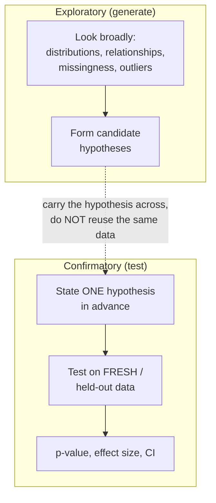
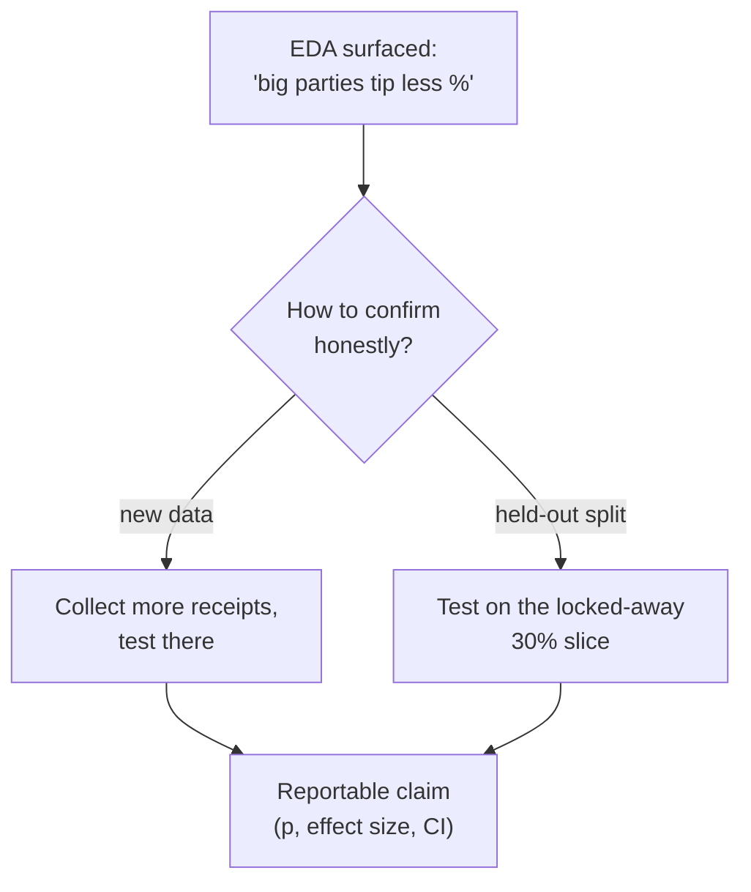

Before you test anything, you have to *look*. **Exploratory data
analysis** (EDA) is the open-ended, curious first pass over a fresh
dataset: what's in here, how is each variable distributed, what's
missing, what relates to what, and what's surprising? You already do a
version of this with Pandas. This page adds the *statistical* discipline,
summaries that quantify spread and skew, relationships measured rather
than eyeballed, and a clear sense of which findings are real signal
versus which are the kind of noise *Why Statistics Matters* warned you
about.

But EDA carries a hidden danger that this page treats as its spine.
Exploration **generates** hypotheses; it must never be mistaken for
**confirming** them. The single most important habit in all of applied
statistics is to keep those two activities on opposite sides of a wall.

<Figure
  slug="stat-eda-cutout"
  alt="A wall dividing a platform, an open exploration workbench on one side and a sealed confirmation chamber on the other"
/>

## Exploratory vs confirmatory: the wall you must not cross

There are two fundamentally different modes of data analysis, and
conflating them is how analyses go wrong.

<Chart slug="anscombes-quartet" />

- **Exploratory (hypothesis-generating):** roam the data, slice it many
  ways, follow your curiosity, look at hundreds of summaries and plots.
  Output: *interesting questions and candidate hypotheses.* Nothing here
  is a conclusion.
- **Confirmatory (hypothesis-testing):** state a *specific*, pre-declared
  hypothesis and test it, ideally on **data you have not yet looked at.**
  Output: *a defensible claim with a p-value, an effect size, and a
  confidence interval.*

The dotted arrow is the whole game. The hypothesis you *discovered* in
exploration is a lead, not a verdict. To confirm it honestly you need
data that did not participate in suggesting it.

<Callout type="danger" title="The cardinal sin: testing a hypothesis on the data that suggested it">
If you scan the data, notice "Tuesday signups convert unusually well,"
and then run a test on the *same* data asking whether Tuesday converts
better, your p-value is a lie. You already know the answer is "yes" in
this dataset; that's *why* the pattern caught your eye. Testing it here
inflates false positives exactly like the multiple-comparisons trap in
*Statistical Fallacies* (the "garden of forking paths"). Confirm on new
data, a held-out split, or a fresh time window.
</Callout>

<Callout type="tip" title="A practical workaround: hold out a slice">
When you can't collect new data, split it *before* you start exploring:
explore freely on, say, 70% of the rows, and lock away the other 30%
untouched. When a hypothesis emerges, test it once on the held-out 30%.
That slice never influenced your hypothesis, so the test is honest.
</Callout>

## The EDA pipeline

A disciplined exploration moves through a rough sequence. It's iterative,
not linear, findings send you back upstream, but the stages give you a
checklist so you don't miss something basic.

Here is that checklist as a walkthrough, the question each stage answers:

<Steps>
<Step>

**Understand the shape**

Rows, columns, and dtypes, what *is* this table before you analyze it?

</Step>
<Step>

**Each variable alone**

Distributions and summaries, one column at a time, center, spread, and skew.

</Step>
<Step>

**Missingness**

How much is missing, where it sits, and (if you can tell) why.

</Step>
<Step>

**Outliers**

Separate data-entry errors from real, meaningful extremes.

</Step>
<Step>

**Relationships**

How variables move together, group-bys and correlations.

</Step>
<Step>

**Form hypotheses**

Turn what you saw into hunches to confirm *later*, on fresh data.

</Step>
</Steps>

We'll walk this with a real dataset. The tips dataset records
restaurant bills, tips, party size, day, and a few categorical traits,
small enough to reason about, rich enough to be interesting.

## Step 1-2: the shape and each variable's distribution

Start by orienting yourself: how big is the table, what are the columns,
and what does each one look like on its own. `df.describe()` gives a
fast statistical snapshot of the numeric columns, center, spread, and
the quartiles that hint at skew.

<CodeBlock
  adapter="python"
  files={[
    {
      filename: "main.py",
      starterCode: `import plotly.express as px

tips = px.data.tips()

print("Shape (rows, cols):", tips.shape)
print("\\nColumns and dtypes:")
print(tips.dtypes)
print("\\nNumeric summary (describe):")
print(tips.describe().round(2))
`,
    },
  ]}
/>

Read `describe()` like a statistician, not just a reader of numbers. For
`total_bill`: is the mean well above the median? That signals **right
skew** (a few big bills pulling the average up), the lesson from *Shape
and Outliers*. Compare the standard deviation to the mean to gauge
relative spread. The 25th-to-75th percentile range tells you where the
bulk of the data lives.

For categorical columns, `describe()` won't help, use `value_counts`
to see the categories and how (im)balanced they are.

<CodeBlock
  adapter="python"
  files={[
    {
      filename: "main.py",
      starterCode: `import plotly.express as px

tips = px.data.tips()

for col in ["sex", "smoker", "day", "time"]:
    print(f"--- {col} ---")
    print(tips[col].value_counts())
    print()

print("Notice the imbalance: far more dinners than lunches, more weekend")
print("days, more non-smokers. Imbalanced groups make some comparisons")
print("underpowered -- worth noting before you trust any group difference.")
`,
    },
  ]}
/>

A picture makes the shape obvious. A histogram of `total_bill` shows the
right skew directly; a box plot summarizes center, spread, and flags
extreme values.

<CodeBlock
  adapter="python"
  files={[
    {
      filename: "main.py",
      starterCode: `import plotly.express as px

tips = px.data.tips()

fig = px.histogram(
    tips,
    x="total_bill",
    nbins=30,
    title="Distribution of total bill (note the right skew)",
    template="simple_white",
)
fig.show()

fig2 = px.box(
    tips,
    x="total_bill",
    title="Total bill: center, spread, and high outliers",
    template="simple_white",
)
fig2.show()
`,
    },
  ]}
/>

<Callout type="info" title="What you're hunting for in distributions">
Shape (symmetric vs skewed), center, spread, and anything weird:
suspicious spikes, impossible values, a long tail. Each oddity is a
*question* to chase, "why is there a cluster at exactly zero?", not
something to silently smooth over.
</Callout>

## Step 3: missingness

Real datasets have holes. Before any analysis, quantify *how much* is
missing and *where*, because the pattern of missingness can bias
everything downstream. The tips dataset is complete, so we'll inject a
realistic gap to demonstrate the checks you'd run on messy data.

<CodeBlock
  adapter="python"
  files={[
    {
      filename: "main.py",
      starterCode: `import numpy as np
import plotly.express as px

rng = np.random.default_rng(0)
tips = px.data.tips().copy()

# Simulate messy reality: knock out ~8% of tip values at random.
mask = rng.random(len(tips)) < 0.08
tips.loc[mask, "tip"] = np.nan

# Count missing per column.
missing = tips.isna().sum()
missing_pct = (tips.isna().mean() * 100).round(1)
print("Missing values per column:")
print(missing[missing > 0])
print("\\nPercent missing:")
print(missing_pct[missing_pct > 0])

print(
    f"\\nRows lost if you naively dropna(): {tips.isna().any(axis=1).sum()} of {len(tips)}"
)
`,
    },
  ]}
/>

<Callout type="warn" title="Missingness is rarely random">
Dropping rows with missing values is only safe if data is missing
*completely at random*. Often it isn't: maybe high bills are the ones
where the tip went unrecorded, so `dropna()` would silently bias your
average tip downward. Always ask *why* a value is missing before
deciding how to handle it, the mechanism matters more than the count.
</Callout>

We injected those gaps to make a point, but real datasets arrive with
their own holes. The **Palmer penguins** dataset is a clean example:
two penguins are missing every body measurement (they were never fully
recorded), and eleven are missing `sex`. The same `isna()` checks read
that out directly, no simulation needed.

<CodeBlock
  adapter="python"
  datasets={[{ path: "palmer-penguins.csv", stageAs: "penguins.csv" }]}
  files={[
    {
      filename: "main.py",
      initCode: `import pandas as pd
penguins = pd.read_csv("penguins.csv")`,
      starterCode: `missing = penguins.isna().sum()
print("Missing values per column:")
print(missing[missing > 0])

rows_with_holes = penguins.isna().any(axis=1).sum()
print(f"\\nRows with at least one missing value: {rows_with_holes} of {len(penguins)}")
print("The 2 penguins missing every measurement are a clue, not noise.")
print("ask WHY before you drop them.")
`,
    },
  ]}
/>

The 11 missing `sex` values outnumber the 2 missing measurements, which
is itself a finding: sex was harder to record than size. Whether you
drop, impute, or keep those rows depends entirely on the question you're
asking, but you can only make that call after you've *looked* at the
pattern.

## Step 4: outliers

Outliers are either **data errors** to fix or **real extremes** that
carry information, and EDA is where you tell them apart. A common
quick rule is the **1.5 × IQR** fence: points beyond the quartiles by
more than 1.5 times the interquartile range are flagged for inspection
(not automatic deletion).

<CodeBlock
  adapter="python"
  files={[
    {
      filename: "main.py",
      starterCode: `import plotly.express as px

tips = px.data.tips()

q1 = tips["total_bill"].quantile(0.25)
q3 = tips["total_bill"].quantile(0.75)
iqr = q3 - q1
low_fence = q1 - 1.5 * iqr
high_fence = q3 + 1.5 * iqr

outliers = tips[(tips["total_bill"] < low_fence) | (tips["total_bill"] > high_fence)]

print(f"IQR fences for total_bill: [{low_fence:.2f}, {high_fence:.2f}]")
print(f"Flagged points: {len(outliers)} of {len(tips)}")
print("\\nThe flagged bills:")
print(
    outliers[["total_bill", "tip", "size", "day"]]
    .sort_values("total_bill")
    .to_string(index=False)
)
print("\\nThese look like genuine big-party bills, not errors -- KEEP them,")
print("but be aware they'll pull the mean around.")
`,
    },
  ]}
/>

<Callout type="danger" title="Don't delete outliers reflexively">
"Removing outliers" to make a chart prettier is a classic way to lie
with data. A high value is only an *error* if it's actually impossible
or mis-entered. A genuine \\$50 bill from a big party is real signal,
deleting it distorts the truth. Investigate first; delete only with a
documented reason.
</Callout>

## Step 5: relationships

Now look at how variables move *together*. Two workhorses: `groupby`
summaries (how a metric differs across categories) and a **correlation
matrix** (linear association between numeric columns).

<Figure
  slug="stat-exploratory-statistical-analysis-inline-cutout"
  alt="A crate of raw chips being spread across a bench and looked at before any gauge is brought near it"
/>

<CodeBlock
  adapter="python"
  files={[
    {
      filename: "main.py",
      starterCode: `import plotly.express as px

tips = px.data.tips()
tips["tip_pct"] = tips["tip"] / tips["total_bill"] * 100

# Grouped summaries: does tip percentage differ by day and time?
by_day = tips.groupby("day")["tip_pct"].agg(["mean", "median", "count"]).round(2)
print("Tip % by day:")
print(by_day)

by_time = tips.groupby("time")["tip_pct"].agg(["mean", "median", "count"]).round(2)
print("\\nTip % by time:")
print(by_time)

print("\\nThese gaps are SUGGESTIVE, not conclusive. Small groups (few")
print("lunches) wobble a lot. Each gap is a hypothesis to test later.")
`,
    },
  ]}
/>

A correlation matrix scans all numeric pairs at once. It's the fastest
way to spot which variables travel together, and a natural source of
hypotheses.

<CodeBlock
  adapter="python"
  files={[
    {
      filename: "main.py",
      starterCode: `import plotly.express as px

tips = px.data.tips()

num = tips.select_dtypes("number")
corr = num.corr().round(3)
print("Correlation matrix:")
print(corr)

fig = px.imshow(
    corr,
    text_auto=True,
    color_continuous_scale="RdBu",
    zmin=-1,
    zmax=1,
    title="Correlation matrix of numeric columns",
    template="simple_white",
)
fig.show()

print("\\nStrongest link: total_bill and tip move together (bigger bills,")
print("bigger tips). That's expected. The job of EDA is to surface such")
print("relationships -- then ask which are worth a formal test.")
`,
    },
  ]}
/>

<Callout type="warn" title="Correlation matrices are an exploration tool, not a conclusion machine">
A correlation matrix invites the multiple-comparisons trap: with `k`
columns you're staring at many pairs at once, and some will look notable
by chance. Use it to *generate* leads, never to declare "X and Y are
related" off the back of one cell. And remember from *Effect Sizes* and
*Correlation and Nonparametric Tests*: correlation measures linear
association only, and never implies causation.
</Callout>

## Step 6: forming hypotheses (to confirm later)

This is the *output* of EDA, a short list of specific, testable
hypotheses, each tagged "not yet confirmed." From the exploration above,
honest candidates might be:

- *Tip percentage differs by day of week* (weekends vs weekdays).
- *Dinner parties tip a different percentage than lunch parties.*
- *Larger parties tip a lower percentage* (a real, often-cited effect).

Each is a hypothesis you'd take to a **confirmatory** test, a t-test, an
ANOVA, or a chi-square from the *Hypothesis Testing* section, run
**once**, on data that didn't generate the idea. Until then, they are
leads, full stop.

<MultipleChoice
  markdown={`During EDA you notice that, in your dataset, customers who used coupon "SAVE10" churned 12% less. What is the correct status of this finding?

- Proof that coupons cause lower churn
  > Beyond being unconfirmed, this is observational data, so even a confirmed correlation would not establish causation without randomization.
- A confirmed result you can report: coupons reduce churn by 12%
  > A pattern spotted during exploration is a candidate hypothesis, not a confirmed result. Reporting it as established skips the confirmatory step entirely.
- Meaningless, because EDA findings are always noise
  > EDA findings are not worthless; they are exactly how good hypotheses are born. They simply must be confirmed before they count as conclusions.
- [o] A hypothesis to test later on fresh or held-out data, since exploration generated it
  > Exploration surfaces leads; turning a lead into a claim requires testing it on data that did not suggest it, to avoid inflated false positives.

EDA generates hypotheses; confirmation tests them, on different data.`}
/>

## Practice

<ChallengeCard
  adapter="python"
  title="Grouped summary as a generated hypothesis"
  instructions={`The tips dataset is loaded as \`tips\`. Explore whether tip **percentage** differs by day.

- Compute tip percentage as \`tip / total_bill * 100\`.
- Group by \`day\` and compute the **mean** tip percentage per day.
- Store the result in a pandas \`Series\` named \`tip_pct_by_day\`, indexed by day, with the mean tip percentage as values.

This grouped summary is a *generated hypothesis*, "tip % varies by day", not yet a confirmed conclusion.`}
  files={[
    {
      filename: "main.py",
      initCode: `import plotly.express as px
tips = px.data.tips()`,
      starterCode: `import plotly.express as px

# TODO: build a Series of mean tip percentage by day -> tip_pct_by_day
tip_pct_by_day = None
`,
      solutionCode: `import plotly.express as px

tips = tips.assign(tip_pct=tips["tip"] / tips["total_bill"] * 100)
tip_pct_by_day = tips.groupby("day")["tip_pct"].mean()
print(tip_pct_by_day.round(2))
`,
    },
  ]}
  tests={[
    {
      id: "type",
      name: "tip_pct_by_day is a Series",
      description: "Returns a pandas Series",
      code: `import pandas as pd
assert isinstance(tip_pct_by_day, pd.Series)`,
    },
    {
      id: "index",
      name: "indexed by the four days",
      description: "One value per day present in the data",
      code: `assert set(tip_pct_by_day.index) == set(tips["day"].unique())`,
    },
    {
      id: "values",
      name: "values match mean tip percentage",
      description: "Matches a direct groupby computation",
      code: `import numpy as np
tp = tips["tip"] / tips["total_bill"] * 100
expected = tp.groupby(tips["day"]).mean()
got = tip_pct_by_day.reindex(expected.index)
assert np.allclose(got.values, expected.values)`,
    },
    {
      id: "plausible",
      name: "percentages are in a sane range",
      description: "Mean tip % sits in a realistic band",
      code: `assert tip_pct_by_day.between(10, 25).all()`,
    },
  ]}
/>

<ChallengeCard
  adapter="python"
  title="Find the strongest correlation"
  instructions={`Among the **numeric** columns of \`tips\`, find the pair with the strongest **positive** linear correlation (excluding each column's correlation with itself).

Produce two variables:

- \`best_pair\`: a tuple of two column-name strings \`(col_a, col_b)\` for the most correlated distinct pair.
- \`best_r\`: a Python \`float\`, their Pearson correlation.

The pair order within the tuple does not matter for grading. This is the strongest relationship EDA surfaces, a hypothesis worth confirming, not yet a conclusion.`}
  files={[
    {
      filename: "main.py",
      initCode: `import plotly.express as px
tips = px.data.tips()`,
      starterCode: `import plotly.express as px
import numpy as np

# TODO: find the most-correlated distinct numeric pair
best_pair = None  # (col_a, col_b)
best_r = None  # float
`,
      solutionCode: `import plotly.express as px
import numpy as np

corr = tips.select_dtypes("number").corr()
cols = corr.columns
best_r = -2.0
best_pair = None
for i in range(len(cols)):
    for j in range(i + 1, len(cols)):
        r = corr.iloc[i, j]
        if r > best_r:
            best_r = r
            best_pair = (cols[i], cols[j])

best_r = float(best_r)
print(best_pair, round(best_r, 3))
`,
    },
  ]}
  tests={[
    {
      id: "types",
      name: "best_pair is a 2-tuple, best_r is a float",
      description: "Correct shapes",
      code: `assert isinstance(best_pair, tuple) and len(best_pair) == 2
assert isinstance(best_r, float)`,
    },
    {
      id: "valid-cols",
      name: "pair names are numeric columns",
      description: "Both names are real numeric columns",
      code: `numcols = set(tips.select_dtypes("number").columns)
assert best_pair[0] in numcols and best_pair[1] in numcols
assert best_pair[0] != best_pair[1]`,
    },
    {
      id: "is-max",
      name: "it is the strongest positive pair",
      description: "Matches the max off-diagonal correlation",
      code: `import numpy as np
corr = tips.select_dtypes("number").corr().to_numpy(copy=True)
np.fill_diagonal(corr, -2.0)
assert abs(best_r - corr.max()) < 1e-9`,
    },
    {
      id: "expected",
      name: "total_bill and tip are the winners",
      description: "The known strongest pair in this dataset",
      code: `assert set(best_pair) == {"total_bill", "tip"}`,
    },
  ]}
/>

## Check your understanding

<MultipleChoice
  markdown={`What is the defining purpose of *exploratory* data analysis (as opposed to confirmatory)?

- To prove your hypothesis is correct using the data you have
  > Using your data to "prove" the hypothesis it suggested is precisely the trap EDA must avoid; proof requires a separate confirmatory test.
- To clean the data only, with no analysis
  > Cleaning is part of it, but EDA also examines distributions, relationships, and outliers to surface hypotheses, far more than cleaning alone.
- [o] To understand the data and generate candidate hypotheses, without treating any finding as confirmed
  > Exploration is open-ended hypothesis generation; its outputs are leads to be tested later, not conclusions.
- To produce final p-values and decisions
  > Producing tested claims with p-values is the role of confirmatory analysis. Exploration comes earlier and yields questions, not verdicts.

Exploration generates; confirmation tests. Keep the two separate.`}
/>

<MultipleChoice
  markdown={`You explore a dataset, spot that "users from Region X spend more," and immediately run a t-test on that *same* dataset comparing Region X to others. Why is the resulting p-value untrustworthy?

- Because p-values are never trustworthy
  > P-values are trustworthy when the hypothesis is pre-specified and tested on independent data; the issue here is the circular reuse of one dataset.
- Because t-tests can't be used on spending data
  > A t-test is perfectly appropriate for comparing two groups' means; the problem is not the choice of test.
- [o] Because the hypothesis was chosen *because* it stood out in this data, so testing it on the same data inflates the false-positive rate
  > Selecting a pattern by eye and then testing it on the same data is the garden of forking paths, you implicitly ran many comparisons and reported the winner.
- Because the sample is always too small for a t-test
  > Sample size is a separate concern; even with a large sample, testing the hypothesis on the data that suggested it inflates false positives.

Confirm a data-suggested hypothesis on fresh or held-out data.`}
/>

<MultipleChoice
  markdown={`During EDA you find 6% of rows are missing the income field. What's the most responsible next step?

- [o] Investigate *why* income is missing and whether the missingness relates to other variables before choosing how to handle it
  > The mechanism behind missingness determines whether dropping or imputing is safe; understanding it comes before any fix.
- Ignore it, since 6% is small
  > Even a small fraction can bias conclusions if it is missing non-randomly (e.g., high earners declining to report); the pattern matters more than the size.
- Fill them all with zero so the column is complete
  > Filling with zero invents data and can severely distort summaries; it treats "unknown" as "none," which is usually false.
- Immediately drop those rows and proceed
  > Dropping is only safe if data is missing completely at random; doing it reflexively can bias results if missingness relates to income itself.

How you handle missing data depends on *why* it's missing.`}
/>

<MultipleChoice
  markdown={`A correlation matrix shows age and income correlate at 0.45 in your data. Which statement is the honest EDA conclusion?

- Age causes higher income; report it
  > Correlation never establishes causation, and a single matrix cell from exploration is not a confirmed finding in any case.
- [o] There's a moderate positive association in this sample worth forming into a hypothesis and testing properly later
  > A matrix surfaces candidate relationships; the responsible step is to treat 0.45 as a hypothesis to confirm, mindful that it is observational and exploratory.
- The relationship is definitely real and strong
  > A correlation spotted while scanning many pairs may be partly chance, and 0.45 is moderate; it is a lead to verify, not an established fact.
- The correlation proves nothing and should be discarded
  > Exploratory correlations are valuable as hypotheses; discarding them wastes the very leads EDA exists to produce.

Correlation matrices generate leads; treat each cell as a hypothesis, not a result.`}
/>

<Callout type="success" title="Key takeaways">
- EDA is **hypothesis-generating**: understand distributions, missingness, outliers, and relationships, then form candidate questions.
- Keep a wall between **exploratory** (look freely) and **confirmatory** (test a pre-stated hypothesis on fresh/held-out data).
- **Never test a hypothesis on the same data that suggested it**, it inflates false positives (the garden of forking paths).
- Read `describe()` for skew and spread; use `value_counts` for balance; quantify missingness and ask *why*; flag outliers but don't delete reflexively.
- Correlation matrices and `groupby` summaries surface leads, confirm them later with the tools from *Hypothesis Testing*.
</Callout>
