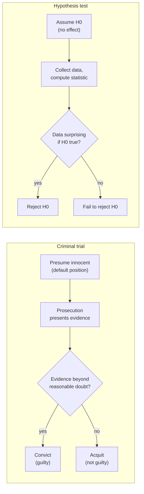
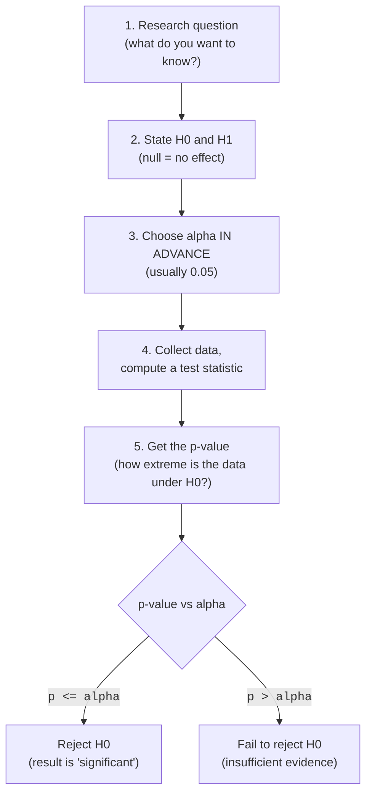
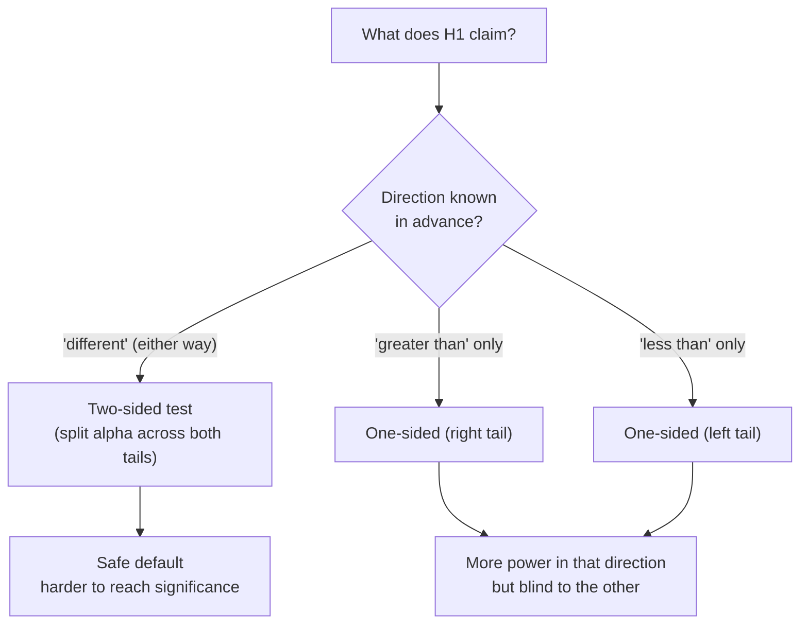

You ran an experiment. The new checkout flow converted at 11.4%, the old
one at 10.1%. The new flow *looks* better. Should you ship it?

Here is the trap. You already saw in *Why Statistics Matters* that two
groups drawn from the **exact same process** almost never produce the
exact same average. Random noise manufactures differences for free. So
"11.4% beats 10.1%" is not, by itself, evidence of anything. The real
question is the one this whole page is about:

> If there were truly *no* difference, how often would noise alone hand
> me a gap this big or bigger?

**Hypothesis testing** is the disciplined procedure for answering that.
It is the engine underneath A/B tests, clinical trials, quality control,
and almost every "is this real?" decision a data scientist makes.

<Figure
  slug="stat-hypothesis-testing-cutout"
  alt="A skeptical baseline curve on a platform with an observed marker pin standing far out in its thin tail"
/>

## The core idea: assume nothing is going on, then look for a contradiction

Hypothesis testing flips the burden of proof. Instead of trying to prove
your exciting idea is true, you start by *assuming the boring explanation*
and check whether the data is hard to reconcile with it.

<Figure
  slug="stat-hypothesis-testing-inline-cutout"
  alt="A plain assumption card standing on a bench with a stack of evidence chips growing beside it until the card tips over"
/>

The boring explanation has a name: the **null hypothesis**, written
H₀. It is the skeptic's default, "nothing is going on, the difference
is just chance, the coin is fair, the drug does nothing." Against it
stands the **alternative hypothesis**, H₁ (sometimes Hₐ), "there
*is* an effect."

| Hypothesis | What it says | Examples |
| --- | --- | --- |
| H₀ (null) | No effect, no difference, status quo | "The two flows convert equally." "μ = 100." |
| H₁ (alternative) | There is an effect or difference | "The new flow converts better." "μ ≠ 100." |

The whole procedure is a *proof by contradiction under uncertainty*. We
provisionally believe H₀, then ask: **if H₀ were true, would data
like mine be surprising?** If it would be very surprising, we conclude
H₀ is probably wrong and **reject** it. If the data is perfectly
ordinary under H₀, we have no grounds to abandon it, we **fail to
reject** it.

<Callout type="info" title="Why start from the skeptical hypothesis?">
Science and analytics work this way for the same reason courts presume
innocence: it is much easier to gather evidence that *contradicts* a
specific claim ("nothing is going on") than to directly *prove* a vague
one ("something is going on"). H₀ is specific enough to compute with,
it gives us an exact picture of what "just noise" looks like.
</Callout>

<Callout type="info" title="A true story: the lady tasting tea">
This whole framework traces to a 1935 afternoon described by the
statistician **R.A. Fisher**. A colleague, Muriel Bristol, claimed she
could taste whether the milk or the tea had been poured into the cup
first. Rather than argue, Fisher designed an experiment: present eight
cups, four poured each way, in random order, and count how many she
classified correctly. The null hypothesis was "she's guessing", and
under guessing, the number she'd get right by luck alone has an exact,
computable distribution. If a guesser would almost never do as well as
she did, that's evidence the skill is real. Fisher's write-up of this
tiny experiment became the textbook origin of the designed experiment
and null-hypothesis testing. (Bristol, the story goes, identified all
eight correctly.)
</Callout>

## The courtroom analogy

If you remember one mental model from this page, make it this one. A
hypothesis test is a trial, and the null hypothesis is the defendant.

The mapping is exact, and the most important cell is the bottom-right
one:

- **Presumption of innocence** = we assume H₀ until the data forces us
  off it.
- **Beyond reasonable doubt** = the significance level α, the bar
  the evidence must clear.
- **"Guilty"** = reject H₀.
- **"Not guilty"** = fail to reject H₀, and crucially, a "not guilty"
  verdict does **not** declare the defendant *innocent*. It says the
  prosecution did not meet the bar. The defendant may well have done it;
  the evidence just was not strong enough.

<Callout type="danger" title="The single biggest misconception: 'not guilty' is not 'innocent'">
**Failing to reject H₀ does not prove H₀ is true.** It means your
data was consistent with H₀, but it would often *also* be consistent
with a small real effect you did not have enough data to detect. "We
found no significant difference" never means "there is no difference." It
means "we could not rule out *no difference*." We will hammer this again
in *Errors and Power*, where you'll see exactly how a real effect can
hide behind a non-significant result.
</Callout>

## The five steps of every test

Whatever the scenario, comparing two means, testing a proportion,
checking a correlation, the skeleton is identical.

Let's unpack the two pieces that trip people up.

### The test statistic: collapsing your data into one surprising-or-not number

A **test statistic** is a single number that measures how far your data
sits from what H₀ predicts, in units of "ordinary noise." For
comparing two means it's the *t*-statistic, roughly:

`t = (observed difference) / (noise in that difference)`

A big `t` (far from zero) means the observed gap dwarfs the typical
random wiggle, surprising under H₀. A small `t` means the gap is the
kind of thing noise produces all the time. The test statistic is just a
ruler for surprise.

### The significance level α: the bar, chosen before you look

α is the threshold for "too surprising to be coincidence." By
convention it's often **0.05**, meaning: *if H₀ were true, I am willing
to wrongly reject it 5% of the time.* You choose α **before**
seeing the data, it encodes how much risk of a false alarm you'll
tolerate, not something you tune to get the answer you want.

<Callout type="warn" title="Set α before you peek, never after">
Choosing α (or your hypotheses) *after* seeing the data is a form
of cheating. If you let the data pick the threshold, you can always find
a story that clears the bar. Decide the rules of the game first, then
play. We will see in *P-values* how "looking until it's significant"
silently inflates your false-positive rate.
</Callout>

## A complete worked example, end to end

A nutrition app claims its users average **8,000** steps a day. You
suspect the real average is different. You pull a random sample of 40
users. Let's run the entire procedure.

**Step 1, Question.** Is the true average daily step count different
from 8,000?

**Step 2, Hypotheses.** This is a one-sample setup comparing a mean to a
fixed number:

- H₀: μ = 8000 (the claim holds)
- H₁: μ ≠ 8000 (the average is different, two-sided, because
  "different" could be higher or lower)

**Step 3, Significance level.** α = 0.05, fixed now, before we
compute anything.

**Steps 4 and 5, Compute and decide:**

<CodeBlock
  adapter="python"
  files={[
    {
      filename: "main.py",
      starterCode: `import numpy as np
from scipy import stats

rng = np.random.default_rng(11)

# A random sample of 40 users' daily step counts.
# (We simulate it; in real life this comes from your data.)
steps = rng.normal(loc=7600, scale=1800, size=40)

claimed_mean = 8000
alpha = 0.05

# One-sample t-test: is the sample mean far from 8000, relative to noise?
t_stat, p_value = stats.ttest_1samp(steps, popmean=claimed_mean)

print(f"Sample mean      : {steps.mean():.1f} steps")
print(f"Claimed mean (H0): {claimed_mean}")
print(f"t-statistic      : {t_stat:.3f}")
print(f"p-value          : {p_value:.4f}")
print()

if p_value <= alpha:
    print(f"p = {p_value:.4f} <= alpha = {alpha}  ->  REJECT H0")
    print("The data is hard to explain if the true mean were 8000.")
else:
    print(f"p = {p_value:.4f} >  alpha = {alpha}  ->  FAIL TO REJECT H0")
    print("The data is compatible with a true mean of 8000.")
`,
    },
  ]}
/>

**Interpretation in plain language.** The p-value is the probability of
seeing a sample mean *at least this far* from 8,000 if the true average
really were 8,000. If it lands below 0.05, we say: "a gap this large would
be unusual under the claim, so we doubt the claim." If it lands above
0.05, we say: "this is an ordinary amount of wiggle; we have no grounds to
dispute 8,000." Notice what we never say: we don't *prove* the average is
8,000, and we don't say *how much* it differs. The test answers one narrow
question, "is the data surprising under H₀?", and nothing more.

<Callout type="tip" title="Read the verdict out loud the right way">
Practice phrasing decisions like a careful analyst:

- Reject: *"There is statistically significant evidence that the average
  differs from 8,000 (p = 0.03)."*
- Fail to reject: *"We did not find significant evidence that the average
  differs from 8,000 (p = 0.21)."*

Never: *"We proved the average is 8,000."* Never: *"There is no
difference."*
</Callout>

### Seeing why a difference can be "not significant"

Run the next cell. Two groups are drawn from the **identical** process
(no real effect at all), yet their means differ, and the test correctly
*fails to reject* H₀ most of the time, because the gap is the size of
ordinary noise.

<CodeBlock
  adapter="python"
  files={[
    {
      filename: "main.py",
      starterCode: `import numpy as np
from scipy import stats

rng = np.random.default_rng(3)
alpha = 0.05

# Run the "same vs same" experiment 8 times.
print(f"{'trial':>5} {'mean A':>8} {'mean B':>8} {'p-value':>9}  decision")
for trial in range(1, 9):
    a = rng.normal(100, 15, size=50)
    b = rng.normal(100, 15, size=50)  # SAME truth as A
    p = stats.ttest_ind(a, b).pvalue
    decision = "reject" if p <= alpha else "fail to reject"
    print(f"{trial:>5} {a.mean():>8.2f} {b.mean():>8.2f} {p:>9.3f}  {decision}")

print()
print("There is no real difference anywhere. Most trials correctly")
print("fail to reject H0, but watch for the occasional false alarm.")
`,
    },
  ]}
/>

You will usually see "fail to reject", exactly what should happen when
H₀ is true. But run it enough and a "reject" sneaks through. That
occasional false alarm *is* the α = 0.05 risk made visible, and
it's the subject of *Errors and Power*.

## One-sided vs two-sided tests

Your alternative hypothesis comes in two flavors, and the choice changes
where you look for surprise.

- **Two-sided** (H₁: μ ≠ 8000): you care about a difference in
  *either* direction. Surprise lives in both tails. This is the safe
  default.
- **One-sided** (H₁: μ > 8000, or μ < 8000): you care about only
  one direction, decided **before** seeing data, for a substantive
  reason ("the drug can only help, or do nothing, it won't hurt").

The same 5% budget, spent two ways. Spending it all in one tail moves the
cutoff nearer, which is precisely why the choice has to be made in advance:

<Chart slug="one-vs-two-sided" />

<Callout type="warn" title="Don't switch to one-sided just to win">
A one-sided test makes it *easier* to reach significance in the chosen
direction, which is exactly why flipping to one-sided *after* seeing the
data trends your way is a classic form of p-hacking. Pick the side for a
scientific reason, in advance, or stay two-sided. `scipy.stats` tests are
two-sided by default; you opt into one-sided with `alternative='greater'`
or `alternative='less'`.
</Callout>

<CodeBlock
  adapter="python"
  files={[
    {
      filename: "main.py",
      starterCode: `import numpy as np
from scipy import stats

rng = np.random.default_rng(20)

# A sample whose mean sits a bit ABOVE the claimed value.
sample = rng.normal(105, 15, size=30)

two_sided = stats.ttest_1samp(sample, 100).pvalue
right_sided = stats.ttest_1samp(sample, 100, alternative="greater").pvalue

print(f"Sample mean: {sample.mean():.2f}")
print(f"Two-sided  p-value: {two_sided:.4f}")
print(f"One-sided  p-value: {right_sided:.4f}  (alternative='greater')")
print()
print("The one-sided p is roughly half the two-sided p when the data")
print("points the predicted way, which is why the direction must be")
print("chosen for a reason, not chosen to shrink the p-value.")
`,
    },
  ]}
/>

<MultipleChoice
  markdown={`A team analyzes their A/B test, sees the treatment did slightly *better*, and then runs a **one-sided** test (alternative = "greater") because it gives a smaller p-value than the two-sided test they had planned. Why is this a problem?

- One-sided tests are never valid and should not be used
  > One-sided tests are perfectly valid when the direction is chosen in advance for a substantive reason. The issue here is the *timing*, not the test itself.
- The p-value should be multiplied by two when going one-sided
  > Mechanically a one-sided p is often about half the two-sided p, not double. The objection is about choosing the direction after peeking, not about arithmetic.
- [o] The direction was chosen *after* seeing the data, which inflates the false-positive rate beyond the stated alpha
  > Letting the observed result pick the test direction means the procedure no longer controls the error rate it claims to. The hypothesis and its direction must be fixed before looking.
- Two-sided tests are always more powerful, so switching loses information
  > A one-sided test actually has *more* power in its chosen direction; power is not the concern here. The concern is choosing that direction post hoc.

Set the hypothesis and its direction before collecting or inspecting data.`}
/>

## When to use a hypothesis test, and when not to

Hypothesis testing is a precision tool, not a hammer for every nail.

**Reach for it when:**

- You have a specific yes/no claim to evaluate against a noisy sample
  ("did the new flow change conversion?").
- The decision is binary, ship or don't, investigate or drop it.
- You can state H₀ and H₁ *before* collecting data.

**Be cautious or look elsewhere when:**

- You mainly want to know *how big* an effect is, not just whether it's
  nonzero, there, a **confidence interval** and an **effect size** tell
  you far more (see *Confidence Intervals* and *Effect Sizes*).
- You're exploring data for patterns with no pre-specified hypothesis,
  testing dozens of things and keeping the "significant" ones is a recipe
  for false discoveries (*Statistical Fallacies*).
- The sample is so large that *any* trivial difference becomes
  "significant." Significance and importance are different questions.

<Callout type="danger" title="'Statistically significant' is not 'large' or 'important'">
A test can only tell you whether an effect is *distinguishable from
zero*, not whether it's *big enough to matter*. With 5 million users, a
0.001% lift in conversion will be wildly "significant" and completely
irrelevant to the business. Rejecting H₀ says "probably not exactly
zero", it says **nothing** about effect size. Always pair a test with a
confidence interval or an effect size to learn how much.
</Callout>

## Challenge 1, Make the decision

<ChallengeCard
  adapter="python"
  title="Reject or fail to reject?"
  instructions={`You are handed a pre-registered significance level and a p-value from a completed test. Apply the decision rule.

- A variable \`alpha\` (the significance level) and \`p_value\` are provided in the setup.
- Produce a string variable **\`decision\`** that is exactly **\`"reject H0"\`** if the result is statistically significant, and exactly **\`"fail to reject H0"\`** otherwise.
- Use the standard rule: reject when \`p_value <= alpha\`.

Remember the convention: when the p-value is on the boundary (equal to alpha), we reject.`}
  files={[
    {
      filename: "main.py",
      initCode: `alpha = 0.05
p_value = 0.032`,
      starterCode: `# TODO: set decision to "reject H0" or "fail to reject H0"
decision = None
`,
      solutionCode: `decision = "reject H0" if p_value <= alpha else "fail to reject H0"
print(decision)
`,
    },
  ]}
  tests={[
    {
      id: "type",
      name: "decision is a string",
      description: "Returns a string verdict",
      code: `assert isinstance(decision, str)`,
    },
    {
      id: "wording",
      name: "decision uses the expected wording",
      description: "Either 'reject H0' or 'fail to reject H0'",
      code: `assert decision in ("reject H0", "fail to reject H0")`,
    },
    {
      id: "logic",
      name: "decision matches the rule",
      description: "Compares p_value to alpha correctly",
      code: `expected = "reject H0" if p_value <= alpha else "fail to reject H0"
assert decision == expected`,
    },
    {
      id: "boundary",
      name: "boundary case rejects",
      description: "p exactly equal to alpha should reject",
      code: `_d = "reject H0" if (0.05) <= (0.05) else "fail to reject H0"
assert _d == "reject H0"`,
    },
  ]}
/>

## Challenge 2, Run the test yourself

<ChallengeCard
  adapter="python"
  title="Two-sample t-test from raw data"
  instructions={`A call center A/B tests a new script. You have handle times (in minutes) for the **control** and **treatment** groups. Test whether the two group means differ.

- Use \`scipy.stats\` to run a **two-sample, two-sided** t-test comparing \`control\` and \`treatment\`.
- Store the test statistic as a float **\`t_stat\`** and the p-value as a float **\`p_value\`**.
- Then set a boolean **\`significant\`** to whether the result is significant at \`alpha = 0.05\` (i.e. \`p_value <= alpha\`).

You do not need to compute anything by hand, pick the right \`scipy.stats\` function and read off its two outputs.`}
  files={[
    {
      filename: "main.py",
      initCode: `import numpy as np
from scipy import stats

rng = np.random.default_rng(77)
control   = rng.normal(7.5, 2.0, size=120)   # minutes per call
treatment = rng.normal(6.8, 2.0, size=120)
alpha = 0.05`,
      starterCode: `# TODO: run a two-sample t-test; set t_stat, p_value (floats) and significant (bool)
t_stat = None
p_value = None
significant = None
`,
      solutionCode: `result = stats.ttest_ind(control, treatment)
t_stat = float(result.statistic)
p_value = float(result.pvalue)
significant = bool(p_value <= alpha)
print(t_stat, p_value, significant)
`,
    },
  ]}
  tests={[
    {
      id: "types",
      name: "t_stat and p_value are floats",
      description: "Both outputs are numeric",
      code: `assert isinstance(t_stat, float) and isinstance(p_value, float)`,
    },
    {
      id: "pvalue_matches",
      name: "p_value matches scipy's two-sample t-test",
      description: "Used ttest_ind on control vs treatment",
      code: `from scipy import stats
expected = float(stats.ttest_ind(control, treatment).pvalue)
assert abs(p_value - expected) < 1e-9`,
    },
    {
      id: "stat_matches",
      name: "t_stat matches scipy",
      description: "Statistic agrees in magnitude",
      code: `from scipy import stats
expected = float(stats.ttest_ind(control, treatment).statistic)
assert abs(abs(t_stat) - abs(expected)) < 1e-9`,
    },
    {
      id: "significant_flag",
      name: "significant is the correct boolean",
      description: "p_value <= alpha",
      code: `assert isinstance(significant, bool)
assert significant == bool(p_value <= alpha)`,
    },
  ]}
/>

## Common misconceptions, gathered

<Callout type="danger" title="Five things hypothesis testing does NOT do">
1. **It does not prove H₀.** "Fail to reject" means insufficient
   evidence, not "no effect." (The not-guilty verdict.)
2. **It does not give you the probability that H₀ is true.** The p-value
   assumes H₀ and measures the data, it is not P(H₀ | data).
   That's the focus of *P-values*.
3. **It does not measure effect size.** A tiny p-value can come from a
   huge sample detecting a microscopic effect.
4. **Significance is not importance.** "Distinguishable from zero" is not
   "big enough to act on."
5. **You can't choose α or the hypotheses after peeking.** The rules
   are set before the data is seen.
</Callout>

## Check your understanding

<MultipleChoice
  markdown={`What is the null hypothesis $H_0$ in a typical A/B test comparing conversion rates?

- The experiment was run correctly
  > Whether the experiment was run correctly is an assumption behind the test, not the statistical hypothesis being evaluated.
- The new variant has a higher conversion rate than the control
  > This is a directional *alternative* hypothesis, not the null. The null is the skeptical "no difference" baseline.
- [o] The two variants have the same conversion rate, any observed difference is just chance
  > The null is the skeptical default that nothing is going on, stated specifically enough to compute what "pure noise" would look like.
- The sample size is large enough to detect an effect
  > Sample-size adequacy relates to power, not to the null hypothesis being tested.

The null is always the "no effect / status quo" claim you try to contradict.`}
/>

<MultipleChoice
  markdown={`A test yields p = 0.42 at $\alpha = 0.05$. Which statement is the most accurate conclusion?

- We should accept $H_0$ as true
  > Careful practice says "fail to reject," never "accept." Accepting $H_0$ overstates what the test can show.
- [o] We failed to reject $H_0$; the data did not provide significant evidence of an effect, but an effect could still exist undetected
  > Failing to reject is the "not guilty" verdict, the evidence did not clear the bar, which leaves open the possibility of a real but undetected effect.
- The probability the null is true is 0.42
  > The p-value is computed *assuming* the null is true; it is not the probability that the null is true.
- We have proven there is no effect
  > A non-significant result never proves the null. It means the data is compatible with $H_0$, not that $H_0$ is established as true.

"Fail to reject" is an absence of evidence, not evidence of absence.`}
/>

<MultipleChoice
  markdown={`Why do we fix the significance level $\alpha$ *before* collecting data?

- [o] Because choosing the threshold after seeing the data lets you tune it to get the verdict you want, which destroys the error guarantee
  > Fixing the decision rule in advance is what keeps the false-positive rate at the level you claim; setting it afterward is a form of cheating.
- Because a smaller $\alpha$ always gives a better test
  > A smaller $\alpha$ reduces false positives but increases false negatives, it is a tradeoff, not a strict improvement, and it is unrelated to the timing question.
- Because the p-value cannot be computed otherwise
  > The p-value can be computed regardless of $\alpha$; $\alpha$ is only the threshold you compare it against.
- Because $\alpha$ must always equal 0.05 by law
  > 0.05 is a common convention, not a requirement; fields use 0.01, 0.10, and others. The reason for fixing it early is about avoiding bias, not a mandated value.

Decide the rules of the game before you play.`}
/>

<MultipleChoice
  markdown={`A study on 4 million users finds the new homepage increases time-on-site by 0.3 seconds, p < 0.0001. What is the right takeaway?

- We should reject the result and gather a smaller sample
  > Shrinking the sample to make a real effect "disappear" would be deliberately weakening the analysis, which is not a sound reason.
- The effect is enormous because the p-value is so tiny
  > A tiny p-value reflects strong evidence the effect is *nonzero*, not that it is large. With millions of users, even trivial effects produce minuscule p-values.
- The result is invalid because the sample is too big
  > A large sample is a strength for precision, not a flaw. The issue is interpreting significance as importance.
- [o] The effect is almost certainly real but likely too small to matter; significance and practical importance are different questions
  > Huge samples make tiny effects detectable, so a microscopic p-value can accompany a negligible real-world change. Judge importance with effect sizes, not p-values.

A test tells you whether an effect is distinguishable from zero, never whether it is big enough to act on.`}
/>

<MultipleChoice
  markdown={`In the courtroom analogy, what does "fail to reject $H_0$" correspond to, and what does it mean?

- A mistrial, the test could not be run
  > Failing to reject is a definite outcome of a completed test, not a breakdown of the procedure.
- Proof of innocence, $H_0$ is established as true
  > Acquittal does not prove innocence, and failing to reject does not prove $H_0$. Both simply mean the evidence was insufficient.
- [o] A "not guilty" verdict, the evidence did not meet the bar, which is not the same as declaring innocence
  > A not-guilty verdict says the prosecution fell short of the standard of proof, leaving open that the defendant is guilty; likewise, failing to reject leaves open that a real effect exists.
- A "guilty" verdict, the defendant definitely did it
  > "Guilty" corresponds to *rejecting* $H_0$, the opposite outcome.

The asymmetry of the verdict is the whole point: you can reject $H_0$, but you can never confirm it.`}
/>

<MultipleChoice
  markdown={`You want to test whether a new fertilizer changes crop yield (it could plausibly help *or* hurt). Which test setup is appropriate?

- No test is needed; just compare the two averages
  > Comparing raw averages ignores whether the difference exceeds ordinary noise, which is exactly what the test evaluates.
- A one-sided test with $H_1: \mu > \mu_0$, because you hope it helps
  > Choosing a direction based on hope rather than a constraint is not justified, and it would miss a harmful effect entirely.
- A one-sided test with $H_1: \mu < \mu_0$, to be conservative
  > A left-sided test would be blind to a beneficial effect; "conservative" is not a reason to pick a direction that ignores half the possibilities.
- [o] A two-sided test with $H_1: \mu \neq \mu_0$, because the effect could go in either direction
  > When either direction is of interest and neither is ruled out in advance, a two-sided alternative is the appropriate, unbiased default.

Use two-sided unless a substantive constraint genuinely rules out one direction beforehand.`}
/>

## Key takeaways

<Callout type="success" title="What to carry forward">
- A hypothesis test asks one question: **would data like mine be
  surprising if the skeptical null H₀ were true?**
- Assume H₀, compute a **test statistic**, compare its **p-value** to a
  pre-chosen **α**, then **reject** or **fail to reject**.
- **Fail to reject is not "accept."** Absence of evidence is not evidence
  of absence (the not-guilty verdict).
- Choose **α and your hypotheses before** seeing the data; pick
  two-sided unless a real constraint justifies one-sided.
- A test tells you *whether* an effect is distinguishable from zero, never
  *how big* it is. For magnitude, you need *Confidence Intervals* and
  *Effect Sizes*.
- The mechanics of "how surprising?" are the subject of *P-values*, and
  the two ways a test can be wrong are the subject of *Errors and Power*.
</Callout>
