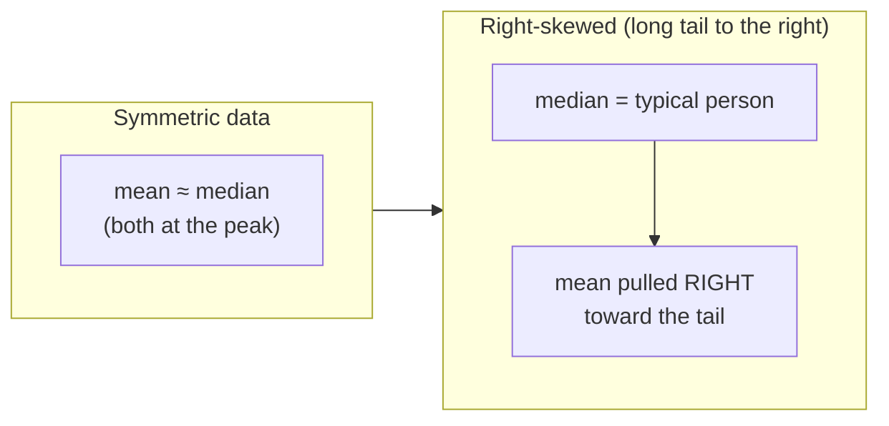
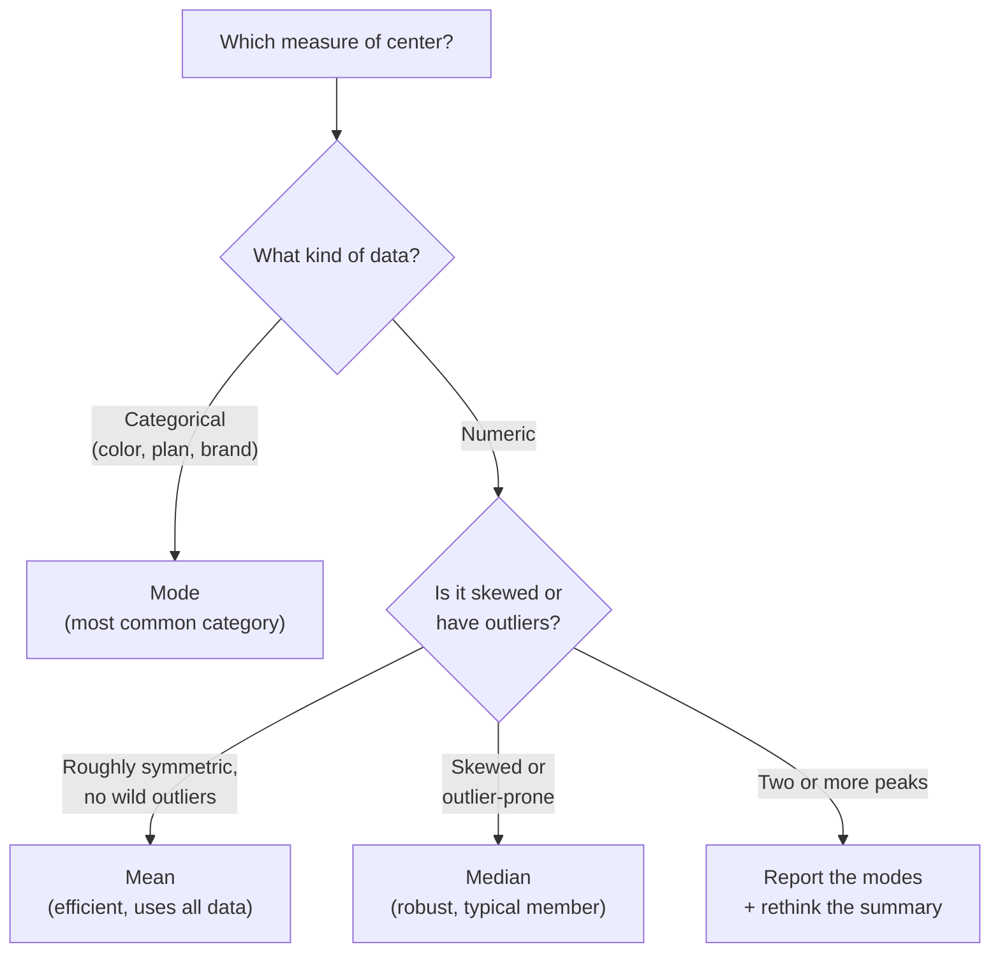

You have a column of numbers, salaries, response times, order values,
and someone asks the most innocent question in data science: "*what's
the typical value?*" That word "typical" is doing a lot of work. It
hides a choice between three different summaries, the **mean**, the
**median**, and the **mode**, that can disagree wildly. Picking the
wrong one is how a perfectly honest analyst ends up reporting a number
that no real person in the data would recognize.

A **measure of center** collapses a whole distribution down to one
number that's supposed to stand in for "the middle." The trouble is
that "the middle" isn't one idea. This page is about knowing which
center you're actually asking for, and when each one quietly lies.

<Figure
  slug="stat-measures-of-center-cutout"
  alt="A skewed mound of blocks on a platform with three differently coloured marker pins standing at three different positions"
/>

## The three centers, and what each one means

- **Mean** (the arithmetic average): add everything up, divide by the
  count. It's the balance point of the data, the spot where the values
  on either side exactly counterweight each other.
- **Median**: sort the values and take the middle one (or the average
  of the two middle ones). Half the data sits below it, half above. It
  answers "what's the value of the typical *member*?"
- **Mode**: the most frequently occurring value. It answers "what's the
  most *common* outcome?", the only one of the three that makes sense
  for categories like favorite color or payment method.

<CodeBlock
  adapter="python"
  files={[
    {
      filename: "main.py",
      starterCode: `import numpy as np
import pandas as pd
from scipy import stats

# Daily support tickets resolved by an agent over two weeks.
tickets = pd.Series([8, 9, 7, 8, 10, 9, 8, 11, 7, 8, 9, 12, 8, 10])

print("Mean   :", tickets.mean())  # arithmetic average
print("Median :", tickets.median())  # middle value
print("Mode   :", tickets.mode().tolist())  # most common value(s)

# scipy gives the mode plus how often it occurs
m = stats.mode(tickets, keepdims=False)
print(f"\\nMost common count is {m.mode} (happened {m.count} times)")
`,
    },
  ]}
/>

When data is roughly symmetric and has no extreme values, like that
ticket count, all three land in the same neighborhood, and the choice
barely matters. The interesting cases are when they *diverge*. That
divergence is not a nuisance; it's information about the shape of your
data.

<Chart slug="skew-mean-median-mode" />

<Callout type="info" title="They agree only when the data is symmetric">
For a perfectly symmetric, single-peaked distribution, the mean,
median, and mode all coincide. The further apart they drift, the more
**skewed** your data is, so the gap between mean and median is itself a
quick read on shape (which we explore in *Shape and Outliers*).
</Callout>

## Where the mean lies: skew and outliers

The mean's defining property, it's the balance point, is also its
weakness. A balance point is dragged toward heavy values, no matter how
few of them there are. One billionaire in a room of teachers pulls the
*average* net worth into the millions, even though that number
describes nobody present. This is not a rare edge case; it's the
default for money, sizes, durations, and counts, which are almost all
**right-skewed** (a long tail stretching toward large values).

<CodeBlock
  adapter="python"
  files={[
    {
      filename: "main.py",
      starterCode: `import numpy as np
import pandas as pd

# Annual salaries (in thousands) for a small company.
salaries = pd.Series([42, 45, 48, 50, 52, 55, 58, 60, 62, 65])

print("Without the CEO:")
print(f"  Mean   = {salaries.mean():.1f}k")
print(f"  Median = {salaries.median():.1f}k")

# Now the CEO walks in earning 1,000k.
with_ceo = pd.concat([salaries, pd.Series([1000])], ignore_index=True)

print("\\nWith one CEO earning 1,000k:")
print(f"  Mean   = {with_ceo.mean():.1f}k   <- jumped by ~85k")
print(f"  Median = {with_ceo.median():.1f}k   <- barely moved")
`,
    },
  ]}
/>

Adding a single person moved the **mean** by tens of thousands but
nudged the **median** by almost nothing. That's the whole story in one
example: the median is **robust**, resistant to a handful of extreme
values, while the mean is **sensitive** to them. Neither is "right" in
the abstract; they answer different questions. But if you report the
mean salary of that company, you'll quote a number that's higher than
what almost everyone earns.

<Callout type="warn" title="Misconception: the mean is always 'the typical value'">
On skewed data the mean is *not* typical, it's pulled toward the long
tail and can sit above most of your observations. "Average household
income" is famously misleading for exactly this reason: a few very high
earners lift the mean well above what a middle household actually makes.
On right-skewed data, the **median** is usually the honest "typical."
</Callout>

<Callout type="warn" title="Misconception: 'average' always means the mean">
In everyday speech "the average" defaults to the mean, but statistically
*average* just means "a measure of center", the median and mode are
averages too. When a report says "the average user," always ask which
center they computed and whether the data is skewed.
</Callout>

## A quick MCQ before we go further

<MultipleChoice
  markdown={`A dataset of home prices in a neighborhood is strongly right-skewed: most homes are modest, but a few mansions sell for 10x the rest. A realtor wants to advertise the "typical" price. Which measure is the most honest summary?

- The mode, because it's the single most common price
  > Continuous prices rarely repeat exactly, so a mode is unstable and often meaningless for home prices unless values are heavily rounded.
- The mean, because medians throw away information
  > The median does ignore the magnitude of the extremes, but on skewed data that is a feature, not a flaw, it is what keeps the summary representative.
- The mean, because it uses every value in the data
  > Using every value is exactly why the mean gets dragged upward here, the few mansions pull it above what most homes cost, so it overstates the "typical" price.
- [o] The median, because half the homes are above it and half below, unaffected by the extreme high sales
  > On right-skewed price data the median reflects the middle home and ignores how extreme the top sales are, so it matches what a typical buyer would actually pay.

The gap between mean and median here is itself a signal that the data is skewed.`}
/>

<Chart slug="outlier-influence" />

## When each measure is the right tool

The decision is mostly about **data type** and **shape**:

- **Mode** is the only center that works for **categorical** data (you
  can't average "red" and "blue"), and it's the right call for asking
  "what's the most common outcome?" It also flags **multimodal** data,
  two peaks usually mean two groups mixed together, and *no* single
  center describes them well.
- **Mean** is the natural choice for **symmetric** numeric data with no
  extreme outliers. It uses every value, has convenient mathematical
  properties, and underlies most of the inference later in this course
  (the mean of a sample is what the *central limit theorem* is about).
- **Median** is the right call whenever data is **skewed** or
  **outlier-prone**: incomes, house prices, response times, file sizes,
  wait times. It answers "what does the middle case look like?"

<Callout type="tip" title="A practical habit: report both">
When you're unsure, compute the mean *and* the median and look at the
gap. If they're close, report the mean. If they diverge, that gap is
telling you the data is skewed, report the median as the headline and
mention the mean only with context. Showing both is often the most
honest move.
</Callout>

## Three useful variations (keep these light)

Most of the time, mean/median/mode are all you need. But three relatives
show up often enough to recognize:

**Trimmed mean.** Chop off a percentage from each end (say the top and
bottom 10%), then take the mean of what's left. It's a compromise: more
robust than the mean, but still uses most of the data. This is exactly
how Olympic judging and many sensor pipelines discard extremes before
averaging.

**Weighted mean.** When some observations count more than others,
larger stores, more-reliable sensors, bigger survey strata, give each a
weight. A company-wide average satisfaction score should weight each
team by headcount, not treat a 3-person team the same as a 300-person
one.

**Geometric mean.** For **rates, ratios, and growth factors** (returns,
percent changes, fold-changes), the *arithmetic* mean overstates
typical growth. The geometric mean multiplies the values and takes the
nth root, which is the correct "average factor" for things that
compound.

<CodeBlock
  adapter="python"
  files={[
    {
      filename: "main.py",
      starterCode: `import numpy as np
from scipy import stats

# Right-skewed incomes (in thousands), with a couple of high earners.
income = np.array([38, 41, 44, 47, 49, 52, 55, 60, 120, 400])

mean_ = np.mean(income)
median_ = np.median(income)
trimmed_10 = stats.trim_mean(income, 0.10)  # drop 10% from each end

print(f"Mean         : {mean_:.1f}k   (pulled up by the 400k earner)")
print(f"Median       : {median_:.1f}k")
print(f"10% trimmed  : {trimmed_10:.1f}k  (between the two)")

# Geometric mean: the right 'average' for growth factors.
# Yearly growth: +10%, -5%, +20%, +8%  ->  factors below.
factors = np.array([1.10, 0.95, 1.20, 1.08])
g = stats.gmean(factors)
print(f"\\nArithmetic mean of factors: {factors.mean():.4f}")
print(f"Geometric mean of factors : {g:.4f}  <- true average growth/yr")
print(
    f"Compounded over 4 yrs, gmean reproduces total: {g**4:.4f} = {np.prod(factors):.4f}"
)
`,
    },
  ]}
/>

Notice the last two lines: raising the **geometric mean** to the 4th
power exactly reproduces the total compounded growth, while the
arithmetic mean would not. That's the tell that you're in
geometric-mean territory, whenever the quantities *multiply* rather
than *add*.

<Callout type="info" title="When to reach for the geometric mean">
Use it for anything expressed as a rate or multiplier that compounds:
investment returns, population growth, "our traffic grew 3x then
0.5x then 2x." Averaging those with the arithmetic mean overstates
typical growth. For plain additive quantities (heights, temperatures,
dollars), stick with the arithmetic mean or median.
</Callout>

## Putting it together: a robust center summary

In real EDA you rarely report a single number, you report a small
*summary* and let the gaps between numbers tell you about shape. Here's
the pattern you'll reuse constantly: compute several centers at once and
read them together.

<CodeBlock
  adapter="python"
  files={[
    {
      filename: "main.py",
      starterCode: `import numpy as np
import pandas as pd
from scipy import stats

rng = np.random.default_rng(7)

# Simulate right-skewed customer order values ($), like most spend data.
orders = pd.Series(np.round(rng.lognormal(mean=3.2, sigma=0.6, size=500), 2))

summary = {
    "n": int(orders.size),
    "mean": round(float(orders.mean()), 2),
    "median": round(float(orders.median()), 2),
    "trimmed_10": round(float(stats.trim_mean(orders, 0.10)), 2),
    "mean_minus_median": round(float(orders.mean() - orders.median()), 2),
}

for k, v in summary.items():
    print(f"{k:>18}: {v}")

print("\\nmean > median => right-skewed; median is the 'typical' order.")
`,
    },
  ]}
/>

The positive `mean_minus_median` is your skew alarm. When it's large
and positive, lead with the median.

<ChallengeCard
  adapter="python"
  title="Build a robust center summary"
  instructions={`You're given a pandas Series \`prices\` of right-skewed product prices. Build a summary you can trust on skewed data.

Compute a dictionary called **\`result\`** with exactly these keys (all values plain Python \`float\`):

- \`"mean"\`, the arithmetic mean
- \`"median"\`, the median
- \`"trimmed_mean"\`, the **10% trimmed mean** (drop 10% from each end) using \`scipy.stats.trim_mean\`
- \`"skew_gap"\`, \`mean\` minus \`median\`

Then set a boolean **\`report_median\`** to \`True\` if \`skew_gap\` is greater than \`0\` (i.e. right-skewed, so the median is the more honest headline), else \`False\`.

Use the provided \`prices\` Series.`}
  files={[
    {
      filename: "main.py",
      initCode: `import numpy as np
import pandas as pd
from scipy import stats

rng = np.random.default_rng(123)
prices = pd.Series(np.round(rng.lognormal(mean=2.8, sigma=0.7, size=400), 2))`,
      starterCode: `# TODO: build the dict 'result' and the bool 'report_median'
result = {
    "mean": None,
    "median": None,
    "trimmed_mean": None,
    "skew_gap": None,
}
report_median = None
`,
      solutionCode: `mean_ = float(prices.mean())
median_ = float(prices.median())
trimmed_ = float(stats.trim_mean(prices, 0.10))

result = {
    "mean": mean_,
    "median": median_,
    "trimmed_mean": trimmed_,
    "skew_gap": mean_ - median_,
}
report_median = bool(result["skew_gap"] > 0)
print(result)
print("report_median:", report_median)
`,
    },
  ]}
  tests={[
    {
      id: "keys",
      name: "result has the right keys",
      description: "Dict has mean, median, trimmed_mean, skew_gap",
      code: `assert isinstance(result, dict)
assert set(result.keys()) == {"mean", "median", "trimmed_mean", "skew_gap"}`,
    },
    {
      id: "floats",
      name: "all values are floats",
      description: "Every value is a Python float",
      code: `assert all(isinstance(v, float) for v in result.values())`,
    },
    {
      id: "mean_median",
      name: "mean and median are correct",
      description: "Match pandas",
      code: `import numpy as np
assert abs(result["mean"] - float(prices.mean())) < 1e-6
assert abs(result["median"] - float(prices.median())) < 1e-6`,
    },
    {
      id: "trimmed",
      name: "trimmed mean is correct",
      description: "Matches scipy trim_mean at 10%",
      code: `from scipy import stats
assert abs(result["trimmed_mean"] - float(stats.trim_mean(prices, 0.10))) < 1e-6`,
    },
    {
      id: "gap_flag",
      name: "skew_gap and report_median agree",
      description: "skew_gap is mean - median, flag is correct",
      code: `assert abs(result["skew_gap"] - (result["mean"] - result["median"])) < 1e-9
assert report_median == (result["skew_gap"] > 0)`,
    },
  ]}
/>

## Check your understanding

<MultipleChoice
  markdown={`You compute the mean monthly spend of your users as \\$84 and the median as \\$41. What is the most defensible reading of this gap?

- Half of all users spend exactly \\$84
  > The mean is a balance point, not a value that half the users hit. It is the *median* (\\$41) that has half the users below and half above.
- The mean must be wrong because it should be close to the median
  > Nothing is wrong with the computation, a large mean–median gap is the normal, expected signature of skewed data, not an error.
- The data is left-skewed, so a few very low spenders pull the mean down
  > A mean far *above* the median indicates the opposite, a right skew with a tail of high values. Left skew would put the mean *below* the median.
- [o] The data is right-skewed; a minority of high spenders inflate the mean, so the median (\\$41) better reflects a typical user
  > When the mean sits well above the median, a long upper tail is dragging the mean up, so the median is the more representative "typical" value here.

A mean far above the median is one of the most common skew signals in real spend data.`}
/>

<MultipleChoice
  markdown={`A survey asks for respondents' favorite payment method (cash, credit, debit, mobile). Which measure of center even *makes sense* for this column?

- None of them; categorical data has no center
  > Categorical data does have a usable center, the mode, which answers "what is the most common category?"
- The mean of the four options
  > You cannot average category labels, there is no arithmetic meaning to "the average of cash and credit," so a mean is undefined here.
- [o] The mode, the most frequently chosen payment method
  > For unordered categorical data the mode is the only valid center, since it simply reports which category occurs most often.
- The median payment method
  > A median requires the values to be ordered from low to high; unordered categories like payment methods have no meaningful middle.

Mode is the go-to center whenever the values are labels rather than numbers.`}
/>

<MultipleChoice
  markdown={`An investment returns +50% one year and −50% the next. Someone reports the "average annual return" as 0% using the arithmetic mean. Why is the geometric mean the better tool here?

- [o] Returns compound multiplicatively, and \\$100 → \\$150 → \\$75 is a real *loss*; the geometric mean of the growth factors (1.5 and 0.5) captures that, while the arithmetic mean hides it
  > Because the money multiplies year over year, the correct "typical factor" comes from multiplying 1.5 and 0.5 and taking the square root (≈0.866), revealing the roughly 13% annual loss that 0% conceals.
- The geometric mean is just a more precise version of the arithmetic mean
  > They answer different questions; the geometric mean is not "more precise," it is the appropriate average specifically for rates and growth factors.
- The arithmetic mean of percentages is always undefined
  > The arithmetic mean is perfectly defined; the issue is that it is the *wrong* average for quantities that compound multiplicatively.
- Because percentages can be negative
  > Negative percentages are fine for the arithmetic mean; the real reason is that returns *compound*, so factors should be multiplied, not added.

Whenever quantities multiply to combine, the geometric mean, not the arithmetic mean, is the honest average.`}
/>

<MultipleChoice
  markdown={`Which statement about the **trimmed mean** is accurate?

- It is more sensitive to outliers than the ordinary mean
  > Trimming removes the most extreme values before averaging, which makes it *less* sensitive to outliers than the ordinary mean, not more.
- It is identical to the median
  > A trimmed mean drops a fraction from each end and averages the rest; the median is the extreme case of trimming nearly everything, but a 10% trimmed mean still uses 80% of the data.
- [o] It discards a fixed percentage of the smallest and largest values, then averages what remains, a middle ground between mean and median in robustness
  > By cutting off both tails before averaging, it keeps much of the mean's efficiency while gaining resistance to extreme values, sitting between the two.
- It can only be used on symmetric data
  > It is especially useful on skewed or outlier-prone data; symmetry is not a requirement for trimming the tails.

The trimmed mean is a practical compromise when you want robustness without fully discarding magnitude information.`}
/>

<Callout type="success" title="Key takeaways">
- **Mean** = balance point; uses all data; great for symmetric data but
  dragged around by skew and outliers.
- **Median** = middle value; robust; the honest "typical" for skewed
  data like income, prices, and durations.
- **Mode** = most common value; the only center for categorical data and
  a flag for multimodality.
- The **gap between mean and median** is a free read on skew, when they
  diverge, lead with the median.
- Reach for the **geometric mean** for compounding rates and the
  **trimmed/weighted mean** when you need robustness or unequal weights.
</Callout>
